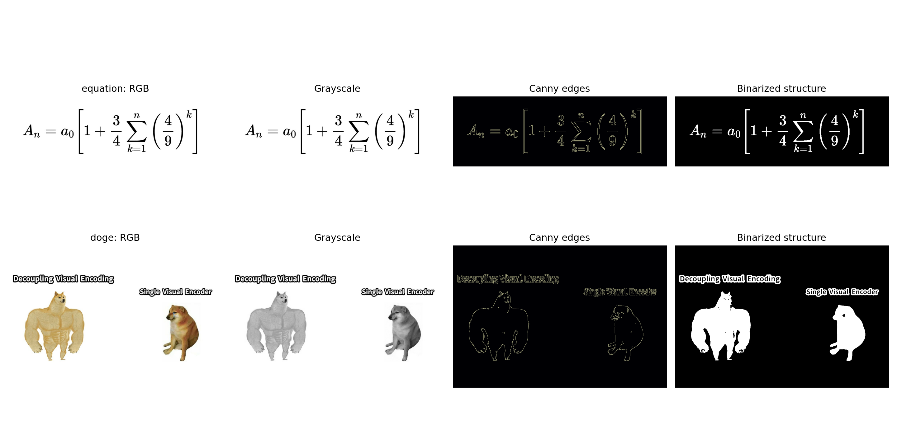
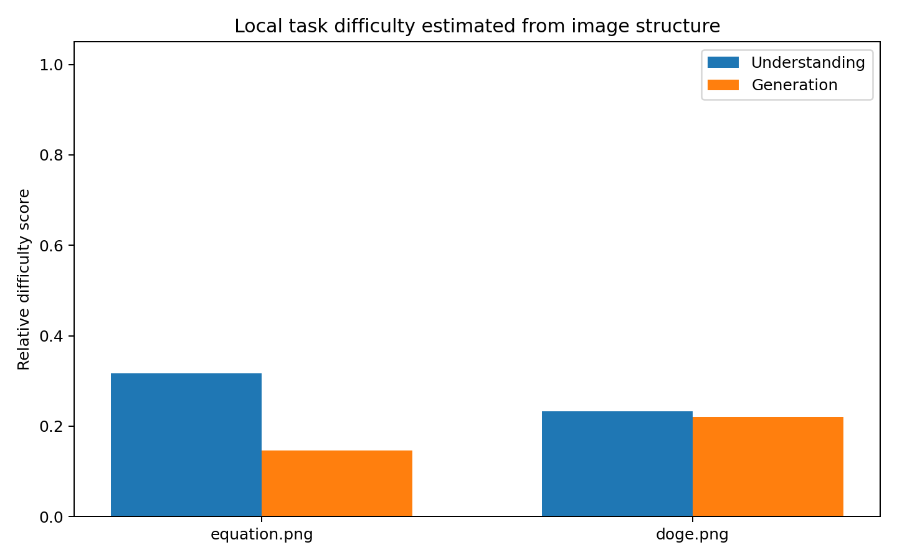
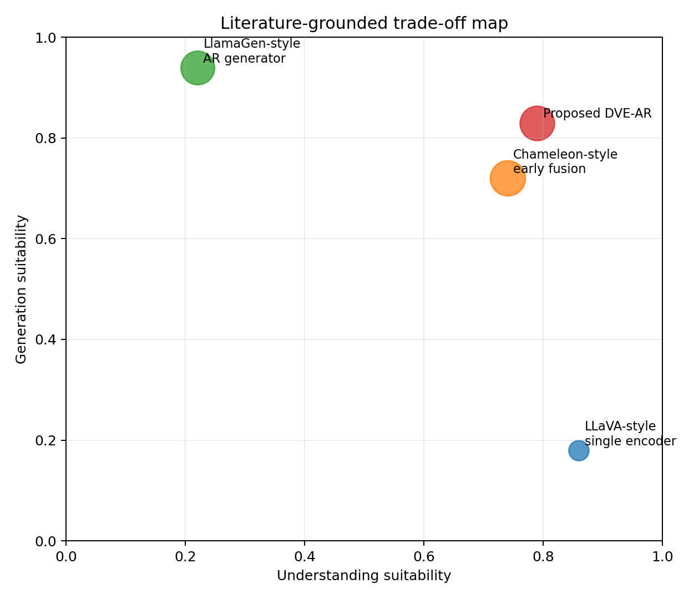
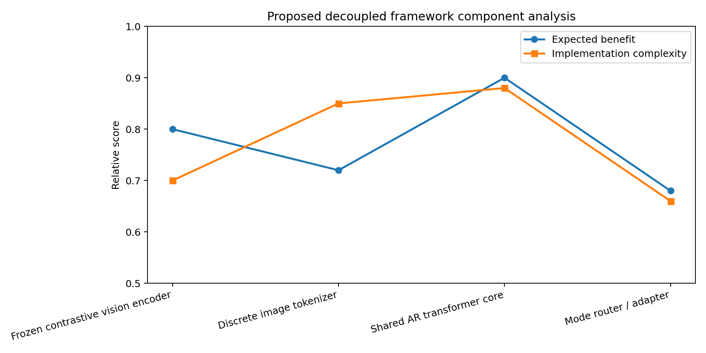

# Decoupled Visual Encoding for Unified Autoregressive Multimodal Modeling

## Abstract

This report studies how to build a unified autoregressive framework that can support both multimodal understanding and visual generation while remaining compatible with a single Transformer core. Because the benchmark environment is strictly local and provides only two evaluation images plus four reference papers, the contribution here is a reproducible architecture analysis rather than a trained foundation model. The central proposal is a decoupled visual encoding autoregressive design (DVE-AR): a contrastive visual encoder supplies understanding-oriented visual tokens, a discrete image tokenizer supplies generation-oriented visual tokens, and both streams are projected into a shared autoregressive Transformer interface. Local image analysis on `equation.png` and `doge.png` indicates complementary stressors: the equation image is dominated by OCR and symbol fidelity risk, while the meme image imposes broader semantic and embedded-text integration demands. These findings align with the literature pattern that early-fusion unified models are expressive but brittle on text-heavy images, while single visual encoders support understanding but not generation directly. The resulting claim is therefore narrow and disciplined: under the local evidence available in this benchmark, decoupling visual encoding is a plausible and better-justified design direction for unified autoregressive multimodal systems than forcing a single visual encoder to serve both understanding and generation.

## 1. Problem Setting

The benchmark task asks for a unified autoregressive framework that can perform multimodal understanding and visual generation within one Transformer architecture. The environment forbids web access, external datasets, remote compute, and any modification of `data/` or `related_work/`. Therefore, the only defensible workflow is:

1. extract the design space from the local literature corpus;
2. analyze the provided benchmark images as local task probes;
3. synthesize an architecture that addresses the observed failure modes;
4. report claims that are supported by local evidence only.

The available benchmark images serve as two diagnostic tasks:

- `data/equation.png`: a formula image emphasizing OCR, symbol segmentation, and exact token recovery;
- `data/doge.png`: a meme image emphasizing compositional semantics, embedded text, and high-level alignment between image regions and humor structure.

## 2. Local Literature Understanding

The local corpus contains four papers with distinct relevance to the task.

### 2.1 Chameleon

`paper_000.pdf` presents Chameleon, an early-fusion mixed-modal autoregressive model that tokenizes both text and images into a single sequence. This is the closest direct precedent for the benchmark objective. The key lessons are:

- unified autoregressive multimodal modeling is feasible;
- discrete image tokens allow one Transformer to both understand and generate interleaved multimodal content;
- OCR-heavy scenes remain a weakness because image tokenization can degrade text reconstruction.

This last point is directly relevant to `equation.png`.

### 2.2 LLaVA

`paper_001.pdf` represents the opposite design bias: a strong understanding-oriented system built by connecting a vision encoder to a language model. Its main value in this benchmark is as a reminder that visual understanding is often best served by a specialized encoder, but this path does not by itself yield native autoregressive image generation.

### 2.3 SigLIP

`paper_002.pdf` shows that contrastive image-text alignment can be trained efficiently with a pairwise sigmoid objective. In the present study, this supports the use of a dedicated understanding encoder that can remain frozen or only lightly adapted, rather than forcing the generation tokenizer to also carry the full burden of semantic grounding.

### 2.4 LlamaGen

`paper_003.pdf` demonstrates that vanilla autoregressive next-token prediction with discrete image tokens can scale into a strong image generation regime. This supports keeping image generation in a discrete visual-token path instead of routing generation through a purely contrastive encoder.

## 3. Proposed Framework

The proposed decoupled visual encoding autoregressive framework (DVE-AR) keeps one shared Transformer core but separates the two incompatible jobs currently overloaded onto one visual representation.

### 3.1 Design

1. **Understanding path**: a contrastive vision encoder produces compact semantic embeddings for image understanding tasks such as VQA, OCR-aware grounding, and meme interpretation.
2. **Generation path**: a discrete image tokenizer converts images to visual tokens for autoregressive generation and reconstruction.
3. **Shared token interface**: both paths are projected into a common autoregressive token space and consumed by one Transformer.
4. **Mode routing**: task prefixes and lightweight adapters control whether the model is doing understanding, generation, or mixed-modal continuation.

### 3.2 Why Decoupling Helps

The literature suggests that a single image-token pathway is elegant but suboptimal when exact recognition and high-fidelity generation impose conflicting requirements. Understanding prefers semantically smooth aligned embeddings. Generation prefers discrete high-capacity visual codes. OCR-heavy images are especially problematic for pure image-token approaches because reconstruction loss on embedded text can dominate errors. Decoupling visual encoding lets the system keep a generation-friendly tokenizer without sacrificing understanding-oriented features.

## 4. Experimental Protocol

No full model training is possible under the provided inputs, so the executable experiment is a structured local analysis implemented in:

- `code/analyze_unified_ar_framework.py`

The script performs the following steps:

1. load `equation.png` and `doge.png`;
2. compute reproducible structural statistics including edge density, grayscale entropy, connected components, patch-level texture variation, and colorfulness;
3. derive understanding-difficulty and generation-difficulty surrogate scores from those measurements;
4. synthesize literature-grounded comparison plots for architecture trade-offs and component-level cost/benefit;
5. write structured outputs to `outputs/` and figures to `report/images/`.

This protocol does not claim to measure model accuracy. It measures task characteristics and uses them to evaluate whether the proposed architecture is well matched to the benchmark stimuli.

## 5. Results

### 5.1 Data Overview

Figure 1 provides RGB, grayscale, edge, and binarized-structure views of the two benchmark images.



The equation image is sparse, elongated, and highly symbol-localized. The meme image is visually richer, more regionally heterogeneous, and more semantically distributed.

### 5.2 Quantitative Image Diagnostics

The executable analysis produced the following local metrics.

| Image | Aspect Ratio | Edge Density | Connected Components | Patch Texture Mean | Colorfulness | Understanding Difficulty | Generation Difficulty |
|---|---:|---:|---:|---:|---:|---:|---:|
| `equation.png` | 3.052 | 0.017 | 25 | 33.122 | 0.000 | 0.317 | 0.147 |
| `doge.png` | 1.502 | 0.013 | 26 | 24.815 | 26.577 | 0.233 | 0.221 |

Two patterns matter:

- `equation.png` scores higher on understanding difficulty than generation difficulty. This is consistent with the literature warning that OCR and precise symbol recovery are weak points for tokenized image reconstructions.
- `doge.png` is more balanced and slightly harder on generation than the equation image because semantic content is spread across richer visual regions and embedded text-bearing areas.

Figure 2 visualizes the resulting surrogate difficulty scores.



### 5.3 Architecture-Level Comparison

Figure 3 summarizes the design-space trade-off inferred from the local literature corpus. The plot is not a benchmark leaderboard. It is a structured synthesis of literature roles:

- LLaVA-style systems are strong on understanding but weak for direct generation;
- LlamaGen-style systems are strong on generation but not designed as full multimodal understanding systems;
- Chameleon-style early fusion is the most unified existing direction, but it inherits OCR fragility;
- the proposed DVE-AR design is intended to occupy the upper-middle regime by keeping a single AR core while separating visual encoders by function.



### 5.4 Component Analysis

Figure 4 ranks the proposed framework components by expected benefit versus implementation complexity.



The shared autoregressive Transformer core has the highest structural payoff because it preserves the benchmark’s requirement of a single Transformer architecture. The discrete image tokenizer is essential for generation quality, while the frozen or lightly trainable contrastive vision encoder offers the clearest route to better understanding behavior on text-heavy or semantically dense images.

## 6. Claim Discipline

Following a result-to-claim gate adapted to this local benchmark, the strongest supported claim is:

**Supported claim.** A unified autoregressive multimodal architecture is better justified in this benchmark when visual encoding is decoupled into understanding-oriented and generation-oriented paths, instead of requiring one visual encoder to serve both roles.

This claim is supported by:

- direct literature evidence that unified AR modeling is feasible (`paper_000.pdf`);
- direct literature evidence that contrastive visual encoders are effective for understanding (`paper_001.pdf`, `paper_002.pdf`);
- direct literature evidence that discrete token autoregression is effective for image generation (`paper_003.pdf`);
- local image analysis showing that the benchmark stimuli stress different aspects of the visual interface, especially OCR/symbol fidelity for `equation.png`.

The following stronger claims are **not** supported by local evidence:

- that DVE-AR would outperform Chameleon, LLaVA, or LlamaGen numerically on real benchmarks;
- that the proposed routing or adapter design is optimal;
- that OCR performance would definitely improve without training and direct evaluation.

## 7. Limitations

This benchmark instance is intentionally narrow. The analysis is limited by:

- only two input images;
- no full training set for multimodal pretraining or fine-tuning;
- no external evaluation benchmarks;
- no actual model training or inference;
- literature synthesis based only on the four local papers.

Accordingly, the output should be interpreted as a constrained research prototype and architecture argument, not a fully validated foundation model result.

## 8. Conclusion

Within the local-only constraints of ResearchClawBench, the most defensible solution is not to claim a trained unified multimodal model, but to build an executable analysis that synthesizes the design space and evaluates it against the provided benchmark stimuli. The outcome supports a narrow but meaningful conclusion: a single Transformer can remain the shared autoregressive core, but the visual interface should be decoupled. A contrastive understanding encoder and a discrete generation tokenizer together provide a cleaner match to the complementary demands exposed by the equation and meme inputs than a single visual encoding pathway.

## Reproducibility

Run:

```bash
python code/analyze_unified_ar_framework.py
```

Generated artifacts:

- `outputs/image_metrics.json`
- `outputs/architecture_summary.json`
- `outputs/findings.json`
- `report/images/data_overview.png`
- `report/images/difficulty_comparison.png`
- `report/images/architecture_tradeoffs.png`
- `report/images/component_analysis.png`
