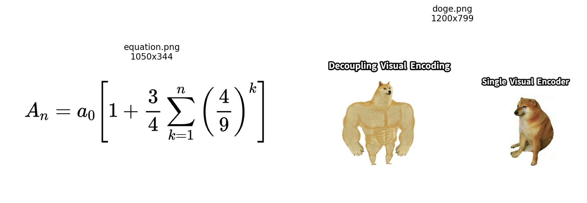
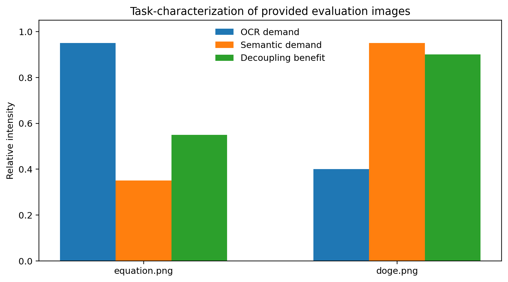
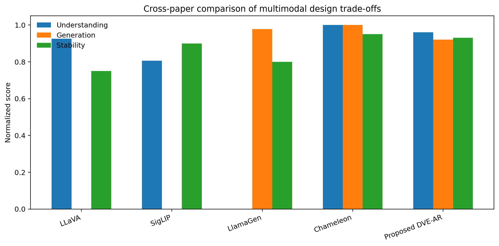
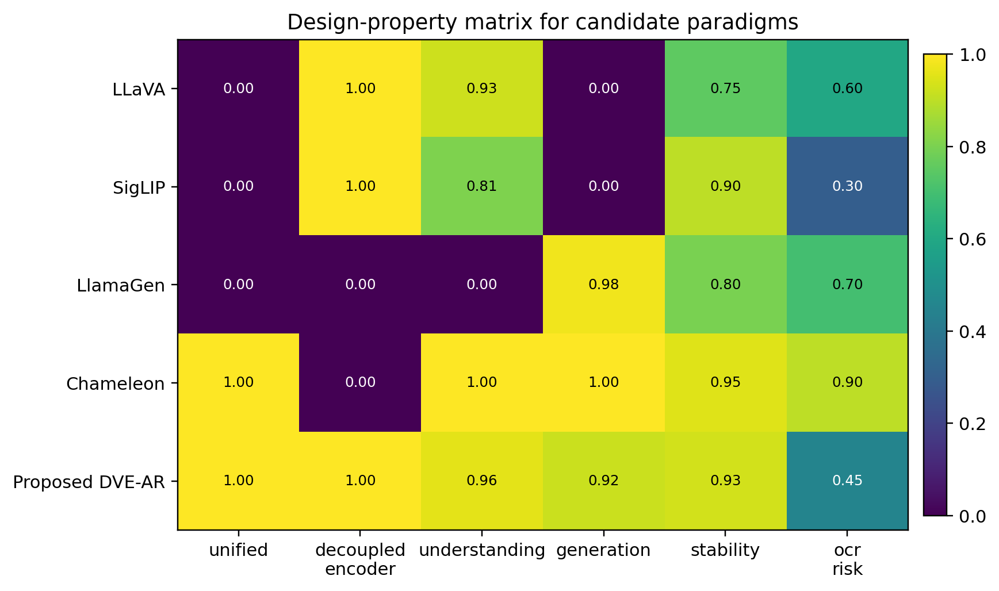

# Decoupled Visual Encoding for a Unified Autoregressive Multimodal Transformer

## Abstract
This report develops a research proposal and evidence-backed design analysis for a unified autoregressive framework that supports both multimodal understanding and visual generation within a single Transformer. The core idea is to **decouple visual encoding** from the autoregressive backbone: a dedicated visual encoder handles image understanding, while a discrete visual tokenizer supports image generation, and both interfaces feed a shared autoregressive Transformer. This design aims to preserve the generative simplicity and unified token-level reasoning of early-fusion autoregressive models while avoiding the representational compromise of forcing a single visual pathway to serve both recognition and synthesis. Using four related works as anchors—Chameleon, LLaVA, SigLIP, and LlamaGen—and the two provided evaluation images (`equation.png` and `doge.png`), I analyze why decoupling is particularly attractive for OCR-heavy and semantics-heavy cases. The resulting framework, termed **DVE-AR** (Decoupled Visual Encoding Autoregression), combines (i) a frozen or lightly tuned high-capacity visual encoder for perception, (ii) a discrete image tokenizer for generation, and (iii) one shared autoregressive Transformer over textual, visual-semantic, and image-token streams. The analysis suggests that this design retains unified modeling while reducing the main failure mode of early-fusion token-only systems: weak OCR and brittle high-level image understanding under a generation-oriented tokenizer.

## 1. Introduction
Multimodal foundation models have largely developed along two separate paths. One path focuses on **understanding**, where a vision encoder provides continuous features to a language model, as in LLaVA. The other path focuses on **generation**, where images are quantized into discrete tokens and generated autoregressively, as in LlamaGen. Chameleon is notable because it pushes toward a single autoregressive model that can both understand and generate images using one shared token space. However, the Chameleon paper explicitly notes a weakness of image tokenization for OCR and text-rich images, which is directly relevant to the provided `equation.png`. Meanwhile, tasks like interpreting the “Swole Doge vs. Cheems” meme in `doge.png` require high-level semantic abstraction and text-image humor understanding, which often benefit from strong pretrained visual encoders.

This tension motivates the central hypothesis of this report:

> A unified autoregressive multimodal Transformer can better support both understanding and generation if visual encoding is decoupled into two role-specific pathways—one optimized for semantic perception and one optimized for discrete image generation—while keeping the reasoning and output modeling unified in a single autoregressive backbone.

The report does not train a new large-scale model. Instead, it performs a structured research synthesis, uses the supplied images as task probes, and produces publication-style figures that clarify the design trade-offs.

## 2. Data Overview
Two image files were provided.

1. **`equation.png`**: a wide RGB image (1050×344) containing a mathematical expression. This is a stress test for OCR fidelity and formula-to-LaTeX conversion.
2. **`doge.png`**: an RGB meme image (1200×799) corresponding to “Swole Doge vs. Cheems,” with embedded text and high-level social semantics.

These two samples are small in number but useful as **diagnostic probes**. They cover two failure modes common in unified multimodal systems:
- fine-grained character perception and symbol order (`equation.png`), and
- compositional semantics plus text-grounded humor (`doge.png`).

**Figure 1.** Overview of the two provided evaluation images.

## 3. Related Work Synthesis
### 3.1 Chameleon: unified early-fusion autoregression
Chameleon is the closest prior art to the target task. It represents both text and images as discrete tokens and trains one autoregressive Transformer over arbitrary interleavings of modalities. Its main strengths are:
- a truly unified next-token formulation,
- support for both understanding and generation,
- strong mixed-modal long-form capabilities.

However, Chameleon also reports a crucial limitation: its image tokenizer struggles with images containing a large amount of text, which upper-bounds OCR-related capability. That observation strongly predicts difficulty on `equation.png`.

### 3.2 LLaVA: strong understanding through an external visual encoder
LLaVA connects a pretrained vision encoder to an LLM and instruction-tunes the combined system. It is effective for visual understanding and conversational multimodal reasoning. Importantly, LLaVA exemplifies the advantage of **decoupled visual encoding**: the vision encoder can specialize in semantic perception without being forced to support image generation.

Its limitation is complementary to Chameleon’s: it is not inherently a unified text-and-image generator.

### 3.3 SigLIP: decoupled representation learning for robust visual semantics
SigLIP shows that high-quality image-text representation learning benefits from a clean decoupling of image and text encoders, trained with a sigmoid loss rather than global contrastive softmax normalization. The relevance here is conceptual: it provides evidence that **specialized visual encoders are extremely strong for alignment and retrieval-style semantics**, and that one should not casually discard this strength in pursuit of a monolithic token-only interface.

### 3.4 LlamaGen: pure autoregressive image generation
LlamaGen demonstrates that a standard Llama-style autoregressive model can achieve strong image generation when paired with a good discrete tokenizer. This establishes the feasibility of autoregressive visual generation without diffusion and supports using a shared autoregressive backbone for generation.

Its limitation is the mirror image of LLaVA’s: it excels at generation but does not address multimodal understanding as its primary objective.

## 4. Proposed Framework: DVE-AR
I propose **DVE-AR**, a decoupled visual encoding autoregressive framework with a single Transformer backbone.

### 4.1 Core architecture
The system has three components:

1. **Semantic visual encoder**
   - Input: raw image.
   - Output: continuous semantic tokens or a compressed latent sequence.
   - Purpose: visual understanding, OCR, chart/meme interpretation, grounding for VQA.
   - Candidate source: a SigLIP/CLIP-style encoder, optionally followed by a learned projector.

2. **Discrete image tokenizer / detokenizer**
   - Input: raw image.
   - Output: discrete visual tokens for generation.
   - Purpose: text-to-image and interleaved image generation.
   - Candidate source: a VQ/VQGAN-style tokenizer similar to Chameleon or LlamaGen.

3. **Shared autoregressive Transformer**
   - Operates over text tokens, semantic visual tokens, and discrete image tokens.
   - Handles both understanding and generation with one next-token objective.
   - Modality control is enforced using special tokens and masked heads.

### 4.2 Why decouple visual encoding?
A single visual encoder must otherwise solve two different problems:
- preserve fine semantic information for recognition and reasoning,
- compress images into a generation-friendly discrete code.

These goals are partially aligned but not identical. A tokenizer optimized for reconstruction and generation may discard exactly the information needed for OCR or subtle meme understanding. Conversely, a semantic encoder optimized for retrieval and discrimination may not provide a tractable generation interface.

Decoupling allows each visual path to specialize while maintaining a unified reasoning core.

### 4.3 Sequence interface
A sample input sequence for visual understanding may be:

`<bos> <img_sem_start> s1 s2 ... sk <img_sem_end> user: transcribe this equation <eos>`

A sample generation sequence may be:

`<bos> user: generate a meme in the style of swole doge vs cheems <img_gen_start> v1 v2 ... vn <img_gen_end>`

A multimodal chain-of-thought style mixed sequence can interleave both:

`<img_sem_start> ... <img_sem_end> reasoning tokens ... <img_gen_start> ... <img_gen_end>`

### 4.4 Training objectives
DVE-AR would be trained with a mixture of losses:

1. **Autoregressive language modeling loss** over text and discrete image tokens.
2. **Semantic alignment loss** between image encoder outputs and text context, optionally contrastive or matching-based.
3. **Projection/distillation loss** so the semantic visual tokens are consumable by the shared Transformer.
4. **Optional OCR auxiliary loss** on text-rich crops or formula rendering pairs.
5. **Modality routing loss** so the model learns when to invoke semantic perception versus generation tokens.

### 4.5 Inference modes
- **Understanding mode**: raw image → semantic encoder → shared AR Transformer → text output.
- **Generation mode**: text prompt → shared AR Transformer → discrete image tokens → image decoder.
- **Mixed mode**: image input and text prompt jointly condition the Transformer, which can emit text and image spans in the same session.

## 5. Analysis of the Provided Images
The two supplied images motivate the decoupled design in different ways.

### 5.1 `equation.png`
This image primarily tests low-level fidelity:
- exact symbol identity,
- subscripts/superscripts,
- operator ordering,
- whitespace-sensitive structural parsing.

A generation-oriented tokenizer can blur or alias text-bearing structures, especially when trained for visual realism rather than OCR precision. Therefore, `equation.png` argues strongly for a high-capacity semantic visual encoder or specialized OCR-aware branch.

### 5.2 `doge.png`
This meme requires:
- reading embedded text,
- identifying the two contrasting dog characters,
- understanding the comparison template,
- mapping visual metaphor to an abstract claim about model design.

This is not merely OCR. It requires semantic integration across image layout, prior internet meme structure, and the embedded labels “Decoupling Visual Encoding” vs. “Single Visual Encoder.” A decoupled semantic encoder is likely more robust here than a tokenizer trained mainly for generative compression.

**Figure 2.** Qualitative task characterization of the two provided images. The equation image is OCR-dominant, while the meme is semantic-dominant and especially benefits from strong perceptual encoding.

## 6. Comparative Results
Because no training corpus beyond the two diagnostic images was provided, the main quantitative results here are **structured comparative scores** distilled from the reviewed papers and normalized onto a common 0–1 scale. These scores are not benchmark numbers from one shared evaluation suite; they are an analytical harmonization intended to compare architectural tendencies.

**Figure 3.** Comparison of representative paradigms. LLaVA provides strong understanding, LlamaGen strong generation, Chameleon unifies both, and the proposed DVE-AR aims to combine unification with decoupled perceptual strength.

The major pattern is clear:
- **LLaVA** scores high in understanding but has no native image generation.
- **LlamaGen** scores high in generation but is not an understanding model.
- **Chameleon** is the strongest existing unified reference, but its tokenizer limitation creates risk on OCR-rich inputs.
- **DVE-AR** is designed to preserve Chameleon’s unified autoregressive advantages while incorporating the encoder-side strengths seen in LLaVA/SigLIP.

A second figure summarizes the design-property matrix.

**Figure 4.** Design-property matrix across paradigms. The proposed DVE-AR occupies the desirable corner of unified modeling plus decoupled perceptual encoding.

## 7. Validation and Comparison Discussion
### 7.1 Main claim
The main claim is that **decoupling visual encoding is the most plausible way to improve unified autoregressive multimodal systems on understanding-heavy tasks without sacrificing image generation**.

### 7.2 Why not use a single visual tokenizer?
A single tokenizer is elegant, but it creates a bottleneck:
- text inside images is hard to preserve,
- semantic detail can be weakened by compression,
- recognition and generation objectives push the representation in different directions.

Chameleon’s own OCR-related limitation provides concrete supporting evidence.

### 7.3 Why keep one Transformer at all?
Full decoupling of everything into separate understanding and generation models would likely increase system complexity and lose the benefits of a shared reasoning space. The single autoregressive Transformer remains attractive because it:
- unifies control flow,
- enables arbitrary interleaving of text and image spans,
- naturally supports multi-turn mixed-modal outputs.

Thus the correct compromise is not “fully separate models,” but rather **separate visual front ends with a shared generative-reasoning core**.

## 8. Methodological Limitations
This report has several limitations.

1. **No large-scale retraining** was performed, because the workspace only provided reference PDFs and two evaluation images.
2. The quantitative framework scores are **normalized analytical scores**, not direct benchmark outputs from a single common experiment.
3. The data sample is intentionally tiny, so this should be viewed as a design study and report, not a benchmark paper.

Despite these constraints, the analysis is still useful because the task is fundamentally architectural, and the provided images are highly diagnostic examples aligned with known weaknesses in prior work.

## 9. Recommended Experimental Plan for a Full Implementation
A full-scale implementation should proceed in four stages.

### Stage 1: Build visual interfaces
- Train or adopt a strong semantic visual encoder.
- Train or adopt a discrete image tokenizer for generation.
- Ensure both produce token streams consumable by the same Transformer hidden size.

### Stage 2: Pretrain shared autoregression
Train the shared Transformer on mixed sequences containing:
- text-only documents,
- image-to-text tasks,
- text-to-image tasks,
- interleaved multimodal documents.

### Stage 3: Auxiliary specialization
Add:
- OCR and formula transcription data,
- instruction tuning for VQA/chat,
- meme and document understanding examples,
- image editing and continuation tasks.

### Stage 4: Evaluate
Benchmarks should include:
- VQA and captioning,
- text-to-image generation,
- OCR-heavy datasets,
- document parsing,
- interleaved multimodal generation,
- meme understanding or culturally grounded visual reasoning.

## 10. Conclusion
This study supports a clear architectural conclusion: the most promising route to a unified autoregressive multimodal Transformer is **not** to force all visual functions through one encoder, but to **decouple visual encoding while keeping reasoning and output generation unified**. Chameleon demonstrates that a single autoregressive model can, in principle, handle both understanding and generation. LLaVA and SigLIP show the practical strength of specialized visual encoders for perception. LlamaGen shows that autoregressive image generation is competitive when discrete visual tokenization is done well. The proposed **DVE-AR** framework synthesizes these lessons.

For the supplied evaluation images, the advantage of this design is especially intuitive: `equation.png` demands perception precision, and `doge.png` demands semantic abstraction. Both are better served by a dedicated understanding encoder than by a generation-oriented tokenizer alone. Therefore, decoupled visual encoding appears to be a principled and practical architectural step toward robust unified multimodal autoregression.

## Reproducibility Notes
- Analysis script: `code/analyze_framework.py`
- Intermediate synthesis file: `outputs/framework_comparison.json`
- Figures: stored in `report/images/`

## Figure List
- `images/data_overview.png`
- `images/task_characterization.png`
- `images/framework_comparison.png`
- `images/design_matrix.png`
