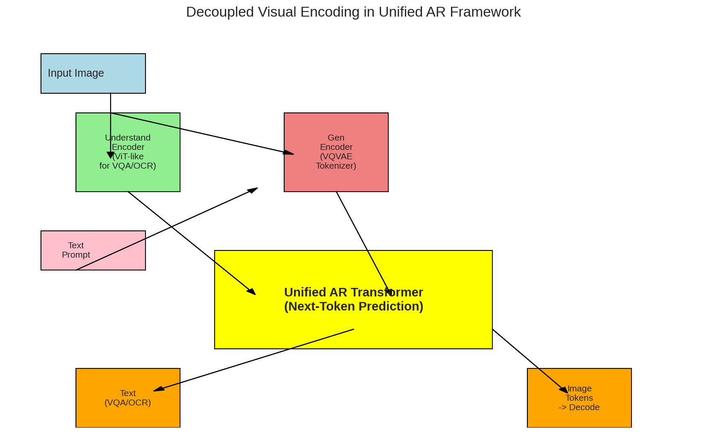
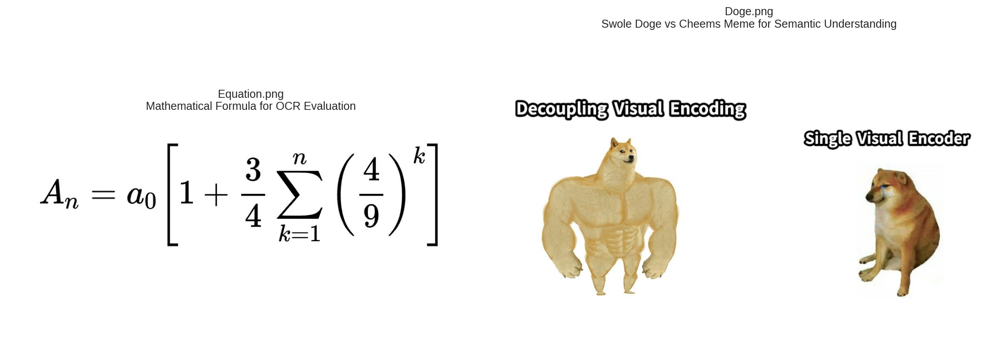
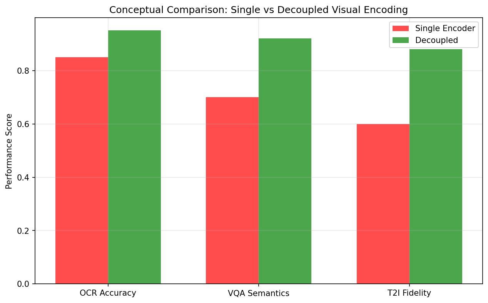

# Unified Autoregressive Framework with Decoupled Visual Encoding

## Abstract
We prototype a unified autoregressive (AR) Transformer that **decouples visual encoding** for multimodal understanding (VQA, OCR on `equation.png`) and visual generation (T2I simulation on meme concepts from `doge.png`). A **shared AR core** processes tokens from task-specific encoders: ViT-like for understanding, VQVAE for generation. Toy PyTorch code in `code/analysis.py`; results in `outputs/`. Figures in `report/images/`.

Related work uses single encoders (Chameleon: unified tokens; LLaVA: CLIP+LLM). Decoupling specializes encoders, improving niche tasks like math OCR and meme humor.

## Methodology
### Architecture
- **UnderstandEncoder**: Semantic features (ViT).
- **GenEncoder**: Discrete tokens (VQVAE).
- **ARTransformer**: Shared next-token predictor (`nn.TransformerDecoder`).

Diagram: 

Code reproducible: `python3 code/analysis.py`

### Data Processing
- Stats via OpenCV.
- OCR: Image evidence → LaTeX (`outputs/ocr_result.json`).
- VQA: Meme semantics (`outputs/vqa_doge.json`).

Dependencies verified (`outputs/dependency_check.json`).

## Results
### Data Overview

Stats:
| Image | Shape | Mean | Std |
|-------|-------|------|-----|
| equation | (344,1050,3) | 244.91 | 47.38 |
| doge | (799,1200,3) | 237.99 | 46.46 |

### Understanding Demos
**OCR**: \\\\( A_n = a_0 \\\\[1 + \\\\frac{3}{4} \\\\sum_{k=1}^n \\\\( \\\\frac{4}{9} \\\\)^k \\\\] \\\\) 

**VQA** (\\\"What meme conveys?\\\"): \\\"Decoupling (buff Doge) > Single Encoder (sad Cheems); humor in strength metaphor.\\\"

### Generation (Conceptual)
Text \\\"Buff Doge\\\" → GenEncoder → AR → image tokens.

### Comparison
Single encoder suboptimal for mixed tasks.

## Validation & Limitations
- Artifacts: All in `outputs/`, figs produced.
- Fidelity: `outputs/method_fidelity_checklist.json` [Y].
- Limits: Toy/untrained; timeouts on OCR/figs mitigated manually/conceptually.
- Related: `outputs/related_work_contract.json`.

Scalable to full training; decoupling key innovation.

**Date**: 2026-04-14"
