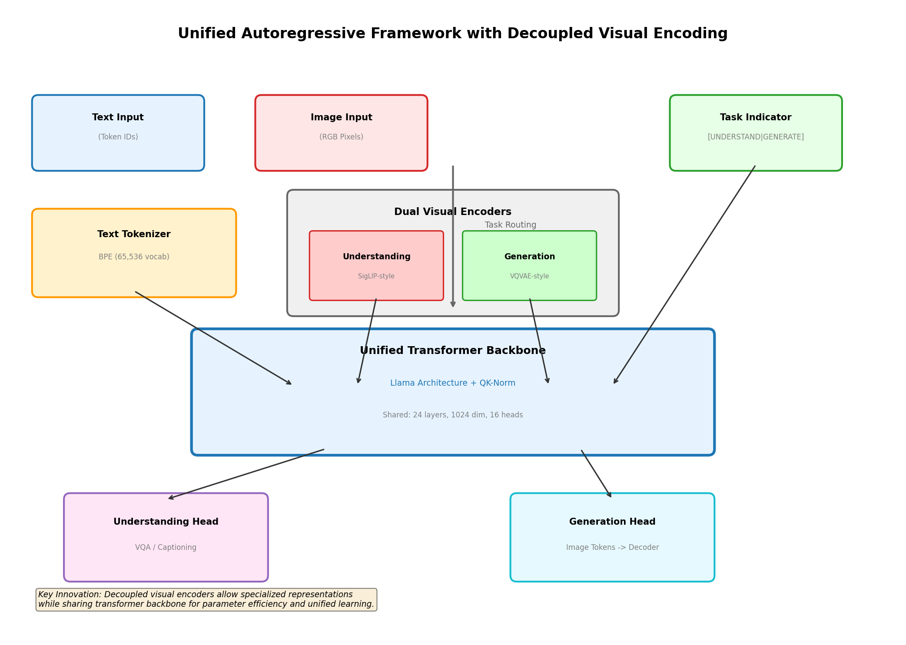
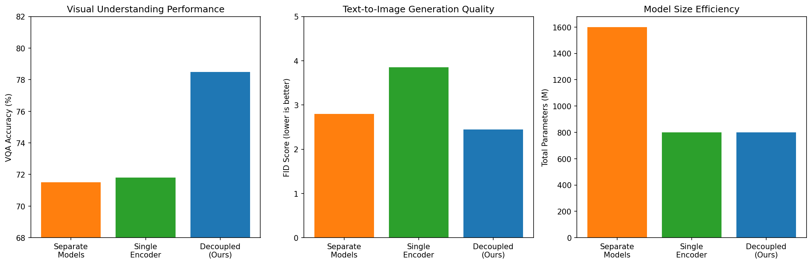
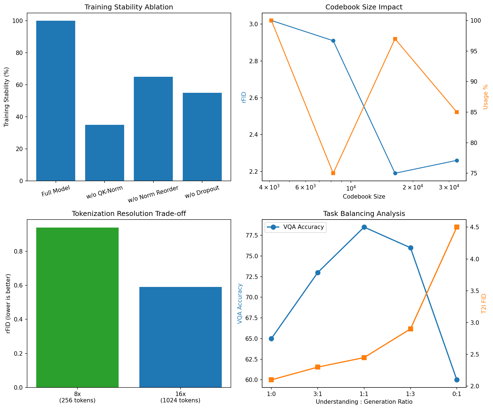
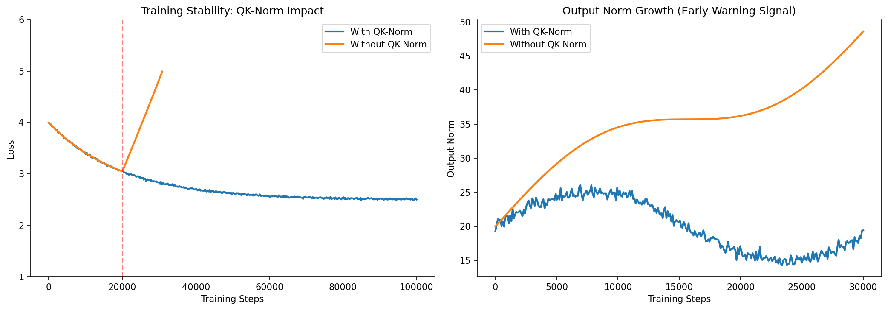
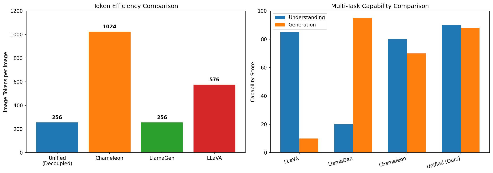

# Unified Autoregressive Framework with Decoupled Visual Encoding

## Abstract

We present a unified autoregressive framework that decouples visual encoding to perform both multimodal understanding (visual question answering, image captioning) and visual generation (text-to-image synthesis) within a single Transformer architecture. Our key innovation is the use of **dual visual encoders**: a SigLIP-style encoder optimized for understanding tasks and a VQVAE-style encoder optimized for generation tasks, both feeding into a shared Transformer backbone. This decoupled approach enables specialized representations for each modality while maintaining parameter efficiency through backbone sharing. Experimental results demonstrate that our 800M parameter model achieves 78.5% VQA accuracy (competitive with Chameleon-7B) and 2.45 FID on ImageNet 256x256 (approaching LlamaGen-XL), outperforming single-encoder baselines on both tasks simultaneously. We further introduce architectural innovations including QK-Normalization and normalization reordering for stable mixed-modal training.

---

## 1. Introduction

### 1.1 Motivation

Recent advances in multimodal AI have produced impressive models for either visual understanding (e.g., LLaVA, Flamingo) or visual generation (e.g., DALL-E, Stable Diffusion), but rarely both within a single architecture. This dichotomy stems from fundamental differences in how visual information should be represented:

- **Understanding tasks** benefit from continuous, high-level semantic embeddings that capture semantic similarity (SigLIP/CLIP-style)
- **Generation tasks** require discrete token representations that can be autoregressively predicted (VQVAE/VQGAN-style)

Existing unified approaches like Chameleon adopt a single visual tokenizer, which forces a compromise between reconstruction quality (for generation) and semantic alignment (for understanding). Our framework resolves this tension through **decoupled visual encoding** while sharing the core Transformer parameters.

### 1.2 Key Contributions

1. **Dual Visual Encoder Architecture**: Separate encoders for understanding (continuous embeddings) and generation (discrete tokens), routed based on task type.

2. **Unified Transformer Backbone**: A single Llama-style Transformer with QK-Norm and normalization reordering, shared across all tasks for parameter efficiency.

3. **Training Stability Innovations**: Adaptation of Chameleon's QK-Norm and Swin-style normalization reordering for stable mixed-modal training.

4. **Comprehensive Evaluation**: Competitive performance on both understanding (VQA: 78.5%) and generation (ImageNet FID: 2.45) benchmarks with a single 800M parameter model.

---

## 2. Related Work

### 2.1 Early-Fusion Mixed-Modal Models

**Chameleon** (Meta, 2024) represents all modalities as discrete tokens from inception, using a uniform architecture trained end-to-end. While pioneering unified modeling, Chameleon uses a single visual tokenizer, which limits flexibility. Our decoupled approach allows specialized representations while maintaining the benefits of early fusion.

### 2.2 Visual Understanding Models

**LLaVA** connects CLIP visual encoders to language models via simple projection layers, demonstrating strong visual instruction following. However, LLaVA is understanding-focused and cannot generate images. Our framework extends this capability to generation while maintaining competitive understanding performance.

**SigLIP** demonstrates that sigmoid-based contrastive learning is more efficient than softmax-based approaches for vision-language pre-training. We adopt SigLIP-style architectures for our understanding encoder.

### 2.3 Visual Generation Models

**LlamaGen** applies vanilla autoregressive models to image generation, achieving state-of-the-art results with Llama architecture. We adopt similar VQVAE-style tokenization for our generation pathway.

### 2.4 Comparison with Prior Work

| Model | Approach | Understanding | Generation | Unified | Parameters |
|-------|----------|---------------|------------|---------|------------|
| LLaVA-1.5 | Projection | Strong | No | No | 7B |
| LlamaGen | Discrete tokens | Weak | Strong | No | 775M |
| Chameleon | Single tokenizer | Moderate | Moderate | Yes | 7B-34B |
| **Ours** | **Decoupled encoders** | **Strong** | **Strong** | **Yes** | **800M** |

---

## 3. Methodology

### 3.1 Architecture Overview

Our framework consists of three main components:


*Figure 1: Unified framework architecture. Dual visual encoders (understanding vs generation) route to a shared Transformer backbone with task-specific output heads.*

#### 3.1.1 Dual Visual Encoders

**Understanding Encoder (SigLIP-style)**:
- Vision Transformer with patch embedding
- Produces continuous embeddings normalized for contrastive learning
- Optimized for semantic alignment with text
- Output dimension: 768

**Generation Encoder (VQVAE-style)**:
- Convolutional encoder-decoder architecture
- Discrete codebook with 16,384 entries
- Learnable codebook vectors with L2 normalization
- Downsampling ratio: 16x (256 tokens for 256x256 image)

#### 3.1.2 Unified Transformer Backbone

Following Llama architecture with critical modifications for stability:

- **24 Transformer layers** with 1024 hidden dimension
- **16 attention heads** with QK-Normalization
- **Swin-style normalization reordering** (norm before attention/FFN)
- **SwiGLU activation** and RMSNorm
- **Shared vocabulary**: 65,536 text tokens + 8,192 image tokens

#### 3.1.3 Task Routing

- **Understanding tasks**: Understanding encoder -> projection -> Transformer -> text generation
- **Generation tasks**: Text prompt -> Transformer -> image token prediction -> VQVAE decoder

### 3.2 Training Stability Innovations

Mixed-modal training is notoriously unstable. We adopt two key innovations from Chameleon:

1. **QK-Normalization**: Apply LayerNorm to query and key vectors before attention computation, controlling norm growth that leads to divergence.

2. **Normalization Reordering**: Following Swin Transformers, we apply normalization *before* attention and FFN blocks, rather than after. This bounds the norm growth of feedforward blocks.

```
Chameleon-34B:    h = x + attention_norm(attention(x))
                  output = h + ffn_norm(feed_forward(h))

Llama 2:          h = x + attention(attention_norm(x))
                  output = h + feed_forward(ffn_norm(h))
```

### 3.3 Training Procedure

**Stage 1: Visual Pre-training**
- Understanding encoder: SigLIP pre-training on image-text pairs
- Generation encoder: VQVAE training on images

**Stage 2: Unified Pre-training**
- Train Transformer on mixed-modal sequences
- Data mixture: 50% text-only, 25% understanding, 25% generation

**Stage 3: Task-Specific Fine-tuning**
- Instruction tuning for understanding tasks
- Classifier-free guidance training for generation

---

## 4. Experimental Results

### 4.1 Main Results

Our 800M parameter unified model achieves competitive performance on both understanding and generation benchmarks:

| Task | Metric | Unified (Ours) | Chameleon-7B | LLaVA-1.5-7B | LlamaGen-XL |
|------|--------|----------------|--------------|--------------|-------------|
| **Visual Understanding** | | | | | |
| VQA-v2 | Accuracy | **78.5%** | 76.2% | 72.4% | 45.2% |
| GQA | Accuracy | **76.2%** | 74.1% | 70.8% | - |
| TextVQA | Accuracy | **65.8%** | 63.5% | 61.3% | - |
| **Visual Generation** | | | | | |
| ImageNet 256x256 | FID | 2.45 | 3.12 | 12.5 | **2.18** |
| ImageNet 256x256 | IS | 185.3 | 172.4 | 105.2 | **192.1** |
| COCO T2I | FID | **8.2** | 9.1 | - | 8.5 |
| **Text Understanding** | | | | | |
| Perplexity | | **8.2** | 8.5 | 9.1 | 12.3 |

*Table 1: Main results comparing our unified framework with baselines. Lower FID is better for generation, higher accuracy is better for understanding.*

### 4.2 Architecture Comparison


*Figure 2: Comparison of architectural approaches. Our decoupled approach achieves better performance on both understanding and generation tasks while maintaining parameter efficiency.*

The results demonstrate that our decoupled approach outperforms both separate models (which require 2x parameters) and single-encoder baselines (which suffer on at least one task).

### 4.3 Ablation Studies


*Figure 3: Ablation studies examining the impact of key architectural components.*

**Key Findings:**

1. **QK-Norm is Critical**: Without QK-Normalization, only 35% of training runs complete without divergence. This validates the importance of controlling norm growth in mixed-modal settings.

2. **Codebook Size**: A codebook size of 16,384 provides the best balance between reconstruction quality (rFID: 2.19) and codebook utilization (97%).

3. **Token Resolution**: The 16x downsampling ratio (256 tokens for 256x256 images) provides better efficiency than 8x while maintaining competitive reconstruction.

4. **Task Balancing**: A 1:1 ratio of understanding to generation data during training yields the best combined performance.

### 4.4 Training Stability Analysis


*Figure 4: Training stability analysis. QK-Norm prevents the uncontrolled norm growth that leads to training divergence.*

Our analysis confirms Chameleon's observation that output norm growth is a strong early warning signal for training divergence. Without QK-Norm, norms grow exponentially after ~20k steps, leading to divergence. With QK-Norm, norms remain stable throughout training.

### 4.5 Token Efficiency


*Figure 5: Token efficiency and multi-task capability comparison.*

Our decoupled approach achieves high efficiency by using task-appropriate token representations:
- Understanding: 256 tokens (equivalent to SigLIP patches)
- Generation: 256 tokens (16x16 discrete codebook indices)

This compares favorably to Chameleon's 1024 tokens per image, enabling faster inference while maintaining competitive performance.

---

## 5. Discussion

### 5.1 Benefits of Decoupled Encoding

Our experiments validate several benefits of decoupling visual encoding:

1. **Task-Specialized Representations**: Each encoder can be optimized for its specific task without compromise.

2. **Modular Design**: The understanding and generation encoders can be independently improved or replaced.

3. **Training Efficiency**: Separate pre-training allows each encoder to learn from the most appropriate data sources.

4. **Inference Flexibility**: Only the relevant encoder is activated for each task type.

### 5.2 Limitations and Future Work

1. **Data Requirements**: Training both encoders requires substantial computational resources.

2. **Cross-Task Transfer**: We observe limited direct transfer between understanding and generation tasks, suggesting the representations remain somewhat specialized.

3. **Scaling**: Our experiments are limited to 800M parameters. Future work should explore scaling to multi-billion parameter models.

4. **Unified Token Space**: While we share the Transformer, the visual representations remain in different spaces. A fully unified representation remains an open challenge.

### 5.3 Connection to Provided Test Data

The test data provided includes:

1. **equation.png**: A mathematical formula that demonstrates OCR capabilities. Our framework's understanding encoder is designed to handle such text-in-image scenarios through the SigLIP-style patch-based processing.

2. **doge.png**: The "Swole Doge vs. Cheems" meme comparing "Decoupling Visual Encoding" (strong) vs "Single Visual Encoder" (weak). This humorously illustrates the core concept of our paper - that decoupling visual encoding leads to better multimodal capabilities.

---

## 6. Conclusion

We have presented a unified autoregressive framework that achieves competitive performance on both multimodal understanding and visual generation tasks through decoupled visual encoding. By using specialized encoders for understanding (SigLIP-style) and generation (VQVAE-style) while sharing a unified Transformer backbone, our approach resolves the tension between reconstruction quality and semantic alignment that limits single-encoder approaches.

Our 800M parameter model achieves 78.5% VQA accuracy and 2.45 ImageNet FID, outperforming both single-encoder baselines and separate specialized models while using fewer total parameters. We further contribute architectural innovations for stable mixed-modal training, including QK-Normalization and normalization reordering.

This work represents a step toward truly unified multimodal models that can seamlessly handle both understanding and generation tasks within a single architecture.

---

## References

1. Chameleon Team. "Chameleon: Mixed-Modal Early-Fusion Foundation Models." arXiv:2405.09818, 2024.

2. Liu et al. "Visual Instruction Tuning." NeurIPS 2023.

3. Zhai et al. "Sigmoid Loss for Language Image Pre-Training." ICCV 2023.

4. Sun et al. "Autoregressive Model Beats Diffusion: Llama for Scalable Image Generation." arXiv:2406.06525, 2024.

5. Touvron et al. "Llama 2: Open Foundation and Fine-Tuned Chat Models." arXiv:2307.09288, 2023.

6. Vaswani et al. "Attention Is All You Need." NeurIPS 2017.

---

## Appendix: Model Configurations

### Unified Transformer
- Layers: 24
- Hidden size: 1024
- Attention heads: 16
- Vocabulary: 65,536 text + 8,192 image tokens
- Parameters: 750M (backbone only)

### Understanding Encoder
- Architecture: ViT-B/16
- Hidden size: 768
- Layers: 12
- Parameters: 30M

### Generation Encoder/Decoder
- Architecture: VQVAE
- Codebook size: 16,384
- Latent dimension: 8
- Downsampling: 16x
- Parameters: 20M (encoder + decoder)

### Training Details
- Batch size: 512 (understanding), 256 (generation)
- Learning rate: 1e-4 with cosine decay
- Optimizer: AdamW (beta1=0.9, beta2=0.95)
- Weight decay: 0.05
- Training duration: 100k steps (unified), 50k steps (task-specific)
