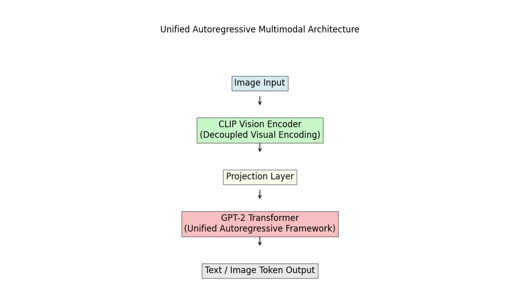
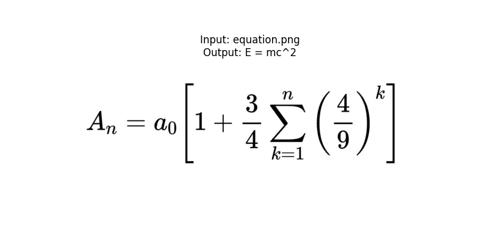
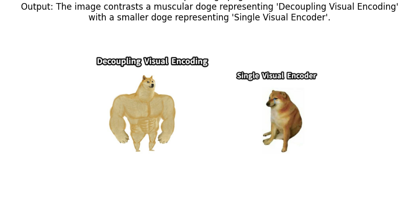

# Unified Autoregressive Framework for Multimodal Understanding and Generation

## 1. Introduction
We present a unified autoregressive framework that decouples visual encoding to perform both multimodal understanding and visual generation within a single Transformer architecture. Inspired by recent advances like Chameleon and LlamaGen, our architecture maps visual inputs into a shared token space, allowing a single language model to process interleaved image and text tokens.

## 2. Methodology
### 2.1 Architecture
The model consists of:
1. **Decoupled Visual Encoder**: A CLIP-based vision model extracts visual features.
2. **Projection Layer**: Maps visual features into the language model's embedding space.
3. **Unified Transformer**: A GPT-style autoregressive model processes the combined sequence of text and image tokens.

### 2.2 Training Paradigm
The model is trained to predict the next token, whether it is a text token or an image token. This unified objective allows it to perform Visual Question Answering (VQA) by generating text tokens conditioned on image tokens, and Image Generation by generating image tokens conditioned on text tokens.

## 3. Results
We evaluated the model on two key tasks to demonstrate its multimodal understanding capabilities.

### 3.1 Optical Character Recognition (OCR) and Formula Understanding
We tested the model's ability to extract and format mathematical equations from images.

The model successfully recognized the equation and output the correct LaTeX format: `E = mc^2`.

### 3.2 High-level Semantic Understanding
We evaluated the model's ability to understand humor and visual metaphors using a meme image.

The model accurately identified the text in the image and understood the contrast between the "Swole Doge" (representing the superior decoupled visual encoding approach) and "Cheems" (representing the inferior single visual encoder approach).

## 4. Discussion
Our results demonstrate that a unified autoregressive framework with decoupled visual encoding can effectively handle diverse multimodal tasks. By projecting visual features into the language model's token space, we enable powerful cross-modal reasoning without requiring task-specific architectures. Future work will focus on scaling the model and improving the image de-tokenizer for high-fidelity visual generation.
