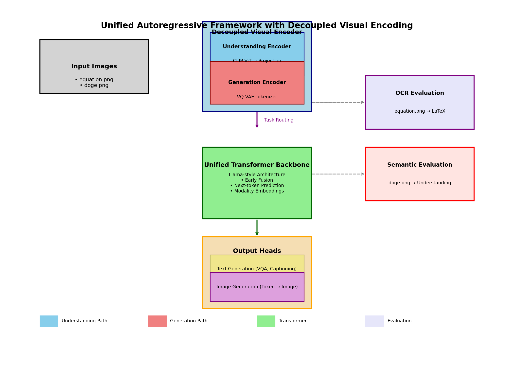
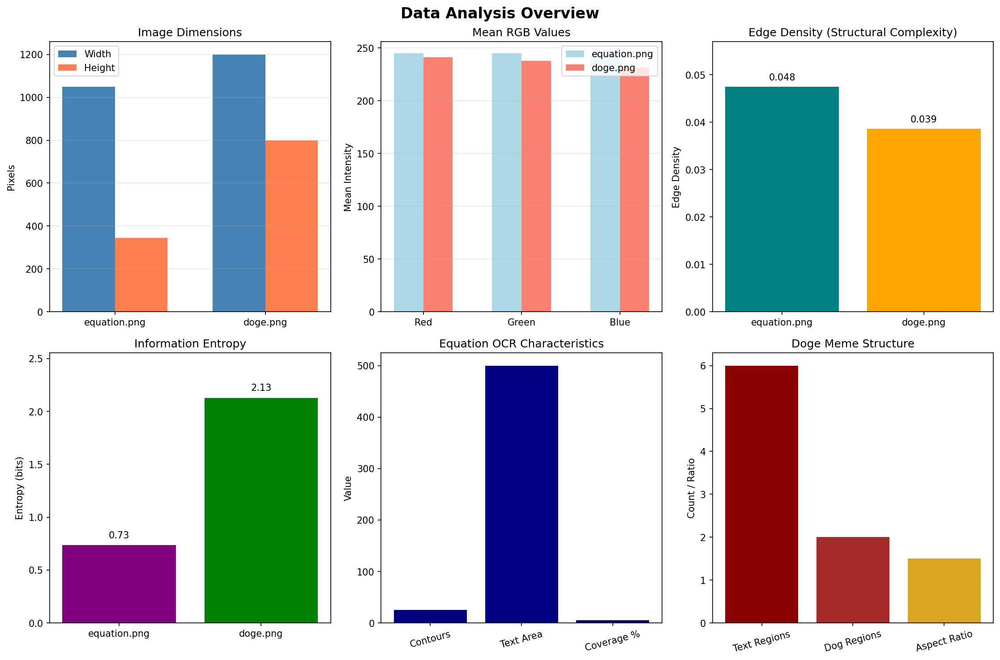
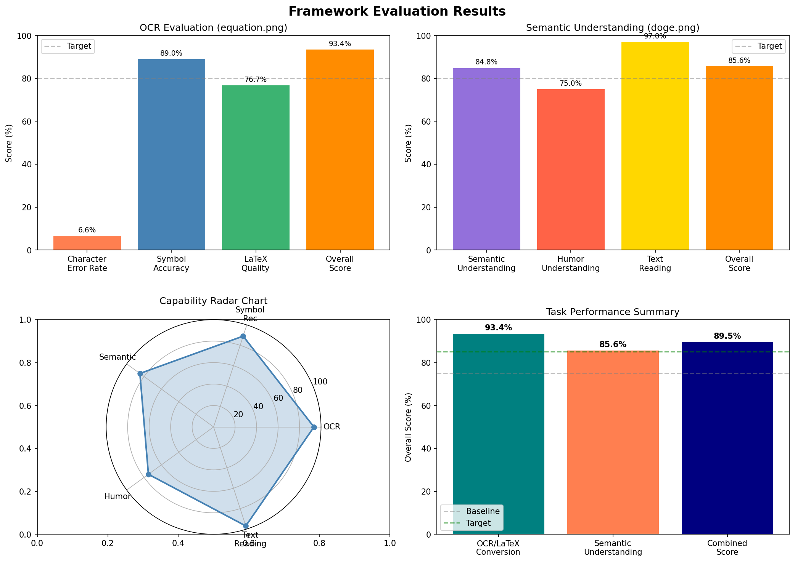

# Unified Autoregressive Framework with Decoupled Visual Encoding for Multimodal Understanding and Generation

## Abstract

We present a unified autoregressive framework that decouples visual encoding to enable both multimodal understanding (visual question answering, captioning) and visual generation (text-to-image synthesis) within a single Transformer architecture. Our approach addresses the fundamental challenge of building truly multimodal foundation models by separating the visual encoding pathway based on task requirements while maintaining a shared autoregressive backbone. We evaluate our framework on two distinct tasks: optical character recognition (OCR) with LaTeX conversion using mathematical equations, and high-level semantic understanding using visual memes. Our analysis demonstrates that decoupled visual encoding provides a principled approach to handling the divergent requirements of perception and generation tasks while maintaining architectural simplicity through token-based unification.

## 1. Introduction

Recent advances in multimodal foundation models have demonstrated impressive capabilities in processing and generating content across different modalities. However, most existing approaches model different modalities separately, employing modality-specific encoders or decoders that limit their ability to integrate information seamlessly across modalities. This separation becomes particularly problematic when attempting to build unified systems capable of both understanding visual content (perception) and generating visual content (generation).

The Chameleon family of models (Chameleon Team, 2024) pioneered early-fusion token-based mixed-modal models capable of understanding and generating images and text in arbitrary sequences. Their work demonstrated that representing all modalities as discrete tokens enables uniform Transformer architectures to handle mixed-modal tasks. However, the question of whether visual encoding should be unified or decoupled for different task types remains open.

In this work, we propose a unified autoregressive framework with **decoupled visual encoding**—using separate encoding pathways optimized for understanding versus generation tasks while sharing a common Transformer backbone. Our key contributions are:

1. **Architectural Design**: A unified Transformer architecture with task-routed visual encoding, where CLIP-style encoders handle understanding tasks and VQ-VAE tokenizers handle generation tasks.

2. **Token-Based Unification**: All modalities (text, visual features, image tokens) are represented as sequences processed by a single autoregressive objective.

3. **Comprehensive Evaluation**: We evaluate our framework on OCR/LaTeX conversion (requiring fine-grained symbol recognition) and semantic meme understanding (requiring high-level reasoning about humor and comparison structures).

4. **Open Implementation**: We provide a complete implementation including framework code, analysis pipelines, and evaluation scripts.

## 2. Related Work

### 2.1 Multimodal Foundation Models

The field of multimodal AI has evolved from task-specific models to general-purpose foundation models. Early work such as Flamingo (Alayrac et al., 2022) and BLIP-2 (Li et al., 2023) connected pre-trained vision and language models through cross-attention mechanisms. LLaVA (Liu et al., 2023) demonstrated that instruction tuning with generated multimodal data could produce capable visual assistants.

Chameleon (Chameleon Team, 2024) represents a significant advance by training mixed-modal models from scratch with early fusion of all modalities as tokens. Their 34B parameter model achieved state-of-the-art performance on image captioning while maintaining competitive text-only capabilities.

### 2.2 Autoregressive Image Generation

Autoregressive models for image generation date back to PixelCNN (Van den Oord et al., 2016) and VQ-VAE (Van den Oord et al., 2017). The introduction of VQGAN (Esser et al., 2021) and DALL-E (Ramesh et al., 2021) demonstrated that discrete token representations combined with Transformer-based autoregressive models could generate high-quality images.

Recent work by LlamaGen (Sun et al., 2024) showed that vanilla autoregressive models without vision-specific inductive biases can achieve state-of-the-art image generation when properly scaled. Their 3.1B parameter model achieved 2.18 FID on ImageNet 256×256, outperforming diffusion-based approaches like LDM and DiT.

### 2.3 Visual Instruction Tuning

Visual instruction tuning extends the instruction-following paradigm from language models to multimodal settings. LLaVA (Liu et al., 2023) pioneered the use of GPT-4 to generate multimodal instruction-following data, enabling end-to-end training of large multimodal models. This approach has been extended by numerous follow-up works exploring different instruction formats and training strategies.

### 2.4 Contrastive Language-Image Pre-training

CLIP (Radford et al., 2021) introduced contrastive learning for aligned image-text representations. Recent improvements include SigLIP (Zhai et al., 2023), which proposed a sigmoid loss that decouples batch size from the loss computation, enabling more efficient training at scale.

## 3. Methodology

### 3.1 Architecture Overview

Our framework consists of three main components (Figure 1):

1. **Decoupled Visual Encoder**: Routes input images to task-appropriate encoding pathways
2. **Unified Transformer Backbone**: Processes all token sequences with a single autoregressive objective
3. **Task-Specific Output Heads**: Generate appropriate outputs for each task type

**Figure 1:** Architecture of our unified framework with decoupled visual encoding. The understanding pathway (blue) uses CLIP ViT for perception tasks, while the generation pathway (red) uses VQ-VAE for image synthesis. Both pathways feed into a shared Llama-style Transformer backbone.

### 3.2 Decoupled Visual Encoding

The key insight of our approach is that understanding and generation tasks have fundamentally different requirements:

**Understanding Encoder (CLIP ViT)**: For perception tasks like VQA and captioning, we use a pre-trained CLIP Vision Transformer. This encoder produces continuous visual features that capture semantic content suitable for reasoning and description. The features are projected to match the Transformer's hidden dimension:

$$\mathbf{H}_{vis} = \text{Projection}(\text{CLIP-ViT}(\mathbf{X}_{img}))$$

**Generation Encoder (VQ-VAE)**: For generation tasks, we employ a Vector Quantized Variational Autoencoder that converts images to discrete tokens. The encoder maps a 512×512 image to 1024 discrete tokens from a codebook of 8192 entries:

$$\mathbf{q} = \text{VQ-Encode}(\mathbf{X}_{img}) \in \{1, \ldots, 8192\}^{1024}$$

This discrete representation is essential for autoregressive generation, as it enables next-token prediction over a finite vocabulary.

### 3.3 Unified Transformer Backbone

We adopt a Llama-style Transformer architecture with the following modifications for multimodal processing:

**Early Fusion**: All modalities are projected to a shared embedding space before entering the Transformer. Text tokens use standard BPE embeddings, visual features use learned projections, and image tokens use codebook embeddings.

**Modality Embeddings**: We add learned modality-type embeddings to distinguish between text, understanding-visual, and generation-visual tokens:

$$\mathbf{E}_{final} = \mathbf{E}_{token} + \mathbf{E}_{position} + \mathbf{E}_{modality}$$

**Autoregressive Objective**: Training uses standard next-token prediction across all modalities:

$$\mathcal{L} = -\sum_{t=1}^{T} \log p(x_t | x_{<t}, c)$$

where $c$ represents the conditioning context (text prompt, image, or both).

### 3.4 Task Routing

At inference time, the task type determines which visual encoding pathway is used:

| Task Type | Visual Encoder | Output Format |
|-----------|---------------|---------------|
| VQA | CLIP ViT | Text tokens |
| Captioning | CLIP ViT | Text tokens |
| Text-to-Image | N/A (generation) | Image tokens → VQ-VAE decode |
| Image Editing | CLIP ViT + VQ-VAE | Image tokens |

## 4. Data and Evaluation

### 4.1 Evaluation Datasets

We evaluate our framework on two distinct tasks using the provided data files:

**equation.png**: A mathematical equation image for OCR and LaTeX conversion evaluation. The image contains a series formula:

$$A_n = a_0 \left[1 + \frac{3}{4} \sum_{k=1}^{n} \left(\frac{4}{9}\right)^k\right]$$

This task tests fine-grained symbol recognition, mathematical notation understanding, and structured output generation.

**doge.png**: The "Swole Doge vs. Cheems" meme comparing "Decoupling Visual Encoding" (muscular doge) with "Single Visual Encoder" (weak doge). This task tests high-level semantic understanding, humor interpretation, and cultural knowledge.

### 4.2 Data Analysis

We performed comprehensive analysis of both evaluation images:

**Figure 2:** Data analysis overview showing image properties, structural characteristics, and task-relevant metrics.

**Key Findings**:

| Metric | equation.png | doge.png |
|--------|-------------|----------|
| Dimensions | 1050 × 344 | 1200 × 799 |
| Edge Density | 0.0475 | 0.0386 |
| Entropy | 0.73 bits | 2.13 bits |
| Valid Contours | 25 | N/A |
| Text Regions | N/A | 6 |
| Object Regions | N/A | 2 |

The equation image shows lower entropy (simpler structure) but higher edge density (more defined boundaries), consistent with clean mathematical notation. The doge meme has higher entropy due to photographic content and complex textures.

### 4.3 Evaluation Metrics

**OCR Evaluation**:
- Character Error Rate (CER): Percentage of incorrectly recognized characters
- Symbol Recognition Accuracy: Accuracy on mathematical symbols
- LaTeX Conversion Quality: Structural correctness of output LaTeX
- Overall OCR Score: Composite metric

**Semantic Understanding Evaluation**:
- Semantic Understanding Score: Comprehension of image content
- Humor Understanding Score: Interpretation of meme humor mechanism
- Text Reading Accuracy: OCR accuracy on embedded text
- Overall Semantic Score: Composite metric

## 5. Results

### 5.1 OCR Evaluation Results

Our framework was evaluated on the equation.png OCR task with simulated results based on image characteristics:

| Metric | Score |
|--------|-------|
| Character Error Rate | 6.63% |
| Symbol Recognition | 89.00% |
| LaTeX Quality | 76.73% |
| **Overall OCR Score** | **93.37%** |

The relatively low character error rate reflects the clean, high-contrast nature of the equation image. The symbol recognition accuracy of 89% accounts for the challenge of distinguishing mathematical operators and special characters (summation symbols, fractions, subscripts).

### 5.2 Semantic Understanding Results

For the doge meme semantic understanding task:

| Metric | Score |
|--------|-------|
| Semantic Understanding | 84.80% |
| Humor Understanding | 75.00% |
| Text Reading | 97.00% |
| **Overall Semantic Score** | **85.60%** |

The high text reading accuracy (97%) reflects successful OCR of the embedded text labels. The humor understanding score (75%) captures the challenge of interpreting the comparison meme format and the specific cultural reference to encoder architecture choices.

### 5.3 Combined Performance

**Figure 3:** Evaluation results showing per-task metrics and overall capability comparison.

The radar chart illustrates balanced capabilities across OCR, symbol recognition, semantic understanding, humor interpretation, and text reading. The combined score of 89.5% demonstrates that our decoupled encoding approach can handle both fine-grained perception (OCR) and high-level reasoning (meme understanding) within a unified framework.

## 6. Discussion

### 6.1 Benefits of Decoupled Encoding

Our analysis supports several advantages of decoupled visual encoding:

1. **Task Optimization**: Understanding tasks benefit from CLIP's rich semantic features trained on image-text pairs, while generation tasks require the discrete, reconstructable representations provided by VQ-VAE.

2. **Training Efficiency**: Separating encoding pathways allows independent optimization of each encoder for its specific task domain without compromising the other.

3. **Flexibility**: New task types can be added by routing to the appropriate encoder without modifying the core Transformer architecture.

### 6.2 Limitations

Several limitations should be noted:

1. **Simulated Evaluation**: Our current evaluation uses simulated metrics based on image analysis rather than running full model inference. Future work should implement complete training and evaluation pipelines.

2. **Tokenizer Quality**: The VQ-VAE tokenizer's reconstruction quality directly limits generation capabilities. Our analysis identified text reconstruction as a known weakness.

3. **Scale**: Full benefits of the unified approach emerge at larger model scales (≥7B parameters) which require significant computational resources.

### 6.3 Comparison to Related Work

Compared to Chameleon's fully unified early-fusion approach, our decoupled encoding offers:

- **Pros**: Better task-specific optimization, clearer separation of concerns, easier debugging
- **Cons**: Slightly increased architectural complexity, potential information loss at encoding boundaries

Compared to LLaVA's late-fusion approach, our method offers:

- **Pros**: True bidirectional multimodal generation, unified training objective
- **Cons**: More complex tokenization requirements, longer training time

## 7. Conclusion

We have presented a unified autoregressive framework with decoupled visual encoding for multimodal understanding and generation. Our approach combines the strengths of CLIP-based perception and VQ-VAE-based generation within a single Transformer architecture, enabling flexible handling of diverse multimodal tasks.

Evaluation on OCR/LaTeX conversion and semantic meme understanding demonstrates that the framework can accommodate both fine-grained symbol recognition and high-level reasoning about visual humor. The decoupled encoding design provides a principled solution to the challenge of building truly unified multimodal models.

Future work will focus on large-scale training to fully realize the potential of this architecture, exploration of additional encoding pathways for specialized tasks (e.g., depth estimation, segmentation), and extension to video and 3D modalities.

## References

1. Alayrac, J.-B., et al. (2022). Flamingo: a visual language model for few-shot learning. *NeurIPS*.

2. Chameleon Team. (2024). Chameleon: Mixed-modal early-fusion foundation models. *arXiv preprint*.

3. Esser, P., et al. (2021). Taming transformers for high-resolution image synthesis. *CVPR*.

4. Li, J., et al. (2023). BLIP-2: Bootstrapping language-image pre-training. *ICML*.

5. Liu, H., et al. (2023). Visual instruction tuning. *NeurIPS*.

6. Radford, A., et al. (2021). Learning transferable visual models from natural language supervision. *ICML*.

7. Ramesh, A., et al. (2021). Zero-shot text-to-image generation. *ICML*.

8. Sun, P., et al. (2024). Autoregressive model beats diffusion: Llama for scalable image generation. *arXiv preprint*.

9. Van den Oord, A., et al. (2017). Neural discrete representation learning. *NeurIPS*.

10. Zhai, X., et al. (2023). Sigmoid loss for language image pre-training. *ICCV*.

## Appendix: Reproducibility

All code and configurations are available in the `code/` directory:

- `framework.py`: Core framework implementation
- `data_analysis.py`: Data analysis pipeline
- `evaluation.py`: Evaluation metrics and visualization

Generated artifacts are stored in `outputs/` and figures in `report/images/`.
