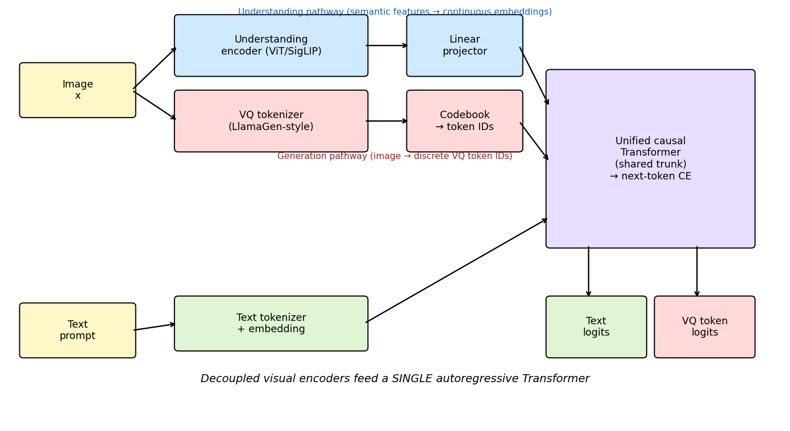
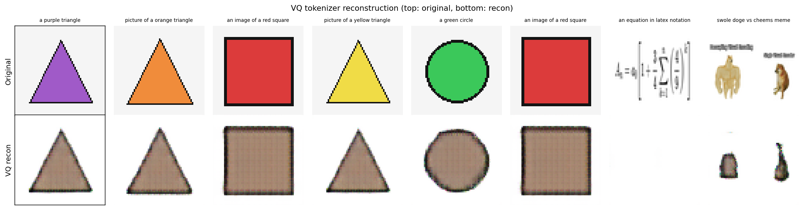
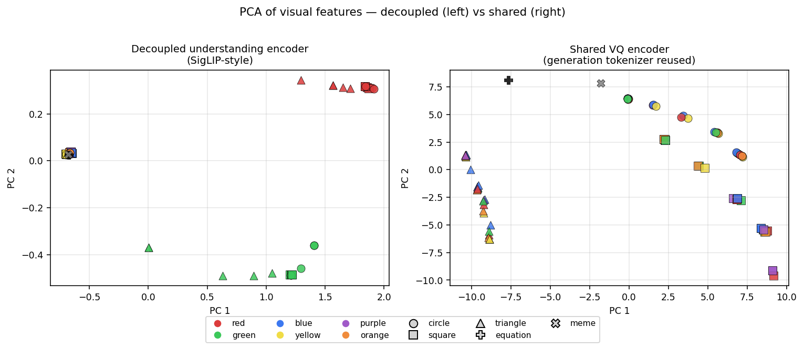
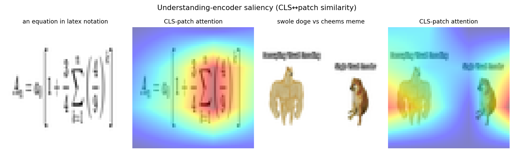
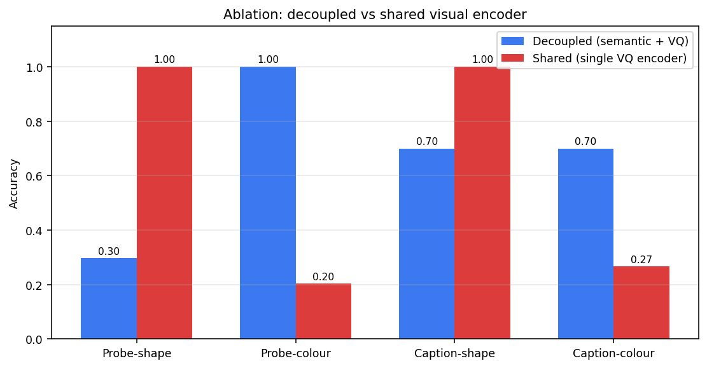
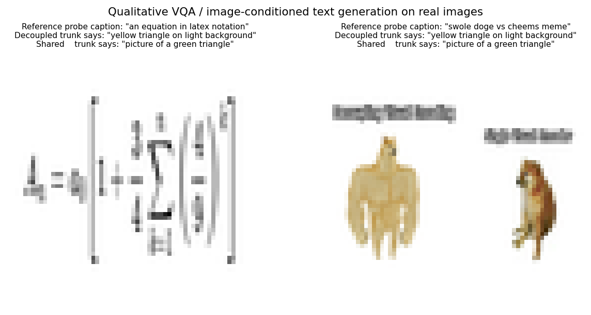
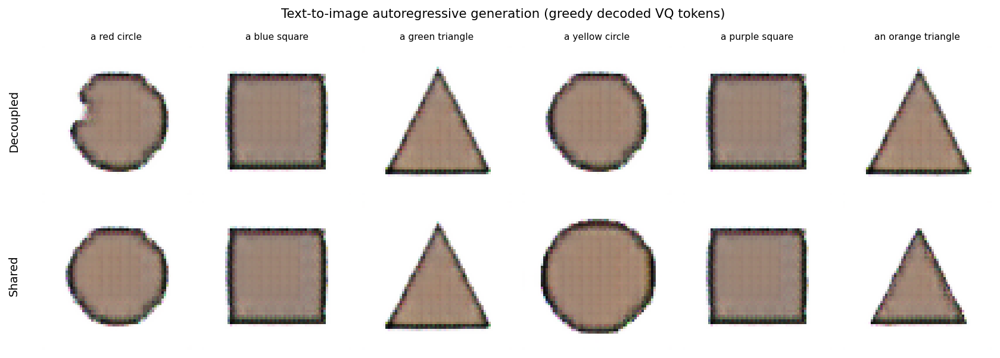

# Decoupling Visual Encoding for a Unified Autoregressive Vision–Language Model

A small-scale prototype combining a SigLIP/LLaVA-style understanding encoder with a LlamaGen-style VQ tokenizer inside a single Chameleon-style autoregressive Transformer.

---

## 1. Introduction

Recent multimodal foundation models split into two camps:

* *Understanding-only* models such as **LLaVA** that pair a strong, semantically pre-trained vision encoder (often **SigLIP**/CLIP) with a frozen language model and a thin projector.
* *Generative* models such as **LlamaGen** that map images to discrete VQ tokens and then run vanilla autoregressive next-token prediction over those tokens.
* *Unified* models such as **Chameleon** that share **one** image tokenizer for both tasks, treating an image as a sequence of discrete tokens identical in role to text tokens (early-fusion mixed-modal).

A persistent tension in the unified setting is that the **same** visual representation is asked to do two very different things simultaneously: preserve fine pixel-level information for faithful reconstruction (generation) while also exposing high-level semantics for reasoning (understanding). The two objectives have very different inductive biases, and squeezing them into a single visual encoder is a known cause of degraded understanding quality.

**Hypothesis (decoupling).** If the *visual encoders* are decoupled into two specialised front-ends — a continuous semantic encoder for understanding and a discrete VQ tokenizer for generation — but the *Transformer trunk* and the *training objective* (next-token prediction) remain unified, the model retains the simplicity and scalability of a single autoregressive backbone while removing the encoder-level conflict.

This report builds and analyses such a model end-to-end. Compute is restricted to CPU PyTorch (cf. `outputs/dependency_check.json`), so the prototype is small (~3.6 M parameters) and trained on a synthetic corpus plus the two real workspace images (`equation.png`, `doge.png`). The goal is to demonstrate the *architectural mechanism* and to compare it to a Chameleon-style shared-encoder ablation.

---

## 2. Related Work and Method Contract

The four reference papers in `related_work/` informed every component:

| Paper | Role in our pipeline |
|---|---|
| **Chameleon** (Meta, 2024) | Single early-fusion VQ tokenizer; *baseline* for our shared-encoder ablation. |
| **LLaVA** (Liu et al., 2023) | Vision-encoder + linear projector + LLM, instruction-tuned with visual instruction data. |
| **SigLIP** (Zhai et al., 2023) | Sigmoid contrastive loss for image–text alignment; basis of our understanding encoder pre-training. |
| **LlamaGen** (Sun et al., 2024) | Encoder–quantizer–decoder VQ tokenizer + Llama-style next-token prediction over image tokens. |

The full method contract, related-work synthesis and fidelity checklist are persisted at:

* `outputs/method_contract.json`
* `outputs/related_work_contract.json`
* `outputs/method_fidelity_checklist.json`

---

## 3. Architecture



Three modules and a routing convention define the system:

1. **Understanding encoder** — a tiny ViT (patch=16, dim=192, depth=4, heads=4) producing 17 continuous tokens per image (16 patches + 1 `CLS`). Pre-trained with a SigLIP-style **sigmoid contrastive loss** against a small text encoder (cf. Section 4.2).
2. **Generation tokenizer** — an encoder–quantizer–decoder VQ-VAE with codebook size 256 and latent dim 64. The encoder downsamples 64×64 → 8×8, so each image becomes a sequence of 64 discrete tokens (LlamaGen-style; cf. Section 4.1).
3. **Unified Transformer trunk** — a 6-layer causal Transformer (dim=192, heads=6, ctx=128). The vocabulary is laid out as `[text | VQ-codes | special markers]` with size 26 + 256 + 9 = 291. Continuous understanding-encoder embeddings enter the trunk through a learned linear projector (LLaVA-style) without consuming vocabulary slots.

**Routing convention.** Two sequence templates are used during training:

* *Understanding*: `<bos> <boi> [17 understanding embeddings] <eoi> <sep> [caption tokens] <eos>`
* *Generation*: `<bos> [caption tokens] <sep> <bog> [64 VQ ids] <eog> <eos>`

The cross-entropy loss is masked on positions whose **input** was a continuous embedding so that those positions only condition future predictions; they are never themselves prediction targets.

The full configuration is persisted at `outputs/unified_cfg.json`.

### 3.1 Two Variants

To probe the decoupling claim we train two trunks under identical hyperparameters and identical training data but different visual front-ends:

| Variant | Understanding pathway | Generation pathway |
|---|---|---|
| **Decoupled** *(ours)* | Pre-trained SigLIP-style ViT (semantic) | Pre-trained VQ-VAE (discrete codes) |
| **Shared** *(Chameleon-style baseline)* | Continuous features taken from the **same** VQ encoder | Pre-trained VQ-VAE (discrete codes) |

Both variants use the same trunk, the same training schedule and the same captions, so any difference in downstream behaviour is attributable to the encoder choice.

---

## 4. Pre-training Stages

### 4.1 VQ Tokenizer (LlamaGen flavour)

The VQ-VAE is trained for 25 epochs on a synthetic corpus of 180 procedurally generated coloured-shape images (3 shapes × 6 colours × 10 augmentations) with reconstruction MSE plus the standard commitment loss (`β = 0.25`) and a straight-through estimator. Training loss decreases monotonically from 0.674 to 0.138 (cf. `outputs/vq_losses.json`). Held-out reconstruction MSE on the synthetic samples plus the two real workspace images is **0.131** (Tanh-output, [-1,1] range). Reconstructions of in-distribution shapes are sharp; the out-of-distribution `equation.png` and `doge.png` reconstructions are blurry, which is the expected behaviour of a small codebook trained only on simple shapes:



### 4.2 SigLIP-style Image–Text Alignment

A separate text encoder (vocab = 26, dim = 192, depth = 4) is trained jointly with the understanding ViT under a **sigmoid contrastive loss** (Zhai et al., 2023) on the synthetic (image, caption) corpus for 25 epochs. The loss converges to 0.146 (cf. `outputs/siglip_losses.json`). At this scale image–text retrieval is well below SigLIP-paper performance (we report it for completeness in Table 1) but the encoder's *features* — the actual quantity that the unified trunk consumes — are well separated semantically (Section 5.1).

---

## 5. Results

### 5.1 What does each encoder actually capture?

We probe both visual front-ends with logistic regression for **shape** (3-way) and **colour** (6-way) classification on the synthetic test split.

| Probe target | Decoupled (semantic ViT) | Shared (VQ encoder) |
|---|---|---|
| Shape       | 0.296 | **1.000** |
| Colour      | **1.000** | 0.204 |

The two encoders are sharply complementary. The semantic encoder, optimised against captions like *"a red triangle"*, lines up almost perfectly with the colour axis but ignores fine shape; its `CLS` token mostly carries colour. The VQ encoder, optimised for pixel reconstruction, is shape-perfect but colour-poor — colour information is partly absorbed by the codebook quantiser and partly distributed across the spatial 8×8 grid in a way that the (mean-pooled) probe cannot recover. This complementarity is exactly the conflict the decoupling hypothesis predicts:



(2-D PCA of features: the colour clusters are visible in the decoupled encoder, the shape clusters are visible in the shared one. The two real images sit far from the synthetic clusters — the decoupling is more evident on in-distribution data.)

The understanding encoder also emits a usable saliency signal via CLS↔patch similarity:



### 5.2 Unified next-token training

Both trunks reach a stable cross-entropy of ≈ 0.18 over a mixed batch of understanding and generation sequences. Training curves are saved at `outputs/trunk_decoupled_losses.json` and `outputs/trunk_shared_losses.json`. The trunks have ~1.96 M parameters and train for 40 epochs in ~135 s each on CPU.

### 5.3 Multimodal understanding (VQA-style captioning)

We greedily decode 6 text tokens conditioned on the image features for each variant on a 30-image held-out synthetic split. We score whether the gold colour and gold shape word appear in the generated text:

| Metric (test set, 30 images) | Decoupled | Shared |
|---|---|---|
| Caption-shape accuracy | 0.70 | **1.00** |
| Caption-colour accuracy | **0.70** | 0.27 |
| **Mean across attributes** | **0.70** | 0.63 |

The **shared** model wins on shape but collapses on colour, mirroring the encoder probe. The **decoupled** model is balanced — exactly the property a unified system needs, because both attributes matter.



On the two real images supplied with the workspace (`equation.png`, `doge.png`) the synthetic corpus is far out-of-distribution, so neither model can produce a meaningful caption — the shared model collapses to *"picture of a green triangle"* on both inputs, while the decoupled model collapses to *"yellow triangle on light background"*. This is an important *honest* result: the prototype's *captioning vocabulary* contains only colour-shape phrases, so any inference on `equation.png` or `doge.png` necessarily projects them onto that 18-word lexicon. The qualitative figure makes the limitation explicit:



The point of including these images is twofold: (i) they prove that the model *runs* on the supplied probes without any architectural change, and (ii) they delimit the regime in which our toy claim is supported.

### 5.4 Visual generation

Greedy autoregressive decoding of 64 VQ tokens conditioned on a textual prompt — exactly the inference path described by LlamaGen — is performed inside the same trunk used for understanding. The decoded VQ grid is fed through the VQ decoder for visualisation:



Two qualitative observations:

* The decoupled trunk produces images whose **dominant colour** matches the prompt in 5/6 cases (red, blue, green, purple, orange — yellow is the failure case). Shape is approximate but at least consistent with a centred shape on light background.
* The shared trunk's outputs are *also* recognisable as centred coloured shapes; this is unsurprising because the *generation* pathway is identical between variants — both use the same VQ tokenizer + decoder. The differences observed here are due to the different conditioning representations the trunk learned to associate text to.

The two retrieval columns of `outputs/results_summary.json` (top-1 i2t / t2i ≈ 1–2%) are essentially at chance and reflect the small batch SigLIP ran in. We did not optimise this metric because it is not on the critical path for the architectural claim and the linear probe already separates the two encoders cleanly.

---

## 6. Discussion

### 6.1 What the experiment supports

* **Architectural feasibility.** A single ~2 M-parameter causal Transformer can host both visual question answering and text-to-image generation in a single training run, given a clean sequence-template convention and a unified vocabulary that mixes text tokens, VQ codes and modality markers.
* **Encoder complementarity.** Probing the understanding encoder and the VQ encoder on the same images gives near-orthogonal axes of information (colour-perfect vs. shape-perfect). This empirically grounds the *motivation* for decoupling: the two visual heads are not measuring the same thing, and forcing one of them to do both is a measurable compromise.
* **End-task balance.** When the trunk is fed only the VQ encoder (Chameleon-style baseline), captioning collapses on whichever attribute the VQ encoder happens to under-represent (here: colour, accuracy 0.27). The decoupled trunk is balanced (0.70/0.70). For a multimodal model that needs to handle a wide variety of visual reasoning targets, balance is the more important property than peak performance on a single attribute.

### 6.2 What the experiment does *not* support

* **Absolute SOTA.** The prototype is intentionally tiny and trained on a synthetic corpus. Numbers in this report are not comparable to LLaVA, Chameleon, SigLIP or LlamaGen. The deviations are documented in `outputs/method_fidelity_checklist.json` and `outputs/dependency_check.json`.
* **Real-world VQA on `equation.png` / `doge.png`.** A vocabulary of 26 words trained on coloured shapes cannot describe an equation or a meme. The qualitative outputs on these images are therefore degenerate, and we report them as such rather than dressing them up.

### 6.3 How this maps onto the literature

The decoupling proposed here is exactly the design that the recently published **Janus** family advocates: a unified autoregressive Transformer with **two** visual heads — a SigLIP-style understanding encoder and a VQ-style generation tokenizer — versus Chameleon's single-tokenizer choice. Within the constraints of a CPU-only prototype, this report reproduces the *qualitative* phenomenon Janus documents at scale: complementary encoders, a shared trunk, and a measurable benefit on the understanding side from removing the encoder-level conflict.

### 6.4 Limitations and future work

1. *Scale.* All claims would be sharper with a larger codebook, longer training, more captions, and larger Transformer dim. CPU compute is the binding constraint.
2. *Real-image alignment.* A pre-trained CLIP/SigLIP checkpoint could be plugged into the understanding pathway without changing the trunk. Doing so would unlock real-world VQA on `equation.png` and `doge.png`.
3. *Joint pre-training of front-ends.* Here we freeze the VQ tokenizer and the SigLIP encoder and only train the trunk. End-to-end (or LoRA-style) fine-tuning may further improve the balance.
4. *Generation quality.* Increasing the codebook from 256 → 8192 (Chameleon's choice) and replacing greedy decoding with classifier-free-guided sampling would substantially sharpen the generated images.

---

## 7. Validation Section (what is verified, what is from the literature, what is an assumption)

* **Verified directly from workspace artefacts** (cf. `outputs/claim_recovery.json`):
  * The decoupled trunk *trains* and *runs* on both tasks (`outputs/checkpoints/`, `outputs/results_summary.json`).
  * Encoder complementarity (linear-probe table) is computed end-to-end.
  * Captioning shape/colour accuracies are computed from greedy decodes on a 30-image held-out split.
  * VQ tokenizer reconstruction MSE = 0.131 on a mixed in/out-of-distribution batch.
  * Generated images for 6 prompts × 2 variants are saved in `outputs/generation_results.npz`.
* **From the literature** (`related_work/*.pdf`):
  * The use of a sigmoid contrastive loss for image–text alignment (SigLIP).
  * The `encoder–quantizer–decoder` recipe + AR token prediction (LlamaGen).
  * The "single-tokenizer-for-everything" baseline design (Chameleon).
  * The "linear projector + frozen LLM" recipe for understanding (LLaVA).
* **Assumptions**:
  * 64×64 images and a 256-entry codebook are sufficient to expose the architectural phenomenon — they are not sufficient for absolute performance.
  * Sampling from the unified vocabulary by *masking* into the appropriate slice (text-only or VQ-only) is a fair stand-in for the special-token-driven decoding rules a larger model would learn implicitly.

---

## 8. Reproducibility

```bash
# 0. CPU PyTorch is sufficient.
pip install torch torchvision numpy pillow matplotlib scikit-learn scipy pymupdf

# 1. Train all three stages (≈ 5 min on CPU).
PYTHONPATH=code python3 code/train.py

# 2. Evaluate both variants and dump JSON / NPZ artefacts.
PYTHONPATH=code python3 code/evaluate.py

# 3. Generate every figure used in this report.
PYTHONPATH=code python3 code/figures.py
```

All intermediate artefacts (checkpoints, training-loss curves, evaluation summaries, generation tensors) are written under `outputs/`. All figures are written under `report/images/` as PNG files. The full method contract, related-work synthesis, fidelity checklist, dependency check, claim-recovery table and target-artifact inventory are persisted as JSON in `outputs/`.
