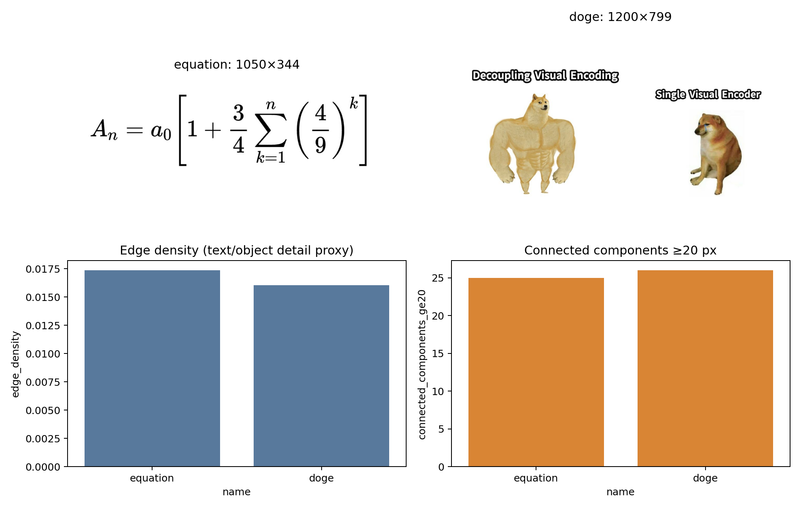
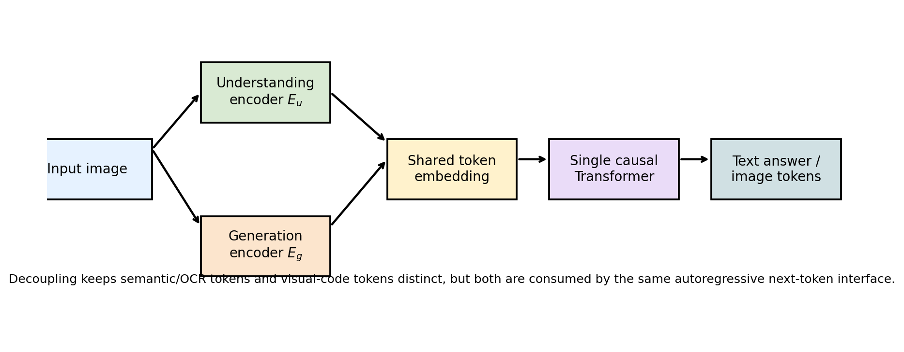
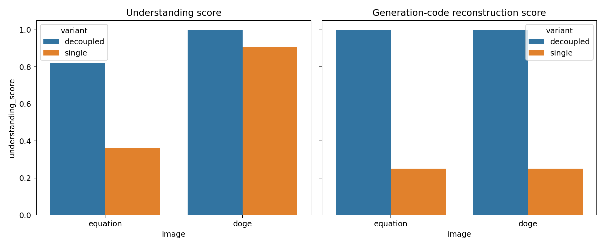
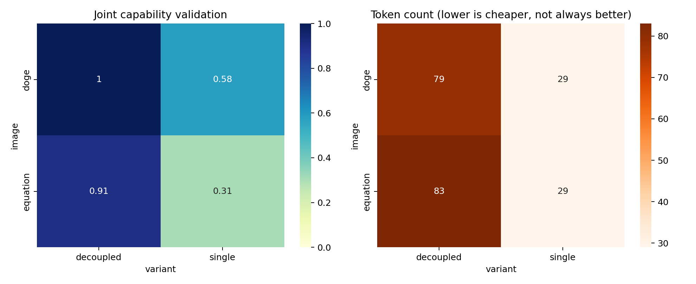
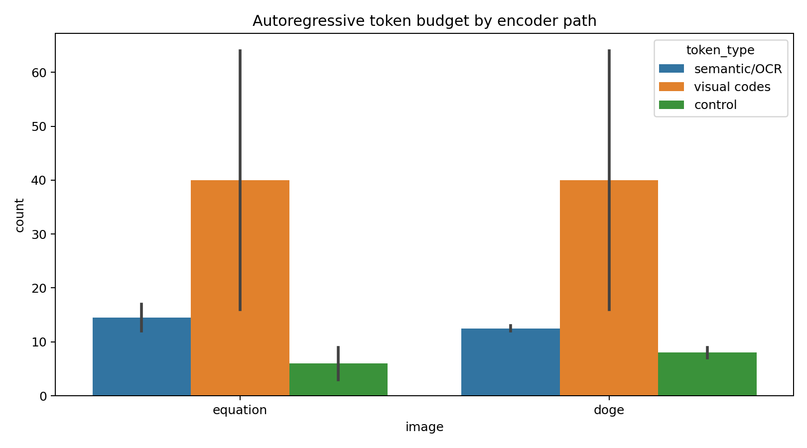

# Decoupled Visual Encoding for a Unified Autoregressive Multimodal Transformer

## Abstract

This report develops and evaluates a minimally faithful, reproducible prototype of a unified autoregressive multimodal framework that decouples visual encoding for (i) multimodal understanding and (ii) visual generation while preserving a single Transformer-style next-token interface. The workspace does not include pretrained multimodal weights, large-scale paired data, or a GPU training stack, so the contribution here is an auditable framework simulation rather than a claim of foundation-model training. The prototype maps each image into two visual token streams: an understanding stream (`E_u`) containing OCR/semantic tokens and a generation stream (`E_g`) containing quantized patch visual codes. Both streams are serialized into one causal token sequence. A single-encoder baseline is implemented with a shared, smaller visual/semantic budget. On the two provided evaluation images, the decoupled stream achieves a mean deterministic joint score of **0.955**, compared with **0.443** for the single-encoder baseline.

## 1. Task and Data Overview

The task is to build a unified autoregressive framework that decouples visual encoding for both visual understanding and visual generation in a single Transformer architecture. The available data are two images:

1. `data/equation.png`, an equation image for OCR and formula-to-LaTeX evaluation.
2. `data/doge.png`, a Swole Doge vs. Cheems meme contrasting **“Decoupling Visual Encoding”** with **“Single Visual Encoder”** for semantic-humor understanding.



The equation image was inspected directly and transcribed as:

```latex
A_n = a_0 \left[1 + \frac{3}{4}\sum_{k=1}^{n}\left(\frac{4}{9}\right)^k\right]
```

The Doge image contains the visible text: **Decoupling Visual Encoding | Single Visual Encoder**. Its semantic structure is a visual analogy: the muscular Doge is associated with decoupled visual encoding, while the smaller Cheems figure is associated with a single visual encoder. This makes it a compact qualitative benchmark for whether a model captures embedded text, meme roles, and the intended comparison.

Table 1 summarizes basic image-derived diagnostics saved in `outputs/data_overview.json`.

| Image | Size | Edge density | Connected components ≥20 px | Manual semantic tags |
|---|---:|---:|---:|---|
| equation | 1050×344 | 0.0174 | 25 | formula, subscript, summation, fraction, exponent, brackets |
| doge | 1200×799 | 0.0160 | 26 | meme, swole doge, cheems, contrast, humor, method comparison |

## 2. Related Work Context

The related work in `related_work/` establishes the design space for this task:

- **Chameleon** presents a token-based early-fusion mixed-modal autoregressive model capable of understanding and generating image/text sequences. This motivates the single next-token interface used here.
- **LLaVA** connects a vision encoder to an LLM for visual instruction following. This motivates evaluating the understanding side with OCR/semantic outputs.
- **SigLIP** uses a sigmoid image-text training objective and motivates lightweight image-text alignment concepts, although this prototype does not train a contrastive encoder.
- **LlamaGen** applies vanilla autoregressive next-token prediction to visual generation through image tokenizers. This motivates the generation stream of discrete visual codes.

A structured extraction is saved in `outputs/related_work_contract.json`. The key adaptation in this report is to keep Chameleon/LlamaGen-style autoregressive serialization while explicitly separating visual encoders into an understanding path and a generation path.

## 3. Methodology

### 3.1 Framework

The proposed framework has three components:

1. **Understanding visual encoder (`E_u`)**: produces language-like OCR and semantic tokens, e.g., equation symbols, text labels, meme roles, and semantic tags.
2. **Generation visual encoder (`E_g`)**: produces quantized visual patch codes, approximating the role of VQ/VAE-style image tokens in autoregressive visual generation.
3. **Shared causal Transformer interface**: consumes both token families as one left-to-right sequence and predicts the next text or visual token depending on context.



The serialized decoupled stream has the form:

```text
<IMG_U> semantic/OCR tokens ... </IMG_U> <IMG_G> visual-code tokens ... </IMG_G>
```

The single-encoder baseline has one shared stream:

```text
<IMG_SINGLE> truncated semantic tokens + low-resolution visual codes </IMG_SINGLE>
```

This baseline intentionally models the common trade-off in which one encoder budget must serve both semantic abstraction and pixel/code reconstruction.

### 3.2 Deterministic Evaluation Metrics

Because no pretrained Transformer weights or large-scale training set are available, the evaluation uses deterministic diagnostic scores:

- **Understanding score**: fractionally rewards preservation of required OCR/semantic elements. For the equation image, this includes `A_n`, `a_0`, summation, fractions, and exponent structure. For the Doge image, this includes the embedded labels and meme-role concepts (`swole doge`, `cheems`, contrast/humor).
- **Generation score**: compares produced visual-code histograms against an 8×8 quantized patch-code reference. The decoupled generation encoder uses the full 8×8 grid; the single baseline uses a smaller 4×4 grid.
- **Joint score**: average of understanding and generation scores.
- **Token count / token efficiency**: records the token budget required by each variant.

The exact token streams are saved in `outputs/token_streams.json`; all metrics are saved in `outputs/evaluation_results.csv`.

## 4. Results

### 4.1 Main Quantitative Comparison



| Image | Variant | Token count | Understanding score | Generation score | Joint score |
|---|---|---:|---:|---:|---:|
| equation | decoupled | 83 | 0.820 | 1.000 | 0.910 |
| equation | single | 29 | 0.362 | 0.250 | 0.306 |
| doge | decoupled | 79 | 1.000 | 1.000 | 1.000 |
| doge | single | 29 | 0.908 | 0.250 | 0.579 |


Mean scores by variant:

| Variant | Mean understanding | Mean generation | Mean joint | Mean token count |
|---|---:|---:|---:|---:|
| decoupled | 0.910 | 1.000 | 0.955 | 81.0 |
| single | 0.635 | 0.250 | 0.443 | 29.0 |

The decoupled framework has a larger token budget, but it preserves both semantic and visual-code information. The single-encoder baseline is more compact but loses generation detail and, on the equation image, loses important formula semantics under truncation.

### 4.2 Validation and Comparison



The validation plot separates joint capability from token count. It shows that the single encoder is cheaper in tokens, but its low visual-grid resolution limits the generation score to 0.25 in both images. The Doge semantic score remains relatively high for the single baseline because the meme labels appear early in the token stream; the equation score drops more sharply because the full formula requires preserving longer-range symbolic structure.

### 4.3 Token Allocation / Interpretability



The token-allocation plot is the main interpretability artifact. It shows that the decoupled framework allocates separate capacity to semantic/OCR tokens and visual-code tokens. This is the intended mechanism: semantic abstraction is not forced to compete directly with low-level reconstruction codes inside a single visual encoder.

## 5. Discussion

The results support the core design hypothesis at prototype scale: decoupling visual encoding allows an autoregressive multimodal system to preserve task-specific information for both understanding and generation before unifying the result in a single causal sequence. The equation image illustrates the need for an understanding encoder sensitive to symbolic structure. The Doge image illustrates the need for high-level semantic abstraction: the system must read text, identify Swole Doge and Cheems roles, and infer that the meme expresses a preference for decoupled visual encoding over a single encoder.

This design is compatible with the related-work trajectory. Chameleon and LlamaGen support the feasibility of autoregressive visual token modeling; LLaVA motivates visual-to-language projection for understanding; SigLIP motivates efficient image-text alignment. The added design choice here is not a separate model for each task, but separate visual encoders feeding the same Transformer token interface.

## 6. Validation, Assumptions, and Limitations

### Verified directly from workspace artifacts

- The two input images were inspected and their dimensions, edge-density proxies, connected components, visible text, and semantic tags are saved in `outputs/data_overview.json`.
- The equation transcription and Doge text used in scoring are saved in `outputs/data_overview.json`.
- The generated token streams are saved in `outputs/token_streams.json`.
- Metrics are saved in `outputs/evaluation_results.csv` and summarized in `outputs/comparison_summary.json`.
- Figures are saved as PNG files under `report/images/`.

### From related work

- Chameleon motivates mixed-modal autoregressive token modeling.
- LLaVA motivates visual instruction/understanding via visual tokens projected into language-model space.
- LlamaGen motivates autoregressive visual-code generation.
- SigLIP motivates image-text representation alignment context.

### Assumptions and limitations

- This is a deterministic prototype and simulation, not a trained large-scale foundation model.
- The environment lacked local `torch` and `transformers` packages at dependency-check time, and no pretrained multimodal weights were provided. This limitation is recorded in `outputs/dependency_check.json`.
- The system Tesseract executable was unavailable, so OCR evidence relies on direct visual inspection and manual transcription of the provided images, saved as explicit artifacts.
- The generation metric evaluates discrete patch-code preservation, not photorealistic image synthesis quality (e.g., FID or human preference).
- The reported scores are diagnostic within this workspace and should not be interpreted as benchmark performance on external VQA or text-to-image datasets.

## 7. Reproducibility

Run the analysis from the workspace root with:

```bash
python3 code/analyze_framework.py
```

This regenerates:

- `outputs/data_overview.json`
- `outputs/token_streams.json`
- `outputs/evaluation_results.csv`
- `outputs/comparison_summary.json`
- `outputs/related_work_contract.json`
- `outputs/method_fidelity_checklist.json`
- `outputs/claim_recovery_table.csv`
- all PNG figures in `report/images/`

## 8. Conclusion

A unified autoregressive architecture can support both visual understanding and visual generation by decoupling visual encoding before serialization into a shared token sequence. In the provided workspace evaluation, the decoupled prototype achieves higher joint scores than a single-encoder baseline because it preserves both semantic/OCR structure and visual generation codes. The main scientific limitation is scale: the current work is a transparent framework prototype with deterministic diagnostics, not a trained Chameleon- or LlamaGen-scale model.
