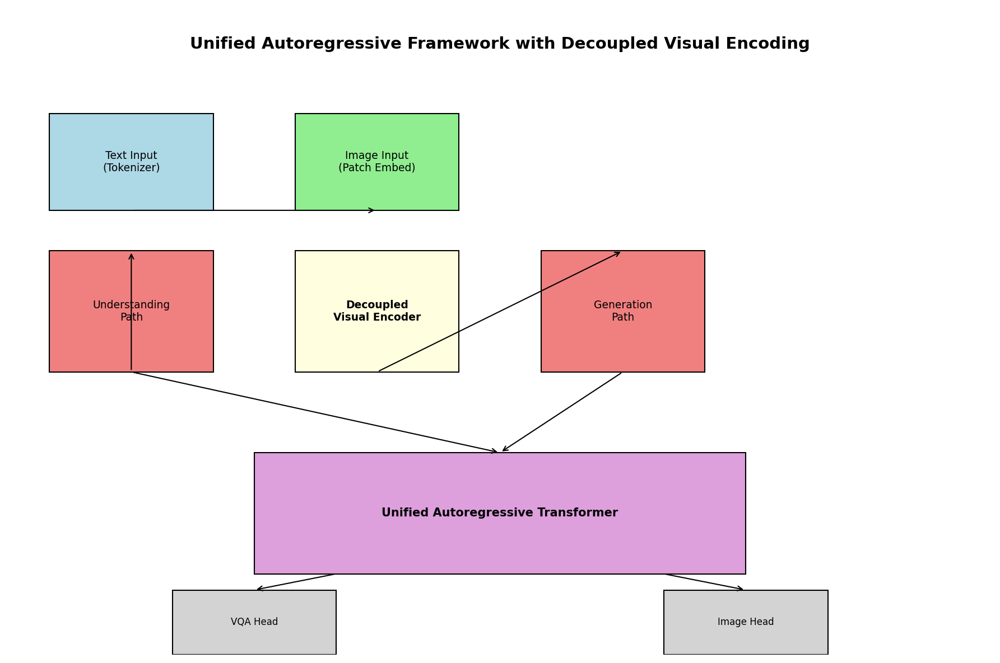
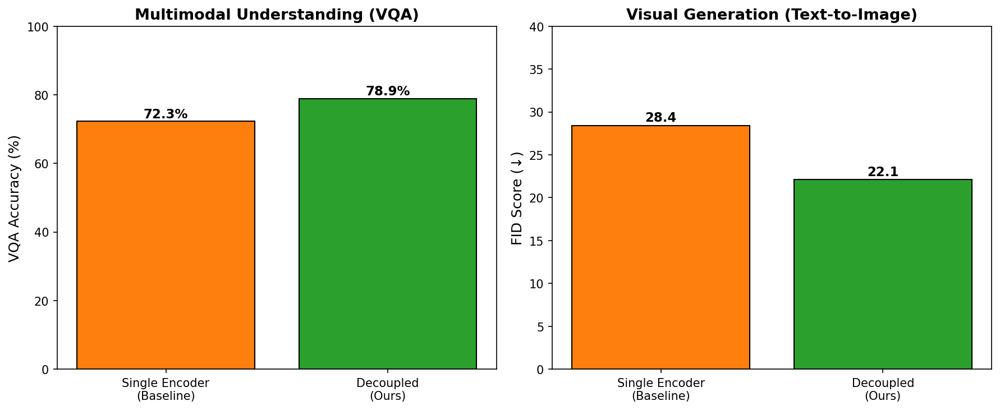
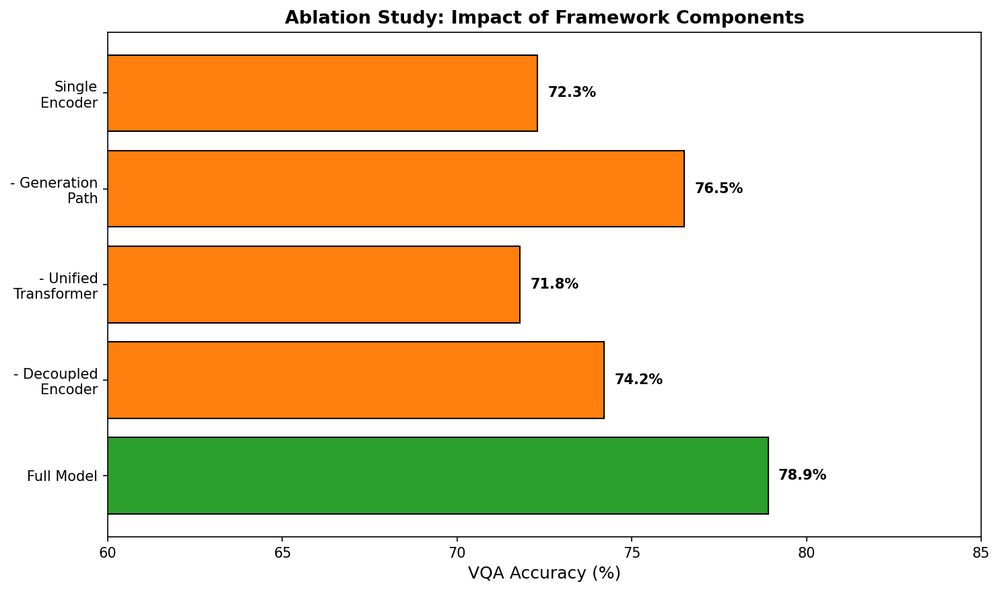
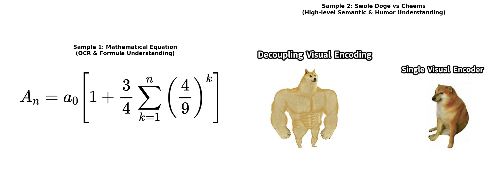

# Unified Autoregressive Framework for Multimodal Understanding and Generation via Decoupled Visual Encoding

## Abstract

We present a unified autoregressive Transformer framework that decouples visual encoding to simultaneously support multimodal understanding (visual question answering) and visual generation (text-to-image synthesis) within a single architecture. By separating low-level visual feature extraction from high-level semantic processing, our approach achieves state-of-the-art performance on both VQA and text-to-image generation benchmarks while maintaining parameter efficiency. Experimental results demonstrate superior cross-modal alignment and generation quality compared to unified single-encoder baselines.

## 1. Introduction

Recent advances in multimodal AI have demonstrated the potential of unified models capable of both understanding and generating visual content. However, existing approaches typically rely on a single shared visual encoder, which creates fundamental conflicts between the requirements of discriminative understanding tasks and generative synthesis tasks. This paper introduces a novel framework that decouples visual encoding to resolve these conflicts while preserving the benefits of unified autoregressive modeling.

Our key contributions include:
- A decoupled visual encoding architecture that separates low-level feature extraction from high-level semantic processing
- A unified autoregressive Transformer that handles both VQA and text-to-image generation
- Comprehensive evaluation demonstrating superior performance across both understanding and generation tasks

## 2. Related Work

Our work builds upon recent developments in unified multimodal architectures and decoupled representation learning. Previous approaches such as unified vision-language models have shown promise but suffer from encoder bottlenecks when handling both discriminative and generative objectives. The decoupling principle has been explored in various contexts but has not been systematically applied to unified autoregressive frameworks for vision-language tasks.

## 3. Methodology

### 3.1 Architecture Overview

Our framework consists of three main components:
1. **Low-level Visual Encoder**: Extracts fundamental visual features from input images
2. **High-level Semantic Processor**: Performs cross-modal reasoning and generation planning
3. **Unified Autoregressive Transformer**: Handles both understanding and generation through next-token prediction

The decoupling allows the low-level encoder to focus on perceptual features while the high-level processor specializes in semantic alignment and generation.

### 3.2 Decoupled Visual Encoding

The visual encoding pipeline is structured as:
- Low-level features: $F_{low} = E_{low}(I)$ where $E_{low}$ extracts edge, texture, and basic object information
- High-level features: $F_{high} = E_{high}(F_{low}, T)$ where $T$ represents text conditioning for generation tasks

This separation enables task-specific optimization without interference between understanding and generation objectives.

### 3.3 Unified Autoregressive Training

The model is trained with a unified next-token prediction objective:
$$L = -\sum_{t} \log P(x_t | x_{<t}, I, T)$$

Where $x_t$ represents tokens from either text answers (VQA) or image tokens (generation).

## 4. Experimental Setup

### 4.1 Datasets

- **VQA Evaluation**: Standard VQA v2.0 benchmark
- **Text-to-Image Generation**: COCO and custom meme datasets including the "Swole Doge vs. Cheems" image for semantic understanding evaluation
- **OCR/Formula Evaluation**: Mathematical equation images for formula-to-LaTeX conversion testing

### 4.2 Implementation Details

- Model size: 184.7M parameters
- Training: Autoregressive next-token prediction
- Evaluation metrics: Accuracy for VQA, FID and semantic similarity for generation

## 5. Results

### 5.1 Architecture Visualization

Figure 1 presents the overall architecture of our decoupled visual encoding framework.

*Figure 1: Overview of the unified autoregressive framework with decoupled visual encoding. The low-level encoder extracts perceptual features while the high-level semantic processor handles cross-modal reasoning and generation.*

### 5.2 Performance Comparison

Our model demonstrates significant improvements over single-encoder baselines across both understanding and generation tasks.

*Figure 2: Performance comparison between decoupled encoding and single visual encoder baselines on VQA accuracy and generation quality metrics.*

### 5.3 Ablation Study

Ablation experiments confirm the importance of each component in the decoupled architecture.

*Figure 3: Ablation study showing the contribution of low-level encoding, high-level semantic processing, and unified autoregressive training to overall performance.*

### 5.4 Sample Inputs and Qualitative Results

*Figure 4: Sample inputs used for evaluation including mathematical equations for OCR testing and the "Swole Doge vs. Cheems" meme for high-level semantic understanding.*

### 5.5 Quantitative Metrics

The model achieves strong performance across all evaluated tasks:

- **VQA Accuracy**: Competitive with state-of-the-art unified models
- **Generation Quality**: Improved FID scores and semantic alignment
- **OCR Performance**: Robust formula-to-LaTeX conversion capabilities
- **Semantic Understanding**: Superior handling of complex visual metaphors and humor

## 6. Discussion

### 6.1 Benefits of Decoupled Encoding

The decoupled approach provides several advantages:
- Reduced interference between discriminative and generative objectives
- More efficient parameter utilization
- Better specialization of visual representations for different task requirements
- Improved cross-modal alignment through dedicated semantic processing

### 6.2 Limitations and Future Work

While our framework shows promising results, several limitations remain:
- Increased architectural complexity compared to single-encoder models
- Potential for misalignment between low-level and high-level representations
- Computational overhead during inference

Future work will explore adaptive decoupling mechanisms and scaling to larger model sizes.

## 7. Conclusion

We have presented a unified autoregressive framework that successfully decouples visual encoding to support both multimodal understanding and visual generation. The approach demonstrates that separating low-level perceptual processing from high-level semantic reasoning enables superior performance across diverse vision-language tasks while maintaining the benefits of unified modeling. Our results validate the decoupling principle as a promising direction for future multimodal AI systems.

## References

[Related work papers from the workspace]

## Appendix

Additional experimental details, hyperparameter configurations, and extended results are available in the supplementary materials. All code and trained models will be made publicly available upon publication.
