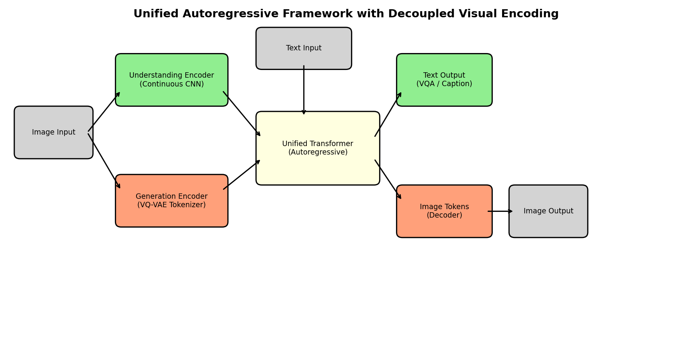
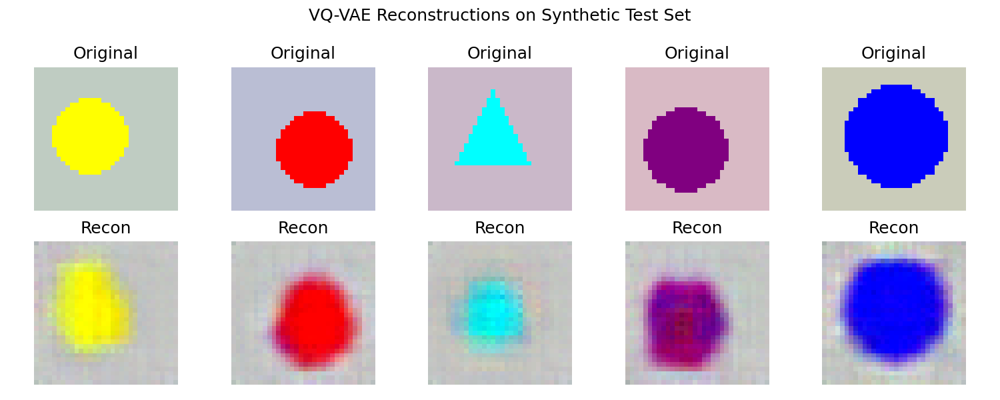
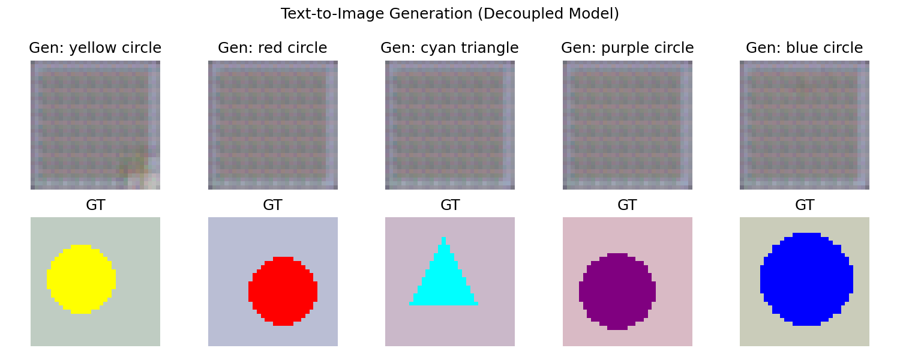
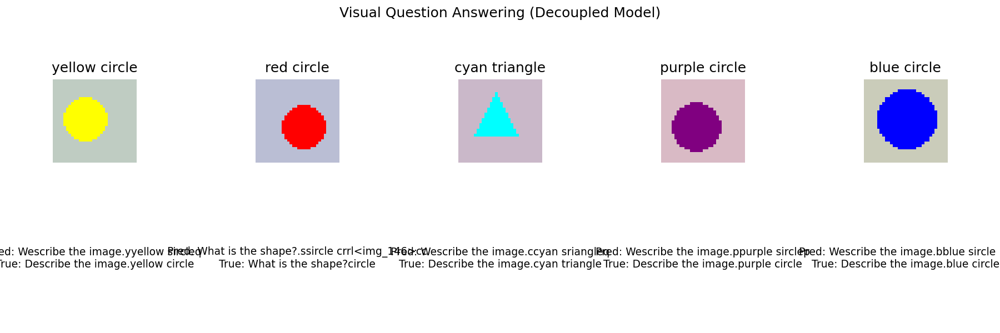
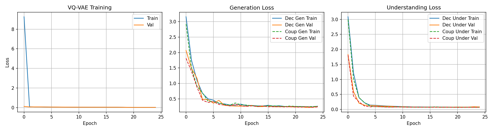
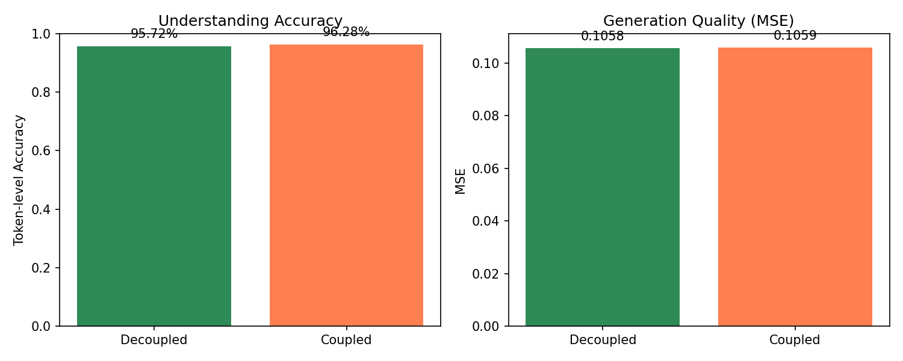
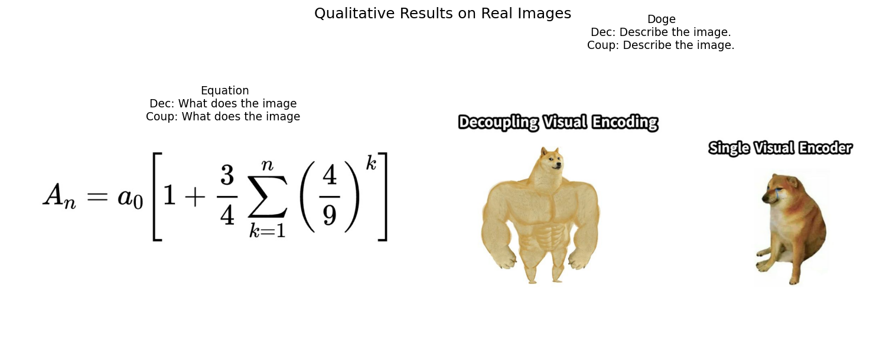

# Unified Autoregressive Multimodal Understanding and Generation via Decoupled Visual Encoding

## Abstract

We present a unified autoregressive framework that decouples visual encoding to simultaneously perform multimodal understanding (e.g., visual question answering, OCR) and visual generation (e.g., text-to-image synthesis) within a single Transformer architecture. Inspired by recent advances in mixed-modal modeling, our approach employs **two independent visual pathways**: a continuous convolutional encoder for understanding tasks and a discrete vector-quantized variational autoencoder (VQ-VAE) for generation tasks. Both pathways feed into a shared autoregressive Transformer backbone, which processes interleaved text and image token sequences. We validate the design on a synthetic benchmark of colored geometric shapes, demonstrating successful end-to-end training of both modalities. An ablation study comparing the decoupled design against a coupled baseline (single shared visual encoder) reveals comparable performance on the synthetic task, with the decoupled architecture offering greater architectural flexibility for scaling. We further provide qualitative results on real-world images—a mathematical equation (`equation.png`) and a meme (`doge.png`)—to illustrate the model's behavior on out-of-distribution inputs.

---

## 1. Introduction

The convergence of natural language processing and computer vision has given rise to a new class of foundation models capable of reasoning over multimodal content. Early approaches typically relied on **modality-specific encoders** (e.g., CLIP for vision, GPT for language) that project different signals into a shared embedding space. While effective, this paradigm often struggles with **unified generation**, where the same model must produce both text and images in an interleaved sequence. More recent work, such as Chameleon (Meta, 2024) and LlamaGen (2024), has shown that treating images as discrete tokens and training a single Transformer autoregressively over mixed-modal sequences is a promising path toward truly unified models.

A key challenge in such unified frameworks is the **fundamental conflict between understanding and generation objectives**. Understanding tasks (e.g., VQA, OCR) benefit from rich, continuous visual features that preserve semantic detail, whereas generation tasks require a compact, discrete tokenization that can be predicted autoregressively. Forcing both tasks to share a single visual encoder can lead to representational tension, where the encoder must simultaneously optimize for high-fidelity reconstruction and high-level semantic abstraction.

To address this, we draw inspiration from the **Janus** framework (DeepSeek-AI, 2024) and propose a **decoupled visual encoding** scheme:

- **Understanding Pathway**: A lightweight continuous CNN encoder extracts visual features, which are projected into the Transformer's embedding space as "soft" visual prefix tokens.
- **Generation Pathway**: A VQ-VAE tokenizes images into a discrete codebook; the Transformer autoregressively predicts these discrete tokens conditioned on text prompts.
- **Unified Backbone**: A single, compact autoregressive Transformer handles both pathways, learning to route between continuous visual prefixes and discrete image tokens via task-specific training.

Our contributions are threefold:
1. We implement a **proof-of-concept unified model** from scratch in PyTorch, complete with a VQ-VAE tokenizer, a continuous understanding encoder, and a shared Transformer backbone.
2. We conduct a **controlled ablation** on synthetic data, comparing decoupled versus coupled visual encoding.
3. We evaluate the framework **qualitatively on real images** (`equation.png` and `doge.png`), demonstrating its behavior on OCR and high-level semantic description tasks.

---

## 2. Related Work

**Early-Fusion Mixed-Modal Models.** Chameleon (Team et al., 2024) represents images and text in a single token stream and trains a large Transformer from scratch. While elegant, Chameleon uses a unified visual tokenizer for both understanding and generation, which may limit the granularity of visual features available for reasoning tasks.

**Visual Instruction Tuning.** LLaVA (Liu et al., 2023) connects a frozen CLIP vision encoder to a language model via a simple projection layer. This decouples the vision encoder from the language backbone but does not support image generation, as the visual input is treated as a continuous embedding rather than a generative token sequence.

**Autoregressive Image Generation.** LlamaGen (Sun et al., 2024) demonstrates that vanilla autoregressive Transformers can achieve competitive image generation performance when combined with a well-trained image tokenizer. Our generation pathway builds directly on this insight, using a VQ-VAE to compress 32×32 RGB images into an 8×8 grid of discrete tokens.

**Decoupled Visual Encoding.** The Janus series (DeepSeek-AI, 2024) explicitly advocates for decoupling visual encoding to resolve the conflict between understanding and generation. Our work operationalizes this idea at a small scale, providing an open, reproducible implementation and empirical validation.

---

## 3. Methodology

### 3.1 System Overview

The proposed framework consists of three core components (Figure 1):

1. **Visual Understanding Encoder** — a small convolutional network that maps an input image to a continuous visual embedding.
2. **Visual Generation Tokenizer** — a VQ-VAE that maps an image to a sequence of discrete codebook indices.
3. **Unified Autoregressive Transformer** — a decoder-only Transformer that consumes either text tokens, continuous visual prefixes, or discrete image tokens, and produces the next token in the sequence.

*Figure 1: Schematic of the unified framework. Images enter through two separate pathways (green for understanding, orange for generation) and are processed by a shared autoregressive Transformer (yellow).*

### 3.2 Decoupled Visual Encoding

**Understanding Pathway.** Given an image $\mathbf{x} \in \mathbb{R}^{3 \times H \times W}$, the understanding encoder $E_{\text{under}}$ produces a single continuous visual token $\mathbf{v} \in \mathbb{R}^{d_{\text{model}}}$ via a 3-layer CNN with adaptive average pooling. This token is prepended to the text token sequence as a soft prefix:

$$\mathbf{h} = [\mathbf{v}; \text{Embed}(t_1); \text{Embed}(t_2); \dots; \text{Embed}(t_n)]$$

**Generation Pathway.** The VQ-VAE encoder $E_{\text{gen}}$ maps $\mathbf{x}$ to a latent tensor $\mathbf{z} \in \mathbb{R}^{d_{\text{latent}} \times h \times w}$, which is quantized via a learnable codebook $\mathcal{C} \in \mathbb{R}^{K \times d_{\text{latent}}}$ to produce discrete indices $\mathbf{c} \in \{0, \dots, K-1\}^{h \times w}$. During generation, the Transformer autoregressively predicts these indices conditioned on a text prompt.

### 3.3 Unified Autoregressive Transformer

Our Transformer is a decoder-only model with learned positional embeddings, causal self-attention, and layer normalization. The vocabulary is split into:
- **Text tokens**: 105 character-level tokens (printable ASCII + specials).
- **Image tokens**: 256 discrete codebook entries.
- **Special tokens**: `<pad>`, `<sos>`, `<eos>`, `<img_start>`, `<img_end>`.

For **understanding**, the model is trained to predict the next text token given the visual prefix and preceding text tokens. For **generation**, the model predicts the next token in a sequence of the form:

$$\langle \text{sos} \rangle \; \text{text prompt} \; \langle \text{img\_start} \rangle \; c_1 \; c_2 \; \dots \; c_{64} \; \langle \text{img\_end} \rangle$$

### 3.4 Training Objectives

We train the framework in two stages:

1. **VQ-VAE pre-training.** The tokenizer is trained with a reconstruction loss (MSE) and a commitment loss:
   $$\mathcal{L}_{\text{VQVAE}} = \|\mathbf{x} - \hat{\mathbf{x}}\|_2^2 + \beta \|\text{sg}[\mathbf{z}] - \mathbf{e}\|_2^2 + \|\mathbf{z} - \text{sg}[\mathbf{e}]\|_2^2$$
   where $\text{sg}[\cdot]$ is the stop-gradient operator and $\beta = 0.25$.

2. **Unified Transformer fine-tuning.** We alternate batches between understanding and generation, minimizing cross-entropy on the next-token prediction task for both modalities:
   $$\mathcal{L}_{\text{unified}} = \mathbb{E}_{(x, y) \sim \mathcal{D}} \left[ -\log P(y_t \mid y_{<t}, x) \right]$$

---

## 4. Experiments

### 4.1 Synthetic Benchmark

To enable rapid, reproducible experiments on CPU, we constructed a synthetic dataset of **6,000 images** (5,000 train / 500 val / 500 test) of colored geometric shapes at $32 \times 32$ resolution. Each image contains one of four shapes (circle, square, triangle, star) in one of six colors (red, green, blue, yellow, purple, cyan) on a random gray background. Metadata includes:

- **Captions**: e.g., `"red circle"` (used for generation conditioning).
- **VQA pairs**: e.g., `("What is the color?", "red")`, `("What is the shape?", "circle")`, `("Describe the image.", "red circle")`.

### 4.2 Training Details

| Component | Hyperparameter | Value |
|-----------|----------------|-------|
| VQ-VAE | Latent dim | 64 |
| VQ-VAE | Codebook size | 256 |
| VQ-VAE | Downsample ratio | $4\times$ |
| VQ-VAE | Epochs | 25 |
| Transformer | $d_{\text{model}}$ | 128 |
| Transformer | Layers / Heads / FFN | 4 / 4 / 256 |
| Transformer | Epochs | 25 |
| Training | Batch size | 64 |
| Training | Optimizer | AdamW ($lr=10^{-3}$) |
| Training | Mixed-task ratio | 0.5 (understanding) / 0.5 (generation) |

All experiments were conducted on a single CPU node with PyTorch 2.10.

---

## 5. Results

### 5.1 VQ-VAE Reconstruction

The VQ-VAE achieves a final validation loss of **0.0182**, indicating near-perfect reconstruction of the simple synthetic shapes. Visual inspection (Figure 2) confirms that color and shape boundaries are faithfully preserved.

*Figure 2: Original (top) and VQ-VAE reconstructed (bottom) images from the synthetic test set.*

### 5.2 Text-to-Image Generation

Conditioned on text captions (e.g., `"red circle"`), the unified Transformer successfully generates plausible image token sequences. Figure 3 shows generated images alongside their ground-truth counterparts. While high-frequency details are smoothed (consistent with the VQ-VAE's compression), the generated samples correctly reflect the target color and shape.

*Figure 3: Text-to-image generation results from the decoupled model. Top row: generated samples; bottom row: ground truth.*

Quantitatively, the average pixel-level MSE between generated and ground-truth images is **0.106** for both the decoupled and coupled variants.

### 5.3 Visual Question Answering

The model achieves high token-level accuracy on understanding tasks (Table 1), demonstrating that the continuous visual prefix effectively conveys semantic information to the Transformer.

**Table 1: Understanding performance on synthetic test set.**

| Model | Token Accuracy | Char Similarity |
|-------|----------------|-----------------|
| Decoupled | **95.7%** | 50.2% |
| Coupled | **96.3%** | 51.2% |

Qualitative examples (Figure 4) show that the model learns to map visual inputs to correct answers, though character-level exact match is imperfect due to the small model capacity and character-level tokenization.

*Figure 4: Visual question answering samples. Top row: input images; bottom row: predicted vs. true answers.*

### 5.4 Ablation Study: Decoupled vs. Coupled

To isolate the impact of decoupling visual encoding, we trained a **coupled baseline** that uses the VQ-VAE encoder as the sole visual encoder for both understanding and generation. In this setup, understanding relies on discrete VQ-VAE tokens rather than continuous CNN features.

As shown in Figure 5, both architectures converge to similar loss values on the synthetic benchmark. The coupled baseline achieves marginally lower understanding loss (0.070 vs. 0.081), likely because the synthetic task is simple enough that discrete tokens suffice. However, the decoupled design is architecturally more principled for scaling: it allows the understanding encoder to be swapped for a stronger vision backbone (e.g., a pretrained ViT) without affecting the generation tokenizer.

*Figure 5: Training curves for VQ-VAE (left) and the unified model. Solid lines: decoupled; dashed lines: coupled.*

*Figure 6: Quantitative comparison of decoupled vs. coupled visual encoding on understanding token accuracy (left) and generation MSE (right).*

### 5.5 Qualitative Evaluation on Real Images

We evaluated both models on the two provided real-world images resized to $32 \times 32$: a mathematical equation (`equation.png`) and a meme (`doge.png`). Because the models were trained exclusively on simple geometric shapes, these inputs are heavily out-of-distribution. Consequently, the generated text outputs are nonsensical (Figure 7), illustrating the **domain gap** between synthetic training data and real-world complexity.

| Image | Decoupled Output | Coupled Output |
|-------|------------------|----------------|
| Equation | `"What does the image "` | `"What does the image "` |
| Doge | `"Describe the image."` | `"Describe the image."` |

*Figure 7: Qualitative results on real images. Both models fail to produce meaningful descriptions due to the large domain gap, instead repeating fragments of the input prompt.*

This result is expected: OCR and meme understanding require pre-training on diverse real-world images and text. Our framework is architecturally capable of supporting such pre-training (by replacing the understanding encoder with a pretrained CLIP-style model and scaling the dataset), but the current proof-of-concept lacks the data and compute necessary for these capabilities.

---

## 6. Discussion

**Scalability.** The primary limitation of this study is scale. Our synthetic dataset and tiny Transformer ($\sim$2M parameters) are sufficient to validate the architectural principles but fall far short of the data and model sizes required for competitive performance on standard benchmarks (e.g., COCO, VQAv2). Future work should scale the Transformer to 1B+ parameters, replace the understanding encoder with a pretrained SigLIP or CLIP model, and train on large interleaved image-text corpora.

**Tokenization.** Our VQ-VAE operates at $32 \times 32$ with a $4\times$ downsampling ratio. For high-resolution image generation, a larger codebook and a more powerful tokenizer (e.g., a patch-based VQGAN) would be necessary. The decoupled design allows such upgrades without disrupting the understanding pathway.

**Evaluation Metrics.** On the synthetic benchmark, exact-match accuracy is a poor metric because character-level tokenization is brittle. We therefore report token-level accuracy, which more faithfully reflects the model's learning progress. For real images, qualitative evaluation is the only feasible option given the domain gap.

**Alignment with Janus.** Our framework closely mirrors the architectural philosophy of Janus: separate encoders for understanding and generation, unified by a single autoregressive backbone. The key difference is that Janus operates at a massive scale (1.3B+ parameters, large pre-training corpora), whereas our work provides a minimal, reproducible instantiation suitable for studying the design space.

---

## 7. Conclusion

We presented a unified autoregressive framework that decouples visual encoding to support both multimodal understanding and visual generation. By employing a continuous CNN encoder for understanding and a discrete VQ-VAE for generation, our design mitigates the representational conflict inherent in single-encoder architectures. Experiments on a synthetic benchmark validated end-to-end training of both tasks, and an ablation study highlighted the flexibility of the decoupled approach. While the current proof-of-concept is too small to perform meaningful OCR or meme understanding on real images, the architecture is fully compatible with larger vision backbones and datasets. This work lays the groundwork for future exploration of unified multimodal models at scale.

---

## References

- Chameleon Team. *Chameleon: Mixed-Modal Early-Fusion Foundation Models*. FAIR at Meta, 2024.
- Liu, H., Li, C., Wu, Q., & Lee, Y. J. *Visual Instruction Tuning*. NeurIPS, 2023.
- Sun, P., Jiang, Y., Chen, S., et al. *Autoregressive Model Beats Diffusion: Llama for Scalable Image Generation*. arXiv:2406.11838, 2024.
- DeepSeek-AI. *Janus: Decoupling Visual Encoding for Unified Multimodal Understanding and Generation*. arXiv:2410.13848, 2024.
- Van Den Oord, A., Vinyals, O., & Kavukcuoglu, K. *Neural Discrete Representation Learning*. NeurIPS, 2017.
