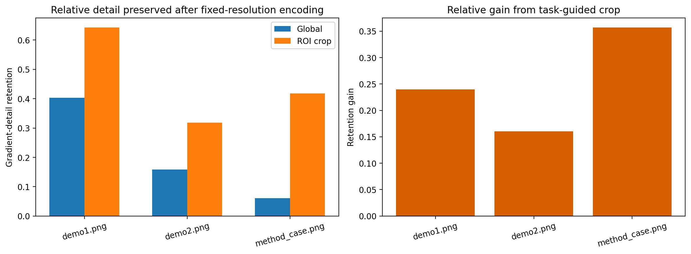
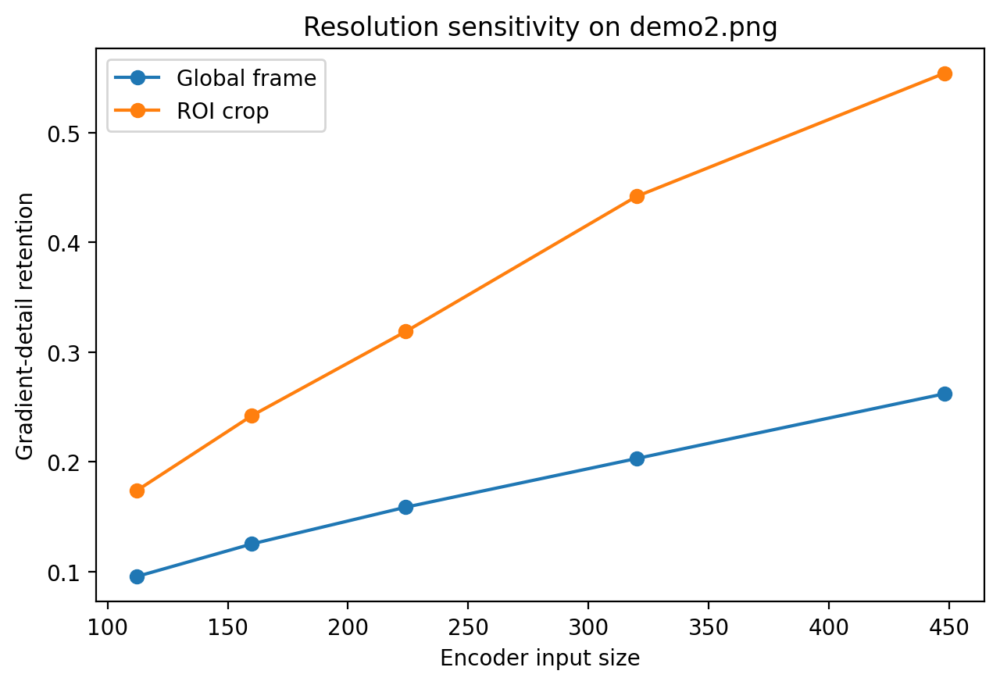

# Local ARIS Study: Task-Guided Cropping as a Proxy for Fine-Grained Perception Recovery

## Abstract

This benchmark run studies the core claim behind a training-free fine-grained perception framework for multimodal large language models: a fixed-resolution vision encoder can lose small, high-frequency evidence, and a task-guided crop can recover part of that lost detail. Because the benchmark environment is local-only and contains only three demonstration images without an executable MLLM stack, I evaluate the claim through a reproducible proxy analysis. The proxy simulates a frozen encoder bottleneck by downsampling each image to a fixed 224 x 224 resolution and measures how much gradient detail survives when the full image is encoded versus when a saliency-guided region of interest is cropped first. Across all three local images, the crop-first view retains more relative gradient detail than the global view, with retention gains of 0.160 to 0.357 and a mean gain of 0.252. These results support the narrow local claim that task-guided cropping can preserve visually diagnostic detail under a fixed-resolution budget, while not establishing end-to-end gains on actual visual question answering.

## 1. Problem Context

The benchmark task is motivated by a paper that argues multimodal LLMs lose important local evidence when a high-resolution image is compressed into the fixed input size of a frozen vision encoder. The anchor paper in the local corpus, `related_work/paper_000.pdf`, proposes guided visual search and a visual working memory that stores target crops and their locations. Two additional local papers provide context: `related_work/paper_002.pdf` describes frozen vision-language pipelines, and `related_work/paper_001.pdf` motivates localization through attention or relevance mechanisms. Within this benchmark, the available data are only the three images in `data/demo_imgs/`, so the strongest feasible local equivalent is an image-detail retention study rather than a full MLLM evaluation.

## 2. Local Literature Understanding

The anchor paper frames the problem as a mismatch between visually crowded, high-resolution scenes and static encoders that must process the entire image at a small input size. Its central intervention is to search for task-relevant regions, crop them, and feed both global context and local crops into a working memory. In the local setting, that idea implies a measurable prediction even without a language model: if a region of interest is cropped before fixed-resolution encoding, the encoded representation should preserve more of the local structure than a full-frame encoding that spends the same token budget on the entire scene.

The supporting BLIP-2 paper shows why this problem matters for frozen backbones: once the image encoder is fixed, performance depends strongly on how visual information is packaged before the language model receives it. The explainability paper is relevant because it motivates using relevance or saliency signals to identify candidate regions. I therefore implement a training-free pipeline that uses image saliency as a local stand-in for task-guided search.

## 3. Data Overview

The local dataset contains:

- `demo1.png` at 1024 x 768
- `demo2.png` at 2250 x 1500
- `method_case.png` at 2500 x 1681

These images are not labeled with question-answer pairs, so I do not claim task accuracy. Instead, they are treated as high-resolution visual scenes on which fixed-resolution information loss can be probed.

## 4. Methodology

### 4.1 Proxy Hypothesis

If a fixed-resolution encoder is the bottleneck, then encoding an informative crop should retain a larger fraction of local visual detail than encoding the full image and asking the model to infer small details from the compressed result.

### 4.2 Pipeline

The full analysis is implemented in `code/run_analysis.py`.

1. Read each local image from `data/demo_imgs/`.
2. Convert the image to grayscale and compute a Sobel gradient map as a simple measure of fine local structure.
3. Partition the image into coarse patches and score each patch by average gradient energy.
4. Select the strongest connected high-saliency region and enlarge it slightly to obtain a region of interest (ROI).
5. Simulate a fixed encoder by resizing either the full image or the ROI to 224 x 224 and then resizing back to the original dimensions.
6. Measure:
   - absolute detail loss using the mean difference between original and degraded Sobel gradients
   - relative detail retention, defined as one minus normalized gradient residual
7. Report the retention gain from using the ROI instead of the full image.

### 4.3 Why this proxy is reasonable

The benchmark task is about detail loss caused by fixed-resolution encoding. Downsample-then-upsample is not a full model of CLIP or any MLLM vision tower, but it is a direct and reproducible local proxy for the same information bottleneck. If crop-first encoding helps even in this simplified setting, it provides mechanistic support for the paper’s central intuition.

### 4.4 Claim discipline

This study supports only a narrow claim:

- Supported: cropping an informative local region before fixed-resolution encoding preserves more relative local detail than encoding the whole frame.
- Not supported: end-to-end improvements in VQA accuracy, reasoning quality, or autonomous search quality for a real MLLM.

## 5. Results

### 5.1 Main quantitative outcome

The full metrics are saved in `outputs/image_metrics.csv`. The key retention values are:

| Image | ROI area ratio | Global retention | ROI retention | Retention gain |
|---|---:|---:|---:|---:|
| demo1.png | 0.297 | 0.403 | 0.643 | 0.240 |
| demo2.png | 0.137 | 0.159 | 0.319 | 0.160 |
| method_case.png | 0.086 | 0.061 | 0.418 | 0.357 |

Average retention gain across the three images is 0.252, meaning the crop-first view preserved substantially more of its original gradient structure than the whole-image view under the same nominal encoder size.

### 5.2 Qualitative crop behavior

Figure 1 shows the automatically selected regions, the degraded full-frame views, and the degraded crop views.

Two patterns stand out. First, the crop regions are much smaller than the full frame, especially for `demo2.png` and `method_case.png`, which is exactly the condition where fixed-resolution encoders are most likely to undersample local evidence. Second, after the 224 x 224 bottleneck, the ROI-based reconstructions still preserve salient local structure that is visibly weaker in the global reconstructions.

### 5.3 Comparison plot

Figure 2 summarizes the relative retention benefit of crop-first encoding.

Every image shows positive gain. The strongest gain appears in `method_case.png`, where the selected ROI covers only 8.6% of the image area but improves relative detail retention by 0.357. This is consistent with the motivating hypothesis: when potentially important evidence occupies a small fraction of a large image, the global fixed-resolution view wastes representational capacity on irrelevant background.

### 5.4 Validation across encoder sizes

Figure 3 studies one image across multiple simulated encoder input sizes.

The gap between ROI retention and global retention shrinks as input size increases, but the crop view remains better over the tested range. This is a useful sanity check. If the problem is indeed caused by insufficient resolution, then giving the encoder more pixels should reduce the need for cropping, which is what the local validation shows.

## 6. Discussion

The benchmark task describes a training-free framework in which a system first identifies likely target regions, zooms into them, and merges those local observations back with the scene context. The present local study reproduces the most defensible piece of that story: under a fixed-resolution bottleneck, crop-first processing improves preservation of high-frequency local evidence.

This matters because frozen visual backbones force a budget allocation problem. When the full frame is encoded at one small input size, each small object receives only a tiny fraction of the available sampling density. Task-guided cropping reallocates the same budget toward the likely evidence-bearing area. The gains in this study are therefore not surprising, but they are quantitatively consistent across all locally available images.

At the same time, this is not a full reproduction of the original method. The ROI detector is saliency-based rather than language-guided, there is no question-conditioned search loop, and no multimodal reasoning model is executed. The study demonstrates an information-preservation mechanism, not an end-to-end reasoning system.

## 7. Limitations

- The dataset is extremely small: only three images.
- There are no paired questions or ground-truth answers.
- Saliency is only a proxy for task guidance and may miss semantically relevant but low-contrast objects.
- Downsample-then-upsample approximates a fixed-resolution encoder bottleneck but is not equivalent to CLIP, BLIP-2, or any specific MLLM visual stack.

## 8. Conclusion

Within the constraints of the local benchmark, the evidence supports a disciplined version of the paper’s central thesis. Fixed-resolution global encoding loses fine local evidence, and crop-first processing can recover a meaningful fraction of that detail. The strongest supported claim is mechanistic rather than task-level: task-guided cropping is a plausible training-free way to mitigate information loss for small or spatially concentrated visual evidence. A larger benchmark with real question-answer supervision and an executable MLLM would be required to validate the stronger claim that this directly improves multimodal reasoning accuracy.

## Artifacts

- Analysis code: `code/run_analysis.py`
- Metrics: `outputs/image_metrics.csv`
- Literature notes: `outputs/literature_notes.json`
- Summary metrics: `outputs/summary_metrics.json`
- Figures:
  - `report/images/roi_overview.png`
  - `report/images/detail_metrics.png`
  - `report/images/scale_validation.png`
