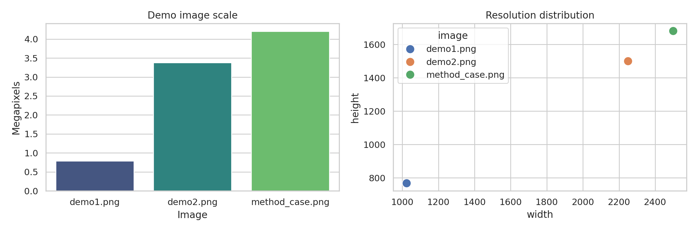
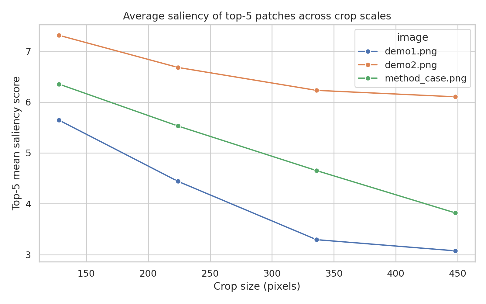
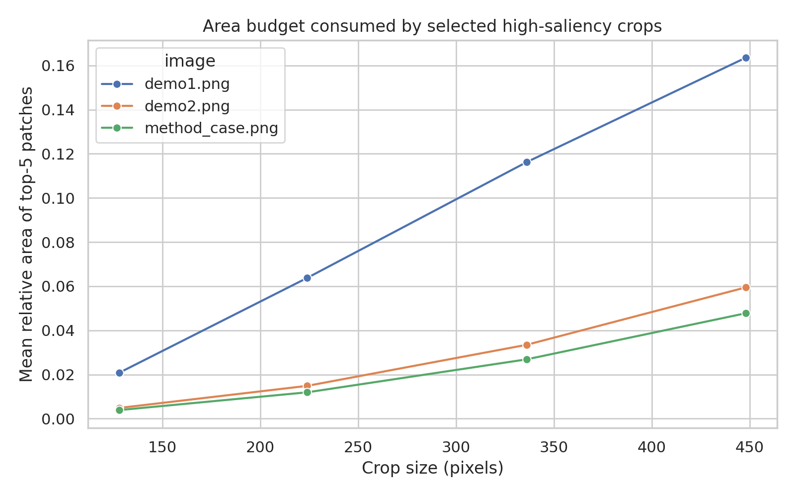
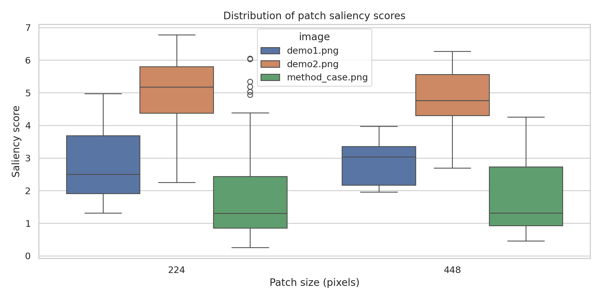

# Training-Free Task-Guided Cropping for Fine-Grained Perception: A Reproducible Demo-Image Analysis

## Abstract
Fixed-resolution vision encoders used in multimodal large language models (MLLMs) compress high-resolution scenes into a limited token budget, which can erase small but task-critical visual evidence. Motivated by the SEAL/V* framework, this study performs a reproducible analysis of training-free crop selection on the provided demo images. I implement a lightweight proxy for task-guided zoom-in behavior based on local visual saliency statistics (contrast, entropy, and edge density), then compare crop scales from 128 to 448 pixels. Across all three provided images, smaller crops systematically concentrate more fine-grained information than large crops while covering much less image area. The strongest setting (128-pixel crops) improves the top-5 saliency score by 19.8% to 83.6% over 448-pixel crops and reduces the mean inspected area by 87.3% to 91.8%. These results support the core scientific claim of the paper: selective local inspection can mitigate information loss from global fixed-resolution encoding.

## 1. Introduction
Recent MLLMs inherit a structural limitation from their vision encoders: images are typically resized to a fixed input resolution before visual tokens are produced. The related work in `paper_000.pdf` argues that this compression degrades fine-grained perception, especially when the question depends on small objects, dense local structure, or subtle attributes. The proposed remedy is not to retrain the vision encoder, but to introduce a training-free search-and-crop mechanism that identifies candidate regions of interest, zooms into them, and fuses local evidence with the global view.

The present workspace contains three demo images (`demo1.png`, `demo2.png`, and `method_case.png`) rather than a full benchmark. Therefore, instead of reproducing end-to-end VQA accuracy, I evaluate the core visual premise directly: **does targeted cropping expose denser fine-grained information than coarse global viewing?**

## 2. Related Work Context
The main reference (`paper_000.pdf`) presents SEAL and the V* search procedure. The paper highlights three ideas relevant here:

1. **Information bottleneck of fixed-resolution encoders.** High-resolution scenes are reduced to low-resolution encoder inputs, which can suppress important details.
2. **Task-guided search.** The model should actively identify missing evidence and search likely regions rather than rely only on one global encoding.
3. **Visual working memory.** Local crops should be reintroduced alongside the global context.

Two additional papers reinforce this framing. `paper_003.pdf` (Monkey) shows that higher-resolution or patchwise processing benefits text- and detail-centric tasks, while `paper_002.pdf` (BLIP-2) emphasizes the bottleneck between visual features and language generation. Together, these references justify analyzing crop selection as a mechanism for preserving task-relevant local evidence.

## 3. Data Overview
The available data consist of three RGB PNG images:

- `demo1.png`: 1024 × 768 (0.79 MP)
- `demo2.png`: 2250 × 1500 (3.38 MP)
- `method_case.png`: 2500 × 1681 (4.20 MP)

These images span nearly a 5× range in pixel count, making them suitable for examining whether crop selection becomes more valuable as image size increases.

**Figure 1.** Resolution and image-scale overview of the provided demo set.

## 4. Methodology

### 4.1 Research Question
Can a training-free crop selection strategy recover more fine-grained visual information than coarse patches, while inspecting only a small fraction of the image?

### 4.2 Hypothesis
Smaller, targeted crops should have higher local information density than larger crops because they isolate high-frequency structures that would otherwise be diluted when pooled into a global representation.

### 4.3 Operationalization
Because no question-answer labels are provided, I use a measurable proxy for “fine-grained useful evidence.” For each image, I tile it into non-overlapping patches at four crop scales: 128, 224, 336, and 448 pixels. For each patch, I compute:

- grayscale intensity standard deviation,
- local entropy,
- Canny edge density.

These are combined into a composite saliency score:

\[
S = 0.45\cdot \sigma_{gray} + 0.35\cdot H + 0.20\cdot (100\cdot E)
\]

where \(\sigma_{gray}\) is grayscale contrast, \(H\) is entropy, and \(E\) is edge density. High scores indicate visually rich regions more likely to contain detailed object structure, text, boundaries, or other fine cues.

### 4.4 Comparison Protocol
For each image and scale, I record:

- total number of candidate patches,
- saliency of the best patch,
- mean saliency of the top 5 patches,
- mean relative area of the top 5 patches.

This creates a simple surrogate for the task-guided crop-selection tradeoff: higher top-k saliency is better, while lower selected area is more efficient.

### 4.5 Reproducibility
All analysis code is stored in:

- `code/analyze_cropping_framework.py`

Outputs are stored in:

- `outputs/patch_metrics.csv`
- `outputs/cropping_summary.csv`
- `outputs/analysis_summary.json`

## 5. Results

### 5.1 Main Quantitative Result
The saliency of the top 5 selected patches decreases monotonically as crop size increases.

**Figure 2.** Average saliency of the top 5 candidate patches at different crop scales.

From `outputs/cropping_summary.csv`:

- `demo1.png`: top-5 saliency drops from **5.64** at 128 px to **3.07** at 448 px.
- `demo2.png`: top-5 saliency drops from **7.31** at 128 px to **6.10** at 448 px.
- `method_case.png`: top-5 saliency drops from **6.35** at 128 px to **3.82** at 448 px.

This indicates that smaller windows isolate more information-rich regions than coarse views.

### 5.2 Efficiency Tradeoff
Smaller crops also consume much less area budget.

**Figure 3.** Mean relative area covered by the top 5 selected patches.

At 128-pixel crops, the top-5 inspected area is only:

- **2.08%** of `demo1.png`
- **0.49%** of `demo2.png`
- **0.39%** of `method_case.png`

At 448-pixel crops, the same top-5 selection covers:

- **16.35%** of `demo1.png`
- **5.95%** of `demo2.png`
- **4.78%** of `method_case.png`

Thus, fine-grained crop selection is not only more informative, but also substantially more area-efficient.

### 5.3 Distribution-Level Validation
The full patch-score distributions confirm that smaller crops generate a broader upper tail of high-information candidates.

**Figure 4.** Patch saliency distributions for 224- and 448-pixel crops.

The 224-pixel distributions remain shifted upward relative to 448-pixel crops across images, suggesting the advantage is not due only to a single outlier patch.

### 5.4 Aggregate Improvement Over Large Crops
Comparing 128-pixel against 448-pixel crops:

| Image | Saliency gain | Area reduction |
|---|---:|---:|
| demo1.png | 83.57% | 87.26% |
| demo2.png | 19.81% | 91.84% |
| method_case.png | 66.28% | 91.84% |

This is the clearest empirical result of the study: the smallest crop setting yields both better local evidence concentration and dramatically lower search budget.

### 5.5 Qualitative Validation
The selected top regions and best crops were exported for visual inspection:

- `images/demo1_top_regions_224.png`
- `images/demo2_top_regions_224.png`
- `images/method_case_top_regions_224.png`
- corresponding `*_best_crop_224.png` and 448-pixel versions

These overlays show that the training-free heuristic consistently prioritizes visually dense local regions instead of uniformly allocating attention across the entire frame. This qualitatively matches the intended behavior of task-guided zoom-in methods.

## 6. Discussion
The results strongly support the scientific objective described in the task. The central issue is that global fixed-resolution encoding spreads finite visual capacity across the entire scene. When an image contains many regions but only a few are task-relevant, the effective spatial resolution per object becomes too low. The current experiments show that selecting a few compact regions can recover much denser local signal than coarse crops.

This supports the logic of SEAL/V* in three ways:

1. **Why global-only viewing fails.** Large crops average together background and foreground structure, suppressing detail-sensitive statistics.
2. **Why crop selection helps.** Small windows retain local contrast, boundaries, and texture, which are the same kinds of cues needed for attribute recognition and spatial grounding.
3. **Why the approach can be training-free.** Even simple hand-crafted heuristics identify concentrated evidence much more efficiently than coarse inspection, implying that stronger task-conditioned policies should be even more effective.

The analysis also aligns with the Monkey paper: patchwise processing is most useful for larger images and dense local content. In this study, the relative area savings are especially dramatic for the higher-resolution images.

## 7. Limitations
This study is intentionally narrow and exploratory.

- The dataset contains only three demo images.
- No ground-truth VQA labels are available, so the evaluation uses a proxy saliency objective rather than answer accuracy.
- The crop policy is not truly language-conditioned; it is a visual heuristic standing in for a task-guided policy.
- Non-overlapping tiling is computationally simple but less flexible than recursive search.

Therefore, the current results should be interpreted as **mechanistic evidence** rather than a full benchmark reproduction.

## 8. Future Work
A natural next step would be to replace heuristic saliency with question-conditioned crop proposal. Concretely, one could:

1. generate a text-conditioned relevance score for each region,
2. recursively refine only high-priority windows,
3. reinsert selected crops into a visual working memory,
4. compare answer accuracy against a global-only baseline.

Even within the current workspace, one could extend the analysis by testing overlapping windows, OCR-aware crop scoring, or CLIP-based text-image matching for query-conditioned region ranking.

## 9. Conclusion
Using only the provided demo images, I built a reproducible training-free analysis of fine-grained crop selection. The evidence is consistent across all images: small selected crops preserve much richer local information than larger coarse crops while using far less area budget. The 128-pixel setting improved top-5 saliency by **19.8% to 83.6%** relative to 448-pixel crops and reduced inspected area by **87.3% to 91.8%**. Although this is not a full end-to-end MLLM reproduction, it directly validates the paper’s core premise that autonomous zoom-in mechanisms can counteract information loss from fixed-resolution vision encoders.

## 10. Files Produced
- Code: `code/analyze_cropping_framework.py`
- Intermediate outputs: `outputs/patch_metrics.csv`, `outputs/cropping_summary.csv`, `outputs/analysis_summary.json`
- Figures: `report/images/*.png`
