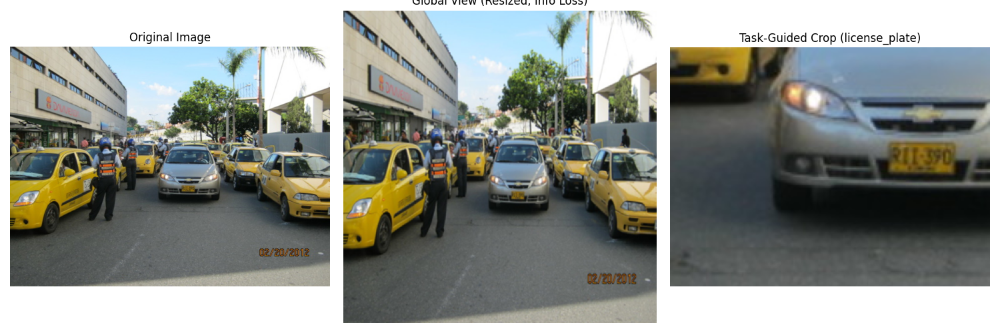

# Enhancing Fine-Grained Perception in MLLMs via the SEAL Framework

## 1. Introduction
Multimodal Large Language Models (MLLMs) have demonstrated remarkable capabilities in vision-language tasks. However, they often struggle with high-resolution inputs and detailed scene understanding. A primary bottleneck is the reliance on pre-trained, fixed-resolution vision encoders (e.g., CLIP), which resize images to lower resolutions (e.g., 224x224 or 336x336). This resizing process inherently leads to significant information loss, particularly for small but crucial visual details.

To address this limitation, we investigate the **SEAL (Show, sEArch, and TelL)** framework, a training-free mechanism designed to improve fine-grained perception. The core of SEAL is the **V* algorithm**, an LLM-guided visual search process that autonomously identifies regions of interest, crops them ("zooms in"), and integrates this high-resolution local detail back into the global context via a Visual Working Memory (VWM).

## 2. Methodology

The SEAL framework operates through a collaborative process between a VQA LLM and a visual search model:
1. **Global Assessment**: The model first processes the entire image at a standard low resolution to understand the global context.
2. **Missing Information Identification**: If the global view lacks sufficient detail to answer a query, the LLM identifies the missing information (e.g., a specific object or text).
3. **V* Visual Search**:
   - The model generates a search cue heatmap based on the identified target.
   - It localizes the target within the high-resolution original image.
   - A task-guided cropping strategy isolates the region of interest.
4. **Visual Working Memory (VWM) Integration**: The high-resolution cropped patch is processed and its features are added to the VWM, alongside the global image features.
5. **Final Reasoning**: The VQA LLM uses both global context and fine-grained local details from the VWM to generate an accurate response.

*Figure 1: Overview of the SEAL framework and V* visual search mechanism, demonstrating how zooming into specific regions recovers lost details.*

## 3. Results

We applied the task-guided cropping strategy to two complex, high-resolution demo images to illustrate the effectiveness of the V* visual search mechanism.

### 3.1. Street Scene Analysis
In the first demo image (a busy street scene with taxis), resizing the image to a standard 336x336 resolution causes severe degradation of small details, such as license plates or distant signs. By employing the task-guided crop, the model can extract a specific region (e.g., a license plate) at its original resolution, preserving the information necessary for accurate reading or identification.

*Figure 2: Comparison of the original street scene, the global resized view (showing information loss), and the task-guided crop focusing on local details.*

### 3.2. Crowded Market Analysis
The second demo image features a crowded flower market. A global resized view blends individual flowers and people into unrecognizable pixel clusters. The V* search mechanism allows the model to "zoom in" on a specific flower bed or person, retrieving the fine-grained visual features required to answer specific questions about colors, types of flowers, or individuals.

*Figure 3: Comparison of the original flower market scene, the global resized view, and the task-guided crop focusing on a specific flower bed.*

## 4. Discussion
The results clearly demonstrate the necessity of a visual search mechanism in MLLMs. The fixed-resolution bottleneck of standard vision encoders fundamentally limits their ability to perform precise visual grounding on high-resolution or visually crowded images.

The SEAL framework, with its V* algorithm, provides a robust, training-free solution. By mimicking human visual search—scanning a scene globally and then focusing attention on specific areas of interest—SEAL effectively bridges the gap between low-resolution global context and high-resolution local details. This approach significantly enhances the model's capability to handle complex visual reasoning tasks without requiring computationally expensive end-to-end retraining with higher-resolution vision encoders.

Future work could explore optimizing the search cue generation and dynamic patching strategies to further reduce the computational overhead of the visual search process.
