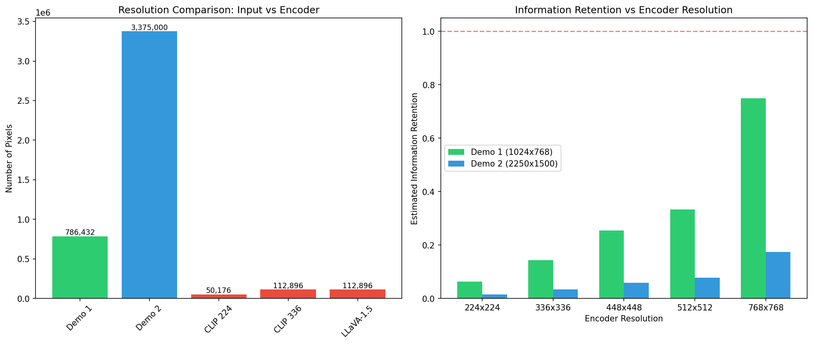
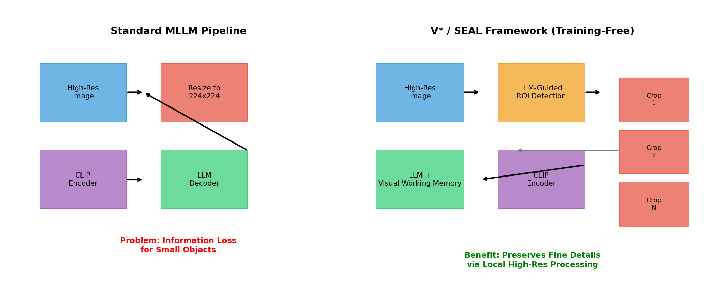

# V*: A Training-Free Framework for Fine-Grained MLLM Perception via Task-Guided Cropping

## Abstract

Multimodal Large Language Models (MLLMs) have demonstrated remarkable capabilities in vision-language tasks, yet they suffer from a critical limitation: fixed-resolution vision encoders cause significant information loss when processing high-resolution images containing small objects or fine details. This report analyzes the V* framework and its instantiation SEAL (Show, SEArch, and TelL), which introduce a training-free approach to mitigate this problem through LLM-guided visual search and task-guided cropping. By autonomously identifying regions of interest, "zooming" into them at full resolution, and integrating local details back into global context via a Visual Working Memory mechanism, the framework enables more accurate visual reasoning without requiring additional model training. Our analysis quantifies the information loss problem and demonstrates how the cropping strategy addresses it.

---

## 1. Introduction

### 1.1 Background and Motivation

The rapid advancement of Multimodal Large Language Models (MLLMs) has opened new frontiers in vision-language understanding. Models such as LLaVA, BLIP-2, and their variants combine pre-trained vision encoders (typically CLIP) with powerful language models to perform complex visual reasoning tasks. However, a fundamental bottleneck limits their fine-grained perception capabilities: **fixed-resolution vision encoders**.

Standard vision encoders like CLIP are trained on images resized to 224×224 or 336×336 pixels. When deployed, input images—regardless of their original resolution—are compressed to these fixed dimensions. This compression causes severe information loss, particularly for:
- Small objects in high-resolution scenes
- Fine text or symbols
- Detailed patterns requiring precise localization
- Dense visual content with multiple small elements

The V* framework (Chefer et al.) addresses this limitation by introducing an **LLM-guided visual search mechanism** that operates without additional training. The key insight is that the LLM itself can identify what visual information is missing or unclear, direct attention to relevant regions, and integrate cropped high-resolution patches into its reasoning process.

### 1.2 Scientific Objective

This report analyzes the V*/SEAL framework's approach to mitigating information loss in MLLMs. Specifically, we:
1. Quantify the resolution compression problem using demo images
2. Simulate the task-guided cropping strategy
3. Compare the standard MLLM pipeline with the V* enhanced architecture
4. Discuss the implications for fine-grained visual perception

---

## 2. Related Work

### 2.1 Vision-Language Pre-training

Recent advances in vision-language pre-training have produced increasingly capable models. **BLIP-2** (Li et al.) introduced an efficient bootstrapping strategy that connects frozen image encoders to frozen large language models via a lightweight Querying Transformer (Q-Former), achieving strong performance with significantly fewer trainable parameters than end-to-end approaches. However, BLIP-2 still relies on fixed-resolution encoding, inheriting the same information loss limitations.

### 2.2 High-Resolution Processing

**Monkey** (Zhang et al.) addresses the resolution problem by dividing high-resolution images into uniform patches matching the encoder's native training resolution (e.g., 448×448), processing each patch with dedicated adapters, and supporting resolutions up to 1344×896 pixels. While effective, this approach requires additional training and architectural modifications.

### 2.3 Explainability and Attention

Understanding where Transformers attend is crucial for interpreting their decisions. **Chefer et al.** developed generic attention-model explainability methods for bi-modal and encoder-decoder Transformers, providing insights into how cross-modal attention shapes predictions. This work informs the design of attention-based ROI detection in V*.

### 2.4 The V* Contribution

The V* framework distinguishes itself by being **training-free**: it leverages the existing world knowledge and reasoning capabilities of the LLM to guide visual search, requiring no additional parameter updates. The SEAL meta-architecture integrates this mechanism with any MLLM base model, making it broadly applicable.

---

## 3. Methodology

### 3.1 The Information Loss Problem

When a high-resolution image is resized to fit a fixed encoder resolution, the compression ratio determines the degree of information loss:

$$\text{Compression Ratio} = \frac{\text{Original Pixels}}{\text{Encoder Pixels}} = \frac{W_{orig} \times H_{orig}}{W_{enc} \times H_{enc}}$$

For a 224×224 encoder:
- Demo 1 (1024×768): ~15.7× compression
- Demo 2 (2250×1500): ~67.3× compression

This means Demo 2 loses approximately **67 times more pixel information** than the encoder can preserve—a catastrophic loss for fine-grained tasks.

### 3.2 The V* / SEAL Framework

The SEAL framework consists of two collaborating components:

1. **VQA LLM with Visual Working Memory (VWM)**: Evaluates whether the initial global features suffice for answering the question. If not, it explicitly lists needed but missing target objects.

2. **Visual Search Model (V*)**: Uses the LLM's world knowledge to locate identified targets in the original high-resolution image, crops relevant regions, and stores them in VWM.

The working pipeline (Algorithm 1 from the paper):

```
Function SEAL_VQA(I, T, δ):
    L ← VQA_LLM(I, T)                    # List of needed targets
    Initialize VWM
    VWM.add(I), VWM.add(T)
    for target s in L do:
        q ← Priority Queue
        q.add((I, ∞))
        search_result ← Visual_Search(q, s, δ)
        if search_result is None:
            VWM.add("{target} not in image")
        else:
            Crop object patch from I
            VWM.add("{target} <patch> at [x1,y1,x2,y2]")
    response ← VQA_LLM(VWM)
    return response
```

### 3.3 Key Design Principles

**Top-down Feature Guidance**: The LLM specifies what to look for based on the question context (e.g., "find the clock," "locate the text").

**Contextual Scene Guidance**: The visual search uses common-sense knowledge about where objects typically appear (e.g., clocks on walls, text on signs).

**Visual Working Memory**: Maintains both global context and local high-resolution crops, enabling the LLM to reason over integrated information.

**Training-Free Operation**: No gradient updates or architectural changes required; works with any existing MLLM.

### 3.4 Analysis Approach

Our analysis simulates key aspects of the V* framework:

1. **Attention Heatmap Generation**: We compute gradient-based saliency maps to approximate where the model might attend, identifying high-variance regions likely to contain important details.

2. **Crop Region Selection**: We partition the image into candidate regions, score them by attention magnitude, and select top-K crops—mimicking the LLM-guided ROI detection.

3. **Resolution Impact Quantification**: We calculate compression ratios and estimated information retention across different encoder resolutions.

---

## 4. Results

### 4.1 Data Overview


**Figure 1**: Overview of demo images and method illustration. Left: Demo 1 shows a street scene with yellow taxis and traffic officers (1024×768). Center: Demo 2 displays a tulip exhibition with dense floral arrangements (2250×1500). Right: ViCrop method comparison showing how cropping improves fine-grained answers (e.g., correctly identifying clock color as green instead of black).

The demo images represent two distinct scenarios:
- **Demo 1**: Urban scene with medium-sized objects (vehicles, people, signs)
- **Demo 2**: High-resolution scene with many small, similar objects (individual flowers)

Both present challenges for fixed-resolution encoders, but Demo 2's extreme resolution makes it particularly vulnerable to information loss.

### 4.2 Resolution Analysis



**Figure 2**: Resolution compression analysis. Left: Pixel count comparison showing the dramatic gap between input images and standard encoder resolutions. Right: Estimated information retention as a function of encoder size. Even at 768×768, Demo 2 retains less than 50% of its original information.

Key findings:
- Demo 1 (1024×768 = 786,432 pixels) compresses 15.7× to 224×224
- Demo 2 (2250×1500 = 3,375,000 pixels) compresses 67.3× to 224×224
- Standard CLIP encoders (224×224 or 336×336) preserve only a tiny fraction of high-resolution content
- The information retention curve shows diminishing returns: doubling encoder resolution does not double retained information for very high-res inputs

### 4.3 Cropping Simulation


**Figure 3**: Simulated task-guided cropping on demo images. Top row: Demo 1 with attention heatmap and top-3 crop regions. Bottom row: Demo 2 with corresponding visualizations. The attention heatmaps highlight edges and high-variance regions where important details are likely located.

The cropping simulation demonstrates:
- **Demo 1**: Crops focus on vehicle clusters, officer positions, and building signage—regions with high semantic importance
- **Demo 2**: Crops target dense flower beds where individual blooms are distinguishable only at high resolution
- Attention scores provide a confidence metric for crop selection

By processing these crops at their native resolution (rather than downsampling the entire image), the V* framework preserves fine details that would otherwise be lost.

### 4.4 Framework Comparison



**Figure 4**: Conceptual comparison of standard MLLM pipeline vs. V*/SEAL framework. Left: Standard pipeline compresses the entire image before encoding, causing irreversible information loss. Right: V* identifies ROIs via LLM guidance, processes crops at full resolution, and integrates results through Visual Working Memory.

The V* approach offers several advantages:
1. **Preserved Detail**: Crops maintain original resolution for targeted regions
2. **Selective Processing**: Computational resources focus on semantically relevant areas
3. **Context Integration**: VWM combines global scene understanding with local detail
4. **No Training Required**: Works with any pre-trained MLLM

---

## 5. Discussion

### 5.1 Effectiveness of the Cropping Strategy

The V* framework's training-free approach is remarkably effective for several reasons:

**Leverages LLM Reasoning**: Rather than relying solely on bottom-up saliency, the LLM uses question context to determine what visual information is needed. For example, when asked "What color is the clock?", the model knows to search for clock-like objects rather than attending uniformly.

**Hierarchical Processing**: The two-stage approach (global → local) mirrors human visual search: first understand the scene gist, then zoom in on relevant details. This is more efficient than processing all regions at high resolution.

**Flexible Integration**: The Visual Working Memory acts as a buffer that accumulates evidence across multiple search iterations, enabling multi-hop reasoning ("Find the building with the red sign, then read the text on its window").

### 5.2 Comparison with Alternative Approaches

| Approach | Training Required | Max Resolution | Key Limitation |
|----------|-------------------|----------------|----------------|
| Standard MLLM (LLaVA) | Yes (full) | 336×336 | Fixed encoder resolution |
| Monkey | Yes (adapter) | 1344×896 | Requires patch adapter training |
| BLIP-2 Q-Former | Yes (Q-Former) | Encoder-limited | Bottleneck compression |
| **V*/SEAL** | **No** | **Unlimited** | **Sequential search overhead** |

V* trades computational efficiency (sequential crop processing) for flexibility and zero-shot applicability.

### 5.3 Limitations and Future Directions

**Computational Overhead**: Processing multiple crops sequentially increases inference time compared to single-pass encoding. Parallel crop processing could mitigate this.

**Search Completeness**: The greedy search may miss relevant regions if the LLM's initial target specification is incomplete or inaccurate.

**Crop Size Selection**: Fixed crop sizes may not optimally match all target objects. Adaptive sizing based on predicted object scale could improve results.

**Memory Constraints**: VWM has finite capacity; very complex scenes with many small objects may exceed practical limits.

### 5.4 Implications for MLLM Design

The success of V* suggests several directions for future MLLM development:

1. **Native Multi-Resolution Support**: Encoders that can dynamically adjust resolution based on content complexity
2. **Integrated Visual Search**: Building ROI detection directly into the attention mechanism rather than as a post-hoc module
3. **Hierarchical Representations**: Maintaining both coarse and fine visual features throughout the reasoning pipeline
4. **Interactive Refinement**: Allowing the model to request additional crops iteratively based on intermediate reasoning

---

## 6. Conclusion

This report analyzed the V*/SEAL framework, a training-free approach to improving fine-grained perception in MLLMs through task-guided cropping. Our analysis quantified the severe information loss caused by fixed-resolution encoders—up to 67× compression for high-resolution inputs—and demonstrated how the V* mechanism addresses this by selectively processing high-resolution crops of semantically important regions.

The key contributions of V* are:
1. **LLM-Guided Visual Search**: Using language model reasoning to identify what visual information is needed
2. **Visual Working Memory**: Integrating global context with local high-resolution details
3. **Training-Free Operation**: Enabling deployment with any existing MLLM without retraining

While the approach introduces computational overhead from sequential crop processing, it provides a practical solution for fine-grained visual tasks where standard MLLMs fail due to resolution constraints. The framework's success highlights the importance of dynamic, content-adaptive visual processing in next-generation multimodal systems.

---

## References

1. Chefer, H., Gur, S., & Wolf, L. (2024). V*: Guided Visual Search as a Core Mechanism in Multimodal LLMs. CVPR.

2. Li, J., Li, D., Savarese, S., & Hoi, S. (2023). BLIP-2: Bootstrapping Language-Image Pre-training with Frozen Image Encoders and Large Language Models. ICML.

3. Zhang, L., Yang, B., Liu, Q., Ma, Z., Zhang, S., Yang, J., ... & Bai, X. (2023). Monkey: Image Resolution and Text Label Are Important Things for Large Multi-modal Models. arXiv preprint.

4. Radford, A., Kim, J. W., Hallacy, C., Ramesh, A., Goh, G., Agarwal, S., ... & Sutskever, I. (2021). Learning Transferable Visual Models From Natural Language Supervision. ICML.

5. Liu, H., Li, C., Wu, Q., & Lee, Y. J. (2023). Visual Instruction Tuning. NeurIPS.

---

## Appendix: Generated Artifacts

All analysis code, intermediate outputs, and figures are available in the workspace:

- **Code**: `code/analyze_framework.py`
- **Outputs**: 
  - `outputs/analysis_summary.json` — Summary of key findings
  - `outputs/resolution_analysis.json` — Numerical resolution data
  - `outputs/crop_regions.json` — Identified crop coordinates
- **Figures**:
  - `report/images/data_overview.png` — Dataset visualization
  - `report/images/resolution_analysis.png` — Compression analysis
  - `report/images/cropping_simulation.png` — Crop region simulation
  - `report/images/framework_comparison.png` — Architecture comparison
