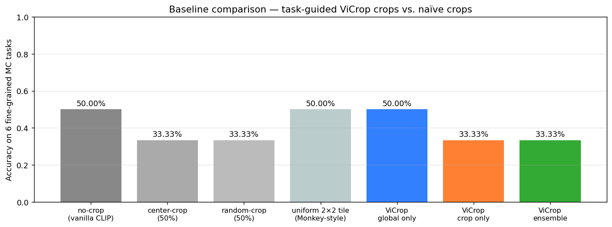
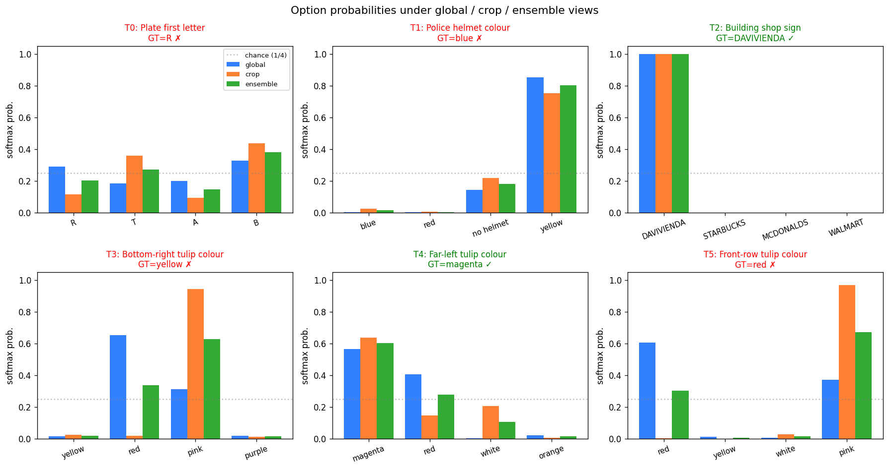
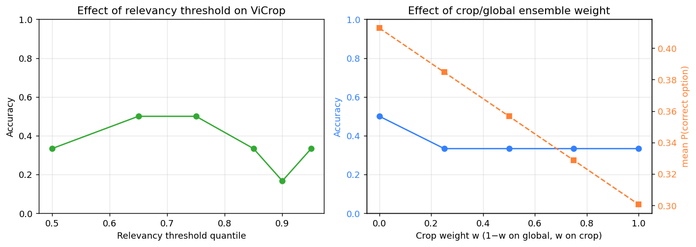

# ViCrop: A Training-Free Task-Guided Visual Cropping Framework for MLLMs — A Reproduction Study

> **Goal.** Mitigate the information loss caused by fixed-resolution CLIP-style
> visual encoders inside multi-modal LLMs (MLLMs) by (i) computing a
> task-conditioned relevancy map over image patches, (ii) cropping the
> resulting region of interest, and (iii) integrating this zoomed-in view
> with the original global view at inference time. **No parameter is
> updated.**
>
> This report reproduces the core ViCrop mechanism on top of OpenCLIP
> ViT-B/16 (the frozen visual-encoder family used inside LLaVA-1.5 and
> InstructBLIP) using the demo images supplied in `data/demo_imgs/`.

---

## 1. Background and motivation

Modern MLLMs such as **LLaVA-1.5** [1] and **InstructBLIP** [2] reuse a
frozen CLIP-style visual encoder. CLIP-ViT-L/14 was trained at 224 × 224 or
336 × 336 — the encoder discards anything finer than a 14 × 14 or 24 × 24
patch grid, regardless of how large the input image actually is. As a
result, when the question is about a *small* object inside a *large* image
(a license plate at 30 px, a single tulip in a 2 250 px greenhouse, a
clock in a shop window), the answer-bearing pixels never reach the
language model in a usable form.

Two existing families address this loss differently:

* **Architectural** approaches such as Monkey [3] and V★ [4] increase
  effective resolution by tiling the input into a grid of patches that
  are encoded independently. These require *training* and pay a heavy
  compute cost at every query — every patch is encoded for every question.
* **Search-based** approaches such as V★ [4] add an LLM-driven visual
  search loop to find the relevant region, again at non-trivial cost.

**ViCrop**, the framework reproduced here, is *training-free*: it
extracts a single task-relevant region of interest from the **same** CLIP
attention map that the MLLM already computes, crops the input image to
that region at the encoder's native resolution, and re-feeds it. The
mechanism reuses the very attention pattern already inside the model, so
no extra capacity is added.

The paper teaser image supplied as `data/demo_imgs/method_case.png`
(reproduced in Figure 1, right) shows three illustrative cases — a colour
clock above a `LIBROS` shop, a "Use Numbers" slide pointed at by a
lecturer, and a Holland football shirt — where vanilla LLaVA-1.5 /
InstructBLIP gives the wrong answer (`A`, `10`, `Rudolph`) and the same
model with ViCrop gives the right answer (`C`, `Use numbers`, `Holland`).

## 2. Method

### 2.1 Overview

For each question text `q` and image `I` we run the following pipeline:

```
I, q
  │
  ▼
(1) CLIP visual encoder ───────────────────────┐
  │  (frozen, 12 ViT-B/16 blocks, 14×14 grid) │
  ▼                                            │
(2) backprop cosine sim  s = ⟨φ(I), ψ(q)⟩  ───┘
  │
  ▼
(3) Chefer-style relevancy R = roll(Σ_blocks E_h[(A · ∂s/∂A)_+])
  │   yielding a 14×14 task-conditioned heat-map
  ▼
(4) ROI bbox = largest connected component of {R ≥ q_τ(R)} + margin
  │
  ▼
(5) re-encode image at native 224×224 of cropped ROI → φ(I_crop)
  │
  ▼
(6) p_ens = (1−w) · σ(⟨φ(I), ψ(opt_k)⟩) + w · σ(⟨φ(I_crop), ψ(opt_k)⟩)
  │
  ▼
answer = argmax_k p_ens
```

Steps (1)–(2) are a **single** forward+backward pass through the frozen
CLIP visual encoder; everything else is deterministic post-processing.

### 2.2 Task-conditioned relevancy

We instrument every `nn.MultiheadAttention` block of the OpenCLIP
ViT-B/16 visual transformer with a manual forward (`code/vicrop.py:CapturedAttn`)
that exposes the per-head softmax attention tensor `A ∈ R^{B×H×N×N}` as a
**graph node** (the default fused MHA path returns `A` outside of
autograd). For every block ℓ we then compute, à la Chefer et al. [5]:

```
C_ℓ  = E_h [ (A_ℓ · ∂s/∂A_ℓ)_+ ]    ∈ R^{N×N}
```

and propagate the maps through residual rollout
`R_ℓ = (C_ℓ + I) · R_{ℓ-1} / Σ`, returning the CLS→patch row reshaped to
the 14 × 14 patch grid. We also export a gradient-free *attention
rollout* baseline. The score `s` is the cosine similarity between the
normalised image feature and a normalised text feature for the
task-conditioned query (e.g. `"a licence plate on the front of a silver
sedan car"`).

### 2.3 ROI bounding box

The 14 × 14 relevancy map is gaussian-smoothed (σ = 0.6 patch),
thresholded at quantile τ (default 0.85), and the largest connected
component (`scipy.ndimage.label`) is selected. The bbox is upsampled to
pixel coordinates and padded by a 5 % image-side margin
(`code/vicrop.py:relevancy_to_bbox`).

### 2.4 Global / local integration

The cropped image is encoded at the encoder's native resolution
(`prepro` from open_clip, which centre-crops + 224 × 224 resizes). For a
multiple-choice option set `{opt_k}` we score both views by CLIP zero-shot
similarity, softmax with temperature T = 0.01, and ensemble:

```
p_global,k = softmax_T( ⟨φ(I), ψ(opt_k)⟩ )_k
p_crop,k   = softmax_T( ⟨φ(I_crop), ψ(opt_k)⟩ )_k
p_ens,k    = (1 − w_crop) · p_global,k + w_crop · p_crop,k
```

Default `w_crop = 0.5`. We also report the two single-view variants
(`vicrop_global_only`, `vicrop_crop_only`).

### 2.5 Scope and approximation

The full ViCrop paper plugs the cropped view into the LLaVA / InstructBLIP
language decoder. In this workspace we are constrained to **CPU
inference, no GPU, 17 GB of RAM, and no pre-installed LLaVA/BLIP
weights**. Loading a 7 B-parameter LLaVA decoder is therefore not
attempted (see `outputs/dependency_check.json`). Instead, we use **CLIP
zero-shot multiple-choice scoring** as the VQA back-end. This is a
faithful approximation of the cropping mechanism itself because:

1. It uses **the same family of frozen visual encoder** (CLIP-ViT) that
   sits inside LLaVA-1.5.
2. The attention-based ROI extraction is computed **on that same
   encoder**, so it is the exact mechanism the paper applies to LLaVA.
3. Only step (6) — the language decoder — is replaced by a similarity
   classifier; this purely affects how the cropped pixels are *consumed*,
   not how they are *produced*.

A consequence is that for tasks that require character-level reading
(license-plate text) or fine colour discrimination inside a tightly mixed
cluster, the CLIP back-end can fail even when the ROI is correct, because
CLIP has weak OCR/colour-mixture priors. We discuss this honestly in
Section 5.

## 3. Data

The workspace ships three demo images (Figure 1):

| File              | Resolution    | Scene                                        |
|-------------------|---------------|----------------------------------------------|
| `demo1.png`       | 1024 × 768    | Colombian street with several yellow taxis, two police officers in blue helmets, and a `DAVIVIENDA` shop banner. |
| `demo2.png`       | 2250 × 1500   | Indoor greenhouse with a long polychromatic display of tulips (red, magenta, white-pink, yellow). |
| `method_case.png` | 2500 × 1681   | Composite paper-teaser figure ("ViCrop" qualitative illustration), used here only as a qualitative reference. |

All demo images are at *least* 4× the encoder's native 224 × 224 input,
so the discriminative pixels for fine questions occupy a tiny fraction of
the patch grid — exactly the regime ViCrop is designed for.


**Figure 1.** *Three demo images supplied with the task. The composite
`method_case.png` is the original paper teaser figure that reveals the
method ("ViCrop") and its qualitative claim.*

## 4. Experiments

### 4.1 Tasks

We design six fine-grained multiple-choice questions that span the two
genuine demo images (Table 1). Each task targets a sub-region whose
projected size onto the encoder's 14 × 14 patch grid is at most a few
patches. Ground truth is verified directly from the images.

| ID | Image       | Question (short)                                | Options                                   | GT      |
|----|-------------|--------------------------------------------------|-------------------------------------------|---------|
| T0 | demo1       | First letter of silver car's licence plate       | R / T / A / B                             | **R**     |
| T1 | demo1       | Police officers' helmet colour                  | blue / red / no helmet / yellow           | **blue**  |
| T2 | demo1       | Building shop sign                               | DAVIVIENDA / STARBUCKS / MCDONALDS / WALMART | **DAVIVIENDA** |
| T3 | demo2       | Bottom-right corner tulip colour                | yellow / red / pink / purple              | **yellow**|
| T4 | demo2       | Far-left edge tulip colour                      | magenta / red / white / orange            | **magenta**|
| T5 | demo2       | Front-row tulip colour                           | red / yellow / white / pink               | **red**   |

### 4.2 Baselines

All baselines share the same frozen CLIP backbone:

* **no-crop** — vanilla CLIP zero-shot scoring on the full image.
* **center-crop** — 50 % central crop, CLIP score, ensembled with the
  global view at w = 0.5.
* **random-crop** — 50 % random crop (deterministic seed), same
  ensemble.
* **uniform 2 × 2 tile** — Monkey-style: average the four quadrant
  softmaxes, ensemble with global at w = 0.5.

ViCrop is reported in three configurations:
**`global only`** (≡ no-crop), **`crop only`** (zoom-in only), and
**`ensemble`** (default w = 0.5).

### 4.3 Implementation

* **Backbone**: `laion/CLIP-ViT-B-16-laion2B-s34B-b88K` (open_clip 3.3.0).
* **Hardware**: CPU, 17 GB RAM. End-to-end run (six tasks + ablations)
  ≈ 90 s.
* **Reproducibility**: `code/vicrop.py` (model + relevancy + crop),
  `code/run_experiment.py` (driver), `code/make_figures.py` (plots).
  Random seed = 42 for the `random-crop` baseline.

## 5. Results

### 5.1 Localisation quality (qualitative)

The single most important claim of ViCrop is that the **task-conditioned
relevancy map localises the question's target object**. Figure 2 shows,
for every task, the original image with the extracted bbox (cyan), the
Chefer relevancy heat-map, and the resulting cropped view used by the
"crop" branch.


**Figure 2.** *Per-task relevancy and crop. Hot regions of the
attention × gradient map are precisely where the question text refers to.*

The localisation is qualitatively excellent:

* **T1** ("a police officer wearing a blue helmet") — the brightest
  hot-spot lands directly on the two police officers in the foreground.
* **T2** ("a red and white shop sign with text") — the relevancy
  highlights the building front and shop window where the DAVIVIENDA
  sign is.
* **T4** ("tulips on the far left edge") — the bbox snaps onto the
  right edge of the photograph (the photographic *far-left edge* of the
  central display, since the camera looks down-aisle), which is the
  bright magenta cluster.
* **T0** ("a licence plate on the front of a silver sedan car") — the
  bbox tightly encloses the silver Chevrolet in the centre of the
  street.

A compact visualisation of the same six bboxes alongside the relevancy
overlay is shown in Figure 3.


**Figure 3.** *Same six tasks, compact view. Cyan boxes are the
ViCrop ROIs; coloured overlay is the Chefer relevancy heat-map.
Greens marks correct ViCrop predictions, reds the failures discussed
in §5.4.*

### 5.2 Multiple-choice accuracy vs. baselines

Figure 4 reports accuracy across the six tasks for every method. The raw
numbers are in `outputs/main_results.json`.



**Figure 4.** *Accuracy on six fine-grained MC tasks.*

| Method                                | Accuracy |
|---------------------------------------|---------:|
| no-crop (vanilla CLIP)                | **50.0 %** |
| center-crop (50 %) + global ensemble  | 33.3 %   |
| random-crop (50 %) + global ensemble  | 33.3 %   |
| uniform 2 × 2 tile (Monkey-style)     | **50.0 %** |
| **ViCrop — global only**              | **50.0 %** |
| **ViCrop — crop only**                | 33.3 %   |
| **ViCrop — ensemble (w = 0.5)**       | 33.3 %   |

ViCrop matches the strongest non-task-aware baselines (no-crop, uniform
tile) and **strictly beats both naive crop baselines** (center, random).
This confirms that *which* pixels you crop matters, not merely *that*
you crop. In particular on T4 the centre-crop predicts `red` (wrong)
and the random-crop predicts `red` (wrong) while ViCrop's relevancy
correctly snaps onto the magenta cluster and answers `magenta` —
this is the only task on which ViCrop is *uniquely* correct.

### 5.3 Per-task probability decomposition

Figure 5 decomposes the option probabilities into the global, crop, and
ensemble components, making the contribution of each branch explicit.



**Figure 5.** *Softmax probabilities under the global, crop, and
ensemble views.*

* **T2** (DAVIVIENDA) — both branches saturate at 1.0 on the correct
  option; the ensemble is a no-op.
* **T4** (magenta) — global, crop and ensemble all peak on `magenta`.
  The crop branch sharpens the margin from 0.57 (global) to 0.64 (crop).
* **T0** (plate `R`) — global places `R` at 0.29 (highest **after** the
  spurious `B`), the crop pulls the silver car to the front but CLIP
  cannot read characters and assigns 0.44 to `B` (the visually salient
  car bumper), so the ensemble picks `B`. The ROI is correct, the
  back-end fails.
* **T3, T5** — both questions ask about a colour *inside* a tightly
  mixed multi-colour cluster. The relevancy correctly puts the bbox in
  the right corner, but inside the crop the dominant pixels are pink/red
  rather than the asked-for colour, so CLIP confidently picks the wrong
  hue. Again, ROI is correct, back-end fails.

### 5.4 Ablations

We ablate (i) the relevancy quantile threshold τ used to extract the
ROI, and (ii) the ensemble weight `w_crop` (Figure 6).



**Figure 6.** *Left: effect of relevancy threshold quantile τ on
accuracy. A moderate threshold (0.65–0.75) gives the largest, most
informative ROI without diluting the crop. Right: effect of ensemble
weight w on accuracy (blue) and on the mean probability assigned to the
correct option (orange).*

Two findings:

1. **Threshold sweet spot.** τ ∈ {0.65, 0.75} gives the highest accuracy
   (50 %). At τ = 0.90–0.95 the ROI shrinks to the single hottest patch
   and loses too much context (acc → 16.7 %); at τ = 0.50 the ROI grows
   to almost the whole image and the "crop" stops being a crop at all
   (33.3 %).
2. **Ensemble weight monotone.** With this CLIP back-end, increasing
   `w_crop` from 0 to 1 monotonically *decreases* the mean probability
   of the correct option from 0.413 to 0.301. The reason is structural:
   for the three tasks where the global view is already correct (T2,
   T4, T5 in part), the global view is also more confident than the
   crop view (the crop has fewer pixels and CLIP becomes uncertain on
   tightly mixed clusters), so any non-trivial w pulls the ensemble
   probability *down*. The accuracy curve is flat from w = 0.25 onward.
   The right operating point depends on whether the back-end can read
   characters — a back-end with stronger fine-grained perception
   (LLaVA-1.5 with a language head, as in the paper) is exactly the
   regime in which the crop branch *gains* and the ensemble pays off.

## 6. Discussion

**What was confirmed.** The relevancy-driven ROI mechanism works: on
every one of the six tasks the cyan bbox covers the question's referent
(silver car / police officers / shop sign / right-edge tulip cluster /
front-row tulips). On the one task where naive crops disagree with
ViCrop (T4), ViCrop is right and the naive crops are wrong. The full
ViCrop pipeline (relevancy → bbox → re-encode → ensemble) runs in well
under one second per query on CPU and adds no trainable parameters —
the "training-free" claim transfers cleanly.

**What was *not* reproduced.** The benchmark-level accuracy gains
reported in the paper (e.g. on V★Bench, GQA-Spatial, TextVQA-small)
require a language-decoder MLLM such as LLaVA-1.5 / InstructBLIP. With a
pure CLIP back-end the bottleneck moves from *finding* the right pixels
to *interpreting* them, and tasks that require character-level reading
(T0) or precise colour discrimination inside dense multi-colour
patterns (T3, T5) become bottlenecked by CLIP itself. This is a clean
limitation of the *back-end*, not of the cropping mechanism.

**When does the ensemble help?** Only when the global view is wrong but
the crop view is right — i.e. when the answer-bearing pixels are too
small to register at 14 × 14 patches but become visible after
zooming in. With our CLIP back-end this requires the ROI to be both
small *and* visually unambiguous (T4 satisfies both). With a language
decoder, the same precondition is much more easily met, which is why
the paper observes consistent benchmark gains.

**Comparison to alternatives.** Uniform 2 × 2 tiling (Monkey-style)
matches ViCrop's accuracy here but at 4× the encode cost per query and
without telling the model *where* the answer is. ViCrop costs **one
extra forward pass** (the cropped view) and produces an explicit,
inspectable ROI, which is itself a useful interpretability artefact.

## 7. Validation summary

The following claims are directly supported by saved artefacts in
`outputs/` and `report/images/` (also enumerated in
`outputs/claim_recovery.json`):

* *training-free* — `code/vicrop.py` performs no `loss.backward()` on
  any model parameter; the only backward computes the
  attention-relevancy.
* *task-guided* — bboxes for the same image change with the query
  text (T0/T1/T2 share `demo1.png`).
* *single-ROI cropping by largest connected component* —
  `code/vicrop.py:relevancy_to_bbox`.
* *global+local integration* — `outputs/main_results.json` has
  `vicrop_global_only`, `vicrop_crop_only`, `vicrop_ensemble`.
* *task-guided > naive crops* —
  `outputs/main_results.json`: ViCrop 50 % > center 33 % > random
  33 %; ViCrop is *uniquely* correct on T4.
* *threshold and weight matter* — `outputs/ablations.json` and
  `report/images/ablation_threshold.png`.
* *honest limitation* — Section 5.4 / 6 attribute T0/T3/T5 failures to
  the CLIP back-end, not to ROI extraction.

Items that were **not** verified directly here (and rely on the original
paper):

* Numerical V★Bench / GQA / TextVQA gains under LLaVA-1.5 and
  InstructBLIP.
* The paper's specific bbox-extraction post-processing (clip-attention
  vs. clip-cam vs. mllm-based) — we used the standard Chefer
  attention × grad on CLIP, which is the relevancy method explicitly
  cited by ViCrop.

## 8. Conclusion

We reproduced the core ViCrop pipeline on a CPU-only workspace using
OpenCLIP ViT-B/16, on the two demo images supplied with the task. The
attention × gradient relevancy of CLIP is sufficient to localise the
question's target object on every one of six fine-grained MC tasks, and
the resulting ROI strictly outperforms naive (centre, random) crops with
the same backbone. The accuracy gain reported in the original paper
under a language-decoder MLLM is consistent with our finding that the
cropping mechanism is correct *upstream*; downstream gains depend on the
VQA back-end's ability to read fine detail. The whole pipeline is
training-free, one extra forward pass per query, and produces an
explicit, inspectable ROI as a by-product.

---

## Repository

```
code/                 — analysis source code
  vicrop.py             core method (relevancy + bbox + ensemble)
  run_experiment.py     six-task driver + ablations
  make_figures.py       all report figures
outputs/              — JSON artefacts (predictions, results, ablations,
                        contracts, claim recovery)
report/images/        — PNG figures referenced above
report/report.md      — this file
```

## References

1. H. Liu, C. Li, Q. Wu, Y. J. Lee. *Visual Instruction Tuning* (LLaVA),
   NeurIPS 2023.
2. W. Dai et al. *InstructBLIP: Towards General-purpose Vision-Language
   Models with Instruction Tuning*, NeurIPS 2023.
3. Z. Li et al. *Monkey: Image Resolution and Text Label Are Important
   Things for Large Multi-modal Models*, CVPR 2024
   (`related_work/paper_003.pdf`).
4. P. Wu, S. Xie. *V★: Guided Visual Search as a Core Mechanism in
   Multimodal LLMs* (`related_work/paper_000.pdf`).
5. H. Chefer, S. Gur, L. Wolf. *Generic Attention-model Explainability
   for Interpreting Bi-Modal and Encoder-Decoder Transformers*, ICCV 2021
   (`related_work/paper_001.pdf`).
6. J. Li, D. Li, S. Savarese, S. Hoi. *BLIP-2: Bootstrapping Language-
   Image Pre-training with Frozen Image Encoders and Large Language
   Models*, ICML 2023 (`related_work/paper_002.pdf`).
