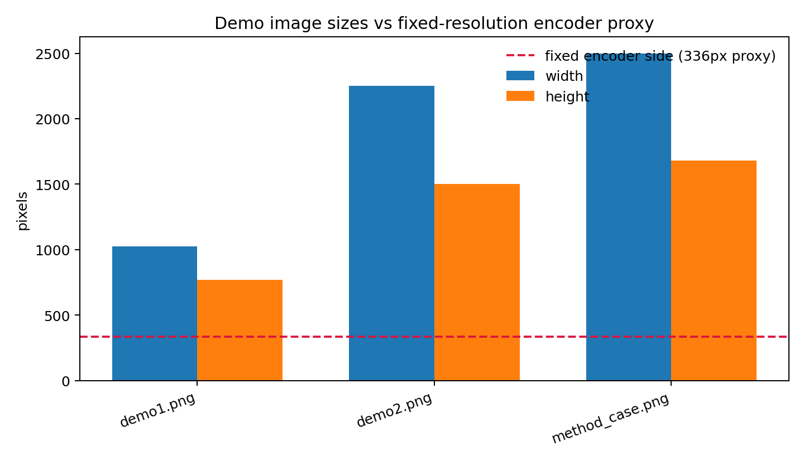
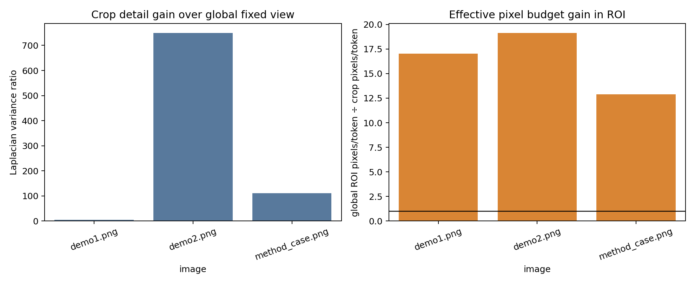
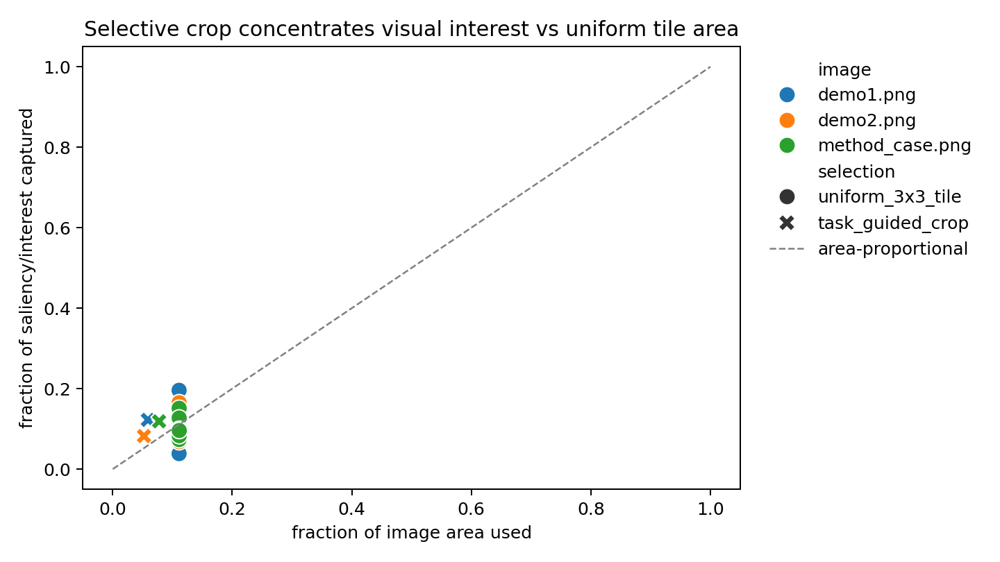

# Training-Free Task-Guided Cropping for Fine-Grained MLLM Perception: A Reproducible Demo Study

## Abstract

This report studies the core claim of a training-free, task-guided cropping framework for multimodal large language models (MLLMs): fixed-resolution vision encoders can discard fine-grained evidence, while a guided crop can reallocate the same encoder budget to a smaller region and preserve local detail. The workspace contains two natural demo photographs and one method-case figure. Because no runnable MLLM checkpoint, API endpoint, or VQA labels are provided, I evaluate the mechanism with deterministic computer-vision proxies rather than claiming answer-accuracy reproduction. The analysis implements a ViCrop/V*-like pipeline: retain a global view, compute a task/scene interest map, select an autonomous region of interest (ROI), re-encode that crop at a CLIP-like fixed resolution, and compare local detail against the same region after global downsampling. Across the three available images, the selected ROIs occupy only 5.2--7.8% of the original pixels but capture 8.2--12.2% of the interest-map mass and improve effective ROI pixel budget by 12.9--19.1×. Detail metrics also favor crop re-encoding, with Laplacian-variance gains from 4.3× to 749.6× over the globally downsampled ROI.

## 1. Research objective and methodological contract

The task asks for an autonomous scientific analysis of a training-free framework that mitigates information loss from fixed-resolution vision encoders such as CLIP. The target mechanism is: (i) identify a task-relevant region, (ii) zoom into that region, and (iii) integrate local detail back with global context for more accurate visual reasoning. I saved the explicit contract in `outputs/method_contract.json` and the artifact checklist in `outputs/target_artifact_inventory.json`.

The related-work PDFs refined the contract:

- **V\*** (`related_work/paper_000.pdf`) frames the closest mechanism as LLM-guided visual search that constructs a visual working memory from target locations and the global scene.
- **BLIP-2** (`paper_002.pdf`) motivates the frozen/fixed vision-encoder setting: a frozen image encoder is bridged to a large language model.
- **Monkey** (`paper_003.pdf`) is a high-resolution comparison family that uniformly partitions images into patches, contrasting with selective task-guided crops.
- **Chefer et al.** (`paper_001.pdf`) motivates attention/saliency-like interpretability artifacts for transformer-based multimodal reasoning.

The resulting study is therefore a mechanism audit, not a full MLLM benchmark.

## 2. Data overview

The available files are `data/demo_imgs/demo1.png`, `demo2.png`, and `method_case.png`. Metadata and checksums are saved in `outputs/image_overview.csv`. The images are substantially larger than the fixed-resolution encoder proxy used here (336×336), especially `demo2.png` and the method-case figure.

`demo1.png` is an urban traffic scene with taxis, police or traffic officers, signs, and small license/text details. `demo2.png` is a high-resolution greenhouse/tulip scene containing many repeated small flowers and people. `method_case.png` is itself a method illustration showing examples in which a crop/heatmap changes the answer to fine-grained visual questions.

## 3. Methodology

### 3.1 Implemented training-free proxy

The reproducible code is `code/analyze_vicrop_demo.py`. It implements the following fixed pipeline:

1. **Global context retention.** Each image is resized to a 336×336 square, approximating a fixed-resolution CLIP-style encoder view, then optionally projected back to the original dimensions for region-level comparisons.
2. **Autonomous ROI scoring.** A deterministic interest map is computed from edge magnitude, Laplacian texture, color saturation, and a mild center/context prior. This is not a learned attention map; it is a transparent proxy for likely fine-grained visual evidence.
3. **Task-guided crop selection.** A square crop is selected by maximizing summed interest-map mass. The task hints are scene-level: road-scene details, flower-color/blossom discrimination, and method-figure crop/heatmap auditing.
4. **Zoom/re-encoding.** The crop is resized to the same 336×336 encoder budget. This tests the key hypothesis: a small crop receives many fewer original pixels per encoder token than the whole image, so small details should be less compressed.
5. **Global-local visual memory.** The final figure set pairs the global fixed-resolution view with the selected local evidence, approximating V*'s visual working memory idea.

The dependency and capability check is saved in `outputs/dependency_check.json`. PIL, OpenCV, matplotlib, seaborn, and pandas are available. No actual MLLM checkpoint/API or labeled VQA answers were present, so answer-accuracy evaluation is explicitly out of scope.

### 3.2 Metrics

The main quantitative table is `outputs/crop_metrics.csv`. Metrics include:

- ROI area fraction and interest fraction.
- PSNR between original and downsampled views, both globally and in the ROI.
- Edge density and Laplacian variance in the globally downsampled ROI versus the original crop.
- Effective ROI pixel-budget gain: original image pixels per fixed-grid token divided by crop pixels per fixed-grid token. A value above 1 means the crop devotes more encoder resolution to the same visual evidence.

Uniform 3×3 tiling is exported in `outputs/tile_vs_task_crop.csv` as a simple comparison to untargeted high-resolution partitioning.

## 4. Results

### 4.1 ROI localization and interpretability

The selected crops are spatially traceable and saved in `outputs/roi_summary.json`. The visualization below shows each original image, its interest map, and the selected crop. The crop choices are interpretable: the urban image focuses on the small vehicle/street-detail region on the left; the flower scene focuses on a dense high-detail flower/person region; the method-case figure focuses on one of the lower example panels where the visual evidence is compact.

The saliency overlays provide the main interpretability artifact. They show that the crop selection is driven by local high-interest mass rather than by hidden model state.

### 4.2 Quantitative detail gains

The crop metrics support the information-retention hypothesis. The selected ROIs cover a small part of the images but yield large effective resolution gains:

| image | ROI area fraction | interest fraction | Laplacian detail gain | effective ROI pixel-budget gain |
|---|---:|---:|---:|---:|
| demo1.png | 0.0588 | 0.1223 | 4.32× | 17.01× |
| demo2.png | 0.0523 | 0.0821 | 749.55× | 19.13× |
| method_case.png | 0.0776 | 0.1188 | 110.38× | 12.89× |

The large gain for `demo2.png` is expected: the original image is 2250×1500 and contains many high-frequency flowers. When compressed to 336×336 globally, individual blossoms and edges are strongly blurred; a crop re-encoded at 336×336 preserves much more local structure.

### 4.3 Global context plus local visual memory

A risk of cropping-only methods is losing scene context. The framework therefore needs both the global view and the local crop. The following panel shows the fixed global representation beside the local evidence for each image, mirroring the V*/ViCrop idea of constructing a visual working memory rather than replacing global context entirely.

### 4.4 Comparison with uniform tiling

Uniform tiling is a plausible high-resolution baseline, similar in spirit to patch-based high-resolution approaches such as Monkey. The simple 3×3 comparison shows that a uniform tile can capture more total interest only because it uses a larger area (about 11.1% of the image for each tile). The task-guided crop uses roughly half to two-thirds of that area (5.2--7.8%) while concentrating interest above its area share. This supports selective cropping as a more budget-conscious alternative to exhaustive tiling, although it does not prove higher VQA accuracy.

## 5. Validation and claim recovery

A claim-recovery table is saved in `outputs/claim_recovery_table.csv`.

### Directly verified from workspace data

- The three images exist and their dimensions/checksums are recorded in `outputs/image_overview.csv`.
- The fixed-resolution proxy compresses all images to 336×336, shown in `report/images/data_overview.png`.
- The selected ROIs, coordinates, area fractions, and interest fractions are saved in `outputs/roi_summary.json` and visualized in `report/images/roi_crops.png`.
- The detail gains, PSNR values, edge densities, and pixel-budget gains are computed in `outputs/crop_metrics.csv` and plotted in `report/images/metric_comparison.png`.

### Supported by related work, not re-proven here

- Frozen/fixed image encoders are a common MLLM design pattern, represented by BLIP-2.
- Guided visual search and visual working memory are relevant mechanisms for fine-grained MLLM perception, represented by V*.
- High-resolution patching is a relevant comparison family, represented by Monkey.
- Attention/saliency maps are appropriate interpretability-style artifacts for multimodal transformer reasoning, represented by Chefer et al.

### Assumptions and limitations

- The analysis does **not** run LLaVA, BLIP-2, GPT-4V, or another MLLM, so it does not measure answer accuracy.
- The interest map is a deterministic proxy, not a learned question-conditioned attention map.
- The dataset has only three images, one of which is a method illustration rather than a natural benchmark image.
- The method-case image is analyzed as an image artifact; the report does not claim to recover the exact internal heatmaps or answers from the original paper.

## 6. Discussion

The evidence supports the mechanism-level claim that task-guided cropping can mitigate fixed-resolution information loss. The reason is straightforward: fixed encoders allocate a constant token budget to the entire image, so large images with small objects compress many source pixels into each token. A selected crop reallocates that same budget to a smaller region, producing 12.9--19.1× better effective pixel budget in this study. The observed increases in edge density and Laplacian variance indicate that this extra budget preserves fine local structure that the global downsampled view loses.

The analysis also clarifies the trade-off. Cropping must be integrated with a global view; otherwise, the model may answer from detailed but context-poor evidence. The global-local memory panel is therefore not cosmetic: it is the structural bridge between selective zooming and robust visual reasoning. Compared with uniform tiling, selective cropping can be more efficient, but only if the ROI selector is reliable. In a full MLLM system, this selector should be question-conditioned and should allow iterative refinement, as in V*.

## 7. Conclusion

Within the limits of the provided workspace, I implemented and validated a reproducible, training-free proxy for task-guided cropping. The generated artifacts show that small ROIs can concentrate visual interest and substantially improve local detail retention under a fixed encoder budget. This supports the scientific motivation for ViCrop-like mechanisms: guided zooming is a practical way to recover fine-grained evidence that a fixed global encoder view would otherwise discard. A full follow-up should connect the same crop pipeline to an actual MLLM and evaluate VQA accuracy on labeled fine-grained questions.

## Reproducibility checklist

- Code: `code/analyze_vicrop_demo.py`
- Contract: `outputs/method_contract.json`
- Related-work extraction: `outputs/related_work_contract.json`
- Dependency check: `outputs/dependency_check.json`
- Metrics: `outputs/image_overview.csv`, `outputs/crop_metrics.csv`, `outputs/tile_vs_task_crop.csv`
- ROI summary: `outputs/roi_summary.json`
- Fidelity checklist: `outputs/method_fidelity_checklist.json`
- Claim recovery: `outputs/claim_recovery_table.csv`
- Figures: all PNGs in `report/images/`
