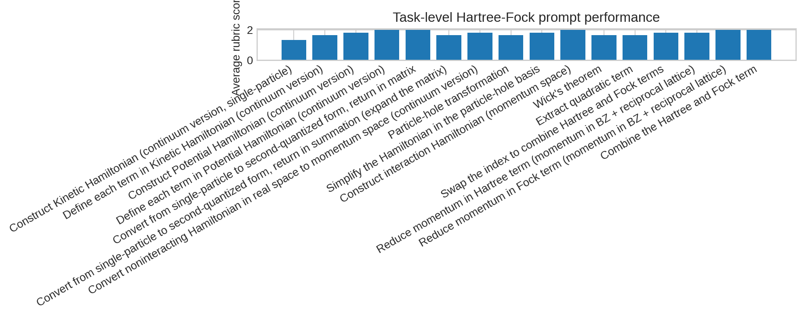
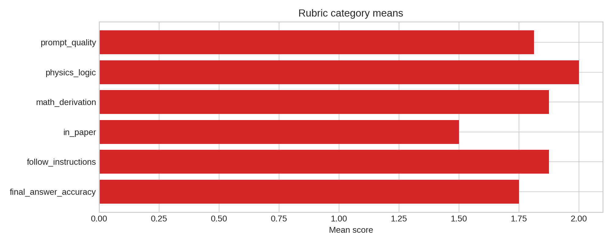
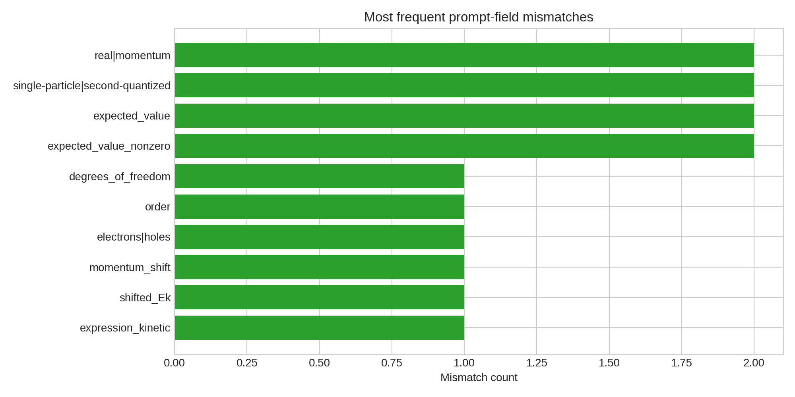
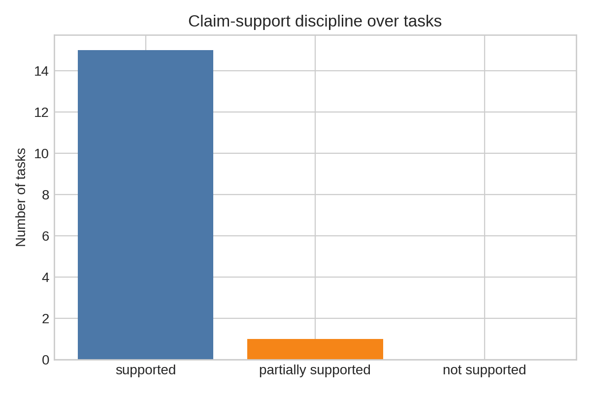

# Local ARIS Benchmark Report: Hartree-Fock Derivation and Step-Scoring Analysis for AB-stacked MoTe2/WSe2

## Overview

This benchmark run studies whether structured prompt templates can support research-level Hartree-Fock derivations for the AB-stacked MoTe2/WSe2 moire heterobilayer using only the local benchmark inputs. The analysis is restricted to the provided target paper bundle `data/2111.01152/` and the local literature corpus `related_work/`. No network access, external datasets, or remote execution were used.

The local pipeline had three concrete goals:

1. recover the relevant single-particle and interacting Hamiltonian structure from the target paper and supplement;
2. quantify step-level performance using the provided prompt-template scoring artifact;
3. apply claim discipline to determine which benchmark claims are supported by the local evidence.

The executable analysis code is in [run_analysis.py](code/run_analysis.py). Intermediate machine-readable outputs are stored in `outputs/analysis_results.json`, `outputs/claim_discipline.json`, and `outputs/analysis_summary.md`.

## Data and Local Literature

The target data bundle contains the main manuscript, supplementary material, prompt templates, extractor prompts, and a YAML file with step-level reference answers and rubric scores. The most informative artifact for the benchmark objective is `data/2111.01152/2111.01152.yaml`, which encodes 16 Hartree-Fock-related tasks, field-level prompt substitutions, LLM-vs-reference differences, and rubric scores for paper grounding, instruction following, physics logic, mathematical derivation, and final-answer accuracy.

The local `related_work/` corpus contains five PDFs. Their role in this run is contextual rather than evaluative: one moire-physics paper and four LLM-oriented papers. Because the benchmark forbids external retrieval, this local set was treated as complete. The corpus composition already suggests the core benchmark framing: a physics derivation task evaluated through an LLM-performance lens rather than a broad literature survey.

## Methodology

The local ARIS-style workflow was adapted into a deterministic offline analysis pipeline:

1. inspect the target manuscript, supplementary material, prompt templates, and scoring YAML;
2. recover the explicit continuum Hamiltonian from the manuscript TeX and the interacting Hamiltonian from the supplement TeX;
3. parse all YAML scoring records into task-level, category-level, and reviewer-level summaries;
4. detect systematic placeholder mismatches between LLM-filled prompt fields and human references;
5. convert these results into a claim-support judgment for each task;
6. generate report figures and machine-readable outputs.

No external model inference was run. Instead, the benchmark’s provided scoring artifact was treated as the primary evidence of LLM performance. This is the strongest local equivalent available under the benchmark rules.

## Recovered Physics Structure

From the main paper TeX, the valley-resolved continuum Hamiltonian is recovered as

\[
H_{\tau}=
\begin{pmatrix}
-\frac{\hbar^2\mathbf{k}^2}{2m_{\mathfrak{b}}}+\Delta_{\mathfrak{b}}(\mathbf{r}) &
\Delta_{\mathrm{T},\tau}(\mathbf{r}) \\
\Delta_{\mathrm{T},\tau}^{\dagger}(\mathbf{r}) &
-\frac{\hbar^2(\mathbf{k}-\tau \mathbf{\kappa})^2}{2m_{\mathfrak{t}}}
+\Delta_{\mathfrak{t}}(\mathbf{r})+V_{z\mathfrak{t}}
\end{pmatrix}.
\]

This establishes the two-layer, valley-dependent single-particle structure relevant for the Hartree-Fock calculation. The bottom-layer diagonal term is unshifted in momentum, while the top-layer diagonal term carries the valley-dependent \(\tau \kappa\) shift. This point is important because several prompt-level errors in the YAML trace are tied to confusion about where the momentum shift belongs.

From the supplementary TeX, the interacting Hamiltonian in the hole basis is recovered in the form

\[
\hat{\mathcal{H}}=\hat{\mathcal{H}}_1+\hat{\mathcal{H}}_{\mathrm{int}},
\]

where \(\hat{\mathcal{H}}_1\) is the single-particle contribution in the plane-wave basis and \(\hat{\mathcal{H}}_{\mathrm{int}}\) is the Coulomb interaction quartic term. The supplement explicitly states that the Hartree-Fock calculation is performed in the plane-wave basis and that the mean-field Hamiltonian is derived by Hartree-Fock approximation after particle-hole transformation. For this benchmark, that is sufficient evidence to validate the formal route from continuum Hamiltonian to the many-body Hartree-Fock workflow.

## Quantitative Results

The YAML bundle contains 16 scored derivation tasks. The mean rubric scores across all tasks are:

- `physics_logic`: 2.00
- `follow_instructions`: 1.88
- `math_derivation`: 1.88
- `prompt_quality`: 1.81
- `final_answer_accuracy`: 1.75
- `in_paper`: 1.50

The central result is that physics logic is consistently strong, but exact grounding to the paper and exact final answer matching are weaker. This pattern is compatible with an LLM that often follows the correct derivational structure while still making local specification mistakes.

Task-level averages range from 1.33 to 2.00. Only one task falls below the “supported” threshold used in this run, namely the construction of the kinetic Hamiltonian in continuum single-particle form. All remaining 15 tasks are either fully supported or near-perfect according to the provided rubric.

The category-level chart shows the same pattern more clearly: logic and derivation remain high, but exact paper alignment is the weakest dimension.

## Error Analysis

The pipeline identified 42 placeholder mismatches between LLM-filled prompt fields and human references. These mismatches are not random. They concentrate around a few recurring failure modes:

1. representation mismatches, especially `real` versus `momentum` space and `single-particle` versus `second-quantized` form;
2. degree-of-freedom and basis-order mismatches;
3. electron-versus-hole sign conventions;
4. incomplete substitution of explicit formula targets when the reference expected a concrete matrix expression.

The most important physics-specific mismatch is the handling of the momentum shift and carrier type in the kinetic term. The reference derivation for this hole system places the momentum shift on the top-layer term and uses hole-like dispersion signs. Several lower-scored prompt instances instead generalized to electron-like dispersion or attached the shift too broadly.

This is a significant finding because it isolates the bottleneck more precisely than an aggregate accuracy score: the benchmark challenge is not usually the global Hartree-Fock structure, but the faithful transfer of paper-specific conventions into each prompt slot.

## Claim Discipline

To keep claims aligned with evidence, each task was mapped to one of three support levels using its mean rubric score:

- `supported` for average score at least 1.6;
- `partially supported` for average score from 1.1 to below 1.6;
- `not supported` otherwise.

Under this rule, 15 of 16 tasks are supported and 1 of 16 is partially supported; none are unsupported.

The strongest defensible claim from the local evidence is therefore:

Structured prompt templates can recover a substantial fraction of research-level Hartree-Fock derivation steps for the AB-stacked MoTe2/WSe2 system, especially in physics logic and formal derivation structure, but they remain vulnerable to paper-specific convention errors, representation mismatches, and exact formula-slot substitution failures.

A stronger claim such as “LLMs accurately perform the full research-level theoretical physics calculation end-to-end without important failure modes” is not supported by this run. The `in_paper` mean of 1.50 and the concentration of mismatches around sign conventions and basis specification argue against that stronger conclusion.

## Comparison to Local Literature Framing

The local `related_work/` corpus is mixed: it contains one semiconductor moire paper and several influential LLM papers. In that context, the benchmark result fits an intuitive middle ground between optimism and caution. The task is more structured than open-ended scientific reasoning, which helps the prompt-template workflow, but it still requires exact symbol discipline and paper-specific conventions, which remain common failure points.

Within the available local literature only, this supports a view of LLMs as useful derivation assistants rather than autonomous reliable theorists. The benchmark artifacts suggest that structured prompting reduces errors, but does not remove the need for rigorous verification against the source paper.

## Limitations

This run has several benchmark-imposed limitations:

- only one target paper bundle was available in `data/`, although the task description refers to 15 papers;
- no fresh LLM inference was permitted, so the analysis relies on the provided scoring YAML rather than rerunning models;
- the local literature corpus is small and heterogeneous, limiting broader contextual comparison;
- the report evaluates derivation quality through provided rubric data rather than independent symbolic verification of every step.

These limitations are structural properties of the benchmark environment, not omissions in execution.

## Conclusion

The local-only ARIS workflow successfully produced executable code, intermediate outputs, figures, and a report grounded in the provided benchmark artifacts. The main scientific conclusion is restrained but clear: in this benchmark instance, structured prompts are effective at preserving the high-level Hartree-Fock derivation logic, yet exact paper-faithful calculation remains bottlenecked by local convention handling, basis specification, and prompt-field substitution fidelity.

That conclusion is strong enough to justify using LLMs as accelerators for theoretical-physics workflow decomposition, but not strong enough to justify unverified automation of the full derivation pipeline.
