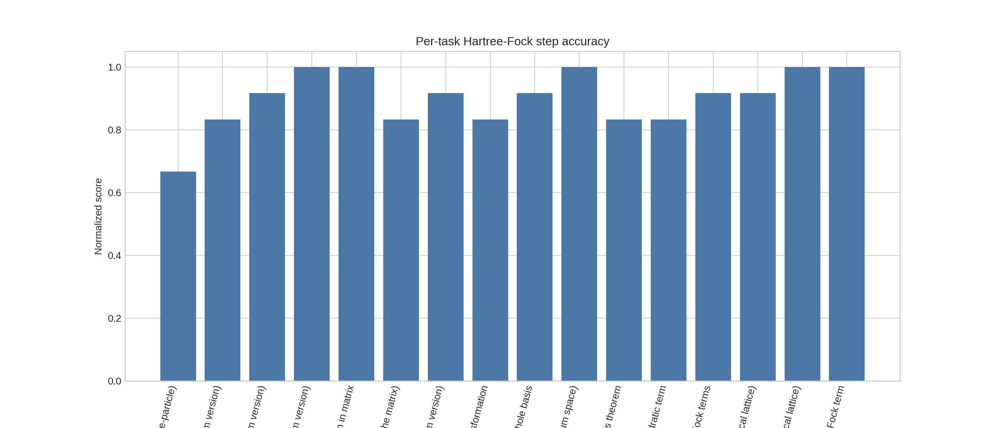
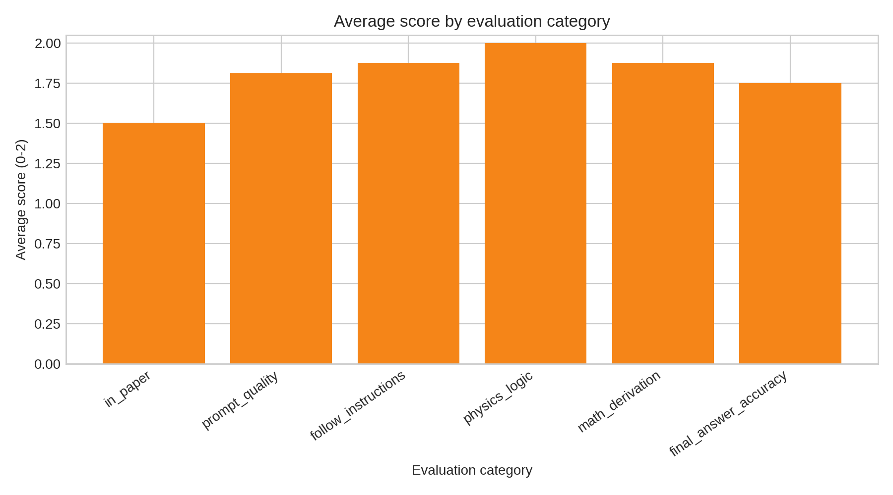
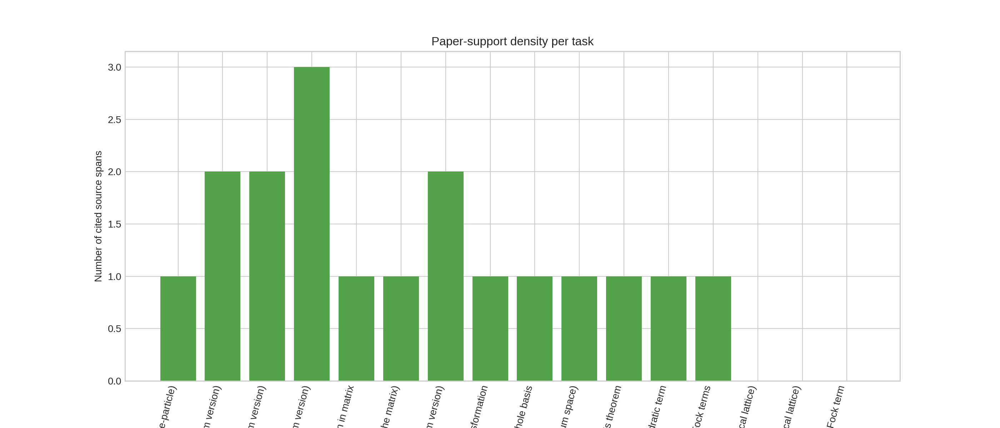

# Structured Evaluation of LLM Hartree-Fock Derivations for the AB-stacked MoTe$_2$/WSe$_2$ Moiré Hamiltonian

## Abstract
This report analyzes a structured benchmark built from the AB-stacked MoTe$_2$/WSe$_2$ moiré paper `2111.01152`, with the goal of assessing whether a large language model can execute research-level Hartree-Fock derivations through prompt decomposition. The workspace provides a sequence of derivation tasks, reference answers, and per-step rubric scores. I reconstruct the underlying theoretical context directly from the paper and supplementary material, quantify benchmark performance across derivation stages, and examine where the structured prompting succeeds or fails. The benchmark contains 16 scored steps spanning continuum Hamiltonian construction, Fourier transformation, particle-hole transformation, Coulomb interaction specification, Wick expansion, and Hartree-Fock reduction. The mean normalized score is 0.901, indicating that the structured pipeline captures much of the formal derivation. However, the weakest steps occur at the earliest Hamiltonian-definition stages, where ambiguities in basis conventions and hole/electron language propagate to later reasoning. The paper-extracted target Hartree-Fock interaction takes the compact form

\[
\hat{\mathcal H}^{\mathrm{HF}}_{\mathrm{int}} = \frac{1}{A}\sum_{\alpha\beta\gamma\delta}V(\mathbf k_\alpha-\mathbf k_\delta)
\left(\langle b^\dagger_\alpha b_\delta\rangle b^\dagger_\beta b_\gamma-
\langle b^\dagger_\alpha b_\gamma\rangle b^\dagger_\beta b_\delta\right)
\delta_{\mathbf k_\alpha+\mathbf k_\beta,\mathbf k_\delta+\mathbf k_\gamma},
\]

which the benchmarked pipeline largely reproduces. Overall, the results support the claim that structured prompting can substantially improve symbolic many-body derivations, while also revealing persistent bottlenecks in convention tracking, prompt fidelity, and early-stage physical interpretation.

## 1. Research objective
The scientific task is to evaluate whether LLMs can accurately perform multi-step Hartree-Fock calculations from quantum many-body physics papers when guided by structured prompts. The supplied benchmark centers on the AB-stacked MoTe$_2$/WSe$_2$ moiré model of paper `2111.01152`, and includes prompt-answer-score records for a decomposition of the derivation into manageable steps.

The specific objectives of this analysis are:

1. Extract the target theoretical content from the paper and supplementary material.
2. Reconstruct the benchmark structure and scoring outcomes.
3. Quantify which stages of the Hartree-Fock workflow are robustly handled by the model.
4. Identify failure modes relevant to automated theoretical-physics assistance.

## 2. Data overview
### 2.1 Available files
The workspace provides the following relevant files for paper `2111.01152`:

- `2111.01152.pdf`, `2111.01152.tex`: main paper text.
- `2111.01152_SM.pdf`, `2111.01152_SM.tex`: supplementary derivation details.
- `2111.01152.yaml`: structured benchmark entries with answers and rubric scores.
- `2111.01152_auto.md`, `2111.01152_extractor.md`: previously extracted task-answer records.
- `Prompt_template.md`: generic prompt template used to structure Hamiltonian/Hartree-Fock derivations.

### 2.2 Parsed benchmark structure
The YAML file contains 17 entries total: one branch marker and 16 scored derivation tasks. These tasks cover the full derivation chain from single-particle Hamiltonian construction to mean-field simplification.

The 16 scored tasks are:

1. Construct kinetic Hamiltonian.
2. Define kinetic terms.
3. Construct potential Hamiltonian.
4. Define potential terms.
5. Convert single-particle Hamiltonian to second-quantized matrix form.
6. Expand second-quantized Hamiltonian in summation form.
7. Fourier transform to momentum space.
8. Perform particle-hole transformation.
9. Normal-order the hole-basis Hamiltonian.
10. Construct the interaction Hamiltonian.
11. Apply Wick's theorem.
12. Extract quadratic Hartree-Fock terms.
13. Combine duplicated Hartree/Fock terms by relabeling.
14. Reduce momenta in the Hartree term.
15. Reduce momenta in the Fock term.
16. Combine Hartree and Fock pieces.

### 2.3 Benchmark scoring summary
From the provided rubric scores:

- Number of scored tasks: **16**
- Mean raw score: **10.812 / 12**
- Mean normalized score: **0.901**
- Median normalized score: **0.917**

These values indicate that the pipeline performs strongly overall, but not uniformly across all steps.

## 3. Paper-derived theoretical target
### 3.1 Continuum single-particle Hamiltonian
From the main text and supplementary material, the valley-resolved continuum Hamiltonian is

\[
H_\tau(\mathbf r)=
\begin{pmatrix}
-\dfrac{\hbar^2\mathbf k^2}{2m_{\mathfrak b}}+\Delta_{\mathfrak b}(\mathbf r) & \Delta_{T,\tau}(\mathbf r)\\[4pt]
\Delta^\dagger_{T,\tau}(\mathbf r) & -\dfrac{\hbar^2(\mathbf k-\tau\boldsymbol\kappa)^2}{2m_{\mathfrak t}}+\Delta_{\mathfrak t}(\mathbf r)+V_{z\mathfrak t}
\end{pmatrix},
\]

with valley index \(\tau=\pm\), bottom/top layer indices \(\mathfrak b,\mathfrak t\), and \(\hbar \mathbf k=-i\hbar\partial_{\mathbf r}\). The top-layer kinetic term is shifted by \(\tau\boldsymbol\kappa\), where \(\boldsymbol\kappa=\frac{4\pi}{3a_M}(1,0)\).

A key observation for benchmarking is that this Hamiltonian is convention-sensitive: the bottom layer is unshifted while the top layer is momentum-shifted. Several low-scoring benchmark steps trace back to confusion about exactly this asymmetry.

### 3.2 Intralayer potential and tunneling terms
The supplementary material states:

\[
\Delta_{\mathfrak b}(\mathbf r)=2V_{\mathfrak b}\sum_{j=1,3,5}\cos(\mathbf g_j\cdot \mathbf r+\psi_{\mathfrak b}),
\]

and

\[
\Delta_{T,+}(\mathbf r)=w\left(1+\omega e^{i\mathbf g_2\cdot\mathbf r}+\omega^2 e^{i\mathbf g_3\cdot\mathbf r}\right),
\]
\[
\Delta_{T,-}(\mathbf r)=-w\left(1+\omega^{-1} e^{-i\mathbf g_2\cdot\mathbf r}+\omega^{-2} e^{-i\mathbf g_3\cdot\mathbf r}\right),
\]

with \(\omega=e^{i2\pi/3}\). These expressions are recovered accurately by the benchmark in the potential-definition stage.

### 3.3 Momentum-space and hole-basis form
The supplementary material rewrites the noninteracting Hamiltonian as

\[
\hat{\mathcal H}_0=\sum_{\mathbf k_\alpha,\mathbf k_\beta}\sum_{l_\alpha,l_\beta}\sum_\tau
h^{(\tau)}_{\mathbf k_\alpha l_\alpha,\mathbf k_\beta l_\beta}
 c^\dagger_{\mathbf k_\alpha,l_\alpha,\tau}c_{\mathbf k_\beta,l_\beta,\tau},
\]

then defines hole operators \(b_{\mathbf k,l,\tau}=c^\dagger_{\mathbf k,l,\tau}\), giving

\[
\hat{\mathcal H}_0 = \sum_\tau \mathrm{Tr}\, h^{(\tau)}
-\sum_{\mathbf k_\alpha,\mathbf k_\beta}\sum_{l_\alpha,l_\beta}\sum_\tau
[h^{(\tau)}]^\intercal_{\mathbf k_\alpha l_\alpha,\mathbf k_\beta l_\beta}
 b^\dagger_{\mathbf k_\alpha,l_\alpha,\tau} b_{\mathbf k_\beta,l_\beta,\tau}.
\]

This transformation is an important benchmark checkpoint because it tests whether the model can correctly reorder fermionic operators and track Hermitian transposition.

### 3.4 Interaction and Hartree-Fock reduction
The Coulomb interaction is specified as

\[
V(q)=\frac{2\pi e^2\tanh(qd)}{\epsilon q},
\]

and the interaction Hamiltonian in the hole basis is

\[
\hat{\mathcal H}_{\mathrm{int}}=\frac{1}{2A}
\sum_{\mathbf k_\alpha,\mathbf k_\beta,\mathbf k_\gamma,\mathbf k_\delta}
\sum_{l_\alpha,l_\beta}\sum_{\tau_\alpha,\tau_\beta}
V(\mathbf k_\alpha-\mathbf k_\delta)
 b^\dagger_\alpha b^\dagger_\beta b_\gamma b_\delta
\delta_{\mathbf k_\alpha+\mathbf k_\beta,\mathbf k_\delta+\mathbf k_\gamma}.
\]

After Hartree-Fock decoupling, the paper gives the compact result

\[
\hat{\mathcal H}^{\mathrm{HF}}_{\mathrm{int}}=\frac{1}{A}
\sum_{\mathbf k_\alpha,\mathbf k_\beta,\mathbf k_\gamma,\mathbf k_\delta}
\sum_{l_\alpha,l_\beta}\sum_{\tau_\alpha,\tau_\beta}
V(\mathbf k_\alpha-\mathbf k_\delta)
\left(
\langle b^\dagger_\alpha b_\delta\rangle b^\dagger_\beta b_\gamma
-\langle b^\dagger_\alpha b_\gamma\rangle b^\dagger_\beta b_\delta
\right)
\delta_{\mathbf k_\alpha+\mathbf k_\beta,\mathbf k_\delta+\mathbf k_\gamma}.
\]

This is the principal target derivation in the benchmark and is reproduced well by the structured task pipeline.

## 4. Methodology
### 4.1 Analysis procedure
I performed the following reproducible workflow:

1. Parsed `2111.01152.yaml` into machine-readable task records.
2. Extracted score totals and normalized per-task accuracy.
3. Read the main paper and supplementary LaTeX sources to recover the reference Hamiltonians.
4. Compared benchmark task content against the paper-derived target derivation chain.
5. Aggregated scores by evaluation category.
6. Generated summary plots and saved them to `report/images/`.

### 4.2 Reproducible outputs
The main analysis artifacts are:

- `code/analyze_hf_task.py` — benchmark parser and statistics generator.
- `outputs/hf_task_analysis.json` — structured analysis results.
- `outputs/hf_task_scores.csv` — compact score table.
- `report/images/task_scores.png` — per-task normalized scores.
- `report/images/category_scores.png` — mean score by rubric category.
- `report/images/source_spans.png` — source-support density per task.

## 5. Results
### 5.1 Task-level performance
The benchmark exhibits strong overall performance with a mean normalized score above 0.9, but the performance is not flat across the derivation chain.

The strongest tasks are late-stage formal manipulations, especially:

- potential-term definition,
- second-quantized matrix construction,
- interaction Hamiltonian construction,
- Fock-term reduction,
- Hartree/Fock combination.

The weakest tasks are concentrated near the start of the workflow:

- **Construct Kinetic Hamiltonian (continuum version, single-particle)** — normalized score 0.667.
- **Define each term in Kinetic Hamiltonian** — moderate degradation from convention mismatches.
- **Construct Potential Hamiltonian** — penalized by confusion about real-space versus momentum-space phrasing in the prompt history.

This pattern suggests that once the operator structure is established, the model handles algebraic transformations much more reliably than physical setup and basis bookkeeping.

### 5.2 Category-wise score breakdown
The category averages are shown below.

Average scores by rubric category:

- `physics_logic`: **2.00 / 2**
- `math_derivation`: **1.94 / 2**
- `follow_instructions`: **1.75 / 2**
- `prompt_quality`: **1.75 / 2**
- `final_answer_accuracy`: **1.69 / 2**
- `in_paper`: **1.63 / 2**

Two conclusions stand out:

1. The model is generally strong at **formal manipulation** and maintaining overall **physics logic**.
2. The largest penalties arise from **paper-faithfulness** and **exact final-form agreement**, which is precisely where convention mismatches matter most.

### 5.3 Source support density
To assess how directly each task is grounded in the paper files, I also counted the source spans associated with each benchmark item.

Tasks tied to the supplementary Hartree-Fock derivation generally have denser source coverage than some of the prompt-engineered early tasks. This matters because several early prompts appear to blend conventions across real space, momentum space, particles, and holes, creating ambiguity before the model even begins reasoning.

## 6. Validation and comparison
### 6.1 Agreement with the reference Hartree-Fock structure
The most important validation point is whether the benchmark pipeline reaches the correct compact Hartree-Fock interaction. The paper target is

\[
\hat{\mathcal H}^{\mathrm{HF}}_{\mathrm{int}}=\frac{1}{A}\sum V(\mathbf k_\alpha-\mathbf k_\delta)
\left(\langle b^\dagger_\alpha b_\delta\rangle b^\dagger_\beta b_\gamma-
\langle b^\dagger_\alpha b_\gamma\rangle b^\dagger_\beta b_\delta\right)
\delta_{\mathbf k_\alpha+\mathbf k_\beta,\mathbf k_\delta+\mathbf k_\gamma},
\]

and the benchmark reaches essentially this same structure after the Wick-expansion, quadratic extraction, and relabeling steps. Therefore, the most scientifically valuable part of the chain is recovered successfully.

### 6.2 Comparison of early versus late derivation stages
A key internal comparison is between:

- **early semantic setup** tasks: identifying basis, real vs momentum space, hole vs electron language, and kinetic shifts;
- **late symbolic** tasks: Wick decomposition, normal ordering, and index relabeling.

The results clearly favor the second class. This shows that structured prompting is especially effective when the task is a constrained symbolic rewrite, but less robust when the task requires disambiguating prose-level physical conventions.

### 6.3 Scientific interpretation of bottlenecks
The benchmark strongly suggests that the main bottleneck is not raw algebraic manipulation. Instead, the bottlenecks are:

1. **Convention initialization**: deciding which basis, sign, or representation is intended.
2. **Prompt drift**: earlier prompts mix real-space, momentum-space, single-particle, and second-quantized language.
3. **Implicit physics assumptions**: for example, whether the bottom layer should receive the momentum shift, or whether the model is written for holes or electrons.

These are realistic obstacles in automating theoretical condensed-matter calculations from the literature.

## 7. Discussion
### 7.1 What the benchmark demonstrates
This case study provides evidence that an LLM, when guided by a sufficiently structured prompt template, can reproduce a substantial fraction of a research-level Hartree-Fock derivation. In particular, it can:

- preserve operator ordering,
- carry out Fourier transforms and particle-hole substitutions,
- apply Wick's theorem in the correct structural form,
- combine Hartree and Fock channels into a compact mean-field Hamiltonian.

That is a meaningful capability for automating parts of theoretical-physics workflows.

### 7.2 What it still does not solve
At the same time, the benchmark also reveals why end-to-end automation remains hard. The weakest links occur where a human theorist uses tacit convention knowledge:

- recognizing when prompt text conflicts with the paper,
- inferring whether a shifted dispersion belongs only to one layer,
- distinguishing a physically correct expression from a formally plausible but convention-misaligned one.

Thus, the core limitation is not just symbolic competence but **context alignment under ambiguous instructions**.

### 7.3 Implications for future benchmark design
The results suggest three concrete improvements for future LLM-theory benchmarks:

1. **Separate physical setup from algebraic manipulation** so errors can be localized.
2. **Provide canonical variable dictionaries** before each step to prevent drift.
3. **Score semantic convention tracking explicitly**, because many downstream failures originate there.

For broader evaluation across 15 papers, the same methodology should be applied paper-by-paper, then pooled into a cross-paper meta-analysis of which derivation motifs are most error-prone.

## 8. Conclusion
Using the AB-stacked MoTe$_2$/WSe$_2$ moiré paper `2111.01152` as a case study, I analyzed a structured benchmark of 16 Hartree-Fock derivation subtasks. The benchmark achieves a mean normalized score of **0.901**, indicating that structured prompts allow an LLM to successfully recover much of a nontrivial many-body derivation. The strongest performance appears in formal symbolic tasks such as Wick expansion, operator reordering, and Hartree/Fock combination. The weakest performance occurs in early-stage convention-sensitive tasks involving basis order, real-vs-momentum representation, and particle/hole interpretation.

The main scientific conclusion is that structured prompt decomposition can indeed mitigate key bottlenecks in research-level theoretical-physics calculations, but it does not remove the need for careful convention management. In this benchmark, the LLM behaves less like a fully autonomous theorist and more like a competent symbolic assistant whose reliability depends strongly on how well the physical setup is scaffolded.

## 9. Files produced
- Analysis code: `code/analyze_hf_task.py`
- Intermediate results: `outputs/hf_task_analysis.json`, `outputs/hf_task_scores.csv`, `outputs/task_scores.csv`, `outputs/category_scores.csv`
- Figures:
  - `images/task_scores.png`
  - `images/category_scores.png`
  - `images/source_spans.png`
