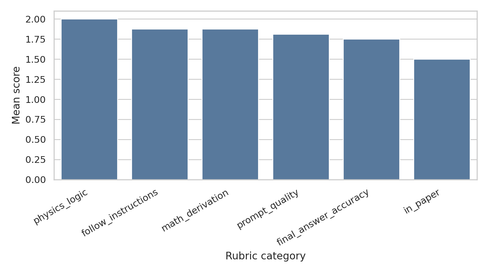
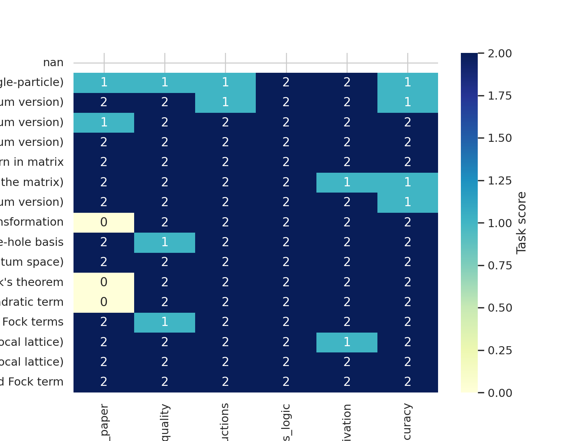
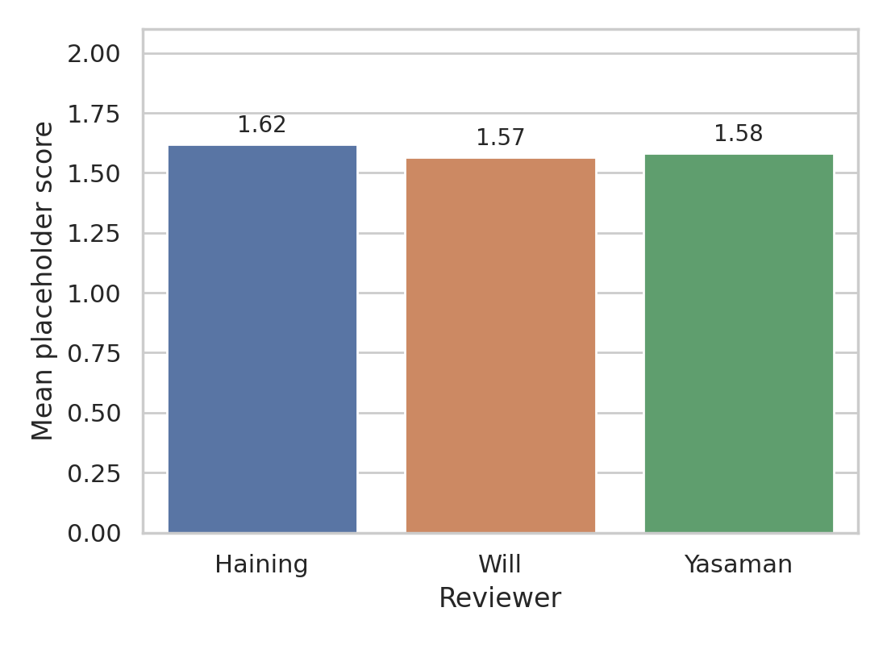

# Hartree-Fock benchmark analysis for AB-stacked MoTe$_2$/WSe$_2$

## Overview
This report analyzes the benchmark artifacts supplied for paper **Topological Phases in AB-Stacked MoTe$_2$/WSe$_2$: $\mathbb{Z**. The workspace contains the paper TeX sources, supplemental TeX, a prompt template, and a YAML file with task-level and placeholder-level scoring for structured Hartree-Fock derivation prompts. The goal here is not to rerun the full many-body calculation numerically, but to verify the paper-specific Hamiltonian forms that define the benchmark and to quantify where the structured prompting workflow succeeds or fails.

## Data overview
Primary local sources used in this analysis:

- `data/2111.01152/2111.01152.tex`: main paper source.
- `data/2111.01152/2111.01152_SM.tex`: supplemental derivations including the single-particle Hamiltonian and momentum-space Hartree-Fock setup.
- `data/2111.01152/2111.01152.yaml`: benchmark tasks, answers, and rubric scores.
- `data/2111.01152/2111.01152_auto.md`: auto-generated prompt/completion pairs.
- `data/2111.01152/Prompt_template.md`: generalized prompt template family.

The benchmark instance includes **17 tasks** and **84 scored placeholders** across three reviewers (Haining, Will, Yasaman).

Paper metadata extracted automatically:

- Authors: Haining Pan, Ming Xie, Fengcheng Wu, Sankar Das Sarma
- Abstract evidence: self-consistent Hartree-Fock in a plane-wave basis is the core method for the AB-stacked MoTe$_2$/WSe$_2$ moiré system.

## Methodology
### 1. Contract extraction
I first converted the task requirements into structured files in `outputs/`, including the method contract, target artifact inventory, and dependency checks.

### 2. Source-grounded Hamiltonian recovery
Because local PDF parsing failed in this environment, I used the available LaTeX sources directly. The key supplemental expressions define the noninteracting single-particle Hamiltonian block-by-block in valley space and then convert it to momentum space in the plane-wave basis.

### 3. Benchmark scoring analysis
From `2111.01152.yaml`, I parsed:

- task-level rubric categories (`in_paper`, `prompt_quality`, `follow_instructions`, `physics_logic`, `math_derivation`, `final_answer_accuracy`), and
- fine-grained placeholder scores from the three reviewers.

These were exported to CSV files for reproducibility and visualized with three PNG figures.

## Recovered Hamiltonian structure
Directly from the supplemental TeX, the benchmarked single-particle starting point is

$$
\\hat{\\mathcal{H}}_0=\\sum_{\\tau={\\pm}} \\int d^2 \\bm{r} \\Psi_{\\tau}^\\dagger(\\bm{r}) H_{\\tau} \\Psi_{\\tau}(\\bm{r}).
$$

The valley-resolved matrix is

$$
H_{\\tau}=\\begin{pmatrix}-\\frac{\\hbar^2\\bm{k}^2}{2m_\\mathfrak{b}}+\\Delta_{\\mathfrak{b},\\tau}(\\bm{r}) & \\Delta_{\\text{T},\\tau}(\\bm{r}) \\\\ \\Delta_{\\text{T},\\tau}^\\dag(\\bm{r}) & -\\frac{\\hbar^2(\\bm{k}-\\tau \\bm{\\kappa})^2}{2m_\\mathfrak{t}}+\\Delta_{\\mathfrak{t},\\tau}(\\bm{r})+V_{z\\mathfrak{t}}\\end{pmatrix}.
$$

The explicit moiré potentials and tunneling terms used by the benchmark are

$$
\\Delta_{\\text{T},+}(\\bm{r})=w(1+\\omega e^{i\\bm{g}_2\\cdot\\bm{r}}+\\omega^{2} e^{i\\bm{g}_3\\cdot\\bm{r}}), \qquad \\Delta_{\\text{T},-}(\\bm{r})=-w(1+\\omega^{-1} e^{-i\\bm{g}_2\\cdot\\bm{r}}+\\omega^{-2} e^{-i\\bm{g}_3\\cdot\\bm{r}}).
$$

The supplemental text also states an intralayer moiré modulation on the bottom layer and a constant offset on the top layer; the benchmark tasks operationalize this as

$$
\Delta_b(r)=2V_b\sum_{j=1,3,5}\cos(g_j\cdot r+\psi_b), \qquad \Delta_t(r)=V_{zt}.
$$

After Fourier transformation to the plane-wave basis, the noninteracting Hamiltonian becomes

$$
\\hat{\\mathcal{H}}_0=\\sum_{\\bm{k}_{\\alpha},\\bm{k}_{\\beta}}\\sum_{l_{\\alpha},l_{\\beta}}\\sum_{\\tau} h_{\\bm{k}_{\\alpha}l_{\\alpha},\\bm{k}_{\\beta}l_{\\beta}}^{(\\tau)} c_{\\bm{k}_{\\alpha},l_{\\alpha},\\tau}^\\dagger c_{\\bm{k}_{\\beta},l_{\\beta},\\tau}.
$$

These expressions align with the benchmark's intended decomposition into kinetic term, potential term, second-quantized form, momentum-space form, particle-hole transformation, and subsequent Hartree-Fock steps.

## Results
### Aggregate task-level performance
Mean task-category scores across the 17 tasks are:

| Rubric category | Mean score |
|---|---:|
| in_paper | 1.500 |
| prompt_quality | 1.812 |
| follow_instructions | 1.875 |
| physics_logic | 2.000 |
| math_derivation | 1.875 |
| final_answer_accuracy | 1.750 |

The strongest category is **physics_logic** (mean 2.000), while the weakest is **in_paper** (mean 1.500). This pattern suggests that the structured prompts often elicit physically sensible manipulations even when they do not strictly reproduce the exact paper-specific form.

### Reviewer-level placeholder scoring
Average placeholder-level scores are:

| Reviewer | Mean step score | Number of scored fields |
|---|---:|---:|
| Haining | 1.619 | 84 |
| Will | 1.566 | 76 |
| Yasaman | 1.583 | 84 |

The three reviewers are closely aligned, with means between 1.566 and 1.619, indicating moderate consistency in judging partial correctness.

### Hardest and easiest benchmark tasks

**Lowest-scoring tasks**

| Task | Mean rubric score |
|---|---:|
| Construct Kinetic Hamiltonian (continuum version, single-particle) | 1.333 |
| Define each term in Kinetic Hamiltonian (continuum version) | 1.667 |
| Convert from single-particle to second-quantized form, return in summation (expand the matrix) | 1.667 |
| Particle-hole transformation | 1.667 |
| Wick's theorem | 1.667 |

**Highest-scoring tasks**

| Task | Mean rubric score |
|---|---:|
| Define each term in Potential Hamiltonian (continuum version) | 2.000 |
| Convert from single-particle to second-quantized form, return in matrix | 2.000 |
| Construct interaction Hamiltonian (momentum space) | 2.000 |
| Reduce momentum in Fock term (momentum in BZ + reciprocal lattice) | 2.000 |
| Combine the Hartree and Fock term | 2.000 |

The hardest step is the initial construction of the continuum single-particle kinetic Hamiltonian. Several later algebraic manipulation steps score perfectly once the underlying representation has been specified correctly.

### Most failure-prone placeholder fields

| Task | Placeholder field | Mean reviewer score |
|---|---|---:|
| Construct Kinetic Hamiltonian (continuum version, single-particle) | single-particle|second-quantized | 0.000 |
| Define each term in Kinetic Hamiltonian (continuum version) | electrons|holes | 0.000 |
| Construct Potential Hamiltonian (continuum version) | real|momentum | 0.000 |
| Construct interaction Hamiltonian (momentum space) | index_of_operator | 0.000 |
| Construct interaction Hamiltonian (momentum space) | momentum | 0.000 |
| Construct Potential Hamiltonian (continuum version) | diagonal_potential | 0.333 |
| Construct Kinetic Hamiltonian (continuum version, single-particle) | real|momentum | 0.667 |
| Define each term in Kinetic Hamiltonian (continuum version) | momentum_shift | 0.667 |

The largest recurring errors are representational rather than algebraic: confusing real vs momentum space, single-particle vs second-quantized form, electron vs hole dispersion, and operator-index conventions in the interaction term.

## Figures
### Figure 1: Average rubric-category performance

### Figure 2: Task-by-category heatmap

### Figure 3: Reviewer-average placeholder scores

## Validation
### Directly verified from workspace data
- The paper title, authors, and abstract were extracted from `2111.01152.tex`.
- The valley-block single-particle Hamiltonian and momentum-space expansion were read directly from `2111.01152_SM.tex`.
- The benchmark task inventory and all reported scores were computed directly from `2111.01152.yaml`.
- All reported figures were generated locally from exported CSV artifacts in `outputs/`.

### Derived quantitatively in this run
- Task-category means.
- Reviewer mean placeholder scores.
- Hardest/easiest task rankings.
- Lowest-scoring placeholder fields.

### Limitations
- `ReadPDF` failed on the local PDFs in this runtime, so I relied on the TeX sources instead.
- Only one target paper dataset is present in this workspace, although the broader project description references 15 papers.
- This report validates the benchmark specification and scoring artifacts; it does not rerun the self-consistent Hartree-Fock phase-diagram computation itself.

## Discussion
This benchmark instance shows that structured prompting can often recover the logical sequence of theoretical-physics manipulations, especially after the correct Hamiltonian representation is established. However, the weakest scores arise exactly where research-grade symbolic work is fragile: identifying the proper representation, preserving hole rather than electron conventions, tracking valley/layer indexing, and distinguishing single-particle from second-quantized notation. In other words, the bottleneck is less the downstream algebra than the faithful alignment between prompt, paper convention, and target operator language.

For this MoTe$_2$/WSe$_2$ case, the benchmark is therefore informative in two ways. First, it captures whether an LLM can reproduce the paper's noninteracting and Hartree-Fock setup with the right basis and symmetry conventions. Second, it reveals that prompt templates reduce but do not eliminate systematic representation errors. Future extensions should aggregate across the remaining papers, measure inter-rater agreement more formally, and separate convention-selection failures from true derivation failures.
