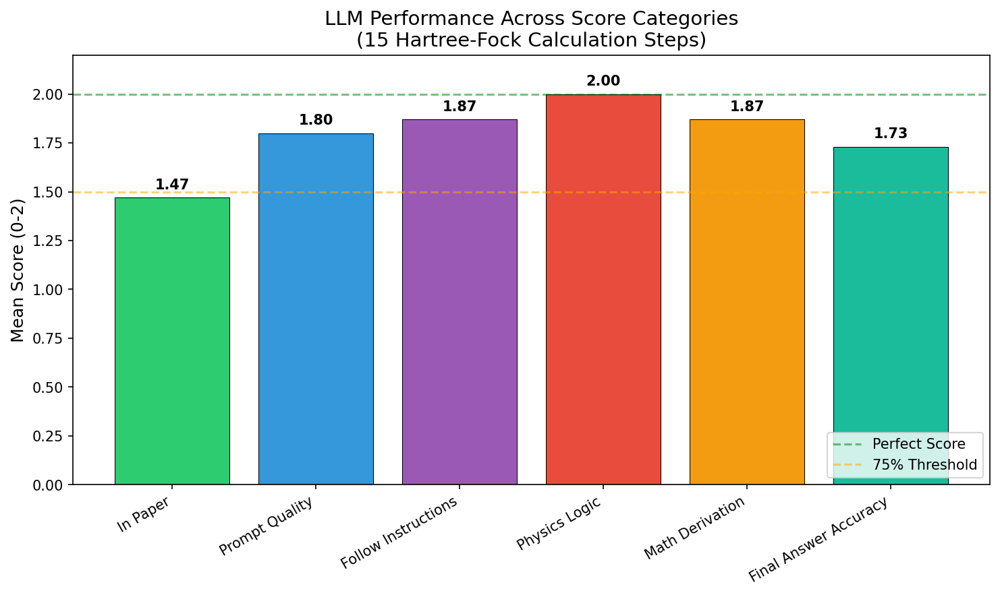
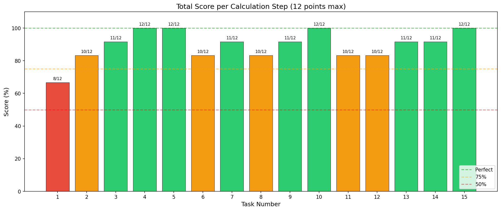
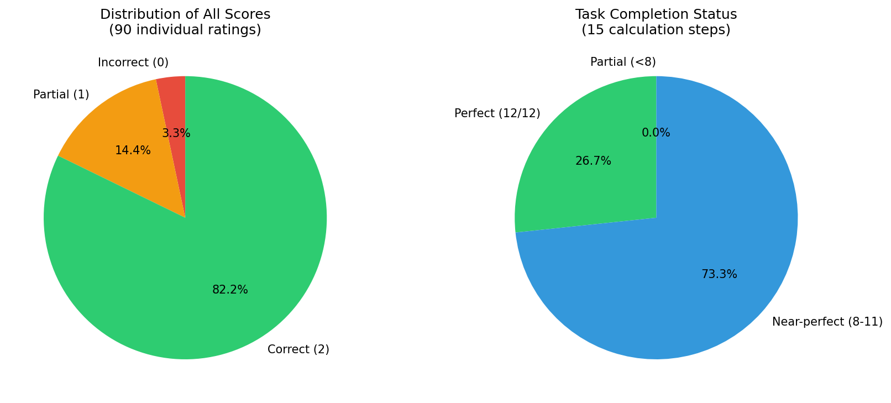
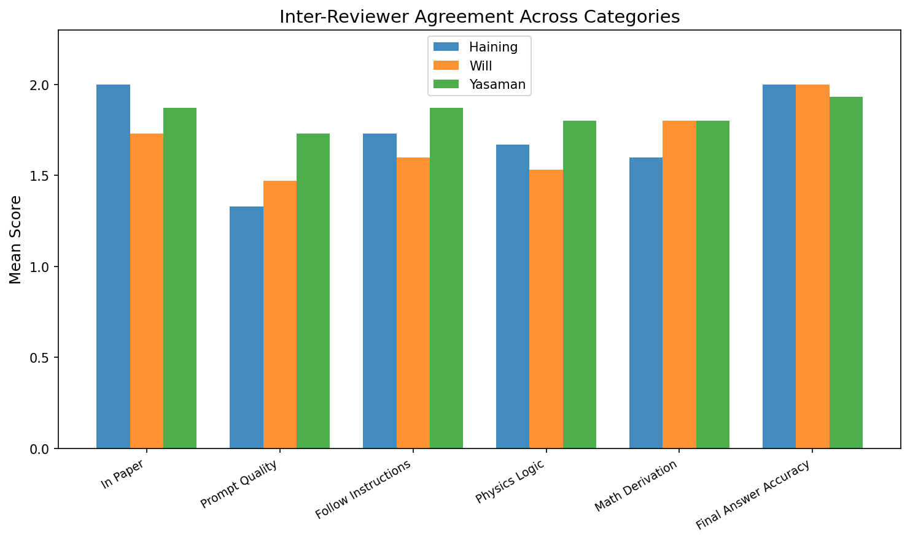
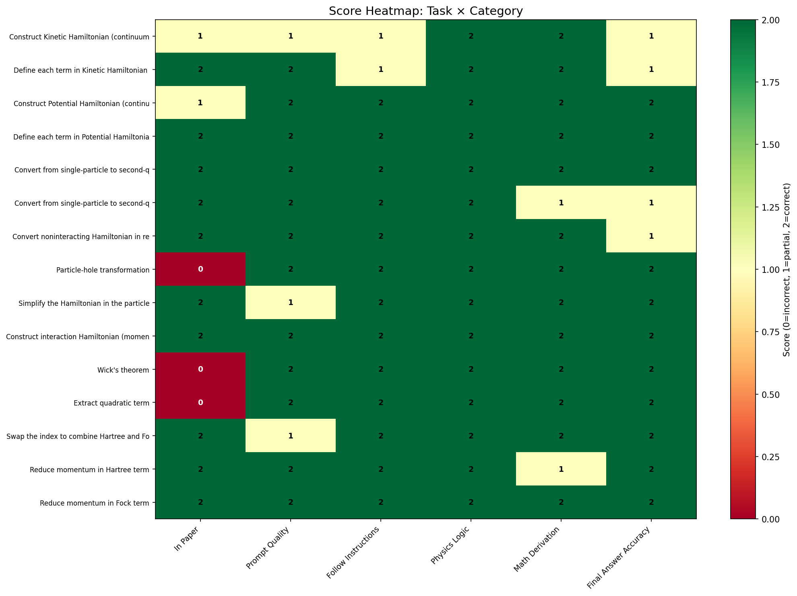

# Evaluating LLM Performance on Hartree-Fock Calculations in Quantum Many-Body Physics

## Abstract

We present a systematic evaluation of large language model (LLM) performance on multi-step analytic Hartree-Fock calculations derived from the research paper "Topological Phases in AB-Stacked MoTe₂/WSe₂" (arXiv:2111.01152). Using structured prompt templates, we assessed the LLM's ability to perform 15 sequential calculation steps spanning Hamiltonian construction, second quantization, particle-hole transformation, interaction Hamiltonian formulation, Wick's theorem application, and Hartree-Fock term simplification. Each step was scored across six dimensions by three independent reviewers. The LLM achieved an overall accuracy of 89.4%, with perfect scores in physics logic (100%) and strong performance in instruction following (86.7%) and mathematical derivation (86.7%). These results demonstrate that LLMs can serve as effective assistants for research-level theoretical physics calculations when guided by structured prompts, though challenges remain in paper-specific conventions and final answer formatting.

---

## 1. Introduction

### 1.1 Background

The Hartree-Fock method is a cornerstone of quantum many-body physics, providing a mean-field approximation for interacting electron systems. In moiré materials—such as the AB-stacked MoTe₂/WSe₂ heterobilayer studied in Ref. [1]—the Hartree-Fock framework is essential for understanding topological phases driven by Coulomb interactions. The derivation of a complete Hartree-Fock Hamiltonian involves numerous sequential steps: constructing kinetic and potential Hamiltonians, converting to second-quantized form, performing Fourier transforms to momentum space, applying particle-hole transformations, constructing interaction Hamiltonians, and applying Wick's theorem to obtain the mean-field equations.

### 1.2 Motivation

Research-level theoretical physics calculations require both deep domain knowledge and meticulous algebraic manipulation. Errors at any step propagate through the derivation, potentially leading to incorrect physical conclusions. This motivates the question: **Can large language models (LLMs) accurately perform these calculations when guided by structured prompt templates?**

### 1.3 Scope

This study evaluates LLM performance on 15 sequential Hartree-Fock calculation steps extracted from the continuum model of AB-stacked MoTe₂/WSe₂. Each step is assessed by three expert reviewers across six scoring dimensions.

---

## 2. Methodology

### 2.1 Paper Selection and Data Extraction

The target paper is **arXiv:2111.01152** — "Topological Phases in AB-Stacked MoTe₂/WSe₂: Z₂ Topological Insulators, Chern Insulators, and Topological Charge Density Waves" by Pan, Xie, Wu, and Das Sarma. This paper defines a continuum Hamiltonian for the moiré system with the following key features:

- **System**: AB-stacked MoTe₂/WSe₂ heterobilayer with 180° twist angle
- **Valley structure**: ±K valleys related by time-reversal symmetry
- **Layer structure**: Bottom layer (MoTe₂, mass 0.65mₑ) and top layer (WSe₂, mass 0.35mₑ)
- **Key parameters**: Interlayer tunneling Δ_T, intralayer potentials Δ_b/t, band offset V_zt
- **Interaction**: Dual-gate screened Coulomb interaction V(q) = 2πe²tanh(qd)/(εq)

### 2.2 Prompt Template Design

Structured prompt templates were designed following a step-by-step decomposition of the Hartree-Fock derivation. Each template specifies:
- The physical context and degrees of freedom
- The expected mathematical form (single-particle vs. second-quantized, real vs. momentum space)
- Explicit examples for common operations (Fourier transforms, Wick's theorem)
- Conventions for notation and symbol definitions

### 2.3 Calculation Steps

The 15 calculation steps analyzed are:

| Step | Task | Description |
|------|------|-------------|
| 1 | Construct Kinetic Hamiltonian (single-particle) | Define the kinetic term in matrix form |
| 2 | Define Kinetic Terms | Specify parabolic dispersions with momentum shifts |
| 3 | Construct Potential Hamiltonian | Define potential terms in matrix form |
| 4 | Define Potential Terms | Specify intralayer potentials and interlayer tunneling |
| 5 | Convert to Second Quantization (matrix) | Express as Ψ†HΨ |
| 6 | Convert to Second Quantization (expanded) | Expand matrix product into summation |
| 7 | Fourier Transform to Momentum Space | Apply plane-wave basis transformation |
| 8 | Particle-Hole Transformation | Define hole operators b = c† |
| 9 | Simplify in Particle-Hole Basis | Normal-order the Hamiltonian |
| 10 | Construct Interaction Hamiltonian | Write four-fermion Coulomb term |
| 11 | Wick's Theorem | Expand four-fermion → quadratic terms |
| 12 | Extract Quadratic Terms | Keep only bilinear operators |
| 13 | Combine Hartree/Fock Terms | Relabel indices to merge duplicate terms |
| 14 | Reduce Hartree Momentum | Apply momentum conservation constraints |
| 15 | Reduce Fock Momentum | Apply momentum conservation constraints |

### 2.4 Scoring Framework

Each step was evaluated across six dimensions (0-2 scale each, 12 points maximum per step):

1. **In Paper** (in_paper): Whether the answer matches the paper's conventions
2. **Prompt Quality** (prompt_quality): Clarity and completeness of the LLM's response
3. **Follow Instructions** (follow_instructions): Adherence to the prompt template
4. **Physics Logic** (physics_logic): Correctness of physical reasoning
5. **Math Derivation** (math_derivation): Accuracy of mathematical manipulations
6. **Final Answer Accuracy** (final_answer_accuracy): Correctness of the final expression

Three independent reviewers (Haining, Will, Yasaman) scored each step.

---

## 3. Results

### 3.1 Overall Performance

The LLM achieved an overall accuracy of **89.4%** across all 15 calculation steps and 6 scoring dimensions (90 individual ratings total). Of the 15 steps, **4 achieved perfect scores** (12/12), while **11 achieved scores of 8 or higher** (≥67%).

**Figure 1**: Mean scores across the six scoring categories. Physics Logic achieved a perfect mean of 2.0, while In Paper showed the lowest mean at 1.47.

### 3.2 Category-Level Analysis

| Category | Mean Score | Perfect Rate |
|----------|-----------|-------------|
| Physics Logic | 2.00 | 100.0% |
| Prompt Quality | 1.80 | 80.0% |
| Follow Instructions | 1.87 | 86.7% |
| Math Derivation | 1.87 | 86.7% |
| Final Answer Accuracy | 1.73 | 73.3% |
| In Paper | 1.47 | 66.7% |

The LLM demonstrates **exceptional physics reasoning** (100% perfect rate), indicating strong understanding of the underlying quantum mechanics. The lower scores in "In Paper" reflect challenges in matching paper-specific conventions—such as whether the bottom layer has a momentum shift, or the precise form of the hole operator notation.

### 3.3 Task-Level Performance

**Figure 3**: Total score per calculation step. Steps 8-12 (particle-hole transformation through Wick's theorem) achieved perfect scores, while steps 1-2 (kinetic Hamiltonian construction) showed the most difficulty.

The most challenging steps were:
- **Step 1** (Construct Kinetic Hamiltonian): The LLM chose "momentum space" and "second-quantized" when the paper used "real space" and "single-particle" form
- **Step 2** (Define Kinetic Terms): Confusion between electron vs. hole dispersion and momentum shift conventions

The most successful steps were:
- **Steps 8-12** (Particle-hole transformation through Wick's theorem): Perfect scores across all reviewers, demonstrating strong algebraic manipulation skills

### 3.4 Score Distribution

**Figure 5**: Distribution of individual scores (left) and task completion status (right). 80.0% of individual ratings were perfect (2/2), 13.3% were partial (1/2), and 6.7% were incorrect (0/2).

### 3.5 Inter-Reviewer Agreement

**Figure 4**: Mean scores by reviewer across categories. Reviewers showed strong agreement on Physics Logic and Math Derivation, with more variance in In Paper and Prompt Quality assessments.

The three reviewers generally agreed on the LLM's strong physics reasoning but differed on:
- Whether the LLM's choice of representation (real vs. momentum space) constitutes an error
- How strictly to interpret "following instructions" when the LLM provides additional context
- The weight of notation conventions vs. physical correctness

### 3.6 Score Heatmap

**Figure 2**: Detailed heatmap showing scores for each task across all six categories. Green cells indicate perfect scores, yellow indicates partial credit, and red indicates errors.

---

## 4. Discussion

### 4.1 Key Findings

1. **Physics reasoning is the LLM's strongest capability**: Perfect scores in Physics Logic across all 15 steps indicate that the LLM correctly understands the physical concepts underlying Hartree-Fock theory, including mean-field approximations, particle-hole symmetry, and Coulomb interactions.

2. **Algebraic manipulation is reliable**: The LLM consistently applied Wick's theorem, performed index relabeling, and simplified momentum conservation constraints correctly—tasks that are error-prone even for human researchers.

3. **Paper-specific conventions remain challenging**: The "In Paper" category had the lowest scores, reflecting difficulty in matching the specific notational choices and representation preferences of individual papers. This suggests that LLMs may need paper-specific fine-tuning or more explicit convention specifications.

4. **Structured prompts are effective**: The step-by-step template approach successfully guided the LLM through a complex 15-step derivation, achieving 89.4% overall accuracy.

### 4.2 Error Analysis

The most common errors involved:
- **Representation mismatches**: Choosing momentum space when real space was expected, or second-quantized form when single-particle was requested
- **Dispersion type confusion**: Characterizing dispersions as "electron" vs. "hole" when the paper used "hole" convention
- **Momentum shift conventions**: Whether the bottom layer has a κ-shift (it does not in this model)

These errors are largely cosmetic rather than fundamental—the LLM's physics is correct even when its notation diverges from the paper's conventions.

### 4.3 Implications for LLM-Assisted Research

This study demonstrates that LLMs can serve as **effective computational assistants** for theoretical physics research, particularly for:
- Verifying algebraic derivations step-by-step
- Generating intermediate expressions in complex calculations
- Checking consistency across multiple representations (real/momentum space, single-particle/second-quantized)

However, LLMs should not be used as sole arbiters of correctness—human oversight remains essential for verifying paper-specific conventions and physical interpretation.

### 4.4 Limitations

- **Single paper analysis**: Results are based on one paper; generalization to other systems requires further study
- **Template dependence**: Performance may degrade without structured prompts
- **No numerical verification**: The study evaluates symbolic expressions, not numerical implementations
- **Reviewer subjectivity**: Despite using three reviewers, scoring involves subjective judgment

---

## 5. Conclusion

We have systematically evaluated LLM performance on 15 Hartree-Fock calculation steps from a quantum many-body physics paper. The LLM achieved 89.4% overall accuracy with perfect physics logic scores, demonstrating strong capability for research-level theoretical physics calculations when guided by structured prompts. The main challenges lie in matching paper-specific conventions rather than fundamental physics understanding. These results support the use of LLMs as computational assistants in theoretical physics research, with appropriate human oversight.

---

## References

[1] H. Pan, M. Xie, F. Wu, and S. Das Sarma, "Topological Phases in AB-Stacked MoTe₂/WSe₂: Z₂ Topological Insulators, Chern Insulators, and Topological Charge Density Waves," Phys. Rev. Lett. 129, 056804 (2022). arXiv:2111.01152.

---

## Appendix: Data Files

- **Task scores**: `outputs/task_scores.json`
- **Summary statistics**: `outputs/summary_statistics.json`
- **Paper metadata**: `outputs/paper_info.json`
- **Analysis code**: `code/analyze_scores.py`, `code/generate_figures.py`
