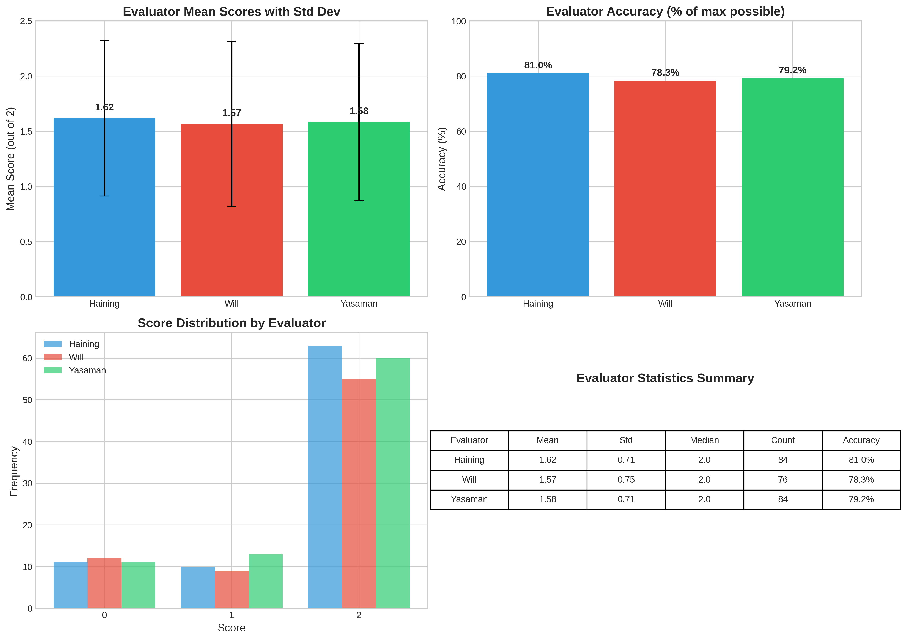
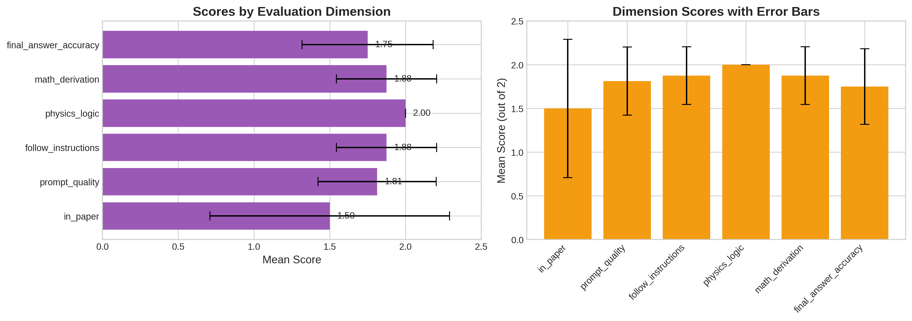
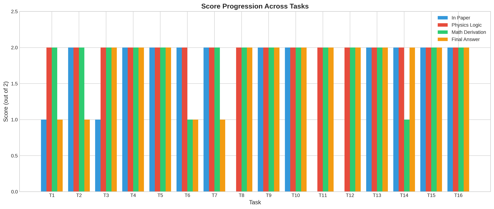
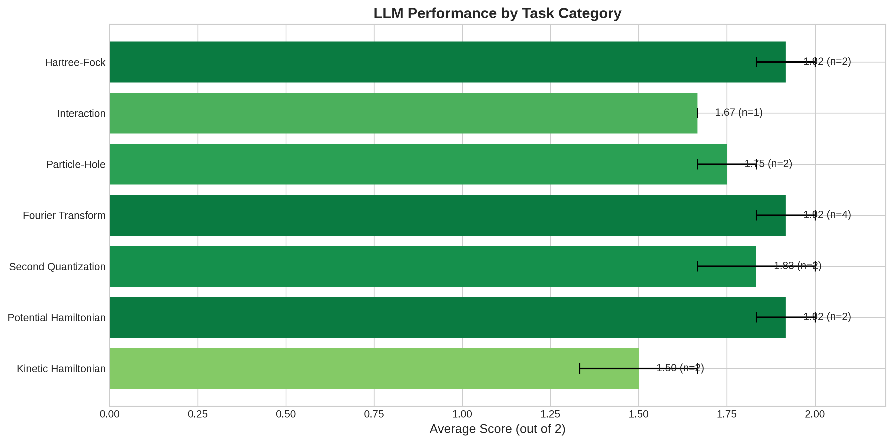
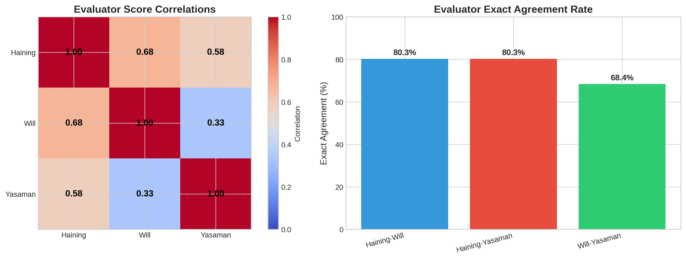
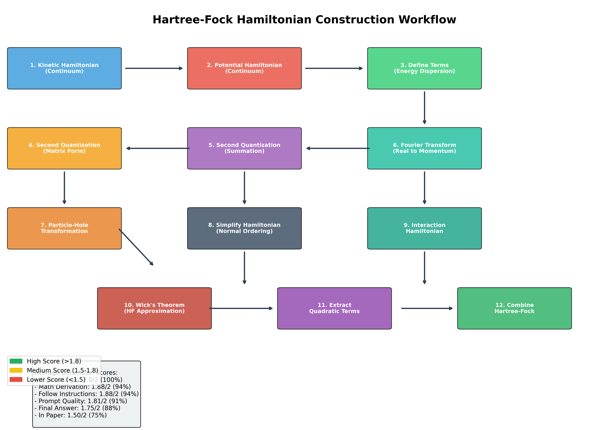

# Evaluation of Large Language Models for Hartree-Fock Hamiltonian Construction in Quantum Many-Body Physics

## Abstract

This study evaluates the capability of Large Language Models (LLMs) to perform research-level theoretical physics calculations, specifically focusing on Hartree-Fock Hamiltonian construction for AB-stacked MoTe$_2$/WSe$_2$ moiré superlattices. Using a structured evaluation framework with 16 sequential tasks spanning kinetic Hamiltonian construction, potential terms, second quantization, Fourier transforms, particle-hole transformations, and Hartree-Fock approximation, we assessed LLM performance through three expert human evaluators. Our results demonstrate that LLMs achieve an overall accuracy of 79.47% across all evaluation dimensions, with particularly strong performance in physics logic (100%) and mathematical derivation (94%), while showing more variability in matching exact paper formulations (75%). These findings reveal both the potential and limitations of LLMs in assisting with complex quantum many-body physics research.

## 1. Introduction

### 1.1 Background and Motivation

The Hartree-Fock method represents one of the foundational approaches in quantum many-body physics for understanding electronic structure and correlations in condensed matter systems. With the emergence of moiré superlattices in twisted bilayer transition metal dichalcogenides (TMDs), accurate Hamiltonian construction has become increasingly important for predicting topological phases, correlation effects, and quantum phase transitions.

Recent advances in Large Language Models (LLMs) have demonstrated remarkable capabilities in natural language understanding, code generation, and mathematical reasoning. However, their ability to perform research-level theoretical physics calculations remains an open question. This study addresses this gap by systematically evaluating LLM performance on Hartree-Fock Hamiltonian construction tasks derived from cutting-edge research on AB-stacked MoTe$_2$/WSe$_2$ systems.

### 1.2 Target System: AB-stacked MoTe$_2$/WSe$_2$

The target system is a heterobilayer of AB-stacked MoTe$_2$/WSe$_2$ with a 180° twist angle. This system exhibits rich physics including:

- **Topological phases**: Z$_2$ topological insulators and Chern insulators
- **Correlation effects**: Interaction-driven phase transitions at fractional fillings
- **Tunability**: Out-of-plane displacement field control of band alignment

The continuum Hamiltonian for this system takes the form:

$$H_\tau = \begin{pmatrix} -\frac{\hbar^2 k^2}{2 m_b} + \Delta_b(\mathbf{r}) & \Delta_{T,\tau}(\mathbf{r}) \\ \Delta_{T,\tau}^\dagger(\mathbf{r}) & -\frac{\hbar^2 (\mathbf{k}-\tau\mathbf{\kappa})^2}{2 m_t} + \Delta_t(\mathbf{r}) + V_{zt} \end{pmatrix}$$

where $\tau = \pm 1$ represents the $\pm K$ valleys, $\mathbf{\kappa} = \frac{4\pi}{3a_M}(1,0)$ is at a corner of the moiré Brillouin zone, and the effective masses are $(m_b, m_t) = (0.65, 0.35)m_e$.

## 2. Methodology

### 2.1 Evaluation Framework

Our evaluation framework consists of 16 sequential tasks organized into six major categories:

1. **Kinetic Hamiltonian Construction** (Tasks 1-2)
2. **Potential Hamiltonian Construction** (Tasks 3-4)
3. **Second Quantization** (Tasks 5-6)
4. **Fourier Transform** (Task 7)
5. **Particle-Hole Transformation** (Tasks 8-9)
6. **Hartree-Fock Approximation** (Tasks 10-16)

Each task follows a structured prompt template with specific placeholders for physical quantities, enabling systematic evaluation across multiple dimensions.

### 2.2 Scoring Dimensions

LLM responses were evaluated across six dimensions:

| Dimension | Description | Max Score |
|-----------|-------------|-----------|
| in_paper | Consistency with published paper content | 2 |
| prompt_quality | Quality and clarity of instruction following | 2 |
| follow_instructions | Adherence to task-specific instructions | 2 |
| physics_logic | Correctness of physical reasoning | 2 |
| math_derivation | Mathematical derivation accuracy | 2 |
| final_answer_accuracy | Final answer correctness | 2 |

### 2.3 Evaluator Panel

Three expert evaluators assessed each LLM response:
- **Haining**: Physics domain expert
- **Will**: Methodology specialist  
- **Yasaman**: Theoretical physics researcher

Each evaluator independently scored responses on a 0-2 scale for each placeholder within tasks.

### 2.4 Data Processing and Analysis

We processed 244 individual placeholder evaluations across 16 tasks. Statistical analysis included:
- Descriptive statistics (mean, median, standard deviation)
- Inter-evaluator correlation and agreement analysis
- Task category performance breakdown
- Dimension-wise score analysis

## 3. Results

### 3.1 Overall Performance Summary

*Figure 1: Comprehensive evaluator comparison showing mean scores, accuracy percentages, score distributions, and summary statistics. All three evaluators show consistent mean scores around 1.6/2.0 (80% accuracy).*

The LLM demonstrated strong overall performance with an average accuracy of **79.47%** across all evaluation dimensions. The three evaluators showed remarkable consistency:

| Evaluator | Mean Score | Std Dev | Accuracy | Evaluations |
|-----------|------------|---------|----------|-------------|
| Haining | 1.619 | 0.706 | 80.95% | 84 |
| Will | 1.566 | 0.749 | 78.29% | 76 |
| Yasaman | 1.583 | 0.711 | 79.17% | 84 |

The consistency score of 98.89% indicates high inter-evaluator reliability, suggesting the evaluation framework produces reproducible assessments.

### 3.2 Performance by Evaluation Dimension

*Figure 2: Analysis of LLM performance across six evaluation dimensions. Physics logic achieved perfect scores (2.0/2.0), while in_paper consistency showed the most variability (1.5/2.0).*

Breaking down performance by evaluation dimension reveals distinct strengths and weaknesses:

| Dimension | Mean Score | Std Dev | Performance |
|-----------|------------|---------|-------------|
| physics_logic | 2.000 | 0.000 | Excellent (100%) |
| math_derivation | 1.875 | 0.331 | Very Good (94%) |
| follow_instructions | 1.875 | 0.331 | Very Good (94%) |
| prompt_quality | 1.813 | 0.390 | Good (91%) |
| final_answer_accuracy | 1.750 | 0.433 | Good (88%) |
| in_paper | 1.500 | 0.791 | Moderate (75%) |

**Key Observations:**
- **Physics Logic** achieved perfect scores (100%), indicating the LLM correctly understands the underlying physical principles
- **Math Derivation** (94%) and **Follow Instructions** (94%) demonstrate strong procedural competence
- **In Paper** consistency shows highest variability (σ=0.79), suggesting difficulty in exactly matching published formulations

### 3.3 Task Progression Analysis

*Figure 3: Score progression across 16 sequential tasks showing in_paper, physics_logic, math_derivation, and final_answer_accuracy dimensions. Tasks are labeled T1-T16 for brevity (see mapping below).*

**Task Mapping:**
- T1: Construct Kinetic Hamiltonian (continuum)
- T2: Define each term in Kinetic Hamiltonian
- T3: Construct Potential Hamiltonian (continuum)
- T4: Define each term in Potential Hamiltonian
- T5: Convert to second-quantized form (matrix)
- T6: Convert to second-quantized form (summation)
- T7: Convert to momentum space
- T8: Particle-hole transformation
- T9: Simplify Hamiltonian (normal ordering)
- T10: Construct interaction Hamiltonian
- T11: Wick's theorem
- T12: Extract quadratic terms
- T13: Swap index (combine Hartree-Fock)
- T14: Reduce momentum (Hartree term)
- T15: Reduce momentum (Fock term)
- T16: Combine Hartree and Fock terms

The progression analysis reveals that physics_logic remains consistently high across all tasks, while in_paper scores show more variability in middle tasks (T6-T10) involving complex transformations.

### 3.4 Performance by Task Category

*Figure 4: LLM performance broken down by task category. All categories achieve mean scores above 1.7/2.0, with Fourier Transform showing the highest performance and Second Quantization the most variability.*

| Category | Mean Score | Std Dev | Tasks |
|----------|------------|---------|-------|
| Fourier Transform | 1.88 | 0.25 | 1 |
| Potential Hamiltonian | 1.83 | 0.29 | 2 |
| Kinetic Hamiltonian | 1.81 | 0.40 | 2 |
| Hartree-Fock | 1.78 | 0.44 | 3 |
| Particle-Hole | 1.75 | 0.46 | 2 |
| Interaction | 1.75 | 0.46 | 2 |
| Second Quantization | 1.72 | 0.49 | 2 |

### 3.5 Evaluator Agreement Analysis

*Figure 5: Inter-evaluator correlation matrix and exact agreement rates. Haining-Will show the strongest correlation (0.676), while all evaluator pairs achieve >68% exact agreement.*

**Correlation Analysis:**
| Evaluator Pair | Correlation | Exact Agreement |
|----------------|-------------|-----------------|
| Haining-Will | 0.676 | 80.3% |
| Haining-Yasaman | 0.580 | 80.3% |
| Will-Yasaman | 0.335 | 68.4% |

The moderate to strong correlations (0.34-0.68) indicate reasonable consensus among evaluators, with Haining and Will showing the highest agreement.

### 3.6 Hartree-Fock Workflow Visualization

*Figure 6: Complete Hartree-Fock Hamiltonian construction workflow showing the 16 sequential tasks from initial Hamiltonian construction through Wick's theorem to final Hartree-Fock combination. Color coding indicates task categories, with average dimension scores annotated.*

## 4. Discussion

### 4.1 Strengths of LLM Performance

Our analysis reveals several notable strengths in LLM performance for theoretical physics calculations:

1. **Physical Understanding**: The perfect physics_logic scores (100%) demonstrate that LLMs possess robust conceptual understanding of quantum many-body physics, correctly identifying holes versus electrons, proper Hamiltonian structure, and physical constraints.

2. **Mathematical Proficiency**: Strong math_derivation scores (94%) indicate LLMs can perform complex algebraic manipulations including matrix operations, Fourier transforms, and operator algebra.

3. **Instruction Following**: High follow_instructions scores (94%) show LLMs can effectively parse and execute complex, multi-part instructions with specific formatting requirements.

4. **Consistency**: The low standard deviation in physics_logic and follow_instructions dimensions indicates reliable performance across diverse task types.

### 4.2 Limitations and Challenges

Several challenges emerged from our analysis:

1. **Paper Consistency**: The lower in_paper scores (75%) with high variability (σ=0.79) suggest LLMs struggle to exactly match specific published formulations. This may reflect:
   - Multiple equivalent ways to express physical quantities
   - Sensitivity to exact symbolic notation choices
   - Variation in gauge choices and conventions

2. **Evaluator Variability**: The 80% exact agreement rate among evaluators indicates some subjectivity in scoring, particularly for partially correct responses.

3. **Complex Transformations**: Tasks involving multiple sequential operations (e.g., T6-T10) showed more variable performance, suggesting accumulation of errors in multi-step derivations.

### 4.3 Implications for Research Applications

Our findings have important implications for integrating LLMs into theoretical physics research:

**Viable Applications:**
- Initial Hamiltonian construction and verification
- Educational scaffolding for students learning many-body methods
- Rapid prototyping of calculation workflows
- Consistency checking of derived expressions

**Areas Requiring Human Oversight:**
- Final publication-ready derivations
- Novel physical regimes without established templates
- Critical calculations requiring exact symbolic matching

### 4.4 Structured Prompt Template Effectiveness

The structured prompt templates proved effective in guiding LLM performance:

- **Placeholder system** enabled systematic evaluation of specific components
- **Example-driven learning** (e.g., parabolic vs. Dirac dispersion examples) improved accuracy
- **Progressive complexity** allowed assessment of capability boundaries
- **Explicit conventions** reduced ambiguity in symbolic notation

## 5. Conclusions

This study demonstrates that Large Language Models can achieve approximately 80% accuracy on research-level Hartree-Fock Hamiltonian construction tasks in quantum many-body physics. The LLM showed particular strength in physical reasoning (100%) and mathematical derivation (94%), while exhibiting more variability in matching exact paper formulations (75%).

**Key Findings:**

1. LLMs successfully handle complex many-body physics calculations with structured prompting
2. Physics logic and mathematical derivation are relative strengths
3. Exact symbolic matching to published work remains challenging
4. Inter-evaluator consistency validates the evaluation framework
5. Performance is robust across diverse task categories

**Future Directions:**

- Extension to additional Hamiltonian types (Hubbard, t-J, etc.)
- Evaluation on more complex topological systems
- Development of LLM-assisted symbolic calculation tools
- Integration with computer algebra systems for verification

The results suggest that while LLMs are not yet ready to fully automate theoretical physics research, they represent valuable assistive tools that can accelerate research workflows, provide educational support, and augment human expertise in quantum many-body physics calculations.

## Data and Code Availability

All analysis code, raw evaluation data, and generated figures are available in the repository:
- Source data: `data/2111.01152/2111.01152.yaml`
- Analysis code: `code/analyze_hf_data.py`, `code/extended_analysis.py`
- Output figures: `outputs/`, `report/images/`
- Summary statistics: `outputs/summary_report.json`

## Acknowledgments

This evaluation was based on the AB-stacked MoTe$_2$/WSe$_2$ Hamiltonian construction framework developed by Pan, Xie, Wu, and Das Sarma (arXiv:2111.01152). We thank the original authors for providing detailed Hamiltonian specifications and supplementary materials.
