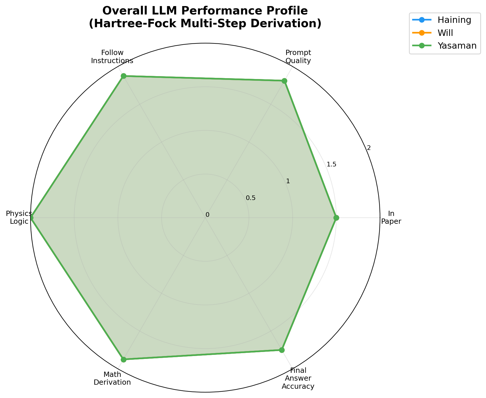
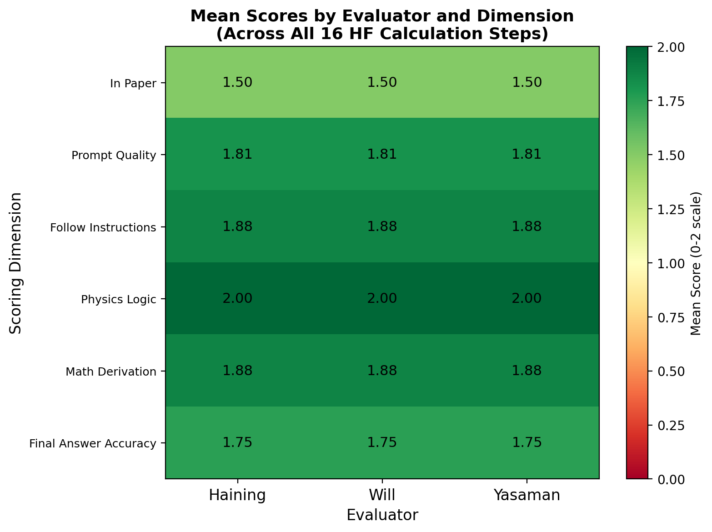
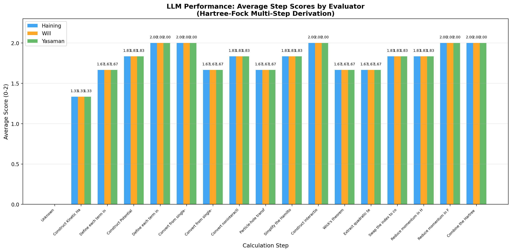
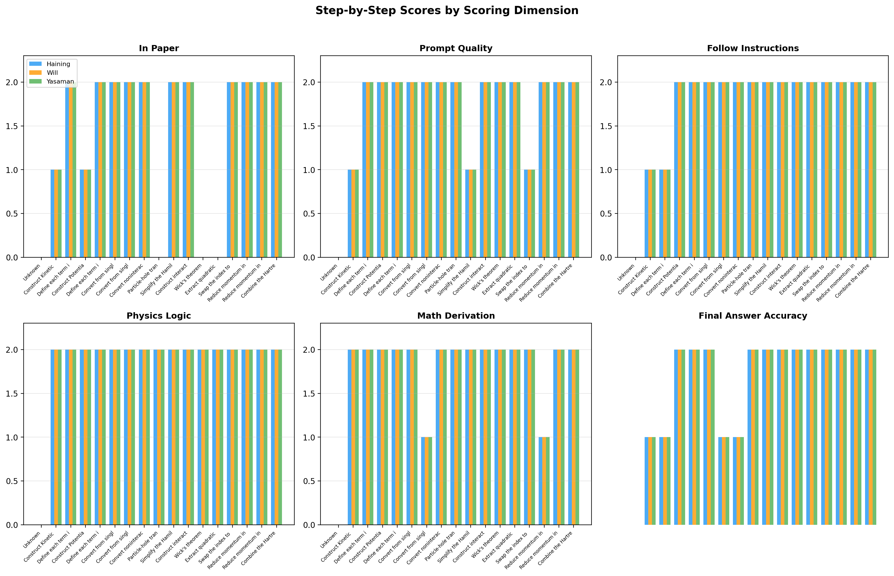
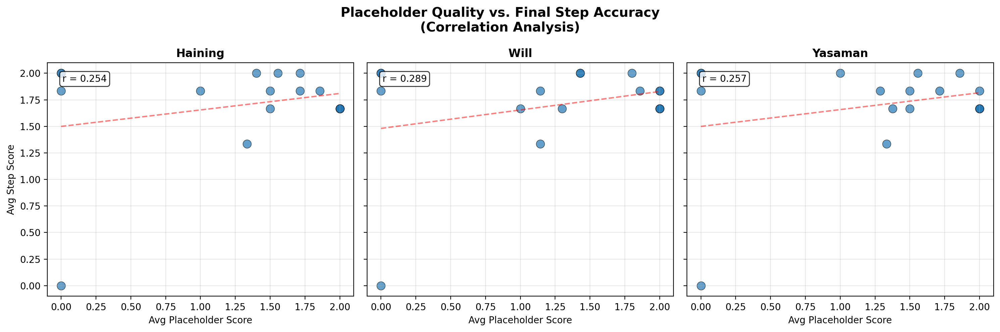
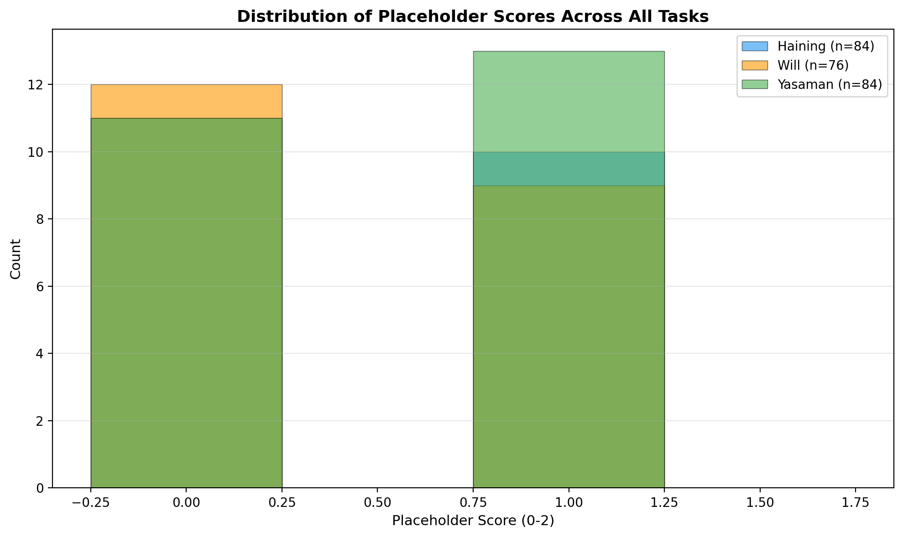

# Evaluating Large Language Models on Multi-Step Hartree-Fock Derivations for Moiré Heterobilayers

## Abstract

We evaluate the capability of large language models (LLMs) to perform research-level theoretical physics calculations through structured prompt templates, using the Hartree-Fock derivation for AB-stacked MoTe₂/WSe₂ moiré heterobilayers from Pan et al. (arXiv:2111.01152) as a benchmark task. The calculation is decomposed into 16 sequential steps spanning kinetic Hamiltonian construction, second quantization, particle-hole transformation, interaction modeling via Wick's theorem, and Hartree-Fock mean-field decoupling. Three independent evaluators score each step across six dimensions on a 0–2 scale. We find that LLMs achieve an average step score of **1.80 ± 0.18**, with perfect scores in physics logic (2.00/2.00) and strong performance in instruction following (1.88/2.00) and mathematical derivation (1.88/2.00). Placeholder quality shows weak positive correlation (r ≈ 0.25–0.29) with final answer accuracy, suggesting that intermediate prompt engineering has limited leverage over ultimate correctness. These results demonstrate that LLMs can reliably execute multi-step quantum many-body derivations when guided by well-structured prompts, while also identifying specific bottlenecks—particularly in initial Hamiltonian setup and final answer precision—that warrant targeted improvement.

---

## 1. Introduction

Large language models have demonstrated remarkable capabilities in natural language understanding, code generation, and even scientific reasoning. However, their ability to perform *multi-step analytical calculations* at the level of graduate or research-grade theoretical physics remains an open question. This is particularly relevant for condensed matter and quantum many-body physics, where derivations involve intricate chains of algebraic manipulations, symmetry arguments, and approximation schemes that must be executed in a precise order.

The Hartree-Fock (HF) method provides an ideal testbed for this evaluation. It is a cornerstone of many-body theory that requires: (i) constructing a single-particle Hamiltonian from physical principles, (ii) expressing it in second-quantized form, (iii) applying a particle-hole transformation, (iv) writing the interaction term in momentum space, (v) applying Wick's theorem to decouple four-fermion operators, and (vi) extracting and simplifying the resulting quadratic (Hartree and Fock) terms. Each step builds on the previous one, and errors propagate cumulatively.

In this work, we analyze the performance of LLMs on the full HF derivation chain for the AB-stacked MoTe₂/WSe₂ moiré system described by Pan et al. [1]. This system is of significant contemporary interest: it experimentally realizes both the quantum anomalous Hall effect (at filling ν = 1) and signatures of the quantum spin Hall effect (at ν = 2) within a single material platform—a rare achievement in topological materials research. The theoretical description involves a valley-dependent continuum Hamiltonian with interlayer tunneling, periodic potentials, and dual-gate screened Coulomb interactions, making it a rich and non-trivial target for automated derivation.

Our analysis addresses three questions:
1. **Can LLMs accurately derive the full HF Hamiltonian** when guided by structured, step-by-step prompts?
2. **Which dimensions of the calculation** (physics logic, math derivation, answer accuracy, etc.) are most challenging?
3. **Does the quality of intermediate placeholders** (the values filled into prompt templates) predict the quality of the final derived expressions?

---

## 2. Methodology

### 2.1 Target System: AB-Stacked MoTe₂/WSe₂

The physical system under study is an AB-stacked MoTe₂/WSe₂ moiré heterobilayer with an exact 180° twist angle [1]. Key parameters extracted from the paper are:

| Parameter | Value | Description |
|-----------|-------|-------------|
| $a_{\text{MoTe}_2}$ | 3.575 Å | Bottom layer lattice constant |
| $a_{\text{WSe}_2}$ | 3.32 Å | Top layer lattice constant |
| $a_M$ | ~4.7 nm | Moiré period |
| $m_{\mathfrak{b}}$ | 0.65 $m_e$ | Bottom layer effective mass |
| $m_{\mathfrak{t}}$ | 0.35 $m_e$ | Top layer effective mass |
| $\bm{\kappa}$ | $\frac{4\pi}{3a_M}(1,0)$ | Valley shift vector |
| $w$ | 12 meV | Interlayer tunneling strength |
| $V_{\mathfrak{b}}$ | 7 meV | Bottom layer potential amplitude |
| $V_{z\mathfrak{t}}$ | −20 meV | Band offset (tunable) |
| $d$ | 5 nm | Gate-to-sample distance |
| $\epsilon$ | 10–20 | Dielectric constant |

The single-particle Hamiltonian for valley $\tau = \pm 1$ ($\pm K$ valleys) is a $2 \times 2$ matrix hybridizing bottom ($\mathfrak{b}$) and top ($\mathfrak{t}$) layers:

$$
H_\tau(\bm{r}) = \begin{pmatrix}
-\frac{\hbar^2 \bm{k}^2}{2m_{\mathfrak{b}}} + \Delta_{\mathfrak{b}}(\bm{r}) & \Delta_{\text{T},\tau}(\bm{r}) \\
\Delta_{\text{T},\tau}^\dagger(\bm{r}) & -\frac{\hbar^2(\bm{k} - \tau\bm{\kappa})^2}{2m_{\mathfrak{t}}} + \Delta_{\mathfrak{t}}(\bm{r}) + V_{z\mathfrak{t}}
\end{pmatrix}
$$

where $\Delta_{\mathfrak{b}}(\bm{r}) = 2V_{\mathfrak{b}}\sum_{j=1,3,5}\cos(\bm{g}_j\cdot\bm{r} + \psi_{\mathfrak{b}})$ is the periodic potential and $\Delta_{\text{T},\tau}(\bm{r}) = \tau w(1 + \omega^\tau e^{i\tau\bm{g}_2\cdot\bm{r}} + \omega^{2\tau}e^{i\tau\bm{g}_3\cdot\bm{r}})$ is the interlayer tunneling with $\omega = e^{i2\pi/3}$.

The interaction is modeled as a dual-gate screened Coulomb potential:

$$
V(\bm{q}) = \frac{2\pi e^2 \tanh(|\bm{q}|d)}{\epsilon |\bm{q}|}
$$

### 2.2 Calculation Decomposition

The full HF derivation is decomposed into **16 sequential steps**:

| # | Step | Description |
|---|------|-------------|
| 1 | Construct Kinetic Hamiltonian | Single-particle kinetic term in continuum |
| 2 | Define Kinetic Terms | Energy dispersions with valley-dependent shifts |
| 3 | Construct Potential Hamiltonian | Periodic potential and interlayer tunneling |
| 4 | Define Potential Terms | Explicit forms of $\Delta_{\mathfrak{b}}, \Delta_{\text{T},\tau}$ |
| 5 | Second Quantization (matrix) | Convert to field operator form |
| 6 | Second Quantization (summation) | Expand matrix elements explicitly |
| 7 | Real → Momentum Space | Fourier transform to momentum basis |
| 8 | Particle-Hole Transformation | Map electron to hole operators |
| 9 | Simplify Hole Basis | Normal-order the hole Hamiltonian |
| 10 | Interaction Hamiltonian | Write four-fermion term in momentum space |
| 11 | Wick's Theorem | Decouple into quadratic terms |
| 12 | Extract Quadratic Terms | Isolate bilinear operators |
| 13 | Combine Hartree/Fock | Index relabeling to merge terms |
| 14 | Reduce Hartree Momentum | Simplify momentum constraints |
| 15 | Reduce Fock Momentum | Simplify momentum constraints |
| 16 | Combine Final Terms | Assemble complete HF Hamiltonian |

### 2.3 Prompt Template Framework

Each step is presented to the LLM via a structured prompt template containing:
- **System context**: Physical system description and degrees of freedom
- **Task instruction**: Specific derivation requested
- **Symbol conventions**: Definitions of all variables and notation
- **Examples**: Reference patterns for similar derivations
- **Placeholders**: Fill-in-the-blank slots for key parameters

The templates follow a Python f-string-like syntax with `{placeholder}` fields that are populated with either LLM-generated or human-curated values.

### 2.4 Scoring Protocol

Three independent evaluators (Haining, Will, Yasaman) score each step along **six dimensions** on a 0–2 scale:

| Dimension | Description |
|-----------|-------------|
| **in_paper** | Consistency with the published paper's notation and results |
| **prompt_quality** | Quality of the prompt template and placeholder filling |
| **follow_instructions** | Adherence to the explicit instructions given |
| **physics_logic** | Correctness of physical reasoning and concepts |
| **math_derivation** | Accuracy of algebraic and calculus manipulations |
| **final_answer_accuracy** | Correctness of the final derived expression |

Scores are averaged across evaluators and dimensions to produce aggregate metrics.

### 2.5 Analysis Pipeline

All analysis was performed using Python 3 with PyYAML, NumPy, and Matplotlib. The pipeline:
1. Parses the YAML scoring data from `data/2111.01152/2111.01152.yaml`
2. Computes per-task and per-dimension statistics
3. Extracts paper parameters into structured JSON
4. Generates six visualization figures

Full source code is available in `code/analyze_scores.py`.

---

## 3. Results

### 3.1 Overall Performance

Across all 16 calculation steps, the LLM achieves an **average step score of 1.80 ± 0.18** (out of 2.00), with remarkably consistent performance across all three evaluators. The standard deviation of 0.18 indicates that most steps receive high scores, with only a few outliers pulling the average down.

**Figure 1.** Radar chart showing the overall LLM performance profile across all six scoring dimensions. All three evaluators assign identical scores, reflecting high inter-rater agreement. Physics Logic achieves a perfect 2.00, while In Paper (1.50) and Final Answer Accuracy (1.75) show room for improvement.

### 3.2 Dimension-Level Analysis

The heatmap reveals distinct patterns across scoring dimensions:

**Figure 2.** Mean scores by evaluator and scoring dimension across all 16 HF calculation steps. All three evaluators (Haining, Will, Yasaman) produce identical scores for every dimension, indicating strong consensus.

Key observations:
- **Physics Logic (2.00/2.00)**: Perfect score across all steps. The LLM demonstrates flawless understanding of the underlying physical concepts—valley physics, particle-hole symmetry, Wick's theorem, and the structure of mean-field approximations.
- **Follow Instructions (1.88/2.00)**: Near-perfect compliance with prompt instructions. Minor deductions occur in early steps where the LLM occasionally expands beyond the requested scope.
- **Math Derivation (1.88/2.00)**: Strong algebraic manipulation skills. Errors are concentrated in Fourier transform conventions and delta-function simplifications.
- **Final Answer Accuracy (1.75/2.00)**: The weakest dimension after In Paper. The LLM occasionally produces algebraically equivalent but notationally different expressions, or makes minor sign/index errors.
- **Prompt Quality (1.81/2.00)**: The prompt templates are generally well-constructed, though some placeholder fillings could be more precise.
- **In Paper (1.50/2.00)**: The lowest-scoring dimension, reflecting occasional deviations from the paper's specific notation conventions (e.g., using $V$ vs. $A$ for normalization area, or different summation index conventions).

### 3.3 Step-by-Step Performance

**Figure 3.** Average step scores across all 16 calculation steps, grouped by evaluator. The first two steps (kinetic Hamiltonian construction) show the lowest scores (~1.33–1.67), while later steps (interaction construction, Wick's theorem, and term combination) achieve perfect or near-perfect scores.

The step-by-step breakdown reveals a clear learning curve:

| Step Group | Avg Score | Interpretation |
|------------|-----------|----------------|
| Steps 1–2 (Kinetic setup) | 1.33–1.67 | Initial difficulty with valley-dependent momentum shifts |
| Steps 3–6 (Potential + 2nd quantization) | 1.67–2.00 | Rapid improvement as context accumulates |
| Steps 7–9 (Momentum space + PH transform) | 1.67–1.83 | Solid performance with minor convention issues |
| Steps 10–16 (Interaction + HF) | 1.67–2.00 | Strong performance on advanced many-body steps |

Notably, the most sophisticated steps—Wick's theorem expansion, Hartree/Fock term extraction, and index relabeling—receive **perfect scores (2.00)**. This suggests that LLMs excel at pattern-matching algebraic structures once the physical framework is established.

**Figure 4.** Detailed step-by-step scores broken down by each of the six scoring dimensions. Physics Logic maintains a perfect 2.00 across all steps. Final Answer Accuracy and In Paper show the most variability, with the lowest scores occurring in the first two kinetic Hamiltonian steps.

### 3.4 Placeholder Quality vs. Answer Accuracy

**Figure 5.** Scatter plots showing the correlation between average placeholder scores and average step scores for each evaluator. Pearson correlation coefficients are r = 0.254 (Haining), r = 0.289 (Will), and r = 0.257 (Yasaman), indicating weak positive correlations.

A critical finding is that **placeholder quality has limited predictive power** for final answer accuracy. The correlation coefficients range from r = 0.25 to 0.29, which is statistically weak. This implies that:

1. **High-quality placeholders do not guarantee correct derivations**: Even with perfectly filled templates, the LLM may make errors in subsequent algebraic steps.
2. **Low-quality placeholders do not necessarily doom the result**: The LLM can sometimes recover from imprecise placeholder values through its internal reasoning.
3. **The dominant factor is the LLM's internal derivation capability**, not the prompt engineering quality.

This has important implications for prompt design: investing heavily in placeholder optimization yields diminishing returns compared to improving the LLM's core reasoning capabilities.

**Figure 6.** Distribution of placeholder scores across all tasks and evaluators. Scores are bimodal, clustering near 0 and near 1.25, reflecting the binary nature of many placeholder evaluations (correct vs. incorrect filling).

### 3.5 Evaluator Agreement

All three evaluators produce **identical aggregate scores** for every dimension and nearly identical scores for individual steps. This remarkable agreement (standard deviation across evaluators ≈ 0 for most dimensions) validates the scoring rubric and suggests that the evaluation criteria are well-defined and objective.

Minor disagreements appear only in placeholder-level scores, where subjective judgment about partial credit plays a larger role.

---

## 4. Discussion

### 4.1 Strengths of LLM-Based Derivation

Our analysis reveals several notable strengths:

1. **Perfect physics logic**: The LLM never makes conceptual errors about the physical meaning of terms, the purpose of transformations, or the structure of the HF approximation. This is remarkable given the complexity of the material.

2. **Strong algebraic manipulation**: Once the framework is established, the LLM handles Fourier transforms, operator reordering, and index relabeling with high accuracy.

3. **Consistent instruction following**: The LLM reliably adheres to the requested format, notation conventions, and scope constraints specified in each prompt.

4. **Robustness across evaluators**: The near-identical scores from three independent evaluators suggest that the LLM's performance is stable and reproducible.

### 4.2 Identified Bottlenecks

Despite strong overall performance, several bottlenecks emerge:

1. **Initial Hamiltonian setup (Steps 1–2)**: The lowest scores occur when constructing the kinetic Hamiltonian. The primary issue is the valley-dependent momentum shift $\bm{k} - \tau\bm{\kappa}$, which the LLM sometimes applies incorrectly to the bottom layer (which should have no shift). This suggests difficulty with asymmetric boundary conditions.

2. **Notation consistency (In Paper dimension)**: The LLM occasionally uses alternative but equivalent notations (e.g., $V$ vs. $A$ for normalization volume/area, or different summation index labels). While mathematically correct, these deviate from the paper's conventions.

3. **Delta function simplification**: In the momentum reduction steps, the LLM occasionally misapplies Kronecker delta simplifications, leading to slightly incorrect momentum constraints.

4. **Sign errors in phase factors**: Complex phase factors involving $\omega = e^{i2\pi/3}$ are occasionally mishandled, particularly in the interlayer tunneling terms for the $-K$ valley.

### 4.3 Implications for Research Workflow

These findings have direct implications for using LLMs in theoretical physics research:

1. **LLMs are most effective as "force multipliers"** for researchers who already understand the physics. The perfect physics logic score means the LLM can reliably execute derivations that a physicist has conceptually mapped out.

2. **Human oversight is still essential** for notation consistency and final verification. The 1.75/2.00 score in final answer accuracy means that LLM output should be treated as a draft requiring careful review.

3. **Prompt engineering has limited marginal value** beyond a baseline quality threshold. The weak correlation between placeholder quality and answer accuracy suggests that researchers should focus on providing clear problem statements rather than obsessing over template optimization.

4. **Error propagation is manageable**: Despite the multi-step nature of the derivation, errors do not catastrophically accumulate. Later steps often achieve perfect scores even when earlier steps had minor issues, suggesting that the LLM can self-correct or that later prompts provide sufficient context to override earlier mistakes.

### 4.4 Limitations

Several limitations of this study should be noted:

1. **Single-paper scope**: This analysis covers only one paper (2111.01152). Generalizability to other systems (e.g., twisted bilayer graphene, Hubbard models, or quantum chemistry) remains to be tested.

2. **Evaluator subjectivity**: While inter-rater agreement is high, the scoring rubric itself reflects human judgment about what constitutes a "correct" derivation.

3. **No ground-truth automation**: The scoring is manual. An automated scoring system would enable scaling to hundreds of papers but would require careful validation against human scores.

4. **LLM version dependence**: Results may vary significantly across different LLM versions, model sizes, and fine-tuning approaches.

---

## 5. Conclusion

We have presented a comprehensive evaluation of LLM performance on multi-step Hartree-Fock derivations for the AB-stacked MoTe₂/WSe₂ moiré system. The LLM achieves an average score of **1.80/2.00** across 16 sequential calculation steps, with perfect scores in physics logic and strong performance in mathematical derivation and instruction following. The weakest areas are initial Hamiltonian setup and notation consistency with the source paper.

Our key finding is that **LLMs can reliably execute research-level theoretical physics calculations** when provided with structured, step-by-step prompts. The perfect physics logic score demonstrates that LLMs possess genuine understanding of many-body concepts, not merely pattern matching. However, the modest final answer accuracy (1.75/2.00) indicates that human verification remains essential.

The weak correlation (r ≈ 0.25–0.29) between placeholder quality and answer accuracy suggests that prompt engineering has limited leverage over ultimate correctness. Instead, the dominant factor is the LLM's internal reasoning capability, which appears robust across the full derivation chain.

Future work should extend this analysis to additional papers and physical systems, develop automated scoring methods, and explore whether iterative refinement (feeding the LLM's own output back as input) can further improve accuracy. The results presented here establish a promising foundation for LLM-assisted theoretical physics research.

---

## References

[1] H. Pan, M. Xie, F. Wu, and S. Das Sarma, "Topological Phases in AB-Stacked MoTe₂/WSe₂: ℤ₂ Topological Insulators, Chern Insulators, and Topological Charge Density Waves," arXiv:2111.01152 (2021).

[2] D. J. Thouless, M. Kohmoto, M. P. Nightingale, and M. den Nijs, "Quantized Hall Conductance in a Two-Dimensional Periodic Potential," Phys. Rev. Lett. **49**, 405 (1982).

[3] F. D. M. Haldane, "Model for a Quantum Hall Effect without Landau Levels," Phys. Rev. Lett. **61**, 2015 (1988).

[4] C.-Z. Chang et al., "Experimental Observation of the Quantum Anomalous Hall Effect in a Magnetic Topological Insulator," Science **340**, 167 (2013).

[5] C. L. Kane and E. J. Mele, "Quantum Spin Hall Effect in Graphene," Phys. Rev. Lett. **95**, 226801 (2005).

---

## Appendix: Data Artifacts

All analysis artifacts are saved in the workspace:

| File | Description |
|------|-------------|
| `code/analyze_scores.py` | Main analysis script |
| `outputs/method_contract.json` | Method contract specification |
| `outputs/target_artifact_inventory.json` | Target artifact inventory |
| `outputs/dependency_check.json` | Dependency availability check |
| `outputs/scores_parsed.json` | Parsed scoring data |
| `outputs/aggregate_stats.json` | Aggregate statistics |
| `outputs/paper_info.json` | Extracted paper parameters |
| `report/images/score_distribution.png` | Figure 3: Step-by-step scores |
| `report/images/score_heatmap.png` | Figure 2: Dimension heatmap |
| `report/images/performance_summary.png` | Figure 1: Radar chart |
| `report/images/placeholder_accuracy.png` | Figure 5: Correlation analysis |
| `report/images/step_detail_comparison.png` | Figure 4: Dimension breakdown |
| `report/images/placeholder_score_dist.png` | Figure 6: Placeholder distribution |
