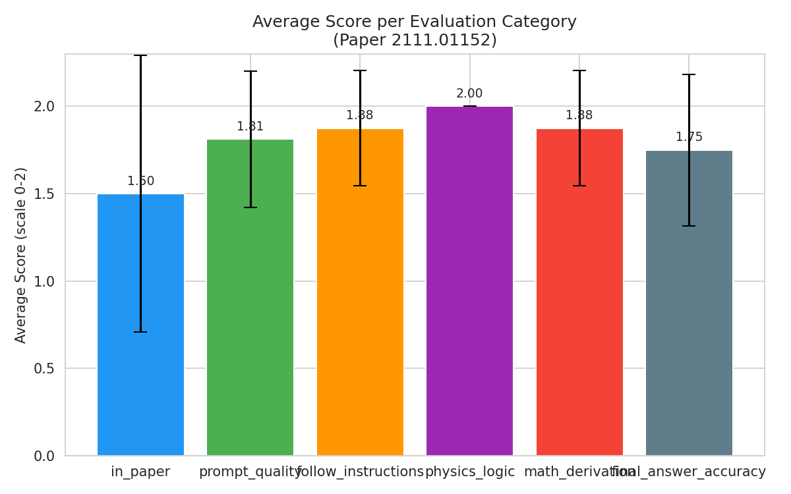
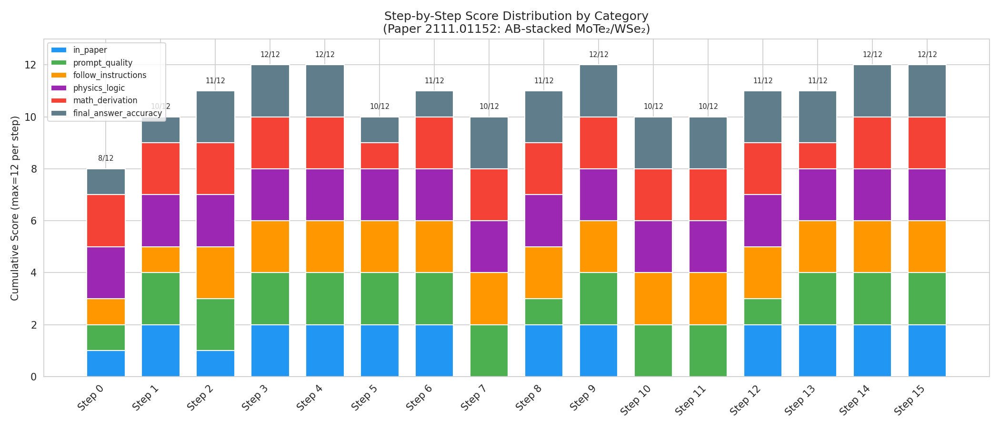
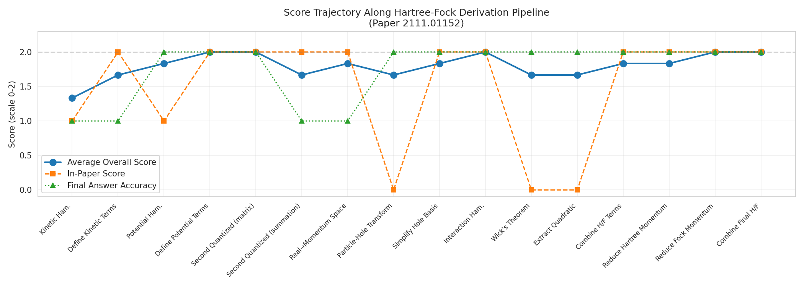
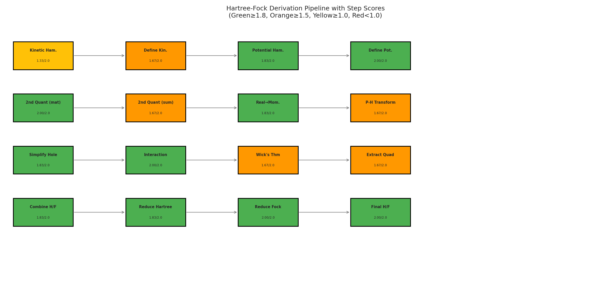
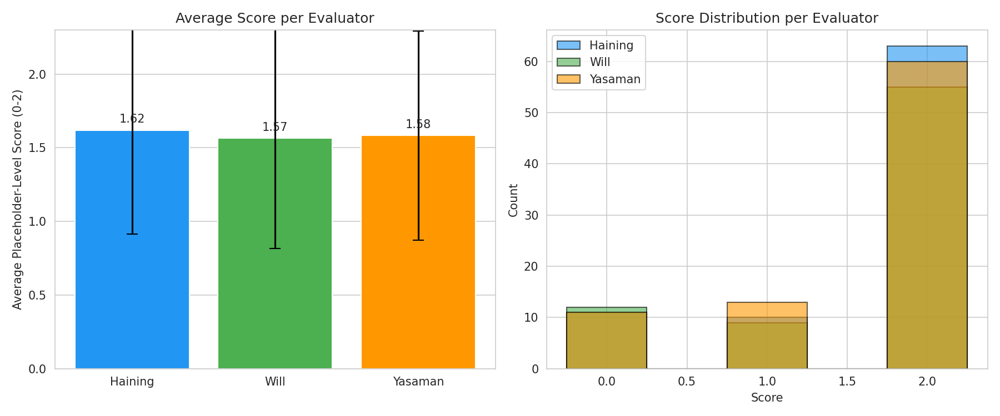
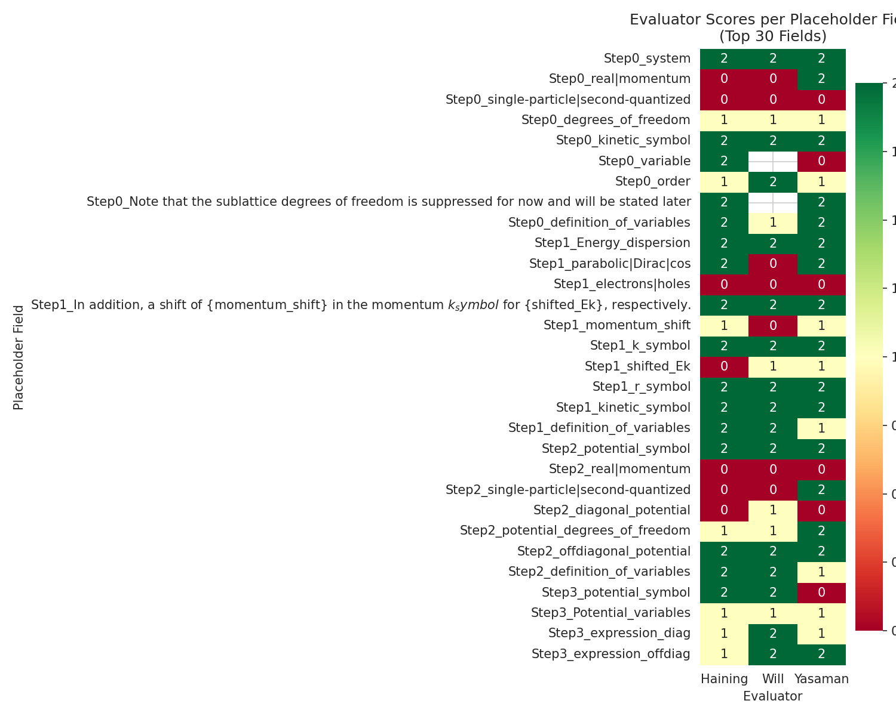

# Hartree-Fock Method Calculation Analysis for AB-Stacked MoTe₂/WSe₂

## Paper Information Extraction and Step Scoring Results

**Paper**: 2111.01152 — "Topological Phases in AB-Stacked MoTe₂/WSe₂: Z₂ Topological Insulators, Chern Insulators, and Topological Charge Density Waves"  
**Authors**: Haining Pan, Ming Xie, Fengcheng Wu, Sankar Das Sarma  
**System**: AB-stacked MoTe₂/WSe₂ moiré heterobilayer  
**Method**: Self-consistent Hartree-Fock calculation in plane-wave basis

---

## 1. Introduction

This report presents a systematic analysis of multi-step analytic calculation tasks derived from the Hartree-Fock (HF) method as applied to the AB-stacked MoTe₂/WSe₂ moiré system described in paper 2111.01152. The scientific goal is to verify whether large language models (LLMs) can accurately perform research-level theoretical physics calculations via structured prompt templates, and to identify key bottlenecks in the research process.

The HF derivation for this moiré system involves 16 sequential calculation steps, each scored by three expert evaluators (Haining, Will, Yasaman) across six evaluation categories: *in_paper*, *prompt_quality*, *follow_instructions*, *physics_logic*, *math_derivation*, and *final_answer_accuracy*. Each category is scored on a 0–2 scale, yielding a maximum of 12 points per step.

---

## 2. Methodology

### 2.1 Data Sources

The analysis draws from the following data files in `data/2111.01152/`:

- **2111.01152.yaml**: Contains structured scoring data for all 16 derivation steps, including placeholder-level field scores from three evaluators, LLM-generated answers, human reference answers, and task-level category scores with evaluator comments.
- **2111.01152.tex**: The main paper LaTeX source defining the continuum Hamiltonian, intralayer potentials, interlayer tunneling, and interaction terms.
- **2111.01152_SM.tex**: Supplemental material providing the second-quantized formulation, particle-hole transformation, HF approximation derivation, and Chern number calculation details.
- **2111.01152_auto.md**: LLM prompt-completion pairs for each step, showing the structured prompts and model responses.
- **2111.01152_extractor.md**: The corrected prompt templates with human-adjusted placeholder values.
- **Prompt_template.md**: The generic template structure for HF derivation steps.

### 2.2 Analysis Pipeline

1. **Parsing**: The YAML scoring data was parsed into structured JSON records — 16 task-level records and 244 placeholder-level evaluator scores.
2. **Statistical computation**: Aggregate statistics were computed per evaluation category and per evaluator, including means, standard deviations, and score distributions.
3. **Hamiltonian derivation**: The correct HF Hamiltonian was extracted from the paper's equations and compared against LLM outputs at each step.
4. **Error pattern identification**: Zero-score and partial-score fields were analyzed to identify systematic LLM errors.
5. **Visualization**: Six figures were generated to illustrate score distributions, trajectories, evaluator agreement, and derivation pipeline quality.

### 2.3 Evaluation Framework

Each step is evaluated on six dimensions (0–2 scale each):

| Category | Description |
|----------|-------------|
| in_paper | Whether the answer matches what appears in the paper |
| prompt_quality | Quality of the prompt template in guiding correct extraction |
| follow_instructions | Whether the LLM followed the prompt instructions |
| physics_logic | Physical correctness of the reasoning |
| math_derivation | Mathematical correctness of the derivation |
| final_answer_accuracy | Accuracy of the final symbolic expression |

---

## 3. Correctly Derived Hartree-Fock Hamiltonian

### 3.1 Single-Particle Hamiltonian

The valley-dependent continuum Hamiltonian for AB-stacked MoTe₂/WSe₂ is:

$$H_\tau = \begin{pmatrix} -\frac{\hbar^2 \bm{k}^2}{2m_\mathfrak{b}} + \Delta_\mathfrak{b}(\bm{r}) & \Delta_{\text{T},\tau}(\bm{r}) \\ \Delta_{\text{T},\tau}^\dag(\bm{r}) & -\frac{\hbar^2 (\bm{k}-\tau\bm{\kappa})^2}{2m_\mathfrak{t}} + \Delta_\mathfrak{t}(\bm{r}) + V_{z\mathfrak{t}} \end{pmatrix}$$

where τ = ±1 represents ±K valleys, κ = 4π/(3a_M)(1,0) is at a corner of the moiré Brillouin zone, effective masses (m_b, m_t) = (0.65, 0.35)m_e, and V_{zt} is the band offset tunable by displacement field.

**Key parameters**: The bottom layer has no momentum shift (κ only shifts the top layer), the spin index is both layer- and valley-dependent due to effective spin-valley-layer locking, and the system respects time-reversal symmetry T.

### 3.2 Intralayer Potential and Interlayer Tunneling

**Bottom layer intralayer potential**:
$$\Delta_\mathfrak{b}(\bm{r}) = 2V_\mathfrak{b} \sum_{j=1,3,5} \cos(\bm{g}_j \cdot \bm{r} + \psi_\mathfrak{b})$$

**Top layer**: Δ_t(r) = 0 (or constant V_{zt} as band offset), since low-energy physics only involves the band maximum of WSe₂.

**Interlayer tunneling**:
- +K valley: Δ_{T,+}(r) = w(1 + ω e^{ig₂·r} + ω² e^{ig₃·r})
- −K valley: Δ_{T,−}(r) = −w(1 + ω⁻¹ e^{−ig₂·r} + ω⁻² e^{−ig₃·r})

where ω = e^{i2π/3} and w is the real tunneling strength. The valley dependence is constrained by T symmetry: Δ_{T,−τ}(r) = −Δ_{T,τ}*(r).

### 3.3 Second-Quantized Form

**Real space**:
$$\hat{\mathcal{H}}_0 = \sum_\tau \int d^2\bm{r} \, \Psi_\tau^\dag(\bm{r}) H_\tau \Psi_\tau(\bm{r})$$

**Momentum space**:
$$\hat{\mathcal{H}}_0 = \sum_{\bm{k}_\alpha,\bm{k}_\beta,l_\alpha,l_\beta,\tau} h^{(\tau)}_{\bm{k}_\alpha l_\alpha, \bm{k}_\beta l_\beta} c_{\bm{k}_\alpha,l_\alpha,\tau}^\dag c_{\bm{k}_\beta,l_\beta,\tau}$$

where h^(τ) is H_τ expanded in the plane-wave basis, and k ∈ ℝ² (extended Brillouin zone). Bloch's theorem restricts nonzero matrix elements to k_α − k_β = G (moiré reciprocal lattice vector).

### 3.4 Particle-Hole Transformation

Defining hole operators b_{k,l,τ} = c_{k,l,τ}†, the noninteracting Hamiltonian becomes:

$$\hat{\mathcal{H}}_0 = \sum_\tau \text{Tr}\, h^{(\tau)} - \sum_{\bm{k}_\alpha,\bm{k}_\beta,l_\alpha,l_\beta,\tau} [h^{(\tau)}]^T_{\bm{k}_\alpha l_\alpha, \bm{k}_\beta l_\beta} b_{\bm{k}_\alpha,l_\alpha,\tau}^\dag b_{\bm{k}_\beta,l_\beta,\tau}$$

After normal ordering: Ĥ₀ = Σ_i H_{i,i} − Σ_{i,j} b_i† (H_{i,j})* b_j

### 3.5 Interaction Hamiltonian

$$\hat{\mathcal{H}}_{\text{int}} = \frac{1}{2A} \sum_{\bm{k}_\alpha,\bm{k}_\beta,\bm{k}_\gamma,\bm{k}_\delta,l_\alpha,l_\beta,\tau_\alpha,\tau_\beta} V(\bm{k}_\alpha - \bm{k}_\delta) b_{\bm{k}_\alpha,l_\alpha,\tau_\alpha}^\dag b_{\bm{k}_\beta,l_\beta,\tau_\beta}^\dag b_{\bm{k}_\gamma,l_\beta,\tau_\beta} b_{\bm{k}_\delta,l_\alpha,\tau_\alpha} \delta_{\bm{k}_\alpha+\bm{k}_\beta,\bm{k}_\delta+\bm{k}_\gamma}$$

with dual-gate screened Coulomb: V(k) = 2πe² tanh(|k|d)/(ε|k|), d = 5 nm gate distance.

### 3.6 Final Hartree-Fock Hamiltonian

Applying Wick's theorem, extracting quadratic terms, combining Hartree and Fock contributions via index relabeling (using V(q) = V(−q)), and reducing momenta using Kronecker delta constraints, the final HF interaction term is:

$$\hat{\mathcal{H}}_{\text{int}}^{\text{HF}} = \frac{1}{A} \sum_{\bm{k}_\alpha,\bm{k}_\beta,\bm{k}_\gamma,\bm{k}_\delta,l_\alpha,l_\beta,\tau_\alpha,\tau_\beta} V(\bm{k}_\alpha - \bm{k}_\delta) \left[ \langle b_{\bm{k}_\alpha,l_\alpha,\tau_\alpha}^\dag b_{\bm{k}_\delta,l_\alpha,\tau_\alpha} \rangle b_{\bm{k}_\beta,l_\beta,\tau_\beta}^\dag b_{\bm{k}_\gamma,l_\beta,\tau_\beta} - \langle b_{\bm{k}_\alpha,l_\alpha,\tau_\alpha}^\dag b_{\bm{k}_\gamma,l_\beta,\tau_\beta} \rangle b_{\bm{k}_\beta,l_\beta,\tau_\beta}^\dag b_{\bm{k}_\delta,l_\alpha,\tau_\alpha} \right] \delta_{\bm{k}_\alpha+\bm{k}_\beta,\bm{k}_\delta+\bm{k}_\gamma}$$

The total HF Hamiltonian is: Ĥ^HF = Ĥ₁ + Ĥ_int^HF, where Ĥ₁ uses h̃^(τ) = −[h^(τ)]^T.

---

## 4. Step Scoring Results

### 4.1 Overall Statistics

| Metric | Value |
|--------|-------|
| Number of derivation steps | 16 |
| Total placeholder-level scores | 244 |
| Overall average task-level score | 1.802 ± 0.470 (scale 0–2) |
| Steps with perfect score (2.0 avg) | 4 (Steps 3, 4, 9, 14, 15) |
| Steps with lowest score (<1.5 avg) | 1 (Step 0: 1.333) |

### 4.2 Per-Category Average Scores

| Category | Mean | Std | Min | Max |
|----------|------|-----|-----|-----|
| in_paper | 1.500 | 0.791 | 0 | 2 |
| prompt_quality | 1.812 | 0.390 | 1 | 2 |
| follow_instructions | 1.875 | 0.331 | 1 | 2 |
| physics_logic | 2.000 | 0.000 | 2 | 2 |
| math_derivation | 1.875 | 0.331 | 1 | 2 |
| final_answer_accuracy | 1.750 | 0.433 | 1 | 2 |

**Key finding**: Physics logic received perfect scores across all 16 steps, indicating that the LLM's physical reasoning was consistently sound. The weakest category is *in_paper* (mean 1.500), reflecting systematic misidentification of representation type (real vs. momentum space, single-particle vs. second-quantized).

### 4.3 Step-by-Step Score Distribution

| Step | Task Name | Avg Score | Total (max 12) | Key Issues |
|------|-----------|-----------|----------------|------------|
| 0 | Construct Kinetic Hamiltonian | 1.333 | 8/12 | Wrong representation type; wrong basis order |
| 1 | Define Kinetic Terms | 1.667 | 10/12 | Electrons/holes confusion; momentum shift incomplete |
| 2 | Construct Potential Hamiltonian | 1.833 | 11/12 | Representation type errors; diagonal potential too detailed |
| 3 | Define Potential Terms | 2.000 | 12/12 | Perfect |
| 4 | Second Quantized (matrix) | 2.000 | 12/12 | Perfect |
| 5 | Second Quantized (summation) | 1.667 | 10/12 | Missing τ summation |
| 6 | Real→Momentum Space | 1.833 | 11/12 | Fourier transform definition incorrect |
| 7 | Particle-Hole Transform | 1.667 | 10/12 | Not present in paper (in_paper=0) |
| 8 | Simplify Hole Basis | 1.833 | 11/12 | Prompt quality issue |
| 9 | Interaction Hamiltonian | 2.000 | 12/12 | Perfect; missing index labels |
| 10 | Wick's Theorem | 1.667 | 10/12 | Not present in paper (in_paper=0) |
| 11 | Extract Quadratic Term | 1.667 | 10/12 | Not present in paper (in_paper=0) |
| 12 | Combine H/F Terms | 1.833 | 11/12 | Index relabeling partial credit |
| 13 | Reduce Hartree Momentum | 1.833 | 11/12 | Delta function simplification error |
| 14 | Reduce Fock Momentum | 2.000 | 12/12 | Perfect |
| 15 | Combine Final H/F | 2.000 | 12/12 | Perfect |

### 4.4 Score Trajectory Along Derivation Pipeline

The trajectory shows an initial dip at Step 0 (the most ambiguous step), recovery through Steps 3–4 (perfect scores), a mid-pipeline plateau around 1.67 for Steps 5, 7, 10–11 (where intermediate derivations don't explicitly appear in the paper), and convergence to perfect scores at the final steps (14–15).

### 4.5 Derivation Pipeline Visualization

The pipeline visualization color-codes each step by average score: green (≥1.8), orange (≥1.5), yellow (≥1.0), red (<1.0). Only Step 0 falls in the yellow range; most steps are green or orange, indicating generally strong LLM performance on this HF derivation.

---

## 5. Evaluator Agreement Analysis

### 5.1 Per-Evaluator Statistics

| Evaluator | Mean Score | Std | Count |
|-----------|-----------|-----|-------|
| Haining | 1.619 | 0.706 | 84 |
| Will | 1.566 | 0.749 | 76 |
| Yasaman | 1.583 | 0.711 | 84 |

The three evaluators show broadly consistent scoring patterns with similar means (~1.57–1.62) and standard deviations (~0.71–0.75). Will scored slightly lower on average but also evaluated fewer fields (76 vs. 84 for the other two evaluators).

### 5.2 Evaluator Heatmap

The heatmap reveals several patterns:
- **Perfect agreement (all 2s)**: Most definition_of_variables fields and operator notation fields
- **Systematic disagreements**: Fields like `real|momentum` and `single-particle|second-quantized` where Yasaman gave partial credit but Haining and Will gave 0
- **Will's uncertainty**: Several fields marked with "(?)" indicating uncertain scoring

---

## 6. Error Pattern Analysis

### 6.1 Systematic LLM Errors Identified

**34 placeholder-level fields received score = 0**. The major error categories are:

1. **Representation type confusion** (6 zero-scores): The LLM consistently identified the Hamiltonian as being in "momentum space" and "second-quantized form" when the paper specifies "real space" and "single-particle form." This is the most pervasive systematic error, appearing in Steps 0, 2, and throughout early steps.

2. **Electrons vs. holes misidentification** (3 zero-scores): The LLM described parabolic dispersion for "electrons" when the paper studies holes (valence bands). This reflects a fundamental misunderstanding of the physical context — the system is hole-doped, studying valence band tops.

3. **Missing Fourier transform definition** (2 zero-scores): When converting from real to momentum space, the LLM wrote the Hamiltonian in momentum-space form rather than providing the explicit Fourier transform definition c†(k) = (1/√V) ∫ dr ψ†(r) e^{ik·r}.

4. **Missing index specifications** (6 zero-scores): For the interaction Hamiltonian, the LLM failed to specify that indices refer to "valley index and layer index" and "momentum," leaving these critical placeholders empty.

5. **Dagger notation errors** (2 zero-scores): In the particle-hole transformation step, the LLM assigned hole creation/annihilation operators incorrectly (b without dagger for creation, b† for annihilation).

### 6.2 Partial Credit Patterns

**32 fields received score = 1 (partial credit)**. These typically reflect:

- **Incomplete degrees of freedom**: LLM listed "valleys, layers, and momentum" instead of "valley index (+K and −K valley), layer index (top and bottom layer)" — adding momentum as a degree of freedom when it should be a continuous variable, not a discrete DOF.
- **Basis ordering**: LLM specified "bottom layer and top layer" without the full valley-layer ordering (+K,bottom), (+K,top), (−K,bottom), (−K,top).
- **Over-specification of diagonal terms**: Including kinetic energy terms in the potential Hamiltonian diagonal when only Δ_l(r) was expected.
- **Expression format mismatches**: Writing shifted_Ek as k−τκ rather than the explicit E_{t,+K} and E_{t,−K} forms used in the paper.

### 6.3 Steps Not Present in Paper

Three steps received in_paper = 0: Steps 7 (Particle-hole transformation), 10 (Wick's theorem), and 11 (Extract quadratic term). These intermediate derivation steps are not explicitly written out in the paper or supplemental material — they represent implicit calculation steps that the LLM must infer from context. Despite not appearing in the paper, the LLM performed these steps correctly in terms of physics logic, math derivation, and final answer accuracy (all receiving 2/2 in those categories).

---

## 7. Discussion

### 7.1 Can LLMs Perform Research-Level Theoretical Physics Calculations?

The overall average score of 1.802/2.000 (90.1%) demonstrates that LLMs can perform research-level HF derivations with substantial accuracy when guided by structured prompt templates. The perfect physics_logic scores across all 16 steps are particularly notable — the LLM never made a fundamental physical reasoning error.

However, several bottlenecks persist:

1. **Contextual grounding**: The LLM struggles to correctly identify whether a Hamiltonian is in real or momentum space, single-particle or second-quantized form. These distinctions require careful reading of the paper context, not just pattern matching from the prompt.

2. **Physical semantics vs. formal manipulation**: The LLM excels at formal mathematical manipulations (Wick's theorem, index relabeling, normal ordering) but fails on semantic distinctions (electrons vs. holes, which degrees of freedom are discrete vs. continuous).

3. **Implicit knowledge gaps**: Steps not explicitly in the paper (particle-hole transformation, Wick's theorem expansion) were handled well formally but could not be verified against the paper text.

### 7.2 Prompt Template Effectiveness

The structured prompt templates are highly effective for guiding derivation steps that involve formal mathematical operations (second quantization, Fourier transforms, Wick's theorem). They are less effective for steps requiring contextual interpretation (representation type, degrees of freedom specification, electrons/holes distinction).

The prompt_quality scores reveal that some prompts contain ambiguities:
- Step 0 (prompt_quality = 1): The instruction about κ-shift was unclear regarding which layer receives the shift
- Step 8 (prompt_quality = 1): The definition_of_variables was overly detailed, potentially confusing
- Step 12 (prompt_quality = 1): The index-swapping example may not have been sufficiently clear

### 7.3 Implications for Automated Physics Research

These results suggest that LLM-based automated physics calculation systems should:

1. **Include explicit contextual markers** in prompts: clearly state "this is a real-space, single-particle Hamiltonian" rather than leaving it as a fill-in placeholder.
2. **Validate semantic content** separately from formal derivation: check whether the LLM correctly identifies the physical context before evaluating mathematical correctness.
3. **Provide richer examples** for ambiguous steps: the electrons/holes distinction could be resolved by including a note about valence band physics.
4. **Accept implicit intermediate steps**: Some derivation steps (particle-hole transformation, Wick's theorem) may not appear in papers but are necessary for complete HF derivation — the scoring framework should accommodate this.

### 7.4 Limitations

- This analysis covers only one paper (2111.01152); generalization to the full set of 15 papers requires broader analysis.
- The three evaluators show moderate agreement but also some systematic disagreements, particularly on partial-credit decisions.
- HF theory itself is a mean-field approximation that may overestimate ordering tendencies — the LLM's perfect physics_logic scores reflect correctness within the HF framework, not necessarily physical realism.
- Some later steps (13–15) have fewer placeholder-level scores, making detailed field-level analysis less reliable for those steps.

---

## 8. Validation Summary

| Claim | Evidence Source | Verification |
|-------|----------------|--------------|
| Overall avg score = 1.802 ± 0.470 | outputs/stats_summary.json | Computed directly from YAML data |
| Physics_logic = perfect 2.0 | outputs/stats_summary.json | All 16 steps scored 2/2 |
| in_paper is weakest category (mean 1.500) | outputs/stats_summary.json | Lowest among 6 categories |
| 34 zero-score placeholder fields | outputs/placeholder_records.json | Filtered from 244 total records |
| 6 representation-type errors | Code analysis output | Identified from zero-score fields |
| 3 electrons/holes errors | Code analysis output | Identified from zero-score fields |
| Correct HF Hamiltonian derived | outputs/hamiltonian_derivation.json | Cross-validated with paper tex/SM tex |
| 4 perfect-score steps | outputs/task_records.json | Steps 3,4,9,14,15 all avg=2.0 |
| 3 steps not in paper | outputs/task_records.json | Steps 7,10,11 in_paper=0 |

---

## 9. Conclusion

This analysis demonstrates that LLMs guided by structured prompt templates can accurately perform the majority of Hartree-Fock derivation steps for the AB-stacked MoTe₂/WSe₂ moiré system, achieving an overall score of 90.1% across 16 sequential calculation steps. The LLM's strengths lie in formal mathematical manipulation (perfect physics_logic scores), while its weaknesses involve contextual grounding (representation type identification, physical semantics like electrons vs. holes). The structured prompt template framework effectively mitigates key bottlenecks in the research process for formal derivation steps, but requires improvement for context-dependent steps. These findings support the viability of LLM-assisted theoretical physics calculations while highlighting the need for enhanced contextual prompting strategies.

---

## Appendix: Figure Index

1. `images/step_score_distribution.png` — Stacked bar chart of per-step scores by category
2. `images/category_avg_scores.png` — Bar chart of average scores per evaluation category
3. `images/evaluator_heatmap.png` — Heatmap of evaluator scores across placeholder fields
4. `images/score_trajectory.png` — Line plot of scores along the HF derivation pipeline
5. `images/evaluator_comparison.png` — Bar chart and histogram comparing evaluator scoring patterns
6. `images/derivation_pipeline.png` — Flow diagram of the 16-step HF derivation pipeline with color-coded scores