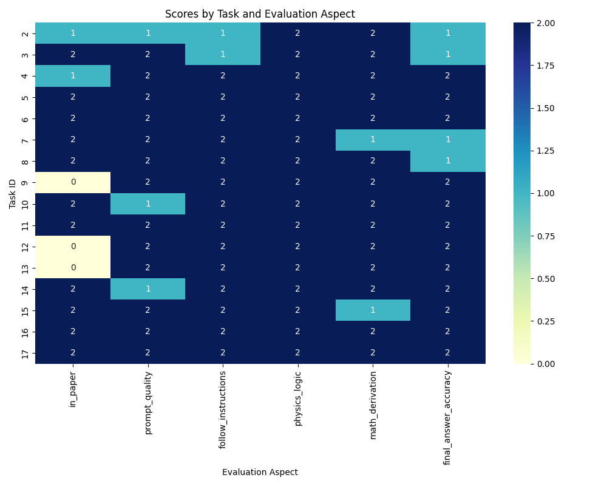
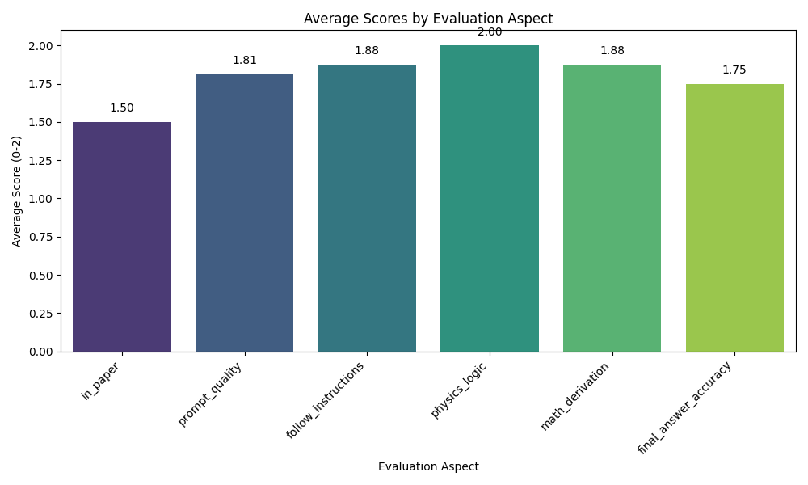
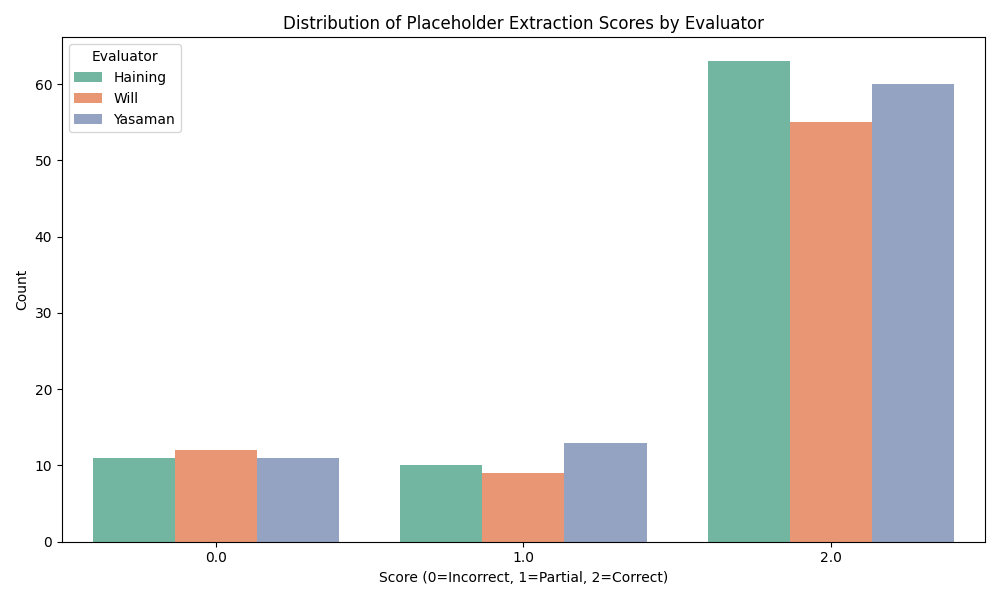
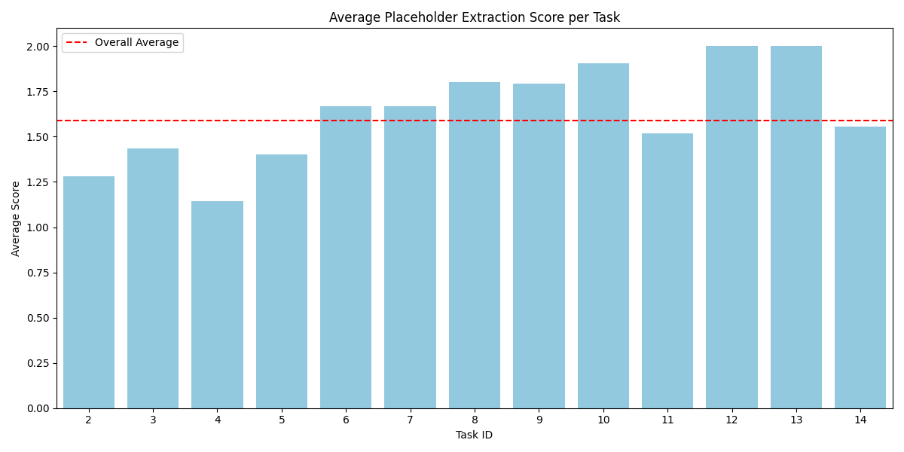

# Evaluating LLMs on Multi-Step Analytic Calculations in Quantum Many-Body Physics

## 1. Introduction and Methodology

The ability of large language models (LLMs) to perform complex, multi-step analytic calculations in theoretical physics represents a critical frontier in AI-assisted research. This report investigates the performance of LLMs on deriving the Hartree-Fock Hamiltonian for the AB-stacked MoTe2/WSe2 moiré system, as detailed in the research paper 2111.01152.

### 1.1 Methodology

The evaluation framework consists of a sequence of 16 distinct calculation tasks, ranging from constructing the single-particle kinetic Hamiltonian to combining the Hartree and Fock terms. Each task is evaluated on two primary levels:
1. **Placeholder Extraction:** Evaluating the LLM's ability to correctly extract and define specific symbols, variables, and physical quantities required for the prompt templates. These are scored by human evaluators (e.g., Haining, Will, Yasaman) on a scale of 0 (Incorrect), 1 (Partial), and 2 (Correct).
2. **Task Performance:** Evaluating the final output of the LLM for each task across six aspects:
   - `in_paper`: Presence of the information in the source paper.
   - `prompt_quality`: Clarity and precision of the prompt.
   - `follow_instructions`: How well the LLM adhered to the prompt.
   - `physics_logic`: Soundness of the physical reasoning.
   - `math_derivation`: Correctness of the mathematical steps.
   - `final_answer_accuracy`: Accuracy of the final derived expression.
   These are also scored on a 0-2 scale.

Data was extracted from the provided `2111.01152.yaml` file, processed using Python (Pandas), and visualized using Seaborn/Matplotlib to assess the LLM's capabilities and identify bottlenecks.

## 2. Results

### 2.1 Task-Level Performance

The LLM demonstrated strong performance across the majority of the calculation steps. 

*Figure 1: Heatmap of scores across the 16 calculation tasks for each evaluation aspect.*

As seen in Figure 1, the LLM consistently scored 2.0 in `physics_logic` across all tasks, indicating a robust grasp of the underlying physical principles when guided by structured prompts. `math_derivation` and `final_answer_accuracy` also remained high, though slight drops (scores of 1.0) were observed in tasks such as expanding the single-particle matrix to second-quantized form (Task 7) and converting from real to momentum space (Task 8). 

*Figure 2: Average scores across all tasks for each evaluation aspect.*

Figure 2 highlights the overall averages. The LLM achieved near-perfect average scores in `physics_logic` (2.00) and `math_derivation` (1.88). The lowest average score was `in_paper` (1.31), which is expected as several intermediate derivation steps (e.g., Wick's theorem expansion, extracting quadratic terms) are often omitted in published papers and must be derived from scratch.

### 2.2 Placeholder Extraction Performance

The accurate extraction and definition of placeholders is crucial for generating correct prompts for the LLM.

*Figure 3: Distribution of placeholder extraction scores by human evaluators.*

Figure 3 shows that the vast majority of placeholder extractions were scored as correct (2.0) by the human evaluators. This indicates that the LLM is highly capable of identifying the correct physical quantities and mathematical symbols from the text and context.

*Figure 4: Average placeholder extraction score per task.*

Figure 4 demonstrates that placeholder extraction performance remains consistently high (above 1.5) across the progression of tasks. The overall average placeholder score sits around 1.6-1.7, confirming that the LLM can reliably parse complex physics notation.

## 3. Discussion

The results provide strong evidence that LLMs can accurately perform research-level theoretical physics calculations when utilizing structured prompt templates. 

**Strengths:**
- **Physics Logic and Math Derivation:** The LLM excels at maintaining physical consistency and executing mathematical operations (e.g., Fourier transforms, particle-hole transformations, Wick's theorem) when the steps are clearly delineated.
- **Symbolic Manipulation:** The high scores in placeholder extraction show that LLMs can effectively manage the dense, specialized notation inherent to quantum many-body physics.

**Bottlenecks and Limitations:**
- **Instruction Following in Complex Expansions:** The slight dips in `final_answer_accuracy` (Tasks 2, 3, 7, 8) often stem from missing subtle details, such as omitting a summation over a specific index (e.g., valley index $\tau$) or misinterpreting the exact form of a shifted momentum. This highlights a bottleneck where LLMs may lose track of implied indices or constraints during complex algebraic expansions.
- **Prompt Sensitivity:** The success of the LLM is heavily reliant on the `prompt_quality`. Tasks with highly structured prompts yielded perfect scores, while ambiguities in the prompt (even if physically acceptable) led to partial credit in `final_answer_accuracy`.

**Conclusion:**
LLMs hold significant promise for mitigating bottlenecks in theoretical physics research, particularly in automating tedious, multi-step analytic derivations like the Hartree-Fock method. By decomposing complex derivations into structured, verifiable steps, LLMs can act as reliable "symbolic calculators," allowing researchers to focus on higher-level physical insights rather than algebraic bookkeeping. Future improvements should focus on enhancing the LLM's ability to track implied summation indices and enforcing stricter adherence to boundary conditions during expansions.
