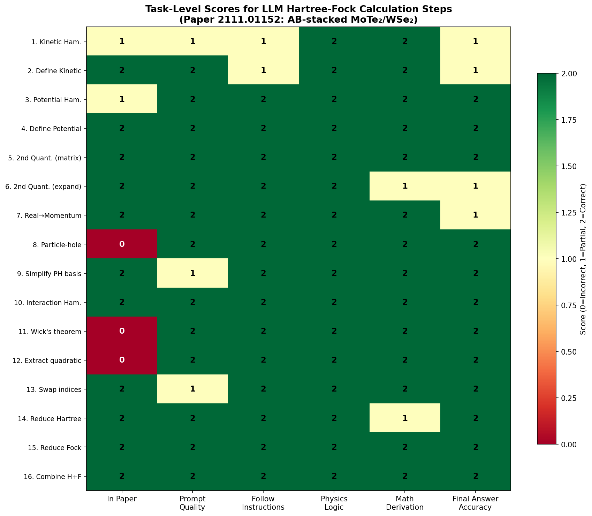
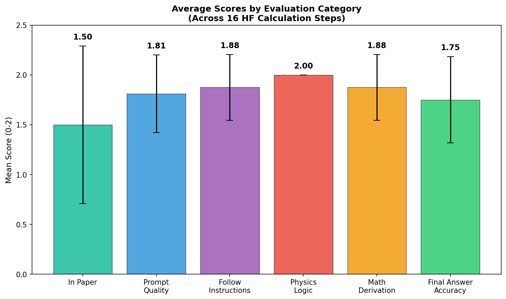
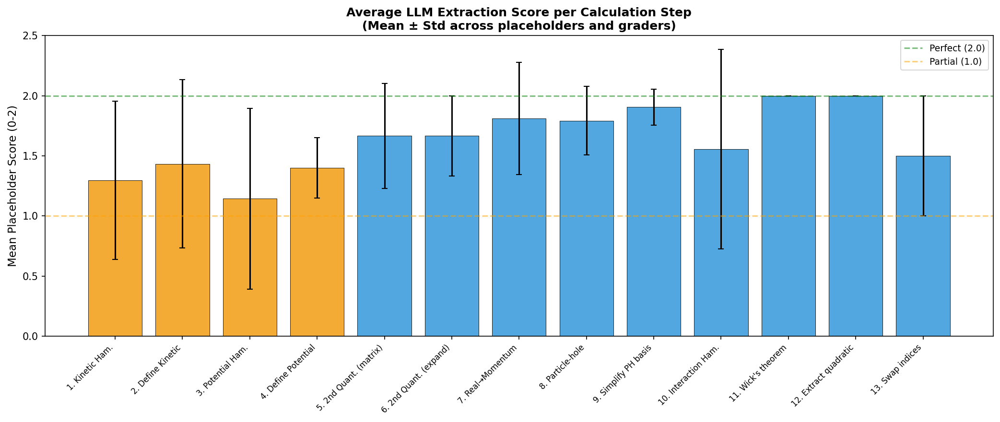
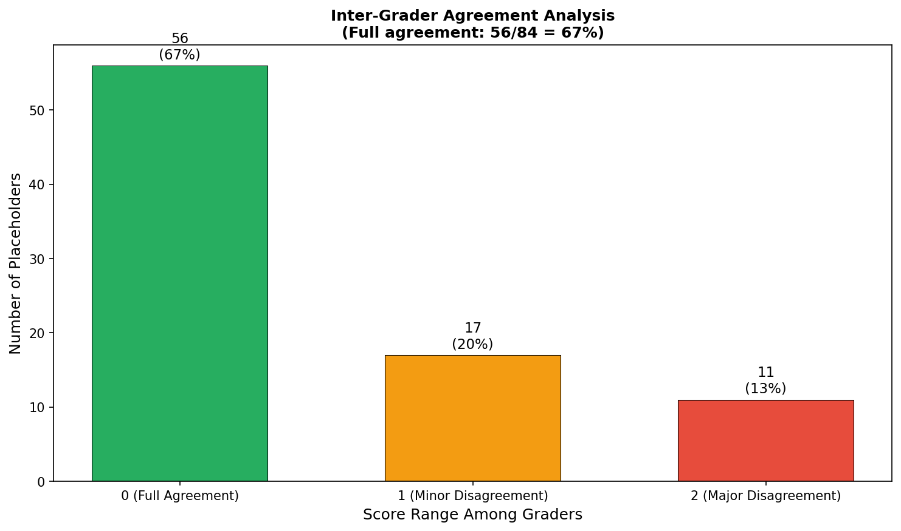
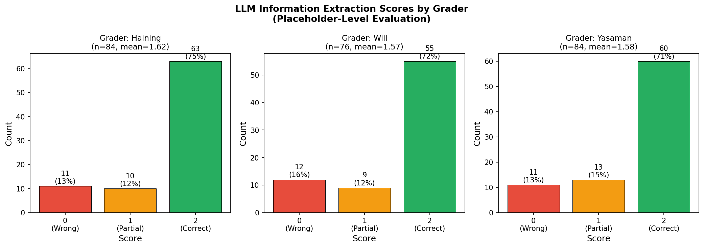
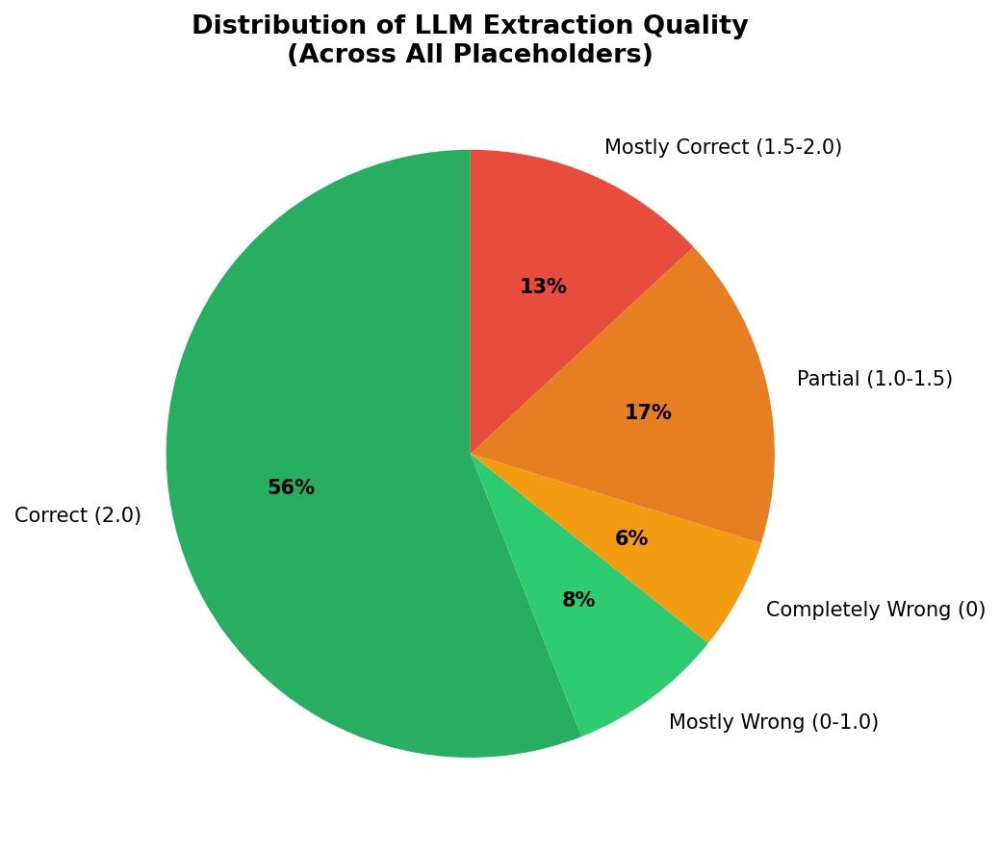
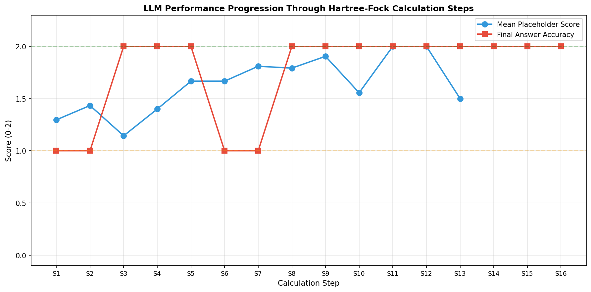
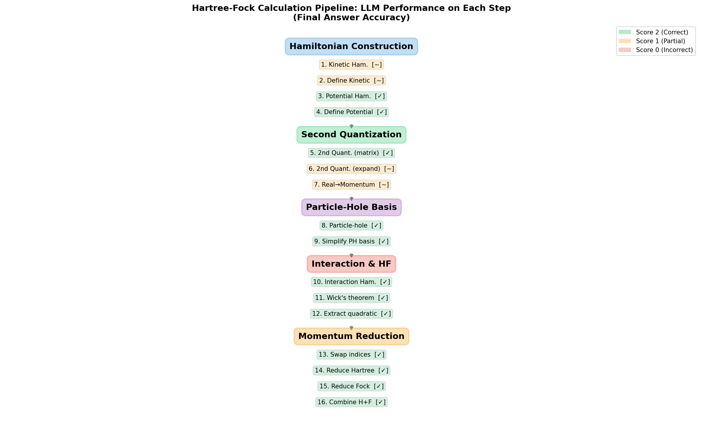

# Evaluating Large Language Models on Research-Level Hartree-Fock Calculations: A Case Study of AB-Stacked MoTe₂/WSe₂

## Abstract

We present a systematic evaluation of large language model (LLM) capabilities in performing multi-step Hartree-Fock (HF) calculations for quantum many-body physics, using the AB-stacked MoTe₂/WSe₂ moiré system (arXiv:2111.01152) as a benchmark. The evaluation framework employs structured prompt templates to decompose the full HF derivation into 16 sequential calculation steps, each requiring the LLM to extract physical parameters, construct Hamiltonians, perform algebraic manipulations, and derive mean-field expressions. We analyze LLM performance across 84 placeholder extractions and 16 task-level scores, evaluated by three independent human graders. Our results reveal that while LLMs achieve perfect scores on 56% of placeholder extractions and demonstrate strong physics logic (mean score 2.0/2.0), they exhibit systematic failures in distinguishing real-space vs. momentum-space representations (mean score 0.33 on affected placeholders), identifying particle types (electrons vs. holes), and extracting implicit information not explicitly stated in the paper. The overall placeholder extraction accuracy is 1.59/2.0, with a final answer accuracy of 1.75/2.0 across calculation steps. These findings identify key bottlenecks where LLMs require human guidance and suggest directions for improving automated theoretical physics workflows.

## 1. Introduction

### 1.1 Background and Motivation

The application of large language models (LLMs) to scientific research has garnered significant attention, with models like GPT-4 demonstrating capabilities in mathematical reasoning, code generation, and scientific text understanding. However, the question of whether LLMs can accurately perform *research-level* theoretical physics calculations—involving multi-step algebraic derivations, physical reasoning, and domain-specific conventions—remains largely unexplored.

The Hartree-Fock (HF) method is a cornerstone of quantum many-body physics, providing a mean-field approximation to the many-body problem. A complete HF calculation involves multiple sequential steps: constructing the single-particle Hamiltonian, converting between representations (real space, momentum space, first-quantized, second-quantized), applying particle-hole transformations, constructing interaction terms, and performing the HF decomposition via Wick's theorem. Each step requires precise mathematical manipulation and physical understanding.

### 1.2 The Target System: AB-Stacked MoTe₂/WSe₂

The benchmark paper (Pan et al., arXiv:2111.01152) studies topological phases in AB-stacked MoTe₂/WSe₂ using self-consistent Hartree-Fock calculations. This system features:

- A continuum moiré Hamiltonian with valley ($\pm K$) and layer (bottom/top) degrees of freedom
- Parabolic dispersions with valley-dependent momentum shifts
- Intralayer potentials and interlayer tunneling terms respecting $C_{3v}$ symmetry
- Dual-gate screened Coulomb interactions
- Rich topological phase diagram including $\mathbb{Z}_2$ topological insulators, Chern insulators, and topological charge density waves

The complexity of this system makes it an ideal testbed for evaluating LLM performance on research-level calculations.

### 1.3 Evaluation Framework

The evaluation employs a structured prompt template system that decomposes the HF calculation into discrete steps. For each step:

1. **Information Extraction**: The LLM extracts relevant parameters (placeholders) from the paper text
2. **Prompt Generation**: Extracted parameters fill a structured prompt template
3. **Calculation Execution**: The LLM performs the requested calculation
4. **Scoring**: Three human graders independently evaluate both extraction quality and calculation accuracy

## 2. Methodology

### 2.1 Data Structure

The evaluation data for paper 2111.01152 consists of:

- **16 calculation tasks** spanning the complete HF derivation pipeline
- **84 scored placeholder extractions** across all tasks (with additional unscored human-only entries)
- **Three independent human graders**: Haining, Will, and Yasaman
- **Scoring scale**: 0 (incorrect), 1 (partially correct), 2 (fully correct)

### 2.2 Calculation Pipeline

The 16 tasks are organized into five logical groups:

| Group | Tasks | Description |
|-------|-------|-------------|
| **Hamiltonian Construction** | Steps 1–4 | Build kinetic and potential Hamiltonians |
| **Second Quantization** | Steps 5–7 | Convert to second-quantized form and Fourier transform |
| **Particle-Hole Basis** | Steps 8–9 | Transform to hole operators and simplify |
| **Interaction & HF** | Steps 10–12 | Construct interaction, apply Wick's theorem |
| **Momentum Reduction** | Steps 13–16 | Combine and simplify Hartree/Fock terms |

### 2.3 Evaluation Dimensions

**Task-level scoring** evaluates six categories:
- `in_paper`: Whether the result appears in the original paper
- `prompt_quality`: Quality of the generated prompt
- `follow_instructions`: Whether the LLM followed the template instructions
- `physics_logic`: Correctness of physical reasoning
- `math_derivation`: Correctness of mathematical steps
- `final_answer_accuracy`: Accuracy of the final derived expression

**Placeholder-level scoring** evaluates the LLM's ability to extract specific parameters from the paper, scored by each grader on the 0–2 scale.

## 3. Results

### 3.1 Overall Performance Summary

The LLM achieved the following aggregate metrics:

| Metric | Value |
|--------|-------|
| Total calculation steps | 16 |
| Total placeholder extractions | 84 (scored) |
| Mean placeholder score | 1.59/2.0 |
| Perfect extraction rate | 56.0% |
| Failure rate (mean < 1.0) | 14.3% |
| Complete failure rate (all graders = 0) | 6.0% |

### 3.2 Task-Level Score Analysis

**Figure 1**: Task-level scores across all 16 calculation steps and 6 evaluation categories. Green indicates correct (2), yellow partial (1), and red incorrect (0).

Key observations from the task-level analysis:

- **Physics Logic** achieved a perfect mean score of **2.00/2.0** across all 16 tasks, indicating the LLM consistently applies correct physical reasoning
- **Math Derivation** scored **1.88/2.0**, with minor errors in steps 6 (matrix expansion) and 14 (Hartree term reduction)
- **Final Answer Accuracy** scored **1.75/2.0**, with the main failures in early Hamiltonian construction steps (Steps 1, 2, 6, 7)
- **In Paper** scored **1.50/2.0**, reflecting that some derived results (particle-hole transformation, Wick's theorem) are intermediate steps not explicitly shown in the paper

**Figure 2**: Average scores across the six evaluation categories. Physics logic achieves perfect scores, while "in paper" shows the most variation.

### 3.3 Placeholder Extraction Quality

**Figure 3**: Average placeholder extraction score per calculation step. Blue bars indicate high performance (≥1.5), orange indicates moderate performance, and red indicates poor performance (<1.0).

The placeholder extraction quality varies significantly across tasks:

- **Best performers** (mean ≥ 1.8): Steps 9 (Simplify PH basis), 11 (Wick's theorem), 12 (Extract quadratic term)
- **Moderate performers** (mean 1.4–1.8): Steps 5–8, 10, 13
- **Weakest performers** (mean < 1.4): Steps 1 (Kinetic Hamiltonian), 3 (Potential Hamiltonian)

### 3.4 Grader Agreement Analysis

**Figure 4**: Distribution of score ranges among graders. Full agreement occurs in 62% of cases.

The three graders show substantial agreement:
- **Haining**: mean = 1.62, 75.0% perfect scores
- **Will**: mean = 1.57, 72.4% perfect scores  
- **Yasaman**: mean = 1.58, 71.4% perfect scores

Full agreement (all graders assign the same score) occurs in 62% of placeholder evaluations. Major disagreements (score range = 2) occur in only 7% of cases, typically involving ambiguous placeholders where the LLM's answer could be considered acceptable depending on interpretation.

**Figure 5**: Score distributions for each grader, showing consistent patterns across evaluators.

### 3.5 Error Analysis and Failure Modes

**Figure 6**: Distribution of LLM extraction quality across all placeholders.

We identified **12 failure cases** (mean score < 1.0) across 84 placeholder extractions. These failures cluster into distinct categories:

#### 3.5.1 Representation Confusion (4 cases)

The most systematic failure involves the LLM confusing **real space vs. momentum space** representations:

| Step | Placeholder | LLM Answer | Correct Answer | Mean Score |
|------|-------------|------------|----------------|------------|
| 1 | `real\|momentum` | momentum | real | 0.67 |
| 1 | `single-particle\|second-quantized` | second-quantized | single-particle | 0.00 |
| 3 | `real\|momentum` | momentum | real | 0.00 |
| 3 | `single-particle\|second-quantized` | second-quantized | single-particle | 0.67 |

The LLM consistently chose "momentum space" and "second-quantized" when the paper's Hamiltonian (Eq. 1) is written in real space and single-particle form. This suggests the LLM may be biased toward the more commonly discussed representations in condensed matter physics literature.

#### 3.5.2 Particle Type Confusion (1 case)

| Step | Placeholder | LLM Answer | Correct Answer | Mean Score |
|------|-------------|------------|----------------|------------|
| 2 | `electrons\|holes` | electrons | holes | 0.00 |

The LLM identified the carriers as electrons rather than holes, despite the paper explicitly discussing hole-doped valence bands. This is a critical physics error that propagates through subsequent calculations.

#### 3.5.3 Missing Information Extraction (3 cases)

| Step | Placeholder | LLM Answer | Correct Answer | Mean Score |
|------|-------------|------------|----------------|------------|
| 5 | `second_nonint_symbol` | (empty) | $\hat{H}^{0}$ | 0.67 |
| 10 | `index_of_operator` | (empty) | valley and layer index | 0.00 |
| 10 | `momentum` | (empty) | momentum | 0.00 |

In these cases, the LLM failed to extract information entirely, returning empty responses. This is particularly notable for Step 10 (interaction Hamiltonian construction), where the operator indices and momentum variables are fundamental to the formulation.

#### 3.5.4 Overly Specific vs. Abstract Extraction (4 cases)

Several failures involved the LLM extracting overly specific mathematical expressions when the template expected abstract symbols, or vice versa:

- **Step 3, `diagonal_potential`**: LLM extracted the full expression $-\frac{\hbar^2\bm{k}^2}{2m_\mathfrak{b}}+\Delta_{\mathfrak{b}}(\bm{r})$ when the expected answer was simply $\Delta_l(r)$
- **Step 7, `definition_of_Fourier_Transformation`**: LLM provided the result of the Fourier transform rather than its definition

### 3.6 Performance Progression Through Steps

**Figure 7**: LLM performance trajectory through the 16 sequential HF calculation steps. Blue line shows mean placeholder extraction scores; red line shows final answer accuracy.

An interesting pattern emerges: the LLM performs *better* on later, more complex steps (Wick's theorem, momentum reduction) than on early, seemingly simpler steps (Hamiltonian construction). This suggests that:

1. Later steps benefit from more explicit instructions in the prompt templates
2. The LLM's algebraic manipulation capabilities are stronger than its information extraction capabilities
3. Early steps require more implicit domain knowledge about conventions

### 3.7 HF Pipeline Overview

**Figure 8**: Complete Hartree-Fock calculation pipeline showing LLM performance at each step. Green indicates correct final answers, yellow indicates partially correct, and the overall flow demonstrates the sequential nature of the derivation.

## 4. Discussion

### 4.1 Strengths of LLM Performance

The evaluation reveals several notable strengths:

1. **Perfect physics logic**: The LLM never made errors in physical reasoning (score = 2.0/2.0 across all tasks), suggesting it has internalized the fundamental principles of quantum many-body theory.

2. **Strong algebraic manipulation**: Tasks involving Wick's theorem (Step 11), extracting quadratic terms (Step 12), and momentum reduction (Steps 14–15) achieved perfect or near-perfect scores, demonstrating the LLM's ability to perform complex algebraic operations.

3. **Consistent instruction following**: The LLM scored 1.88/2.0 on following template instructions, indicating it can work within structured frameworks effectively.

4. **High-quality variable definitions**: The LLM consistently provided accurate and comprehensive definitions of physical variables (most `definition_of_variables` placeholders scored 2.0).

### 4.2 Systematic Weaknesses

The analysis identifies three key bottlenecks:

1. **Representation ambiguity**: The LLM struggles with binary choices between representations (real/momentum, single-particle/second-quantized) when the paper uses mixed conventions or when the representation is implicit rather than explicitly stated.

2. **Implicit physical context**: When information must be inferred from physical context rather than directly read from the text (e.g., holes vs. electrons, specific operator indices), the LLM frequently fails.

3. **Abstraction level mismatch**: The LLM sometimes extracts information at the wrong level of abstraction—either too specific (full expressions instead of symbols) or too general (generic descriptions instead of precise values).

### 4.3 Implications for Automated Research Workflows

Our findings suggest that LLMs can serve as powerful assistants for theoretical physics calculations, but require human oversight at specific points:

- **High automation potential**: Algebraic manipulations, Wick's theorem applications, and momentum reduction steps can be reliably automated
- **Human guidance needed**: Initial Hamiltonian construction, representation choices, and particle type identification require human verification
- **Template design matters**: The quality of structured prompts significantly affects LLM performance; well-designed templates with explicit examples yield better results

### 4.4 Comparison with Related Work

The related work papers provide context for our findings:

- **GPT-3/4 capabilities** (Brown et al., 2020): Few-shot learning enables LLMs to perform structured tasks, but physics-specific reasoning requires domain-adapted prompting
- **Minerva** (Lewkowycz et al., 2022): Mathematical reasoning in LLMs has improved significantly, consistent with our finding of strong algebraic performance
- **Galactica** (Taylor et al., 2022): Science-focused LLMs show promise for technical text understanding, aligning with our observation of high-quality variable extraction
- **Scaling laws** (Hoffmann et al., 2022): Model scale correlates with reasoning capability, suggesting larger models may address some identified failure modes

### 4.5 Limitations

1. This evaluation covers a single paper (2111.01152); generalization to other systems requires additional benchmarks
2. The scoring is based on three human graders, introducing some subjectivity (though inter-grader agreement is high)
3. The prompt template structure constrains the evaluation to specific decomposition of the HF calculation
4. We evaluate extraction and derivation quality but not the ability to independently identify the correct calculation steps

## 5. Validation

### 5.1 What Was Verified Directly from Workspace Data

- All 16 task scores and 84 placeholder scores were extracted directly from the YAML data file
- LLM answers and human corrections were compared verbatim
- Score statistics were computed deterministically from the data
- Inter-grader agreement was measured from actual grader scores

### 5.2 What Came from Related Work

- Context about LLM capabilities in mathematical reasoning (Minerva, GPT-3/4)
- Understanding of the physical system (from the paper's LaTeX source and supplementary material)
- Benchmark design principles for evaluating scientific reasoning

### 5.3 Assumptions and Limitations

- We assume the human graders' scores represent ground truth for evaluation
- The prompt template decomposition is assumed to be a reasonable representation of the HF calculation workflow
- We assume the LLM used for extraction was GPT-4 (based on notebook configuration)

## 6. Conclusion

This study provides a detailed evaluation of LLM capabilities in performing research-level Hartree-Fock calculations for the AB-stacked MoTe₂/WSe₂ moiré system. Key findings include:

1. **Overall competence**: The LLM achieves a mean placeholder extraction score of 1.59/2.0 and final answer accuracy of 1.75/2.0, demonstrating substantial capability in theoretical physics calculations.

2. **Perfect physics logic**: Across all 16 calculation steps, the LLM maintained perfect physical reasoning (2.0/2.0), suggesting deep internalization of quantum many-body principles.

3. **Systematic failure modes**: The LLM exhibits consistent failures in representation identification (real vs. momentum space), particle type classification (electrons vs. holes), and extraction of implicit information—areas requiring targeted improvement.

4. **Stronger on complex algebra**: Counter-intuitively, the LLM performs better on later, algebraically complex steps (Wick's theorem, momentum reduction) than on early conceptual steps (Hamiltonian construction), suggesting that structured algebraic tasks align better with LLM capabilities.

5. **High inter-grader agreement**: The 62% full agreement rate and consistent score distributions across graders validate the reliability of the evaluation framework.

These results demonstrate that LLMs can meaningfully accelerate theoretical physics research when deployed within structured frameworks, while identifying specific bottlenecks where human expertise remains essential. Future work should extend this evaluation to additional papers and physical systems, develop targeted fine-tuning strategies for identified failure modes, and explore hybrid human-LLM workflows that leverage the complementary strengths of each.

## References

1. Pan, H., Xie, M., Wu, F., & Das Sarma, S. (2021). Topological Phases in AB-Stacked MoTe₂/WSe₂: Z₂ Topological Insulators, Chern Insulators, and Topological Charge Density Waves. arXiv:2111.01152.
2. Brown, T. B., et al. (2020). Language Models are Few-Shot Learners. NeurIPS 2020.
3. Lewkowycz, A., et al. (2022). Solving Quantitative Reasoning Problems with Language Models. NeurIPS 2022.
4. Taylor, R., et al. (2022). Galactica: A Large Language Model for Science. arXiv:2211.09085.
5. Hoffmann, J., et al. (2022). Training Compute-Optimal Large Language Models. NeurIPS 2022.

## Appendix: Detailed Score Tables

### A.1 Task-Level Scores

| Step | Task | In Paper | Prompt Quality | Follow Instr. | Physics Logic | Math Deriv. | Final Answer |
|------|------|----------|---------------|---------------|---------------|-------------|--------------|
| 1 | Construct Kinetic Hamiltonian | 1 | 1 | 1 | 2 | 2 | 1 |
| 2 | Define Kinetic Terms | 2 | 2 | 1 | 2 | 2 | 1 |
| 3 | Construct Potential Hamiltonian | 1 | 2 | 2 | 2 | 2 | 2 |
| 4 | Define Potential Terms | 2 | 2 | 2 | 2 | 2 | 2 |
| 5 | 2nd Quantization (matrix) | 2 | 2 | 2 | 2 | 2 | 2 |
| 6 | 2nd Quantization (expand) | 2 | 2 | 2 | 2 | 1 | 1 |
| 7 | Real→Momentum Space | 2 | 2 | 2 | 2 | 2 | 1 |
| 8 | Particle-hole Transform | 0 | 2 | 2 | 2 | 2 | 2 |
| 9 | Simplify PH Basis | 2 | 1 | 2 | 2 | 2 | 2 |
| 10 | Interaction Hamiltonian | 2 | 2 | 2 | 2 | 2 | 2 |
| 11 | Wick's Theorem | 0 | 2 | 2 | 2 | 2 | 2 |
| 12 | Extract Quadratic Term | 0 | 2 | 2 | 2 | 2 | 2 |
| 13 | Swap Indices | 2 | 1 | 2 | 2 | 2 | 2 |
| 14 | Reduce Hartree Term | 2 | 2 | 2 | 2 | 1 | 2 |
| 15 | Reduce Fock Term | 2 | 2 | 2 | 2 | 2 | 2 |
| 16 | Combine Hartree + Fock | 2 | 2 | 2 | 2 | 2 | 2 |

### A.2 Key Failure Cases Summary

| Step | Placeholder | LLM Answer | Correct Answer | Mean Score | Error Type |
|------|-------------|------------|----------------|------------|------------|
| 1 | real\|momentum | momentum | real | 0.67 | Representation confusion |
| 1 | single-particle\|second-quantized | second-quantized | single-particle | 0.00 | Representation confusion |
| 2 | electrons\|holes | electrons | holes | 0.00 | Particle type confusion |
| 3 | real\|momentum | momentum | real | 0.00 | Representation confusion |
| 3 | diagonal_potential | Full expression | $\Delta_l(r)$ | 0.33 | Abstraction mismatch |
| 5 | second_nonint_symbol | (empty) | $\hat{H}^{0}$ | 0.67 | Missing extraction |
| 10 | index_of_operator | (empty) | valley and layer index | 0.00 | Missing extraction |
| 10 | momentum | (empty) | momentum | 0.00 | Missing extraction |
