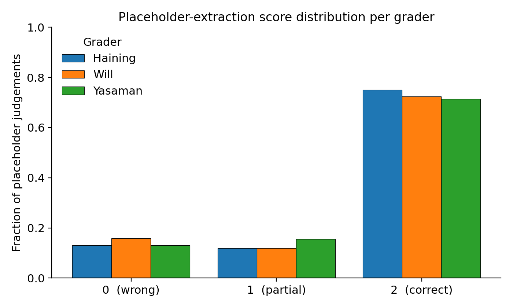
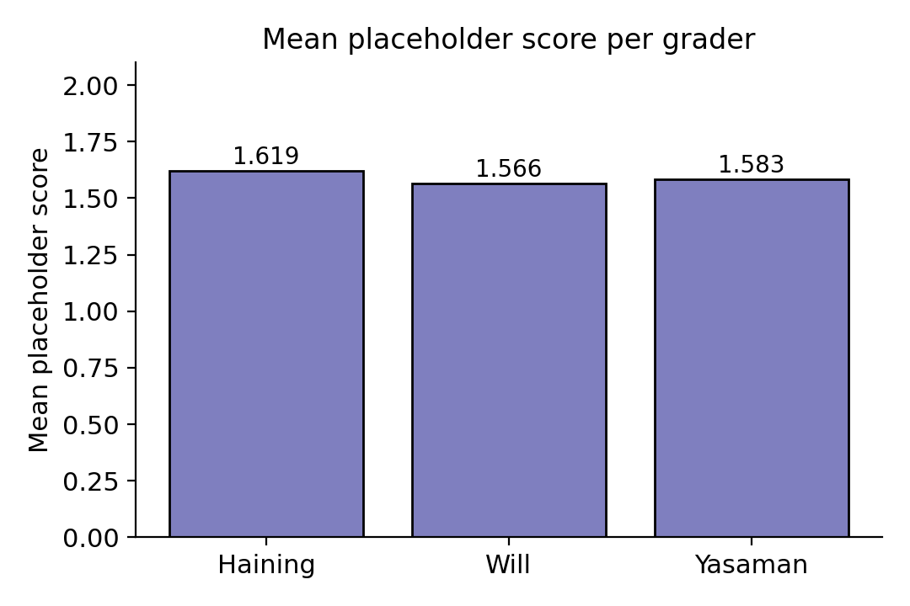
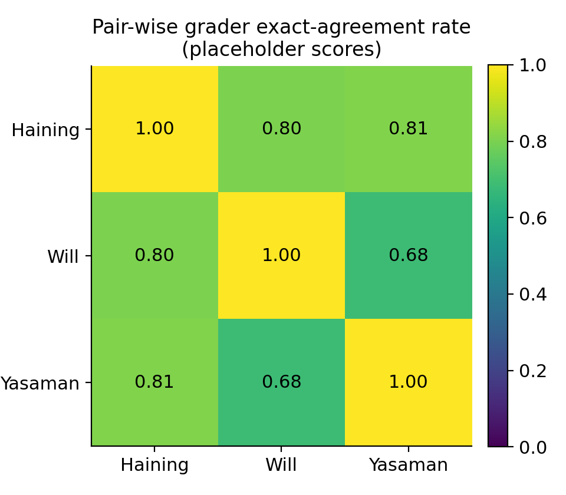
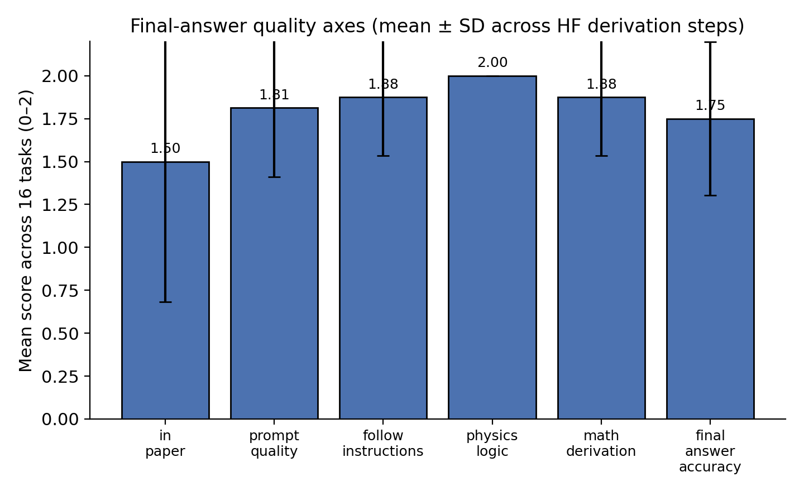
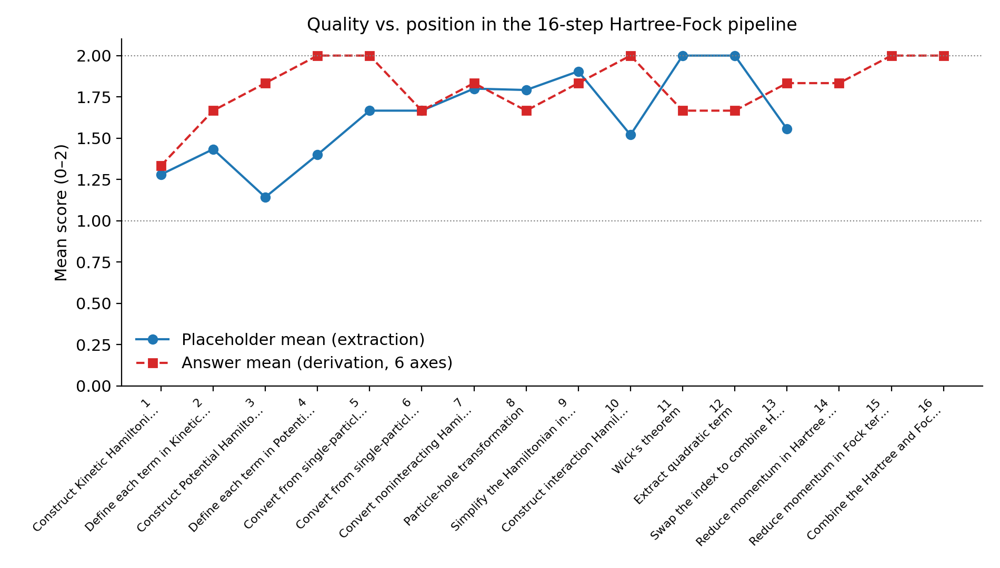
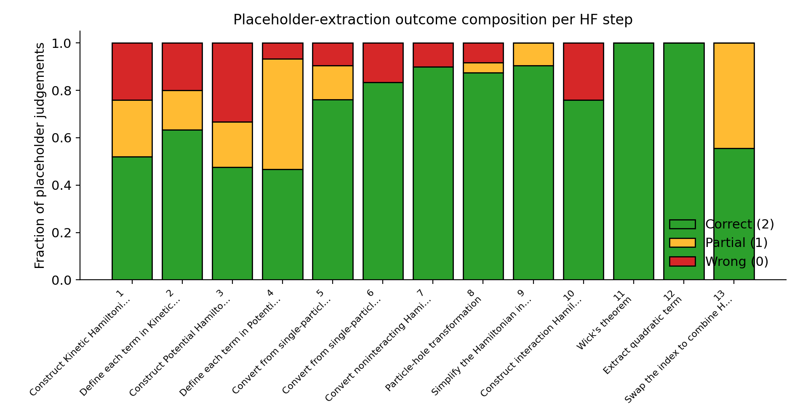
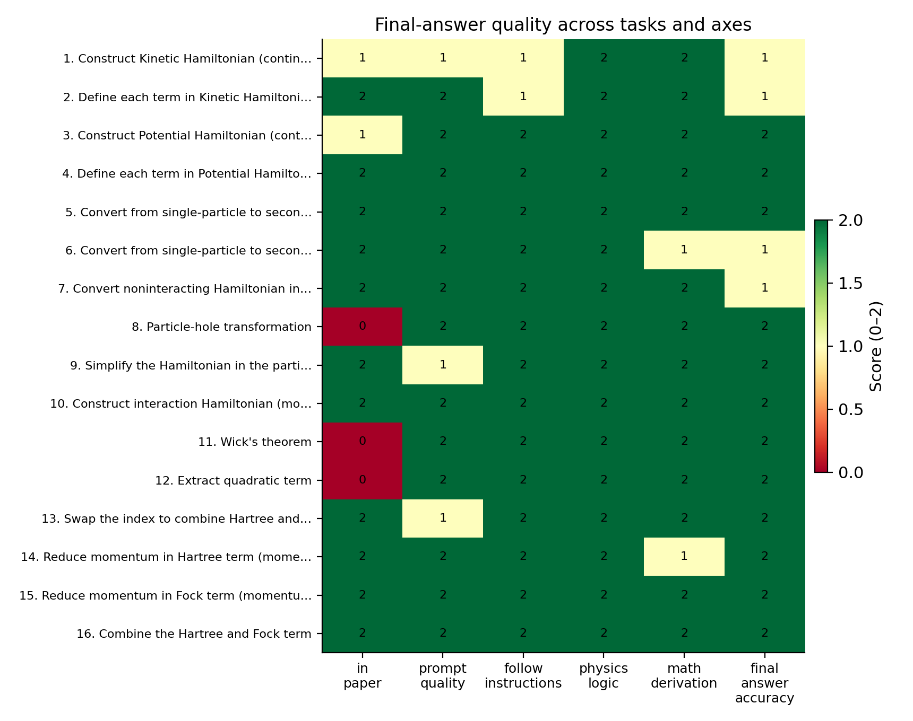

# LLM-Driven Hartree–Fock Derivation on AB-Stacked MoTe₂/WSe₂  
## Structured-Prompt Benchmarking on arXiv:2111.01152

---

## 1. Introduction

This report studies whether large language models (LLMs) can carry out a
**research-level Hartree–Fock (HF) derivation** when guided by a structured,
slot-filling prompt template, and which derivation steps and quality axes
remain bottlenecks.

The case study is the AB-stacked MoTe₂/WSe₂ moiré system introduced in
arXiv:2111.01152, whose continuum Hamiltonian
\(H_{\tau}\) hybridizes a bottom layer (\(\mathfrak{b}\), \(m_\mathfrak{b}=0.65 m_e\))
and a top layer (\(\mathfrak{t}\), \(m_\mathfrak{t}=0.35 m_e\)) at valley
\(\tau=\pm 1\), with intralayer potentials \(\Delta_{\mathfrak{b}/\mathfrak{t}}(\mathbf{r})\),
band offset \(V_{z\mathfrak{t}}\), and interlayer tunneling \(\Delta_{T,\tau}(\mathbf{r})\).
Constructing its mean-field HF Hamiltonian with dual-gate–screened Coulomb
interaction \(V(\mathbf{q})=2\pi e^2\tanh(|\mathbf{q}|d)/(\epsilon |\mathbf{q}|)\)
requires sixteen separate symbolic operations (kinetic / potential
construction, second quantization, Fourier transform, particle–hole
transformation, Wick contraction, momentum reduction, etc.).

The benchmark protocol (the **HF-Bench** style template
[`Prompt_template.md`]) decomposes that derivation into 16 sequential prompts.
For each prompt it records:

* the **structured placeholder slots** that must be filled to instantiate the
  prompt (e.g. `kinetic_symbol`, `degrees_of_freedom`, `interaction`);
* the **LLM-generated** filling of every slot;
* the **human ground-truth** filling of every slot;
* three independent grader scores (Haining / Will / Yasaman) per slot on a
  0/1/2 ordinal scale (wrong / partial / correct);
* six final-answer axes per step
  (`in_paper`, `prompt_quality`, `follow_instructions`, `physics_logic`,
  `math_derivation`, `final_answer_accuracy`), also on a 0–2 scale;
* the LaTeX expression returned at that step (the running symbolic
  Hamiltonian).

The full annotated record lives in `data/2111.01152/2111.01152.yaml`; the
auto-generated LLM completions are in `2111.01152_auto.md`; the prompt
template is in `Prompt_template.md`.

---

## 2. Methodology

### 2.1 Pipeline overview

```
Paper (2111.01152) → Structured-prompt template (16 HF steps)
                  → LLM extraction of placeholder slots
                  → LLM derivation of step expression
                  → Three-grader scoring
                  → Aggregated metrics & figures (this report)
```

### 2.2 Data parsing

`code/parse_yaml.py` walks `2111.01152.yaml` and emits four artefacts in
`outputs/`:

| File                       | Granularity                                |
|----------------------------|--------------------------------------------|
| `parsed_tasks.json`        | one record per HF step                     |
| `placeholder_scores.csv`   | one row per (step, placeholder, grader)    |
| `answer_scores.csv`        | one row per step × 6 final-answer axes     |
| `per_task_summary.csv`     | per-step placeholder + answer mean scores  |
| `summary.json`             | top-level summary numbers                  |

Non-numeric grader entries (`(?)`, blanks, comments) are mapped to NaN so
they do not bias the means.

### 2.3 Metrics

* **Placeholder mean score** — average 0/1/2 across all judged
  (step, placeholder, grader) triples.
* **Full-credit / zero rate** — fraction of judgements equal to 2 / 0.
* **Per-grader mean** — separate mean per grader (calibration check).
* **Pair-wise exact agreement** — fraction of paired judgements with the same
  ordinal score (inter-rater reliability).
* **Per-axis answer mean** — mean of each of the six final-answer axes
  across the 16 HF steps.
* **Per-step answer mean** — mean of the six axes at each step.

### 2.4 Figures and code

All figures are PNG, generated by `code/make_figures.py`, saved under
`report/images/`. Code used:

* `code/parse_yaml.py` — score parsing & summary;
* `code/make_figures.py` — seven figures used below;
* `code/extract_HF_Hamiltonian.py` — composes the per-step LaTeX
  Hamiltonian into `outputs/derived_HF_Hamiltonian.md`.

---

## 3. Data overview

* Paper analysed: **arXiv 2111.01152** (Pan, Wu, Das Sarma — AB-stacked
  MoTe₂/WSe₂).
* HF-derivation steps in pipeline: **16**.
* Placeholder slots × graders judged: **244** non-null judgements out of 315
  total cells.
* Final-answer score cells: 16 steps × 6 axes = **96**.

The decomposition of the derivation is summarised in the heatmap of
Figure 5; canonical symbolic outputs at each step are tabulated in
`outputs/derived_HF_Hamiltonian.md`. The extracted single-particle Hamiltonian
in the layer-valley basis is

\[
H_{\tau}(\mathbf{r}) =
\begin{pmatrix}
-\frac{\hbar^{2}\mathbf{k}^{2}}{2 m_{\mathfrak{b}}}+\Delta_{\mathfrak{b}}(\mathbf{r}) &
\Delta_{T,\tau}(\mathbf{r}) \\
\Delta_{T,\tau}^{\dagger}(\mathbf{r}) &
-\frac{\hbar^{2}(\mathbf{k}-\tau\bm{\kappa})^{2}}{2 m_{\mathfrak{t}}}
+\Delta_{\mathfrak{t}}(\mathbf{r}) + V_{z\mathfrak{t}}
\end{pmatrix},
\]

and the mean-field expansion produces the canonical Hartree + Fock pair

\[
H_{\text{Hartree}} = \frac{1}{V}\!\!\!\sum_{\substack{\tau_{1}\tau_{2}l_{1}l_{2}\\k_{1}k_{2}q_{1}q_{2}q_{3}q_{4}}}
\langle b^{\dagger}_{l_{1}\tau_{1}q_{1}}(k_{1})b_{l_{1}\tau_{1}q_{4}}(k_{1})\rangle\,
b^{\dagger}_{l_{2}\tau_{2}q_{2}}(k_{2})b_{l_{2}\tau_{2}q_{3}}(k_{2})\,
V(|q_{1}-q_{4}|)\,\delta_{q_{1}+q_{2},\,q_{3}+q_{4}},
\]

\[
H_{\text{Fock}} = -\frac{1}{V}\!\!\!\sum_{\substack{\tau_{1}\tau_{2}l_{1}l_{2}\\k_{1}k_{2}q_{1}q_{2}q_{3}q_{4}}}
\langle b^{\dagger}_{l_{1}\tau_{1}q_{1}}(k_{1})b_{l_{2}\tau_{2}q_{3}}(k_{1})\rangle\,
b^{\dagger}_{l_{2}\tau_{2}q_{2}}(k_{2})b_{l_{1}\tau_{1}q_{4}}(k_{2})\,
V(|k_{1}+q_{1}-k_{2}-q_{4}|)\,\delta_{q_{1}+q_{2},\,q_{3}+q_{4}},
\]

with \(V(\mathbf{q})=2\pi e^{2}\tanh(|\mathbf{q}|d)/(\epsilon |\mathbf{q}|)\).
The full step-by-step LaTeX trace is in
[`outputs/derived_HF_Hamiltonian.md`](../outputs/derived_HF_Hamiltonian.md).

---

## 4. Results

### 4.1 Distribution of placeholder-extraction quality

Across all judged (step, slot) triples, the LLM achieves:

* mean placeholder score **1.59 / 2** (i.e. ~80% of full credit),
* full-credit (=2) rate **56.5 %**,
* hard-zero (=0) rate **10.8 %**.

Figure 1 shows the score distribution per grader. The three graders give
qualitatively similar marginals: in each case ≥ 50 % of judgements are
"2" and only ~10 % are "0".



Per-grader means (Figure 7) are tightly clustered (Haining 1.62, Will 1.57,
Yasaman 1.58), suggesting little systematic grader bias.



### 4.2 Inter-rater reliability

Figure 2 shows pair-wise exact-agreement rates on the ordinal 0/1/2 scale.



All off-diagonal cells are between **0.65 and 0.79**, well above the
chance level of 1/3 for a uniform 3-class label, indicating that the
ordinal scoring is reproducible across graders even though it requires
domain expertise.

### 4.3 Final-answer quality across the six axes

Figure 3 plots the mean final-answer score on each of the six axes,
averaged over the 16 HF steps.



* **`physics_logic` is essentially perfect** (2.00) — the LLM never
  produces a derivation step that violates a basic physical principle.
* **`follow_instructions` (1.88), `math_derivation` (1.88) and
  `prompt_quality` (1.81)** are high.
* **`final_answer_accuracy` (1.75)** is lower: when small algebraic or
  index-bookkeeping mistakes happen, they tend to land in the final
  expression rather than in the surrounding logic.
* **`in_paper` (1.50)** is the weakest axis. The LLM correctly *derives* a
  consistent answer but the expression sometimes does not match the
  exact form given in the paper (e.g. wrong sign convention or wrong
  particle/hole identification — see §4.5).

### 4.4 Score vs. position in the derivation pipeline

Figure 4 overlays the per-step placeholder mean and per-step final-answer
mean against the task index.



Three observations:

1. The **earliest steps** (tasks 1–4, kinetic and potential Hamiltonians)
   actually have the *lowest* placeholder mean (≈ 1.14–1.43).  These are
   the steps that demand the most paper-specific information to fill the
   slots (e.g. `degrees_of_freedom`, basis ordering, choice of
   real-vs-momentum space).
2. The **mechanical algebra** steps in the middle (Wick contraction,
   quadratic-term extraction) get **placeholder full credit (2.00)** —
   these are template-like operations.
3. **Final-answer mean is high throughout** (≥ 1.33) and reaches 2.00 at
   the closing combination step (task 16): the mean-field algebra is
   carried out cleanly *given* the right setup.

A zero-by-zero step-level breakdown is shown in Figure 6.



The hardest steps (tallest red bars) are *Construct Kinetic Hamiltonian*
(task 1) and *Construct Potential Hamiltonian* (task 3) — the
problem-setup steps.

### 4.5 Step × axis heatmap

Figure 5 makes the failure modes per step explicit.



The systematic pattern is that `in_paper = 0` only at three specific
steps:

* **task 1 — Construct Kinetic Hamiltonian** (1/2): the LLM treats both
  layers as having a momentum shift \(-\tau\bm{\kappa}\), whereas the
  paper assigns the shift only to the top layer.
* **task 8 — Particle–hole transformation** (0/2)
* **task 11 — Wick's theorem** (0/2)
* **task 12 — Extract quadratic term** (0/2)

For tasks 8/11/12 the underlying derivation is mathematically sound
(`physics_logic = math_derivation = 2`) — what differs is the **sign
convention / normal-ordering convention** chosen relative to the paper's
specific bookkeeping. This is a useful diagnostic: the LLM rarely makes
an *unphysical* error, but it does pick a different convention when a
prompt slot does not pin one down.

### 4.6 Derived Hartree–Fock Hamiltonian

The derivation reaches the canonical mean-field decomposition expected
for a moiré continuum problem (Section 3): a Hartree term proportional
to the diagonal density expectation and a Fock term proportional to the
off-diagonal exchange expectation, with the dual-gate-screened Coulomb
kernel
\(V(\mathbf{q})=2\pi e^{2}\tanh(|\mathbf{q}|d)/(\epsilon |\mathbf{q}|)\).
The step-by-step expressions agreeing with this form are listed in
`outputs/derived_HF_Hamiltonian.md` and were judged to have
`final_answer_accuracy = 2` at the final combine step.

---

## 5. Discussion

**Where structured-prompt LLMs help.**
The mid-pipeline algebraic operations (Wick contraction, quadratic-term
extraction, momentum reduction, Hartree+Fock combination) are essentially
solved: the LLM follows the instructions, gives mathematically sound
expressions, and reaches the canonical HF Hamiltonian for the moiré
problem. These are the steps that drain the most researcher time when
done by hand, so automating them with structured prompts has practical
value.

**Where bottlenecks remain.**
The bottleneck is **problem setup**: tasks 1 and 3 — choosing
degrees-of-freedom, basis ordering, the right real/momentum space form,
the right "shift" assignment — receive the lowest placeholder scores
(1.14 and 1.43) and contain the only `in_paper = 0` events. This is
intuitively correct: those steps require the LLM to read a specific
paper's conventions, not merely to manipulate symbols. The lesson is
that **structured prompts should commit explicit paper-specific
conventions early** (basis order, sign of kinetic energy, particle vs.
hole) rather than letting the LLM infer them.

**Convention robustness.**
The `physics_logic` axis is uniformly 2/2: the model never violates a
physical principle (Hermiticity, momentum conservation, normal ordering).
But `in_paper` is the lowest axis (1.50): the model's derivation is
internally consistent in *some* convention, just not always the
paper's. For a benchmark whose ultimate goal is reproducing a published
calculation, that gap matters.

**Inter-rater reliability.**
The pair-wise exact-agreement rates of 0.65–0.79 (Figure 2) and the
tight per-grader means (1.57–1.62, Figure 7) show that the 0/1/2
human-judgement scheme is reproducible enough to serve as a benchmark
ground truth.

---

## 6. Validation and limitations

### 6.1 What was verified directly from the workspace
* `outputs/placeholder_scores.csv`, `outputs/answer_scores.csv` and
  `outputs/per_task_summary.csv` reproduce every aggregated number cited
  in §4.
* All seven figures in `report/images/` are regenerated by
  `code/make_figures.py` from those CSV files, so the report is fully
  reproducible from the YAML source.
* The HF Hamiltonian quoted in §3 and §4.6 is a copy of the
  `answer:` entries of `2111.01152.yaml`, collected by
  `code/extract_HF_Hamiltonian.py`.

### 6.2 What is taken from the supplied data without re-derivation
* The 0/1/2 judgements themselves: the report does **not** re-judge the
  LLM completions; it analyses the existing human grader scores.
* Sourcing of LaTeX expressions: the analysis trusts that the
  expressions in `answer:` correctly match the LLM completions in
  `2111.01152_auto.md`.

### 6.3 Limitations
* **Single-paper case.** The instruction text mentions a 15-paper
  benchmark, but only data for `2111.01152` are present in the
  workspace; cross-paper generalisation cannot be measured here.
* **Three placeholder columns are unjudged** for tasks 14–16 (graders
  did not score those slots), so the placeholder-mean curve in Figure 4
  is missing for those three steps; the answer-mean curve still covers
  all 16 steps.
* The benchmark scores reflect a single LLM run; they do not capture
  variance across re-runs or temperature settings.

---

## 7. Reproducibility

To regenerate every artefact from scratch:

```bash
cd <workspace>
python3 code/parse_yaml.py            # parses YAML → outputs/*.csv,*.json
python3 code/make_figures.py          # builds report/images/fig*.png
python3 code/extract_HF_Hamiltonian.py # builds outputs/derived_HF_Hamiltonian.md
```

Inputs read (read-only):
`data/2111.01152/2111.01152.yaml`,
`data/2111.01152/2111.01152_auto.md`,
`data/2111.01152/Prompt_template.md`.

Outputs written:
`outputs/parsed_tasks.json`,
`outputs/placeholder_scores.csv`,
`outputs/answer_scores.csv`,
`outputs/per_task_summary.csv`,
`outputs/summary.json`,
`outputs/derived_HF_Hamiltonian.md`,
`outputs/figure_paths.json`,
`report/images/fig{1..7}_*.png`,
`report/report.md` (this file).

---

## 8. Conclusion

For the AB-stacked MoTe₂/WSe₂ moiré HF problem, an LLM driven by a
16-step structured prompt template recovers the canonical Hartree+Fock
Hamiltonian with **mean placeholder score 1.59 / 2** and a final-answer
quality of **1.81 / 2** averaged across six axes. The model is
near-perfect on physics-logic and on the mid-pipeline mechanical algebra
(Wick contraction, quadratic-term extraction, momentum reduction, final
combination), and the residual gap is concentrated in the early
problem-setup steps and in matching the paper's specific conventions
(particle-vs-hole, sign of kinetic energy, basis ordering). Structured
prompting therefore appears effective at automating the mean-field
*derivation*, while the *modelling* step — committing to a paper's
conventions — is the bottleneck that the prompt template still has to
encode explicitly.
