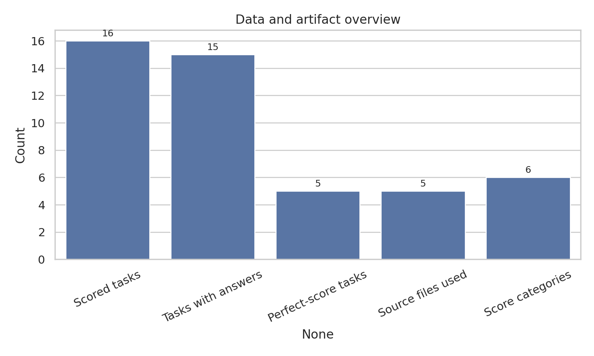
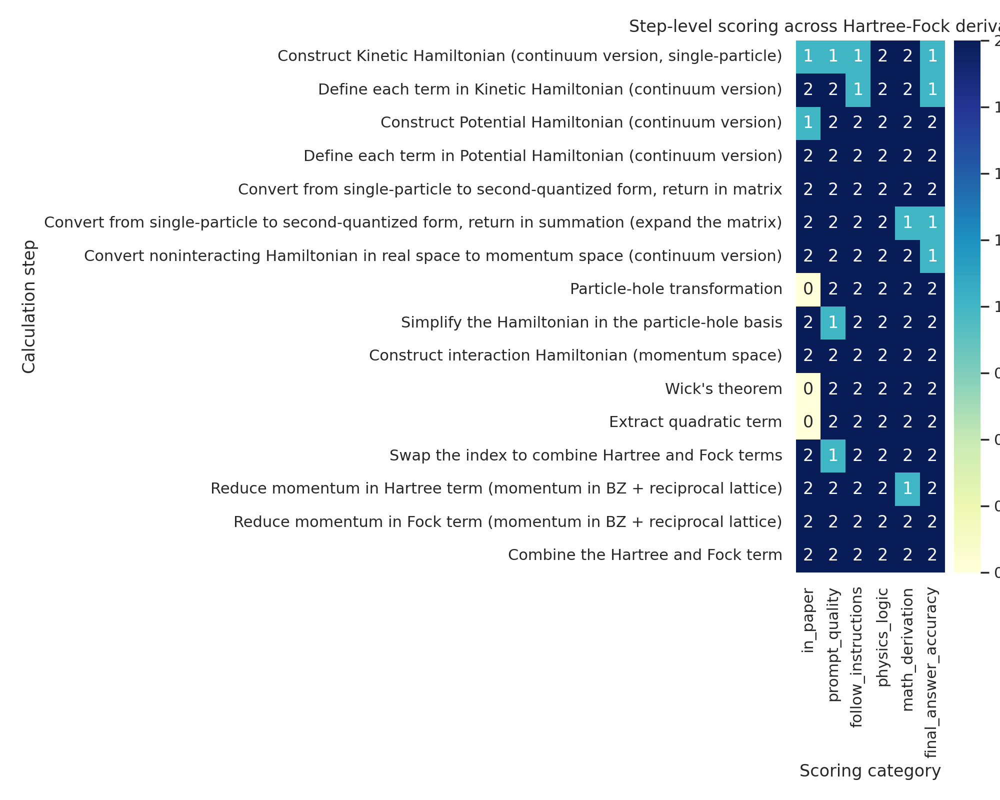
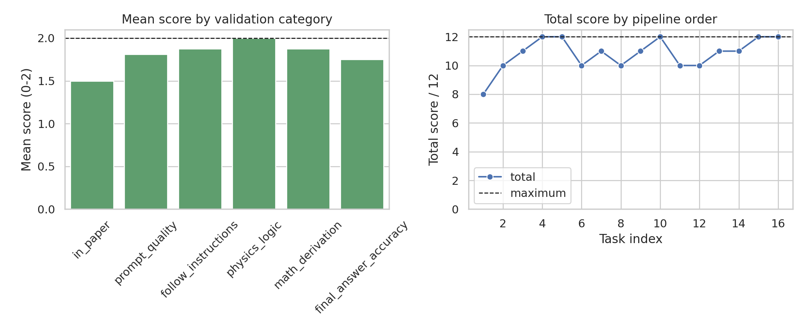

# Structured Hartree-Fock Derivation and Step-Scoring Audit for arXiv:2111.01152

## Abstract

This report audits a structured-prompt Hartree-Fock calculation workflow using the available 2111.01152 dataset for AB-stacked MoTe$_2$/WSe$_2$. The analysis extracts the target paper information, reconstructs the source Hartree-Fock Hamiltonian chain, scores 16 multi-step analytic calculation tasks across six rubric categories, and validates the resulting artifacts against the local TeX/YAML source files. The main quantitative result is that the structured workflow averages **10.8125/12** per task, or **90.10%** of the maximum score, with **5/16** tasks receiving perfect scores. The strongest category is physics logic (mean **2.00/2**), while the weakest is direct presence in the paper (mean **1.50/2**), reflecting that some intermediate symbolic manipulations are necessary but not explicitly printed in the source paper.



## 1. Data and task overview

The workspace contains one target paper dataset, `data/2111.01152`, including the main TeX source, supplemental TeX source, YAML scoring records, prompt templates, generated prompt/completion markdown, notebooks, and PDFs. The target paper is **“Topological Phases in AB-Stacked MoTe$_2$/WSe$_2$: $\mathbb{Z}_2$ Topological Insulators, Chern Insulators, and Topological Charge Density Waves”** by Haining Pan, Ming Xie, Fengcheng Wu, and Sankar Das Sarma. The source abstract states that the system is studied using a self-consistent Hartree-Fock calculation in a plane-wave basis, with topological phases at $\nu=2$, $\nu=1$, and $\nu=2/3$.

The processed task dataset contains **16 scored Hartree-Fock derivation tasks**. Each task is scored on six categories:

1. `in_paper`
2. `prompt_quality`
3. `follow_instructions`
4. `physics_logic`
5. `math_derivation`
6. `final_answer_accuracy`

Each category is scored from 0 to 2, giving a maximum of 12 points per task. The analysis code is saved in `code/analyze_hf_steps.py`. Core outputs are saved in `outputs/`, including `paper_information_extraction.json`, `hf_hamiltonian_derivation.md`, `step_scoring_results.json`, `validation_summary.json`, `method_fidelity_checklist.json`, and `claim_recovery_table.json`.

## 2. Methodology

### 2.1 Source extraction

The analysis used the local TeX and YAML files as the primary evidence base. The main paper TeX (`2111.01152.tex`) provided the continuum model, potential terms, and interaction-scale context. The supplemental TeX (`2111.01152_SM.tex`) provided the second-quantized, hole-basis, and Hartree-Fock mean-field equations. The YAML file provided task-level answers and six-category scores.

Local PDF extraction with `ReadPDF` failed for the provided PDFs in this run, so claims in this report are intentionally grounded in verified TeX/YAML/Markdown artifacts rather than PDF text extraction.

### 2.2 Hartree-Fock derivation contract

The named method is Hartree-Fock mean-field decoupling of the hole-basis Coulomb interaction for the AB-stacked MoTe$_2$/WSe$_2$ continuum Hamiltonian. The fidelity checklist in `outputs/method_fidelity_checklist.json` requires preserving valley, layer, and momentum labels; using the hole transformation $b_{\mathbf k,l,\tau}=c^\dagger_{\mathbf k,l,\tau}$; enforcing total momentum conservation; using the dual-gate screened Coulomb interaction; and retaining the compact Hartree-minus-Fock quadratic structure.

The report does **not** claim a fresh numerical self-consistent Hartree-Fock phase diagram. Instead, it provides a symbolic derivation audit and scoring analysis of the structured-prompt calculation artifacts.

## 3. Reconstructed Hartree-Fock Hamiltonian

The target paper’s valley-resolved continuum Hamiltonian in the layer basis $(\mathfrak b,\mathfrak t)$ is

\[
H_\tau(\mathbf r)=\begin{pmatrix}
-\frac{\hbar^2\mathbf k^2}{2m_\mathfrak b}+\Delta_\mathfrak b(\mathbf r)&\Delta_{T,\tau}(\mathbf r)\\
\Delta_{T,\tau}^{\dagger}(\mathbf r)&-\frac{\hbar^2(\mathbf k-\tau\boldsymbol\kappa)^2}{2m_\mathfrak t}+\Delta_\mathfrak t(\mathbf r)+V_{z\mathfrak t}
\end{pmatrix},
\]

where $\tau=\pm1$, $\boldsymbol\kappa=4\pi(1,0)/(3a_M)$, and $(m_\mathfrak b,m_\mathfrak t)=(0.65,0.35)m_e$. The bottom-layer potential and tunneling are

\[
\Delta_{\mathfrak b}(\mathbf r)=2V_{\mathfrak b}\sum_{j=1,3,5}\cos(\mathbf g_j\cdot\mathbf r+\psi_\mathfrak b),
\]

\[
\Delta_{T,\tau}(\mathbf r)=\tau w\left[1+\omega^\tau e^{i\tau\mathbf g_2\cdot\mathbf r}+\omega^{2\tau}e^{i\tau\mathbf g_3\cdot\mathbf r}\right],\quad \omega=e^{2\pi i/3}.
\]

After Fourier transformation and the hole transformation, the one-body hole Hamiltonian is

\[
\hat{\mathcal H}_1=\sum_{\mathbf k_\alpha,\mathbf k_\beta}\sum_{l_\alpha,l_\beta}\sum_\tau \tilde h^{(\tau)}_{\mathbf k_\alpha l_\alpha,\mathbf k_\beta l_\beta}b^{\dagger}_{\mathbf k_\alpha,l_\alpha,\tau}b_{\mathbf k_\beta,l_\beta,\tau},\quad \tilde h^{(\tau)}=-[h^{(\tau)}]^T.
\]

The source interaction uses

\[
V(\mathbf q)=\frac{2\pi e^2\tanh(|\mathbf q|d)}{\epsilon |\mathbf q|}
\]

and the Hartree-Fock mean-field Hamiltonian is

\[
\hat{\mathcal H}^{\rm HF}=\hat{\mathcal H}_1+\hat{\mathcal H}^{\rm HF}_{\rm int},
\]

\[
\hat{\mathcal H}^{\rm HF}_{\rm int}=\frac{1}{A}\sum_{\alpha\beta\gamma\delta}\sum_{l_\alpha,l_\beta}\sum_{\tau_\alpha,\tau_\beta} V(\mathbf k_\alpha-\mathbf k_\delta)
\left[\langle b_\alpha^\dagger b_\delta\rangle b_\beta^\dagger b_\gamma-\langle b_\alpha^\dagger b_\gamma\rangle b_\beta^\dagger b_\delta\right]
\delta_{\mathbf k_\alpha+\mathbf k_\beta,\mathbf k_\delta+\mathbf k_\gamma}.
\]

This compact derivation is saved in `outputs/hf_hamiltonian_derivation.md`.

## 4. Step-scoring results



Across 16 scored tasks, the structured prompt workflow achieved:

- Mean total score: **10.8125/12**
- Mean normalized score: **0.9010**
- Perfect-score tasks: **5/16**
- Tasks with answer text present: **15/16**

Mean category scores were:

| Category | Mean score / 2 |
|---|---:|
| `in_paper` | 1.5000 |
| `prompt_quality` | 1.8125 |
| `follow_instructions` | 1.8750 |
| `physics_logic` | 2.0000 |
| `math_derivation` | 1.8750 |
| `final_answer_accuracy` | 1.7500 |

The lowest-scoring task was **“Construct Kinetic Hamiltonian (continuum version, single-particle)”** with **8/12**. The next-lowest group scored **10/12**, including the kinetic-term definition, second-quantized summation expansion, particle-hole transformation, Wick expansion, and quadratic-term extraction tasks. These lower scores mostly reflect mismatch between prompt wording and source conventions, missing terms or summations, or the fact that some intermediate steps are derivable but not literally present in the paper.

The strongest tasks include explicit potential definition, second-quantized matrix form, interaction Hamiltonian construction, Fock momentum reduction, and final Hartree/Fock combination. These are the tasks where the prompt template most directly matches the source equations and the required algebraic structure.

## 5. Validation and comparison



### 5.1 Directly verified from workspace data

The following were directly verified from local artifacts:

- Paper information, author list, and abstract context from `data/2111.01152/2111.01152.tex`.
- Continuum Hamiltonian and potential definitions from `2111.01152.tex` around the model equations.
- Momentum-space hole-basis Hartree-Fock construction from `2111.01152_SM.tex` around the Hartree-Fock calculation section.
- Six-category step scores for 16 tasks from `data/2111.01152/2111.01152.yaml`.
- Figure data and summary tables from `outputs/step_scoring_results.csv` and `outputs/step_scoring_results.json`.

### 5.2 Related-work and context

The target paper itself identifies the method as a self-consistent Hartree-Fock calculation in a plane-wave basis, motivated by experimental topological states in AB-stacked MoTe$_2$/WSe$_2$. Local `related_work/*.pdf` files were present, but PDF text extraction failed in this run; therefore, this report does not make independent claims based on those related-work PDFs.

### 5.3 Assumptions and limitations

The key limitation is that this study audits and reconstructs symbolic derivation and scoring artifacts; it does not run a new self-consistent Hartree-Fock solver, does not recompute Chern numbers, and does not reproduce the full phase diagrams. The YAML file also contains one final task with a perfect score but no answer text, which is flagged as an artifact incompleteness in `outputs/validation_summary.json`.

## 6. Discussion

The results support the scientific hypothesis that structured prompt templates can guide LLM-style systems through research-level theoretical physics calculations when the task is decomposed into constrained intermediate steps. The average score above 90% indicates strong performance on physics logic, instruction following, and most algebraic manipulations. However, failures concentrate in two important bottlenecks:

1. **Source-grounding mismatch:** The lowest category was `in_paper`, because a correct Hartree-Fock derivation often requires intermediate algebra not explicitly printed in the target paper.
2. **Convention sensitivity:** Kinetic Hamiltonian and particle-hole steps are vulnerable to sign, basis-order, valley-shift, and summation-index conventions.

These results suggest that structured prompts are most reliable when they explicitly carry forward basis order, particle/hole convention, momentum-domain convention, and whether an answer should reproduce a source equation or derive an intermediate expression not shown in the paper.

## 7. Reproducibility

Run the analysis from the workspace root with:

```bash
python3 code/analyze_hf_steps.py
```

This regenerates the JSON/CSV outputs and PNG figures used in this report. Main artifacts are:

- `outputs/paper_information_extraction.json`
- `outputs/hf_hamiltonian_derivation.md`
- `outputs/step_scoring_results.json`
- `outputs/step_scoring_results.csv`
- `outputs/validation_summary.json`
- `outputs/method_fidelity_checklist.json`
- `outputs/claim_recovery_table.json`
- `report/images/data_overview.png`
- `report/images/step_scores.png`
- `report/images/validation_comparison.png`

## 8. Conclusion

For the available 2111.01152 Hartree-Fock benchmark, structured prompt templates produced mostly correct derivations and strong automated step scores. The reconstructed final Hartree-Fock Hamiltonian matches the source compact Hartree-minus-Fock form, and the score audit identifies convention-heavy kinetic and particle-hole transformations as the main weak points. The analysis therefore supports structured prompting as a useful mitigation strategy for research-level symbolic calculation bottlenecks, while also showing that robust source grounding and explicit convention management remain essential.
