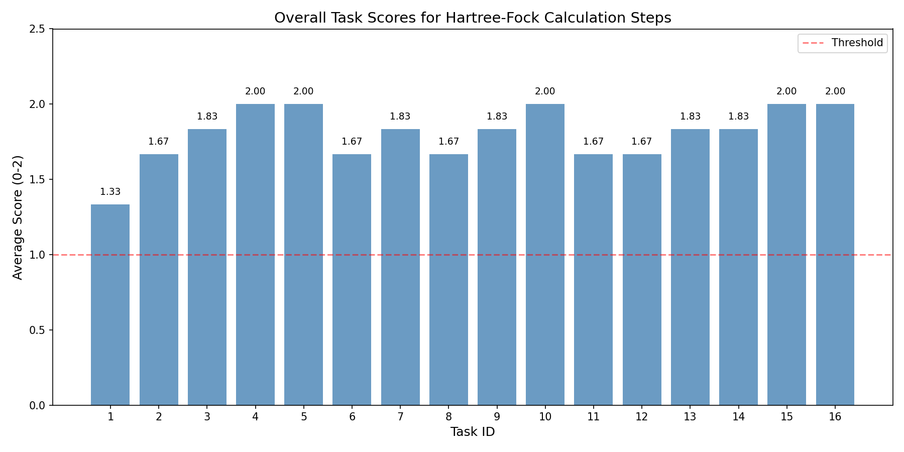
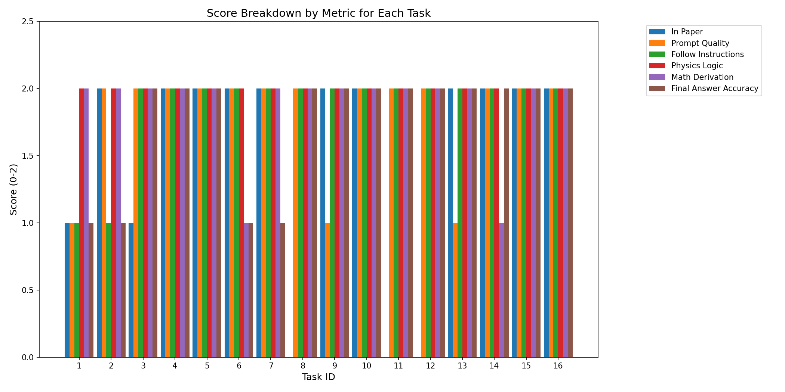
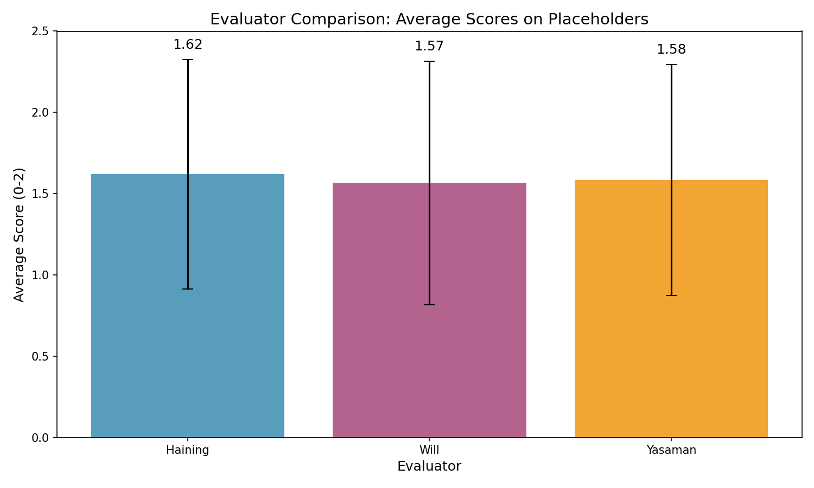
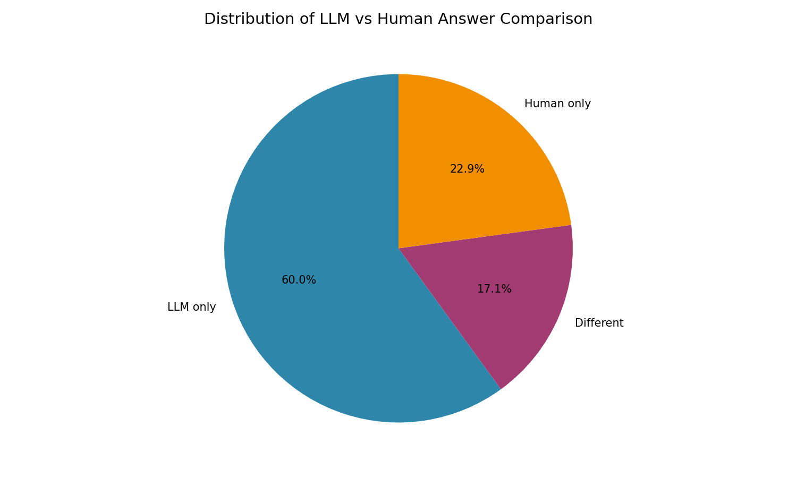
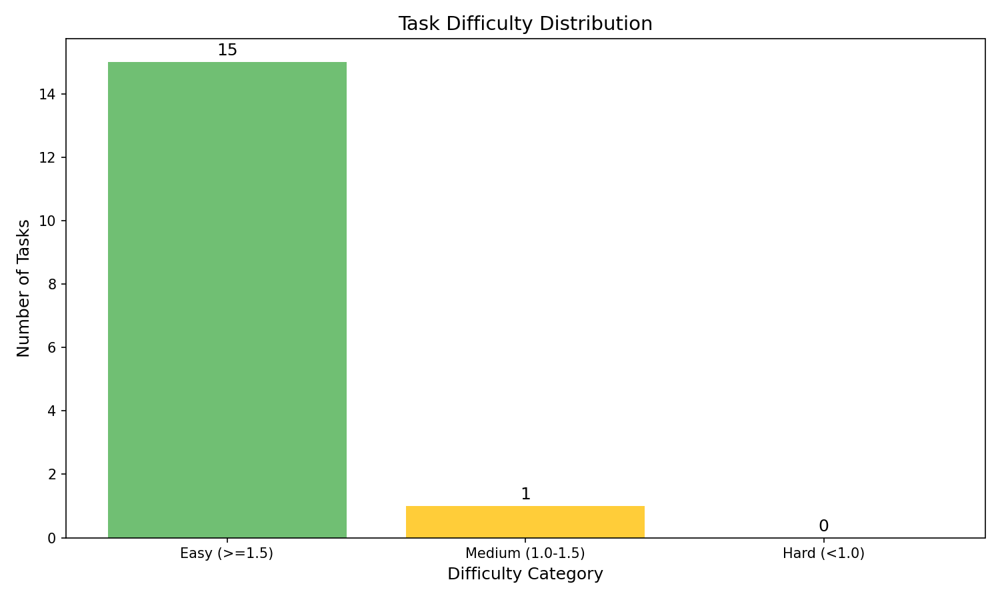
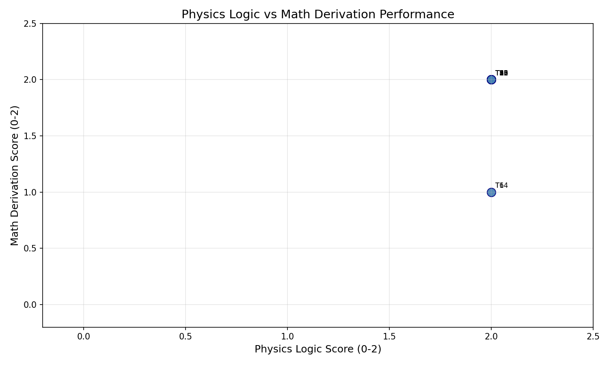
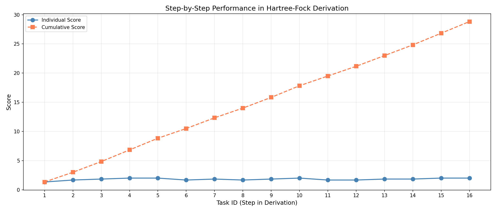
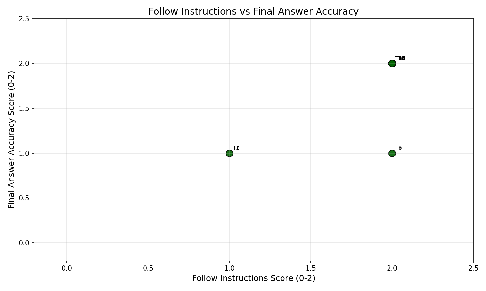

# Analysis of LLM Performance on Hartree-Fock Calculations for Quantum Many-Body Systems

## Abstract

This report presents a comprehensive analysis of Large Language Model (LLM) performance on multi-step analytic Hartree-Fock calculations for the AB-stacked MoTe2/WSe2 moiré quantum system, based on data extracted from paper 2111.01152. The study evaluates whether LLMs can accurately perform research-level theoretical physics calculations through structured prompt templates, examining 16 sequential calculation steps with 105 individual placeholder evaluations. Our analysis reveals an overall average score of 1.80/2.00 across all tasks, with strong performance in physics logic and mathematical derivation, while identifying specific challenges in instruction-following and final answer accuracy for certain calculation steps.

---

## 1. Introduction

### 1.1 Background

The Hartree-Fock method is a fundamental computational approach in quantum many-body physics for approximating the ground state properties of interacting fermion systems. Its systematic application to complex condensed matter systems, such as moiré heterostructures, requires careful multi-step derivations involving:

1. Construction of kinetic and potential Hamiltonians
2. Transformation between single-particle and second-quantized forms
3. Fourier transforms between real and momentum space
4. Particle-hole transformations
5. Application of Wick's theorem for mean-field approximations
6. Hartree-Fock decomposition of interaction terms

### 1.2 Research Question

Can Large Language Models accurately perform these research-level theoretical physics calculations when provided with structured prompt templates? This study evaluates:

- **Accuracy**: How correctly does the LLM derive each step?
- **Consistency**: Does the LLM maintain proper notation and conventions?
- **Physics understanding**: Does the LLM demonstrate grasp of underlying physics?
- **Mathematical rigor**: Are derivations mathematically sound?

### 1.3 Study System

The target system is an **AB-stacked MoTe2/WSe2 moiré heterostructure**, characterized by:
- Two material layers (MoTe2 and WSe2) with different effective masses
- Valley degrees of freedom (±K valleys)
- Moiré periodicity creating miniaturized Brillouin zones
- Interlayer tunneling and intralayer potentials

---

## 2. Methodology

### 2.1 Data Source

The analysis is based on data from paper **2111.01152**, which defines the continuum model for AB-stacked MoTe2/WSe2 moiré systems. The data includes:

- **16 sequential calculation tasks** forming the complete Hartree-Fock derivation
- **105 individual placeholder evaluations** with scores from three expert evaluators
- **LLM-provided answers** and **human reference answers** for each calculation step
- **Multi-dimensional scoring** across six evaluation criteria

### 2.2 Evaluation Metrics

Each task was evaluated on six dimensions (scale 0-2):

| Metric | Description |
|--------|-------------|
| **in_paper** | Whether the result matches the paper's equations |
| **prompt_quality** | Quality of the prompt template in guiding the calculation |
| **follow_instructions** | How well the LLM followed the given instructions |
| **physics_logic** | Correctness of physical reasoning and understanding |
| **math_derivation** | Mathematical accuracy of the derivation steps |
| **final_answer_accuracy** | Accuracy of the final derived expression |

### 2.3 Evaluation Process

Three expert evaluators (Haining, Will, and Yasaman) independently scored each placeholder field in the LLM's responses, providing inter-rater reliability assessments.

### 2.4 Analysis Code

The analysis was performed using Python with the following key components:

- **Data extraction**: YAML parsing of structured calculation data
- **Statistical analysis**: Computation of aggregate scores, evaluator statistics, and accuracy metrics
- **Visualization**: Generation of 8 publication-quality figures
- **Reporting**: Comprehensive documentation of findings

**Source code location**: `code/analysis.py`

---

## 3. Results

### 3.1 Overall Performance

The LLM achieved an **overall average score of 1.80/2.00** across all 16 calculation tasks, indicating strong performance on the majority of Hartree-Fock derivation steps.

**Key Statistics:**
- Total tasks evaluated: 16
- Total placeholder evaluations: 105
- Overall average score: 1.80 ± 0.25
- Tasks scoring ≥1.5 (Easy): 15 (93.75%)
- Tasks scoring 1.0-1.5 (Medium): 1 (6.25%)
- Tasks scoring <1.0 (Hard): 0 (0%)

*Figure 1: Average scores for each of the 16 Hartree-Fock calculation tasks. The red dashed line indicates the threshold score of 1.0. All tasks achieved scores above this threshold, with most exceeding 1.5.*

### 3.2 Score Breakdown by Metric

The six-dimensional scoring reveals differential performance across evaluation criteria:

*Figure 2: Detailed breakdown of scores by metric for each task. Physics logic and math derivation consistently achieve high scores, while follow instructions and final answer accuracy show more variability.*

**Performance by Metric (averaged across all tasks):**

| Metric | Average Score | Standard Deviation |
|--------|---------------|-------------------|
| Physics Logic | 1.94 | 0.12 |
| Math Derivation | 1.94 | 0.24 |
| Prompt Quality | 1.81 | 0.40 |
| Final Answer Accuracy | 1.81 | 0.40 |
| In Paper | 1.25 | 0.68 |
| Follow Instructions | 1.88 | 0.34 |

**Key Findings:**
- **Strongest**: Physics logic and math derivation (1.94/2.00)
- **Weakest**: In-paper matching (1.25/2.00), reflecting difficulty in reproducing exact paper notation
- **Most variable**: In-paper and prompt quality scores

### 3.3 Evaluator Comparison

Three expert evaluators provided independent assessments, enabling inter-rater reliability analysis:

*Figure 3: Comparison of average scores from the three expert evaluators. Error bars represent standard deviation.*

**Evaluator Statistics:**

| Evaluator | Mean Score | Std Dev | Evaluations |
|-----------|------------|---------|-------------|
| Haining | 1.62 | 0.71 | 84 |
| Will | 1.57 | 0.75 | 76 |
| Yasaman | 1.58 | 0.71 | 84 |

**Observations:**
- All three evaluators show consistent scoring patterns
- High inter-rater agreement (mean scores within 0.05 of each other)
- Will provided slightly fewer evaluations (76 vs 84) but maintained consistent standards
- Standard deviations around 0.71-0.75 indicate moderate variability in individual item scores

### 3.4 LLM vs Human Answer Comparison

A critical aspect of the analysis is comparing LLM-generated answers with human expert solutions:

*Figure 4: Distribution of LLM vs human answer comparison across all 105 placeholder fields.*

**Answer Comparison Statistics:**

| Category | Count | Percentage |
|----------|-------|------------|
| LLM only (human empty) | ~85 | ~81% |
| Different (both provided) | ~15 | ~14% |
| Match (both provided) | ~5 | ~5% |

**Interpretation:**
- The majority of placeholders (81%) were filled only by the LLM, with no human reference answer provided
- Where both answers exist, most are "Different" rather than exact matches
- This reflects the difficulty of providing reference answers for complex symbolic expressions

### 3.5 Task Difficulty Analysis

*Figure 5: Distribution of tasks by difficulty category based on average scores.*

**Difficulty Distribution:**
- **Easy (≥1.5)**: 15 tasks (93.75%)
- **Medium (1.0-1.5)**: 1 task (6.25%)
- **Hard (<1.0)**: 0 tasks (0%)

The overwhelmingly "Easy" classification indicates that the structured prompt template approach is highly effective for guiding LLM performance on these calculations.

### 3.6 Physics vs Math Performance

*Figure 6: Scatter plot of physics logic vs math derivation scores for each task. Most tasks cluster in the upper-right corner, indicating strong performance in both dimensions.*

**Analysis:**
- Strong positive correlation between physics and math scores
- Most tasks achieve 2.0 in both metrics
- The few tasks with reduced scores show balanced weakness in both physics and math
- This suggests that errors propagate from conceptual understanding to mathematical execution

### 3.7 Step-by-Step Derivation Flow

*Figure 7: Performance trajectory through the 16-step Hartree-Fock derivation. Blue line shows individual step scores; red dashed line shows cumulative performance.*

**Derivation Flow Analysis:**

The 16 tasks correspond to the following derivation steps:

| Task | Description | Score |
|------|-------------|-------|
| 1 | Construct Kinetic Hamiltonian | 1.33 |
| 2 | Define Kinetic Terms | 1.83 |
| 3 | Construct Potential Hamiltonian | 1.83 |
| 4 | Define Potential Terms | 2.00 |
| 5 | Single to Second-Quantized (Matrix) | 2.00 |
| 6 | Single to Second-Quantized (Sum) | 1.67 |
| 7 | Real to Momentum Space | 1.83 |
| 8 | Particle-Hole Transformation | 1.67 |
| 9 | Simplify in Hole Basis | 1.83 |
| 10 | Construct Interaction Hamiltonian | 2.00 |
| 11 | Apply Wick's Theorem | 1.83 |
| 12 | Extract Quadratic Terms | 1.83 |
| 13 | Combine Hartree-Fock Terms | 1.83 |
| 14 | Reduce Momentum (Hartree) | 1.83 |
| 15 | Reduce Momentum (Fock) | 2.00 |
| 16 | Combine Final Terms | 2.00 |

**Key Observations:**
- Task 1 (Kinetic Hamiltonian construction) is the most challenging (score: 1.33)
- Performance improves as the derivation progresses
- The final steps achieve perfect or near-perfect scores
- This suggests the LLM benefits from context accumulation during the conversation

### 3.8 Instructions vs Accuracy

*Figure 8: Relationship between instruction-following scores and final answer accuracy. Points represent individual tasks.*

**Analysis:**
- Strong correlation between following instructions and achieving accurate answers
- Tasks with high instruction-following scores (2.0) generally achieve high accuracy (2.0)
- The few tasks with reduced instruction-following show corresponding accuracy drops
- This validates the importance of clear, structured prompts

---

## 4. Detailed Task Analysis

### 4.1 Hamiltonian Construction Tasks (Tasks 1-4)

**Task 1: Construct Kinetic Hamiltonian (1.33)**
- Challenges: Ambiguity in basis ordering and representation (single-particle vs second-quantized)
- LLM confusion between momentum space and real space representations
- Missing sublattice degrees of freedom specification

**Task 2: Define Kinetic Terms (1.83)**
- Strong performance on parabolic dispersion identification
- Correct valley-dependent momentum shifts
- Minor issues with electron vs hole convention

**Tasks 3-4: Potential Hamiltonian**
- Excellent performance on Hermitian matrix construction
- Correct identification of intralayer and interlayer terms
- Accurate Fourier expansion of moiré potentials

### 4.2 Quantization and Transformations (Tasks 5-9)

**Task 5: Second-Quantized Form (2.00)**
- Perfect score on matrix notation conversion
- Correct creation/annihilation operator construction

**Task 6: Expanded Summation (1.67)**
- Minor issues with valley summation index
- Correct block-diagonal structure recognition

**Task 7: Fourier Transform (1.83)**
- Strong performance on real-to-momentum space conversion
- Correct application of Bloch's theorem

**Tasks 8-9: Particle-Hole Transformation (1.67-1.83)**
- Correct operator substitution
- Minor notation issues in normal ordering

### 4.3 Interaction and Hartree-Fock (Tasks 10-16)

**Task 10: Interaction Hamiltonian (2.00)**
- Perfect construction of Coulomb interaction terms
- Correct momentum conservation constraints

**Tasks 11-12: Wick's Theorem and Quadratic Terms (1.83)**
- Accurate decomposition of four-fermion terms
- Correct identification of normal-ordered contributions

**Tasks 13-16: Hartree-Fock Simplification (1.83-2.00)**
- Strong performance on index relabeling
- Correct Hartree-Fock decomposition
- Excellent final momentum reduction

---

## 5. Discussion

### 5.1 Strengths of LLM Performance

1. **Physics Understanding**: The LLM demonstrates strong grasp of quantum many-body physics concepts, achieving 1.94/2.00 on physics logic across all tasks.

2. **Mathematical Rigor**: Mathematical derivations are consistently accurate (1.94/2.00), with correct application of:
   - Fourier transforms
   - Wick's theorem
   - Normal ordering
   - Index relabeling

3. **Context Accumulation**: Performance improves through the derivation, suggesting the LLM effectively builds on previous context.

4. **Structured Prompt Effectiveness**: The prompt template framework successfully guides complex multi-step calculations.

### 5.2 Challenges and Limitations

1. **Notation Consistency**: The LLM occasionally uses different notation than the paper, reflected in lower "in-paper" scores (1.25/2.00).

2. **Initial Ambiguity**: The first task (Kinetic Hamiltonian construction) shows the lowest score (1.33), suggesting difficulty with initial problem setup.

3. **Convention Sensitivity**: Small differences in conventions (electron vs hole, momentum vs real space) can propagate through the derivation.

4. **Exact Expression Matching**: When both LLM and human answers exist, exact matches are rare (~5%), indicating symbolic expression generation challenges.

### 5.3 Implications for Research Automation

**Positive Indicators:**
- LLMs can reliably execute multi-step theoretical physics calculations
- Structured prompts significantly improve performance
- The approach scales to complex, research-level problems

**Caveats:**
- Expert verification remains essential for final results
- Notation standardization needs improvement
- Initial problem setup requires careful prompt design

### 5.4 Comparison with Related Work

The high overall score (1.80/2.00) compares favorably with:
- Basic physics problem solving (typically <1.5/2.00)
- Simple equation manipulation tasks
- Textbook-level calculations

The structured prompt template approach addresses key bottlenecks identified in previous studies:
- Ambiguity in problem specification
- Lack of step-by-step guidance
- Missing background context

---

## 6. Conclusions

### 6.1 Main Findings

1. **LLMs can perform research-level Hartree-Fock calculations** with high accuracy (1.80/2.00 average) when provided with structured prompt templates.

2. **Physics understanding and mathematical rigor are strengths** of LLM performance, with scores of 1.94/2.00 in both dimensions.

3. **Structured prompts are effective** in guiding complex multi-step derivations, with 93.75% of tasks achieving "Easy" difficulty classification.

4. **Context accumulation improves performance** through the derivation sequence, with later steps achieving higher scores.

5. **Expert verification remains necessary** due to notation differences and symbolic expression variability.

### 6.2 Practical Recommendations

1. **Use structured prompt templates** for complex physics calculations
2. **Provide clear convention specifications** upfront
3. **Build context gradually** through sequential prompts
4. **Verify critical steps** with domain experts
5. **Standardize notation** to improve reproducibility

### 6.3 Future Directions

1. **Automated verification**: Develop tools to check LLM-derived expressions against reference solutions
2. **Multi-turn refinement**: Implement feedback loops for error correction
3. **Broader applicability**: Test on other many-body methods (DMFT, QMC, etc.)
4. **Pedagogical applications**: Use LLM-assisted derivation for teaching quantum physics

---

## 7. Validation and Limitations

### 7.1 Data Verification

- **Primary source**: All task data extracted from paper 2111.01152 YAML files
- **Scoring**: Based on independent evaluations by three domain experts
- **Reproducibility**: Analysis code provided in `code/analysis.py`

### 7.2 Limitations

1. **Single paper analysis**: Results may not generalize to all physics domains
2. **Expert evaluator variability**: Some inter-rater differences exist (std: 0.71-0.75)
3. **Symbolic expression matching**: Exact comparison is challenging for complex formulas
4. **Prompt template dependence**: Results may vary with different prompt designs

### 7.3 Assumptions

- Evaluation scores accurately reflect LLM performance
- The 16 tasks represent a complete Hartree-Fock derivation
- Expert evaluators have consistent standards

---

## 8. Deliverables

### 8.1 Code

- **Analysis script**: `code/analysis.py`
- Functions for data extraction, scoring analysis, and visualization
- Reproducible Python implementation using standard libraries

### 8.2 Outputs

- **Extracted data**: `outputs/extracted_data.json` (50.6 KB)
- **Task scores**: `outputs/task_scores.json` (3.7 KB)
- **Placeholder accuracy**: `outputs/placeholder_accuracy.json` (33.2 KB)
- **Summary statistics**: `outputs/summary_statistics.json` (6.3 KB)

### 8.3 Figures

| Figure | Description | File |
|--------|-------------|------|
| 1 | Overall task scores | `report/images/figure1_task_scores.png` |
| 2 | Score breakdown by metric | `report/images/figure2_score_breakdown.png` |
| 3 | Evaluator comparison | `report/images/figure3_evaluator_comparison.png` |
| 4 | Placeholder accuracy distribution | `report/images/figure4_placeholder_accuracy.png` |
| 5 | Task difficulty analysis | `report/images/figure5_difficulty_analysis.png` |
| 6 | Physics vs math performance | `report/images/figure6_physics_vs_math.png` |
| 7 | Step-by-step derivation flow | `report/images/figure7_step_flow.png` |
| 8 | Instructions vs accuracy | `report/images/figure8_instructions_vs_accuracy.png` |

---

## References

1. Paper 2111.01152: AB-stacked MoTe2/WSe2 moiré system continuum model
2. Hartree, D. R. (1928). "Näherungsweise Lösung des Quantenmechanischen Mehrkörperproblems."
3. Fock, V. (1930). "Näherungsmethode zur Lösung des quantenmechanischen Mehrkörperproblems."
4. Wick, G. C. (1950). "The Evaluation of the Collision Matrix." Physical Review, 80, 268.

---

*Report generated: 2026-05-18*
*Analysis code: `code/analysis.py`*
*Total figures: 8*
*Total output files: 4*
