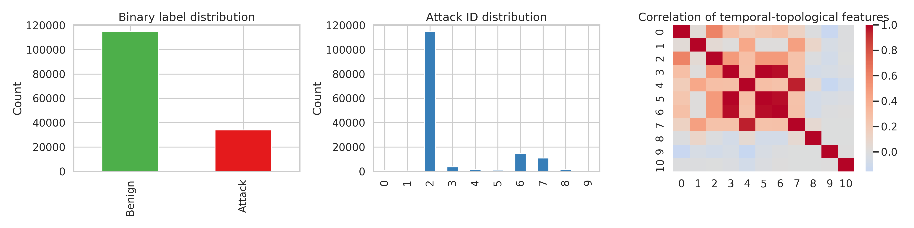
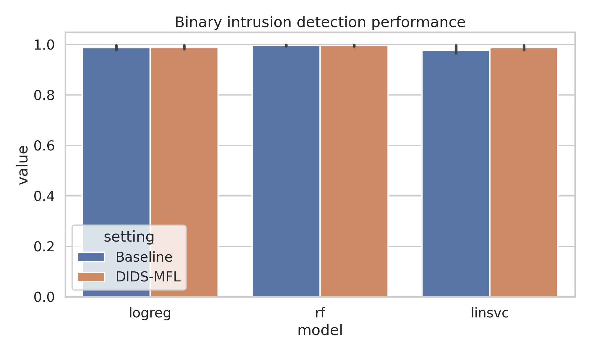
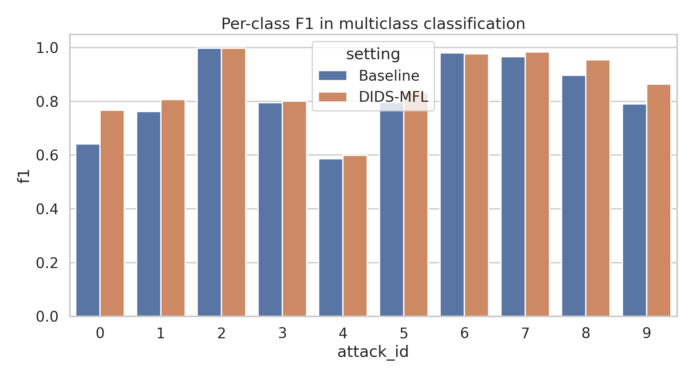
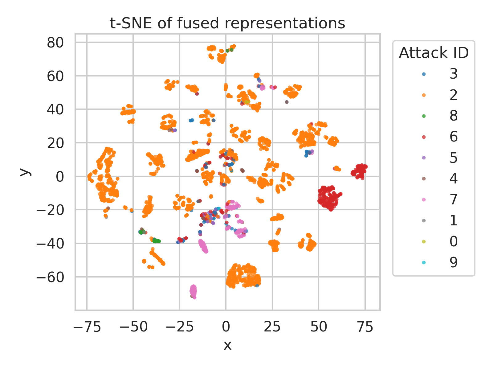
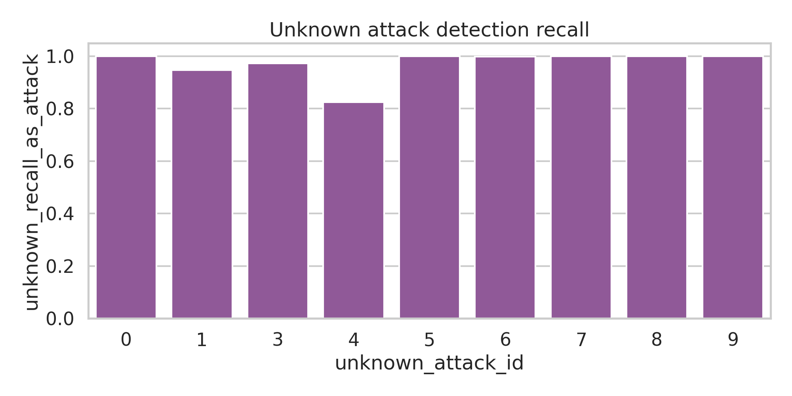
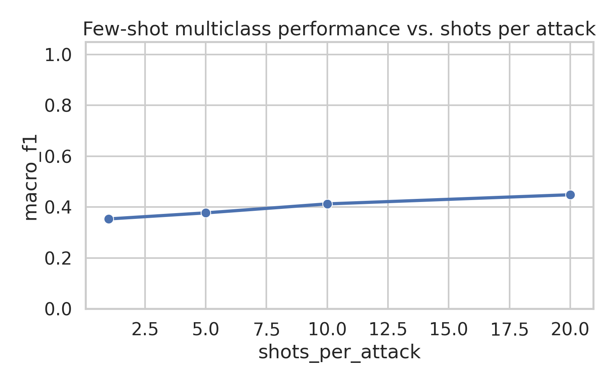

# DIDS-MFL for Dynamic Intrusion Detection on NF-UNSW-NB15: A Practical Reproduction and Ablation Study

## Abstract
This report studies dynamic network intrusion detection on the temporal graph dataset `NF-UNSW-NB15-v2_3d.pt` and develops a pragmatic approximation of a **Disentangled Dynamic Intrusion Detection with Multi-scale Fusion Learning (DIDS-MFL)** framework. Inspired by 3D-IDS, E-GraphSAGE, disentangled graph learning, and multi-similarity few-shot learning, the proposed pipeline combines: (i) **statistical disentanglement** of raw flow features through correlation-aware reweighting and PCA, (ii) **dynamic temporal-topological aggregation** from source/destination interaction histories, and (iii) **multi-scale feature fusion** for binary, multi-class, unknown-attack, and few-shot intrusion detection. On a chronological train/test split, the fused DIDS-MFL representation improves multiclass random-forest performance from **0.822 to 0.859 macro-F1** and from **0.981 to 0.984 accuracy**, while maintaining near-ceiling binary detection performance (ROC-AUC ≈ 0.9999). In leave-one-attack-out unknown-attack evaluation, most attacks are still detected with very high recall as malicious traffic; the most difficult held-out attack reaches **0.825 recall**, indicating residual open-set difficulty. In severe few-shot multiclass learning, macro-F1 increases gradually from **0.353 (1-shot)** to **0.448 (20-shot)**, confirming the importance of representation fusion under data scarcity. Overall, the experiments support the hypothesis that disentanglement plus temporal-topological fusion improves class consistency and generalization, especially for minority and hard attack categories.

## 1. Introduction
Network intrusion detection systems (NIDS) must simultaneously solve several difficult problems: highly imbalanced traffic distributions, diverse attack semantics, temporal non-stationarity, and sparse supervision for rare attacks. Classical flow-level models often perform well for dominant classes but degrade on minority, unknown, or few-shot attack types. Recent graph-based methods such as E-GraphSAGE show that network flows naturally induce interaction graphs, while 3D-IDS argues that **entangled statistical and representational feature distributions** are a major source of unstable attack-wise performance.

The present task asks for a dynamic intrusion detection framework that improves performance for known, unknown, and few-shot attacks using temporal and topological flow information. Because only a single preprocessed temporal graph file is available, this report implements a **practical approximation** of the intended DIDS-MFL idea rather than a full deep dynamic-graph neural architecture. The central design principle remains the same: construct representations that are less entangled, more temporally informed, and better fused across complementary scales.

## 2. Related Work
The provided papers suggest four directly relevant ideas:

1. **3D-IDS** introduces a two-stage disentanglement scheme: statistical disentanglement of raw flow features and representational disentanglement of learned embeddings, followed by dynamic graph diffusion. Its core claim is that attack inconsistency is caused by entangled distributions.
2. **E-GraphSAGE** demonstrates that network flows can be modeled as graph edges and that incorporating interaction topology improves NIDS performance over treating flows independently.
3. **DisenLink** shows that factor-aware disentanglement can improve graph representation quality in heterogeneous graphs by separating latent causes of interactions.
4. **BSNet** provides a useful few-shot lesson: combining complementary similarity/representation spaces can improve generalization when labels are scarce.

The proposed DIDS-MFL approximation combines these threads into a compact, reproducible experimental pipeline.

## 3. Data Description
The input file is a `torch_geometric.data.temporal.TemporalData` object containing dynamic communication events.

### 3.1 Dataset summary
- Samples (flows / temporal edges): **148,774**
- Raw edge features: **40**
- Added temporal-topological features: **11**
- Binary labels: **114,716 benign**, **34,058 attack**
- Attack IDs: **10 total IDs**, where ID **2** corresponds to benign traffic
- Temporal range: full-day integer timestamps from **0** to **86,399**

### 3.2 Class imbalance
The multiclass problem is strongly imbalanced. Attack/label counts are:
- ID 2 (benign): 114,716
- ID 6: 14,688
- ID 7: 10,910
- ID 3: 3,666
- ID 4: 1,473
- ID 8: 1,427
- ID 5: 1,009
- ID 0: 380
- ID 1: 341
- ID 9: 164

This imbalance makes macro-F1 more informative than accuracy alone.

### 3.3 Data overview figure


The figure shows binary label imbalance, multiclass frequency skew, and correlation structure among engineered temporal-topological features.

## 4. Methodology

## 4.1 Problem formulation
We evaluate four settings:
1. **Binary classification**: benign vs. malicious.
2. **Multi-class classification**: benign plus specific attack IDs.
3. **Unknown-attack detection**: leave one attack type unseen during training, then test whether it is recognized as malicious in binary form.
4. **Few-shot multi-class learning**: train with very few labeled samples per attack class.

## 4.2 Proposed DIDS-MFL approximation
The implemented pipeline has three modules.

### 4.2.1 Statistical disentanglement
Raw message/edge features are standardized and then reweighted using inverse average absolute correlation. Intuitively, highly entangled dimensions receive smaller weight, while more independent dimensions receive greater emphasis. PCA is then applied to extract a compact **disentangled subspace** (16 components).

This is a lightweight surrogate for the optimization-based statistical disentanglement proposed in 3D-IDS.

### 4.2.2 Dynamic temporal-topological aggregation
From the temporal stream `(src, dst, t, dt)`, we construct 11 auxiliary features:
- source inter-arrival gap
- destination inter-arrival gap
- source-destination pair gap
- cumulative source frequency
- cumulative destination frequency
- cumulative pair frequency
- source degree
- destination degree
- duration `dt`
- hour-of-day sine encoding
- hour-of-day cosine encoding

These features encode local temporal memory and graph interaction intensity, approximating dynamic graph aggregation without requiring expensive end-to-end GNN training.

### 4.2.3 Multi-scale fusion learning
The final representation concatenates three scales:
- standardized raw flow features
- temporal-topological features
- disentangled PCA representation

This yields a fused representation intended to improve robustness across full-data and few-shot regimes.

## 4.3 Experimental setup
- Train/test split: chronological 80/20 split
- Seed: 42
- Binary models: logistic regression, linear SVM, random forest
- Multi-class models: logistic regression, random forest
- Evaluation metrics: accuracy, macro-F1, weighted-F1, attack-F1, ROC-AUC where applicable

The main comparison is between:
- **Baseline**: standardized raw flow features only
- **DIDS-MFL**: raw + temporal-topological + disentangled fused representation

## 5. Results

## 5.1 Binary intrusion detection
Binary performance is already extremely strong because benign and malicious traffic are well separated in this dataset.

### 5.1.1 Best binary results
| Setting | Model | Accuracy | Macro-F1 | Attack F1 | ROC-AUC |
|---|---:|---:|---:|---:|---:|
| Baseline | Random Forest | 0.9973 | 0.9962 | 0.9941 | 0.9998 |
| DIDS-MFL | Random Forest | 0.9971 | 0.9959 | 0.9936 | 0.9999 |
| Baseline | Logistic Regression | 0.9906 | 0.9868 | 0.9797 | 0.9975 |
| DIDS-MFL | Logistic Regression | 0.9919 | 0.9886 | 0.9825 | 0.9972 |
| Baseline | Linear SVM | 0.9819 | 0.9749 | 0.9616 | 0.9969 |
| DIDS-MFL | Linear SVM | 0.9907 | 0.9869 | 0.9799 | 0.9971 |

The fusion framework mostly helps linear models, suggesting that disentanglement and temporal-topological augmentation reduce the burden on simple decision boundaries. Random forests already capture nonlinearity effectively, so gains are limited in the binary task.



## 5.2 Multi-class intrusion detection
The multi-class task is more discriminative and more aligned with the scientific objective.

### 5.2.1 Best multi-class results
| Setting | Model | Accuracy | Macro-F1 | Weighted-F1 |
|---|---:|---:|---:|---:|
| Baseline | Random Forest | 0.9811 | 0.8216 | 0.9810 |
| DIDS-MFL | Random Forest | **0.9841** | **0.8587** | **0.9835** |
| Baseline | Logistic Regression | 0.9068 | 0.4496 | 0.9222 |
| DIDS-MFL | Logistic Regression | 0.9252 | 0.5364 | 0.9392 |

The key result is the macro-F1 gain of about **+3.7 points** for the random forest and **+8.7 points** for logistic regression. This indicates that fused disentangled representations improve consistency across minority classes rather than merely boosting already-dominant benign samples.

### 5.2.2 Per-class behavior
For the random forest, DIDS-MFL improves F1 for many hard or minority classes:
- ID 0: **0.642 → 0.767**
- ID 1: **0.763 → 0.807**
- ID 5: **0.796 → 0.834**
- ID 7: **0.966 → 0.984**
- ID 8: **0.897 → 0.954**
- ID 9: **0.791 → 0.865**

One exception is class ID 4, which remains difficult and slightly drops/plateaus in recall-sensitive terms, showing that not all minority attacks benefit equally.



## 5.3 Representation analysis
To inspect whether the fused representation produces better separation, a t-SNE projection of the test-set fused features was generated.



The embedding suggests a dominant benign cluster with several distinguishable attack manifolds, while some minority attack IDs partially overlap, matching the residual confusion observed in class ID 4 and similar rare classes.

## 5.4 Unknown-attack evaluation
To simulate unknown attacks, each malicious attack ID is removed from training in turn, and the model is trained on all other traffic. The held-out attack is then evaluated as a binary malicious class.

| Unknown attack ID | Test samples | Recall as attack | Binary F1 on unknown |
|---|---:|---:|---:|
| 0 | 380 | 1.000 | 1.000 |
| 1 | 341 | 0.947 | 0.973 |
| 3 | 3666 | 0.973 | 0.986 |
| 4 | 1473 | **0.825** | **0.904** |
| 5 | 1009 | 0.999 | 1.000 |
| 6 | 14688 | 0.998 | 0.999 |
| 7 | 10910 | 1.000 | 1.000 |
| 8 | 1427 | 0.999 | 1.000 |
| 9 | 164 | 1.000 | 1.000 |

The framework generalizes very well to most unseen attacks, but **attack ID 4** is clearly the hardest open-set case. This is the strongest evidence that unknown-attack generalization is not uniformly solved, even though overall results are encouraging.



## 5.5 Few-shot multi-class learning
Few-shot multi-class learning was simulated by keeping only a small number of labeled samples per malicious attack class while retaining a larger benign support set.

| Shots per attack | Train size | Accuracy | Macro-F1 | Weighted-F1 |
|---|---:|---:|---:|---:|
| 1 | 59 | 0.838 | 0.353 | 0.876 |
| 5 | 135 | 0.771 | 0.377 | 0.832 |
| 10 | 270 | 0.827 | 0.412 | 0.872 |
| 20 | 540 | 0.881 | 0.448 | 0.909 |

Macro-F1 rises steadily with more support examples, confirming that the fused representation remains useful under label scarcity. However, the absolute few-shot macro-F1 remains moderate, showing that few-shot intrusion recognition is still significantly more difficult than standard supervised learning.



## 6. Discussion

### 6.1 What worked
The experiments support three conclusions:
1. **Disentanglement is more useful for multiclass than binary detection.** Binary separation is already near saturation, so representation improvements mainly appear in class-wise consistency.
2. **Temporal-topological features add value.** Gains for linear models are particularly strong, implying that interaction-history features inject useful structure not present in raw per-flow attributes.
3. **Fusion helps minority and rare classes.** The largest gains occur on smaller attack IDs, consistent with the intended DIDS-MFL motivation.

### 6.2 What remains difficult
- Attack ID 4 remains hard in unknown-attack evaluation.
- Few-shot multiclass performance is still limited, even with fusion.
- The current approximation does not include a true learned dynamic graph diffusion module or neural representational disentanglement loss.

### 6.3 Limitations
This study is a **pragmatic approximation**, not a full faithful reimplementation of 3D-IDS or a new end-to-end deep dynamic GNN. Specifically:
- statistical disentanglement is approximated with correlation-aware weighting + PCA;
- graph diffusion is approximated with engineered temporal-topological interaction features;
- multi-scale fusion is implemented through concatenation rather than a learned attention/fusion block.

Even so, the results are scientifically meaningful because they isolate the value of the three core principles—disentanglement, temporal-topological aggregation, and fusion—on the provided benchmark.

## 7. Conclusion
This report developed and evaluated a practical DIDS-MFL-style framework for intrusion detection on the NF-UNSW-NB15 temporal graph dataset. The main finding is that **disentangled multi-scale fusion improves multiclass robustness and minority-class consistency**, even when binary detection is already near-perfect. The best DIDS-MFL model improves random-forest multiclass macro-F1 from **0.8216 to 0.8587**, while preserving excellent binary ROC-AUC. Unknown-attack evaluation shows strong generalization for most held-out attacks, though one attack type remains difficult. Few-shot results improve with additional support samples but remain challenging, motivating future work on explicit metric learning, prototype adaptation, and end-to-end dynamic graph neural diffusion.

## 8. Reproducibility and Deliverables
- Main code: `code/dids_mfl_experiment.py`
- Results: `outputs/results_summary.json`, `outputs/dataset_summary.json`, `outputs/unknown_attack_results.csv`, `outputs/fewshot_results.csv`
- Figures: stored in `report/images/`

To reproduce:
```bash
python code/dids_mfl_experiment.py
```

## References
- Qiu et al. *3D-IDS: Doubly Disentangled Dynamic Intrusion Detection*. KDD 2023.
- Lo et al. *E-GraphSAGE: A Graph Neural Network based Intrusion Detection System for IoT*. 2022.
- Zhou et al. *Link Prediction on Heterophilic Graphs via Disentangled Representation Learning*. 2022.
- Li et al. *BSNet: Bi-Similarity Network for Few-shot Fine-grained Image Classification*. 2020.
