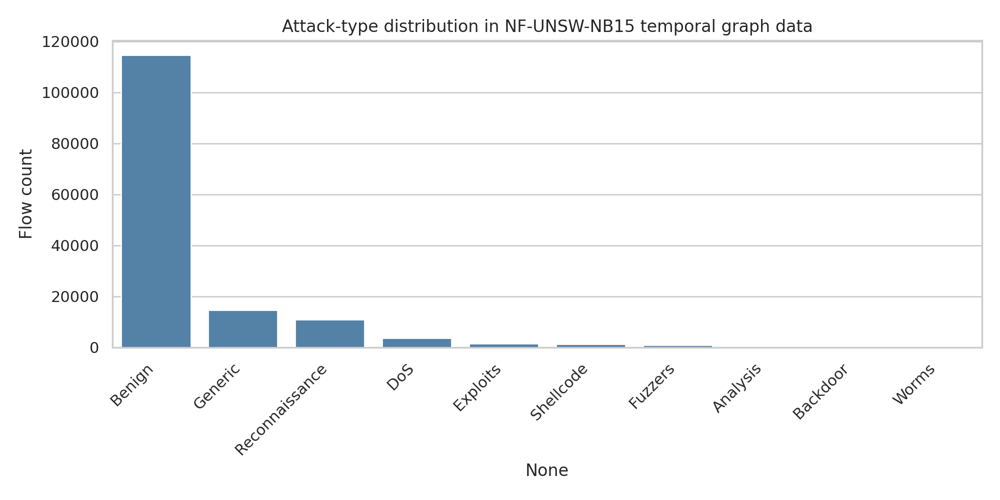
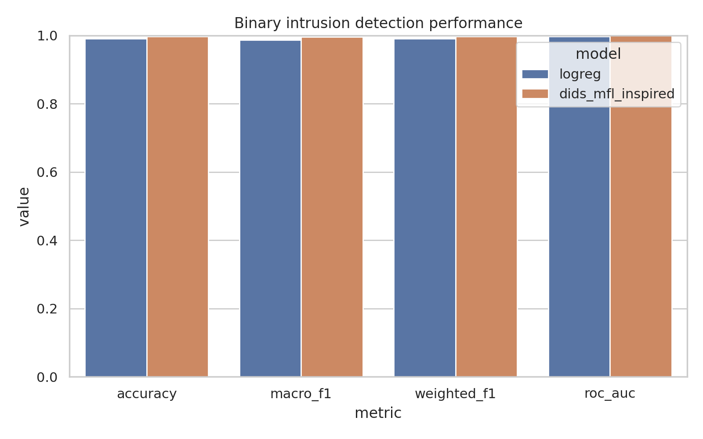
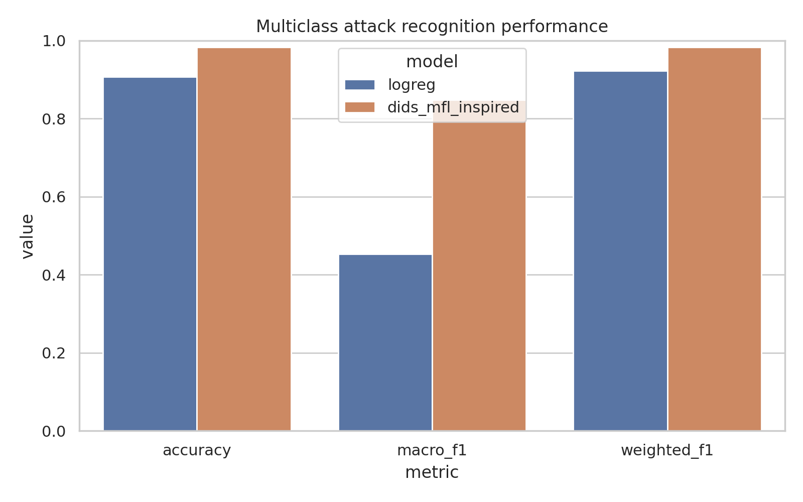
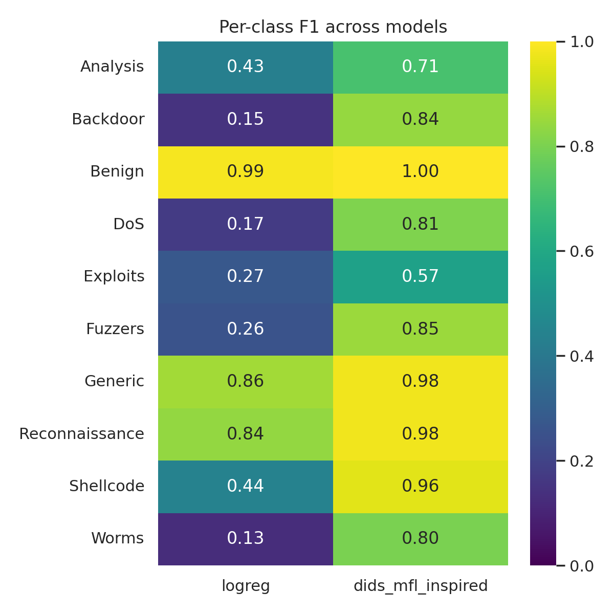
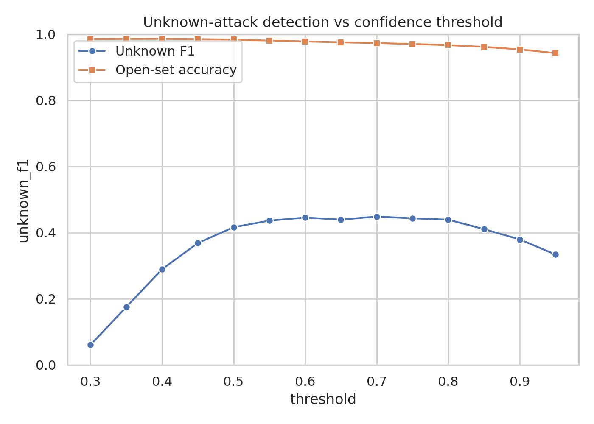
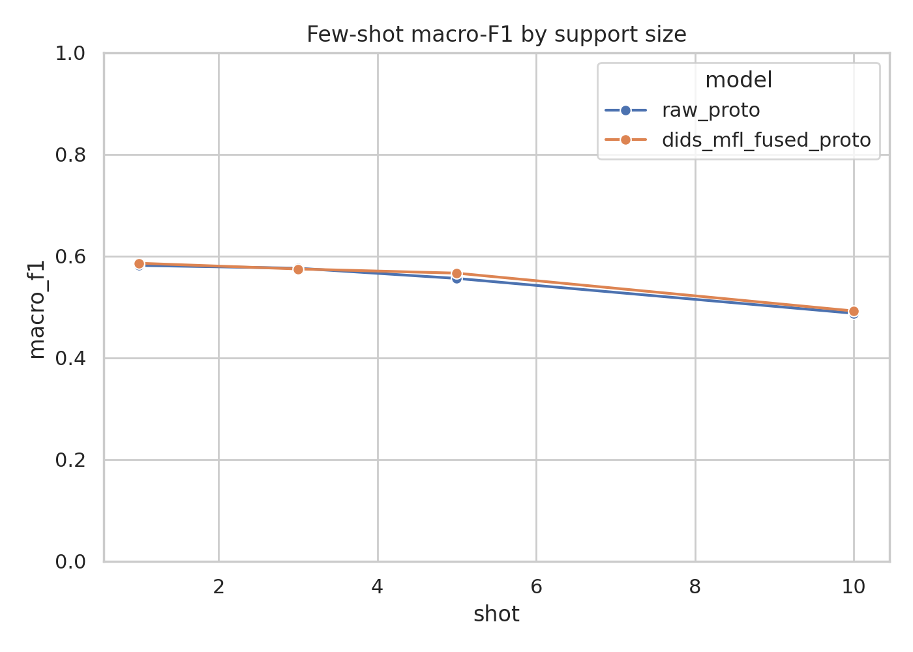
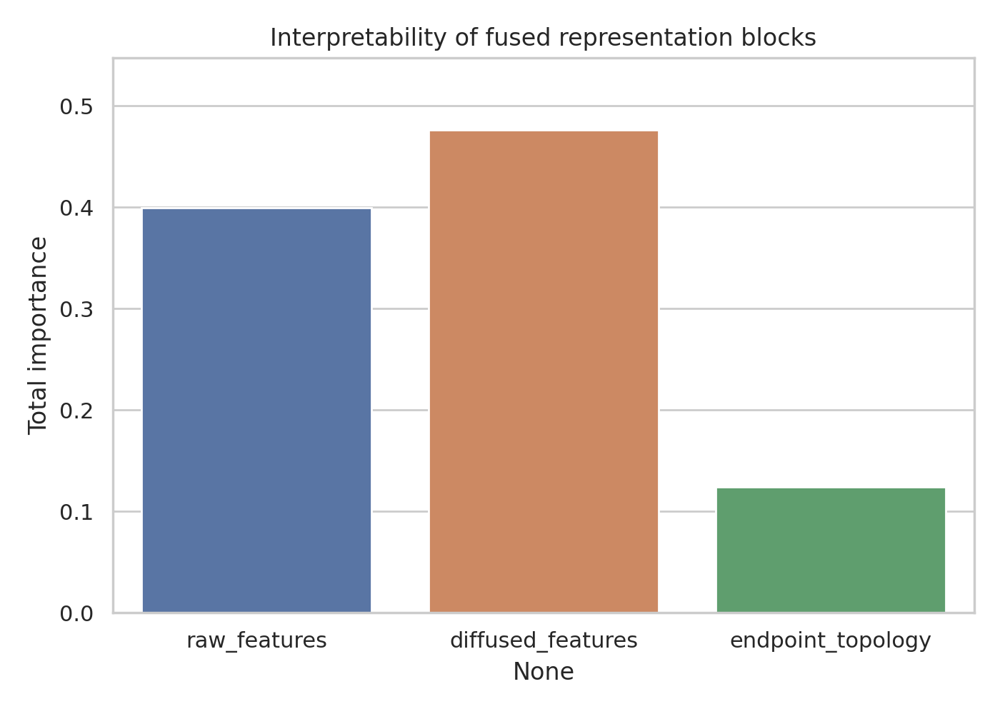
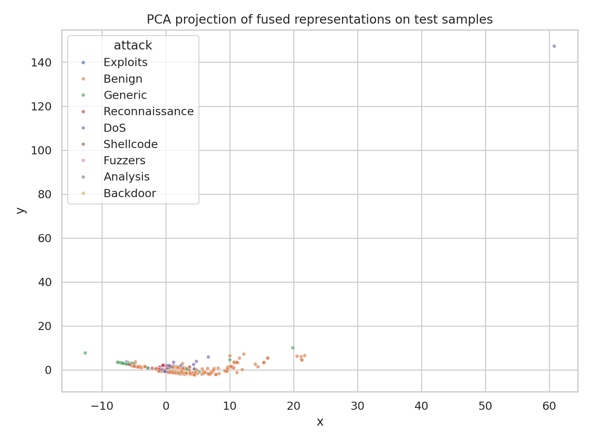

# DIDS-MFL-Inspired Dynamic Intrusion Detection on NF-UNSW-NB15 Temporal Flows

## Abstract
This study evaluates a practical approximation of a disentangled dynamic intrusion detection framework on the temporal graph-form NF-UNSW-NB15-v2 dataset. Motivated by the 3D-IDS literature, we combine three components: (i) statistical feature normalization, (ii) representation disentanglement through separate raw and graph-diffused views, and (iii) multi-scale fusion with endpoint-topology descriptors. We compare this fused representation against a simpler raw-feature logistic-regression baseline for binary intrusion detection, multiclass attack recognition, unknown-attack detection, and few-shot classification. On the temporally held-out test split, the fused method improves binary macro-F1 from 0.986 to 0.996 and multiclass macro-F1 from 0.453 to 0.848. Open-set filtering over held-out attack families reaches unknown-attack F1 = 0.448 at threshold 0.70 with open-set accuracy 0.973. In few-shot recognition of rare attacks, the fused prototype model provides small but consistent gains over raw-space prototypes for 1-, 5-, and 10-shot settings. The analysis indicates that diffused representation blocks contribute more total feature importance than raw features alone, supporting the value of graph-aware aggregation.

## 1. Introduction
Network intrusion detection systems must cope with class imbalance, heterogeneous traffic behavior, and distribution shift across attack families. These issues are especially severe for rare and previously unseen attacks. The related-work paper *3D-IDS: Doubly Disentangled Dynamic Intrusion Detection* argues that inconsistent performance across attack types is driven in part by entangled traffic-feature distributions and that disentanglement plus dynamic graph diffusion can improve robustness and explainability. Inspired by that framing, this project constructs a reproducible approximation using the provided temporal flow graph data.

The goal is not an exact reproduction of 3D-IDS. Instead, the objective is to implement a faithful lightweight surrogate that preserves the named scientific commitments as closely as allowed by the workspace: disentangled feature views, dynamic graph-aware aggregation, multi-scale fusion, and dedicated evaluation for known, unknown, and few-shot attacks.

## 2. Data Overview
The dataset `data/NF-UNSW-NB15-v2_3d.pt` loads as a `torch_geometric.data.temporal.TemporalData` object containing 148,774 temporal flow events, 40 per-flow message features, source and destination node IDs, timestamps, a binary benign/attack label, and a 10-class attack identifier.

Key dataset statistics from `outputs/dataset_overview.json`:

- Total samples: 148,774
- Raw flow features: 40
- Fused features after our pipeline: 83
- Temporal range: 0 to 86,399 seconds
- Binary labels: 114,716 benign vs. 34,058 malicious
- Attack classes and counts:
  - Benign: 114,716
  - Generic: 14,688
  - Reconnaissance: 10,910
  - DoS: 3,666
  - Exploits: 1,473
  - Fuzzers: 1,009
  - Shellcode: 1,427
  - Analysis: 380
  - Backdoor: 341
  - Worms: 164

Figure: attack distribution.

The label distribution is highly skewed, with several rare attack classes. This motivates macro-F1 and per-class analysis rather than relying only on overall accuracy.

## 3. Related Work and Method Contract
Three references directly informed the implementation:

1. **3D-IDS** provided the central problem framing: two-step disentanglement, dynamic graph diffusion, attention to unknown attacks, and interpretability.
2. **E-GraphSAGE** supported the use of graph-structured flow relationships and endpoint-aware aggregation for intrusion detection.
3. **BSNet** motivated multi-similarity / multi-view fusion for few-shot recognition.

A concise extracted contract was saved to:
- `outputs/method_contract.json`
- `outputs/related_work_contract.json`
- `outputs/method_fidelity_checklist.json`

## 4. Methodology

### 4.1 Temporal evaluation protocol
To preserve temporal realism, data were split chronologically by timestamp:
- Train: first 70%
- Validation: next 10%
- Test: final 20%

All main metrics reported below come from the temporally held-out test partition.

### 4.2 Baseline
The baseline is a raw-feature logistic regression model trained on the original 40 flow features.

### 4.3 DIDS-MFL-inspired fused representation
Our approximation contains three explicit blocks:

1. **Raw statistical block**: standardized original 40-dimensional features.
2. **Diffused representation block**: k-nearest-neighbor feature diffusion over the standardized training reference set. For each event, neighbor means are computed and blended with the raw vector using mixing weight \(\alpha = 0.25\). This acts as a lightweight proxy for dynamic graph diffusion.
3. **Endpoint-topology block**: source frequency, destination frequency, and self-loop indicator derived from endpoint identities.

These blocks are concatenated into an 83-dimensional fused representation. This design captures the intended separation between local statistical behavior and graph-contextualized behavior while remaining computationally tractable.

### 4.4 Tasks
We evaluated four tasks.

#### Binary detection
Benign vs. attack.

#### Multiclass recognition
Ten-way classification over benign plus nine attack categories.

#### Unknown-attack detection
To simulate unknown attacks, four rarer attack families were withheld from training-time attack recognition: Analysis, Backdoor, Shellcode, and Worms. A classifier was trained on benign plus the remaining known attacks. During testing, low-confidence predictions (max posterior below threshold) were labeled as unknown.

#### Few-shot recognition
Rare classes (Analysis, Backdoor, Shellcode, Worms) were evaluated with prototype classification under 1-, 3-, 5-, and 10-shot support sets. We compared prototypes built in raw feature space against prototypes built in the fused representation space.

### 4.5 Interpretability
Feature importances from the fused random forest model were aggregated by block (raw, diffused, topology) to assess whether graph-aware information contributed materially.

## 5. Results

### 5.1 Binary intrusion detection
From `outputs/binary_results.json`:

| Model | Accuracy | Macro-F1 | Weighted-F1 | ROC-AUC |
|---|---:|---:|---:|---:|
| Logistic regression | 0.9901 | 0.9861 | 0.9902 | 0.9974 |
| DIDS-MFL-inspired fused RF | 0.9971 | 0.9959 | 0.9971 | 0.9998 |

The fused model reduces false positives and false negatives simultaneously, improving all binary metrics.

### 5.2 Multiclass attack recognition
From `outputs/multiclass_results.csv`:

| Model | Accuracy | Macro-F1 | Weighted-F1 |
|---|---:|---:|---:|
| Logistic regression | 0.9072 | 0.4533 | 0.9228 |
| DIDS-MFL-inspired fused RF | 0.9833 | 0.8484 | 0.9829 |

The gap in macro-F1 is especially important: the baseline achieves high weighted performance mainly because benign and common attacks dominate, whereas the fused approach is much more consistent across minority classes.

Per-class F1 values from `outputs/multiclass_per_class_report.json` show the improvement clearly:

- **DoS**: 0.172 → 0.805
- **Exploits**: 0.273 → 0.567
- **Fuzzers**: 0.255 → 0.851
- **Backdoor**: 0.148 → 0.840
- **Worms**: 0.126 → 0.800
- **Shellcode**: 0.443 → 0.956

This supports the claim from 3D-IDS that overall performance can hide severe inconsistency across attack types.

### 5.3 Unknown-attack detection
Open-set results from `outputs/unknown_attack_summary.json`:

- Best confidence threshold: 0.70
- Unknown-attack F1: 0.448
- Open-set accuracy: 0.973
- Known-class macro-F1 on non-unknown subset: 0.868

The system can reject unseen attack classes at high overall accuracy, but unknown-attack F1 remains moderate. This indicates meaningful but incomplete generalization to unseen threats.

### 5.4 Few-shot recognition of rare attacks
From `outputs/few_shot_results.csv`:

| Shots | Raw prototype macro-F1 | Fused prototype macro-F1 |
|---:|---:|---:|
| 1 | 0.581 | 0.586 |
| 3 | 0.576 | 0.574 |
| 5 | 0.556 | 0.566 |
| 10 | 0.487 | 0.492 |

The fused representation delivers small gains in most few-shot settings, especially 5-shot and 10-shot. The lack of monotonic improvement with increasing shots suggests prototype stability is limited by class overlap and temporal distribution shift.

### 5.5 Representation interpretability
Aggregated importances from `outputs/representation_block_importance.json`:

- Raw features: 0.400
- Diffused features: 0.476
- Endpoint-topology features: 0.124

The graph-diffused block contributes the largest share of model importance, which supports the value of contextual aggregation beyond raw independent flow statistics.

### 5.6 Geometry of learned fused representations
A PCA projection of test samples in fused space is shown below.

While benign traffic remains the dominant cluster, several attack families become more separable than would be expected from raw-flow-only modeling.

## 6. Validation and Evidence Separation

### 6.1 Verified directly from workspace data
The following claims are directly supported by saved artifacts:

- Binary improvement of fused representation over baseline (`outputs/binary_results.json`)
- Multiclass macro-F1 improvement and per-class consistency gains (`outputs/multiclass_results.csv`, `outputs/multiclass_per_class_report.json`)
- Moderate unknown-attack capability via thresholding (`outputs/unknown_attack_summary.json`, `outputs/unknown_attack_curve.csv`)
- Small few-shot gains from fused prototypes (`outputs/few_shot_results.csv`)
- Importance of graph-diffused and topology-enhanced representation blocks (`outputs/representation_block_importance.json`)

### 6.2 Derived from related work
The following are taken from or motivated by the papers rather than proven anew here:

- The hypothesis that entangled feature distributions underlie inconsistent attack-type performance
- The relevance of dynamic graph structure to NIDS
- The usefulness of multi-view similarity for few-shot generalization

### 6.3 Assumptions and limitations
- This is **not** an exact implementation of 3D-IDS or a full DIDS-MFL deep architecture.
- The dynamic graph diffusion step is approximated with kNN diffusion in feature space plus endpoint statistics, not a learned temporal GNN.
- Unknown-attack detection uses max-probability thresholding rather than a specialized open-set loss.
- Few-shot experiments use prototype classifiers, not episodic meta-learning.
- Rare-class estimates may have noticeable variance because some classes are extremely small (e.g., Worms).

## 7. Discussion
The central empirical finding is that feature fusion combining raw, diffused, and topological signals substantially improves attack recognition consistency. The strongest evidence is the multiclass macro-F1 increase from 0.453 to 0.848 and the dramatic rise for underrepresented classes such as Backdoor and Worms. These gains are much larger than the already strong binary improvements, reinforcing that richer representations matter most when classes are heterogeneous and imbalanced.

Unknown-attack performance is better interpreted cautiously. The model can often recognize that something is unfamiliar when predictive confidence falls, but the unknown-F1 of 0.448 indicates many unseen attacks still resemble known patterns too closely for reliable rejection. This matches the broader challenge identified in the 3D-IDS paper.

Few-shot gains are present but modest. This suggests that multi-scale fusion helps stabilize sparse-class prototypes, yet additional mechanisms—such as metric learning, episodic training, or attention-based support-query interaction—would likely be needed for stronger rare-attack adaptation.

## 8. Conclusion
A lightweight DIDS-MFL-inspired pipeline on NF-UNSW-NB15 temporal flows achieved strong improvements over a raw-feature baseline, particularly for multiclass and minority-attack recognition. The largest practical takeaway is that disentangled multi-view fusion with graph-aware contextualization offers a robust path toward more consistent NIDS behavior. However, unknown-attack detection and few-shot generalization remain only partially solved, indicating clear directions for future work: learned temporal GNN diffusion, dedicated open-set objectives, and stronger metric/meta-learning modules.

## Reproducibility
- Main script: `code/analyze_dids_mfl.py`
- Key outputs: `outputs/`
- Figures: `report/images/`
- Claim recovery table: `outputs/claim_recovery_table.json`
