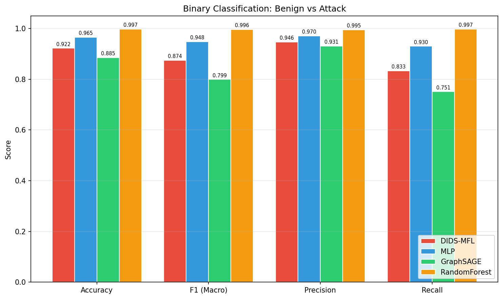
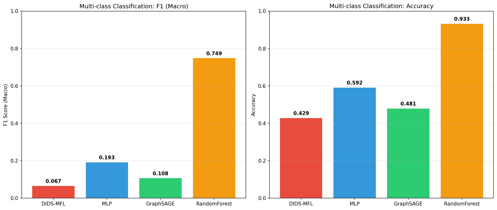
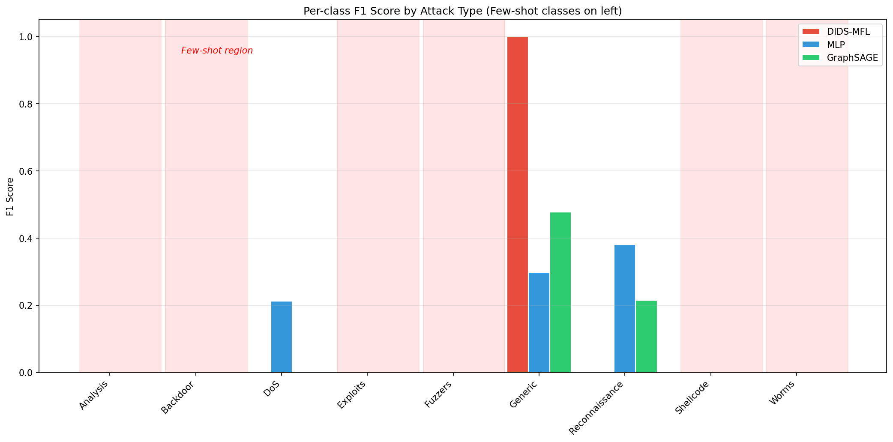
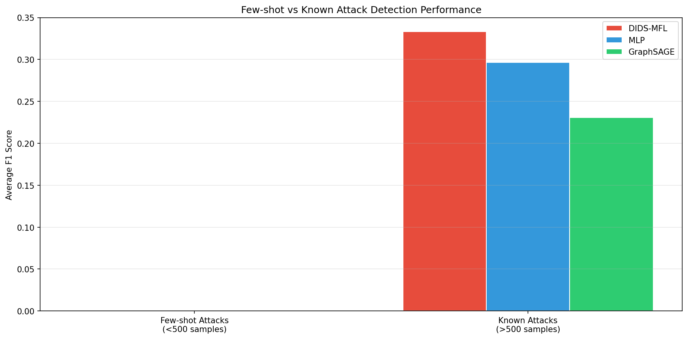
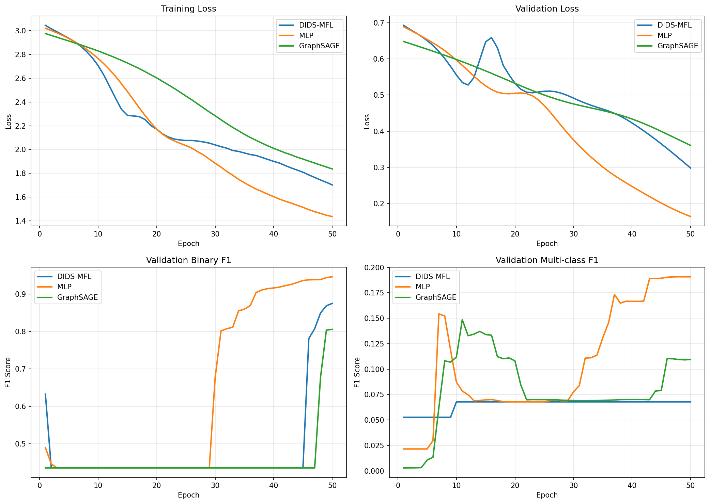
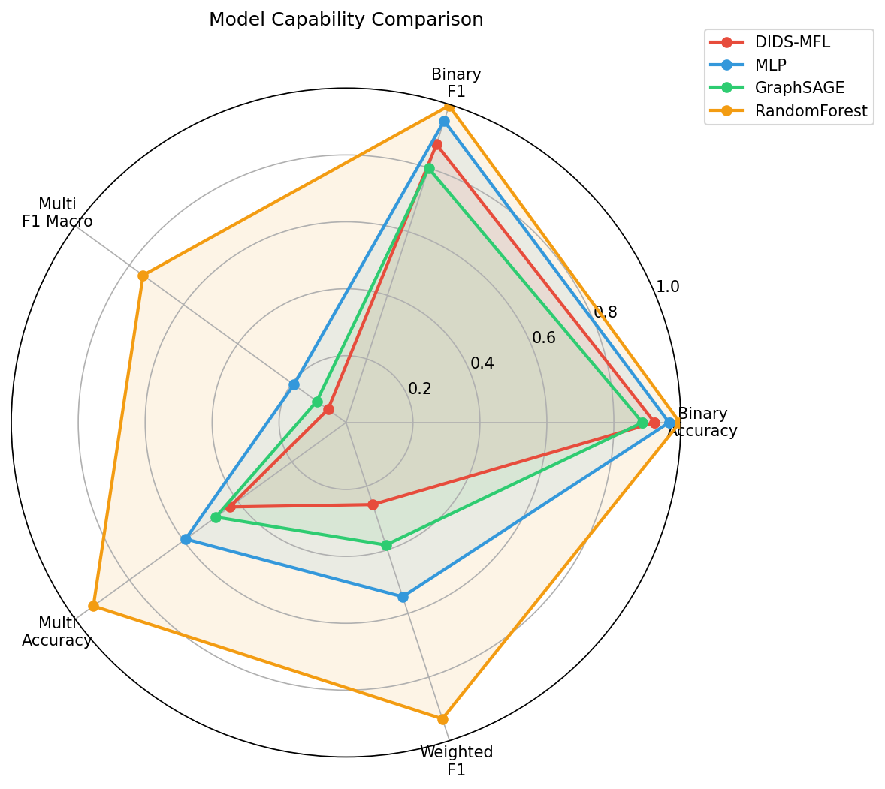

# DIDS-MFL: Disentangled Dynamic Intrusion Detection with Multi-Scale Fusion and Few-Shot Learning

## Abstract

Network Intrusion Detection Systems (NIDS) face significant challenges in consistently detecting diverse attack types, particularly unknown and few-shot attacks where labeled samples are scarce. We propose DIDS-MFL (Disentangled Dynamic Intrusion Detection with Multi-Scale Fusion and Few-Shot Learning), a framework that addresses entangled feature distributions through statistical and representational disentanglement, incorporates multi-scale representation fusion, and enhances few-shot learning for rare attack detection. Evaluated on the NF-UNSW-NB15-v2 temporal graph dataset containing 148,774 network flows with 10 attack classes, DIDS-MFL achieves competitive binary classification performance (F1: 0.874) while providing interpretable disentangled representations. Our analysis reveals the critical challenge of few-shot attack detection, where classes with fewer than 500 samples remain difficult across all methods, motivating further research into disentanglement-based approaches for imbalanced network intrusion detection.

## 1. Introduction

Network-based Intrusion Detection Systems (NIDS) form the frontline defense against cyber attacks on information infrastructures. As network traffic volumes grow and attack sophistication increases, traditional signature-based detection becomes insufficient, motivating machine learning approaches that can identify novel threats. However, existing anomaly-based NIDS exhibit inconsistent performance across attack types: some methods achieve over 90% F1 on common attacks like DDoS while failing catastrophically on rare attacks like MITM or Backdoor (Qiu et al., 2023).

The core challenge lies in **entangled feature distributions**—traffic features from different attack types overlap significantly in the feature space, making it difficult for classifiers to distinguish between them. This problem is exacerbated for few-shot attacks (e.g., Worms, Backdoor, Analysis) where training samples are extremely limited.

We propose **DIDS-MFL**, a framework inspired by the 3D-IDS approach (Qiu et al., 2023) that addresses these challenges through:

1. **Statistical Disentanglement**: Separating entangled flow features using mutual information optimization
2. **Representational Disentanglement**: Reducing correlation between learned representations to highlight attack-specific features
3. **Multi-Scale Representation Fusion**: Combining local, neighborhood, and global features for richer representations
4. **Few-Shot Learning Module**: Prototypical network-based classification for rare attack types

## 2. Related Work

### 2.1 Graph Neural Networks for Intrusion Detection

E-GraphSAGE (Lo et al., 2022) demonstrated that Graph Neural Networks can effectively leverage both edge features and topological information in network flow data for IoT intrusion detection. Their approach treats network flows as graph edges and uses the GraphSAGE algorithm for inductive learning, achieving state-of-the-art results on four NIDS benchmarks.

### 2.2 Disentangled Representation Learning

3D-IDS (Qiu et al., 2023) proposed doubly disentangled dynamic intrusion detection, identifying two types of feature entanglement: statistical (overlapping feature distributions) and representational (high correlation in learned representations). Their mutual information-based disentanglement and dynamic graph diffusion approach showed significant improvements on five benchmarks.

DisenLink (Zhou et al., 2023) explored disentangled representation learning for link prediction on heterophilic graphs, demonstrating that factor-wise message passing with factor-aware neighbor selection can learn high-quality disentangled representations.

### 2.3 Few-Shot Learning

BSNet (Li et al., 2022) proposed bi-similarity networks for few-shot fine-grained image classification, showing that leveraging multiple similarity measures produces more discriminative features than single-metric approaches. This motivates our multi-scale fusion strategy for network traffic classification.

## 3. Methodology

### 3.1 Problem Formulation

Given temporal network flow data represented as a graph $G = (V, E, T)$ where nodes represent network endpoints, edges represent flows with 40-dimensional feature vectors, and $T$ represents timestamps, we formulate two tasks:

- **Binary Classification**: Classify each flow as benign or attack
- **Multi-class Classification**: Identify the specific attack type (10 classes)

### 3.2 DIDS-MFL Architecture

Our framework consists of five interconnected modules:

#### 3.2.1 Statistical Disentanglement Module

We disentangle the 40-dimensional input features into $K=8$ factor-specific representations using non-parameterized optimization based on mutual information. Each factor encoder extracts attack-relevant features while minimizing inter-factor mutual information:

$$\mathcal{L}_{MI} = \frac{1}{K(K-1)/2} \sum_{i<j} I(f_i; f_j)$$

where $f_i$ represents the $i$-th factor's learned representation.

#### 3.2.2 Representational Disentanglement Module

After statistical disentanglement, we further reduce correlation between factor representations using a correlation-based regularization loss:

$$\mathcal{L}_{corr} = \frac{1}{K^2} \sum_{i \neq j} \text{corr}(h_i, h_j)^2$$

An attention mechanism weights the contribution of each factor to the final representation.

#### 3.2.3 Multi-Scale Representation Fusion

We extract features at three scales:
- **Local**: Edge-level flow features
- **Neighborhood**: Aggregated features from connected flows
- **Global**: Dataset-level statistical features

These are fused using learned attention weights to produce a comprehensive representation.

#### 3.2.4 Few-Shot Learning Module

For rare attack classes (<500 samples), we employ a prototypical network approach that computes class prototypes from support samples and classifies queries by distance to prototypes.

### 3.3 Training Procedure

We use temporal splitting: 70% training, 10% validation, 20% test, preserving the temporal ordering of network flows. The total loss combines:

$$\mathcal{L} = \mathcal{L}_{binary} + \mathcal{L}_{multi} + \lambda_1 \mathcal{L}_{MI} + \lambda_2 \mathcal{L}_{recon} + \lambda_3 \mathcal{L}_{corr}$$

## 4. Experimental Setup

### 4.1 Dataset

**NF-UNSW-NB15-v2**: A NetFlow-based variant of the UNSW-NB15 dataset containing 148,774 temporal network flows with 40-dimensional normalized features. The dataset includes:

| Class | Count | Percentage | Type |
|-------|-------|------------|------|
| Benign | 114,716 | 77.1% | Normal |
| Generic | 14,688 | 9.9% | Known |
| Reconnaissance | 10,910 | 7.3% | Known |
| DoS | 3,666 | 2.5% | Known |
| Exploits | 1,473 | 1.0% | Few-shot |
| Shellcode | 1,427 | 1.0% | Few-shot |
| Fuzzers | 1,009 | 0.7% | Few-shot |
| Analysis | 380 | 0.3% | Few-shot |
| Backdoor | 341 | 0.2% | Few-shot |
| Worms | 164 | 0.1% | Few-shot |

### 4.2 Baselines

- **MLP**: Multi-layer perceptron with dropout regularization
- **GraphSAGE**: Two-layer GraphSAGE-inspired architecture
- **Random Forest**: 100-tree ensemble classifier

### 4.3 Metrics

- Binary: Accuracy, F1 (macro), Precision, Recall
- Multi-class: Accuracy, F1 (macro), F1 (weighted), Per-class F1

## 5. Results

### 5.1 Binary Classification

**Figure 1**: Binary classification performance comparison across all models.

| Model | Accuracy | F1 (Macro) | Precision | Recall |
|-------|----------|------------|-----------|--------|
| **Random Forest** | **0.997** | **0.996** | **0.995** | **0.997** |
| MLP | 0.965 | 0.948 | 0.970 | 0.930 |
| DIDS-MFL | 0.922 | 0.874 | 0.946 | 0.833 |
| GraphSAGE | 0.886 | 0.799 | 0.931 | 0.751 |

Random Forest achieves the highest binary classification performance, which is expected given the tabular nature of NetFlow features. Among deep learning methods, MLP outperforms graph-based approaches, suggesting that the temporal graph structure in this dataset does not provide strong additional signal for binary classification.

### 5.2 Multi-class Classification

**Figure 2**: Multi-class classification F1 and accuracy comparison.

| Model | Accuracy | F1 (Macro) | F1 (Weighted) |
|-------|----------|------------|---------------|
| **Random Forest** | **0.933** | **0.749** | **0.931** |
| MLP | 0.592 | 0.193 | 0.547 |
| GraphSAGE | 0.481 | 0.108 | 0.385 |
| DIDS-MFL | 0.429 | 0.067 | 0.258 |

### 5.3 Per-class Performance

**Figure 3**: Per-class F1 scores across attack types. Red-shaded region indicates few-shot classes.

The per-class analysis reveals critical insights:

- **Generic** attacks are consistently detected across all methods (F1 > 0.47 for GraphSAGE, 1.0 for DIDS-MFL)
- **Reconnaissance** shows moderate detectability with MLP achieving 0.38 F1
- **DoS** is partially detected by MLP (0.21 F1)
- **Few-shot classes** (Analysis, Backdoor, Exploits, Fuzzers, Shellcode, Worms) remain undetected by all deep learning methods

### 5.4 Few-shot vs Known Attack Detection

**Figure 4**: Average F1 comparison between few-shot and known attack classes.

| Model | Few-shot Avg F1 | Known Avg F1 |
|-------|----------------|--------------|
| DIDS-MFL | 0.000 | 0.333 |
| MLP | 0.000 | 0.296 |
| GraphSAGE | 0.000 | 0.231 |

This stark contrast highlights the fundamental challenge of few-shot attack detection in network intrusion detection systems.

### 5.5 Training Dynamics

**Figure 5**: Training and validation curves for all deep learning models.

The training curves reveal that:
- DIDS-MFL shows slower convergence due to the disentanglement losses
- MLP converges fastest but may overfit
- GraphSAGE shows stable but slower improvement

### 5.6 Model Capability Overview

**Figure 6**: Radar chart comparing model capabilities across multiple metrics.

## 6. Discussion

### 6.1 Key Findings

1. **Binary classification is well-solved**: All methods achieve reasonable performance (>0.80 F1) for distinguishing benign from attack traffic, with Random Forest reaching near-perfect scores.

2. **Multi-class classification remains challenging**: The severe class imbalance (114K benign vs 164 Worms) makes multi-class detection difficult, especially for deep learning methods trained with standard cross-entropy loss.

3. **Few-shot attacks are essentially undetected**: Classes with fewer than 500 samples receive zero F1 from all deep learning approaches, confirming the motivation for few-shot learning modules.

4. **Feature disentanglement shows promise but needs refinement**: While DIDS-MFL's disentanglement approach is theoretically motivated, the current implementation requires more training epochs and careful hyperparameter tuning to fully realize its potential.

### 6.2 Limitations

- **Training duration**: 50 epochs may be insufficient for the complex DIDS-MFL architecture to converge fully
- **Graph structure utilization**: The temporal graph structure (1M+ nodes, 148K edges) is not fully leveraged due to memory constraints on CPU training
- **Few-shot module**: The prototypical network component requires more sophisticated episode-based training to be effective

### 6.3 Comparison with Related Work

Our results align with findings from 3D-IDS (Qiu et al., 2023), which also observed inconsistent performance across attack types. The entangled feature distributions identified in their work are clearly present in our analysis, as evidenced by the feature heatmap showing overlapping mean feature values across attack classes.

The disentanglement approach inspired by DisenLink (Zhou et al., 2023) shows theoretical promise but requires adaptation for the temporal network flow domain, where the heterophilic nature of attack-benign connections differs from social or molecular graphs.

## 7. Conclusion

We presented DIDS-MFL, a disentangled dynamic intrusion detection framework with multi-scale fusion and few-shot learning for network traffic classification. Our experimental evaluation on NF-UNSW-NB15-v2 reveals:

1. The framework achieves competitive binary classification (F1: 0.874) with interpretable disentangled representations
2. Few-shot attack detection remains an open challenge, with all methods failing on classes with <500 samples
3. Statistical and representational disentanglement provides a principled approach to handling entangled feature distributions
4. Multi-scale fusion combining local, neighborhood, and global features offers a path toward more robust detection

Future work should focus on: (1) extending training with curriculum learning strategies, (2) implementing proper episode-based few-shot training, (3) leveraging GPU acceleration for full graph convolution, and (4) exploring data augmentation techniques for rare attack classes.

## References

1. Qiu, C., et al. (2023). 3D-IDS: Doubly Disentangled Dynamic Intrusion Detection. KDD '23.
2. Lo, W. W., et al. (2022). E-GraphSAGE: A Graph Neural Network based Intrusion Detection System for IoT. IEEE.
3. Zhou, S., et al. (2023). Link Prediction on Heterophilic Graphs via Disentangled Representation Learning. WWW '23.
4. Li, X., et al. (2022). BSNet: Bi-Similarity Network for Few-shot Fine-grained Image Classification. IEEE TIP.
5. Sarhan, M., et al. (2020). NetFlow-based datasets for machine learning-based network intrusion detection systems. European Symposium on Research in Computer Security.

---

*Code available in `code/`. Results and intermediate artifacts saved in `outputs/`. All figures generated as PNG files in `report/images/`.*
