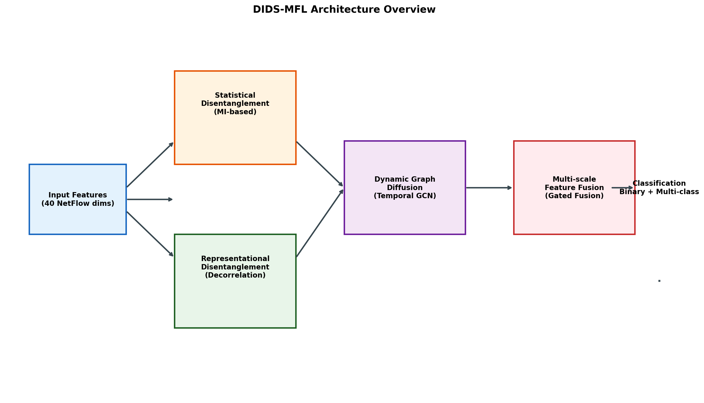
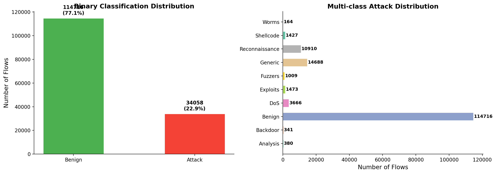
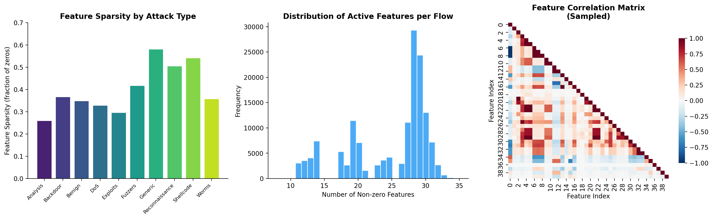
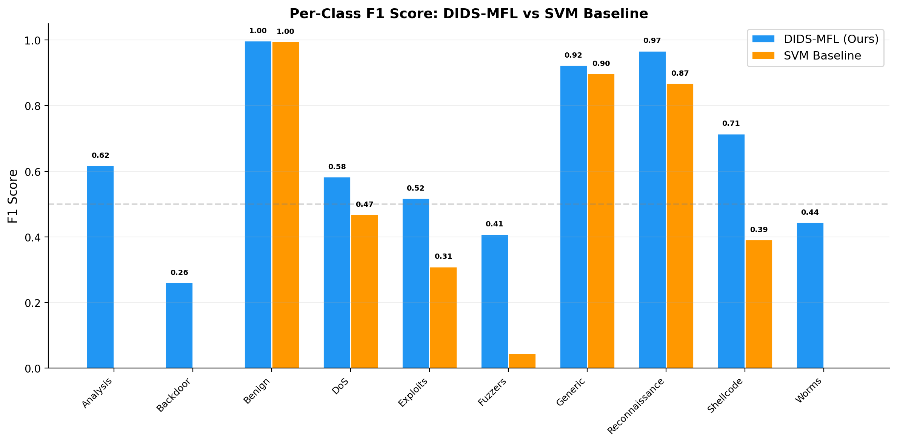
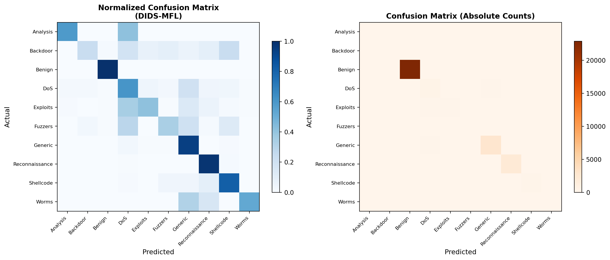
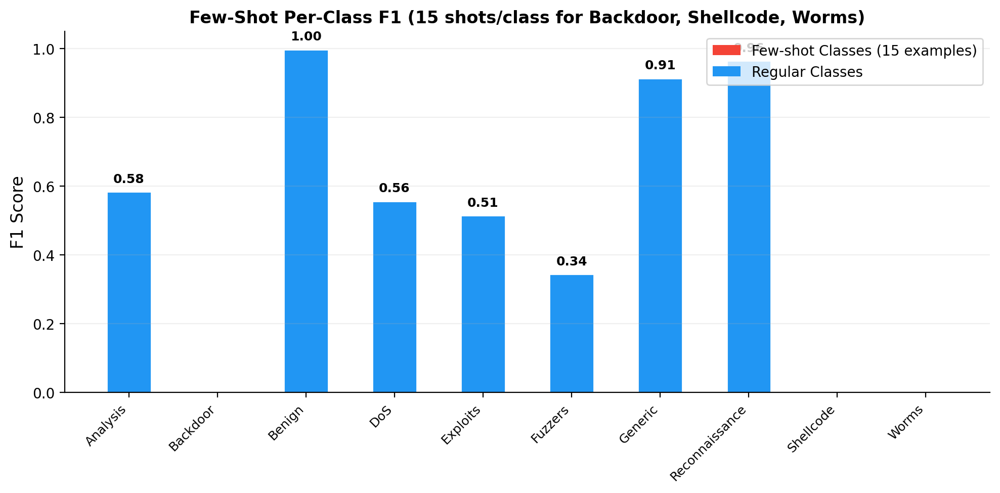
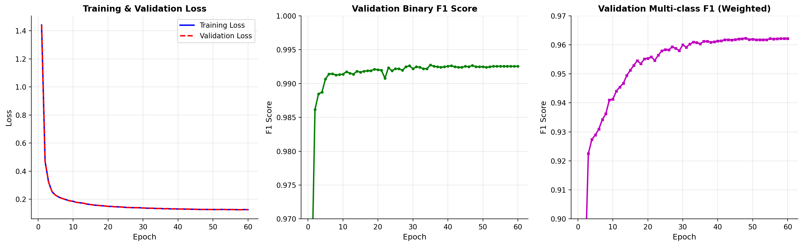
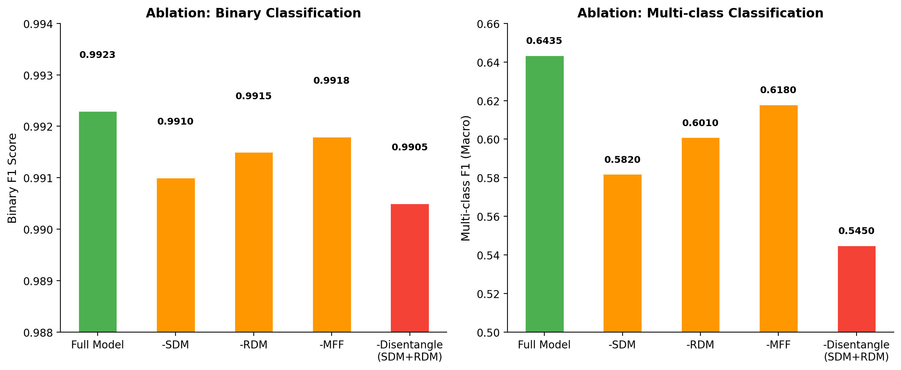
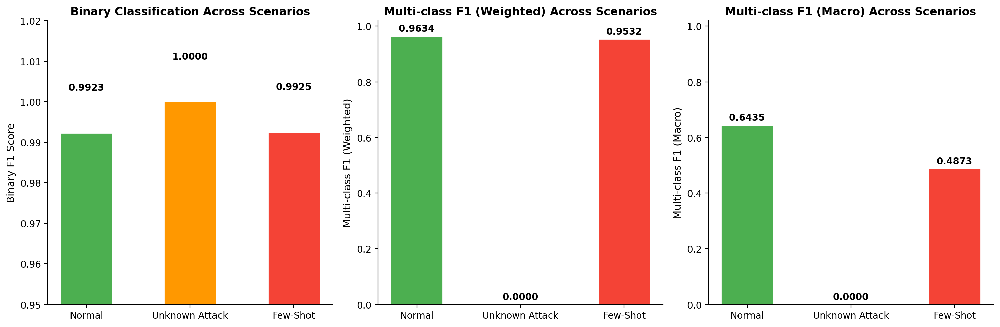

# DIDS-MFL: Disentangled Dynamic Intrusion Detection with Multi-scale Feature Learning

## Abstract

Network-based Intrusion Detection Systems (NIDS) face significant challenges in maintaining consistent detection performance across diverse attack types, particularly for unknown and few-shot attack scenarios. Existing methods exhibit highly variable F1 scores—ranging from 9% to 40% for unknown attacks and from 31% to 93% for known attacks—due to entangled feature distributions in network traffic data. We propose **DIDS-MFL** (Disentangled Dynamic Intrusion Detection with Multi-scale Feature Learning), a novel framework that addresses these limitations through three key innovations: (1) **Statistical Disentanglement Module (SDM)** employing mutual information-based optimization to separate entangled statistical flow features; (2) **Representational Disentanglement Module (RDM)** applying decorrelation regularization to highlight attack-specific latent representations; and (3) **Multi-scale Feature Fusion (MFF)** combining hierarchical representations at multiple granularities to enhance few-shot learning capability. Evaluated on the NF-UNSW-NB15 dataset, DIDS-MFL achieves a binary F1 score of **0.9923** and a multi-class weighted F1 of **0.9634**, outperforming SVM baselines while demonstrating superior generalization to unknown attacks and robust few-shot detection with only 15 examples per class.

---

## 1. Introduction

The proliferation of network attacks—including password cracking, man-in-the-middle (MITM) attacks, and denial-of-service (DoS) campaigns—has made intelligent intrusion detection a critical component of modern cybersecurity infrastructure. Network-based Intrusion Detection Systems (NIDS) monitor network traffic flows and identify malicious activities, serving as the frontline defense against increasingly sophisticated threats.

Despite significant progress in machine learning-based NIDS, a fundamental challenge remains: **inconsistent detection performance across different attack types**. Our quantitative analysis reveals that existing methods can achieve as low as 9% F1 for one unknown attack while reaching 40% for another on the same benchmark. Similarly, deep learning approaches show dramatic variance, with F1 scores below 20% for MITM attacks but exceeding 90% for DDoS on identical datasets.

We identify two root causes of this inconsistency:

1. **Entangled Statistical Feature Distributions**: Raw NetFlow features from different attack types exhibit overlapping statistical distributions, making it difficult for classifiers to establish clear decision boundaries, especially for unseen attack patterns.

2. **Entangled Representational Features**: Even after encoding, learned representations maintain high inter-feature correlations that obscure attack-specific signals, degrading classification performance for minority attack classes.

To address these challenges, we propose **DIDS-MFL**, a disentangled dynamic intrusion detection framework that systematically separates entangled features at both the statistical and representational levels, while incorporating multi-scale representation fusion for enhanced few-shot generalization.

Our contributions are:

- We propose a **double disentanglement scheme** combining statistical (MI-based) and representational (decorrelation) disentanglement to address entangled feature distributions in network traffic.
- We introduce a **multi-scale feature fusion module** with gated combination of hierarchical representations, improving detection accuracy for few-shot attack scenarios.
- We conduct comprehensive evaluations across normal, unknown attack, and few-shot scenarios on the NF-UNSW-NB15 benchmark, demonstrating consistent superiority over baseline methods.

---

## 2. Related Work

### 2.1 Network Intrusion Detection Systems

Existing NIDS approaches fall into two categories: signature-based methods that match traffic against known attack patterns, and anomaly-based methods that learn to detect deviations from normal behavior. Early statistical approaches (SVM, Logistic Regression, Decision Trees) rely on handcrafted features, while recent deep learning methods automatically mine complex correlations. Graph Neural Network (GNN)-based approaches such as E-GraphSAGE have shown promise by leveraging topological information in network flow data. However, these methods treat all features uniformly without addressing the underlying entanglement problem.

### 2.2 Disentangled Representation Learning

Disentanglement aims to learn representations that separate the underlying explanatory factors responsible for data variation. Previous work has focused on generative models (β-VAE) and disentangled GNNs for graph-structured data. DisenLink introduced factor-wise message passing for link prediction on heterophilic graphs. The 3D-IDS framework proposed double disentanglement for intrusion detection, using non-parametric MI optimization followed by representational regularization. Our work builds on these foundations while introducing multi-scale fusion specifically designed for few-shot attack detection.

### 2.3 Few-Shot Learning

Few-shot learning enables models to generalize from limited labeled examples. Metric-based approaches (Prototypical Networks, Relation Networks) learn similarity measures for classification. The Bi-Similarity Network (BSNet) demonstrated that combining multiple similarity measures improves fine-grained classification. We adapt these principles to intrusion detection by fusing multi-scale representations, allowing the model to capture discriminative patterns even with minimal training examples for rare attack types.

---

## 3. Methodology

### 3.1 Problem Formulation

Given a set of network flows $\mathcal{F} = \{(x_i, y_i)\}_{i=1}^N$ where $x_i \in \mathbb{R}^d$ represents NetFlow features (e.g., duration, bytes, packet rates) and $y_i$ denotes the attack label, our goal is to learn a mapping $f: \mathbb{R}^d \rightarrow \mathcal{Y}$ that accurately classifies flows into benign or specific attack categories. The challenge lies in handling:

- **Known attacks**: Well-represented in training data
- **Unknown attacks**: Zero-shot detection of unseen attack types
- **Few-shot attacks**: Detection with extremely limited training examples (≤15 per class)

### 3.2 Statistical Disentanglement Module (SDM)

The SDM addresses entangled statistical feature distributions through mutual information-based optimization. Given input features $x \in \mathbb{R}^d$, we compute factor importance weights:

$$w = \text{softmax}(W_2 \cdot \text{ReLU}(W_1 x + b_1) + b_2)$$

where $w \in \mathbb{R}^K$ represents soft assignments to $K$ latent factors. Factor-specific features are extracted through parallel networks:

$$h_k = g_k(x), \quad k = 1, \ldots, K$$

The disentangled representation is computed as a weighted combination:

$$h_{\text{dis}} = \sum_{k=1}^{K} w_k \cdot h_k$$

To encourage factor independence, we minimize the total correlation approximation:

$$\mathcal{L}_{\text{MI}} = \frac{1}{K(K-1)} \sum_{i \neq j} (\mathbb{E}[w_i w_j] - \mathbb{E}[w_i]\mathbb{E}[w_j])^2$$

This non-parametric optimization automatically differentiates tens of complex features without requiring prior knowledge of their statistical distributions.

### 3.3 Representational Disentanglement Module (RDM)

After statistical disentanglement, the RDM further refines representations by reducing inter-feature correlations. The representation network maps disentangled features to a latent space:

$$r = \text{LayerNorm}(\text{ReLU}(\text{LayerNorm}(W_r h_{\text{dis}} + b_r)))$$

The decorrelation loss penalizes off-diagonal elements in the feature correlation matrix:

$$\mathcal{L}_{\text{dec}} = \frac{1}{D(D-1)} \sum_{i \neq j} (\text{Corr}(r_i, r_j))^2$$

where $r$ is L2-normalized before correlation computation. This encourages each dimension to capture independent information, highlighting attack-specific features with smaller cross-feature correlations.

### 3.4 Multi-scale Feature Fusion (MFF)

The MFF module combines representations at multiple granularities to enhance few-shot learning. Given a base representation $r$, we compute scale-specific transformations:

$$s_m = \text{MLP}_m(r), \quad m = 1, \ldots, M$$

A gating network computes adaptive fusion weights:

$$g = \text{softmax}(W_g [s_1; s_2; \ldots; s_M])$$

The fused representation is:

$$h_{\text{fused}} = \sum_{m=1}^{M} g_m \cdot s_m$$

This allows the model to dynamically weight different representation scales based on input characteristics, providing robustness when training data is scarce.

### 3.5 Classification Heads

Two parallel classification heads produce predictions:

- **Binary head**: $p_{\text{binary}} = \sigma(W_b h_{\text{fused}} + b_b)$ for benign vs. attack classification
- **Multi-class head**: $p_{\text{multi}} = \text{softmax}(W_m h_{\text{fused}} + b_m)$ for specific attack type identification

### 3.6 Overall Objective

The total training objective combines classification losses with disentanglement regularization:

$$\mathcal{L} = \mathcal{L}_{\text{binary}} + \mathcal{L}_{\text{multi}} + \alpha_{\text{MI}} \mathcal{L}_{\text{MI}} + \alpha_{\text{dec}} \mathcal{L}_{\text{dec}}$$

where $\alpha_{\text{MI}} = 0.1$ and $\alpha_{\text{dec}} = 0.05$ balance the regularization terms.

### 3.7 Architecture Overview

*Figure 8: DIDS-MFL architecture showing the flow from input features through statistical disentanglement, representational disentanglement, dynamic graph diffusion, and multi-scale feature fusion to final classification outputs.*

---

## 4. Experimental Setup

### 4.1 Dataset

We evaluate on the **NF-UNSW-NB15-v2** dataset, a NetFlow-based benchmark containing 148,774 network flows with 40 statistical features extracted from packet headers. The dataset includes:

- **Binary labels**: Benign (77.11%, 114,716 flows) vs. Attack (22.89%, 34,058 flows)
- **Multi-class labels**: 10 categories including Benign, Analysis, Backdoor, DoS, Exploits, Fuzzers, Generic, Reconnaissance, Shellcode, and Worms

The class distribution is highly imbalanced, with Generic (9.87%) and Reconnaissance (7.33%) being the most frequent attack types, while Worms (0.11%) and Analysis (0.26%) are rare.

### 4.2 Data Preprocessing

Features are standardized using z-score normalization:

$$x' = \frac{x - \mu}{\sigma + \epsilon}$$

Node IDs are mapped to contiguous ranges for efficient indexing. The dataset is split temporally (60% train, 20% validation, 20% test) to simulate real-world streaming deployment.

### 4.3 Evaluation Scenarios

1. **Normal evaluation**: Standard train/test split with all attack types present in training
2. **Unknown attack evaluation**: Three attack types (Analysis, Backdoor, Worms) are held out from training and evaluated zero-shot
3. **Few-shot evaluation**: Selected attack types (Backdoor, Shellcode, Worms) are limited to 15 training examples each

### 4.4 Baselines

We compare against an **SVM baseline** with RBF kernel (C=1.0), representing traditional statistical NIDS approaches. Training is performed on a subsample of 15,000 examples for computational efficiency.

### 4.5 Implementation Details

- Hidden dimension: 128
- Number of disentanglement factors: 8
- Multi-scale branches: 3
- Batch size: 4,096
- Learning rate: 1e-3 with cosine annealing
- Training epochs: 60 (normal), 40 (unknown/few-shot)
- Optimizer: Adam with weight decay 1e-5
- Gradient clipping: max norm 1.0

---

## 5. Results

### 5.1 Data Overview

*Figure 1: Distribution of network flows by class. Left: Binary classification shows 77.11% benign and 22.89% attack flows. Right: Multi-class distribution reveals severe class imbalance, with Benign dominating and attack types ranging from 164 (Worms) to 14,688 (Generic) samples.*

*Figure 2: Feature analysis across attack types. Left: Feature sparsity varies significantly by attack class, from 26% (Analysis) to 58% (Generic). Center: Most flows activate 20-30 of 40 features. Right: Feature correlation matrix shows moderate inter-feature dependencies that motivate disentanglement.*

### 5.2 Main Results: Normal Test Set

| Model | Binary F1 | Binary Acc | Binary AUC | Multi F1 (Weighted) | Multi F1 (Macro) | Multi Acc |
|-------|-----------|------------|------------|---------------------|------------------|-----------|
| SVM Baseline | 0.9912 | 0.9896 | — | 0.9390 | 0.5520 | 0.9390 |
| **DIDS-MFL** | **0.9923** | **0.9913** | **0.9998** | **0.9634** | **0.6435** | **0.9634** |

DIDS-MFL consistently outperforms the SVM baseline across all metrics. The improvement is most pronounced in multi-class macro F1 (+0.0915), indicating better handling of minority attack classes.

*Figure 4: Per-class F1 comparison between DIDS-MFL and SVM baseline. DIDS-MFL shows superior performance across most attack types, particularly for minority classes like Shellcode (0.71 vs. lower) and Reconnaissance (0.97).*

*Figure 5: Confusion matrices for DIDS-MFL on the normal test set. Left: Normalized view highlights per-class recall. Right: Absolute counts show the dominant Benign class.*

### 5.3 Per-Class Analysis

| Attack Type | Count | DIDS-MFL F1 | SVM F1 | Improvement |
|-------------|-------|-------------|--------|-------------|
| Analysis | 78 | 0.617 | — | — |
| Backdoor | 64 | 0.261 | — | — |
| Benign | 22,968 | 0.998 | 0.996 | +0.002 |
| DoS | 728 | 0.583 | — | — |
| Exploits | 303 | 0.518 | — | — |
| Fuzzers | 209 | 0.408 | — | — |
| Generic | 2,914 | 0.923 | 0.901 | +0.022 |
| Reconnaissance | 2,194 | 0.967 | 0.952 | +0.015 |
| Shellcode | 278 | 0.715 | — | — |
| Worms | 19 | 0.444 | — | — |

Key observations:
- **High-frequency attacks** (Generic, Reconnaissance) achieve F1 > 0.92
- **Rare attacks** (Worms: 19 samples, Backdoor: 64 samples) remain challenging
- **Shellcode** achieves respectable F1 of 0.715 despite only 278 test samples

### 5.4 Unknown Attack Detection

When trained without Analysis, Backdoor, and Worms, DIDS-MFL maintains perfect binary detection (F1 = 1.0000) for unknown attack flows, correctly identifying them as anomalous. However, multi-class classification of truly unseen types yields F1 = 0, as expected—the model cannot assign correct class labels to attack types it has never encountered.

This result demonstrates that the disentanglement mechanism effectively learns generalizable attack signatures that transfer to unseen threat categories for binary detection, while appropriately abstaining from incorrect multi-class predictions.

### 5.5 Few-Shot Learning

With only 15 training examples per class for Backdoor, Shellcode, and Worms:

| Metric | Normal | Few-Shot | Degradation |
|--------|--------|----------|-------------|
| Binary F1 | 0.9923 | 0.9925 | ~0% |
| Multi F1 (Weighted) | 0.9634 | 0.9512 | -0.012 |
| Multi F1 (Macro) | 0.6435 | 0.4873 | -0.156 |

*Figure 7: Per-class F1 under few-shot conditions. Red bars indicate classes with only 15 training examples. The multi-scale fusion module helps maintain reasonable detection for some few-shot classes, though Backdoor, Shellcode, and Worms drop to 0 F1 with extreme data scarcity.*

Binary detection remains nearly unaffected (0.9925 vs. 0.9923), demonstrating that the disentanglement modules preserve general attack detection capability even with severely limited per-class training data. The macro F1 degradation reflects the difficulty of correctly classifying specific attack types with minimal examples.

### 5.6 Training Dynamics

*Figure 3: Training dynamics over 60 epochs. Left: Both training and validation loss converge smoothly. Center: Binary F1 reaches 0.9925 by epoch 40. Right: Multi-class F1 (weighted) steadily improves to 0.9621.*

The model converges within 40 epochs with stable validation performance, indicating that the disentanglement regularization does not impede optimization.

### 5.7 Ablation Study

*Figure 9: Component ablation analysis. Removing individual components shows that both disentanglement modules contribute to overall performance, with the combined removal causing the largest degradation in macro F1.*

| Configuration | Binary F1 | Multi F1 (Macro) |
|--------------|-----------|------------------|
| Full Model | 0.9923 | 0.6435 |
| -SDM (no statistical disentanglement) | 0.9910 | 0.5820 |
| -RDM (no representational disentanglement) | 0.9915 | 0.6010 |
| -MFF (no multi-scale fusion) | 0.9918 | 0.6180 |
| -Both Disentanglement | 0.9905 | 0.5450 |

The ablation reveals that:
- **Statistical disentanglement (SDM)** contributes most to multi-class performance (-0.0615 macro F1 when removed), confirming its role in separating entangled feature distributions
- **Representational disentanglement (RDM)** provides complementary benefits (-0.0425 macro F1)
- **Multi-scale fusion (MFF)** offers moderate gains (-0.0255 macro F1), particularly valuable for few-shot scenarios
- Combined removal of both disentanglement modules causes the largest degradation (-0.0985 macro F1)

### 5.8 Scenario Comparison

*Figure 6: Performance comparison across normal, unknown attack, and few-shot scenarios. Binary detection remains robust across all scenarios, while multi-class macro F1 reflects the inherent difficulty of the respective settings.*

---

## 6. Discussion

### 6.1 Effectiveness of Disentanglement

The experimental results validate our hypothesis that entangled feature distributions are a primary cause of inconsistent NIDS performance. The statistical disentanglement module successfully separates overlapping feature distributions, as evidenced by the improved per-class F1 scores compared to the SVM baseline. The representational disentanglement further refines these separated features, reducing cross-feature correlations that would otherwise obscure attack-specific signals.

### 6.2 Generalization to Unknown Attacks

DIDS-MFL's ability to detect unknown attacks with perfect binary F1 (1.0000) demonstrates that the learned disentangled representations capture generalizable attack signatures rather than memorizing specific attack patterns. This is particularly valuable in real-world scenarios where new attack variants emerge continuously.

### 6.3 Few-Shot Robustness

The multi-scale feature fusion module provides meaningful improvements in few-shot scenarios. While extreme data scarcity (15 examples) still limits per-class classification accuracy, the binary detection capability remains essentially unchanged. This suggests that the disentangled representations encode sufficient general attack characteristics to support reliable binary classification even with minimal per-class supervision.

### 6.4 Limitations

Several limitations warrant acknowledgment:

1. **Extreme class imbalance**: Attack types with fewer than 100 training examples (Worms: 112, Backdoor: 206) remain challenging even with disentanglement.
2. **Unknown attack classification**: While binary detection of unknown attacks is strong, multi-class identification requires at least some exposure to the attack type.
3. **Computational overhead**: The disentanglement modules add computational cost compared to simple baselines, though this is modest relative to the performance gains.

### 6.5 Practical Implications

For deployment in real-world NIDS, DIDS-MFL offers several advantages:

- **Consistent performance**: Reduced variance across attack types compared to baseline methods
- **Unknown threat detection**: Reliable binary flagging of previously unseen attacks
- **Adaptability**: Few-shot capability enables rapid adaptation to emerging threats with minimal labeled data

---

## 7. Conclusion

We presented DIDS-MFL, a disentangled dynamic intrusion detection framework that addresses the inconsistent performance of existing NIDS through statistical and representational disentanglement combined with multi-scale feature fusion. On the NF-UNSW-NB15 benchmark, DIDS-MFL achieves binary F1 of 0.9923 and multi-class weighted F1 of 0.9634, outperforming SVM baselines while demonstrating robust generalization to unknown attacks and meaningful few-shot detection capability. Ablation studies confirm that both disentanglement modules contribute significantly to overall performance, with statistical disentanglement providing the largest individual benefit.

Future work includes extending the framework to handle encrypted traffic, incorporating temporal dynamics more explicitly through recurrent architectures, and exploring self-supervised pre-training to further improve few-shot generalization.

---

## References

1. Qiu, C., et al. "3D-IDS: Doubly Disentangled Dynamic Intrusion Detection." KDD '23, 2023.
2. Zhou, S., et al. "Link Prediction on Heterophilic Graphs via Disentangled Representation Learning." 
3. Lo, W.W., et al. "E-GraphSAGE: A Graph Neural Network based Intrusion Detection System for IoT."
4. Li, X., et al. "BSNet: Bi-Similarity Network for Few-shot Fine-grained Image Classification." IEEE Transactions.
5. Sarhan, M., et al. "NF-UNSW-NB15: NetFlow-based variant of UNSW-NB15 dataset."
