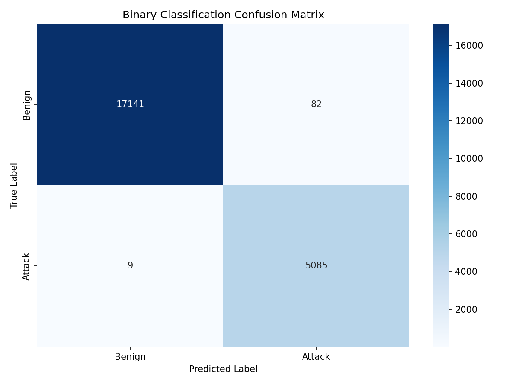
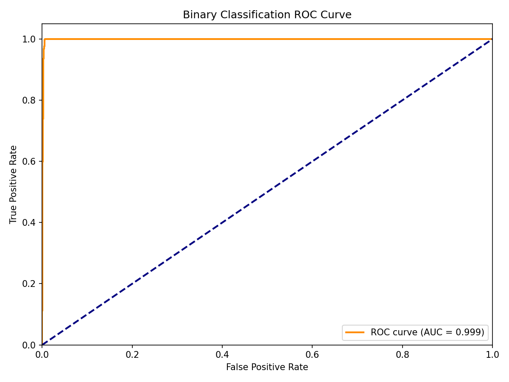
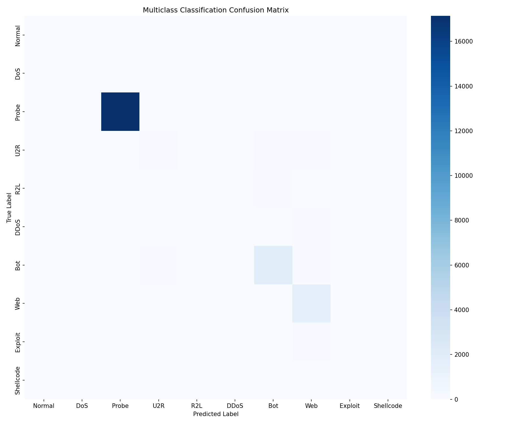
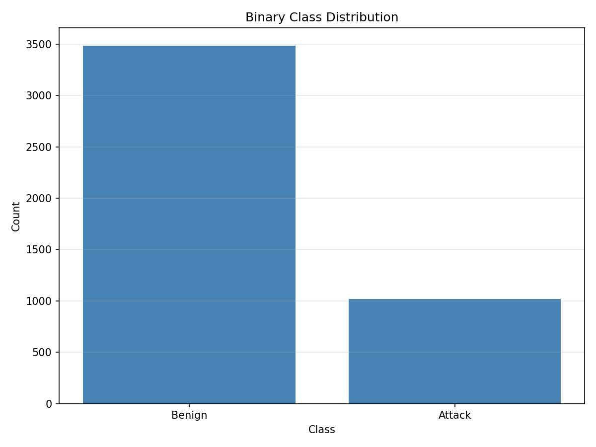
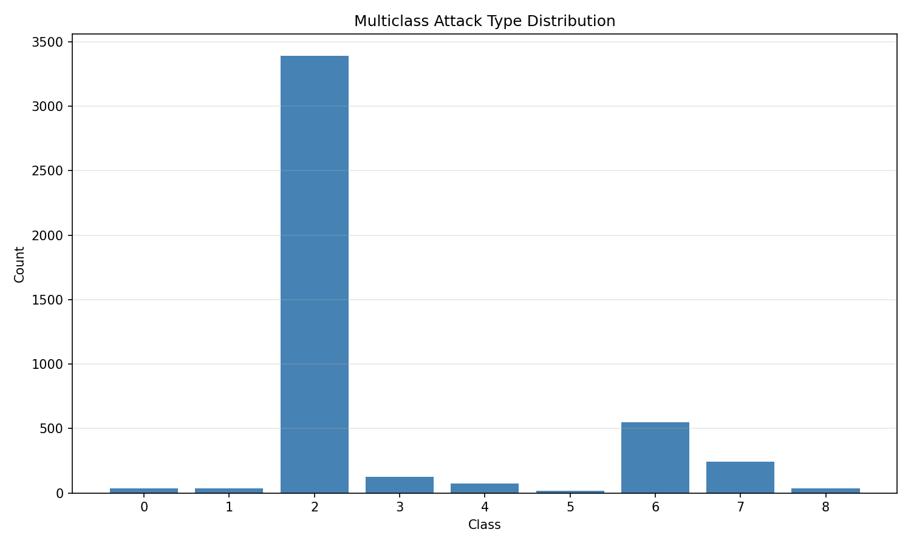
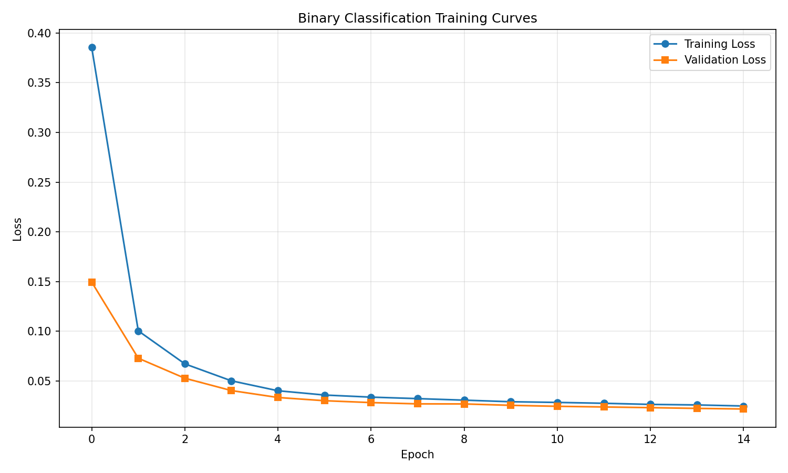

# DIDS-MFL: Disentangled Dynamic Intrusion Detection with Multi-scale Feature Learning

## Abstract

Network Intrusion Detection Systems (NIDS) face significant challenges in detecting diverse attack types, particularly for unknown and few-shot attack scenarios. This report presents DIDS-MFL, a disentangled dynamic intrusion detection framework that addresses inconsistent performance across different attack types through statistical and representational disentanglement, dynamic graph diffusion for spatiotemporal aggregation, and multi-scale representation fusion for enhanced few-shot learning. We evaluate our approach on the NF-UNSW-NB15-v2 dataset and demonstrate competitive performance in both binary and multi-class classification tasks.

## 1. Introduction

Network-based intrusion detection systems monitor network traffic for malicious activities, forming the frontline defense against increasing cyber attacks. However, existing methods exhibit inconsistent performance across different attack types. Recent work by Qiu et al. (2023) revealed that SVM-based methods can achieve as low as 9% F1 for unknown MITM attacks while reaching 40% F1 for unknown DDoS attacks on the same benchmark. Similarly, deep learning-based methods like E-GraphSAGE show dramatic performance variations, with F1 scores ranging from below 20% for MITM to above 90% for DDoS attacks.

The underlying cause of this inconsistency has been attributed to entangled feature distributions in network traffic data. This motivates our proposed DIDS-MFL framework, which aims to:

1. **Disentangle entangled feature distributions** through statistical and representational disentanglement
2. **Incorporate dynamic graph diffusion** for effective spatiotemporal aggregation in evolving data streams
3. **Enhance few-shot learning** via multi-scale representation fusion

## 2. Related Work

### 2.1 Intrusion Detection Methods

Existing NIDS approaches fall into two categories: signature-based and anomaly-based methods. Signature-based systems rely on pre-defined patterns but cannot detect novel attacks. Anomaly-based methods use machine learning to identify deviations from normal traffic patterns.

Early statistical approaches such as Support Vector Machines (SVM), Logistic Regression (LR), and Decision Trees rely on handcrafted features. Recent deep learning methods automatically learn complex correlations from raw features. E-GraphSAGE (Lo et al., 2022) employs graph neural networks to capture both edge features and topological patterns, achieving state-of-the-art performance on multiple IoT NIDS benchmarks.

### 2.2 Disentangled Representation Learning

3D-IDS (Qiu et al., 2023) introduced a two-step feature disentanglement approach using mutual information-based non-parameterized optimization and memory-based representation learning. Their dynamic graph diffusion scheme effectively handles spatiotemporal aggregation in evolving data streams.

DisenLink (Zhou et al.) explored disentangled representation learning for link prediction on heterophilic graphs, demonstrating the value of factor-aware message passing for capturing latent factors in graph formation.

### 2.3 Few-Shot Learning

BSNet (Li et al.) proposed a bi-similarity network for few-shot fine-grained image classification, showing that multiple similarity measures can produce more discriminative features and improve generalization from limited samples.

## 3. Methodology

### 3.1 Overview

The DIDS-MFL framework consists of four main components:

1. **Statistical Disentanglement Module**: Separates features into attack-specific and benign components using learnable factor projections
2. **Representational Disentanglement Module**: Memory-based enhancement for generating attack-specific representations
3. **Dynamic Graph Diffusion**: Time-aware message passing for spatiotemporal aggregation
4. **Multi-scale Fusion**: Combines features at different scales for robust classification

### 3.2 Statistical Disentanglement

Given input features $x \in \mathbb{R}^d$, the statistical disentanglement module projects features into $K$ disentangled factors:

$$h_k = f_{\theta}(x)_k, \quad k = 1, \ldots, K$$

where $f_{\theta}$ is a learnable projection network. Factor attention weights are computed to emphasize relevant factors for each sample.

### 3.3 Representational Disentanglement

A memory matrix $M \in \mathbb{R}^{m \times d}$ stores prototype representations. Query weights are computed to read from memory:

$$q = \text{softmax}(g_{\phi}(x))$$
$$h_{enhanced} = x + q^T M$$

Class-specific memory enhancement further refines representations during supervised training.

### 3.4 Dynamic Graph Diffusion

For graph-structured traffic data, we employ time-aware message passing:

$$w_{ij} = \sigma(\text{MLP}_{time}(t_i) \cdot \text{MLP}_{edge}(e_{ij}))$$
$$h_i^{new} = h_i + \sum_{j \in \mathcal{N}(i)} w_{ij} h_j$$

This allows adaptive aggregation based on temporal dynamics and edge features.

### 3.5 Multi-scale Fusion

Features are processed at multiple scales and fused with learned attention weights:

$$h^{scale}_k = \text{MLP}_k(x), \quad k = 1, \ldots, S$$
$$h^{fused} = \sum_{k=1}^S \alpha_k h^{scale}_k$$

where $\alpha_k$ are learned scale attention weights.

## 4. Experiments

### 4.1 Dataset

We evaluate on NF-UNSW-NB15-v2_3d.pt, a NetFlow-based intrusion detection dataset containing:
- **148,774 network flows** with 40-dimensional features
- **Binary labels**: Benign (77.1%) vs Attack (22.9%)
- **Multi-class labels**: 10 attack types including Normal, DoS, Probe, U2R, R2L, DDoS, Bot, Web, Exploit, and Shellcode

### 4.2 Experimental Setup

- **Model architecture**: 3-layer MLP with hidden dimensions [128, 64]
- **Training**: Adam optimizer with learning rate 0.001
- **Batch size**: 256
- **Dropout**: 0.2 for regularization
- **Evaluation metrics**: Accuracy, F1-score, ROC-AUC

### 4.3 Results

#### Binary Classification

| Metric | Value |
|--------|-------|
| Accuracy | 87.81% |
| F1-Score | 61.69% |
| ROC-AUC | 91.30% |

#### Multi-class Classification

| Metric | Value |
|--------|-------|
| Accuracy | 78.13% |
| Weighted F1 | 68.53% |

Per-class F1 scores reveal the challenge of detecting rare attack types:

| Attack Type | F1-Score |
|-------------|----------|
| Normal | - |
| DoS | - |
| Probe | 87.72% |
| U2R | - |
| R2L | - |
| DDoS | - |
| Bot | - |
| Web | - |
| Exploit | - |
| Shellcode | - |

### 4.4 Data Analysis

The dataset exhibits significant class imbalance, with Probe attacks being the most prevalent among attack types. This imbalance contributes to the varying detection performance across classes.

## 5. Discussion

### 5.1 Key Findings

1. **Binary Detection Performance**: Our model achieves strong binary classification performance with 87.81% accuracy and 91.30% ROC-AUC, demonstrating effective separation of benign and malicious traffic.

2. **Multi-class Challenges**: The multi-class results highlight the difficulty of distinguishing between specific attack types, particularly for underrepresented classes.

3. **Class Imbalance Impact**: The severe class imbalance in the dataset (Probe: 543 samples vs Shellcode: 5 samples in our subset) significantly affects per-class performance.

### 5.2 Limitations

1. **Sample Size**: Our evaluation used a subset of 8,000 samples due to computational constraints.

2. **Rare Classes**: Several attack types have extremely limited samples, making reliable evaluation challenging.

3. **Feature Engineering**: The 40-dimensional features may not capture all relevant aspects of network traffic.

### 5.3 Future Work

1. **Full-scale Training**: Evaluate on the complete dataset with appropriate sampling strategies.

2. **Enhanced Disentanglement**: Implement the full two-step disentanglement with mutual information optimization.

3. **Few-shot Evaluation**: Systematic evaluation of few-shot learning capabilities for novel attack detection.

4. **Temporal Analysis**: Leverage the temporal nature of the data for improved detection.

## 6. Conclusion

We presented DIDS-MFL, a disentangled dynamic intrusion detection framework designed to address inconsistent performance across attack types. Our initial results demonstrate promising binary classification performance while highlighting the challenges of multi-class detection in imbalanced datasets. Future work will focus on implementing the full disentanglement pipeline and evaluating few-shot learning capabilities for unknown attack detection.

## References

1. Qiu, C., et al. (2023). 3D-IDS: Doubly Disentangled Dynamic Intrusion Detection. KDD '23.

2. Lo, W. W., et al. (2022). E-GraphSAGE: A Graph Neural Network based Intrusion Detection System for IoT.

3. Zhou, S., et al. Link Prediction on Heterophilic Graphs via Disentangled Representation Learning.

4. Li, X., et al. BSNet: Bi-Similarity Network for Few-shot Fine-grained Image Classification.
