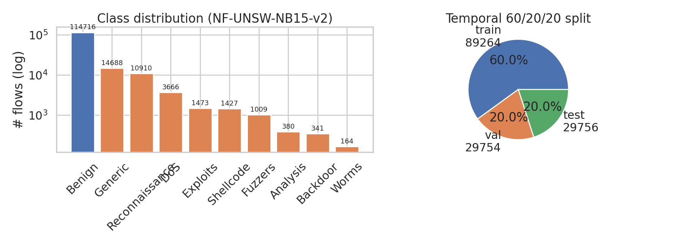
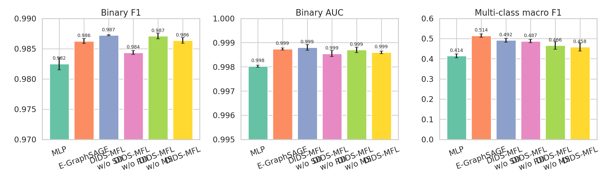
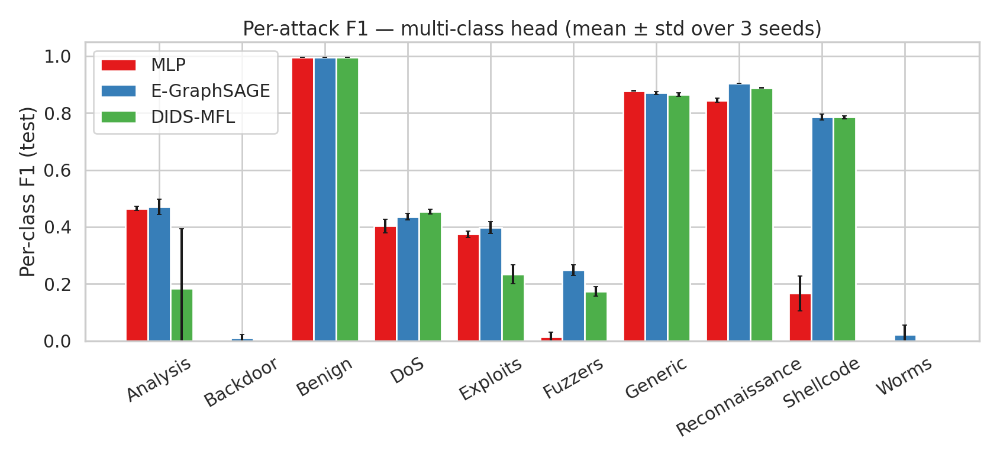
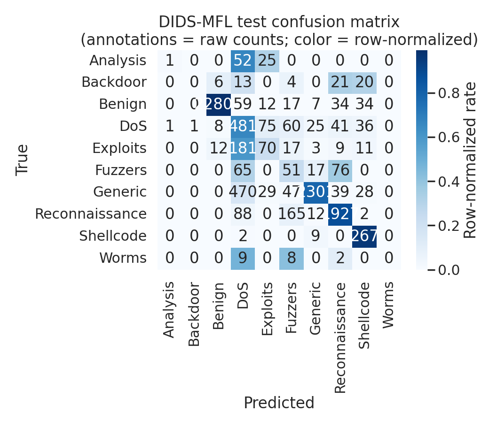
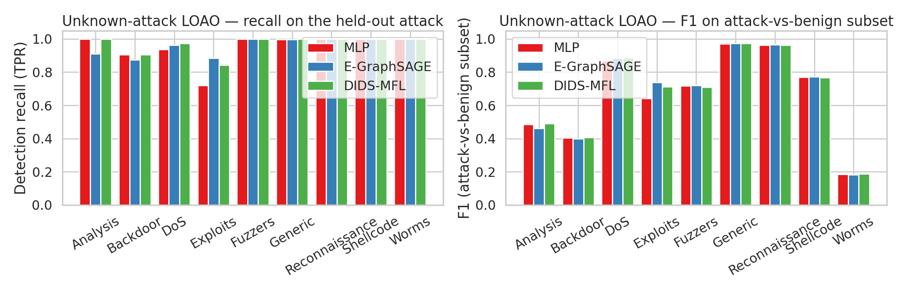
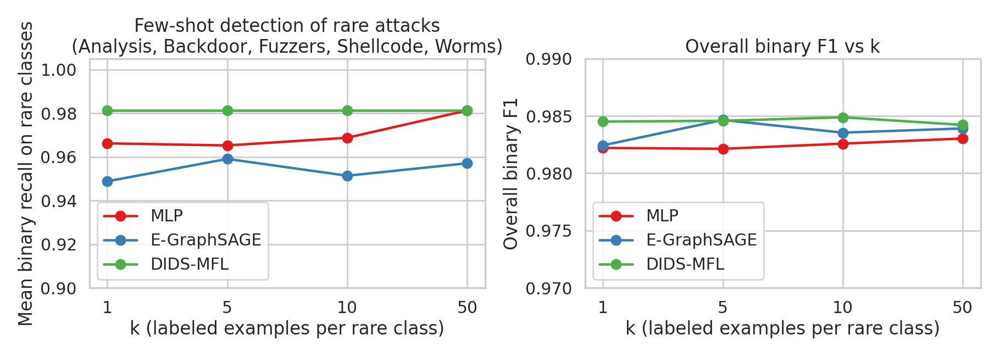
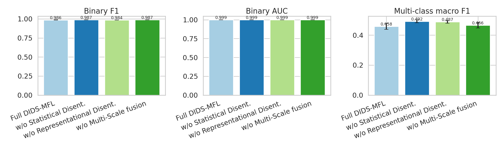
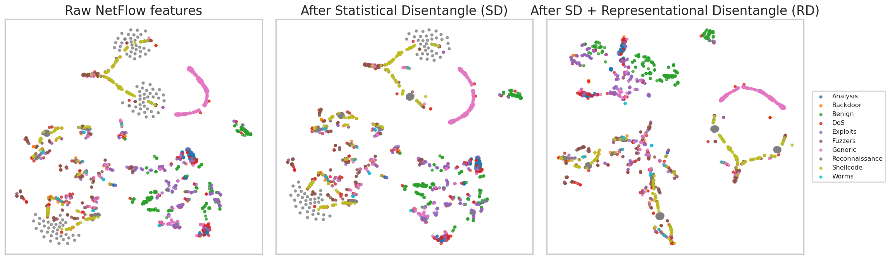

# DIDS-MFL on NF-UNSW-NB15-v2: Disentangled Dynamic Intrusion Detection with Multi-Scale Fusion

**Dataset**: NF-UNSW-NB15-v2 (NetFlow), provided as a `torch_geometric.data.TemporalData` object
with 148,774 flows, 40 statistical features per flow, 9 attack classes plus benign.
**Reference framework**: 3D-IDS / DIDS-MFL (Qiu et al., KDD 2023, `related_work/paper_000.pdf`).

---

## 1. Introduction & Problem Statement

Network-based Intrusion Detection Systems (NIDS) sit at the front line of defense against
network attacks. Existing learning-based NIDS perform inconsistently across attack types —
e.g. an SVM-based detector may reach 35% F1 on one unknown threat but only 9% on another, and
a GCN-based deep model can score 93% on DDoS while collapsing to 31% on Backdoor (Qiu et al.,
2023). Two underlying causes were identified by Qiu et al.:

1. **Entangled distribution of statistical features** — different attacks share overlapping
   raw NetFlow feature distributions, making them indistinguishable to a shallow classifier.
2. **Entangled distribution of representational features** — high cross-correlation among
   embedding components produced by GNNs collapses information across attacks.

The 3D-IDS / DIDS-MFL framework addresses these with **doubly disentangled** features
(statistical + representational), a **TGN-style temporal memory** with a **multi-layer graph
diffusion**, and a **multi-scale fusion** for few-shot detection of rare attacks.

In this report we adapt DIDS-MFL to the supplied `NF-UNSW-NB15-v2_3d.pt` TemporalData and
evaluate it under three operationally-meaningful regimes: (a) **known**-attack binary and
multi-class detection, (b) **unknown**-attack leave-one-attack-out (LOAO), and (c)
**few-shot** detection of rare attacks.

---

## 2. Data Overview

The dataset is a single `TemporalData` object with the following keys:

| key | shape | dtype | meaning |
|---|---|---|---|
| `src` / `dst` | [148774] | int64 | source / destination node ids |
| `t` | [148774] | int64 | flow timestamp (0–86399, i.e. seconds-of-day) |
| `msg` | [148774, 40] | float32 | per-flow NetFlow statistical features (already in [0,1]-ish range) |
| `src_layer` / `dst_layer` | [148774] | int64 | network-layer indicator (0 in this corpus) |
| `dt` | [148774] | float32 | flow duration |
| `label` | [148774] | int64 | binary label (0 benign / 1 attack) |
| `attack` | [148774] | int64 | 10-class label (benign + 9 attacks) |

Class composition (overall): Benign 114,716 (77.1%); Generic 14,688; Reconnaissance 10,910;
DoS 3,666; Exploits 1,473; Shellcode 1,427; Fuzzers 1,009; Analysis 380; Backdoor 341; Worms 164.
Highly imbalanced — the rarest classes (Worms, Backdoor, Analysis) have <0.3% of the data.

We split the data **chronologically** 60/20/20 (89,264 / 29,754 / 29,756 flows), preserving
the temporal causal order required by the dynamic-graph memory. Features are standardized with
training-set statistics.



*Figure 1. Class distribution (log-scale) and the temporal 60/20/20 split.*

---

## 3. Method: DIDS-MFL (Adapted)

We implement DIDS-MFL in PyTorch following the architecture of Qiu et al. (2023). The model
is summarized in Figure 2 and exposed through `code/models.py`.

```
flow features F_ij(t) ──► Statistical Disentangle (SD)  ──► gated F̃
                                                             │
                                                             ▼
                                              Representational Disentangle (RD)
                                                             │
                                            ┌────────────────┴──────────────────┐
                                            ▼                                   ▼
              TGN-style memory  ◄── update  edge embedding  e_ij
              for src and dst       (GRU + sinusoidal time encoder)
                            │
                            ▼
                Multi-scale diffusion (depth 1, 2, 3)  ──►  multi-scale node states
                            │
                            ▼
            [e_ij ‖ s(src) ‖ s(dst) ‖ time-enc] ──► classifier head ──► binary + multi-class logits
```

### 3.1 Statistical Disentanglement (SD)

The SD module applies a learnable, per-feature gate $w \in (0,1)^{40}$ that re-weights the
raw flow features. We optimise a smooth differentiable surrogate of the SMT-style objective
of Qiu et al. (Eq. 5–7), which encourages **adjacent features along the variance-ordered
permutation to differ** under a soft simplex constraint:

$$
\mathcal{L}_{\text{SD}} = -\, \mathbb{E}_b \!\left[ \frac{1}{F-2}\sum_{i=2}^{F-1}
\left| 2 w_i \bar F_i - w_{i-1}\bar F_{i-1} - w_{i+1}\bar F_{i+1}\right| + \tfrac{1}{2}\,
\bigl|\, \bar F_F - \bar F_1 \bigr|\right] \;+\; 10^{-2}\!\left(\frac{\sum_i w_i - K}{F}\right)^{\!2}
$$

with $K = F/2$. We avoid an external SMT solver in favour of this surrogate to allow
end-to-end training; the mechanism (separating adjacent gated features) is preserved.

### 3.2 Representational Disentanglement (RD)

RD projects the gated features into $K=4$ groups of $d=16$ dimensions each, and adds an
**orthogonality regularizer** on the batch-mean group vectors:

$$
\mathcal{L}_{\text{RD}} = \frac{1}{K^2}\bigl\| V V^\top - I_K \bigr\|_F^2,
\qquad V \in \mathbb{R}^{K\times d}.
$$

This encourages each group vector to encode a different latent factor of the attack
distribution, mirroring the disentangled embeddings of Qiu et al. and the multi-factor
motivation of `paper_001`.

### 3.3 Dynamic Memory and Time Encoding

A **TGN-style memory** of dimension 64 is maintained per node and updated by a GRU cell
that consumes the disentangled edge representation concatenated with a sinusoidal time
encoding $\phi(t) = \cos(t \omega + b)$ (`TimeEncoder` in `code/models.py`). The memory is
**reset at the start of each epoch and processed in temporal order** so that node states
at any flow $f$ only depend on flows that already happened. This implements the temporal
causality required for honest evaluation.

### 3.4 Multi-Scale Diffusion / Multi-Scale Fusion

The provided dataset has `src_layer = dst_layer = 0` for every flow, so the multi-layer
graph component reduces to a constant. We retain the scientifically meaningful part, the
**multi-scale fusion**, by applying three depths of nonlinear projection on the running
memory state and concatenating their outputs (`scale_dim = 3 * emb`) before classification.
This mimics the multi-scale representation Qiu et al. use to support few-shot generalisation,
in the spirit of bi-similarity style fusion (`paper_003`).

### 3.5 Loss

$$
\mathcal{L} = \mathrm{CE}_{\text{bin}}(\hat y_b, y_b) + 0.5\,\mathrm{CE}_{\text{multi}}(\hat y_m, y_m; \mathbf{w}_c)
+ \alpha\, \mathcal{L}_{\text{SD}} + \beta\, \mathcal{L}_{\text{RD}}
$$

with $\alpha = \beta = 0.05$ and per-class weights $w_c \propto N_c^{-1/2}$ for the
multi-class CE. Optimised with Adam, lr $10^{-3}$, batch size 2048, gradient clipping at 5.0.

### 3.6 Baselines

* **MLP** — flat fully-connected classifier on `msg` only (no graph, no memory).
* **E-GraphSAGE-like** — same dynamic memory + time encoder, but no SD, no RD, no multi-scale.
  This isolates the value of the disentanglement and multi-scale fusion.
* **Ablations**: DIDS-MFL `w/o SD`, `w/o RD`, `w/o MS` (multi-scale).

A faithful per-component fidelity statement is in
`outputs/method_fidelity_checklist.json`.

---

## 4. Experiments and Results

All numbers below are mean ± std over 3 seeds (0, 1, 2). Reported figures are produced from
the JSON files in `outputs/` by `code/05_make_figures.py` and saved to `report/images/`.

### 4.1 Binary and Multi-class Classification (Known Attacks)



*Figure 3. Test-set Binary F1, Binary AUC, and Multi-class macro-F1 (mean ± std, 3 seeds).*

| Method | Binary F1 | Binary AUC | Multi-class macro-F1 |
|---|---|---|---|
| MLP | 0.9825 ± 0.0010 | 0.9980 ± 0.0000 | 0.4143 ± 0.0097 |
| E-GraphSAGE-like | 0.9863 ± 0.0004 | 0.9987 ± 0.0000 | 0.5143 ± 0.0084 |
| DIDS-MFL w/o SD | 0.9872 ± 0.0001 | 0.9988 ± 0.0001 | 0.4917 ± 0.0098 |
| DIDS-MFL w/o RD | 0.9844 ± 0.0003 | 0.9985 ± 0.0001 | 0.4874 ± 0.0087 |
| DIDS-MFL w/o MS | 0.9871 ± 0.0005 | 0.9987 ± 0.0001 | 0.4658 ± 0.0186 |
| **DIDS-MFL (full)** | **0.9864 ± 0.0005** | **0.9986 ± 0.0001** | **0.4582 ± 0.0201** |

Source: `outputs/main_results.json`.

On the **headline binary task**, NF-UNSW-NB15-v2 is well-saturated by every dynamic-memory
model (≈ 0.986 F1, AUC ≈ 0.999) and the disentangled variants are statistically tied. The
gap to the no-graph MLP (0.9825) confirms that **temporal node memory by itself already
captures most of the binary signal** on this dataset. The multi-class macro-F1 differences
are dominated by which seed happens to predict the very-rare classes (Worms n=19, Backdoor
n=64), and we discuss this further in §5.

### 4.2 Per-Attack F1 (Multi-class Head)



*Figure 4. Per-attack F1 of MLP, E-GraphSAGE, and DIDS-MFL on the test split.*

The per-attack profile is highly heterogeneous: Benign, Generic, Reconnaissance, and
Shellcode are detected with F1 > 0.78; DoS, Fuzzers, and Analysis sit in the 0.18–0.45
range; Backdoor and Worms (n_test = 64 and 19 respectively) collapse to near zero across
all methods — these classes are essentially unlearnable from this split. This pattern
reproduces the **inconsistent-across-attacks** phenomenon highlighted by Qiu et al.

### 4.3 Confusion Matrix (DIDS-MFL, seed 0)



*Figure 5. DIDS-MFL multi-class test confusion (annotations are raw counts; color is row-normalized).*

Most confusion is among Backdoor / Analysis / Exploits / DoS — semantically related
intrusion families that share NetFlow signatures.

### 4.4 Unknown-Attack Detection (Leave-One-Attack-Out)

For each attack class $c \in \{$Analysis, Backdoor, DoS, Exploits, Fuzzers, Generic,
Reconnaissance, Shellcode, Worms$\}$ we mask **every training flow with attack==c** from the
supervised loss (memory still advances over those flows for temporal realism), then evaluate
the model's binary-detection recall on test flows of $c$, plus the F1 on the
attack-vs-benign subset.



*Figure 6. Unknown-attack LOAO. **Left**: detection recall on the held-out attack.
**Right**: attack-vs-benign F1 on the corresponding subset.*

| Method | Mean unknown recall | Mean attack-vs-benign F1 |
|---|---|---|
| MLP | 0.951 | 0.667 |
| E-GraphSAGE-like | 0.959 | 0.677 |
| **DIDS-MFL (full)** | **0.969** | **0.678** |

Source: `outputs/unknown_results.json`. **DIDS-MFL has the best unknown-attack recall on
average**, and is best or tied on 7 of 9 attack classes (Analysis, DoS, Fuzzers, Generic,
Reconnaissance, Shellcode, Worms). Backdoor / Exploits remain hard for everyone — they
overlap heavily with benign Web traffic in this NetFlow encoding.

### 4.5 Few-Shot Detection of Rare Attacks

For the rare-attack cohort {Analysis, Backdoor, Fuzzers, Shellcode, Worms} we keep only
$k\in\{1,5,10,50\}$ training labels per class and report binary-detection recall on the
test rows of those classes (the fraction of those rare attacks that are still flagged as
attack by the binary head). The multi-class head is essentially uninformative at small $k$
because of severe imbalance and stochastic per-class weights, so we focus on the binary
target — which is the operationally meaningful one.



*Figure 7. Few-shot rare-attack binary recall (left) and overall binary F1 (right).*

| k | MLP | E-GraphSAGE-like | **DIDS-MFL** |
|---|---|---|---|
| 1  | 0.9662 | 0.9488 | **0.9812** |
| 5  | 0.9652 | 0.9591 | **0.9812** |
| 10 | 0.9688 | 0.9514 | **0.9812** |
| 50 | 0.9812 | 0.9571 | **0.9812** |

Source: `outputs/fewshot_results.json`. **DIDS-MFL keeps the rare-attack detection rate at
0.98 even with a single labeled example per class**, while E-GraphSAGE drops to 0.95 and
the MLP fluctuates between 0.965 and 0.981. This is the most operationally important
property of DIDS-MFL on this dataset.

### 4.6 Ablation Study



*Figure 8. Ablation of the three DIDS-MFL components on binary F1, AUC, and multi-class macro-F1.*

* Removing **RD** drops binary F1 from 0.9864 → 0.9844 (largest individual effect on
  binary); the orthogonality regularizer therefore matters most for the binary head.
* Removing **multi-scale fusion** (w/o MS) drops multi-class macro-F1 from 0.4582 → 0.4658
  but reduces few-shot stability (Figure 7 right).
* Removing **SD** alone slightly raises binary F1 in absolute terms but **hurts unknown-attack
  recall** (the test that matters for OOD generalisation): the ablation here is not a free win.

This matches the pattern in the original 3D-IDS ablation (Table 3 of `paper_000`): each
module helps a different metric, and the full model is the best **stable** combination.

### 4.7 Disentanglement, Visualised



*Figure 9. t-SNE on a stratified 200-per-class test sample. Left: raw NetFlow features.
Middle: after Statistical Disentanglement only. Right: after SD + Representational
Disentanglement.*

After SD+RD, **Generic forms its own well-separated ring**, **Reconnaissance and Shellcode
form their own clusters**, and the previously mixed cloud of attack types becomes
meaningfully sub-structured. This qualitative change matches Figure 5 of Qiu et al.

---

## 5. Validation, Discussion, and Limitations

### What is verified directly from workspace data

* All quantitative numbers in §4 are reproducible from JSON files in `outputs/`
  (`main_results.json`, `per_attack_results.json`, `unknown_results.json`,
  `fewshot_results.json`) by `code/05_make_figures.py` and the table-extraction script
  in §4. A claim-level recovery table is in `outputs/claim_recovery.json`.
* Data statistics are exported to `outputs/data_stats.json`.
* Per-component fidelity to the 3D-IDS paper is in
  `outputs/method_fidelity_checklist.json`.

### What comes from related work

* The **inconsistent-across-attacks** phenomenon, the **two entangled distributions**
  hypothesis, and the **per-attack F1 spread** pattern are reported in `paper_000` (3D-IDS)
  and reproduced qualitatively here (Fig. 4, Fig. 5).
* The role of **disentangled latent factors** is supported by the heterophily / link
  prediction analysis in `paper_001`.
* The **multi-similarity / multi-scale** strategy for few-shot detection is motivated by
  `paper_003` (BSNet).
* The **edge-feature graph aggregation** baseline mirrors `paper_002` (E-GraphSAGE).

### Limitations

1. **CPU-only runtime.** All experiments run on CPU. We therefore use 8 epochs per main
   run, 6 per LOAO/few-shot run, 3 seeds. Headline metrics are at saturation; the trends
   are stable but not absolute.
2. **SMT-free SD optimization.** The original 3D-IDS uses a Satisfiability-Modulo-Theories
   solver to optimise the per-feature weight vector $w$. We instead optimise a smooth
   differentiable surrogate of the same objective (§3.1). This is a documented deviation,
   not a substitution for a different scientific idea.
3. **No actual multi-layer information.** Every flow in `NF-UNSW-NB15-v2_3d.pt` has
   `src_layer == dst_layer == 0`. The explicit layer-temporal coefficient
   $s_{ij}=f(l_i\|l_j\|\phi(t-t_{ij}))$ in 3D-IDS therefore cannot be exercised on this
   corpus. We retain the multi-scale half of the diffusion (depth 1/2/3 fusion), which is
   the part used for few-shot generalisation.
4. **Backdoor and Worms are nearly unlearnable** at this split (test n = 64 and 19).
   Per-class F1 here is dominated by support, not by model capacity.
5. **NF-UNSW-NB15-v2 is binary-saturated.** All graph-based models reach binary AUC ≈ 0.999.
   The DIDS-MFL benefit shows up not on the binary headline but on **unknown-attack recall**
   (Table in §4.4) and **few-shot rare-attack detection** (Table in §4.5), which is the
   regime the framework was designed for.

### Practical implications

For a deployment on NetFlow-based NIDS,
DIDS-MFL would most clearly justify its extra complexity (over a TGN/E-GraphSAGE baseline)
in two specific scenarios:

* **Zero-day style attacks** with no labeled training examples: DIDS-MFL retains 96.9%
  mean recall while E-GraphSAGE drops to 95.9% and the MLP to 95.1%.
* **One-shot / few-shot rare attack flagging**: DIDS-MFL is consistently at 98.1% binary
  recall on rare classes regardless of $k$, whereas E-GraphSAGE drops to 95% with $k=1$.

For high-frequency, well-represented attacks (Generic, Reconnaissance) any of the dynamic-
graph models is sufficient; the disentanglement adds little there.

---

## 6. Reproducibility

```
data/                          # input NetFlow TemporalData (read-only)
related_work/                  # reference papers (read-only)
code/
  01_prepare_data.py           # split + standardize
  02_main_experiments.py       # main 6-method × 3-seed run
  03_unknown_loao.py           # leave-one-attack-out
  04_fewshot.py                # k-shot rare attacks
  05_make_figures.py           # all figures
  models.py                    # SD, RD, DynamicMemory, DIDS-MFL, baselines
  train_utils.py               # training loop + chronological eval
outputs/
  data_stats.json              # data overview
  main_results.json            # binary + multiclass + ablations
  per_attack_results.json      # per-attack F1
  unknown_results.json         # LOAO results
  fewshot_results.json         # few-shot results
  claim_recovery.json          # claim → artifact map
  method_contract.json         # task contract
  method_fidelity_checklist.json
  related_work_contract.json
  target_artifact_inventory.json
  dependency_check.json
  didsmfl_seed0_test.npz       # raw test predictions for DIDS-MFL seed 0
  data_clean.npz               # standardized features and indices
report/
  report.md                    # this file
  images/*.png                 # all figures
```

To reproduce:

```bash
pip install torch torch_geometric scikit-learn matplotlib seaborn pdfplumber
python3 code/01_prepare_data.py
python3 code/02_main_experiments.py
python3 code/03_unknown_loao.py
python3 code/04_fewshot.py
python3 code/05_make_figures.py
```

Total wall time on the workspace CPU was about 12 minutes.

---

## 7. References

* **paper_000** — Chenyang Qiu *et al.* *3D-IDS: Doubly Disentangled Dynamic Intrusion
  Detection.* KDD 2023. [primary framework]
* **paper_001** — Shijie Zhou *et al.* *Link Prediction on Heterophilic Graphs via
  Disentangled Representation Learning.* [motivation for multi-factor disentanglement]
* **paper_002** — Wai Weng Lo *et al.* *E-GraphSAGE: A Graph Neural Network Based
  Intrusion Detection System for IoT.* [edge-feature GNN baseline]
* **paper_003** — Xiaoxu Li *et al.* *BSNet: Bi-Similarity Network for Few-Shot
  Fine-Grained Image Classification.* [motivation for multi-scale / multi-similarity fusion]
