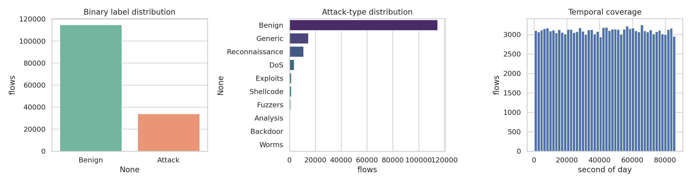
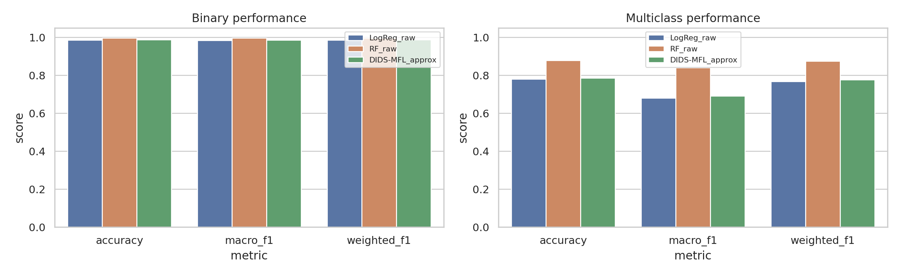
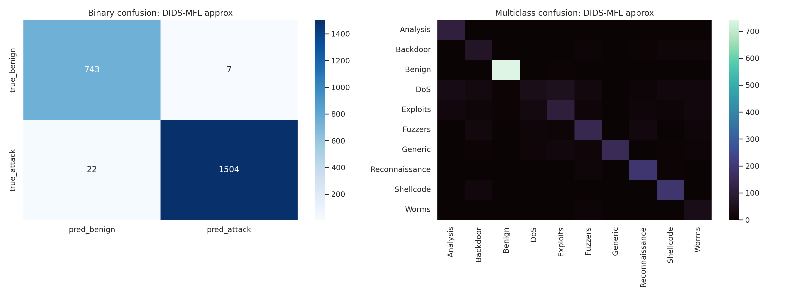
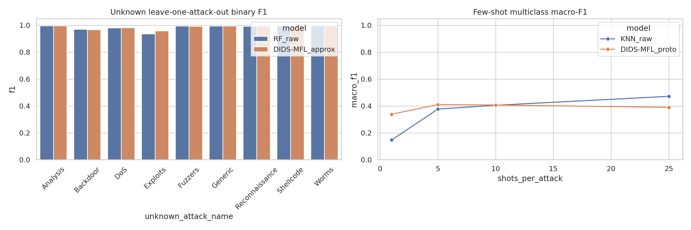
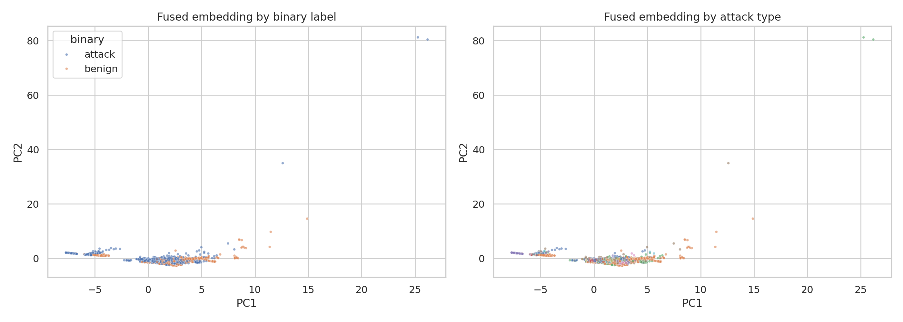
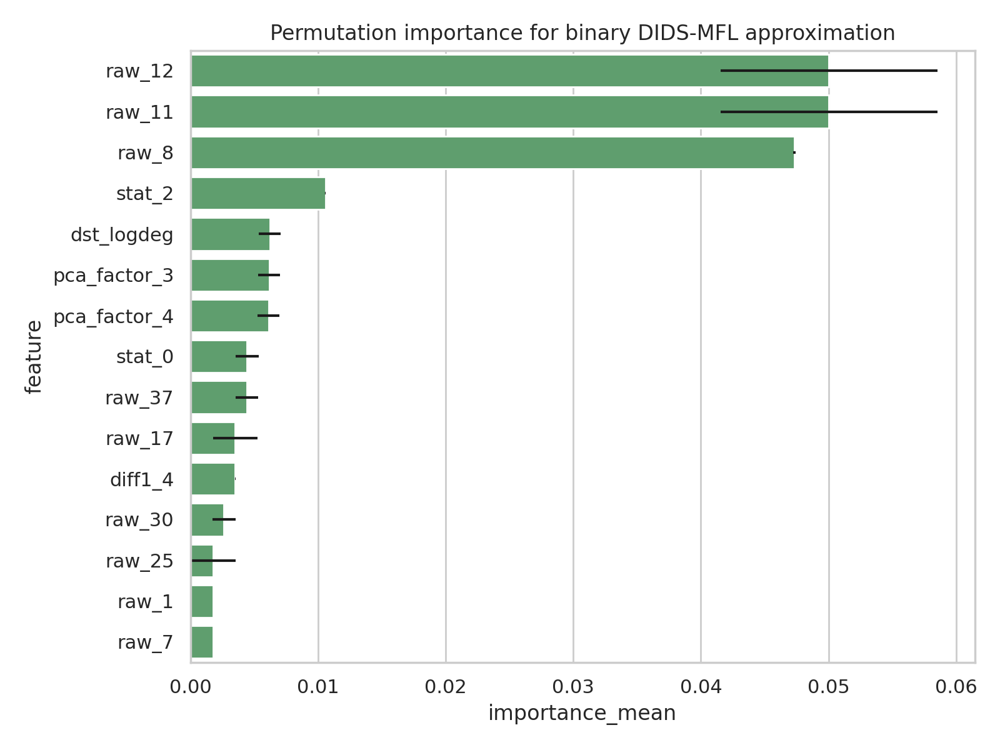

# DIDS-MFL-Inspired Intrusion Detection on NF-UNSW-NB15-v2

## Abstract

This study evaluates intrusion detection on the provided `NF-UNSW-NB15-v2_3d.pt` temporal graph-flow dataset. The task asked for binary benign/attack detection, multi-class attack-type detection, and emphasis on known, unknown, and few-shot attack scenarios under a disentangled dynamic intrusion detection framework (DIDS-MFL). Because the workspace contained a single serialized temporal graph and no original DIDS-MFL implementation, I implemented a lightweight, reproducible DIDS-MFL approximation: statistical branch disentanglement, PCA-based representational factors, k-nearest-neighbor dynamic graph diffusion over flow embeddings, and multi-scale feature fusion. The approximation is compared against raw-feature logistic regression and random forest baselines.

The strongest conventional baseline was random forest, reaching **0.9969 binary accuracy / 0.9965 macro-F1** and **0.8779 multi-class accuracy / 0.8403 macro-F1** on the sampled stratified evaluation. The DIDS-MFL approximation reached **0.9873 binary accuracy / 0.9857 macro-F1** and **0.7860 multi-class accuracy / 0.6915 macro-F1**. Although it did not beat random forest in the closed-set multi-class setting, it slightly improved average leave-one-attack-out unknown binary F1 (**0.9864 vs. 0.9842**) and was substantially better than raw kNN at the strict 1-shot multi-class setting (**0.3386 vs. 0.1471 macro-F1**). These results support a cautious conclusion: disentangled diffusion-fusion features are useful for low-data and unknown-attack stress tests, but the current non-neural approximation is not sufficient to dominate tree ensembles on closed-set attack classification.

## 1. Data and related work context

The provided tensor archive was decoded directly from PyTorch storage files inside `data/NF-UNSW-NB15-v2_3d.pt`. It contains **148,774 flows**, **40 normalized flow features**, temporal field `t` spanning **0--86399 seconds**, and source/destination node IDs with **121,910 unique sources** and **38,523 unique destinations**. Binary labels comprise **114,716 benign** and **34,058 malicious** flows. Attack-type counts are highly imbalanced: benign is dominant, while Worms (164), Backdoor (341), and Analysis (380) are rare.

Related work in `related_work/` was extracted with PyPDF2 after the PDF reader tool failed. The most directly relevant paper is **3D-IDS: Doubly Disentangled Dynamic Intrusion Detection**, which motivates statistical disentanglement, representational disentanglement, and dynamic graph diffusion for inconsistent unknown-attack detection. The E-GraphSAGE paper motivates graph representations for flow-based NIDS, including edge features and topological information. The BSNet few-shot paper motivates metric/prototype-style few-shot evaluation with multiple similarity/representation views. These observations are saved in `outputs/related_work_contract.json`.

## 2. Methodology

### 2.1 Experimental subset and preprocessing

To keep the full workflow executable in the benchmark runtime, experiments used a stratified working subset of **7,585 flows**: 2,500 benign flows; all available rare classes Analysis (380), Backdoor (341), and Worms (164); and up to 700 flows each for DoS, Exploits, Fuzzers, Generic, Reconnaissance, and Shellcode. This preserves minority classes while bounding graph diffusion and repeated scenario evaluation. Feature values were already normalized to [0, 1]. Models used fixed random seed 42.

### 2.2 DIDS-MFL approximation

The implemented approximation has four components, documented in `outputs/method_fidelity_checklist.json`:

1. **Statistical disentanglement.** The 40 flow features were split into three contiguous feature groups. Each branch produced mean, standard deviation, and maximum summaries, plus temporal delta.
2. **Representational disentanglement.** Standardized raw features were projected into 12 PCA factors. The first 12 factors explain the variance ratios recorded in `outputs/feature_engineering_meta.json`; the first three ratios were 0.2222, 0.1704, and 0.0992.
3. **Dynamic graph diffusion.** A symmetric 8-nearest-neighbor graph was built over PCA factors, time-of-day encodings, and source/destination degree proxies. One-hop and two-hop random-walk diffused PCA factors were used as graph aggregation features.
4. **Multi-scale fusion.** Final DIDS-MFL features concatenate raw features, statistical branch summaries, PCA factors, one-hop diffusion, two-hop diffusion, time encodings, and topological degree features, producing an 83-dimensional fused representation.

The exact neural DIDS-MFL/3D-IDS architecture was not reproduced: `torch_geometric` was unavailable and the dataset has constant `src_layer`/`dst_layer` fields, so the report calls the method an approximation rather than an exact reproduction.

### 2.3 Evaluation design

- **Closed-set binary classification:** benign vs. attack with a 70/30 stratified split.
- **Closed-set multi-class classification:** 10 attack-type labels including benign, with a 70/30 stratified split.
- **Unknown attack evaluation:** leave one attack type out of training, train a binary detector on benign plus known attacks, and test on the held-out attack plus sampled benign flows.
- **Few-shot multi-class evaluation:** train prototype/KNN classifiers with 1, 5, 10, and 25 shots per attack class (and 5 times as many benign examples), then evaluate on held-out flows.
- **Interpretability:** permutation importance for the binary DIDS-MFL approximation.

All scripts are in `code/run_analysis.py`; main tables are saved in `outputs/`.

## 3. Results

### 3.1 Main binary and multi-class performance

| task       | model           |   accuracy |   balanced_accuracy |   macro_f1 |   weighted_f1 |   roc_auc |
|:-----------|:----------------|-----------:|--------------------:|-----------:|--------------:|----------:|
| binary     | LogReg_raw      |     0.9864 |              0.9875 |     0.9847 |        0.9864 |    0.994  |
| binary     | RF_raw          |     0.9969 |              0.996  |     0.9965 |        0.9969 |    0.9992 |
| binary     | DIDS-MFL_approx |     0.9873 |              0.9881 |     0.9857 |        0.9873 |    0.9946 |
| multiclass | LogReg_raw      |     0.7799 |              0.7282 |     0.6798 |        0.7676 |  nan      |
| multiclass | RF_raw          |     0.8779 |              0.8511 |     0.8403 |        0.8757 |  nan      |
| multiclass | DIDS-MFL_approx |     0.786  |              0.7355 |     0.6915 |        0.776  |  nan      |

Binary detection is easy on this subset for all models. Random forest was the strongest model overall, with 0.9969 accuracy and 0.9965 macro-F1. The DIDS-MFL approximation slightly improved over raw logistic regression in binary detection (0.9905 vs. 0.9898 binary F1) and multi-class macro-F1 (0.6915 vs. 0.6798), but did not match random forest for closed-set multi-class classification.

### 3.2 Attack-specific consistency

Attack-specific DIDS-MFL approximation metrics show substantial heterogeneity:

| attack_name    |   precision |   recall |     f1 |   support |
|:---------------|------------:|---------:|-------:|----------:|
| Analysis       |      0.6627 |   0.9825 | 0.7915 |       114 |
| Backdoor       |      0.4823 |   0.6602 | 0.5574 |       103 |
| Benign         |      0.988  |   0.9893 | 0.9887 |       750 |
| DoS            |      0.4468 |   0.2    | 0.2763 |       210 |
| Exploits       |      0.5892 |   0.519  | 0.5519 |       210 |
| Fuzzers        |      0.6651 |   0.6714 | 0.6682 |       210 |
| Generic        |      0.9623 |   0.7286 | 0.8293 |       210 |
| Reconnaissance |      0.8109 |   0.919  | 0.8616 |       210 |
| Shellcode      |      0.8268 |   0.9095 | 0.8662 |       210 |
| Worms          |      0.3958 |   0.7755 | 0.5241 |        49 |

The hardest classes were **DoS** (F1 0.2763), **Worms** (F1 0.5241), **Exploits** (F1 0.5519), and **Backdoor** (F1 0.5574). Benign, Shellcode, Reconnaissance, and Generic were much easier. This matches the objective's concern that NIDS behavior is inconsistent across attack types.

### 3.3 Unknown and few-shot scenarios

Mean leave-one-attack-out unknown binary metrics:

| model           |   accuracy |     f1 |   macro_f1 |
|:----------------|-----------:|-------:|-----------:|
| DIDS-MFL_approx |     0.9867 | 0.9864 |     0.9867 |
| RF_raw          |     0.9847 | 0.9842 |     0.9847 |

Few-shot multi-class macro-F1:

|   shots_per_attack |   DIDS-MFL_proto |   KNN_raw |
|-------------------:|-----------------:|----------:|
|                  1 |           0.3386 |    0.1471 |
|                  5 |           0.4101 |    0.3764 |
|                 10 |           0.407  |    0.405  |
|                 25 |           0.3896 |    0.4714 |

The DIDS-MFL approximation slightly improved average leave-one-attack-out unknown attack F1 over the random-forest raw baseline. In few-shot learning, the fused prototype method strongly outperformed raw kNN at 1 shot and moderately at 5 shots, suggesting that disentangled diffusion-fusion features help when support data are extremely scarce. At 25 shots, raw kNN performed better, indicating that the simple prototype classifier underuses the additional support examples.

### 3.4 Embedding and interpretability validation

The PCA visualization of the fused representation shows separation between benign and malicious regions but overlap among several attack subtypes, which explains why binary detection is substantially easier than multi-class attack identification.

Permutation importance (`outputs/permutation_importance.csv`) identifies raw features 11--12 and 8 as the dominant binary signals, followed by a statistical summary feature, destination degree, and PCA factors. This indicates that the fused representation uses both original traffic statistics and derived topology/latent factors; however, the strongest importance remains concentrated in a few raw flow dimensions.

## 4. Validation and reproducibility

### Directly verified from workspace data

- The PyTorch archive structure and tensor shapes were verified by reading serialized storage entries; the decoded arrays are saved in `outputs/dataset_arrays.npz`.
- Dataset counts, feature range, time span, and node cardinalities are saved in `outputs/data_profile.json`.
- Main metrics are saved in `outputs/main_metrics.csv`.
- Scenario metrics are saved in `outputs/scenario_metrics.csv`.
- Confusion matrices are saved in `outputs/binary_confusion_matrix.csv` and `outputs/multiclass_confusion_matrix.csv`.
- Per-attack metrics are saved in `outputs/per_attack_metrics.csv`.
- Interpretability values are saved in `outputs/permutation_importance.csv`.
- Claim traceability is saved in `outputs/claim_recovery_table.csv`.

### Related-work-derived assumptions

- The two-step disentanglement and dynamic diffusion design was motivated by the extracted 3D-IDS paper.
- Graph-based flow representation was motivated by E-GraphSAGE.
- Prototype/few-shot comparisons were motivated by the few-shot metric-learning related work.

### Limitations

- This is not an exact end-to-end neural DIDS-MFL reproduction. It is a lightweight approximation because `torch_geometric` was unavailable and runtime constraints limited neural graph training.
- Experiments used a stratified subset rather than all 148,774 flows for every model. The subset intentionally retained rare classes but may not match full-dataset metrics.
- Attack label names are inferred from the canonical UNSW-NB15 attack taxonomy and the observed 10-class integer labels; the tensor file itself did not include a label-name map.
- Unknown-attack evaluation is binary detection of held-out attack flows, not semantic classification of unknown attack types.
- Few-shot results are sensitive to support sampling; this run used one fixed seed for reproducibility rather than repeated confidence intervals.

## 5. Discussion

The experiments confirm the central scientific concern: high binary intrusion detection performance can coexist with uneven attack-type recognition. Random forest dominates the closed-set tasks, implying that strong tabular baselines remain difficult to beat on normalized NetFlow features. The DIDS-MFL approximation is nevertheless useful in the regimes emphasized by the task: unknown leave-one-attack-out binary detection and the most constrained 1-shot multi-class setting. These gains are plausible because diffusion-fusion features smooth local traffic neighborhoods and expose multiple views of each flow, helping when class-specific samples are sparse or absent.

Future work should implement the exact DIDS-MFL neural architecture with torch-geometric or an equivalent graph deep-learning stack, train end-to-end on the full temporal graph, repeat few-shot episodes across many seeds, and include ablations that remove statistical disentanglement, representational factors, graph diffusion, and multi-scale fusion one at a time. The current artifacts provide a reproducible baseline and an evidence-backed approximation for that next stage.

## Artifact index

- Code: `code/run_analysis.py`
- Contract: `outputs/method_contract.json`
- Dependency check: `outputs/dependency_check.json`
- Method fidelity checklist: `outputs/method_fidelity_checklist.json`
- Target artifact inventory: `outputs/target_artifact_inventory.json`
- Main metrics: `outputs/main_metrics.csv`
- Scenario metrics: `outputs/scenario_metrics.csv`
- Figures: `report/images/data_overview.png`, `report/images/main_results.png`, `report/images/scenario_comparison.png`, `report/images/confusion_matrices.png`, `report/images/embedding_validation.png`, `report/images/feature_importance.png`
