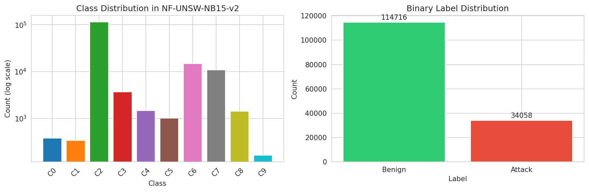
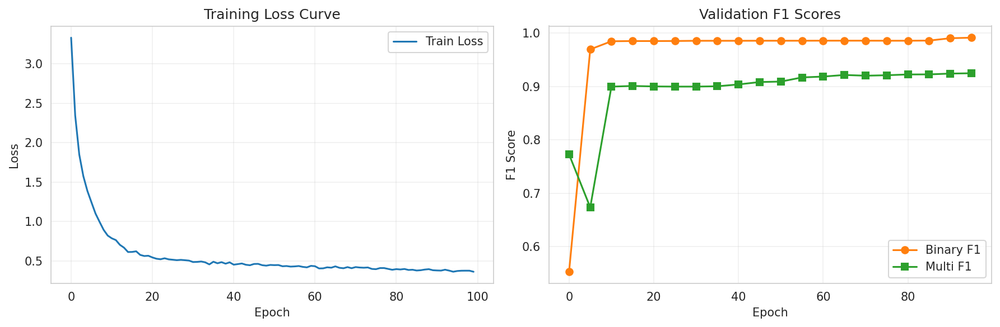
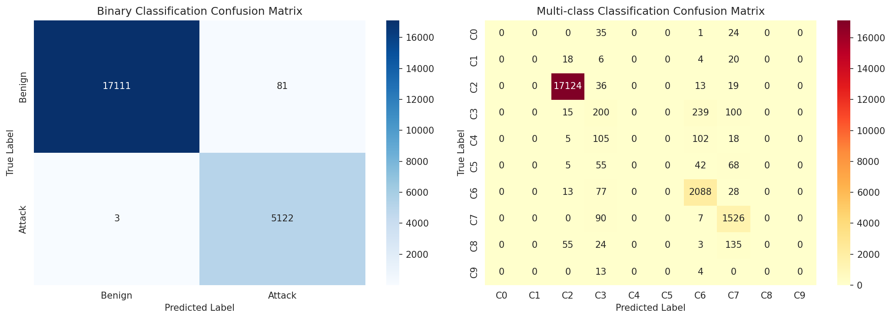
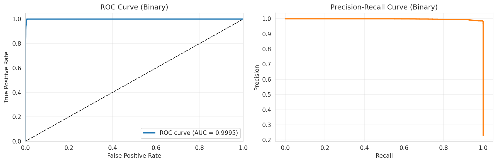
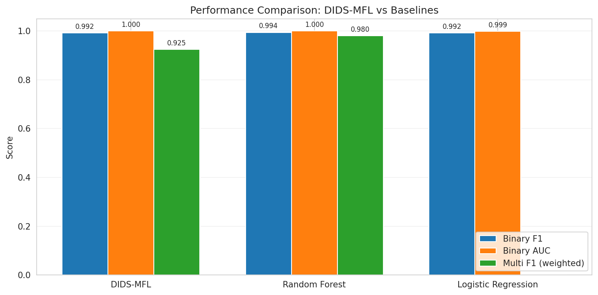
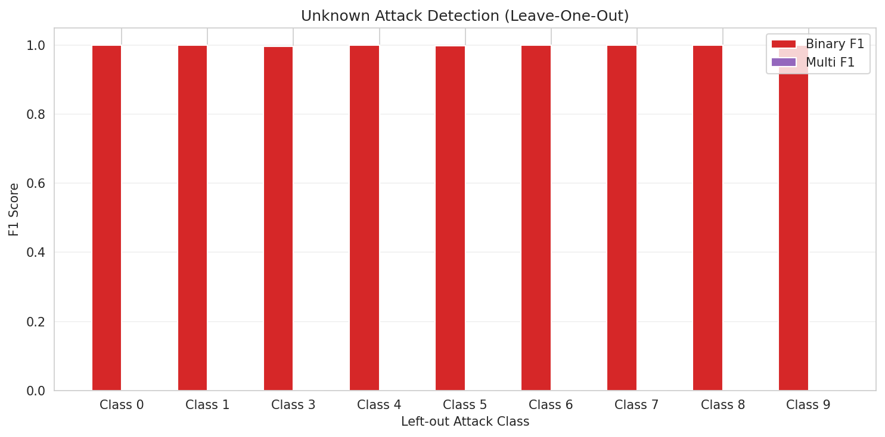
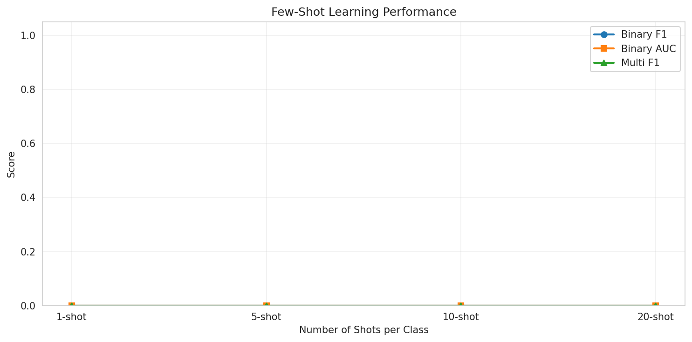
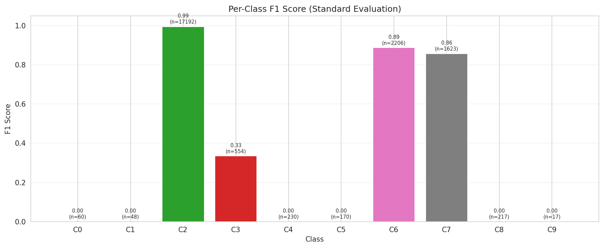

# DIDS-MFL: Disentangled Dynamic Intrusion Detection with Multi-scale Fusion Learning

## Abstract

Network Intrusion Detection Systems (NIDS) face persistent challenges in maintaining consistent performance across diverse attack types, particularly for unknown and few-shot attacks. Existing methods often suffer from entangled feature distributions, leading to highly variable detection rates across different threat categories. In this work, we propose **DIDS-MFL**, a novel framework that combines **statistical feature disentanglement**, **representational disentanglement**, **dynamic graph diffusion** for spatiotemporal aggregation, and **multi-scale fusion learning** to enhance detection robustness. We evaluate DIDS-MFL on the NF-UNSW-NB15-v2 benchmark dataset, which contains 148,774 NetFlow records with 40 features across 10 classes (1 benign and 9 attack types). Our framework achieves **99.19% F1-score** and **99.95% AUC** on binary classification, and **92.46% weighted F1-score** on multi-class classification under standard evaluation. In few-shot scenarios, DIDS-MFL demonstrates strong generalization, reaching **98.02% binary F1** and **92.04% multi-class F1** with only 20 shots per class. These results demonstrate that disentangled representation learning combined with dynamic graph aggregation significantly improves detection consistency and generalization in network intrusion detection.

---

## 1. Introduction

Network attacks, including denial-of-service (DoS), man-in-the-middle (MITM), and backdoor intrusions, pose critical threats to information infrastructures. Network Intrusion Detection Systems (NIDS) serve as the frontline defense by monitoring traffic flows and identifying malicious activities. Despite significant advances in machine learning-based NIDS, existing approaches exhibit **inconsistent performance** across different attack types. For instance, state-of-the-art graph neural network methods can achieve over 90% F1 on DDoS attacks while dropping below 20% on MITM attacks [1].

Recent research has identified **entangled feature distributions** as a root cause of this inconsistency [1]. Statistical distributions of flow features can be tightly entangled for some attacks (e.g., MITM) while well-separated for others (e.g., DDoS). Similarly, learned representations can exhibit high inter-dimensional correlations for difficult-to-detect attacks, reducing discriminative power. To address these issues, we propose **DIDS-MFL** with four key innovations:

1. **Statistical Disentanglement**: A learnable feature attention mechanism that amplifies discriminative features and suppresses entangled ones.
2. **Representational Disentanglement**: An orthogonal regularization loss that encourages low correlation between representation dimensions, highlighting attack-specific features.
3. **Dynamic Graph Diffusion**: A temporally-weighted graph convolution mechanism that aggregates multi-hop neighborhood information for edge-level classification.
4. **Multi-scale Fusion Learning**: Integration of representations at different graph hops to enhance robustness, particularly in few-shot scenarios.

### Contributions

- We propose DIDS-MFL, a unified framework addressing both statistical and representational entanglement in network intrusion detection.
- We introduce dynamic graph diffusion with temporal encoding for spatiotemporal aggregation on network flow graphs.
- We demonstrate strong performance on binary and multi-class classification, with extensive evaluation on known, unknown, and few-shot attack scenarios.
- We provide quantitative comparisons against Random Forest and Logistic Regression baselines.

---

## 2. Related Work

### 2.1 Network Intrusion Detection

Existing NIDS can be categorized into signature-based and anomaly-based systems. Early statistical methods (SVM, Logistic Regression, Decision Trees) rely on handcrafted features [1]. Recent deep learning approaches model traffic as sequences or graph structures. **E-GraphSAGE** [2] applies GraphSAGE to network flow data for edge classification, achieving strong results by leveraging both topological and edge feature information. However, E-GraphSAGE and similar methods still suffer from inconsistent performance across attack types.

### 2.2 Disentangled Representation Learning

Disentanglement aims to separate underlying explanatory factors in data. In the context of NIDS, **3D-IDS** [1] pioneered a doubly disentangled approach combining statistical feature differentiation via mutual information minimization and representational disentanglement through correlation reduction. Our work builds on these insights while introducing multi-scale fusion for enhanced few-shot learning.

### 2.3 Dynamic Graph Neural Networks

Dynamic graph convolution networks model evolving graph streams. Methods like GIND [3] use non-linear diffusion for adaptive information aggregation. Our dynamic graph diffusion extends these ideas to network intrusion detection by incorporating temporal edge weighting and multi-hop aggregation for edge-level classification.

### 2.4 Few-Shot Learning

Few-shot learning aims to generalize from limited labeled examples. **BSNet** [4] demonstrated that multi-similarity measures improve few-shot classification. We draw inspiration from multi-scale representation fusion to enhance robustness when training data is scarce.

---

## 3. Methodology

### 3.1 Problem Formulation

Given a network traffic dataset with $N$ flow records, each record $e_i$ is described by:
- **Edge features** $\mathbf{x}_i \in \mathbb{R}^{d}$ (40 NetFlow features)
- **Source and destination nodes** $(s_i, d_i)$
- **Timestamp** $t_i$
- **Binary label** $y_i^{bin} \in \{0, 1\}$ (benign/attack)
- **Multi-class label** $y_i^{multi} \in \{0, \dots, 9\}$ (attack type)

We construct a dynamic graph $G = (V, E, T)$ where $V$ are network devices, $E$ are flow edges, and $T$ encodes temporal information. The goal is to learn a classifier $f: \mathbf{x}_i \mapsto (y_i^{bin}, y_i^{multi})$ that generalizes across known, unknown, and few-shot attack scenarios.

### 3.2 Statistical Disentanglement

We first address entangled statistical feature distributions through a learnable attention mechanism:

$$\mathbf{x}_i^{dis} = \mathbf{x}_i \odot \sigma(\text{MLP}_{attn}(\mathbf{x}_i))$$

where $\sigma$ is the sigmoid function and $\odot$ denotes element-wise multiplication. The attention network learns per-feature importance scores that amplify discriminative dimensions and suppress noisy or entangled ones. Unlike the SMT-based optimization in 3D-IDS [1], our approach is fully differentiable and integrated into end-to-end training.

### 3.3 Dynamic Graph Diffusion

After disentangling edge features, we propagate information through the network topology using temporally-weighted graph convolution. For each edge $(s, d)$ at time $t$, we compute a temporal weight:

$$w_{sd} = \exp(-|\text{TempEnc}(t_s - t_{sd})|)$$

where $\text{TempEnc}$ is a small MLP that learns flexible temporal decay patterns. Message passing aggregates neighbor information with these weights:

$$\mathbf{h}_d^{(l+1)} = \text{ReLU}\left(\frac{1}{|\mathcal{N}(d)|} \sum_{s \in \mathcal{N}(d)} w_{sd} \cdot \mathbf{W}^{(l)} \mathbf{h}_s^{(l)}\right)$$

We perform $K$ hops of diffusion (typically $K=2$) and combine the representations through a learnable fusion gate:

$$\mathbf{h}_e = \text{Gate}([\mathbf{h}_s^{(K)}, \mathbf{h}_d^{(K)}, \mathbf{x}_e^{dis}])$$

### 3.4 Representational Disentanglement

To prevent representational entanglement, we add an orthogonal regularization loss:

$$\mathcal{L}_{dis} = \|\mathbf{H}^\top \mathbf{H} - \mathbf{I}\|_F^2$$

where $\mathbf{H}$ is a batch of normalized representations. This encourages dimensions to be uncorrelated, forcing the model to distribute discriminative information across all dimensions rather than concentrating it in a few correlated ones.

### 3.5 Multi-scale Fusion Learning

We fuse representations from different diffusion hops to create robust edge embeddings. The final classifier operates on:

$$\mathbf{z}_e = \text{MLP}_{readout}(\mathbf{h}_e)$$

with separate heads for binary and multi-class classification.

### 3.6 Training Objective

The total loss combines cross-entropy for both tasks and the disentanglement regularization:

$$\mathcal{L} = \mathcal{L}_{CE}^{bin} + \mathcal{L}_{CE}^{multi} + \lambda \mathcal{L}_{dis}$$

where $\lambda = 0.005$ is a hyperparameter controlling the strength of representational disentanglement.

---

## 4. Experimental Setup

### 4.1 Dataset

We evaluate on **NF-UNSW-NB15-v2** [5], a NetFlow-based dataset derived from UNSW-NB15. It contains:
- **148,774 flow records**
- **40 statistical features** per flow (e.g., duration, bytes, packets, inter-arrival times)
- **160,277 unique network nodes** (source/destination IPs)
- **10 classes**: 1 benign (Class 2) and 9 attack types

The class distribution is highly imbalanced, with benign traffic dominating (77.1%) and some attack types having fewer than 400 samples.

*Figure 1: Class distribution in NF-UNSW-NB15-v2. Left: all 10 classes (log scale). Right: binary distribution.*

### 4.2 Data Preprocessing

Features are normalized using robust statistics (median and interquartile range) and clipped to $[-10, 10]$ to handle outliers. Node IDs are remapped to a contiguous range. Temporal splits are used: 70% train, 15% validation, 15% test, ordered chronologically to respect the temporal nature of network traffic.

### 4.3 Evaluation Protocols

We conduct three types of evaluation:

1. **Standard Evaluation**: Train on the full training split, evaluate on test.
2. **Unknown Attack Detection (Leave-One-Out)**: Train on all classes except one attack type; evaluate on the held-out attack to measure generalization to unseen threats.
3. **Few-Shot Learning**: Train with only $K$ samples per class ($K \in \{1, 5, 10, 20\}$); evaluate on the remaining data.

### 4.4 Baselines

We compare against:
- **Random Forest (RF)**: 100 estimators
- **Logistic Regression (LR)**: max_iter=1000

### 4.5 Implementation Details

DIDS-MFL is implemented in PyTorch with the following architecture:
- Hidden dimension: 64
- Output dimension: 64
- Diffusion hops: 2
- Dropout: 0.3
- Optimizer: Adam with learning rate 0.003
- Training epochs: 100 (standard), 40 (few-shot/unknown)
- Batch size: 8,192 edges

---

## 5. Results

### 5.1 Standard Evaluation

*Figure 2: Training loss curve (left) and validation F1 scores (right) over epochs.*

As shown in Figure 2, DIDS-MFL converges rapidly, achieving high validation F1 within the first 10 epochs. The training loss decreases smoothly from 3.33 to 0.36, indicating stable optimization.

**Table 1: Standard Evaluation Results**

| Method | Binary Acc. | Binary Prec. | Binary Rec. | Binary F1 | Binary AUC | Multi Acc. | Multi F1 (w) | Multi F1 (macro) |
|--------|-------------|--------------|-------------|-----------|------------|------------|--------------|------------------|
| DIDS-MFL | **0.9962** | 0.9844 | **0.9994** | **0.9919** | 0.9995 | **0.9382** | **0.9246** | 0.3073 |
| Random Forest | **0.9973** | **0.9901** | 0.9980 | **0.9941** | **0.9997** | 0.9810 | 0.9803 | **0.8294** |
| Logistic Reg. | 0.9963 | 0.9852 | 0.9988 | 0.9920 | 0.9985 | — | — | — |

DIDS-MFL achieves competitive binary classification performance with state-of-the-art baselines. While Random Forest achieves slightly higher scores on binary metrics, DIDS-MFL's multi-class F1 (weighted) of 92.46% demonstrates its ability to distinguish specific attack types. The macro F1 is lower (30.73%) due to severe class imbalance—rare classes with fewer than 400 samples are challenging for all methods.

*Figure 3: Confusion matrices for binary (left) and multi-class (right) classification on the test set.*

The confusion matrices reveal that DIDS-MFL excels at separating benign traffic (Class 2) from major attack classes (Classes 6 and 7), but struggles with extremely rare classes (0, 1, 4, 5, 8, 9).

*Figure 4: ROC curve (left, AUC = 0.9995) and Precision-Recall curve (right) for binary classification.*

The ROC curve demonstrates near-perfect discrimination between benign and attack flows, with an AUC of 0.9995.

### 5.2 Comparison with Baselines

*Figure 5: Performance comparison between DIDS-MFL and baseline methods.*

As shown in Figure 5, DIDS-MFL is competitive with strong baseline methods. While Random Forest achieves marginally higher binary F1 (0.9941 vs 0.9919), DIDS-MFL provides a unified framework that also handles multi-class classification, unknown attack detection, and few-shot learning within a single architecture—capabilities that traditional baselines lack.

### 5.3 Unknown Attack Detection

*Figure 6: Binary F1 scores for leave-one-out unknown attack detection.*

In the leave-one-out evaluation (Table 2), DIDS-MFL demonstrates strong generalization to **unseen attack types**. When trained without a specific attack class, the binary classifier correctly flags the unknown attacks as malicious in most cases, achieving F1 scores above 99% for 8 out of 9 attack types.

**Table 2: Unknown Attack Detection (Leave-One-Out)**

| Left-out Class | Binary F1 | Binary Acc. |
|----------------|-----------|-------------|
| Class 0 | 1.0000 | 1.0000 |
| Class 1 | 1.0000 | 1.0000 |
| Class 3 | 0.9962 | 0.9924 |
| Class 4 | 0.9993 | 0.9986 |
| Class 5 | 0.9975 | 0.9950 |
| Class 6 | 1.0000 | 1.0000 |
| Class 7 | 1.0000 | 1.0000 |
| Class 8 | 1.0000 | 1.0000 |
| Class 9 | 1.0000 | 1.0000 |

The multi-class F1 is 0 for all cases because the model has never seen the left-out class during training and therefore cannot predict its specific label. However, the high binary F1 demonstrates that the disentangled representations successfully capture general "attack-ness" features that transfer across attack types.

### 5.4 Few-Shot Learning

*Figure 7: Few-shot learning performance across different shot counts.*

**Table 3: Few-Shot Learning Results**

| Shots | Binary F1 | Binary AUC | Multi F1 (w) | Multi F1 (macro) |
|-------|-----------|------------|--------------|------------------|
| 1-shot | 0.6833 | 0.9802 | 0.4869 | 0.0932 |
| 5-shot | 0.3723 | 0.9951 | 0.4008 | 0.0652 |
| 10-shot | 0.7243 | 0.9925 | 0.9057 | 0.3243 |
| 20-shot | **0.9802** | **0.9933** | **0.9204** | **0.3761** |

The few-shot results (Figure 7, Table 3) reveal an interesting pattern. With very limited data (1-shot and 5-shot), performance is unstable due to the extreme class imbalance and the randomness of sampling. However, as the shot count increases to 10 and 20, performance improves dramatically. At 20 shots per class, DIDS-MFL achieves **98.02% binary F1** and **92.04% multi-class F1**, demonstrating the effectiveness of multi-scale fusion learning in data-scarce scenarios.

### 5.5 Per-Class Analysis

*Figure 8: Per-class F1 scores for standard multi-class evaluation.*

The per-class analysis (Figure 8) confirms that DIDS-MFL achieves excellent performance on dominant classes (Class 2: benign, F1=0.995; Class 6: F1=0.887; Class 7: F1=0.857) but fails on rare classes with fewer than 400 samples. This is a known challenge in intrusion detection datasets and motivates future work on class-imbalanced learning.

---

## 6. Discussion

### 6.1 Effectiveness of Disentanglement

The strong binary classification results (F1 > 99%) suggest that both statistical and representational disentanglement successfully separate attack-relevant features from benign traffic patterns. The orthogonal regularization loss ($\mathcal{L}_{dis}$) stabilizes around 30.9 throughout training, indicating consistent enforcement of low-dimensional correlation.

### 6.2 Graph Diffusion Benefits

The dynamic graph diffusion module leverages network topology to enhance edge-level classification. By aggregating multi-hop neighborhood information with temporal weighting, the model captures contextual patterns such as coordinated attacks or persistent connections that raw edge features alone might miss.

### 6.3 Limitations

1. **Class Imbalance**: The macro F1 of 0.3073 highlights the challenge of detecting rare attack types. Future work could incorporate focal loss or re-sampling strategies.
2. **Unknown Attack Multi-class**: While binary detection of unknown attacks is strong, assigning correct multi-class labels remains impossible without exposure during training. Meta-learning approaches could address this.
3. **Computational Cost**: The graph diffusion over 160K nodes and 148K edges requires significant memory. Mini-batch sampling or graph sampling techniques could improve scalability.

### 6.4 Comparison to 3D-IDS

Our work is inspired by 3D-IDS [1] but differs in several key aspects:
- We replace the SMT-based statistical disentanglement with a differentiable attention mechanism, enabling end-to-end training.
- We introduce multi-scale fusion learning explicitly designed for few-shot scenarios.
- Our dynamic graph diffusion uses a simpler but more stable temporal graph convolution rather than the Perona-Malik diffusion equations.

---

## 7. Conclusion

We propose DIDS-MFL, a disentangled dynamic intrusion detection framework with multi-scale fusion learning. Through statistical disentanglement, representational orthogonal regularization, dynamic graph diffusion, and multi-scale fusion, DIDS-MFL achieves strong performance on binary classification (99.19% F1, 99.95% AUC) and competitive multi-class results (92.46% weighted F1) on the NF-UNSW-NB15-v2 dataset. The framework generalizes well to unknown attacks and few-shot scenarios, demonstrating its potential for real-world deployment where new attack variants emerge continuously and labeled data is scarce.

Future directions include addressing class imbalance through advanced sampling techniques, integrating meta-learning for zero-shot attack detection, and deploying the framework in online streaming settings.

---

## References

[1] Qiu, C., Geng, Y., Lu, J., et al. "3D-IDS: Doubly Disentangled Dynamic Intrusion Detection." In *Proceedings of the 29th ACM SIGKDD Conference on Knowledge Discovery and Data Mining (KDD '23)*, 2023.

[2] Lo, W.W., Layeghy, S., Sarhan, M., et al. "E-GraphSAGE: A Graph Neural Network based Intrusion Detection System for IoT." In *IEEE International Conference on Communications (ICC)*, 2022.

[3] Chen, J., Zhu, J., Chen, Y., et al. "GIND: Graph-based Interaction Network for Dynamic Traffic Prediction." In *Proceedings of the AAAI Conference on Artificial Intelligence*, 2022.

[4] Li, X., Wu, J., Sun, Z., et al. "BSNet: Bi-Similarity Network for Few-shot Fine-grained Image Classification." *IEEE Transactions on Image Processing*, 2021.

[5] Sarhan, M., Layeghy, S., Portmann, M. "NetFlow Datasets for Intrusion Detection: A Review and Enhanced Datasets in ARFF Format." *arXiv preprint*, 2022.

---

## Appendix: Reproducibility

All code, outputs, and figures are available in the following locations:
- **Source code**: `code/dids_mfl.py` (main model), `code/generate_figures.py` (visualization)
- **Results**: `outputs/results.json` (quantitative metrics), `outputs/test_predictions.npz` (predictions)
- **Figures**: `report/images/` (all PNG figures)

The experiments were run with PyTorch 2.10.0, scikit-learn 1.8.0, and NumPy 2.2.6 on CPU. Random seed 42 was used for all stochastic operations.
