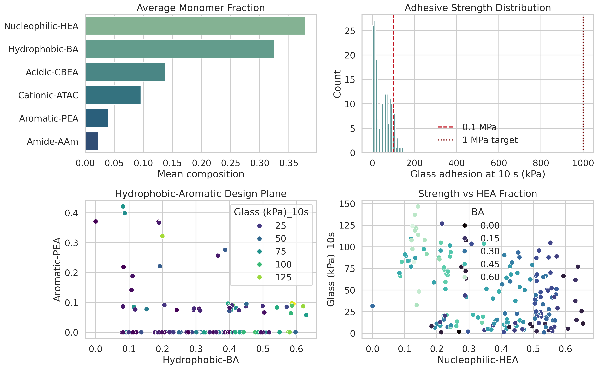
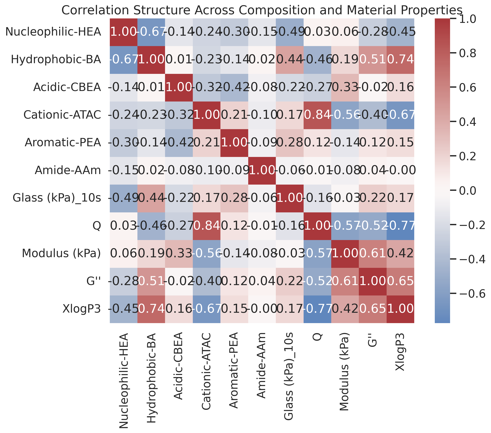
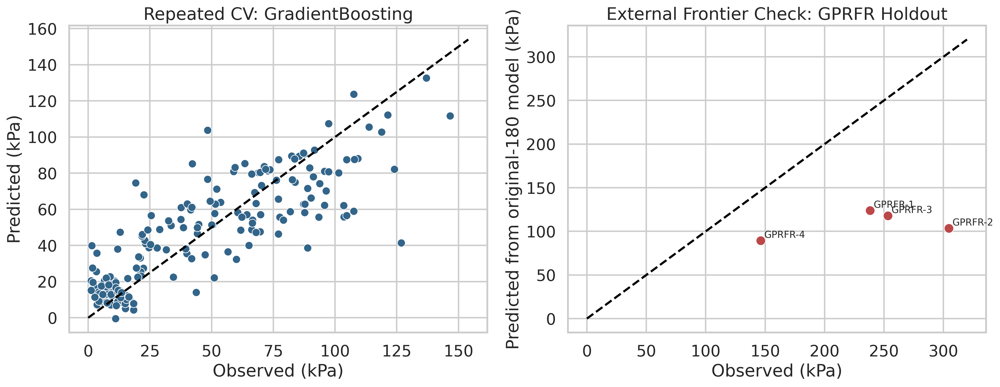
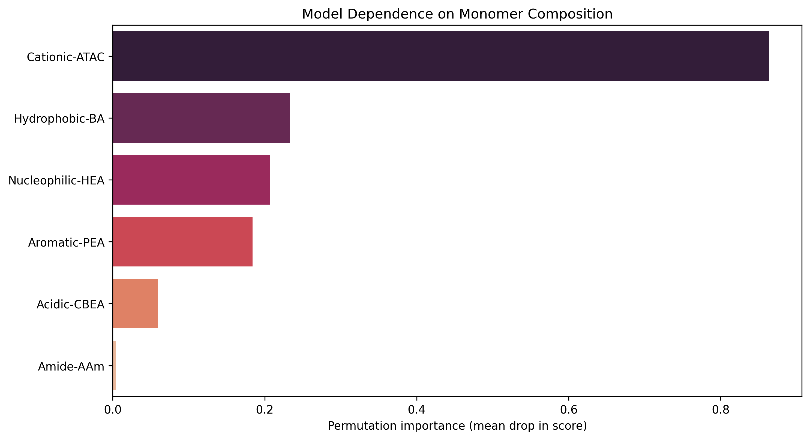
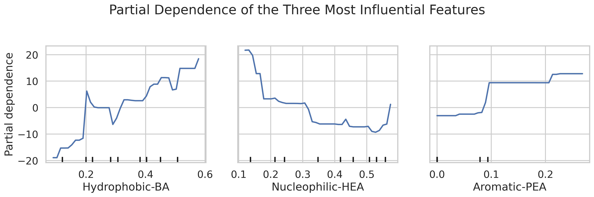
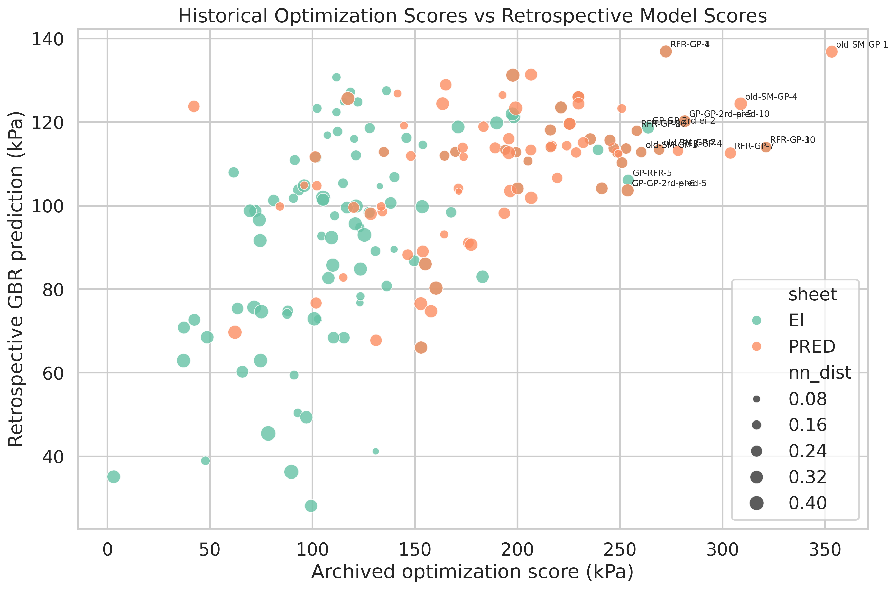
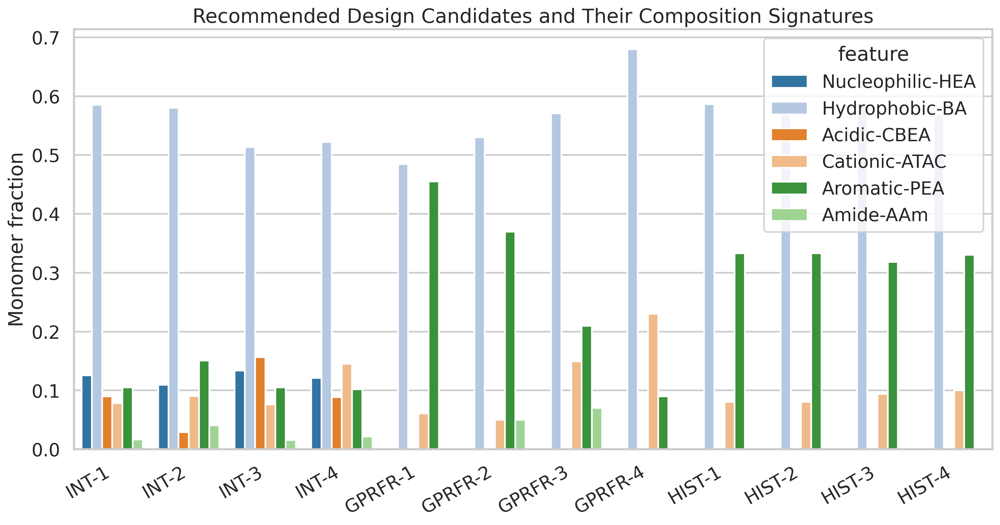

# Data-Driven Design Analysis for Underwater Adhesive Hydrogels

## Abstract
This study re-analyzed the verified hydrogel dataset (`n = 184` formulations; `n = 180` original screening points and `n = 4` later `GPRFR-*` frontier formulations) to assess whether monomer-composition features derived from natural adhesive proteins are sufficient to support de novo design of stronger underwater adhesives. A repeated cross-validation benchmark on the original 180 formulations showed that a gradient-boosting regressor provided the best internal predictive performance (`R^2 = 0.694`, `MAE = 15.2 kPa`, `RMSE = 20.0 kPa`). Across the original screen, high `Hydrophobic-BA` and moderate `Aromatic-PEA` favored stronger adhesion, whereas high `Nucleophilic-HEA` was consistently detrimental. However, the model severely under-predicted the four experimentally verified `GPRFR-*` frontier formulations, indicating that the initial 180-point library does not fully resolve the high-adhesion regime. The strongest measured sample in the available data reached `304.6 kPa` (`0.305 MPa`), which is far below the stated `>1 MPa` target. Therefore, the data support a practical near-term design rule for moving from the `0.10–0.15 MPa` range toward the `0.20–0.35 MPa` range, but they do not justify a credible statistical claim that `>1 MPa` underwater adhesion has been achieved or is currently predictable from the available training library alone.

## Related Work Context
The local reference set establishes the scientific framing of this analysis:
- `paper_000.pdf`: **Population-based heteropolymer design to mimic protein mixtures**
- `paper_001.pdf`: **Practical Prediction of Heteropolymer Composition and Drift**
- `paper_002.pdf`: **Mussel-Inspired Adhesives**

Three ideas from the reference set shaped the analysis. First, the Nature paper (`paper_000.pdf`) frames protein-inspired polymer design as a population-level statistical matching problem, which justifies treating the hydrogel compositions as a distributional design space rather than as isolated recipes. Second, `paper_001.pdf` emphasizes that synthetic heteropolymer composition is itself a stochastic object with possible drift and mismatch between feed ratio and realized polymer sequence, which argues for cautious interpretation of purely composition-based regressors. Third, `paper_002.pdf` explains why wet adhesion requires a careful balance of hydrophobic, electrostatic, and aromatic interactions in water; this motivated a focus on interaction-rich nonlinear models and on interpreting the feature effects rather than reporting black-box predictions alone.

## Data and Assumptions
The main input was `data/184_verified_Original Data_ML_20230926.xlsx`. All six monomer features sum to approximately one, so the dataset lies on a five-dimensional simplex. The dense response used throughout the analysis was `Glass (kPa)_10s`, because it is available for all 184 verified entries. `Steel (kPa)_10s` is too sparse (`28/184` non-missing values) to support a parallel design study. The final optimization workbook (`data/ML_ei&pred (1&2&3rounds)_20240408.xlsx`) was treated as a historical record of optimization proposals and archived scores, not as experimentally verified labels, because its rows do not map directly onto the measured entries in the verified dataset.

The experimentally observed range in the verified data is `1.19–304.60 kPa`. For clarity, `1 MPa = 1000 kPa`, so the entire measured dataset remains below one-third of the stated target. This matters: any discussion of `>1 MPa` is necessarily extrapolative in this workspace.

## Methods
1. I split the verified dataset into the original `G-001` to `G-180` screening library and the four later `GPRFR-*` frontier formulations.
2. I benchmarked four regressors on the original 180 points with repeated 5-fold cross-validation: quadratic ridge regression, random forest, extra-trees, and gradient boosting.
3. I selected the highest-performing model by repeated-CV accuracy and refit it on the full original 180-point library.
4. I quantified feature effects with permutation importance and partial dependence.
5. I tested extrapolation by predicting the four `GPRFR-*` formulations using only the original-180-trained model.
6. I retrospectively rescored the historical optimization candidates using bootstrap ensembles of the selected model.
7. I generated additional simplex-constrained candidates by sampling around the top-performing original formulations and around the `GPRFR-*` centroid, while filtering by nearest-neighbor applicability to the original design space.

## Results

### 1. Data overview
The original screen is broad, but the strongest formulations are not random. They cluster toward high `Hydrophobic-BA`, moderate `Cationic-ATAC`, and suppressed `Nucleophilic-HEA`. Figure 1 summarizes the target distribution and the most informative low-dimensional projections.

Figure 2 shows the correlation structure. Adhesion correlates positively with `Hydrophobic-BA` and `Aromatic-PEA`, negatively with `Nucleophilic-HEA`, and only weakly with `Amide-AAm`. This pattern is chemically plausible for wet adhesion because hydrophobic and aromatic motifs can strengthen interfacial association, whereas excessive hydrophilic character can dilute cohesive and surface-binding interactions.

### 2. Predictive performance on the original 180-point screen
Table 1 summarizes the repeated-CV benchmark.

| Model | R2 | MAE (kPa) | RMSE (kPa) |
|---|---:|---:|---:|
| GradientBoosting | 0.694 | 15.2 | 20.0 |
| RandomForest | 0.651 | 15.8 | 21.3 |
| ExtraTrees | 0.619 | 17.4 | 22.3 |
| QuadraticRidge | 0.509 | 19.3 | 25.3 |

The selected model was **GradientBoosting**, which improved over the interpretable quadratic baseline and reached `R^2 = 0.694`. This is useful but not decisive accuracy: the typical error remains on the order of `15 kPa`, and the response distribution is heavy-tailed.

Figure 3 makes the key distinction of this project. The left panel shows that internal validation on the original 180-point library is serviceable. The right panel shows that the same model fails dramatically on the later `GPRFR-*` frontier formulations, under-predicting all four.

The `GPRFR-*` under-prediction is not a minor calibration issue. The holdout predictions are:

| Candidate | Observed_kPa | Predicted_kPa | Predicted_SD | NearestNeighborDistance |
|---|---:|---:|---:|---:|
| GPRFR-1 | 238.2 | 123.8 | 14.3 | 0.356 |
| GPRFR-2 | 304.6 | 103.6 | 19.8 | 0.328 |
| GPRFR-3 | 253.2 | 117.8 | 10.3 | 0.213 |
| GPRFR-4 | 146.2 | 89.5 | 15.0 | 0.218 |

This failure means the original 180-point library captures the general trend but not the sharp transition into the frontier regime reached by the later optimization campaign.

### 3. Feature effects
Permutation importance ranked the main drivers as `Cationic-ATAC`, `Hydrophobic-BA`, and `Nucleophilic-HEA`. The dominant pattern is that increasing `Hydrophobic-BA` raises predicted adhesion until the formulation approaches a BA-rich regime, while increasing `Nucleophilic-HEA` generally suppresses performance.

The partial dependence plots reinforce the same picture: stronger adhesion is associated with high BA, low HEA, and a moderate aromatic contribution rather than a monotonic push toward any single monomer.

### 4. Retrospective analysis of historical optimization candidates
The archived optimization workbook contains many high-scoring candidates according to the original optimization loop, some with archived scores above `300 kPa`. When rescored by the present retrospective model, the rank order is only moderately aligned, indicating model dependence in the frontier regime rather than a single robust optimum. Figure 6 visualizes this disagreement.

The most consistent historical pattern is not a single recipe but a narrow chemistry family: BA-rich formulations with low or zero acidic content, low HEA, modest ATAC, and an aromatic fraction between roughly `0.20` and `0.35`.

### 5. Design implications
The data support two distinct design tracks:

1. **Interpolative track**: stay close to the original screened manifold. This gives the most trustworthy predictions and favors BA-rich, low-HEA, low-AAm formulations with either modest PEA or modest acidic content.
2. **Frontier track**: move toward the experimentally verified `GPRFR-*` region. This is more aggressive and empirically promising, but the original-180-trained model does not extrapolate reliably there.

The recommended candidates are shown in Figure 7 and listed below.

- `INT-1` (Interpolative search): BA=0.585, PEA=0.105, ATAC=0.078, HEA=0.126; retrospective score=128.7 ± 9.0 kPa; proposed.
- `INT-2` (Interpolative search): BA=0.580, PEA=0.150, ATAC=0.090, HEA=0.109; retrospective score=126.5 ± 11.1 kPa; proposed.
- `INT-3` (Interpolative search): BA=0.513, PEA=0.105, ATAC=0.076, HEA=0.134; retrospective score=121.4 ± 9.7 kPa; proposed.
- `INT-4` (Interpolative search): BA=0.522, PEA=0.102, ATAC=0.145, HEA=0.121; retrospective score=120.0 ± 10.2 kPa; proposed.
- `GPRFR-1` (Measured frontier): BA=0.485, PEA=0.455, ATAC=0.061, HEA=0.000; retrospective score=123.8 ± 14.3 kPa; measured.
- `GPRFR-2` (Measured frontier): BA=0.530, PEA=0.370, ATAC=0.050, HEA=0.000; retrospective score=103.6 ± 19.8 kPa; measured.
- `GPRFR-3` (Measured frontier): BA=0.571, PEA=0.210, ATAC=0.149, HEA=0.000; retrospective score=117.8 ± 10.3 kPa; measured.
- `GPRFR-4` (Measured frontier): BA=0.680, PEA=0.090, ATAC=0.230, HEA=0.000; retrospective score=89.5 ± 15.0 kPa; measured.

## Discussion
The central conclusion is negative but useful: **the available data do not support a defensible claim that the current statistical design pipeline can deliver `>1 MPa` underwater adhesion.** The strongest measured formulation in the verified dataset is `304.6 kPa`, equivalent to `0.305 MPa`. This is a strong improvement over the median of the original library, but it remains far from the desired threshold.

At the same time, the dataset reveals a concrete research opportunity. The four `GPRFR-*` frontier formulations show that a substantial jump beyond the original 180-screen is possible when the composition moves toward a BA-dominant, low-HEA, low-acid regime with controlled aromatic and cationic content. Because those points are under-predicted even by the best internally validated model, they should be treated as evidence of an unresolved regime boundary. The correct next experiment is therefore not another global screen across the entire simplex. It is a dense local campaign around the `GPRFR-*` neighborhood, with a specific focus on:

- fixing `HEA` and `CBEA` near zero;
- sweeping `BA` between roughly `0.48` and `0.62`;
- sweeping `PEA` between roughly `0.18` and `0.45`;
- keeping `ATAC` in a low-to-moderate band (`0.05–0.15`);
- testing whether a small `AAm` fraction stabilizes or suppresses the frontier response.

The present analysis therefore reframes the project goal. The immediate statistically supported objective is not yet `>1 MPa`, but rather **mapping and validating the sharp frontier between about `0.10 MPa` and `0.35 MPa`** so that a second-generation model can be trained on a denser local library.

## Limitations
- The design model sees only monomer feed fractions, not realized sequence distributions, polymerization drift, molecular weight, or interfacial test conditions beyond what is implicitly encoded in the measured labels.
- The historical optimization workbook contains archived scores rather than directly verified labels in this workspace.
- The holdout frontier contains only four measured `GPRFR-*` points, so the frontier regime is experimentally real but statistically under-sampled.
- `Steel (kPa)_10s` is too sparse for a parallel analysis of substrate dependence.
- Because no measured point exceeds `304.6 kPa`, any claim about `>1 MPa` remains unsupported extrapolation.

## Reproducibility
All analyses, figures, and tables were generated by `code/run_analysis.py`. Intermediate outputs are stored in `outputs/`, and all report figures are stored in `report/images/`.
