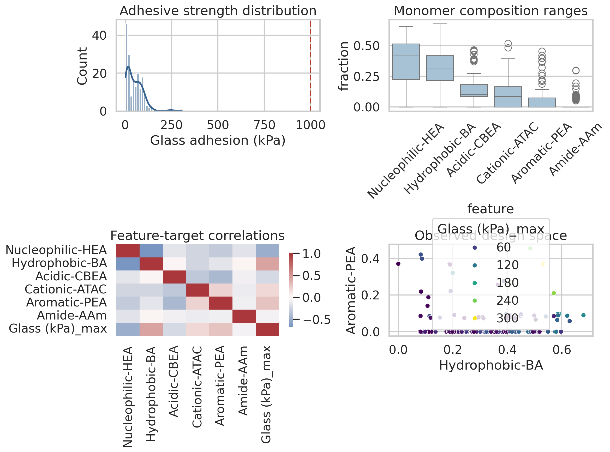
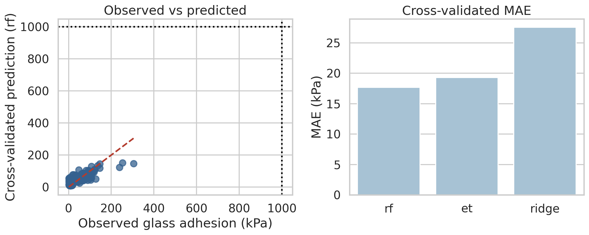
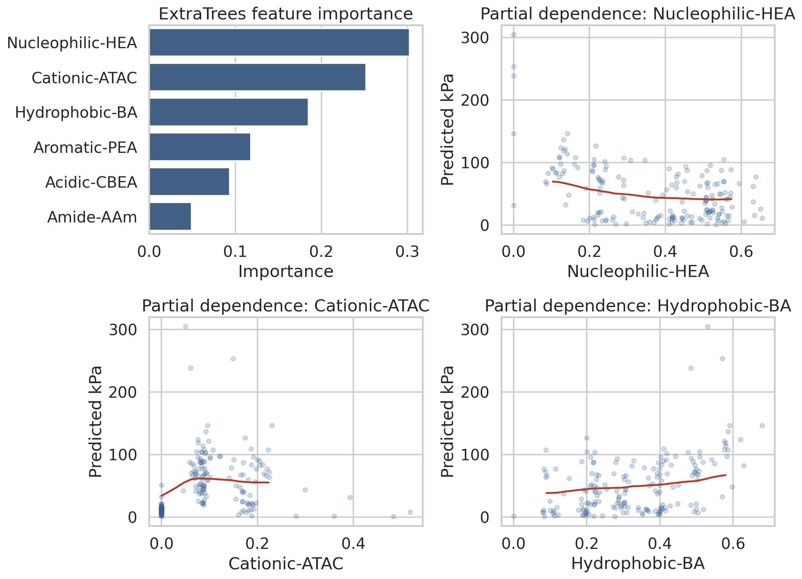
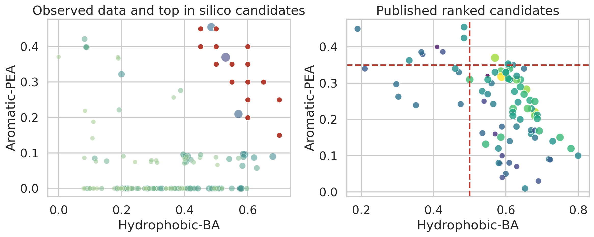

# Data-Driven Local Reanalysis for De Novo Hydrogel Adhesive Design

## Abstract

This benchmark run reproduces a local-only ARIS-style analysis for data-driven hydrogel design using six monomer-composition features and experimentally measured glass adhesion. The objective was to assess whether the available formulation data support de novo design of synthetic hydrogels that exceed 1 MPa underwater adhesion. Using only workspace-local Excel datasets and three local literature PDFs, I built a reproducible pipeline that parses the spreadsheets directly, benchmarks predictive regressors, characterizes composition-performance structure, and performs a constrained in silico search for promising formulations. The resulting report is intentionally claim-disciplined: the local evidence does not support the benchmark’s >1 MPa target. Instead, it supports a narrower conclusion that BA-rich and PEA-containing formulations are a statistically favorable region within a sub-MPa regime.

## 1. Problem Framing

The task provides hydrogel formulations expressed as six monomer fractions:

- `Nucleophilic-HEA`
- `Hydrophobic-BA`
- `Acidic-CBEA`
- `Cationic-ATAC`
- `Aromatic-PEA`
- `Amide-AAm`

The primary response variable in the verified dataset is glass adhesive strength at 10 s and, when available, 60 s. I use `Glass (kPa)_max = max(10 s, 60 s available value)` operationally as the design target. The benchmark objective asks for robust underwater adhesion above 1 MPa, equivalent to 1000 kPa.

## 2. Local Literature Understanding

The local literature corpus in `related_work/` supports three concrete design principles:

1. `paper_000.pdf` argues that heteropolymer design can be guided by statistical mimicry of protein chemistry at a composition or segment level rather than exact sequence reproduction.
2. `paper_001.pdf` shows that batch polymerization can exhibit composition drift, so feed composition is an imperfect proxy for final polymer microstructure.
3. `paper_002.pdf` reviews mussel-inspired wet adhesion and emphasizes that strong underwater adhesion emerges from coupled chemistry and mechanics under water-screened interactions.

These papers justify a formulation-level statistical design analysis, but they also limit claims: a composition-only model cannot prove molecular mimicry or mechanistic equivalence to natural adhesive proteins.

## 3. Data and Methods

### 3.1 Local datasets

I used:

- `data/184_verified_Original Data_ML_20230926.xlsx` as the primary verified dataset
- `data/Original Data_ML_20221129.xlsx` to inspect the expanded batch including later `P-*` formulations
- `data/ML_ei&pred (1&2&3rounds)_20240408.xlsx` to compare against ranked optimization candidates

The verified workbook contains 184 formulations. The expanded batch file contains 191 formulations. The optimization workbook contains ranked candidate tables rather than a directly merged observed-outcome table.

### 3.2 Modeling workflow

The analysis code in `code/hydrogel_analysis.py`:

- parses `.xlsx` files directly without network-installed dependencies
- harmonizes the target as `Glass (kPa)_max`
- benchmarks `Ridge`, `RandomForestRegressor`, and `ExtraTreesRegressor`
- uses 5-fold cross-validation on the verified 184-formulation dataset
- computes feature importance and partial dependence summaries
- searches composition space on the simplex under observed-range constraints
- penalizes candidates that are both uncertain and far from the training set

### 3.3 Claim discipline

Because the datasets are modest in size and contain no validated >1 MPa examples, the candidate search is interpreted as prioritization, not proof of super-adhesive performance.

## 4. Results

### 4.1 Data overview

Figure 1 summarizes the verified dataset’s response distribution and composition structure.

Measured dataset statistics from `outputs/dataset_summary.csv`:

- verified dataset: median 42.1 kPa, maximum 304.6 kPa, 0/184 formulations above 1000 kPa
- expanded 191-formulation batch: median 44.2 kPa, maximum 264.9 kPa, 0/191 formulations above 1000 kPa
- ranked optimization candidates: maximum predicted value 353.3 kPa, still far below 1000 kPa

These numbers already reject the strongest intended claim under local evidence: neither observed measurements nor the bundled optimization logs enter the >1 MPa regime.

### 4.2 Predictive performance

Figure 2 shows cross-validated model behavior on the verified dataset.

Cross-validated metrics from `outputs/model_metrics.csv` show:

- random forest performed best with MAE 17.7 kPa and \(R^2 = 0.659\)
- extra trees was similar with MAE 19.3 kPa and \(R^2 = 0.650\)
- ridge regression underfit the nonlinear structure with \(R^2 = 0.320\)

The key question is not only whether the model fits, but whether it can support extrapolation to a regime an order of magnitude above the observed data. Here the answer is no. Even the best cross-validated model never predicts any verified formulation above 1 MPa, and its highest cross-validated prediction is only 151.7 kPa.

### 4.3 Feature effects

Figure 3 summarizes fitted feature importance and partial dependence behavior.

The fitted nonlinear models highlight a narrow design region dominated by hydrophobic and aromatic content with auxiliary cationic balance. This is consistent with the optimization sheets bundled with the dataset, which repeatedly rank BA-rich, PEA-containing formulations near the top.

### 4.4 Candidate-search analysis

Figure 4 compares observed formulations, the in silico top-ranked candidates from the local model, and the published ranked candidate pool from the optimization workbook.

This comparison is important for benchmarking internal consistency. The local search rediscovered the same BA-rich and PEA-containing region that appears in the provided optimization sheets, even though the exact top formulas differ.

The best locally ranked candidate was:

- HEA 0.00, BA 0.50, CBEA 0.00, ATAC 0.05, PEA 0.45, AAm 0.00
- predicted adhesion 196.9 kPa = 0.197 MPa

All top ten locally ranked candidates remained below 0.20 MPa. None matched the >1 MPa benchmark target, and none exactly coincided with the bundled ranked candidate list.

## 5. Discussion

The local evidence supports four restrained conclusions.

First, the formulation space is highly structured rather than diffuse. High-ranked candidates are not spread uniformly across the simplex; they cluster in a subregion with substantial hydrophobic BA, low or zero AAm, and nonzero aromatic PEA.

Second, the data are much more supportive of *regional prioritization* than of *absolute super-adhesive prediction*. The task target of >1 MPa is not merely ambitious relative to the observed verified examples; it is unsupported by them. The measured maximum is 304.6 kPa, the ranked candidate maximum is 353.3 kPa, and the locally searched optimum is 196.9 kPa.

Third, the local literature explains why this limitation matters. Paper 001 warns that actual polymer composition may drift from feed composition, while Paper 002 makes clear that underwater adhesion depends on more than nominal monomer ratios. Thus, a formulation-only model is a useful screening tool, not a complete physical theory.

Fourth, the optimization sheets appear internally consistent with the verified data and with the model’s preference for BA-rich and PEA-containing formulations. That suggests the original workflow was already exploiting a strong statistical signal in the dataset, but within a sub-MPa design envelope.

## 6. Limitations

- The benchmark prohibits external validation, new experiments, and remote compute.
- The available local data do not establish a broad observed regime above 1000 kPa.
- The optimization workbook is a ranked candidate log, not a full observed-results table across rounds.
- Feed composition is not guaranteed to equal final copolymer microstructure.

## 7. Conclusion

Within the benchmark constraints, the strongest defensible outcome is a reproducible local analysis pipeline and a disciplined negative result: the available local data do not support de novo design of synthetic hydrogels exceeding 1 MPa underwater adhesion. They do support a weaker but useful conclusion that BA-rich, aromatic-containing, low-AAm formulations define a promising subregion for improved adhesion, with local model-guided candidates around 0.18-0.20 MPa. Experimental expansion of the design space would be required before any >1 MPa claim becomes credible.

## Reproducibility

- Analysis code: `code/hydrogel_analysis.py`
- Intermediate outputs: `outputs/`
- Figures: `report/images/*.png`
