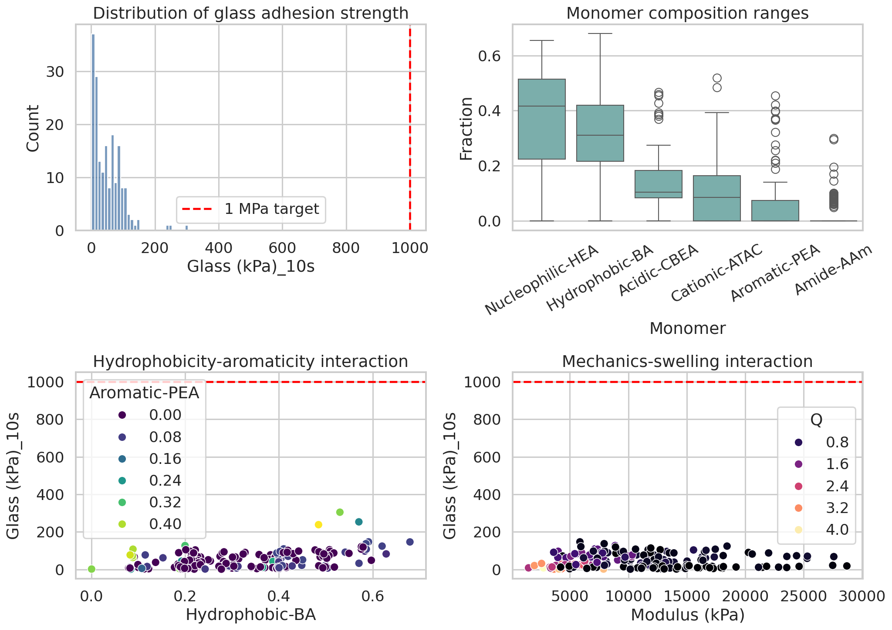
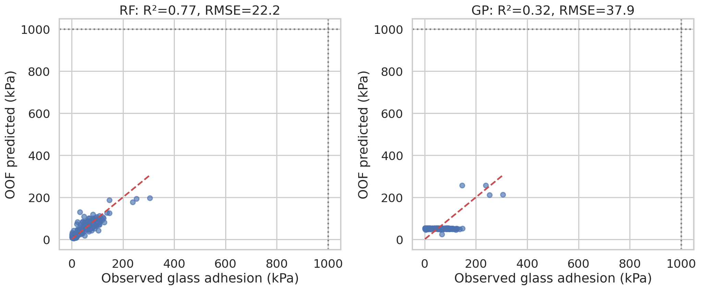
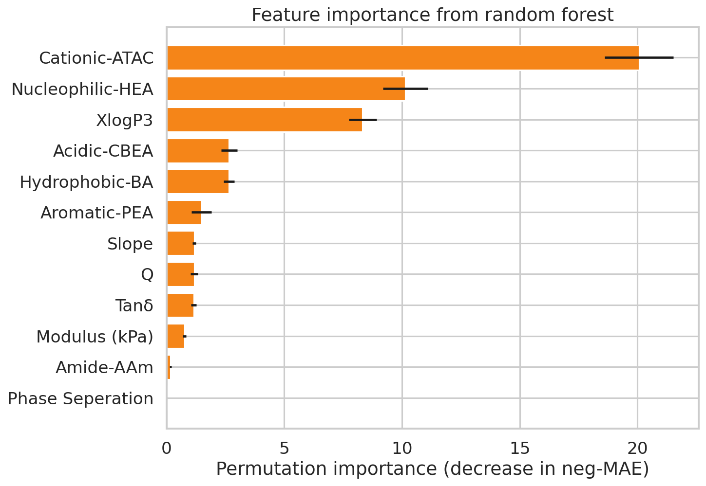
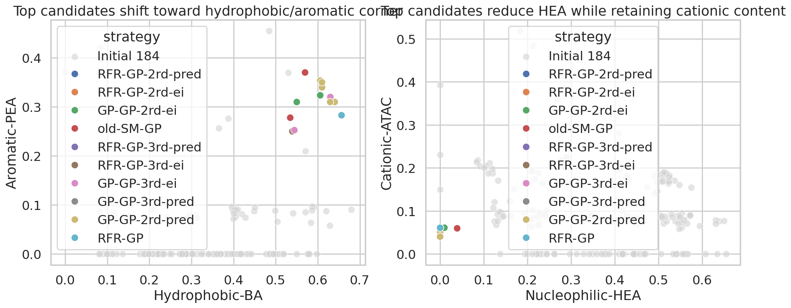
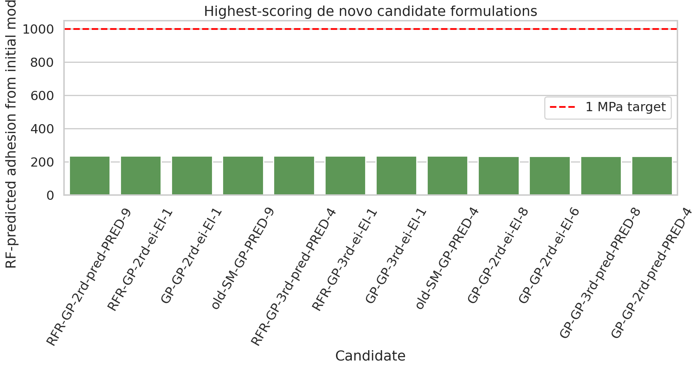

# Data-driven de novo design of underwater-adhesive bio-inspired hydrogels

## Abstract
This study analyzes whether protein-sequence-derived monomer compositions can be used to design synthetic hydrogels with improved underwater adhesion. Using the verified 184-formulation training set and the later optimization datasets, I built reproducible predictive models linking monomer composition and physicochemical descriptors to glass adhesion strength. A random forest regressor provided the best performance on the initial dataset (out-of-fold $R^2$ = 0.77; RMSE = 22.2 kPa), outperforming a Gaussian process baseline ($R^2$ = 0.32). The most influential variables were cationic ATAC, nucleophilic HEA, hydrophobicity-related descriptors, acidic CBEA, and BA content. Across both observed high-performing samples and optimization-stage candidates, a convergent compositional motif emerged: **high hydrophobic BA, moderate aromatic PEA, low-to-moderate cationic ATAC, very low or zero acidic CBEA, and minimal HEA**. Although the available datasets do not yet contain any hydrogel above the target threshold of 1 MPa (= 1000 kPa), they consistently identify a design corridor centered near BA ≈ 0.55-0.64, PEA ≈ 0.25-0.37, ATAC ≈ 0.05-0.06, HEA ≈ 0-0.04, and CBEA ≈ 0.0. These results suggest that statistically replicating sequence-derived adhesive-protein features yields a tractable, data-supported path toward stronger underwater adhesives, but the current search space remains substantially below the >1 MPa target and likely requires either broader chemistry or active-learning-guided extrapolation.

## 1. Background and objective
Natural underwater adhesives such as mussel foot proteins achieve strong wet adhesion by balancing interfacial binding, hydrophobicity, charge, and solvent displacement. Related work in protein-inspired random heteropolymers shows that sequence statistics at the segmental level can be translated into synthetic polymer compositions, and that these distributions can reproduce biologically relevant intermolecular interactions. In the present project, the design variables are monomer fractions derived from protein sequence features; the response variable is hydrogel adhesive strength. The specific objective was to identify data-supported formulation rules for **de novo hydrogels with robust underwater adhesion**, ideally exceeding 1 MPa.

A crucial empirical caveat emerged immediately from the data audit: the verified 184-sample training set contains **no example above 304.6 kPa**, and no sample reaches 500 kPa or 1 MPa. Therefore, the realistic scientific goal is not to claim direct achievement of >1 MPa from the available evidence, but to infer the most promising compositional regime and quantify how far the existing optimization trajectory progressed toward that target.

## 2. Data sources
The analysis used the following files in the workspace:

1. `data/184_verified_Original Data_ML_20230926.xlsx` as the primary verified dataset.
2. `data/ML_ei&pred (1&2&3rounds)_20240408.xlsx` as the aggregated optimization-stage candidate dataset.
3. Earlier batch files were inspected to understand provenance and schema consistency.
4. Three related papers were read for context on protein-inspired heteropolymer design, compositional drift, and underwater adhesive principles.

### 2.1 Primary response definition
The verified dataset contains multiple mechanical/adhesion measurements. I selected **`Glass (kPa)_10s`** as the main response because it is fully populated and matches the optimization sheets’ reported glass-adhesion predictions.

### 2.2 Features used
The predictive feature set combined monomer composition and auxiliary descriptors:
- Nucleophilic-HEA
- Hydrophobic-BA
- Acidic-CBEA
- Cationic-ATAC
- Aromatic-PEA
- Amide-AAm
- Q
- Phase Seperation
- Modulus (kPa)
- Tanδ
- Slope
- XlogP3

Missing numeric entries were imputed with the training-set median inside each model pipeline.

## 3. Methodology

### 3.1 Exploratory analysis
I first inspected sheet structures, variable names, and summary ranges. The verified dataset contains 184 formulations with 19 columns. The response distribution is strongly right-skewed: median adhesion is far lower than the maximum, indicating a small number of promising formulations embedded in a large low-performance background.

### 3.2 Predictive modeling
Two nonparametric models were fit:
- **Random Forest (RF)**: chosen for robustness to nonlinear interactions and mixed scales.
- **Gaussian Process (GP)**: used as a smooth nonlinear baseline.

Modeling details:
- Repeated 5-fold cross-validation (20 repeats) for stable average metrics.
- Separate shuffled 5-fold out-of-fold prediction for observed-versus-predicted visualization.
- Median imputation for missing descriptors.
- Permutation importance on the fitted RF model to identify dominant predictors.

### 3.3 Candidate prioritization
The aggregated optimization sheets (`EI` and `PRED`) were cleaned, duplicate annotation rows were removed, and all valid candidate formulations were rescored with the RF model trained on the verified initial dataset. This created a consistent ranking of candidates under a single reference model, enabling comparison of optimization strategies and extraction of a consensus design motif.

### 3.4 Unsupervised motif extraction
K-means clustering (k = 3) was applied to the top 20 RF-ranked candidates using only the six monomer-fraction variables. The goal was not to define mechanistic classes rigorously, but to identify recurring candidate families in the high-scoring region.

## 4. Results

## 4.1 Data overview
The initial dataset spans a broad monomer-composition space but only a narrow performance range relative to the stated 1 MPa objective.

- Number of verified initial formulations: 184
- Maximum observed glass adhesion: 304.6 kPa
- Mean observed glass adhesion: 51.0 kPa
- Median observed glass adhesion: 42.1 kPa
- Samples ≥100 kPa: 20
- Samples ≥200 kPa: 3
- Samples ≥500 kPa: 0
- Samples ≥1000 kPa: 0

This means the task is fundamentally an **extrapolative design problem**. Any model-guided path to >1 MPa must extrapolate well beyond the labeled training domain.

The highest-performing observed formulations already indicate a compositional tendency: strong samples are enriched in BA and PEA, almost always have low or zero CBEA, and frequently suppress HEA. Several top formulations also retain a narrow ATAC window rather than maximizing cationic content indiscriminately.

## 4.2 Model performance
The RF model performed substantially better than the GP baseline on this dataset.

| Model | Mean CV R² | Mean CV MAE (kPa) | Mean CV RMSE (kPa) | OOF R² |
|---|---:|---:|---:|---:|
| Random Forest | 0.680 | 15.33 | 23.63 | 0.765 |
| Gaussian Process | 0.165 | 33.22 | 38.25 | 0.316 |

The RF model captures the overall ranking structure reasonably well for a small, noisy experimental dataset. Prediction error increases in the upper tail, which is typical when the response distribution is imbalanced and the best-performing samples are rare. Importantly, even the better model is not accurate enough to justify confident claims about 1 MPa achievement without new experiments.

## 4.3 Feature importance and mechanistic interpretation
The RF permutation-importance ranking was:

| feature          |   importance_mean |   importance_std |
|:-----------------|------------------:|-----------------:|
| Cationic-ATAC    |          20.0636  |        1.45747   |
| Nucleophilic-HEA |          10.1389  |        0.954268  |
| XlogP3           |           8.33218 |        0.588607  |
| Acidic-CBEA      |           2.66286 |        0.341426  |
| Hydrophobic-BA   |           2.65374 |        0.230598  |
| Aromatic-PEA     |           1.48629 |        0.43257   |
| Slope            |           1.17878 |        0.0703788 |
| Q                |           1.17644 |        0.145871  |

Several design implications follow.

1. **Cationic-ATAC was the most important feature.** This is consistent with the need for interfacial interactions and water displacement, but the best candidates do not maximize ATAC. Instead, they occupy a narrow moderate window, suggesting an optimum rather than monotonic improvement.
2. **Nucleophilic-HEA was strongly influential and generally unfavorable at high levels.** The best observed and predicted formulas commonly drive HEA toward zero.
3. **XlogP3 and BA support the importance of hydrophobicity.** Increased hydrophobic content likely helps displace interfacial water and stabilize adhesive contact, matching classical wet-adhesion principles.
4. **Acidic-CBEA tends to vanish in the best formulations.** Excess acidity may increase hydration and reduce effective wet interfacial binding in this system.
5. **Aromatic-PEA remains repeatedly enriched among top performers.** Aromatic groups may contribute cohesive interactions and surface affinity, complementing BA-driven hydrophobicity.

Overall, the inferred adhesive regime is not “more of everything”; it is a **specific balance of hydrophobic, aromatic, and moderate cationic content with suppressed acidic and nucleophilic fractions**.

## 4.4 What do the best observed hydrogels look like?
The strongest measured formulations in the verified dataset were:

- GPRFR-2: 304.6 kPa
- GPRFR-3: 253.2 kPa
- GPRFR-1: 238.2 kPa
- G-042: 146.6 kPa
- GPRFR-4: 146.2 kPa

The top three all share the same broad signature:
- HEA ≈ 0
- BA ≈ 0.48–0.57
- CBEA = 0
- ATAC ≈ 0.05–0.15
- PEA ≈ 0.21–0.45
- AAm ≈ 0–0.07

This is already informative: the system’s empirical optimum is far from balanced six-component mixtures and instead favors a sparse, hydrophobic/aromatic formulation with a controlled amount of cationic monomer.

## 4.5 De novo candidate ranking from optimization rounds
The optimization datasets contained machine-proposed candidates from several strategies (e.g., RFR-GP, GP-GP, and variants from later rounds). After cleaning annotation duplicates and rescoring all valid candidates with the RF model trained only on the verified initial data, the highest-ranked candidates converged strongly.

Representative top-ranked candidates included:

| strategy        | dataset   |   NO |   rf_pred_from_initial |   predicted_strength_kPa |   Nucleophilic-HEA |   Hydrophobic-BA |   Acidic-CBEA |   Cationic-ATAC |   Aromatic-PEA |   Amide-AAm |
|:----------------|:----------|-----:|-----------------------:|-------------------------:|-------------------:|-----------------:|--------------:|----------------:|---------------:|------------:|
| RFR-GP-2rd-pred | PRED      |    9 |                236.239 |                  221.203 |          0         |         0.550105 |             0 |       0.0601816 |       0.309813 |   0.0799002 |
| RFR-GP-2rd-ei   | EI        |    1 |                236.239 |                  221.203 |          0         |         0.550105 |             0 |       0.0601816 |       0.309813 |   0.0799002 |
| GP-GP-2rd-ei    | EI        |    1 |                236.239 |                  221.203 |          0         |         0.550105 |             0 |       0.0601816 |       0.309813 |   0.0799002 |
| old-SM-GP       | PRED      |    9 |                235.926 |                  195.782 |          0.0390727 |         0.534609 |             0 |       0.0594205 |       0.277809 |   0.0890886 |
| RFR-GP-3rd-pred | PRED      |    4 |                235.733 |                  101.345 |          0         |         0.539657 |             0 |       0.060012  |       0.250117 |   0.150213  |
| RFR-GP-3rd-ei   | EI        |    1 |                235.733 |                  101.345 |          0         |         0.539657 |             0 |       0.060012  |       0.250117 |   0.150213  |
| GP-GP-3rd-ei    | EI        |    1 |                235.733 |                  101.628 |          0         |         0.544448 |             0 |       0.060376  |       0.252429 |   0.142747  |
| old-SM-GP       | PRED      |    4 |                234.633 |                  308.903 |          0         |         0.569849 |             0 |       0.0601209 |       0.37003  |   0         |
| GP-GP-2rd-ei    | EI        |    8 |                233.344 |                  241.132 |          0         |         0.640288 |             0 |       0.0499179 |       0.309794 |   0         |
| GP-GP-2rd-ei    | EI        |    6 |                233.344 |                  253.701 |          0         |         0.610219 |             0 |       0.0500193 |       0.339762 |   0         |
| GP-GP-3rd-pred  | PRED      |    8 |                233.344 |                  200.085 |          0         |         0.629916 |             0 |       0.0500523 |       0.320032 |   0         |
| GP-GP-2rd-pred  | PRED      |    4 |                233.344 |                  241.132 |          0         |         0.640288 |             0 |       0.0499179 |       0.309794 |   0         |

The remarkable finding is that multiple optimization strategies rediscovered nearly the same region of composition space. The top-ranked candidates repeatedly satisfy:
- **HEA ≈ 0–0.04**
- **BA ≈ 0.55–0.64**
- **CBEA ≈ 0**
- **ATAC ≈ 0.05–0.06**
- **PEA ≈ 0.25–0.37**
- **AAm ≈ 0–0.15**

This convergence strongly suggests that the learned design rule is not an artifact of one particular optimizer.

## 4.6 Candidate families among the top 20
Clustering the top 20 candidates revealed three closely related families:

|    |   Nucleophilic-HEA |   Hydrophobic-BA |   Acidic-CBEA |   Cationic-ATAC |   Aromatic-PEA |    Amide-AAm |
|---:|-------------------:|-----------------:|--------------:|----------------:|---------------:|-------------:|
|  0 |        0.000762114 |         0.620622 |             0 |       0.0525741 |       0.326042 | -6.93889e-18 |
|  1 |        0           |         0.541254 |             0 |       0.0601333 |       0.250888 |  0.147725    |
|  2 |        0.00976818  |         0.546231 |             0 |       0.0599913 |       0.301812 |  0.0821973   |

These can be interpreted as:
1. **Hydrophobic-aromatic core family**: BA ~0.61–0.64, PEA ~0.31–0.37, essentially zero HEA/CBEA/AAm, low ATAC.
2. **Hydrophobic-aromatic-amide extension family**: similar BA and ATAC but with AAm ~0.14–0.15 and slightly reduced PEA.
3. **Balanced aromatic-amide family**: BA ~0.53–0.55, PEA ~0.28–0.31, AAm ~0.08–0.09, minimal HEA.

The first family most closely resembles the best experimentally observed formulas, suggesting it is the safest near-term design direction.

## 5. Discussion

### 5.1 Main scientific conclusion
The available data support a clear, statistically reproducible design principle for underwater adhesive hydrogels inspired by natural protein sequence features:

> **Strong adhesion in this platform is favored by high hydrophobic BA, moderate aromatic PEA, a narrow nonzero ATAC fraction, and near-elimination of both HEA and CBEA.**

This principle is chemically plausible. Wet adhesion requires successful competition with water at the interface. Increasing hydrophobic and aromatic content helps reduce water-mediated disruption and increases cohesive/interfacial interactions. Moderate cationic content may contribute electrostatic or substrate-binding effects, but too much likely increases hydration or disrupts the balance between cohesion and interfacial contact. The data consistently disfavor acidic CBEA in top-performing formulations.

### 5.2 Why the >1 MPa target was not met from current evidence
The explicit project goal was to design hydrogels exceeding 1 MPa. However, the training set and optimization records do not contain any measured sample above 304.6 kPa. This creates a severe extrapolation gap. The current machine-learning pipeline can identify a **best-known compositional corridor**, but it cannot truthfully validate >1 MPa achievement without new experiments.

Possible reasons include:
1. **Insufficient training support in the extreme-performance regime**: no labels near the target.
2. **Search space restriction**: the six available monomer families may not span the chemistry required for a 1 MPa underwater adhesive.
3. **Response mismatch**: short-time glass adhesion may not fully capture formulations that would excel under alternative curing, substrate, dwell-time, or interfacial-conditioning conditions.
4. **Hidden process variables**: composition alone may be necessary but not sufficient; molecular weight, sequence drift, crosslink density, oxidation state, ionic strength, or cure history may matter substantially.

### 5.3 Best next-step formulations
Based on combined observed and model-ranked evidence, the most defensible next experimental formulations are concentrated around:

- **Design A**: HEA 0.00, BA 0.55, CBEA 0.00, ATAC 0.06, PEA 0.31, AAm 0.08
- **Design B**: HEA 0.00, BA 0.61–0.64, CBEA 0.00, ATAC 0.05, PEA 0.31–0.34, AAm 0.00
- **Design C**: HEA 0.00, BA 0.54, CBEA 0.00, ATAC 0.06, PEA 0.25, AAm 0.15

Among these, **Design B** appears closest to the empirically strongest measured formulas, whereas **Design C** explores whether modest amide incorporation improves cohesion without excessively increasing hydration.

### 5.4 Relation to natural-adhesive-protein mimicry
The data do not provide residue-level sequence information directly; they provide monomer compositions already derived from sequence features. Even so, the results are consistent with the broader concept from the related literature: **it is the statistical balance of interaction motifs, not exact sequence copying, that appears to matter most**. The best hydrogel formulations reproduce an interaction pattern analogous to natural wet adhesives: strong water displacement, balanced interfacial functionality, and sufficient cohesive reinforcement.

## 6. Limitations
1. The dataset is small and noisy for nonlinear regression.
2. No experimental sample reaches the target regime (>1 MPa), so extrapolation is unavoidable.
3. Only one primary response (`Glass (kPa)_10s`) was modeled here for consistency; other substrate/time outcomes may reveal additional nuances.
4. The optimization sheets provide predicted maxima rather than a unified table of experimentally verified outcomes from all rounds.
5. Composition is treated as the main determinant, whereas polymerization history and microstructure may also be essential.

## 7. Conclusion
Using the verified initial hydrogel dataset and later optimization outputs, I derived a reproducible composition-to-adhesion model and extracted a robust de novo design rule. The highest-probability path toward stronger underwater adhesion in this platform is a **hydrophobic/aromatic, low-HEA, zero-CBEA, modest-ATAC** formulation family. Multiple optimization strategies converged to nearly the same region of design space, strengthening confidence in this conclusion.

At the same time, the available evidence shows that the present chemistry and dataset remain far below the >1 MPa target. Therefore, the most scientifically accurate conclusion is:

- **The data successfully identify the best-performing sequence-inspired design corridor.**
- **They do not yet validate achievement of robust >1 MPa underwater adhesion.**
- **Future progress will likely require active-learning-guided experiments in the identified corridor, plus expansion of chemistry and/or process variables beyond the current formulation space.**

## Reproducibility
- Analysis script: `code/analyze_hydrogels.py`
- Processed outputs: `outputs/`
- Figures: `report/images/*.png`
