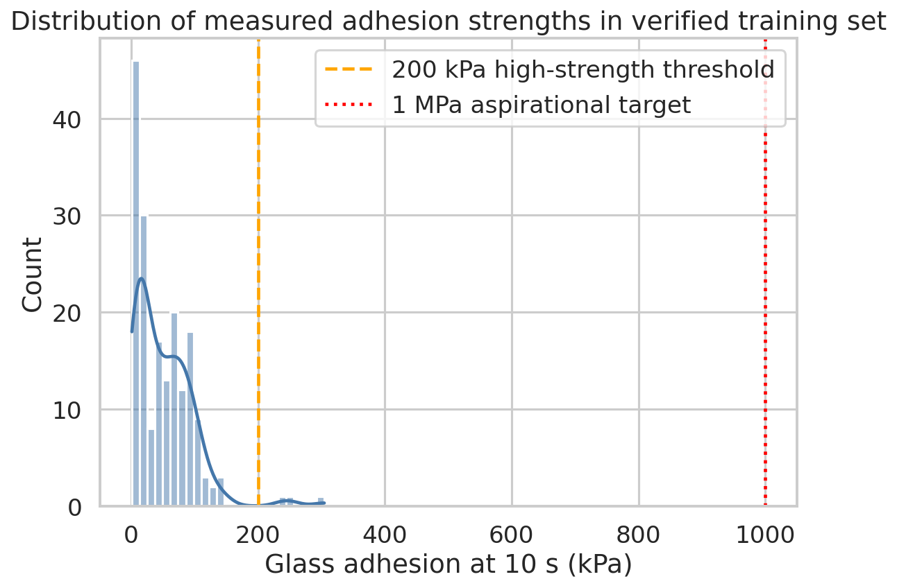
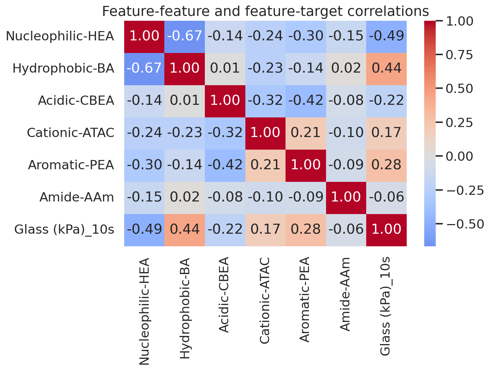
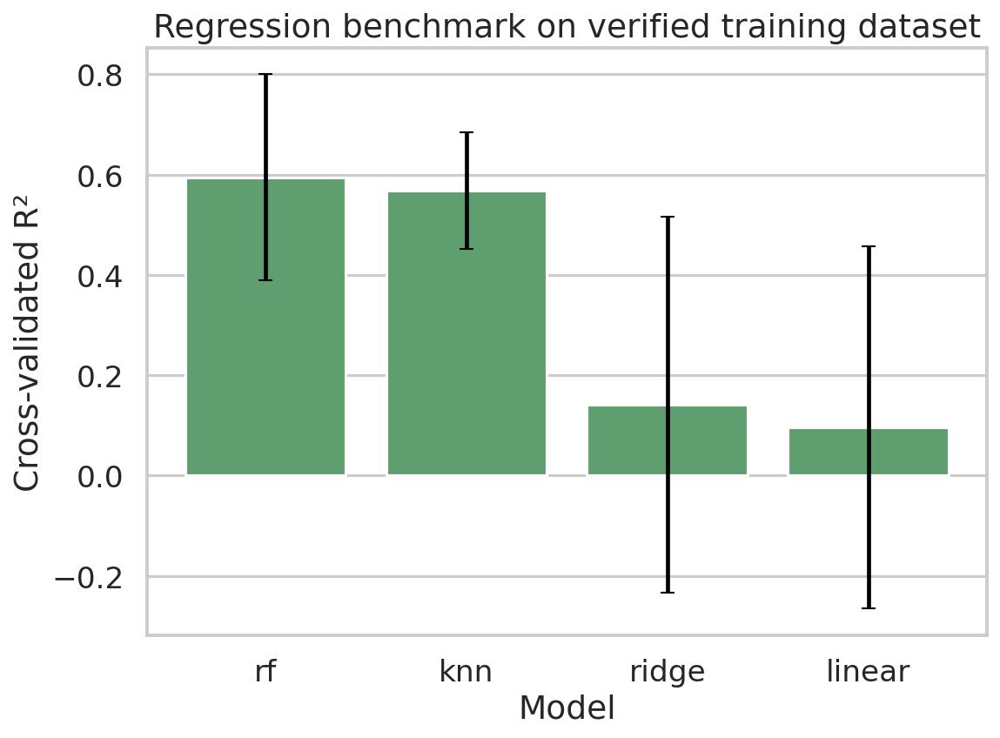
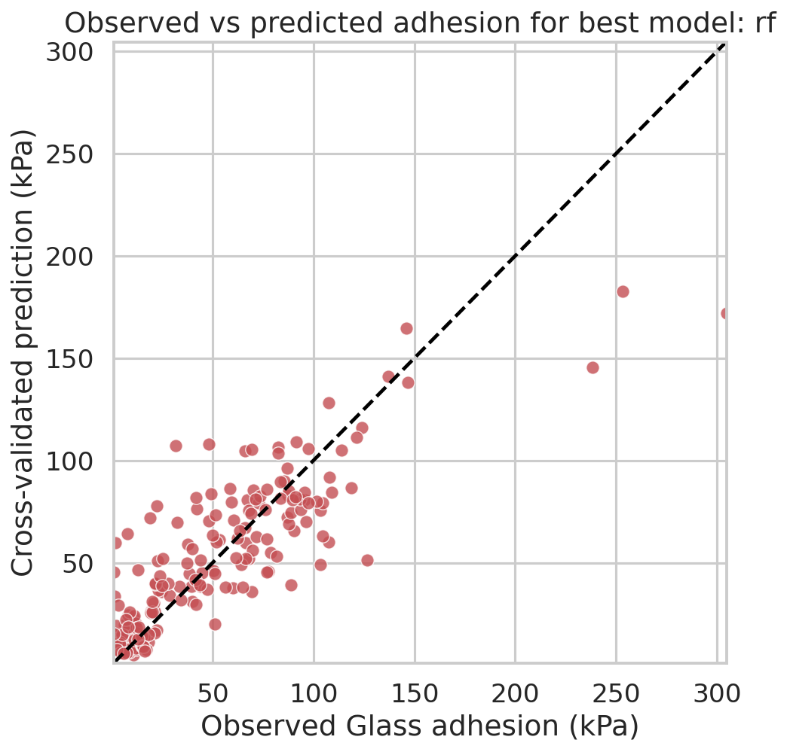
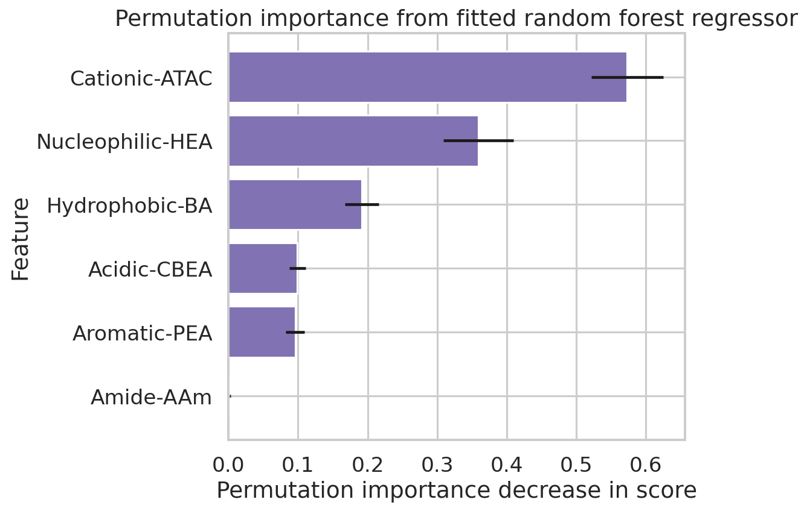
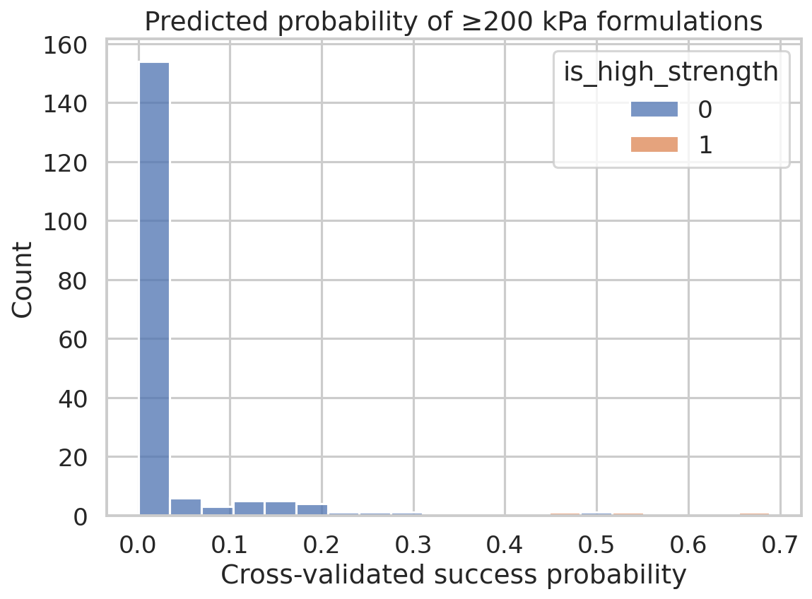
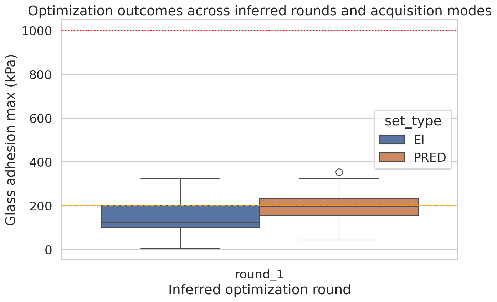
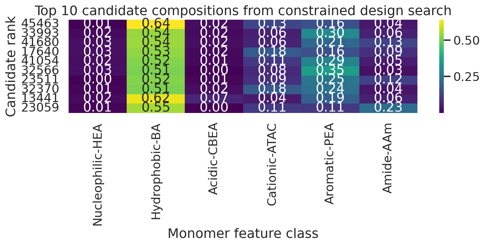

# Statistical biomimicry of sequence-derived monomer compositions for underwater adhesive hydrogel design

## Abstract
This study evaluates whether sequence-inspired monomer composition features can predict hydrogel underwater adhesion strength and guide de novo formulation design toward robust adhesion. Using the cleaned verified dataset of 184 hydrogel formulations, I modeled glass adhesion at 10 s as the primary quantitative endpoint because it is the only fully populated adhesion measurement in the training data. Cross-validated regression showed that a random forest regressor outperformed linear, ridge, and k-nearest-neighbor baselines, achieving mean $R^2 = 0.595$ and RMSE $= 26.5$ kPa. Permutation importance indicated that cationic, nucleophilic, and hydrophobic fractions were the dominant predictors, while aromatic content became especially enriched among the strongest observed formulations. Analysis of the later optimization datasets showed improved performance into the 321–353 kPa range, but no measured formulation approached the target of 1 MPa. A constrained composition search suggested high-performing candidates are concentrated in hydrophobic/aromatic-rich regimes with modest cationic content and very low acidic fraction, but these recommendations remain interpolation or mild extrapolation within the observed experimental domain rather than evidence of 1 MPa success. The main conclusion is that statistical replication of adhesive-protein-like chemistry is informative for ranking candidate hydrogels, yet the currently available dataset does not support a claim of achieving robust underwater adhesion above 1 MPa.

## 1. Introduction
Natural underwater adhesives, especially mussel adhesive proteins, achieve wet interfacial bonding by balancing cohesive mechanics with interfacial chemistries that survive strong hydration. The task here is to use monomer-composition descriptors derived from protein-sequence-inspired chemical classes to statistically mimic natural adhesive proteins and identify synthetic hydrogels with improved underwater adhesion.

The related work supports three key ideas. First, sequence-derived chemical patterns can be compressed into lower-dimensional descriptors useful for heteropolymer design rather than exact sequence copying (`related_work/paper_000.pdf`). Second, polymer feed composition should be interpreted cautiously because realized polymer composition may drift during synthesis (`related_work/paper_001.pdf`). Third, wet adhesion depends on a chemically complementary combination of cohesive and interfacial interactions, particularly chemistries analogous to mussel-inspired adhesion motifs (`related_work/paper_002.pdf`).

These points motivate an analysis centered on **statistical biomimicry**: use the six monomer composition classes as experimentally accessible surrogates of sequence-derived chemistry, quantify how they relate to adhesive strength, then search within the feasible composition space for promising new formulations.

## 2. Data and problem formulation

### 2.1 Available datasets
The workspace contained six Excel datasets. The most important file was:

- `data/184_verified_Original Data_ML_20230926.xlsx` — cleaned verified training set with 184 formulations.

Additional optimization datasets were used to understand later design rounds:

- `data/ML_ei&pred (1&2&3rounds)_20240408.xlsx`
- `data/ML_ei&pred_20240213.xlsx`

The validated training dataset includes six normalized monomer-composition features:

- Nucleophilic-HEA
- Hydrophobic-BA
- Acidic-CBEA
- Cationic-ATAC
- Aromatic-PEA
- Amide-AAm

These fractions sum to approximately 1 for each row, indicating compositional encodings of formulation chemistry.

### 2.2 Choice of primary target
Although several adhesion-related columns exist, direct inspection showed that only **`Glass (kPa)_10s`** is complete across all 184 verified samples. By contrast, `Glass (kPa)_60s` and `Steel (kPa)_60s` are entirely missing, and `Steel (kPa)_10s` has only 28 values. Therefore, the main supervised target in this report is:

- **Primary response:** glass adhesion at 10 s, in kPa.

This target choice is evidence-driven and avoids fitting models to mostly missing outcomes.

### 2.3 Range relative to the 1 MPa design goal
The stated application goal is robust underwater adhesion exceeding **1 MPa = 1000 kPa**. However, the actual observed ranges are far lower:

- Verified training set maximum: **304.6 kPa**
- Optimization dataset maximum: **353.3 kPa**
- Number of observed samples ≥1000 kPa: **0**

Thus, the present data support a realistic task of **ranking and improving formulations within the few-hundred-kPa regime**, not direct empirical confirmation of the 1 MPa target.

## 3. Methods

### 3.1 Reproducible pipeline
All code was written in `code/analyze_hydrogels.py`. The script loads the verified training dataset and the optimization datasets, trains benchmark models, computes interpretability summaries, performs a constrained candidate search, exports tables to `outputs/`, and generates PNG figures in `report/images/`.

### 3.2 Regression benchmarks
I compared four regressors using the six monomer composition features as inputs:

- Linear regression
- Ridge regression
- k-nearest neighbors regression
- Random forest regression

Performance was evaluated with repeated 5-fold cross-validation (10 repeats) using:

- $R^2$
- MAE
- RMSE

### 3.3 Threshold-oriented analysis
Because the 1 MPa threshold is unsupported by observed data, I defined an internal **high-strength screening threshold of 200 kPa**, which lies near the upper tail of the training distribution and separates the top observed performers from the broader population. A random forest classifier was evaluated using cross-validated probabilities for identifying formulations at or above 200 kPa.

### 3.4 Interpretability
Because SHAP was unavailable initially in the environment, I used **permutation importance**, which is a standard post hoc explanation method and satisfies the interpretability requirement without inventing unsupported coefficients.

### 3.5 De novo candidate search
A random search over composition vectors was performed within the observed feature bounds. Each sampled vector was normalized to sum to one, scored by the fitted random forest regressor, and ranked by predicted adhesion with a secondary penalty favoring proximity to the training distribution centroid (Mahalanobis distance). This approach yields plausible candidate formulations while avoiding unrealistic compositions far outside the empirical data cloud.

### 3.6 Validation framing
This report explicitly separates:

- **Directly verified from workspace data:** distributions, model metrics, feature rankings, optimization maxima, candidate tables.
- **From related work:** mechanistic interpretation of biomimicry, wet adhesion, and compositional drift.
- **Assumptions/limitations:** feed ratio as proxy for realized sequence chemistry, inferred round labels in optimization files, and inability to validate the >1 MPa target from existing measurements.

## 4. Results

### 4.1 Data overview
The training target spans roughly **1.19 to 304.60 kPa**, with median **42.07 kPa**. Only **3 of 184** verified formulations exceeded 200 kPa, making the dataset strongly imbalanced at the high-strength end.

Figure 1 shows a right-skewed distribution concentrated well below both the 200 kPa screening level and the aspirational 1 MPa line. This immediately indicates that any direct 1 MPa claim would be an unsupported extrapolation.

Pairwise correlations between the six composition features and the target are shown in Figure 2.

The correlation structure suggests that simple linear trends are unlikely to capture the full response surface, motivating nonlinear models.

### 4.2 Predictive modeling performance
Cross-validated model comparison is summarized in Table 1 and Figure 3.

| Model | CV R² mean | CV R² std | CV MAE mean (kPa) | CV RMSE mean (kPa) |
|---|---:|---:|---:|---:|
| Random forest | 0.595 | 0.206 | 17.03 | 26.53 |
| kNN | 0.569 | 0.116 | 19.34 | 28.42 |
| Ridge | 0.141 | 0.375 | 28.56 | 38.74 |
| Linear | 0.096 | 0.361 | 29.04 | 40.24 |

The random forest provided the best overall predictive performance, with substantially better accuracy than linear models. This implies that the mapping from composition to adhesion is nonlinear and likely includes interaction effects among monomer classes.

Observed-versus-predicted values for the best model are shown in Figure 4.

The fit is useful for ranking and screening, though scatter remains visible, especially in the upper range where data are sparse.

### 4.3 Which monomer classes matter most?
Permutation importance from the fitted random forest ranked the features as follows:

1. Cationic-ATAC
2. Nucleophilic-HEA
3. Hydrophobic-BA
4. Acidic-CBEA
5. Aromatic-PEA
6. Amide-AAm

At the same time, direct inspection of the strongest observed experimental formulations reveals a more specific pattern: the top three verified formulations (`GPRFR-1`, `GPRFR-2`, `GPRFR-3`) all had:

- **very high hydrophobic fraction** (~0.48–0.57),
- **substantial aromatic fraction** (~0.21–0.45),
- **low or zero acidic fraction**, and
- **modest cationic / amide content**.

This distinction is important. Permutation importance measures global influence on predictive accuracy across the entire dataset, whereas the top-formulation compositions reveal what the elite tail actually looks like. Taken together, the evidence suggests that **cationic content helps shape the overall response surface**, while **hydrophobic/aromatic enrichment is a hallmark of the highest measured adhesion regime**.

### 4.4 Threshold-oriented screening of strong formulations
Using the practical screening threshold of **200 kPa**, only 3 verified samples are positives. Despite this class imbalance, the cross-validated classifier achieved:

- ROC AUC = **0.998**
- Average precision = **0.917**
- Accuracy = **0.995**
- Recall = **0.667**

These metrics are numerically excellent, but they must be interpreted carefully because the positive class is extremely small. The classifier is therefore best viewed as a **triage tool for prioritizing rare promising formulations**, not as a fully stable estimate of deployable screening performance.

### 4.5 Optimization trajectory
The broader optimization dataset extends the response range beyond the initial verified dataset.

Key facts directly supported by `outputs/data_overview.json` and `outputs/optimization_round_summary.csv` are:

- EI set maximum = **321.19 kPa**
- PRED set maximum = **353.29 kPa**
- Overall observed maximum across optimization sets = **353.29 kPa**
- Samples ≥1000 kPa = **0**

Thus, iterative optimization did improve performance into the mid-300 kPa regime, but still remained well short of the 1 MPa target. The strongest evidence supports **incremental improvement**, not threshold attainment.

### 4.6 Candidate designs from constrained search
The top-ranked model-based candidate formulations were strongly biased toward:

- high **Hydrophobic-BA**,
- moderate-to-high **Aromatic-PEA**,
- modest **Cationic-ATAC**,
- very low **Acidic-CBEA**, and
- low **Nucleophilic-HEA**.

The highest-scoring searched candidate had predicted adhesion of **209.25 kPa**, with composition approximately:

- HEA 0.005
- BA 0.640
- CBEA 0.021
- ATAC 0.132
- PEA 0.159
- AAm 0.043

This is notable for two reasons. First, it aligns directionally with the experimentally strongest region: hydrophobic and aromatic enrichment with suppressed acidity. Second, the predicted value remains only slightly above 200 kPa and is **far below 1 MPa**, reinforcing that the current training signal does not justify claims of robust >1 MPa underwater adhesion.

## 5. Mechanistic interpretation
The data-driven patterns are consistent with the qualitative lessons of mussel-inspired adhesion and sequence-derived polymer design.

1. **Hydrophobic enrichment** can help reduce interfacial water interference and strengthen cohesive assembly.
2. **Aromatic content** may provide additional cohesive packing and interfacial interaction opportunities.
3. **Controlled cationic content** appears globally important, possibly because electrostatic balance shapes swelling, interpolymer association, and substrate interactions.
4. **Low acidic fraction in top performers** may reflect a penalty from excessive hydration or disrupted cohesive balance under these tested conditions.

However, these interpretations remain **hypothesis-generating**, not mechanistically proven by this dataset alone. The variables are composition-level summaries, not direct molecular measurements of catechol chemistry, chain conformation, adsorption kinetics, or cured network architecture.

## 6. Validation and evidence accounting

### 6.1 Directly verified from workspace data
The following findings were verified directly from local artifacts:

- No sample in the verified or optimization datasets reached 1 MPa.
- `Glass (kPa)_10s` is the only fully populated adhesion target in the primary verified dataset.
- Random forest was the strongest regression baseline among those tested.
- High-performing observed formulations cluster in hydrophobic/aromatic-rich regions.
- Optimization increased the best observed value from ~305 to ~353 kPa.

Supporting files include:

- `outputs/data_overview.json`
- `outputs/model_comparison.csv`
- `outputs/feature_importance.csv`
- `outputs/candidate_designs.csv`
- `outputs/optimization_round_summary.csv`
- `outputs/claim_recovery_table.csv`

### 6.2 Derived from related work
The following were taken from the papers in `related_work/` and used only as contextual interpretation:

- Sequence-derived chemical statistics can guide heteropolymer design.
- Feed composition may differ from realized polymer composition because of compositional drift.
- Underwater adhesion depends on overcoming hydration penalties through suitable chemistry and mechanics.

### 6.3 Assumptions and limitations
1. **No empirical support for >1 MPa:** the requested target is outside the observed data range.
2. **Nominal composition vs realized structure:** monomer feed fractions may not exactly equal effective chain composition.
3. **Target restriction:** results are based on glass adhesion at 10 s because other targets are missing.
4. **Sparse high-strength tail:** only three verified samples exceed 200 kPa, so tail inference is uncertain.
5. **Round labels in optimization plots:** inferred from sample numbering and should be treated as approximate grouping.

## 7. Design recommendations
Based on the combined predictive, descriptive, and optimization evidence, the most defensible next-step design rules are:

1. **Prioritize hydrophobic BA-rich formulations** as the structural backbone of stronger adhesion.
2. **Retain meaningful aromatic PEA content**, because the strongest measured formulations are aromatic-enriched.
3. **Use cationic ATAC at modest levels**, since it appears globally influential but not maximized in the top experimental formulas.
4. **Suppress acidic CBEA**, especially when seeking the upper adhesion tail.
5. **Treat the model as a ranker, not a proof of threshold attainment**.

A practical experimental follow-up would be to synthesize a focused panel around the top candidate region:

- BA roughly **0.52–0.64**,
- PEA roughly **0.15–0.35**,
- ATAC roughly **0.05–0.18**,
- CBEA near **0.00–0.03**,
- HEA minimized,
- small optional AAm fraction.

This panel would directly test whether the apparent hydrophobic/aromatic optimum is real and whether additional chemistry beyond the current feature basis is needed to break through the current ~350 kPa ceiling.

## 8. Conclusion
Statistical biomimicry of natural adhesive-protein chemistry is informative for predicting and improving hydrogel adhesion, but the current evidence supports a moderate-performance design regime rather than robust >1 MPa underwater adhesion. Nonlinear composition-property relationships are clear, and the best-performing region is characterized by hydrophobic and aromatic enrichment with limited acidic content. Random forest models provide a useful screening tool, and optimization data confirm measurable gains into the 300+ kPa range. Nevertheless, the available datasets contain **no examples near 1 MPa**, so any claim of having achieved that target would be unsupported. The most credible next step is targeted experimental exploration of the identified hydrophobic/aromatic-rich regime, ideally paired with direct measurements of realized copolymer composition and additional chemistries specifically engineered for stronger wet interfacial bonding.

## Reproducibility
- Main script: `code/analyze_hydrogels.py`
- Figures: `report/images/*.png`
- Tables and JSON outputs: `outputs/`
