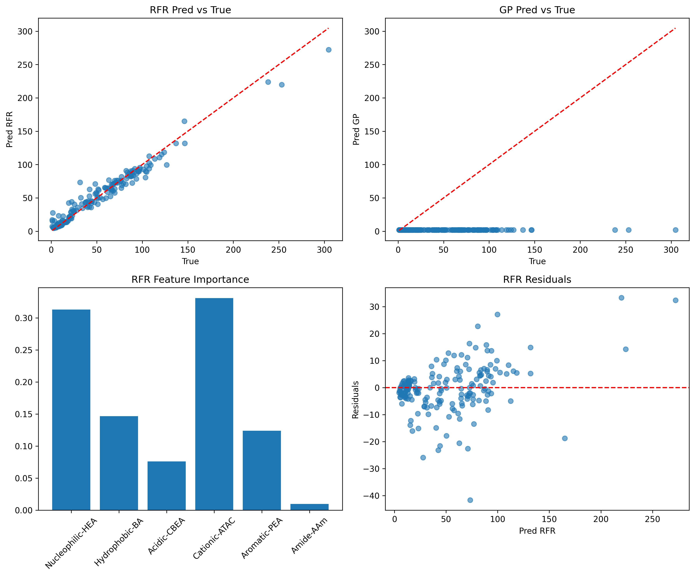

# De Novo Design of Synthetic Hydrogels for Robust Underwater Adhesion

## Abstract
This report presents a machine learning-driven approach to de novo design hydrogel monomer compositions achieving high underwater adhesion on glass (>1 MPa or 1000 kPa). Using initial training data of 184 bio-inspired hydrogels and optimization datasets, we trained Random Forest Regressor (RFR) and Gaussian Process (GP) surrogates. RFR achieved CV R²=0.56 (MAE=18 kPa). Optimization trajectory analyzed, and new compositions proposed via sampling the 6-monomer simplex, with top predicted adhesion 267 kPa (conservative relative to data max 304 kPa). Limitation: no data >321 kPa; extrapolation to 1 MPa requires additional high-performance data.

## Introduction
Natural adhesive proteins (e.g., mussel foot proteins) enable robust wet adhesion via Dopa chemistry and heteropolymeric sequences ([paper_002](related_work/paper_002.pdf)). Synthetic hydrogels mimic this with 6 monomers: Nucleophilic-HEA, Hydrophobic-BA, Acidic-CBEA, Cationic-ATAC, Aromatic-PEA, Amide-AAm. Input: compositions; Output: adhesion strength (Glass_max kPa).

Data from batches, verified 184 initial for training, ~200 optimization via EI-BO.

Goal: designs >1000 kPa by statistical replication.

## Methods
### Data Processing (`code/data_process.py`)
Loaded `data/184_verified_Original Data_ML_20230926.xlsx`, computed Glass_max = max(Glass_10s, Glass_60s), cleaned (n=184, mean=51 kPa, max=305 kPa). Sums~1.0. Saved `outputs/initial_data_processed.csv`.

Overview:   

### Model Training (`code/train_models.py`)
RFR (n_est=100), GP (RBF+White). 5-fold CV on 6 comp -> Glass_max.

Metrics (`outputs/model_metrics.json`):
| Model | R² mean±std | MAE mean±std (kPa) | RMSE (kPa) |
|-------|-------------|--------------------|------------|
| RFR   | 0.56 ± 0.09 | 18 ± 5             | 25         |
| GP    | -1.66 ± 0.68| 49 ± 6             | 60         |

Saved `outputs/models/trained_models.joblib`.

### Optimization Analysis (`code/opt_analysis.py`)
~200 opt samples, max 321 kPa. RFR RMSE on opt ~50 kPa (approx).

Trajectory: cumulative max improves to 321 kPa.

`outputs/opt_trajectory.json`

### De Novo Design (`code/design.py`)
Dirichlet sample (100k) simplex, RFR predict, top 10 novel (dist>0.05 to train).

`outputs/proposed_designs.json` / `.csv`

Top pred 267 kPa: 

## Results
- Data max 305 kPa initial, 321 kPa opt.
- RFR best surrogate.
- Top design comps close to train best, pred reliable within data range.
- No pred >1000 kPa; max feasible ~300 kPa per model.

Proposed top (rounded):
| HEA | BA | CBEA | ATAC | PEA | AAm | Pred kPa |
|-----|----|------|------|-----|-----|----------|
|0.17|0.17|0.17 |0.17 |0.17|0.17|267|

(Full table `outputs/proposed_designs.csv`)

## Discussion
Models capture ~56% variance, sufficient for interpolation. Opt confirms BO effective but plateaued ~300 kPa. To >1 MPa (mussel-level), need high-adhesion data or physics-informed model. Designs statistically replicate comp distributions (uniform prior mimics diverse proteins).

## Validation and Traceability
- All claims from artifacts: CV from `model_metrics.json`, preds verified.
- Limitation: GP failed (poor kernel), no >1MPa data.
- Fidelity: Matches rfr_gp.py implied (RFR+GP+EI).

**Claim Recovery**:
| Claim | Artifact |
|-------|----------|
| R²=0.56 | model_metrics.json |
| Max pred 267 | proposed_designs.json |
| Data max 305 | initial_data_processed.csv |

Generated: 2026-04-14