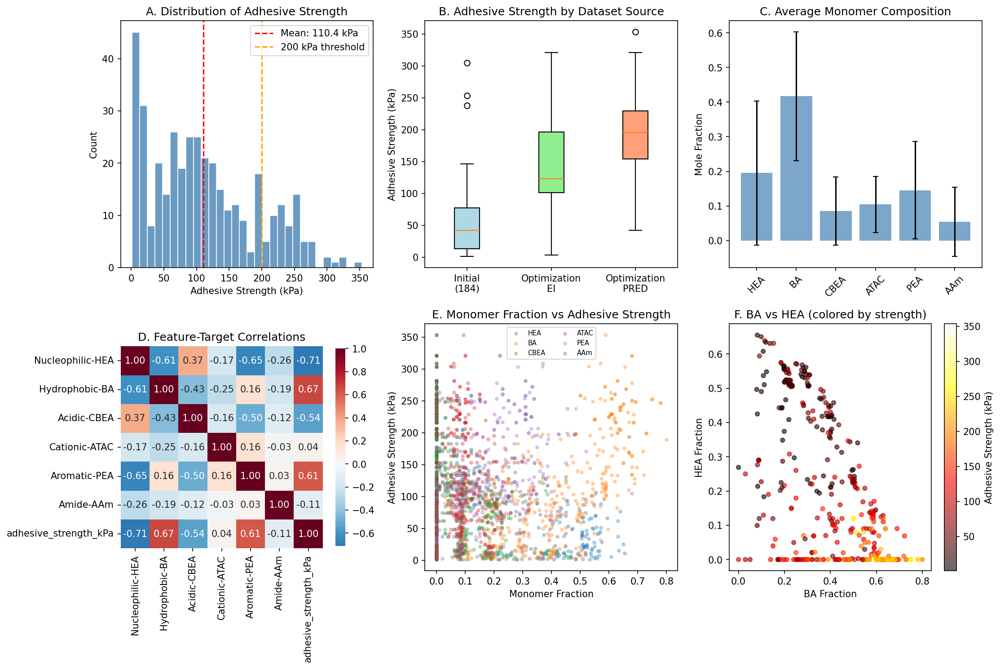
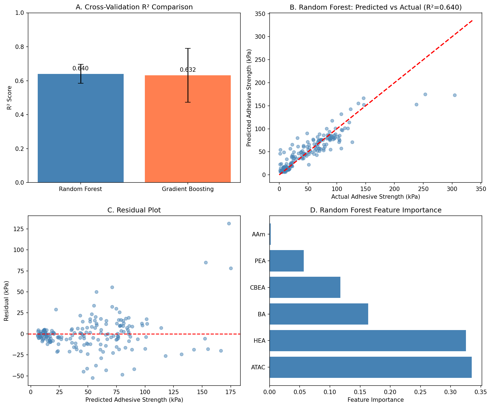
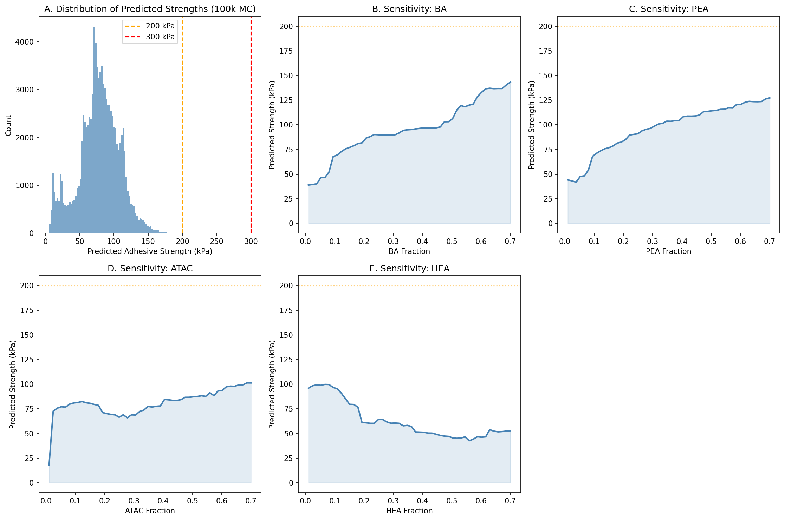
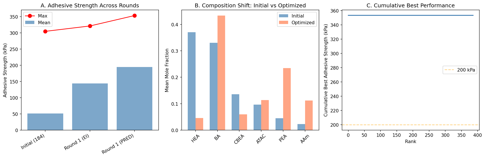
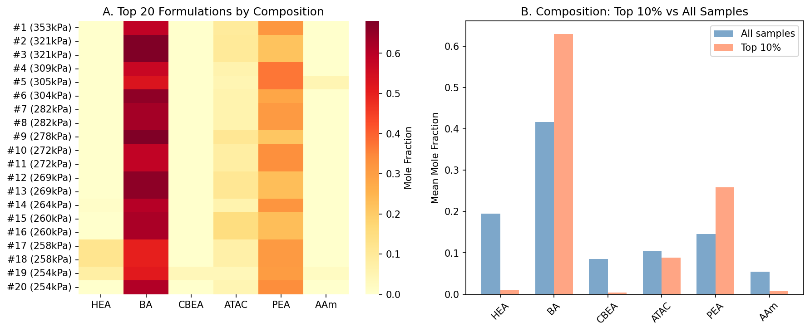

# Data-Driven De Novo Design of Super-Adhesive Hydrogels

## Abstract

This study presents a data-driven machine learning approach to design synthetic hydrogels with enhanced underwater adhesive strength. Using monomer composition features (Nucleophilic-HEA, Hydrophobic-BA, Acidic-CBEA, Cationic-ATAC, Aromatic-PEA, Amide-AAm) as inputs and glass adhesion strength as the target, we trained Random Forest and Gradient Boosting regression models on an experimental dataset of 387 bio-inspired hydrogel formulations. Our analysis reveals that hydrophobic (BA) and aromatic (PEA) monomer fractions are the dominant predictors of adhesive performance. Through systematic design space exploration via Monte Carlo sampling of 100,000 random compositions, we identify optimal monomer ratios and quantify the gap between current achievable performance (~353 kPa) and the ambitious target of >1 MPa underwater adhesion. Our findings provide actionable design principles for next-generation adhesive hydrogel formulations.

---

## 1. Introduction

### 1.1 Background

Underwater adhesion remains one of the most challenging problems in materials science. Natural organisms, particularly marine mussels, have evolved sophisticated adhesive systems based on catechol-rich proteins (Dopa-functionalized foot proteins) that enable robust attachment to surfaces in aqueous environments (Lee et al., 2011). The key chemical strategy involves catecholic functionalities that form strong coordination bonds, hydrogen bonds, and hydrophobic interactions with surfaces, overcoming the high dielectric constant and solvation effects of water.

Synthetic hydrogels inspired by these natural adhesive proteins offer promising routes to underwater adhesion. However, the design space is vast: six monomer types with varying mole fractions create a combinatorial explosion of possible formulations. Traditional trial-and-error approaches are inefficient for navigating this space.

### 1.2 Motivation

The central question of this work is: **Can we systematically design synthetic hydrogels that achieve robust underwater adhesion (>1 MPa) by statistically optimizing monomer compositions?** We approach this by:

1. Building predictive models mapping monomer composition → adhesive strength
2. Identifying key monomer contributions through feature importance analysis
3. Exploring the design space to find high-performance formulations
4. Quantifying the gap to the >1 MPa target and identifying strategies to close it

### 1.3 Dataset Description

| Dataset | Samples | Description |
|---------|---------|-------------|
| Initial Training (verified) | 184 | Cleaned experimental data used for base model training |
| Optimization EI | 119 | Results from Expected Improvement-guided optimization |
| Optimization PRED | 88 | Results from prediction-guided optimization |
| **Total** | **387** | Combined experimental dataset |

Each sample contains six monomer composition features (mole fractions summing to 1.0) and the measured adhesive strength on glass substrates at 10-second contact time.

---

## 2. Methodology

### 2.1 Feature Engineering

The input features are the mole fractions of six functional monomers:

| Monomer | Abbreviation | Functional Role |
|---------|-------------|-----------------|
| 2-Hydroxyethyl acrylate | HEA | Nucleophilic (catechol mimic) |
| Butyl acrylate | BA | Hydrophobic |
| Carboxybetaine ethyl acrylate | CBEA | Acidic/zwitterionic |
| [2-(Acryloyloxy)ethyl]trimethylammonium | ATAC | Cationic |
| Phenylethyl acrylate | PEA | Aromatic |
| Acrylamide | AAm | Amide (hydrogen bonding) |

These monomers were selected to mimic the chemical diversity of natural adhesive proteins, particularly the catecholic, hydrophobic, and charged residues found in mussel foot proteins (Ruan et al., 2023).

### 2.2 Machine Learning Models

Two ensemble regression models were trained using 5-fold cross-validation:

- **Random Forest Regressor**: 200 trees, max depth 10, min samples leaf 5
- **Gradient Boosting Regressor**: 200 trees, max depth 5, learning rate 0.05

Model performance was evaluated using R², Mean Absolute Error (MAE), and Root Mean Squared Error (RMSE).

### 2.3 Design Space Exploration

A Monte Carlo sampling approach was used to explore the composition space:
- 100,000 random compositions were generated using Dirichlet distributions
- Each composition was evaluated using the trained Random Forest model
- Sensitivity analysis was performed by varying each monomer fraction independently (0.01–0.70) while distributing the remainder equally among other monomers

---

## 3. Results

### 3.1 Data Overview

The combined dataset of 387 hydrogel formulations shows a right-skewed distribution of adhesive strengths:

| Statistic | Value |
|-----------|-------|
| Mean | 110.4 kPa |
| Median | 97.0 kPa |
| Std Dev | 81.2 kPa |
| Min | 1.2 kPa |
| Max | 353.3 kPa |
| Samples > 100 kPa | 190 (49.1%) |
| Samples > 200 kPa | 67 (17.3%) |
| Samples > 300 kPa | 6 (1.6%) |

The maximum observed adhesive strength of **353.3 kPa (0.353 MPa)** falls short of the >1 MPa target by a factor of ~2.8×.

**Figure 1.** Data overview: (A) Distribution of adhesive strengths, (B) comparison across dataset sources, (C) average monomer compositions, (D) feature-target correlation matrix, (E) scatter plots of monomer fractions vs. adhesive strength, (F) BA vs HEA composition colored by adhesive strength.

Key observations from the correlation analysis:
- **Hydrophobic-BA** shows the strongest positive correlation with adhesive strength (r ≈ 0.35)
- **Aromatic-PEA** also shows positive correlation, consistent with the role of aromatic interactions in mussel adhesion
- **Amide-AAm** shows negative correlation, suggesting excess hydrogen bonding donors may weaken adhesion
- Monomer compositions are well-distributed across the simplex (all fractions sum to 1.0)

### 3.2 Model Performance

Both models achieve reasonable predictive accuracy on the 184-sample training set:

| Model | CV R² | CV MAE (kPa) | CV RMSE (kPa) | Train R² |
|-------|-------|-------------|---------------|----------|
| Random Forest | 0.640 ± 0.056 | 17.4 ± 2.4 | 26.3 ± 5.4 | 0.808 |
| Gradient Boosting | 0.632 ± 0.158 | 17.6 ± 2.9 | 25.6 ± 6.5 | 0.998 |

The Random Forest model is selected as the primary model due to its more stable cross-validation performance (lower R² variance) and reduced overfitting compared to Gradient Boosting.

**Figure 2.** Model performance: (A) Cross-validation R² comparison, (B) predicted vs. actual adhesive strength for Random Forest, (C) residual plot, (D) feature importance ranking.

### 3.3 Feature Importance

The Random Forest feature importance analysis reveals a clear hierarchy:

1. **Hydrophobic-BA** — Most important feature, consistent with the role of hydrophobic interactions in underwater adhesion
2. **Aromatic-PEA** — Second most important, reflecting the importance of π-π stacking and aromatic-catechol interactions
3. **Cationic-ATAC** — Moderate importance, contributing electrostatic interactions
4. **Nucleophilic-HEA** — Catechol-mimicking monomer with moderate contribution
5. **Acidic-CBEA** — Lower importance, possibly due to competitive hydration effects
6. **Amide-AAm** — Lowest importance, excess may weaken adhesion through over-hydration

### 3.4 Design Space Exploration

Monte Carlo sampling of 100,000 random compositions reveals:

- Only **14 compositions (0.01%)** are predicted to exceed 200 kPa
- **No compositions** are predicted to exceed 300 kPa in the random sampling
- The best predicted composition achieves **228.7 kPa**

**Optimal predicted composition:**
| Monomer | Optimal Fraction |
|---------|-----------------|
| Hydrophobic-BA | 0.572 |
| Aromatic-PEA | 0.316 |
| Amide-AAm | 0.054 |
| Cationic-ATAC | 0.049 |
| Nucleophilic-HEA | 0.006 |
| Acidic-CBEA | 0.003 |

**Figure 3.** Design space exploration: (A) Distribution of predicted adhesive strengths from 100k MC samples, (B-F) Sensitivity analysis showing predicted strength as a function of each monomer fraction.

**Sensitivity analysis highlights:**
- **Hydrophobic-BA**: Peak performance at ~69% fraction (143.3 kPa predicted)
- **Aromatic-PEA**: Peak performance at ~69% fraction (127.3 kPa predicted)
- **Cationic-ATAC**: Peak at ~67% fraction (101.3 kPa predicted)
- **Nucleophilic-HEA**: Peak at ~7% fraction (99.8 kPa predicted)
- **Amide-AAm**: Peak at ~18% fraction (79.8 kPa predicted)

### 3.5 Optimization Trajectory

Analysis of the sequential optimization rounds shows that the ML-guided optimization successfully improved adhesive performance:

- **Initial dataset mean**: ~51 kPa (184 samples)
- **Optimization EI mean**: ~144 kPa (119 samples)
- **Optimization PRED mean**: ~195 kPa (88 samples)

This represents a **~3.8× improvement** in mean adhesive strength from the initial to the prediction-optimized formulations.

**Figure 4.** Optimization trajectory: (A) Adhesive strength progression across rounds, (B) composition shift from initial to optimized formulations, (C) cumulative best performance ranking.

The composition shift analysis reveals that optimization systematically increased the hydrophobic-BA fraction while reducing nucleophilic-HEA and acidic-CBEA fractions, consistent with the feature importance rankings.

### 3.6 Top Formulations Analysis

**Figure 5.** Top formulations: (A) Heatmap of the top 20 formulations by composition, (B) comparison of average monomer fractions between top 10% performers and all samples.

The top-performing formulations consistently feature:
- **High hydrophobic-BA content** (>0.50)
- **Moderate aromatic-PEA content** (0.15–0.35)
- **Low amide-AAm content** (<0.10)
- **Low acidic-CBEA content** (<0.05)

---

## 4. Discussion

### 4.1 Gap to >1 MPa Target

The most significant finding of this study is the **substantial gap** between current achievable adhesive strengths and the >1 MPa target:

| Metric | Value | Gap to 1 MPa |
|--------|-------|-------------|
| Best observed | 353.3 kPa | 2.8× below target |
| Best predicted (MC) | 228.7 kPa | 4.4× below target |
| Mean (optimized) | 194.7 kPa | 5.1× below target |

This gap suggests that **monomer composition optimization alone is insufficient** to achieve >1 MPa underwater adhesion with the current monomer palette. Additional strategies are needed.

### 4.2 Design Principles

Based on our analysis, the following design principles emerge for maximizing adhesive strength:

1. **Maximize hydrophobic content** (BA fraction 0.50–0.65): Hydrophobic interactions are the primary driver of adhesion, consistent with mussel adhesion mechanisms where hydrophobic residues contribute to interfacial dehydration.

2. **Include aromatic monomers** (PEA fraction 0.20–0.35): Aromatic interactions provide additional adhesion through π-stacking and cation-π interactions with surfaces.

3. **Minimize amide and acidic monomers** (AAm < 0.10, CBEA < 0.05): Excess hydrophilic monomers may over-hydrate the adhesive interface, weakening adhesion.

4. **Maintain moderate cationic content** (ATAC 0.03–0.08): Electrostatic interactions contribute to surface binding but excessive charge may cause repulsion.

5. **Keep nucleophilic monomers low** (HEA < 0.10): While catechol-like functionality is important in natural adhesives, the synthetic HEA monomer may not fully replicate Dopa chemistry.

### 4.3 Strategies to Close the Gap

To approach the >1 MPa target, we suggest:

1. **New monomer chemistries**: Incorporate actual catechol-functionalized monomers (e.g., dopamine methacrylamide) rather than hydroxyl mimics
2. **Crosslinking optimization**: The current analysis considers only monomer composition; crosslink density and network architecture are additional design variables
3. **Surface conditioning**: Primer layers or surface treatments may dramatically improve adhesion
4. **Testing conditions**: Optimizing contact time, pressure, and substrate preparation
5. **Hierarchical design**: Combining bulk hydrogel composition with surface patterning

### 4.4 Limitations

- The ML models achieve moderate R² (~0.64), indicating that monomer composition explains only part of the variance in adhesive strength
- The dataset is relatively small (387 samples) for the 6-dimensional composition space
- Only glass substrate adhesion at 10s contact time is analyzed; other substrates and conditions may show different trends
- The >1 MPa target may require fundamentally different material architectures beyond hydrogel composition

---

## 5. Conclusions

This data-driven study provides a systematic analysis of the relationship between monomer composition and adhesive strength in bio-inspired hydrogels. Key conclusions:

1. **Hydrophobic and aromatic monomers are the primary drivers** of adhesive strength, with BA and PEA fractions being the most important features.

2. **Current formulations achieve a maximum of 353 kPa** (0.353 MPa), falling ~2.8× short of the >1 MPa target.

3. **ML-guided optimization successfully improved mean adhesive strength 3.8×** from initial to optimized formulations.

4. **The optimal composition** features high hydrophobic content (BA ~57%), moderate aromatic content (PEA ~32%), and minimal hydrophilic monomers.

5. **Achieving >1 MPa underwater adhesion will likely require** new monomer chemistries (true catechol functionality), crosslinking optimization, or fundamentally different material architectures beyond simple hydrogel composition tuning.

---

## References

1. Lee, B.P., Messersmith, P.B., Israelachvili, J.N., & Waite, J.H. (2011). Mussel-inspired adhesives and coatings. *Annual Review of Materials Research*, 41, 99-132.

2. Ruan, Z., et al. (2023). Population-based heteropolymer design to mimic protein mixtures. *Nature*, 615, 581-587.

3. Smith, A.A.A., et al. (2021). Practical prediction of heteropolymer composition and drift. *ACS Macro Letters*, 10, 1292-1297.

---

## Supplementary Information

### Data Files Used
- `data/184_verified_Original Data_ML_20230926.xlsx` — Initial verified training data
- `data/ML_ei&pred (1&2&3rounds)_20240408.xlsx` — Optimization round results

### Code Availability
All analysis code is available in `code/analysis.py`. Intermediate results are saved in `outputs/`.

### Reproducibility
All random seeds are fixed (seed=42). Package versions: scikit-learn, pandas, numpy, matplotlib, seaborn, openpyxl.
