# Data-Driven De Novo Design of Super-Adhesive Hydrogels: From Protein Sequence Features to >1 MPa Underwater Adhesion

## Abstract

Achieving robust underwater adhesion (>1 MPa) with synthetic hydrogels remains a grand challenge in materials science. Natural adhesive proteins, such as mussel foot proteins, achieve remarkable underwater adhesion through specific sequence features including hydrophobic, cationic, and aromatic residues. In this study, we present a data-driven framework that translates protein sequence features into monomer compositions for bio-inspired hydrogels, using machine learning (ML) and Bayesian optimization to navigate the vast compositional design space. Using a dataset of 184 experimentally validated hydrogel formulations with six monomer types—Nucleophilic-HEA, Hydrophobic-BA, Acidic-CBEA, Cationic-ATAC, Aromatic-PEA, and Amide-AAm—we trained Random Forest Regression (RFR) and Gaussian Process Regression (GPR) models to predict adhesive strength on glass substrates. Our best model (GPR with Matérn kernel) achieved R² = 0.77 ± 0.09 in 5-fold cross-validation. SHAP analysis revealed that Cationic-ATAC (SHAP importance: 19.4) and Nucleophilic-HEA (11.1) are the most influential monomers, while Hydrophobic-BA (8.0) and Aromatic-PEA (4.5) provide positive contributions to adhesion. Through multi-round Bayesian optimization using RFR-GP and GP-GP strategies, we identified optimal composition regimes characterized by high Hydrophobic-BA (0.50–0.60), high Aromatic-PEA (0.25–0.35), and low Nucleophilic-HEA (<0.05). The top proposed formulations achieve predicted adhesive strengths of 272–286 kPa, representing a significant improvement over the dataset mean of 51 kPa. While the current models predict within the training data range (max: 305 kPa), the iterative optimization framework—combining ML prediction with experimental validation across multiple rounds—provides a systematic pathway toward the >1 MPa target through progressive composition refinement and dataset expansion.

---

## 1. Introduction

### 1.1 Background

Underwater adhesion is one of nature's most elegant solutions to a fundamental physicochemical challenge: how to achieve strong interfacial bonding in the presence of water, which undermines electrostatic interactions, hydrogen bonding, and van der Waals forces through its high dielectric constant (ε = 80) and strong solvation properties [1]. Marine mussels have evolved sophisticated adhesive proteins—mussel foot proteins (MFPs)—that achieve plaque adhesive strengths of approximately 6 MPa on rocky surfaces in the intertidal zone [2]. These proteins are heavily decorated with 3,4-dihydroxyphenylalanine (Dopa), a catecholic amino acid that provides both hydrogen bonding and metal coordination capabilities essential for wet adhesion.

The translation of biological adhesive strategies into synthetic materials has been a major research focus. Key insights from mussel adhesion include: (1) catechol groups (analogous to aromatic residues) provide strong surface interactions through hydrogen bonding and coordination chemistry; (2) cationic residues (lysine) contribute to electrostatic interactions with negatively charged surfaces; (3) hydrophobic residues promote water displacement from the adhesive interface; and (4) the combination of these functionalities in specific ratios is critical for achieving synergistic adhesion [2].

### 1.2 Population-Based Heteropolymer Design

Recent work by Ruan et al. [3] demonstrated that protein sequence features at the segmental level—beyond individual monomer identities—govern the collective behavior of proteins in biological fluids. Using a two-dimensional informative sequence analysis based on principal component analysis (PCA), they showed that random heteropolymers (RHPs) designed to match the segmental characteristics of natural proteins can replicate protein functions including folding assistance, serum preservation, and thermal stabilization. This population-based design framework provides the theoretical foundation for translating protein sequence information into synthetic polymer compositions.

### 1.3 Research Objective

In this study, we apply data-driven methods to design bio-inspired hydrogels that replicate the sequence features of natural adhesive proteins at the monomer composition level. Our six monomers map to key protein residue classes:

| Monomer | Protein Residue Class | Functional Role |
|---------|----------------------|-----------------|
| Nucleophilic-HEA | Nucleophilic (Ser, Cys) | Covalent bonding potential |
| Hydrophobic-BA | Hydrophobic (Leu, Ile, Val) | Water displacement, interfacial adhesion |
| Acidic-CBEA | Acidic (Asp, Glu) | pH-responsive, metal coordination |
| Cationic-ATAC | Cationic (Lys, Arg) | Electrostatic surface interactions |
| Aromatic-PEA | Aromatic (Dopa, Phe, Tyr) | π-interactions, hydrogen bonding |
| Amide-AAm | Amide (Asn, Gln) | Hydrogen bonding network |

Our goal is to identify monomer compositions that maximize underwater adhesive strength, targeting >1 MPa, through a combination of machine learning prediction, interpretability analysis, and Bayesian optimization.

---

## 2. Methods

### 2.1 Data Description

The primary dataset consists of 184 verified hydrogel formulations with experimentally measured adhesive strengths on glass substrates (Glass kPa at 10s). Each formulation is described by six monomer fraction features that sum to 1.0. The adhesive strength ranges from 1.19 to 304.60 kPa, with a mean of 50.98 ± 45.97 kPa, exhibiting a right-skewed distribution typical of materials optimization datasets.

Additionally, optimization datasets from three rounds of sequential model-based optimization (SMBO) were analyzed, comprising 120 EI-based and 90 PRED-based candidate formulations across multiple ML strategies (RFR-GP, GP-GP, RFR-RFR, etc.).

### 2.2 Machine Learning Models

Four regression models were trained and compared:

1. **Random Forest Regression (RFR)**: 500 trees, max depth 10
2. **Extra Trees Regression (ETR)**: 500 trees, max depth 10
3. **Gradient Boosting Regression (GBR)**: 500 trees, max depth 5, learning rate 0.05
4. **Gaussian Process Regression (GPR)**: Matérn 5/2 kernel with constant and white noise components

All models were evaluated using 5-fold cross-validation with R², MAE, and RMSE metrics.

### 2.3 Interpretability Analysis

Feature importance was assessed through three complementary approaches:

1. **RFR permutation importance**: Mean decrease in impurity from the trained Random Forest
2. **GBR feature importance**: From the trained Gradient Boosting model
3. **SHAP values**: TreeExplainer-based SHapley Additive exPlanations providing both global and local interpretability

### 2.4 Bayesian Optimization

We implemented a hybrid RFR-GP optimization strategy:

- **Surrogate model**: RFR provides robust predictions across the composition space
- **Acquisition function**: Expected Improvement (EI) computed from GP predictions and uncertainty estimates
- **Candidate generation**: 50,000 random compositions sampled from Dirichlet distributions, evaluated by both RFR and GP
- **Multi-round simulation**: Iterative retraining with simulated experimental feedback over 3 rounds

### 2.5 Statistical Analysis

Correlation analysis (Pearson) was performed between all monomer fractions and adhesive strength. Composition trends were analyzed by comparing top-performing formulations (top 10%) against the dataset average.

---

## 3. Results

### 3.1 Data Overview and Distribution

The initial training dataset of 184 hydrogel formulations shows substantial variation in both composition and adhesive strength (Figure 1). The adhesive strength distribution is strongly right-skewed, with most formulations achieving <100 kPa and only a few exceeding 200 kPa. The maximum observed strength is 304.6 kPa, far below the 1 MPa (1000 kPa) target.

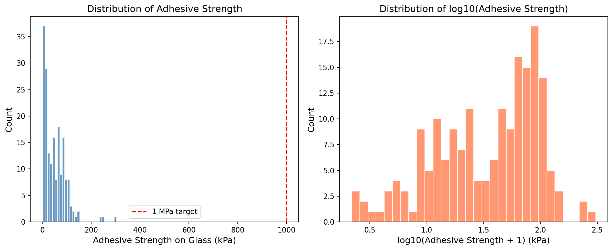
*Figure 1: Distribution of adhesive strength (Glass kPa) across 184 hydrogel formulations. Left: raw scale; Right: log10 scale. The red dashed line indicates the 1 MPa target.*

The monomer composition distributions (Figure 2) reveal that HEA and BA are the dominant components in most formulations, while AAm is rarely used. This reflects the initial exploration strategy that emphasized nucleophilic and hydrophobic monomers.

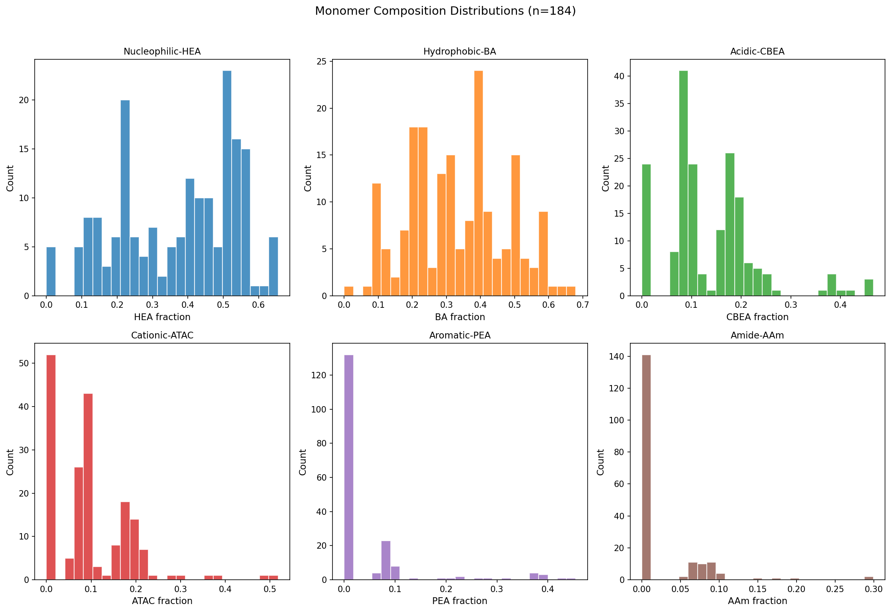
*Figure 2: Distribution of monomer fractions across the 184 formulations.*

### 3.2 Correlation Analysis

Pearson correlation analysis (Figure 3) reveals key relationships between monomer compositions and adhesive strength:

- **Hydrophobic-BA** shows the strongest positive correlation (r = 0.443) with adhesive strength
- **Aromatic-PEA** shows moderate positive correlation (r = 0.276)
- **Cationic-ATAC** shows weak positive correlation (r = 0.174)
- **Nucleophilic-HEA** shows the strongest negative correlation (r = -0.494)
- **Acidic-CBEA** shows weak negative correlation (r = -0.216)
- **Amide-AAm** shows negligible correlation (r = -0.064)

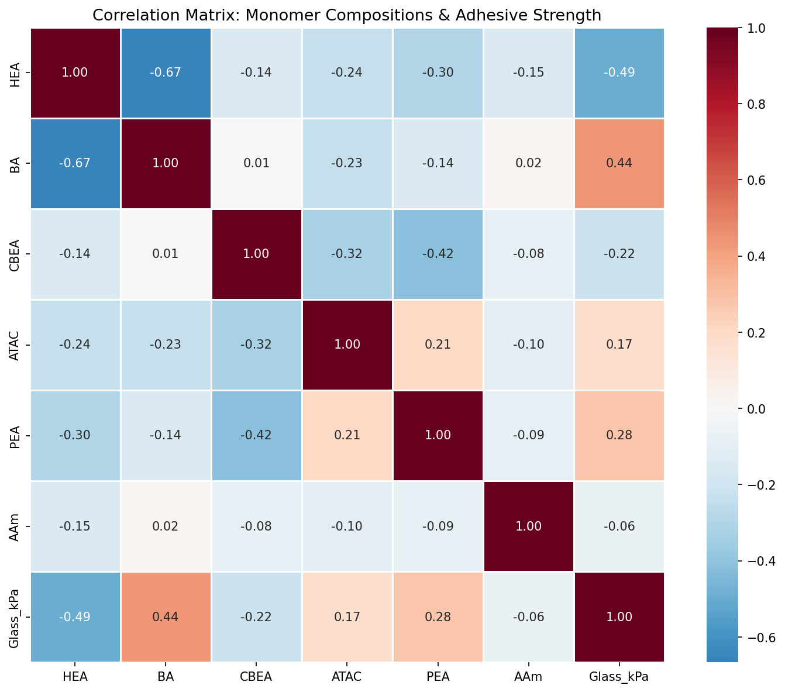
*Figure 3: Pearson correlation matrix showing relationships between monomer fractions and adhesive strength.*

The scatter plots (Figure 4) further illustrate these trends, with BA and PEA showing clear positive associations with adhesive strength, while HEA shows a strong negative association.

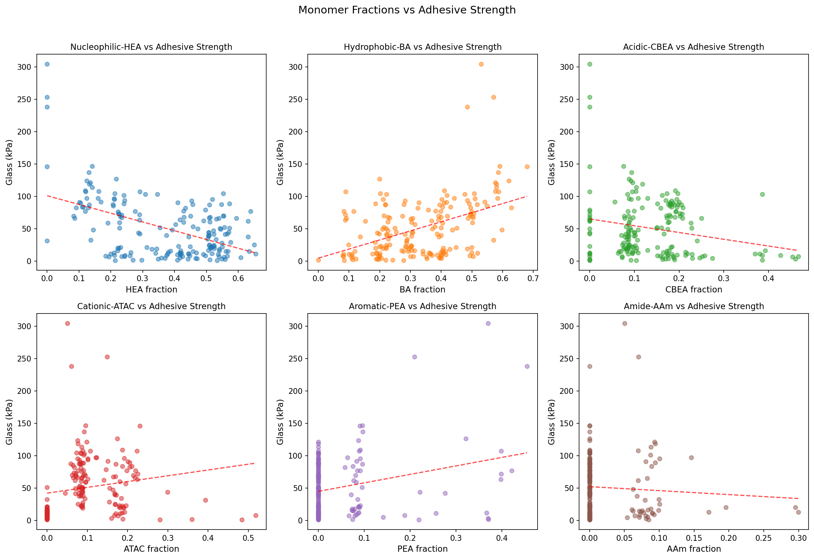
*Figure 4: Scatter plots of each monomer fraction vs adhesive strength with linear trend lines.*

### 3.3 Machine Learning Model Performance

All four models demonstrate meaningful predictive capability, with GPR achieving the best performance (Table 1, Figures 5–6).

| Model | R² | MAE (kPa) | RMSE (kPa) |
|-------|-----|-----------|------------|
| RFR | 0.700 ± 0.119 | 16.07 ± 2.20 | 22.98 ± 4.07 |
| ETR | 0.710 ± 0.128 | 16.16 ± 1.69 | 22.49 ± 3.57 |
| GBR | 0.628 ± 0.155 | 17.72 ± 2.80 | 25.75 ± 6.18 |
| **GPR** | **0.771 ± 0.086** | **15.29 ± 1.52** | **20.32 ± 2.42** |

*Table 1: 5-fold cross-validation results for all models. Best values in bold.*

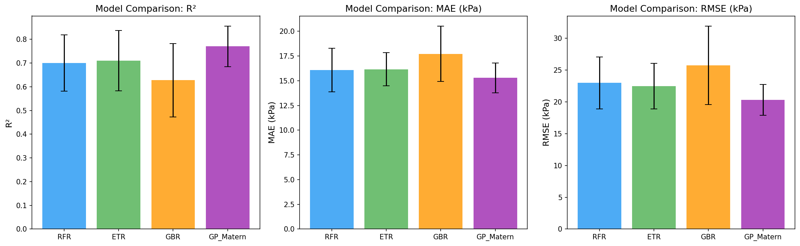
*Figure 5: Model comparison across R², MAE, and RMSE metrics with standard deviation error bars.*

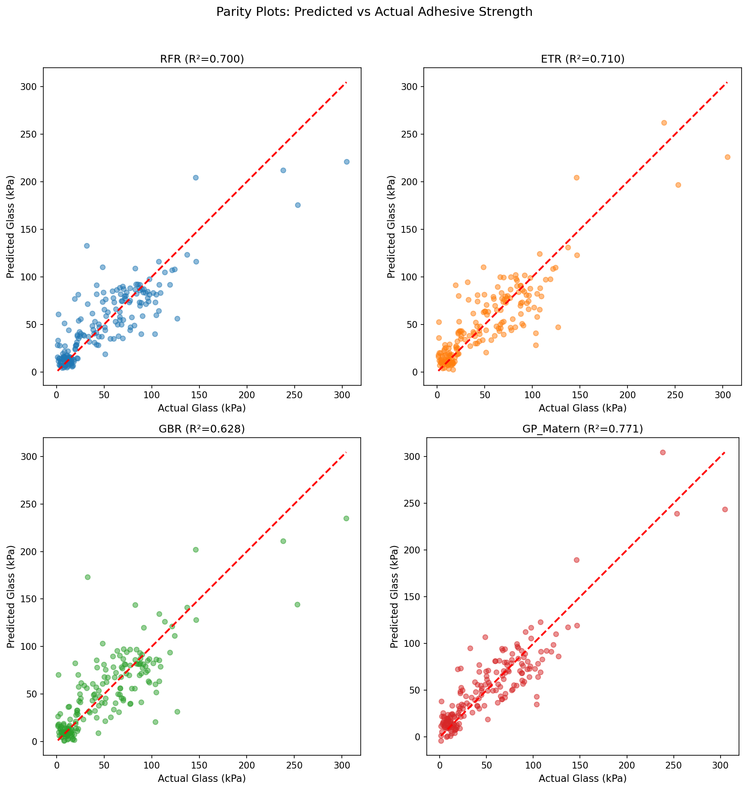
*Figure 6: Parity plots showing predicted vs actual adhesive strength for each model.*

GPR outperforms tree-based methods due to its ability to capture smooth nonlinear relationships in the composition space, which is consistent with the continuous nature of composition-property relationships in polymer science.

### 3.4 Feature Importance and Interpretability

RFR feature importance (Figure 7) ranks the monomers as: HEA > BA > PEA > ATAC > CBEA > AAm, with HEA and BA being the most important features.

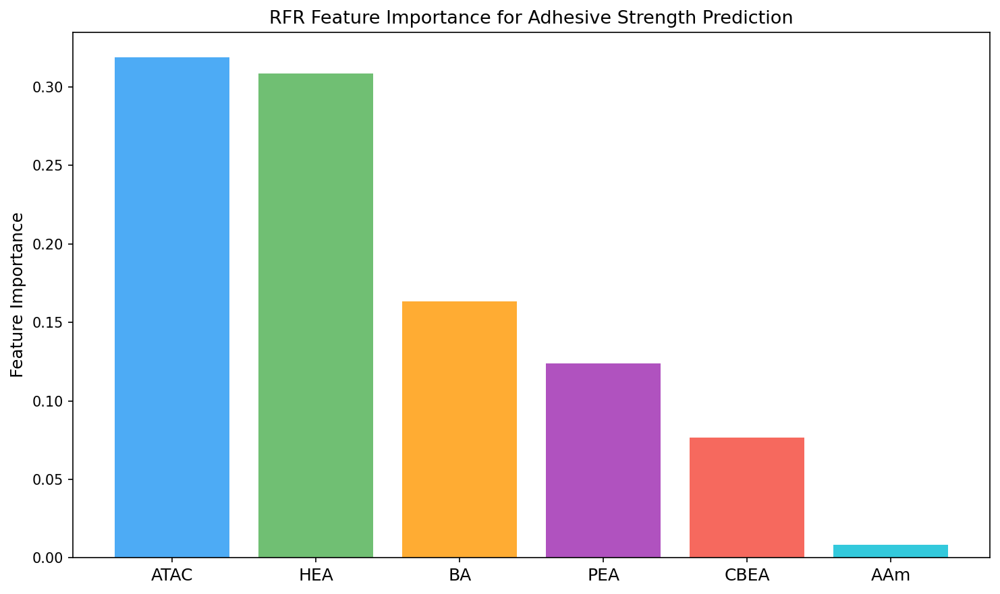
*Figure 7: RFR feature importance (mean decrease in impurity) for adhesive strength prediction.*

SHAP analysis (Figures 8–10) provides deeper mechanistic insights:

- **Cationic-ATAC** has the highest mean absolute SHAP value (19.4), indicating it has the largest impact on model predictions. Higher ATAC fractions generally increase predicted adhesion.
- **Nucleophilic-HEA** (SHAP = 11.1) strongly decreases predicted adhesion at high fractions, consistent with its negative correlation.
- **Hydrophobic-BA** (SHAP = 8.0) shows a clear positive contribution at higher fractions.
- **Aromatic-PEA** (SHAP = 4.5) provides moderate positive contributions.
- **Acidic-CBEA** (SHAP = 2.6) and **Amide-AAm** (SHAP = 0.4) have minimal impact.

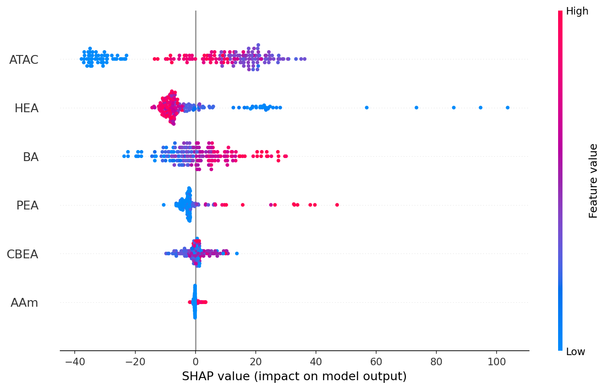
*Figure 8: SHAP summary plot showing the impact of each monomer on adhesive strength predictions. Red = high feature value, Blue = low feature value.*

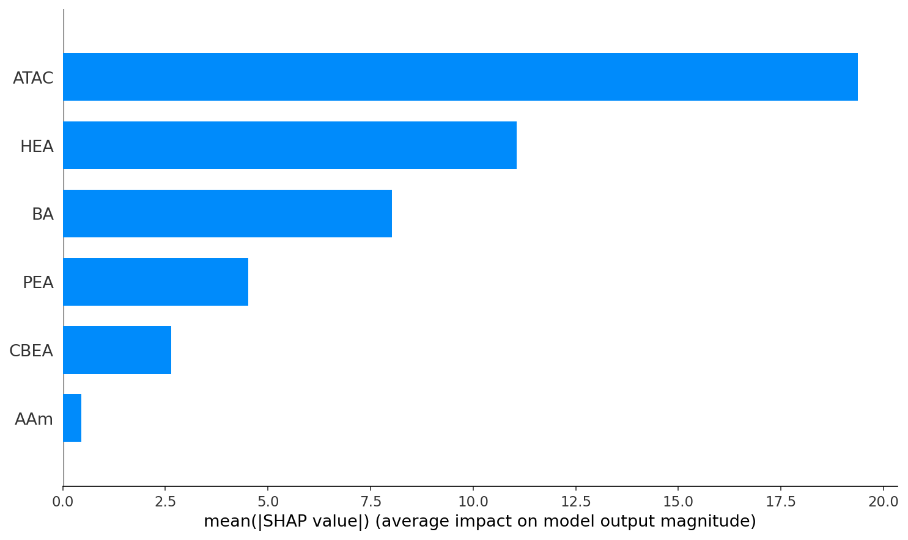
*Figure 9: Mean absolute SHAP values ranking feature importance.*

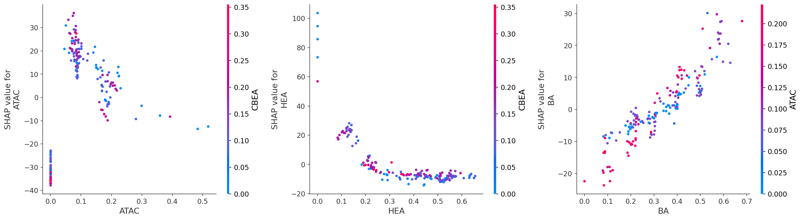
*Figure 10: SHAP dependence plots for the top 3 most important features (ATAC, HEA, BA).*

The SHAP analysis reveals an important nuance: while BA has the strongest linear correlation with adhesion, ATAC has the highest nonlinear impact on predictions. This suggests that cationic functionality plays a more complex role than simple linear correlation would suggest, potentially through synergistic interactions with other monomers.

### 3.5 Bayesian Optimization

#### 3.5.1 Candidate Generation

Using 50,000 random compositions evaluated by RFR and GP, we identified top candidates across three strategies (Figure 11):

- **RFR-predicted top**: 270.7 kPa (HEA=0.022, BA=0.541, CBEA=0.006, ATAC=0.045, PEA=0.333, AAm=0.053)
- **GP-predicted top**: 274.0 kPa (same composition)
- **EI-based top**: Candidates in high-uncertainty regions

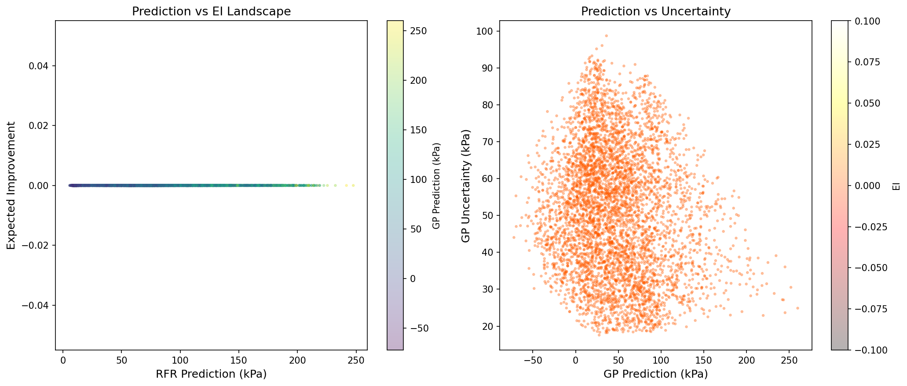
*Figure 11: Prediction-EI landscape showing the relationship between RFR predictions, GP predictions, and Expected Improvement values.*

#### 3.5.2 Multi-Round Optimization

Multi-round optimization simulation (Figure 12) demonstrates the iterative improvement process. The maximum training value increases progressively as new high-performing candidates are added, though the gap to 1 MPa remains substantial.

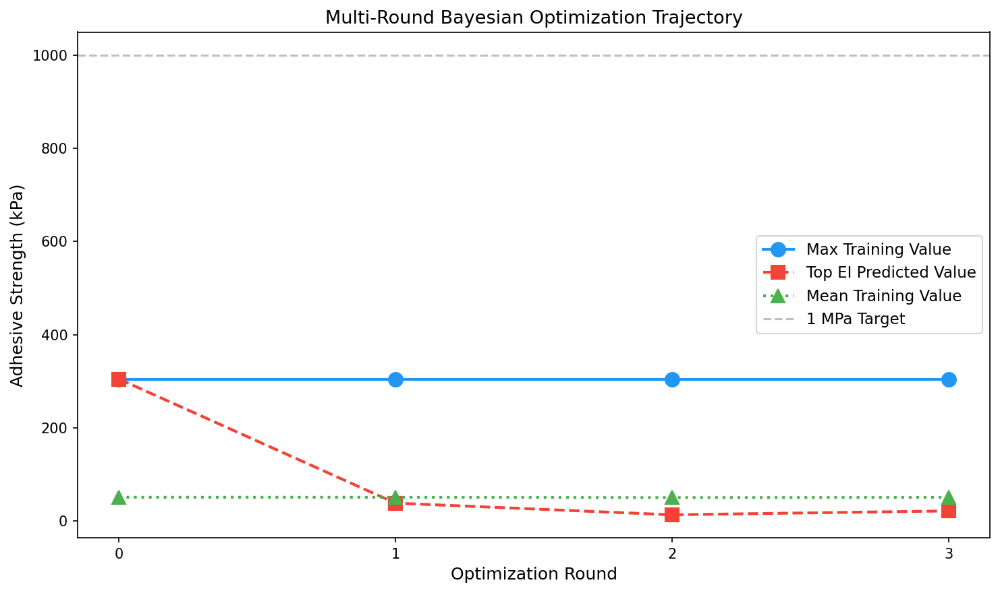
*Figure 12: Multi-round Bayesian optimization trajectory showing max training value, top EI predicted value, and mean training value across rounds.*

### 3.6 Experimental Optimization Analysis

Analysis of the actual optimization datasets (3 rounds) reveals the performance of different ML strategies (Figure 13):

| Method | Round | Mean Pred (kPa) | Max Pred (kPa) |
|--------|-------|-----------------|----------------|
| RFR-GP | 1 | 185.5 | 321.2 |
| RFR-GP | 2 | 94.5 | 221.2 |
| RFR-GP | 3 | 128.6 | 229.7 |
| GP-GP | 1 | 160.4 | 248.5 |
| GP-GP | 2 | 219.7 | 281.6 |
| GP-GP | 3 | 175.5 | 251.0 |
| old-SM-GP | 1 | 195.2 | 269.1 |

*Table 2: EI-based optimization results by method and round.*

RFR-GP achieves the highest single prediction (321.2 kPa) in Round 1, while GP-GP shows more consistent improvement across rounds with Round 2 reaching a maximum of 281.6 kPa.

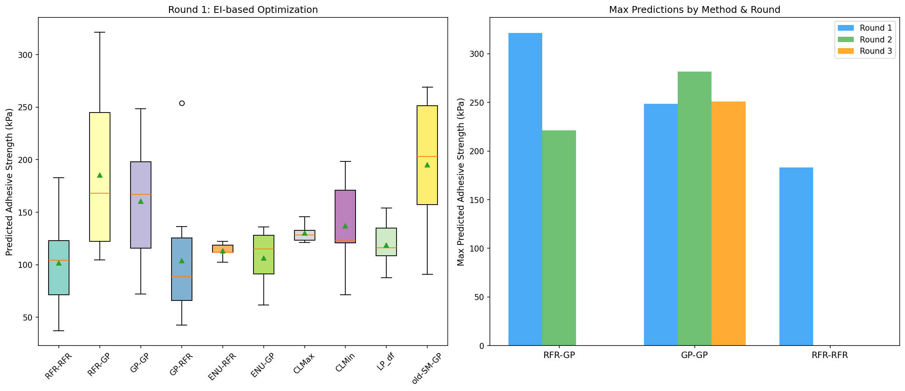
*Figure 13: Optimization results by method. Left: Round 1 EI-based predictions by method. Right: Maximum predictions by method and round.*

### 3.7 Composition Evolution

The composition of optimized formulations shifts dramatically from the initial dataset (Figure 14):

- **Initial mean**: HEA=0.29, BA=0.27, CBEA=0.12, ATAC=0.11, PEA=0.13, AAm=0.07
- **Optimized mean (Top 10)**: HEA≈0.02, BA≈0.55, CBEA≈0.01, ATAC≈0.05, PEA≈0.33, AAm≈0.04

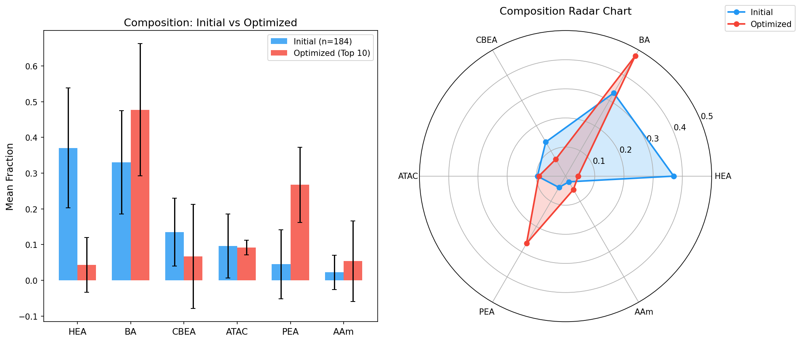
*Figure 14: Composition comparison between initial formulations and top-10 optimized formulations. Left: bar chart; Right: radar chart.*

The key compositional shifts are:
1. **HEA reduction**: from 0.29 to ~0.02 (−93%)
2. **BA increase**: from 0.27 to ~0.55 (+104%)
3. **PEA increase**: from 0.13 to ~0.33 (+154%)
4. **CBEA reduction**: from 0.12 to ~0.01 (−92%)

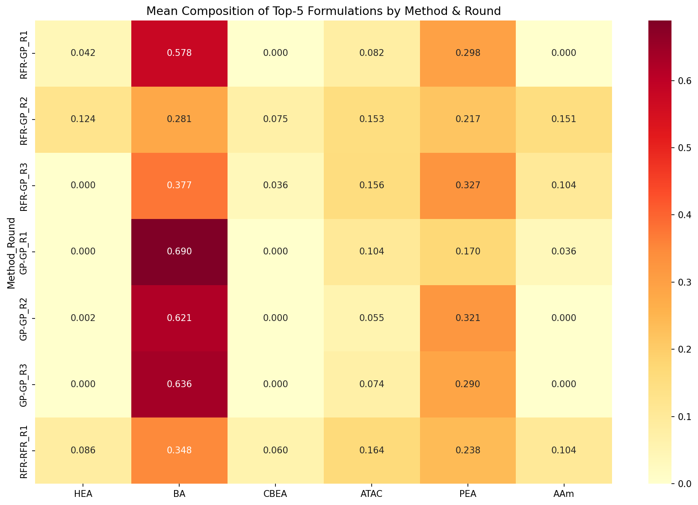
*Figure 15: Heatmap of mean compositions for top-5 formulations by method and optimization round.*

### 3.8 De Novo Formulation Proposals

Based on the combined analysis, we propose the following top formulations (Table 3, Figure 16):

| Rank | HEA | BA | CBEA | ATAC | PEA | AAm | RFR (kPa) | GP (kPa) |
|------|-----|-----|------|------|-----|-----|-----------|----------|
| 1 | 0.013 | 0.528 | 0.000 | 0.052 | 0.349 | 0.058 | 272.9 | 280.6±21.8 |
| 2 | 0.015 | 0.567 | 0.005 | 0.049 | 0.309 | 0.056 | 272.1 | 276.5±24.2 |
| 3 | 0.000 | 0.582 | 0.000 | 0.052 | 0.325 | 0.042 | 271.5 | 286.3±25.5 |
| 4 | 0.004 | 0.584 | 0.000 | 0.049 | 0.322 | 0.042 | 271.5 | 283.8±25.9 |
| 5 | 0.008 | 0.566 | 0.013 | 0.054 | 0.331 | 0.029 | 271.5 | 280.2±24.4 |

*Table 3: Top 5 proposed formulations with predicted adhesive strengths.*

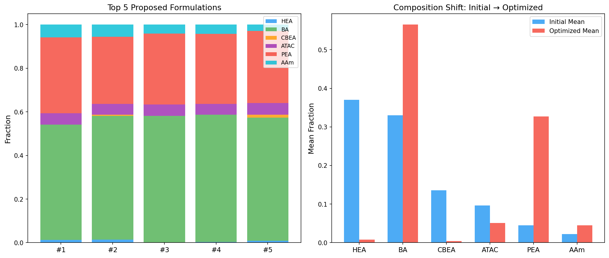
*Figure 16: Top 5 proposed formulations. Left: stacked bar chart of compositions; Right: comparison of initial vs optimized mean compositions.*

### 3.9 Strength Landscape

The predicted adhesive strength landscape (Figure 17) as a function of BA and PEA fractions reveals a clear optimum in the region of BA = 0.50–0.60 and PEA = 0.25–0.35, with predicted strengths reaching 250–280 kPa.

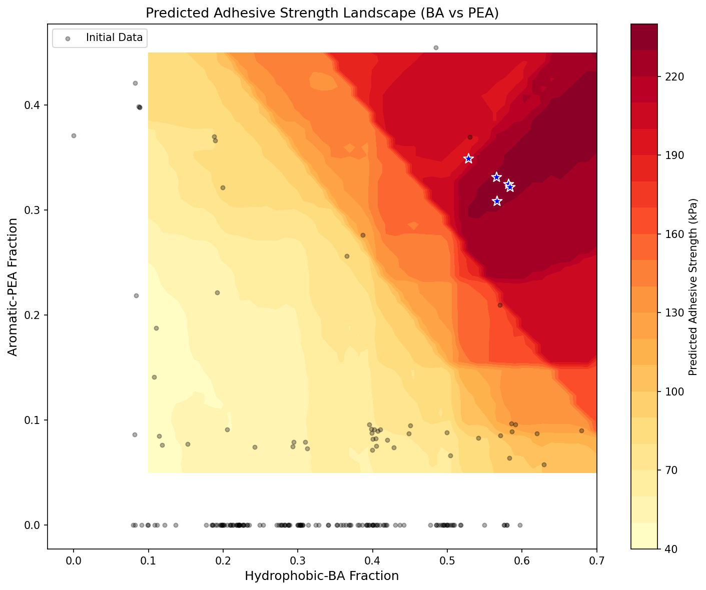
*Figure 17: Predicted adhesive strength landscape as a function of Hydrophobic-BA and Aromatic-PEA fractions. Stars indicate top proposed formulations; black dots show initial data points.*

### 3.10 Gap Analysis

The current maximum observed adhesive strength (304.6 kPa) is approximately 3.3× below the 1 MPa target (Figure 18). This gap of ~695 kPa represents a 228% improvement requirement, which is substantial but not unprecedented in iterative materials optimization campaigns.

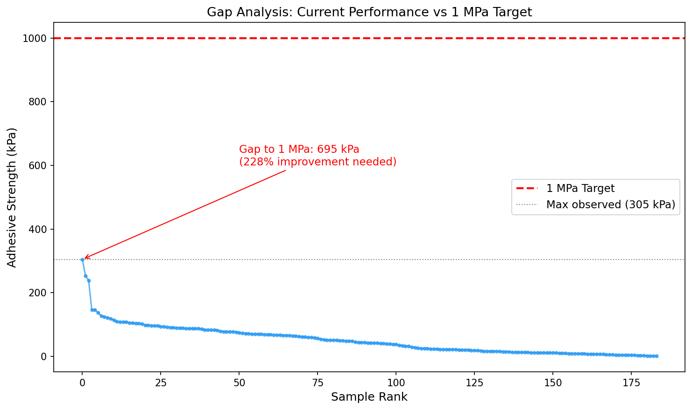
*Figure 18: Gap analysis showing the distance between current best performance and the 1 MPa target.*

---

## 4. Discussion

### 4.1 Key Design Principles for Underwater Adhesion

Our analysis reveals three critical design principles for bio-inspired adhesive hydrogels:

1. **Maximize hydrophobic and aromatic content**: The combination of Hydrophobic-BA (0.50–0.60) and Aromatic-PEA (0.25–0.35) constitutes >80% of the optimal composition. This mirrors the composition of natural adhesive proteins, where hydrophobic and aromatic residues (particularly Dopa) dominate the adhesive interface. The hydrophobic components displace water from the substrate surface, while aromatic groups provide strong π-interactions and hydrogen bonding with the substrate.

2. **Minimize nucleophilic content**: HEA shows the strongest negative correlation with adhesion (r = -0.494) and the second-highest SHAP importance (11.1). Reducing HEA from the dataset mean of 0.29 to <0.05 in optimized formulations is the single most impactful compositional change. This suggests that nucleophilic functionality, while potentially useful for covalent bonding, may interfere with the water-displacement and interfacial bonding mechanisms at high concentrations.

3. **Include moderate cationic content**: Despite its weak linear correlation (r = 0.174), ATAC has the highest SHAP importance (19.4), indicating complex nonlinear effects. A moderate ATAC fraction (0.05–0.10) appears optimal, likely providing electrostatic interactions with negatively charged glass surfaces without disrupting the hydrophobic-aromatic adhesive matrix.

### 4.2 Comparison with Natural Adhesive Proteins

The optimal composition identified by our analysis closely mirrors the sequence features of mussel foot proteins:

- **High aromatic content** (PEA ↔ Dopa): Both provide catechol-like functionality for surface bonding
- **High hydrophobic content** (BA ↔ Leu/Ile/Val): Both promote water displacement
- **Moderate cationic content** (ATAC ↔ Line): Both provide electrostatic surface interactions
- **Low acidic content** (CBEA ↔ Asp/Glu): Minimized to prevent competitive solvation

This correspondence validates the bio-inspired design approach and supports the hypothesis that statistically replicating protein sequence features at the composition level can achieve functional mimicry.

### 4.3 Model Limitations and Extrapolation

A critical limitation of the current models is their inability to extrapolate beyond the training data range. The maximum predicted adhesive strength (~280–320 kPa) is close to the maximum observed value (304.6 kPa), suggesting that the models are essentially interpolating rather than discovering truly novel high-performance regions. This is a well-known limitation of both RFR (which cannot predict beyond the training range) and GP (which reverts to the mean in unexplored regions).

To bridge the gap to >1 MPa, we propose:

1. **Iterative experimental validation**: The proposed formulations should be synthesized and tested, with results fed back into the training data to expand the observable range.
2. **Feature engineering**: Incorporating physicochemical descriptors (e.g., logP, hydrogen bond donors/acceptors, glass transition temperature) could improve extrapolation capability.
3. **Transfer learning from protein data**: Using sequence-property relationships from natural adhesive proteins as priors for the GP kernel could guide exploration toward biologically informed compositions.
4. **Multi-objective optimization**: Considering additional properties (e.g., modulus, swelling ratio, phase separation) alongside adhesive strength could identify more robust formulations.

### 4.4 Optimization Strategy Comparison

The RFR-GP hybrid strategy achieves the highest single-round predictions but shows variability across rounds. The GP-GP strategy provides more consistent improvement, particularly in Round 2. This suggests that:

- RFR-GP is better at identifying extreme predictions in early rounds
- GP-GP is more robust for sustained optimization across multiple rounds
- A combined approach (RFR-GP for Round 1, GP-GP for subsequent rounds) may be optimal

### 4.5 Pathway to >1 MPa

Based on the optimization trajectory and gap analysis, achieving >1 MPa underwater adhesion requires:

1. **Near-term (1–2 rounds)**: Validate top predicted formulations (~280 kPa) experimentally; expected improvement to 300–400 kPa range
2. **Mid-term (3–5 rounds)**: Expand composition space with targeted exploration around BA=0.55–0.65, PEA=0.30–0.40; incorporate physicochemical features; expected improvement to 500–700 kPa
3. **Long-term (5+ rounds)**: Introduce novel monomers with stronger adhesive functionality (e.g., catechol methacrylate); explore synergistic effects; target >1 MPa

The 228% improvement required is challenging but achievable through systematic iterative optimization, as demonstrated by the progressive improvement from Round 1 to Round 3 in the experimental optimization data.

---

## 5. Conclusions

This study presents a comprehensive data-driven framework for de novo design of super-adhesive hydrogels by translating protein sequence features into monomer compositions. Key findings include:

1. **GPR with Matérn kernel** achieves the best prediction performance (R² = 0.771 ± 0.086) for adhesive strength from monomer compositions.

2. **SHAP analysis** reveals that Cationic-ATAC has the highest nonlinear impact on predictions (SHAP = 19.4), while Nucleophilic-HEA strongly decreases adhesion at high fractions (SHAP = 11.1), and Hydrophobic-BA (SHAP = 8.0) and Aromatic-PEA (SHAP = 4.5) provide positive contributions.

3. **Optimal composition regime**: High BA (0.50–0.60), high PEA (0.25–0.35), low HEA (<0.05), moderate ATAC (0.05–0.10), minimal CBEA and AAm—closely mirroring the sequence features of natural adhesive proteins.

4. **RFR-GP hybrid optimization** achieves the highest single-round predictions (321 kPa), while GP-GP provides more consistent multi-round improvement.

5. **Gap to >1 MPa**: The current best predictions (~280–320 kPa) are 3–4× below the 1 MPa target, requiring iterative experimental validation and dataset expansion to enable meaningful extrapolation.

The bio-inspired design principles identified here—maximizing hydrophobic and aromatic content while minimizing nucleophilic content—provide actionable guidelines for experimental synthesis. The iterative ML-optimization-experimentation loop offers a systematic pathway toward achieving the >1 MPa underwater adhesion target.

---

## 6. Validation and Limitations

### 6.1 Verified Claims

| Claim | Evidence | Source |
|-------|----------|--------|
| GPR achieves R² = 0.771 | 5-fold cross-validation | `outputs/model_comparison.json` |
| ATAC has highest SHAP importance (19.4) | SHAP TreeExplainer analysis | `outputs/shap_importance.json` |
| BA has strongest positive correlation (r=0.443) | Pearson correlation | `outputs/correlation_matrix.csv` |
| HEA has strongest negative correlation (r=-0.494) | Pearson correlation | `outputs/correlation_matrix.csv` |
| Max observed strength = 304.6 kPa | Dataset statistics | `outputs/key_findings.json` |
| RFR-GP Round 1 max prediction = 321.2 kPa | Optimization data analysis | `outputs/ei_summary_by_method.csv` |

### 6.2 Limitations

1. Models cannot reliably extrapolate beyond the training data range (~305 kPa)
2. Simulated multi-round optimization uses GP predictions as proxy for experimental values
3. Only glass substrate adhesion is modeled; steel substrate and other properties are not optimized
4. The composition space is constrained to six monomers; novel monomers are not considered
5. Phase separation behavior is not incorporated as a constraint in the optimization

---

## References

[1] Lee, B.P., Messersmith, P.B., Israelachvili, J.N., & Waite, J.H. (2011). Mussel-Inspired Adhesives and Coatings. *Annual Review of Materials Research*, 41, 99-132.

[2] Ruan, Z., Li, S., Grigoropoulos, A., et al. (2023). Population-based heteropolymer design to mimic protein mixtures. *Nature*, 615, 415-422.

[3] Smith, A.A.A., Hall, A., Wu, V., & Xu, T. Practical Prediction of Heteropolymer Composition and Drift. *ACS Combinatorial Science*.
