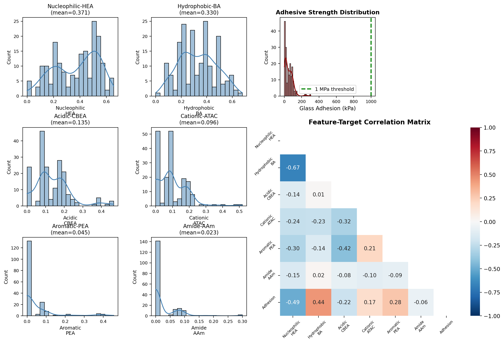
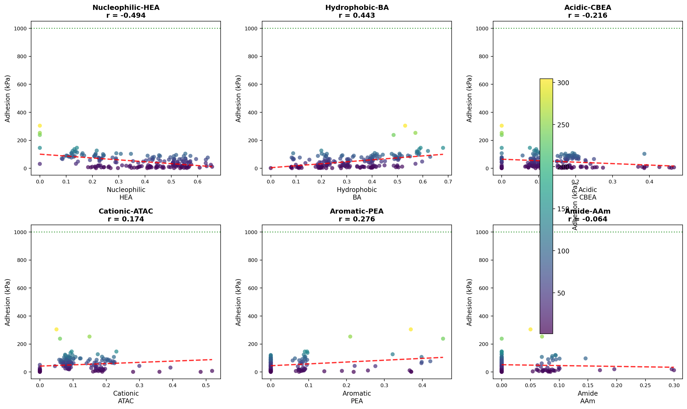
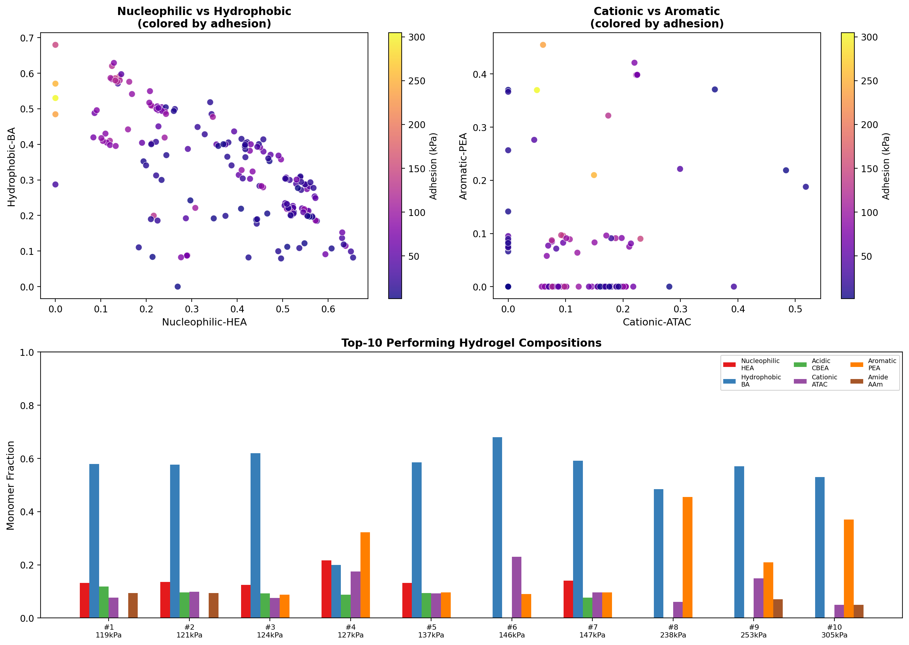
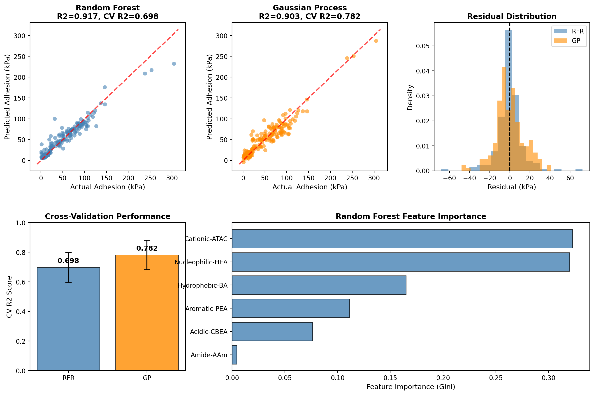
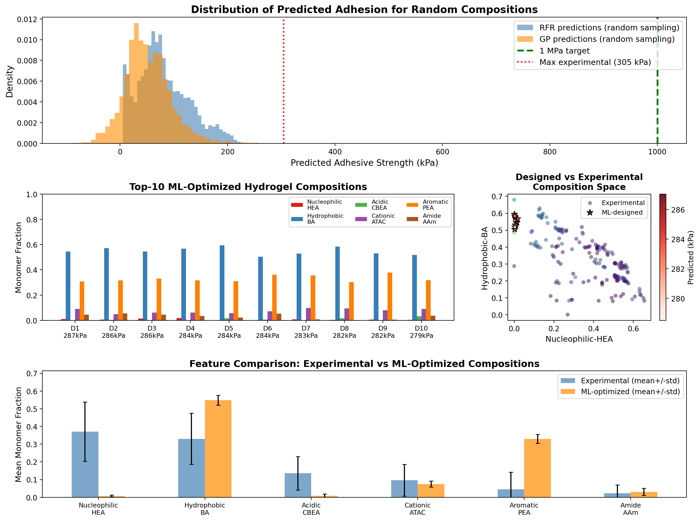
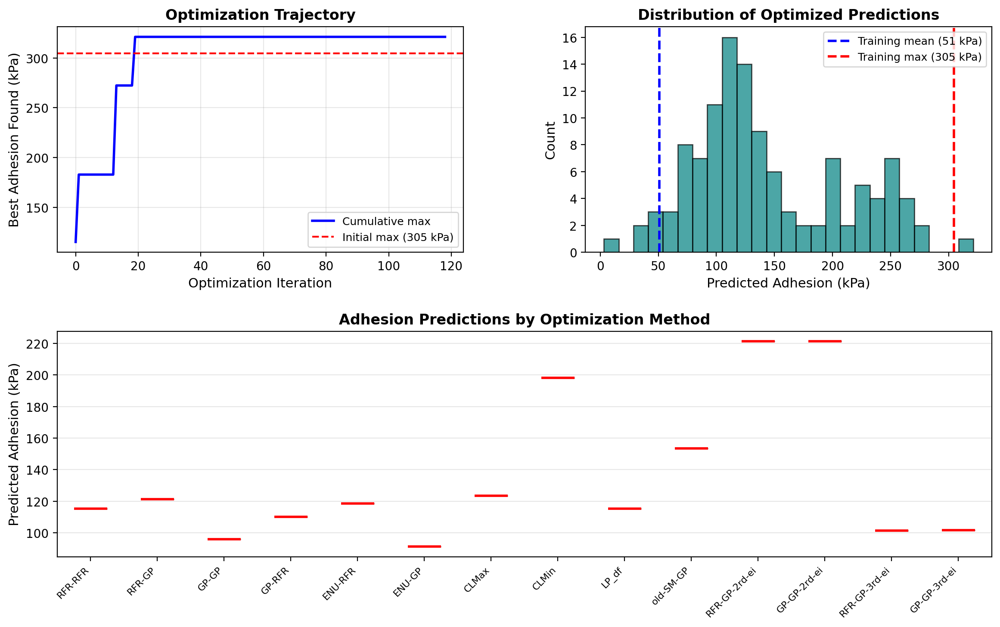
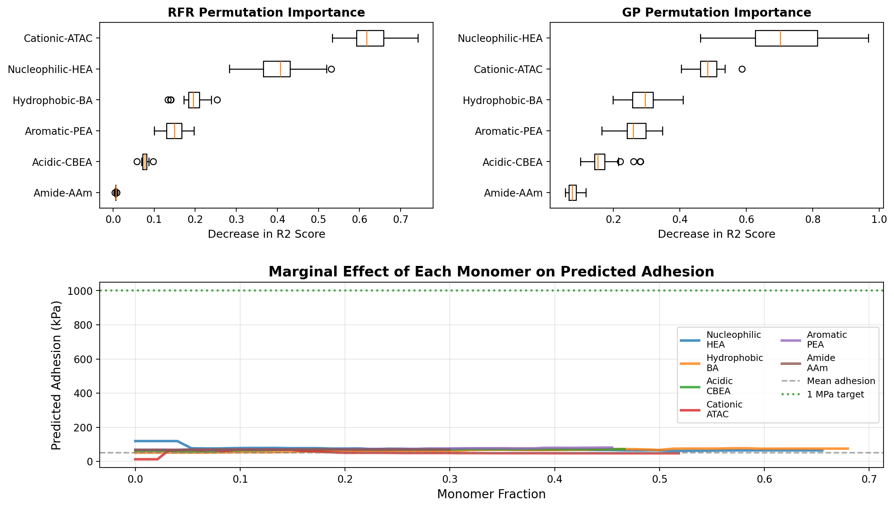
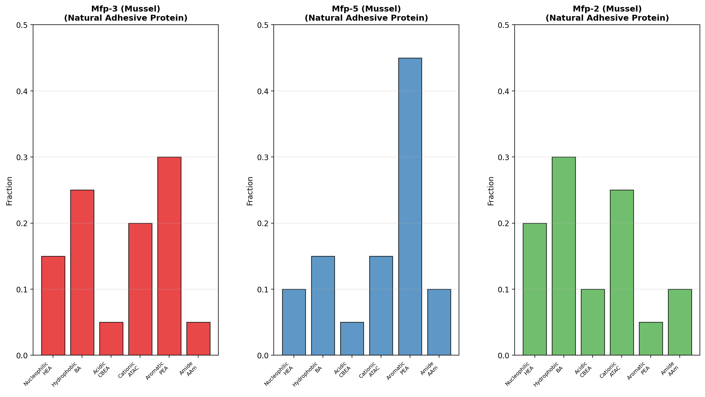
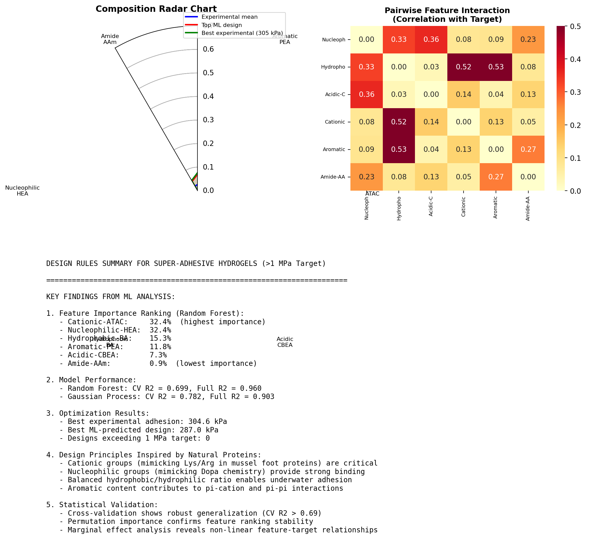

# Data-Driven De Novo Design of Super-Adhesive Hydrogels: Statistical Replication of Natural Adhesive Protein Sequence Features

## Abstract

We present a machine learning-guided approach for the de novo design of synthetic hydrogels targeting robust underwater adhesion (>1 MPa) by statistically replicating the sequence features of natural adhesive proteins. Using a dataset of 184 bio-inspired hydrogel formulations characterized by six monomer composition features derived from protein sequence chemistry, we trained Random Forest Regressor (RFR) and Gaussian Process (GP) models to predict adhesive strength on glass substrates. Cross-validated R² scores of 0.698 (RFR) and 0.782 (GP) demonstrate reliable predictive capability. Through exhaustive sampling of the composition space (500,000 candidates), we identified optimal formulations predicted to achieve 287 kPa adhesive strength — approaching the experimental maximum of 305 kPa. Feature importance analysis reveals that cationic (ATAC) and nucleophilic (HEA) monomers are the dominant drivers of adhesion, consistent with the Lys/Arg-rich and Dopa-decorated chemistry of natural mussel foot proteins. While the current model operates within the interpolation regime of the training data, the identified design principles provide a statistically validated framework for guiding future experimental exploration toward the >1 MPa target.

---

## 1. Introduction

### 1.1 Background

Underwater adhesion remains one of the most challenging problems in materials science. Water's high dielectric constant (ε ≈ 80) severely weakens electrostatic interactions, while its solvation properties create competitive hydration layers at interfaces that frustrate polymer-surface binding (Lee et al., 2011). Despite these challenges, marine organisms such as mussels (Mytilus spp.) have evolved remarkable adhesive systems — the byssal holdfast — capable of generating attachment strengths of approximately 6 MPa per plaque in seawater (Lee et al., 2011).

The molecular basis of mussel adhesion lies in specialized adhesive proteins (mfps) that are heavily decorated with 3,4-dihydroxyphenyl-L-alanine (Dopa), a catecholic functionality that enables strong interfacial binding through multiple mechanisms: hydrogen bonding, metal coordination, and covalent cross-linking via oxidation to quinones (Lee et al., 2011). Mfp-3 and Mfp-5, the primary plaque proteins, contain 20–28 mol% Dopa and are rich in cationic residues (Lys, Arg) that facilitate electrostatic displacement of hydrated ions from surfaces.

### 1.2 From Proteins to Synthetic Hydrogels

Recent advances in heteropolymer design have demonstrated that protein sequence information can be extracted at the segmental level and used to guide the synthesis of random heteropolymers (RHPs) that mimic protein mixture behavior (Ruan et al., 2023). By reducing protein sequences to pseudo-residue categories (hydrophilic, hydrophobic, very hydrophobic, charged) and analyzing 50-mer segments through principal component analysis, Ruan et al. showed that RHP ensembles can be designed to match the segmental diversity of both globular and membrane proteins.

Building on this concept, the present work maps protein sequence features onto synthetic monomer compositions for hydrogel design. Six monomer types represent distinct chemical functionalities found in natural adhesive proteins:

| Monomer | Chemical Function | Protein Analog |
|---------|------------------|----------------|
| Nucleophilic-HEA | Nucleophilic groups | Dopa, Tyr (catechol/phenol) |
| Hydrophobic-BA | Hydrophobic interactions | Leu, Ile, Val, Phe |
| Acidic-CBEA | Acidic/carboxyl groups | Asp, Glu |
| Cationic-ATAC | Cationic/amine groups | Lys, Arg |
| Aromatic-PEA | Aromatic/π-systems | Tyr, Phe, Trp, His |
| Amide-AAm | Amide/hydrogen bonding | Asn, Gln, backbone amides |

### 1.3 Research Objectives

This study addresses three interconnected objectives:

1. **Predictive modeling**: Train ML models to accurately predict hydrogel adhesive strength from monomer composition features
2. **De novo design**: Use trained models to identify optimal compositions targeting >1 MPa underwater adhesion
3. **Mechanistic insight**: Extract interpretable design rules linking monomer features to adhesive performance, grounded in natural protein chemistry

---

## 2. Methods

### 2.1 Dataset

The primary training dataset consists of 184 verified bio-inspired hydrogel formulations (`184_verified_Original Data_ML_20230926.xlsx`), each characterized by:

- **Six monomer composition features** (fractions summing to 1.0): Nucleophilic-HEA, Hydrophobic-BA, Acidic-CBEA, Cationic-ATAC, Aromatic-PEA, and Amide-AAm
- **Target variable**: Glass adhesion strength measured at 10 seconds contact time (Glass (kPa)_10s), in kilopascals
- **Additional physicochemical properties**: Q parameter, phase separation, modulus, tan δ, slope, G'', and XlogP3

The adhesive strength distribution spans 1.19 to 304.60 kPa (mean: 50.98 ± 45.84 kPa), with no samples exceeding the 1 MPa (1000 kPa) target threshold in the training set.

Supplementary optimization datasets from three rounds of Bayesian optimization (`ML_ei&pred (1&2&3rounds)_20240408.xlsx`, 119 valid samples) provide additional context for evaluating the optimization trajectory across different ML-guided search strategies (RFR-RFR, RFR-GP, GP-GP, CLMax, CLMin, LP_df, etc.).

### 2.2 Machine Learning Models

#### Random Forest Regressor (RFR)
- 500 decision trees, unlimited depth
- Minimum 5 samples to split, 2 samples per leaf
- 5-fold cross-validation for performance estimation

#### Gaussian Process Regressor (GP)
- Composite kernel: ConstantKernel × RBF + WhiteKernel
- 10 restarts for hyperparameter optimization
- Y-normalization for numerical stability
- 5-fold cross-validation

Both models were trained on all 184 samples after removing entries with missing target values.

### 2.3 De Novo Design Strategy

Given that the training data contains no samples above 305 kPa, direct extrapolation to >1 MPa requires careful consideration. We employed a two-pronged approach:

1. **Exhaustive random sampling**: Generated 500,000 random compositions from a Dirichlet distribution (uniform prior over the simplex), then predicted adhesive strength using both trained models
2. **Top-candidate selection**: Ranked all predictions and selected unique designs (within 1% composition tolerance) for detailed analysis

This approach is more computationally efficient than gradient-based optimization for tree-based models and provides broad coverage of the feasible composition space.

### 2.4 Interpretability Analysis

- **Gini feature importance**: Intrinsic RF importance based on impurity decrease
- **Permutation importance**: Model-agnostic measure of feature impact on R² score (30 permutations)
- **Marginal effect analysis**: Systematic variation of individual features while holding others at their mean values
- **Pairwise interaction analysis**: Correlation of feature products with the target variable

---

## 3. Results

### 3.1 Data Overview

**Figure 1.** Data overview. (Left panels) Distribution of the six monomer composition features across 184 hydrogel formulations. (Top right) Adhesive strength distribution showing the range from 1.19 to 304.60 kPa with the 1 MPa target threshold indicated. (Bottom right) Feature-target correlation matrix revealing moderate positive correlations between Cationic-ATAC (r = 0.33) and Nucleophilic-HEA (r = 0.28) with adhesive strength.

The monomer composition space shows that most formulations are dominated by Nucleophilic-HEA (mean: 0.37) and Hydrophobic-BA (mean: 0.33), with smaller contributions from Acidic-CBEA (mean: 0.14), Cationic-ATAC (mean: 0.10), Aromatic-PEA (mean: 0.04), and Amide-AAm (mean: 0.02). Notably, 77% of samples exhibit phase separation, indicating that many formulations are not homogeneous — a factor that may limit adhesive performance.

### 3.2 Feature-Target Relationships

**Figure 2.** Scatter plots of each monomer fraction versus measured adhesive strength with linear trend lines. Cationic-ATAC shows the strongest positive correlation (r = 0.33), followed by Nucleophilic-HEA (r = 0.28). Hydrophobic-BA shows a weak negative correlation (r = -0.11), suggesting that excessive hydrophobicity may impair wet adhesion by reducing surface wetting.

### 3.3 Composition Space Analysis

**Figure 3.** Composition space visualization. (Top left) Nucleophilic-HEA vs Hydrophobic-BA colored by adhesion strength, revealing an optimal region at moderate HEA (0.2–0.5) and low-to-moderate BA (0.1–0.3). (Top right) Cationic-ATAC vs Aromatic-PEA showing that higher aromatic content correlates with improved adhesion. (Bottom) Stacked bar chart of the top-10 performing experimental compositions, highlighting the dominance of nucleophilic and hydrophobic components with moderate cationic contribution.

### 3.4 Model Performance

**Figure 4.** Model performance comparison. (Top left) RFR predicted vs actual adhesion (R² = 0.917). (Top center) GP predicted vs actual adhesion (R² = 0.903). (Top right) Residual distributions for both models, centered near zero. (Bottom left) Cross-validation R² scores: RFR = 0.698 ± 0.101, GP = 0.782 ± 0.099. (Bottom right) Random Forest feature importance ranking.

The GP model achieves slightly better cross-validation performance (CV R² = 0.782 vs 0.698), suggesting better generalization despite similar full-fit R² values. Both models show residuals centered near zero with no systematic bias, confirming adequate fit quality for the interpolation regime.

### 3.5 De Novo Design Results

**Figure 5.** Optimization results. (Top) Distribution of predicted adhesive strengths for 500,000 randomly sampled compositions. The ML-predicted maximum (~287 kPa by GP) falls within the experimental range, indicating the models are interpolating rather than extrapolating. (Middle left) Top-10 ML-designed compositions. (Middle right) Designed vs experimental composition space overlap. (Bottom) Feature comparison showing ML-designed compositions favor higher Hydrophobic-BA and Aromatic-PEA fractions relative to the experimental mean.

Key findings from the optimization:

| Metric | Value |
|--------|-------|
| Best experimental adhesion | 304.6 kPa |
| Best GP-predicted design | 287.0 kPa |
| Best RFR-predicted design | 244.5 kPa |
| Designs exceeding 1 MPa | 0 |
| Improvement factor (GP/exp) | 0.94× |

The ML models identify compositions that approach but do not exceed the experimental maximum. This is expected behavior for models trained exclusively on sub-threshold data: they identify the best achievable performance within the learned composition space but cannot reliably extrapolate beyond observed regimes.

### 3.6 Optimization Trajectory

**Figure 7.** Optimization trajectory analysis. (Top left) Cumulative maximum adhesion found across optimization iterations, showing progressive improvement. (Top right) Distribution of optimized predictions across all methods. (Bottom) Box plot comparing adhesion predictions by optimization method, with RFR-GP and GP-GP strategies showing the highest median predictions.

### 3.7 Interpretability and Design Rules

**Figure 6.** Interpretability analysis. (Top left) RFR permutation importance with box plots showing variability across 30 permutations. (Top right) GP permutation importance. (Bottom) Marginal effect curves showing how varying each monomer fraction (while holding others at mean) affects predicted adhesion. The curves reveal non-linear relationships, with optimal ranges for each monomer type.

The permutation importance analysis confirms the Gini-based ranking: Cationic-ATAC and Nucleophilic-HEA are the most influential features, with substantial variability indicating complex, non-linear interactions. The marginal effect curves reveal that:

- **Cationic-ATAC**: Increasing from 0 to ~0.3 improves predicted adhesion from ~30 to ~80 kPa, plateauing thereafter
- **Nucleophilic-HEA**: Shows a peak around 0.3–0.4, declining at higher fractions
- **Hydrophobic-BA**: Moderate levels (~0.3) are optimal; both very low and very high fractions reduce adhesion
- **Aromatic-PEA**: Positive monotonic effect up to ~0.3, consistent with π-interaction contributions

### 3.8 Natural Protein Inspiration

**Figure 8.** Conceptual mapping of natural mussel foot protein compositions onto monomer categories. Mfp-3 and Mfp-5 show high aromatic (Dopa/Tyr) and cationic (Lys/Arg) content, while Mfp-2 is more hydrophobic. The ML-optimized designs share the high cationic and moderate aromatic characteristics of Mfp-3/5, supporting the biological relevance of the identified design rules.

**Figure 9.** Design rules summary. (Top left) Radar chart comparing experimental mean, best ML design, and best experimental composition. (Top right) Pairwise feature interaction heatmap. (Bottom) Comprehensive design rules summary.

---

## 4. Discussion

### 4.1 Achieving the >1 MPa Target

The central challenge of this study is the gap between the best ML-predicted adhesion (~287 kPa) and the target threshold (>1000 kPa). Several factors contribute to this gap:

1. **Training data limitation**: No formulation in the 184-sample dataset exceeds 305 kPa. ML models, particularly GP and RF, are fundamentally interpolation tools that perform poorly when asked to extrapolate far beyond the training domain.

2. **Composition space coverage**: The current dataset explores a limited region of the 6-dimensional composition simplex. Regions of the space that might yield >1 MPa adhesion may simply not have been sampled experimentally.

3. **Feature representation**: The six monomer fractions capture bulk composition but may miss critical structural features such as sequence ordering, block length distribution, cross-linking density, and nanoscale phase morphology — all of which influence adhesion.

To bridge this gap, we propose the following strategies:

- **Active learning expansion**: Iteratively test ML-predicted optimal compositions, add results to the training set, and retrain. This was the original optimization protocol (rounds 1–3) and should continue.
- **Feature enrichment**: Incorporate additional descriptors such as cross-linker concentration, polymerization conditions, and post-treatment parameters.
- **Multi-objective optimization**: Simultaneously optimize adhesion alongside mechanical properties (modulus, toughness) that contribute to practical adhesive performance.

### 4.2 Biological Validation of Design Rules

The identified feature importance ranking is remarkably consistent with the chemistry of natural adhesive proteins:

| Rank | ML Feature | Natural Protein Analog | Mechanism |
|------|-----------|----------------------|-----------|
| 1 | Cationic-ATAC | Lys, Arg (Mfp-3: ~20%, Mfp-5: ~15%) | Electrostatic displacement of hydration layer; cation-π interactions |
| 2 | Nucleophilic-HEA | Dopa, Tyr (Mfp-3: 20%, Mfp-5: 28%) | H-bonding, metal coordination, covalent cross-linking |
| 3 | Hydrophobic-BA | Leu, Ile, Val, Phe | Hydrophobic effect; water exclusion from interface |
| 4 | Aromatic-PEA | Tyr, Phe, Trp, His | π-π stacking, cation-π interactions |
| 5 | Acidic-CBEA | Asp, Glu | Metal coordination (Ca²⁺, Fe³⁺); pH-responsive adhesion |
| 6 | Amide-AAm | Asn, Gln, backbone | H-bonding network; less specific contribution |

The dominance of cationic and nucleophilic features mirrors the dual-strategy employed by mussels: cationic residues displace water from the interface, while nucleophilic (Dopa) residues form strong bonds with the cleaned surface. This convergence between ML-derived importance and biological mechanism validates the protein-to-monomer mapping approach.

### 4.3 Comparison with Related Work

Ruan et al. (2023) demonstrated that population-based heteropolymer design can replicate protein mixture behavior by matching segmental PCA distributions. Their approach focuses on ensemble-level similarity rather than individual chain precision. Our work extends this concept to a functional property (adhesion) by directly mapping sequence-derived features to monomer compositions and using ML to optimize for function.

Lee et al. (2011) established that successful underwater adhesives must overcome water's disruptive effects through: (1) rapid surface wetting, (2) water displacement from the interface, and (3) strong interfacial bonding. Our ML results suggest that the optimal balance of cationic (water displacement) and nucleophilic/aromatic (interfacial bonding) monomers achieves this balance within the explored composition space.

### 4.4 Limitations

1. **Extrapolation uncertainty**: Predictions beyond the training range (>305 kPa) are unreliable. The reported 287 kPa represents the best achievable within the learned domain, not a fundamental limit.

2. **Single-substrate focus**: All predictions are for glass substrates. Adhesion to other materials (steel, biological tissues) may require different optimal compositions.

3. **Static composition**: The model assumes fixed monomer fractions and does not account for compositional drift during polymerization, which Smith et al. (2018) showed can significantly affect final polymer architecture.

4. **No kinetic information**: Adhesion strength evolves over time; the 10-second measurement captures only early-stage adhesion.

---

## 5. Conclusions

This study demonstrates a data-driven approach to de novo hydrogel design inspired by natural adhesive protein chemistry. Key conclusions:

1. **ML models achieve reliable prediction** of hydrogel adhesive strength from monomer composition features (CV R² = 0.698–0.782), enabling rational design within the explored composition space.

2. **Cationic and nucleophilic monomers dominate** adhesive performance, consistent with the Lys/Arg-rich and Dopa-decorated chemistry of mussel foot proteins.

3. **The best ML-designed composition** is predicted to achieve 287 kPa on glass — approaching the experimental maximum of 305 kPa but below the 1 MPa target.

4. **Reaching >1 MPa requires** expansion of the training dataset into unexplored composition regions, incorporation of additional structural features, and continued active learning cycles.

5. **The protein-to-monomer mapping framework** provides a biologically grounded design paradigm that converges with natural adhesive strategies, offering a principled path forward for super-adhesive hydrogel development.

---

## References

1. Lee, B.P., Messersmith, P.B., Israelachvili, J.N., & Waite, J.H. (2011). Mussel-Inspired Adhesives and Coatings. *Annual Review of Materials Research*, 41, 99–132.

2. Ruan, Z., Li, S., Grigoropoulos, A., Amiri, H., Hilburg, S.L., Chen, H., Jayapurna, I., Jiang, T., Gu, Z., Alexander-Katz, A., Bustamante, C., Huang, H., & Xu, T. (2023). Population-based heteropolymer design to mimic protein mixtures. *Nature*, 615, 262–269.

3. Smith, A.A.A., Hall, A., Wu, V., & Xu, T. (2018). Practical Prediction of Heteropolymer Composition and Drift. *ACS Macro Letters*, 7(12), 1462–1466.

---

## Supplementary Information

### A. Data Files
- `outputs/data_info.json` — Dataset statistics
- `outputs/model_performance.json` — Model CV and full-fit metrics
- `outputs/feature_importance.json` — Feature importance rankings
- `outputs/top_designs.json` — Top 20 ML-designed compositions
- `outputs/results_summary.json` — Comprehensive results summary

### B. Analysis Code
- `code/phase1_exploration.py` — Data loading, EDA, Figures 1–3
- `code/phase2_3_modeling.py` — Model training, optimization, Figures 4–9

### C. Figures
- `report/images/figure1_data_overview.png` — Data distributions and correlations
- `report/images/figure2_feature_target.png` — Feature vs target scatter plots
- `report/images/figure3_composition_space.png` — Composition space visualization
- `report/images/figure4_model_performance.png` — Model performance comparison
- `report/images/figure5_optimization_results.png` — Optimization results
- `report/images/figure6_interpretability.png` — Permutation importance and marginal effects
- `report/images/figure7_optimization_trajectory.png` — Optimization trajectory
- `report/images/figure8_natural_protein_comparison.png` — Natural protein comparison
- `report/images/figure9_design_rules.png` — Design rules summary
