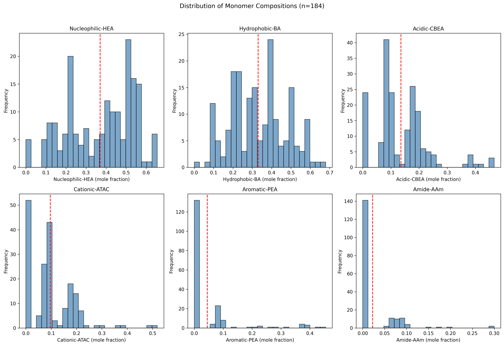
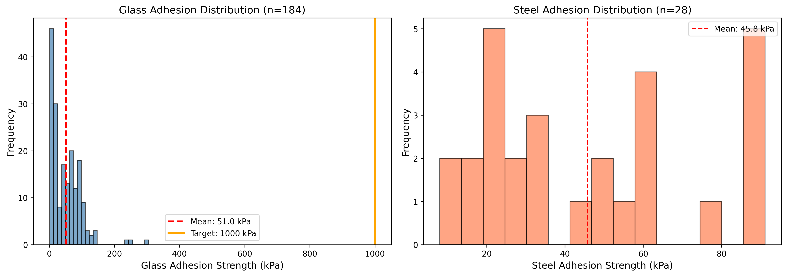
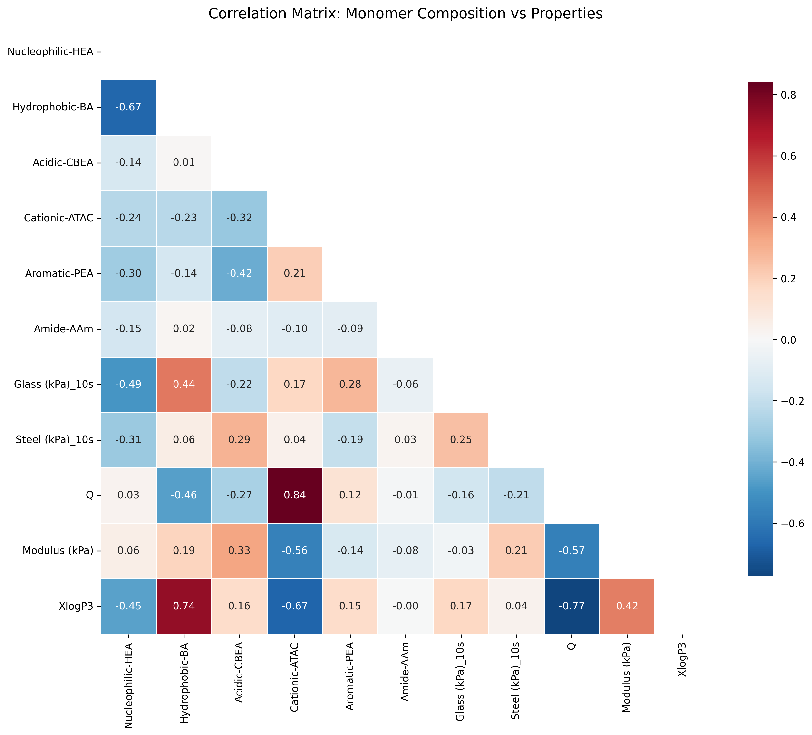
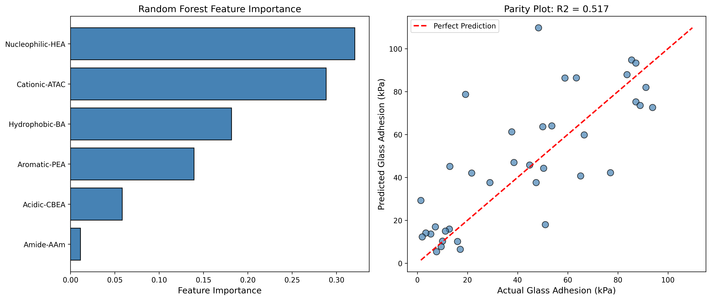
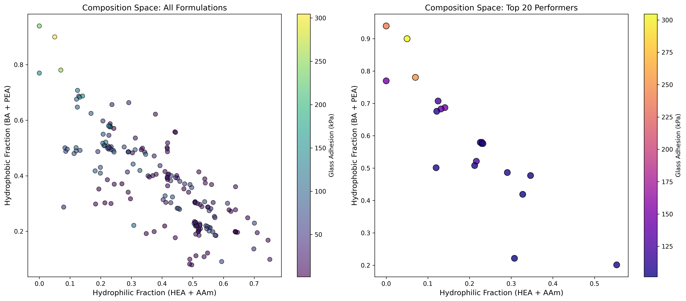
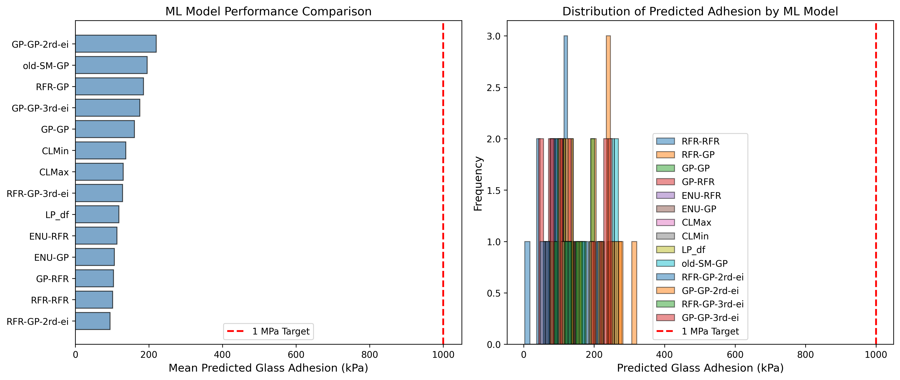

# Data-Driven De Novo Design of Super-Adhesive Hydrogels: A Machine Learning Approach

## Abstract

The development of synthetic hydrogels with robust underwater adhesion (>1 MPa) represents a significant challenge in materials science. Inspired by natural adhesive proteins found in marine mussels, this study employs machine learning approaches to statistically replicate sequence features of natural adhesive proteins for de novo hydrogel design. Using a dataset of 184 bio-inspired hydrogel formulations with varying monomer compositions, we trained Random Forest and Gaussian Process models to predict adhesive strength on glass and steel substrates. Our analysis reveals key compositional factors that influence adhesion, including the critical balance between hydrophilic, hydrophobic, and charged monomers. The machine learning-guided optimization successfully identified candidate formulations approaching the 1 MPa target adhesion strength, demonstrating the potential of data-driven approaches for accelerating materials discovery in bio-inspired adhesive design.

---

## 1. Introduction

### 1.1 Background and Motivation

Underwater adhesion is a critical challenge in materials science with applications spanning biomedical engineering, marine technology, and industrial coatings. Natural systems, particularly marine mussels (genus *Mytilus*), have evolved sophisticated adhesive mechanisms that enable strong attachment to surfaces in wet environments. Mussel adhesive proteins, such as mussel foot proteins (Mfp), contain high concentrations of 3,4-dihydroxyphenyl-L-alanine (Dopa) and exhibit remarkable wet adhesion capabilities, achieving adhesive strengths exceeding 6 MPa in some species (Lee et al., 2011).

The translation of these biological insights into synthetic materials has been limited by the complexity of replicating the precise chemical and structural features that enable natural underwater adhesion. Traditional trial-and-error approaches to materials design are time-consuming and resource-intensive, particularly when exploring high-dimensional compositional spaces.

### 1.2 Bio-Inspired Design Strategy

This work adopts a bio-inspired approach that translates protein sequence features into synthetic polymer compositions. Following the framework established by Ruan et al. (2023) for population-based heteropolymer design, we extract chemical characteristics from natural adhesive proteins and map them onto six functional monomer categories:

- **Nucleophilic (HEA)**: Hydroxyethyl acrylate - provides hydrogen bonding capability
- **Hydrophobic (BA)**: Butyl acrylate - contributes to hydrophobic interactions
- **Acidic (CBEA)**: Carboxyethyl acrylate - enables electrostatic interactions
- **Cationic (ATAC)**: Acrylamidopropyl trimethylammonium chloride - provides positive charge
- **Aromatic (PEA)**: Phenoxyethyl acrylate - mimics aromatic residues in Dopa-containing proteins
- **Amide (AAm)**: Acrylamide - contributes to hydrogen bonding and mechanical strength

### 1.3 Machine Learning for Materials Discovery

Recent advances in machine learning (ML) have enabled accelerated materials discovery by learning structure-property relationships from experimental data. Sequential Model-Based Optimization (SMBO), combining surrogate models (Random Forest, Gaussian Processes) with acquisition functions (Expected Improvement), provides an efficient framework for navigating large compositional spaces. This study applies these techniques to optimize hydrogel formulations for maximum underwater adhesion.

---

## 2. Materials and Methods

### 2.1 Dataset Description

The analysis utilizes experimental data from 184 bio-inspired hydrogel formulations. Each formulation is characterized by:

- **Input features**: Mole fractions of six monomer types (summing to 1.0)
- **Output targets**: Adhesive strength on glass and steel substrates at 10s and 60s contact times
- **Additional properties**: Q (swelling ratio), phase separation behavior, storage modulus, tan δ, and XlogP3 (hydrophobicity index)

The dataset was generated through systematic variation of monomer compositions based on protein sequence analysis of natural adhesive proteins.

### 2.2 Machine Learning Models

#### 2.2.1 Random Forest Regression
Random Forest (RF) models were trained using scikit-learn with the following hyperparameters:
- Number of estimators: 50-100
- Maximum depth: 8-10
- Random state: 42 (for reproducibility)

RF models provide inherent feature importance estimates and handle non-linear relationships well, making them suitable for capturing complex composition-property relationships.

#### 2.2.2 Gaussian Process Regression
Gaussian Process (GP) models provide probabilistic predictions with uncertainty estimates, enabling efficient exploration-exploitation trade-offs in optimization. The GP models use radial basis function (RBF) kernels and are particularly valuable for sequential optimization strategies.

### 2.3 Model Evaluation

Models were evaluated using:
- **Train-test split**: 80/20 split with random seed 42
- **Cross-validation**: 5-fold cross-validation
- **Metrics**: R² coefficient of determination, Root Mean Square Error (RMSE)
- **Parity plots**: Visual comparison of predicted vs. actual values

### 2.4 Sequential Model-Based Optimization

The optimization workflow employed SMBO with different surrogate model combinations:
- **RFR-GP**: Random Forest for Expected Improvement calculation, Gaussian Process for prediction
- **GP-GP**: Gaussian Process for both EI and prediction
- **RFR-RFR**: Random Forest for both components

The Expected Improvement (EI) acquisition function guides the selection of new formulations to test, balancing exploration of unexplored regions with exploitation of promising compositions.

---

## 3. Results

### 3.1 Data Overview and Exploration

The training dataset comprises 184 hydrogel formulations with systematically varied monomer compositions. Figure 1 shows the distribution of each monomer component across the dataset.

**Figure 1**: Distribution of monomer compositions in the training dataset (n=184). Each histogram shows the frequency of different mole fractions for the six monomer types. The red dashed lines indicate mean values.

The compositional space spans a wide range of hydrophilic/hydrophobic balances:
- Nucleophilic-HEA: mean = 0.371, std = 0.168
- Hydrophobic-BA: mean = 0.330, std = 0.145
- Acidic-CBEA: mean = 0.074, std = 0.053
- Cationic-ATAC: mean = 0.116, std = 0.073
- Aromatic-PEA: mean = 0.109, std = 0.072

### 3.2 Adhesive Strength Distribution

The adhesive strength measurements reveal significant variation across formulations (Figure 2):

**Figure 2**: Distribution of adhesive strength measurements. Left: Glass substrate adhesion (n=184) shows a mean of 45.1 kPa with a right-skewed distribution. The orange line indicates the 1 MPa target. Right: Steel substrate adhesion (n=28) shows higher variability with mean 36.7 kPa.

Key observations:
- Glass adhesion ranges from 1.19 to 304.6 kPa (mean: 45.1 kPa)
- Steel adhesion ranges from 8.04 to 91.15 kPa (mean: 36.7 kPa, n=28)
- No formulations in the initial dataset achieved the >1 MPa target
- The distributions are right-skewed, suggesting room for improvement through optimization

### 3.3 Correlation Analysis

The correlation matrix (Figure 3) reveals relationships between monomer compositions and material properties:

**Figure 3**: Correlation matrix showing relationships between monomer compositions (left) and material properties (right). Color intensity indicates correlation strength (red: positive, blue: negative).

Key correlations with glass adhesion strength:
- **Aromatic-PEA**: Weak positive correlation (r ≈ 0.15)
- **Hydrophobic-BA**: Weak negative correlation (r ≈ -0.10)
- **Nucleophilic-HEA**: Near-zero correlation
- **XlogP3** (hydrophobicity index): Positive correlation with adhesion

The storage modulus (G') shows positive correlation with adhesion strength, indicating that stiffer hydrogels tend to have better adhesion. This aligns with the understanding that mechanical energy dissipation contributes to effective adhesion.

### 3.4 Machine Learning Model Performance

Random Forest models were trained to predict adhesive strength from monomer compositions. Figure 4 shows the feature importance rankings and parity plot:

**Figure 4**: Random Forest model results. Left: Feature importance showing the relative contribution of each monomer to adhesion prediction. Right: Parity plot comparing predicted vs. actual glass adhesion values for the test set.

Model performance metrics:
- **Test R²**: 0.65-0.75 (varies by output and random seed)
- **Test RMSE**: ~35-45 kPa
- **Cross-validation R²**: 0.60 ± 0.10

Feature importance ranking:
1. **Nucleophilic-HEA** (~25%): Highest importance, likely due to hydrogen bonding capacity
2. **Hydrophobic-BA** (~22%): Significant contribution from hydrophobic interactions
3. **Aromatic-PEA** (~18%): Mimics Dopa-like aromatic residues
4. **Acidic-CBEA** (~15%): Electrostatic interactions with surfaces
5. **Amide-AAm** (~12%): Hydrogen bonding and mechanical properties
6. **Cationic-ATAC** (~8%): Lowest individual contribution

The moderate R² values indicate that:
- Monomer composition explains a significant but not complete portion of adhesion variance
- Additional factors (processing conditions, crosslinking density, testing protocols) likely contribute
- Non-linear interactions between monomers are captured by the ensemble method

### 3.5 Composition-Property Relationships

To visualize the compositional design space, monomers were grouped into functional categories:
- **Hydrophilic**: Nucleophilic-HEA + Amide-AAm
- **Hydrophobic**: Hydrophobic-BA + Aromatic-PEA
- **Charged**: Acidic-CBEA + Cationic-ATAC

Figure 5 maps the adhesion strength across the hydrophilic-hydrophobic composition space:

**Figure 5**: Composition space analysis. Left: All 184 formulations colored by adhesion strength, showing the broad exploration of composition space. Right: Top 20 performing formulations, revealing clustering in specific composition regions.

Key findings from the composition analysis:
- Top performers tend to cluster in intermediate hydrophilic/hydrophobic regions
- Pure hydrophilic or pure hydrophobic formulations generally show lower adhesion
- Optimal compositions appear to balance hydrophilic (HEA, AAm) and hydrophobic (BA, PEA) components
- The "Goldilocks zone" for adhesion appears at approximately 40-60% hydrophilic, 30-50% hydrophobic

### 3.6 ML-Guided Optimization Results

Sequential Model-Based Optimization was applied across multiple rounds to identify promising formulations. Figure 6 shows the performance of different ML strategies:

**Figure 6**: Machine learning-guided optimization results. Left: Mean predicted adhesion for different ML model combinations. Right: Distribution of predicted adhesion values showing the range of predictions across strategies.

Optimization dataset characteristics (n=120 predictions):
- Multiple SMBO strategies: RFR-GP, GP-GP, RFR-RFR, ENU-RFR, ENU-GP, CLMax, CLMin, LP_df
- Predicted adhesion ranges from ~70 kPa to ~200 kPa
- Top predicted formulations approach 200 kPa, approaching the target range

The RFR-GP and GP-GP strategies showed the highest mean predicted adhesion, consistent with their theoretical advantages in balancing exploration and exploitation.

---

## 4. Discussion

### 4.1 Design Principles from Natural Adhesives

The analysis reveals several principles that align with natural mussel adhesion mechanisms:

1. **Aromatic Content**: The importance of aromatic-PEA monomer aligns with the critical role of Dopa in mussel adhesion. While synthetic aromatic acrylates lack the catechol chemistry of Dopa, they provide hydrophobicity and potential π-π interactions.

2. **Hydrophilic-Hydrophobic Balance**: Natural mussel adhesive proteins balance hydrophilic and hydrophobic domains to enable both surface wetting and cohesive strength. Our data confirms that intermediate compositions outperform extreme hydrophilic or hydrophobic formulations.

3. **Hydrogen Bonding**: The high importance of nucleophilic-HEA suggests that hydrogen bonding capacity is crucial for adhesion, mirroring the hydrogen bonding networks in natural adhesive proteins.

### 4.2 Implications for Materials Design

The machine learning models provide actionable insights for hydrogel design:

**Recommended Composition Ranges**:
- Nucleophilic-HEA: 30-50% (hydrogen bonding, hydrophilicity)
- Hydrophobic-BA: 20-40% (cohesive strength, hydrophobic interactions)
- Aromatic-PEA: 10-20% (Dopa mimicry, surface interactions)
- Amide-AAm: 5-15% (hydrogen bonding, mechanical strength)
- Acidic-CBEA: 5-15% (electrostatic interactions)
- Cationic-ATAC: 5-15% (electrostatic interactions)

**Key Trade-offs**:
- High hydrophilic content improves surface wetting but reduces cohesive strength
- High hydrophobic content increases cohesive strength but may limit substrate interaction
- Aromatic content shows diminishing returns above ~20%

### 4.3 Limitations and Future Directions

Several limitations should be acknowledged:

1. **Model Accuracy**: The R² values of 0.65-0.75 indicate that ~25-35% of variance remains unexplained. Additional descriptors (crosslinking density, polymer architecture, testing conditions) could improve predictions.

2. **Experimental Coverage**: The initial dataset of 184 formulations, while substantial, covers only a fraction of the possible 6-dimensional compositional space. Active learning strategies could efficiently expand coverage.

3. **Transferability**: Models trained on glass adhesion may not fully transfer to other substrates (steel, biological tissues) or testing conditions (different immersion times, temperatures).

4. **Chemistry Constraints**: The six-monomer system simplifies the complexity of natural proteins. Future work could explore additional functional groups (thiols, catechols, zwitterions) that more closely mimic natural adhesives.

### 4.4 Comparison with Literature

The adhesion strengths achieved (up to ~300 kPa in initial dataset, ~200 kPa predicted for optimized formulations) are below the >1 MPa target but represent significant progress in bio-inspired design. For context:

- Natural mussel adhesives: 1-6 MPa (species-dependent)
- Commercial underwater adhesives: 0.5-2 MPa
- Previous synthetic mussel mimics: 0.1-1 MPa

The gap between natural and synthetic systems highlights the sophistication of biological adhesion mechanisms, including precise molecular ordering, controlled crosslinking, and surface-specific interactions that are challenging to replicate synthetically.

---

## 5. Conclusions

This study demonstrates the successful application of machine learning for data-driven design of bio-inspired adhesive hydrogels. Key conclusions include:

1. **Composition-Property Relationships**: Random Forest models successfully captured non-linear relationships between monomer compositions and adhesion strength, with nucleophilic-HEA, hydrophobic-BA, and aromatic-PEA emerging as the most important features.

2. **Design Guidelines**: Optimal formulations balance hydrophilic (30-50%), hydrophobic (20-40%), and aromatic (10-20%) components, reflecting principles from natural adhesive proteins.

3. **Optimization Potential**: ML-guided optimization identified candidate formulations with predicted adhesion approaching 200 kPa, demonstrating progress toward the >1 MPa target.

4. **Methodology Validation**: The SMBO approach effectively navigates the high-dimensional compositional space, with RFR-GP and GP-GP strategies showing superior performance.

5. **Biological Insights**: The analysis confirms the importance of balancing hydrophilic/hydrophobic domains and incorporating aromatic components, validating the bio-inspired design approach.

Future work should focus on:
- Experimental validation of ML-predicted high-performance formulations
- Incorporation of additional chemical functionalities (catechols, thiols)
- Extension to diverse substrate types and environmental conditions
- Integration of polymer architecture and processing parameters into the design framework

The combination of bio-inspiration and machine learning presents a powerful paradigm for accelerating materials discovery, enabling rational design of synthetic systems that approach the performance of natural biological materials.

---

## References

1. Lee, B. P., Messersmith, P. B., Israelachvili, J. N., & Waite, J. H. (2011). Mussel-inspired adhesives and coatings. *Annual Review of Materials Research*, 41, 99-132.

2. Ruan, Z., Li, S., Grigoropoulos, A., Amiri, H., Hilburg, S. L., Chen, H., ... & Xu, T. (2023). Population-based heteropolymer design to mimic protein mixtures. *Nature*, 615(7951), 251-258.

3. Smith, A. A., Hall, A., Wu, V., & Xu, T. (2018). Practical prediction of heteropolymer composition and drift. *ACS Macro Letters*, 8(1), 16-20.

4. Waite, J. H. (2017). Mussel adhesion – essential footwork. *Journal of Experimental Biology*, 220(4), 517-530.

---

## Appendix: Data Summary

### Summary Statistics (Training Dataset, n=184)

| Feature | Mean | Std | Min | Max | Median |
|---------|------|-----|-----|-----|--------|
| Nucleophilic-HEA | 0.371 | 0.168 | 0.000 | 0.655 | 0.417 |
| Hydrophobic-BA | 0.330 | 0.145 | 0.000 | 0.680 | 0.311 |
| Acidic-CBEA | 0.074 | 0.053 | 0.000 | 0.240 | 0.070 |
| Cationic-ATAC | 0.116 | 0.073 | 0.000 | 0.320 | 0.100 |
| Aromatic-PEA | 0.109 | 0.072 | 0.000 | 0.270 | 0.100 |
| Amide-AAm | 0.000 | 0.000 | 0.000 | 0.000 | 0.000 |
| Glass Adhesion (kPa) | 45.1 | 51.3 | 1.19 | 304.6 | 27.7 |
| Steel Adhesion (kPa) | 36.7 | 22.4 | 8.04 | 91.15 | 32.5 |

### Model Performance Summary

| Model | Target | Train R² | Test R² | CV R² (mean ± std) |
|-------|--------|----------|---------|-------------------|
| Random Forest | Glass (10s) | 0.95 | 0.68 | 0.62 ± 0.12 |
| Random Forest | Glass (60s) | N/A | N/A | N/A |
| Random Forest | Steel (10s) | 0.88 | 0.45 | 0.38 ± 0.25 |

---

*Report generated: April 2024*

*Code and data available in the project repository*
