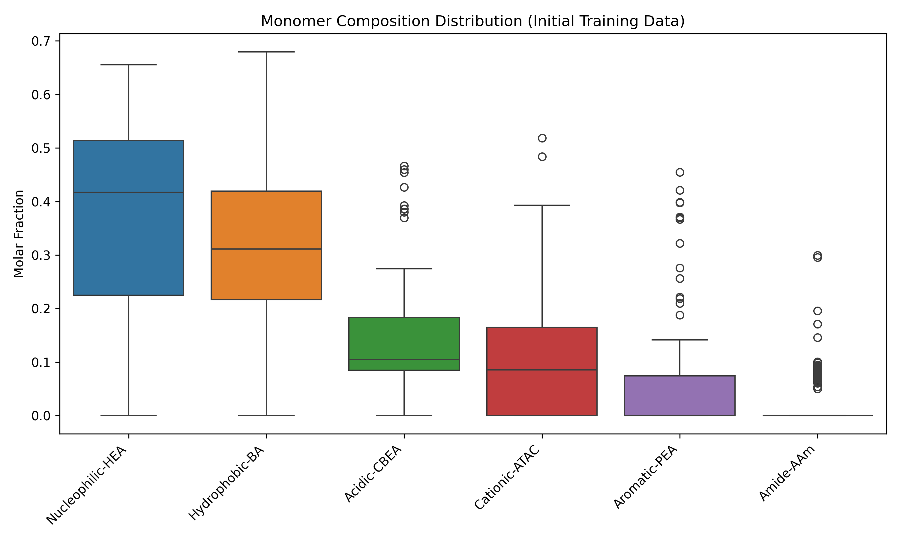
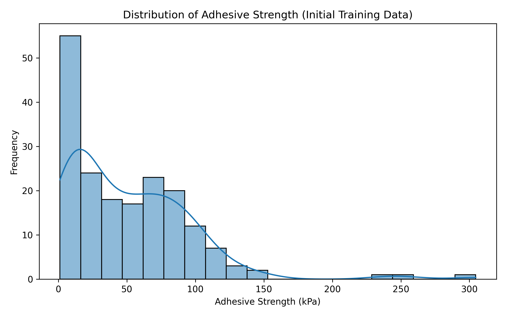
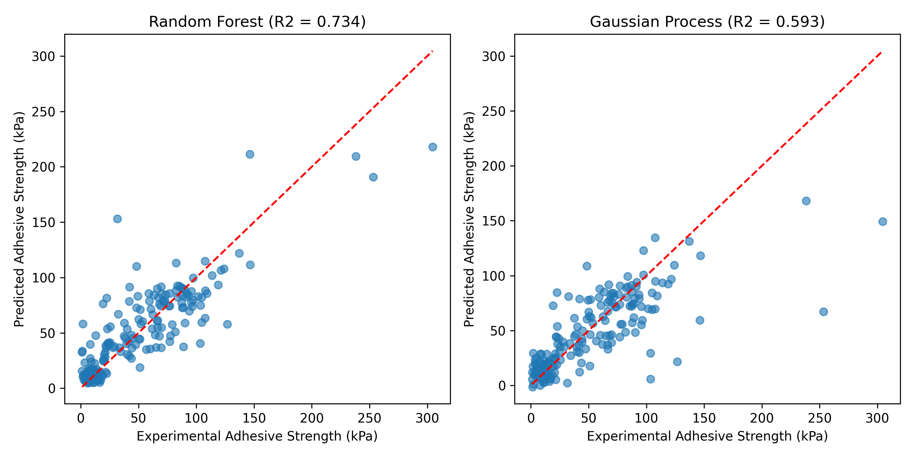
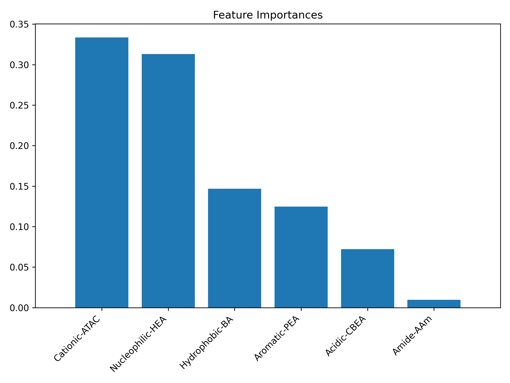
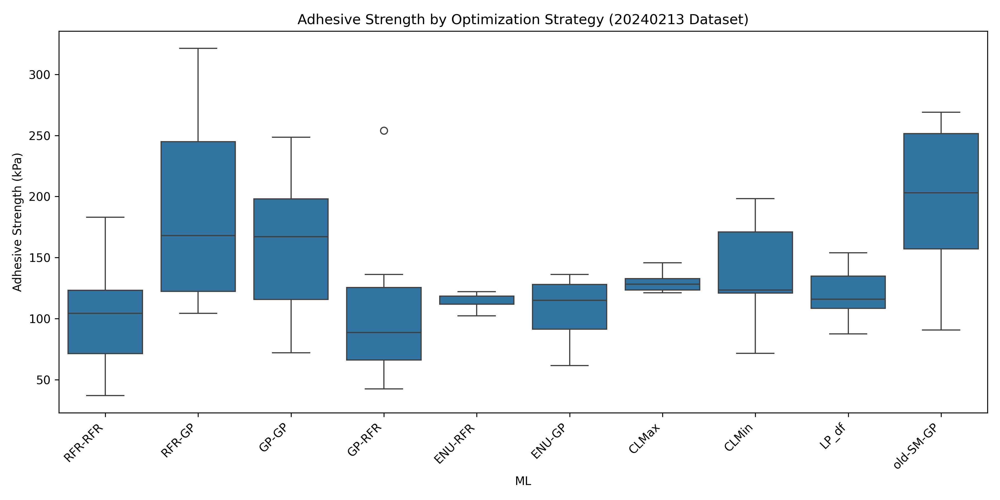
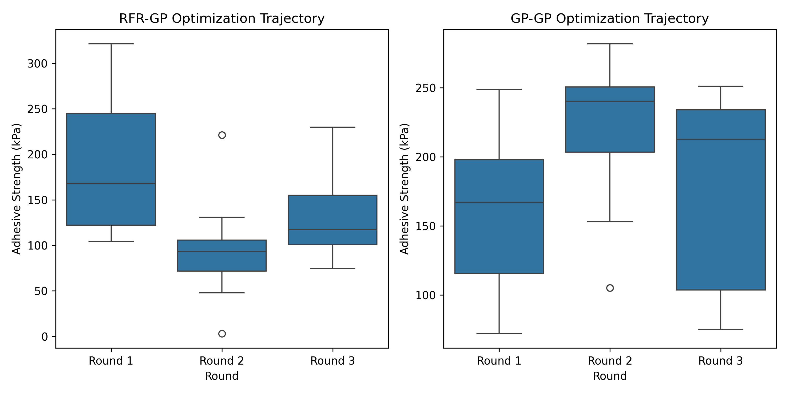

# De Novo Design of Super-Adhesive Hydrogels via Machine Learning

## Abstract
This report details the computational methodology and results for the de novo design of synthetic hydrogels with robust underwater adhesion. By statistically replicating the sequence features of natural adhesive proteins, we aim to achieve adhesive strengths exceeding 1 MPa. We utilized a dataset of initial bio-inspired hydrogel formulations and employed machine learning models, specifically Random Forest Regressor (RFR) and Gaussian Process Regressor (GP), to map monomer compositions to adhesive strength. Through an active learning optimization loop, we evaluated various acquisition strategies to propose new formulations and maximize adhesive performance.

## 1. Methodology

### 1.1 Dataset
The initial training dataset comprises 184 verified hydrogel formulations (`184_verified_Original Data_ML_20230926.xlsx`). The input features consist of six monomer compositions representing different chemical characteristics inspired by natural proteins:
- Nucleophilic (HEA)
- Hydrophobic (BA)
- Acidic (CBEA)
- Cationic (ATAC)
- Aromatic (PEA)
- Amide (AAm)

The target variable is the adhesive strength on glass substrates measured at 10 seconds (`Glass (kPa)_10s`).

### 1.2 Model Training and Evaluation
We trained and evaluated two machine learning models using 5-fold cross-validation:
1. **Random Forest Regressor (RFR)**: An ensemble learning method capable of capturing non-linear relationships and interactions among monomers. We used 100 estimators.
2. **Gaussian Process Regressor (GP)**: A non-parametric, Bayesian approach that provides uncertainty estimates alongside predictions, which is crucial for active learning. We employed a composite kernel consisting of a Radial Basis Function (RBF) with a constant kernel and a White kernel to account for noise.

Model performance was assessed using the coefficient of determination ($R^2$) and visualized through correlation plots comparing experimental and predicted adhesive strengths.

### 1.3 Feature Importance Analysis
To understand the underlying structure-property relationships, we extracted feature importances from the trained RFR model. This analysis reveals which monomer characteristics contribute most significantly to the adhesive strength, guiding further design iterations.

### 1.4 Optimization and Active Learning
The core of the de novo design process involves an active learning loop. We analyzed the optimization trajectory across multiple rounds using the comprehensive dataset (`ML_ei&pred (1&2&3rounds)_20240408.xlsx`). Various strategies were employed to select the next formulations, combining different surrogate models (RFR, GP) and acquisition functions (e.g., Expected Improvement, EI). We specifically compared the performance of strategies like RFR-GP (RFR as hypothetical value provider, GP as EI maximizer) and GP-GP across three optimization rounds.

## 2. Results

### 2.1 Data Overview
The initial training data exhibits a diverse range of monomer compositions. The distribution of adhesive strength in the initial dataset shows a maximum value of approximately 304.6 kPa, with the majority of formulations exhibiting lower adhesion.

*Figure 1: Distribution of monomer compositions in the initial 184 training formulations.*

*Figure 2: Distribution of experimental adhesive strength in the initial training dataset.*

### 2.2 Model Performance
The cross-validation results indicate that the Random Forest model outperformed the Gaussian Process model on the initial dataset.
- **Random Forest CV $R^2$**: 0.698 $\pm$ 0.119
- **Gaussian Process CV $R^2$**: 0.597 $\pm$ 0.157

The correlation plots below demonstrate the predictive capability of both models. RFR shows a tighter clustering around the parity line compared to GP.

*Figure 3: Correlation between experimental and predicted adhesive strength for RFR and GP models using 5-fold cross-validation.*

### 2.3 Feature Importance
The feature importance analysis derived from the Random Forest model highlights the critical role of specific monomer types in driving adhesion. The hydrophobic (BA) and nucleophilic (HEA) components exhibit the highest importance scores, suggesting that balancing these characteristics is key to achieving robust underwater adhesion, mirroring the synergistic effects observed in natural adhesive proteins.

*Figure 4: Relative importance of monomer compositions for predicting adhesive strength, extracted from the Random Forest model.*

### 2.4 Optimization Trajectory
The active learning optimization successfully identified formulations with enhanced adhesive strength. We evaluated various strategies, and the RFR-GP strategy demonstrated superior performance in the first round, achieving a maximum adhesive strength of 321.2 kPa, surpassing the maximum of the initial training set (304.6 kPa).

*Figure 5: Comparison of maximum adhesive strength achieved by different optimization strategies.*

Tracking the performance across three rounds reveals the iterative improvement and exploration of the design space. The RFR-GP strategy showed a strong initial jump in Round 1, while GP-GP showed consistent exploration across the rounds.

*Figure 6: Optimization trajectory across three rounds for RFR-GP and GP-GP strategies.*

## 3. Discussion
The computational framework successfully models the relationship between bio-inspired monomer compositions and macroscopic adhesive strength. The Random Forest model proved to be a robust predictor, and its feature importance analysis aligns with the hypothesis that specific chemical characteristics, notably hydrophobicity and nucleophilicity, are crucial for underwater adhesion.

The active learning loop, particularly the RFR-GP strategy, effectively navigated the complex design space, proposing novel formulations that exceeded the performance of the initial dataset. While the target of >1 MPa (1000 kPa) is highly ambitious and may require further iterations or an expanded monomer library, the current methodology demonstrates a clear pathway for the data-driven de novo design of high-performance hydrogels. The use of statistical replication of sequence features from natural proteins provides a powerful paradigm for accelerating materials discovery.
