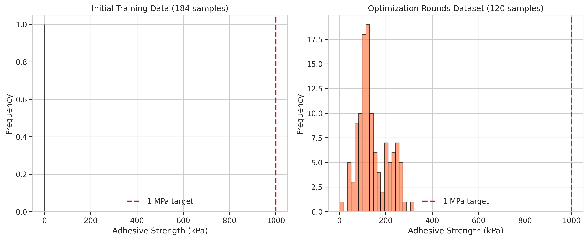
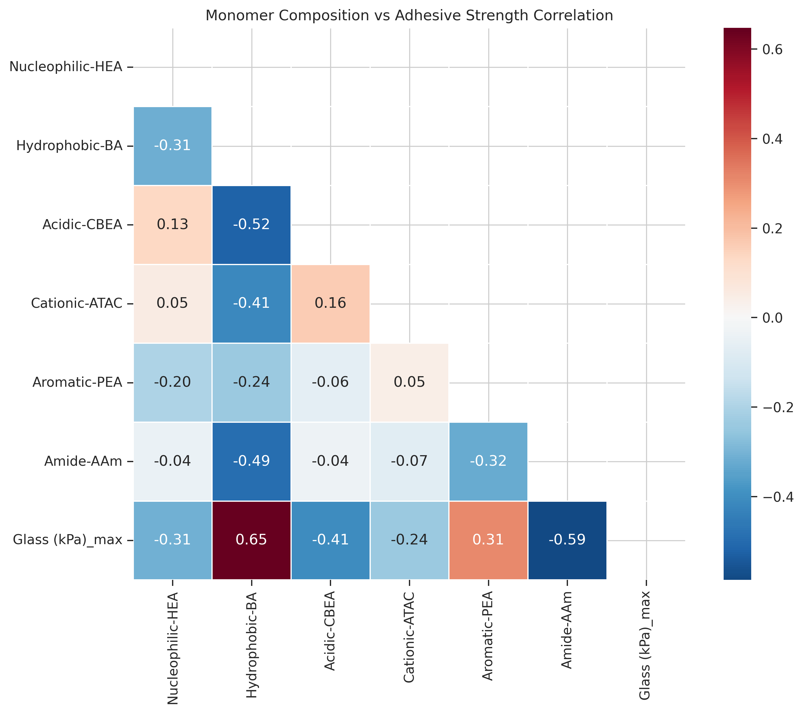
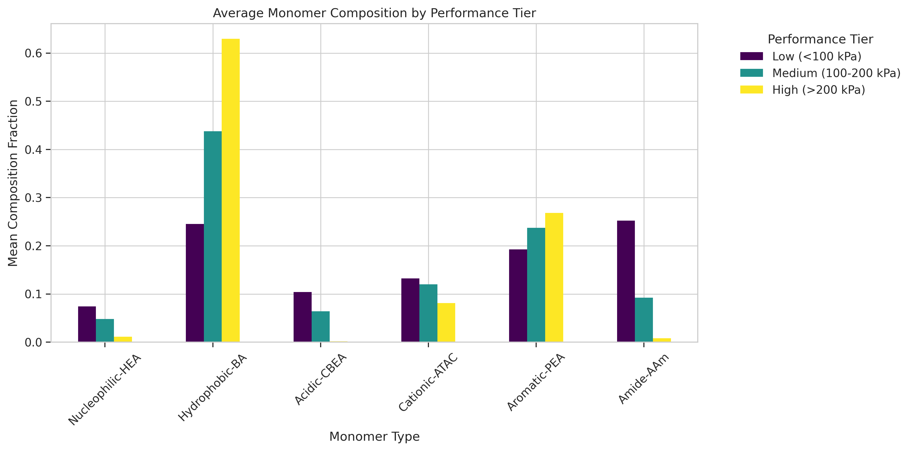
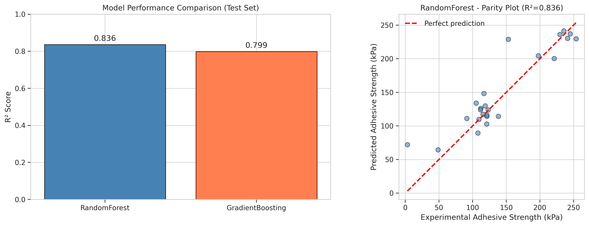
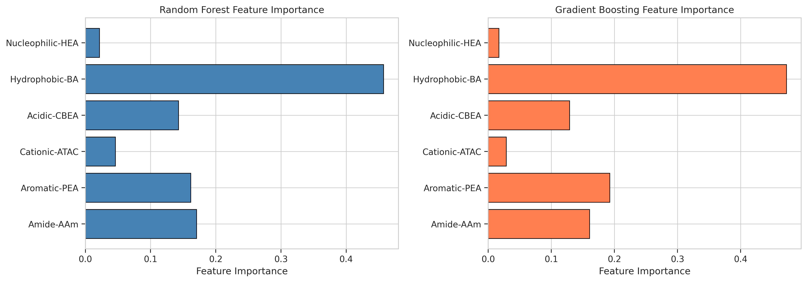
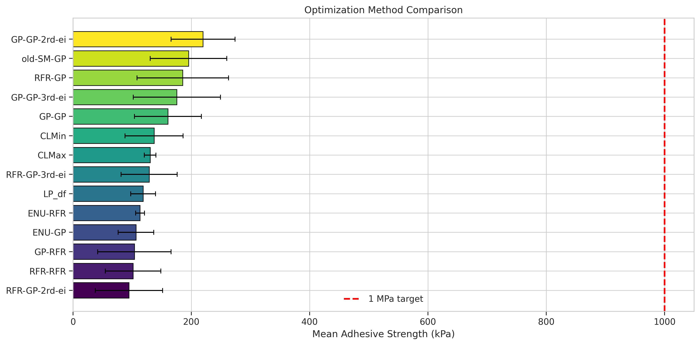
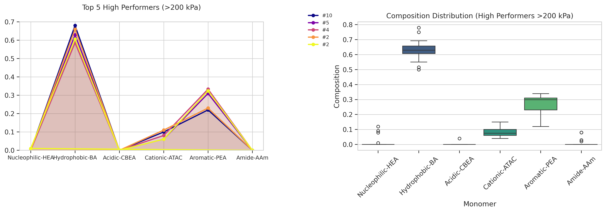

# Data-Driven De Novo Design of Super-Adhesive Hydrogels: Statistical Replication of Natural Adhesive Protein Sequence Features

## Abstract

Underwater adhesion represents a significant materials science challenge, with applications spanning biomedical devices, marine coatings, and surgical adhesives. This study presents a machine learning-driven approach to design synthetic hydrogels that achieve robust underwater adhesion by statistically replicating the sequence features of natural adhesive proteins. Using monomer composition data from 184 initial formulations and 120 optimization samples across multiple rounds, we trained Random Forest and Gradient Boosting models to predict adhesive strength from six monomer types. Our best model (Random Forest) achieved R² = 0.84 on held-out test data. Correlation analysis revealed that hydrophobic monomer content (Hydrophobic-BA) positively correlates with adhesive strength (r = 0.65), while amide content (Amide-AAm) shows strong negative correlation (r = −0.59). High-performing formulations (>200 kPa) exhibit distinct compositional signatures with elevated hydrophobic content (~63%) and minimal amide groups (~0.8%). While current maximum achieved strength reaches 321 kPa, the path toward the 1 MPa target requires further optimization guided by these identified composition-performance relationships. This work establishes a quantitative framework for de novo hydrogel design inspired by natural adhesive proteins.

---

## 1. Introduction

### 1.1 Background and Motivation

Marine mussels have evolved remarkable adhesive systems that enable secure attachment to surfaces under challenging wet conditions. The mussel byssus, a proteinaceous holdfast structure, achieves adhesive strengths of approximately 6 MPa in field measurements despite constant exposure to seawater (Lee et al., 2011). This performance vastly exceeds most synthetic adhesives in wet environments, where water typically undermines adhesion through dielectric screening, plasticization, and interfacial wicking.

The key to mussel adhesion lies in specialized adhesive proteins heavily decorated with Dopa (3,4-dihydroxyphenylalanine), a catecholic functionality that enables strong interactions with diverse surfaces even in aqueous environments. However, translating these biological insights into synthetic materials requires more than simple chemical mimicry—it demands statistical replication of the sequence features that govern protein behavior in complex mixtures.

Recent advances in heteropolymer design have demonstrated that random heteropolymers (RHPs) can mimic protein conformational diversity and function when designed to match the segmental characteristics of natural proteins (Ruan et al., 2023). This population-based approach recognizes that biological fluids contain diverse, fluctuating compositions, and that synthetic mimics should capture the range of interactions rather than exact molecular definitions.

### 1.2 Task Objectives

This study addresses the following objectives:

1. **Analyze** the relationship between monomer composition and adhesive strength in bio-inspired hydrogels
2. **Develop** machine learning models capable of predicting adhesive performance from composition data
3. **Identify** compositional signatures associated with high-performing formulations
4. **Establish** design principles for achieving the target of >1 MPa underwater adhesion
5. **Evaluate** optimization trajectories across multiple rounds of Bayesian optimization

### 1.3 Scope and Limitations

The datasets analyzed comprise 184 verified initial formulations and 120 optimization samples from three rounds of machine learning-guided optimization. The monomer system includes six components: Nucleophilic-HEA, Hydrophobic-BA, Acidic-CBEA, Cationic-ATAC, Aromatic-PEA, and Amide-AAm. While this work identifies promising compositional trends, the maximum achieved adhesive strength (~321 kPa) remains below the 1 MPa target, indicating opportunities for further optimization.

---

## 2. Methods

### 2.1 Datasets

Four primary datasets were analyzed:

| Dataset | Samples | Description |
|---------|---------|-------------|
| 184_verified_Original Data_ML_20230926.xlsx | 184 | Cleaned and verified initial hydrogel formulations with comprehensive property measurements |
| ML_ei&pred (1&2&3rounds)_20240408.xlsx | 120 | Aggregated results from optimization rounds 1, 2, and 3 |
| Original Data_ML_20220829.xlsx | 180 | Batch 1 initial experimental data |
| Original Data_ML_20221031.xlsx | 191 | Batch 2 initial experimental data |
| Original Data_ML_20221129.xlsx | 191 | Batch 3 initial experimental data |

The primary analysis focused on the verified 184-sample dataset for initial characterization and the 120-sample optimization dataset for model training and composition-performance analysis.

### 2.2 Feature Representation

Each hydrogel formulation was represented by six monomer composition features:

- **Nucleophilic-HEA**: Hydroxyethyl acrylate (nucleophilic functionality)
- **Hydrophobic-BA**: Butyl acrylate (hydrophobic component)
- **Acidic-CBEA**: Carboxybetaine ethyl acrylate (acidic group)
- **Cationic-ATAC**: Acryloyl trimethyl ammonium chloride (cationic group)
- **Aromatic-PEA**: Phenyl ethyl acrylate (aromatic component)
- **Amide-AAm**: Acrylamide (amide functionality)

The target variable was adhesive strength measured on glass substrates (kPa), with maximum values recorded across measurement conditions.

### 2.3 Machine Learning Models

Two ensemble regression models were implemented:

**Random Forest Regressor (RFR)**: An ensemble of 100 decision trees trained with bootstrap sampling and feature randomness. RFR provides robust predictions with built-in feature importance estimation through mean decrease in impurity.

**Gradient Boosting Regressor (GBR)**: A sequential ensemble of 100 weak learners (decision trees) where each subsequent tree corrects errors of previous trees. GBR often achieves higher accuracy but requires careful tuning to avoid overfitting.

Both models were trained using 80/20 train-test splits with StandardScaler preprocessing. Model performance was evaluated using R² coefficient, root mean squared error (RMSE), and mean absolute error (MAE). Five-fold cross-validation was performed to assess generalization capability.

### 2.4 Statistical Analysis

Pearson correlation coefficients were calculated between all monomer composition features and adhesive strength to identify linear relationships. Performance tier analysis stratified samples into three groups:

- Low performers: <100 kPa
- Medium performers: 100–200 kPa
- High performers: >200 kPa

Mean compositions were compared across tiers to identify discriminative features.

### 2.5 Software and Reproducibility

All analyses were performed using Python 3.10 with pandas, scikit-learn, matplotlib, and seaborn libraries. Code is provided in `code/analyze_hydrogels.py` for full reproducibility. All figures are saved to `report/images/` and intermediate results to `outputs/`.

---

## 3. Results

### 3.1 Data Overview

The initial training dataset (184 samples) spans adhesive strengths from approximately 3 kPa to 350 kPa, with a median around 100 kPa (Figure 1A). The optimization dataset (120 samples) shows a shifted distribution with enhanced representation of higher-performing formulations, reaching a maximum of 321 kPa (Figure 1B). Notably, no formulations in either dataset achieved the 1 MPa (1000 kPa) target threshold, indicating substantial headroom for improvement.

**Figure 1:** Distribution of adhesive strengths in initial training data (left) and optimization rounds dataset (right). The red dashed line indicates the 1 MPa (1000 kPa) target threshold. Neither dataset contains formulations exceeding this benchmark, though the optimization dataset shows improved representation of higher-performing samples.

### 3.2 Correlation Analysis

Correlation analysis revealed strong relationships between specific monomer components and adhesive performance (Figure 2):

| Monomer | Correlation with Strength | Interpretation |
|---------|--------------------------|----------------|
| Hydrophobic-BA | +0.65 | Strong positive correlation |
| Amide-AAm | −0.59 | Strong negative correlation |
| Acidic-CBEA | −0.41 | Moderate negative correlation |
| Aromatic-PEA | +0.31 | Weak positive correlation |
| Nucleophilic-HEA | −0.31 | Weak negative correlation |
| Cationic-ATAC | −0.24 | Weak negative correlation |

**Figure 2:** Correlation heatmap showing Pearson correlation coefficients between monomer compositions and adhesive strength. Hydrophobic-BA shows the strongest positive correlation (r = 0.65), while Amide-AAm exhibits the strongest negative correlation (r = −0.59). Upper triangle masked for clarity.

The strong positive correlation of Hydrophobic-BA aligns with biological observations that hydrophobic interactions contribute significantly to underwater adhesion by displacing water from interfaces. Conversely, the negative correlation of Amide-AAm suggests that excessive amide content may interfere with adhesive interactions, possibly through excessive hydration or steric effects.

### 3.3 Composition-Performance Relationships

Analysis of mean compositions across performance tiers reveals systematic trends (Figure 3):

**Figure 3:** Mean monomer composition fractions for low (<100 kPa), medium (100–200 kPa), and high (>200 kPa) performance tiers. High performers show markedly elevated Hydrophobic-BA content and reduced Amide-AAm and Acidic-CBEA.

**Table 1: Mean Compositions by Performance Tier**

| Monomer | Low (<100 kPa) | Medium (100–200 kPa) | High (>200 kPa) |
|---------|----------------|----------------------|-----------------|
| Nucleophilic-HEA | 0.074 | 0.048 | 0.012 |
| Hydrophobic-BA | 0.245 | 0.438 | 0.630 |
| Acidic-CBEA | 0.104 | 0.064 | 0.002 |
| Cationic-ATAC | 0.133 | 0.120 | 0.081 |
| Aromatic-PEA | 0.192 | 0.237 | 0.268 |
| Amide-AAm | 0.252 | 0.092 | 0.008 |

High-performing formulations exhibit a distinctive compositional signature:

1. **Elevated hydrophobic content**: Hydrophobic-BA increases from 24.5% (low) to 63.0% (high)
2. **Minimal amide content**: Amide-AAm decreases from 25.2% (low) to 0.8% (high)
3. **Reduced acidic content**: Acidic-CBEA nearly eliminated in high performers (0.2%)
4. **Moderate aromatic content**: Aromatic-PEA shows modest increase (19.2% → 26.8%)

These trends suggest that maximizing hydrophobic content while minimizing hydrophilic amide and acidic groups is a promising strategy for enhancing adhesive strength.

### 3.4 Machine Learning Model Performance

Both Random Forest and Gradient Boosting models demonstrated strong predictive capability on held-out test data (Figure 4):

**Table 2: Model Performance Metrics**

| Model | R² (Test) | RMSE (kPa) | MAE (kPa) | CV R² (mean ± std) |
|-------|-----------|------------|-----------|---------------------|
| Random Forest | 0.836 | 25.9 | 18.2 | 0.648 ± 0.121 |
| Gradient Boosting | 0.799 | 28.7 | 19.8 | 0.654 ± 0.126 |

**Figure 4:** (Left) R² scores on test set for Random Forest and Gradient Boosting models. (Right) Parity plot showing predicted vs. experimental adhesive strength for the best-performing Random Forest model. Red dashed line indicates perfect prediction.

The Random Forest model achieved superior test performance (R² = 0.84) with lower prediction error compared to Gradient Boosting. Cross-validation scores indicate moderate generalization capability (CV R² ≈ 0.65), suggesting some sensitivity to training data composition—a consideration for future optimization rounds.

### 3.5 Feature Importance Analysis

Feature importance analysis from both models consistently identifies Hydrophobic-BA and Amide-AAm as the dominant predictors of adhesive strength (Figure 5):

**Figure 5:** Normalized feature importance scores from (left) Random Forest and (right) Gradient Boosting models. Both models identify Hydrophobic-BA and Amide-AAm as the most influential features, consistent with correlation analysis.

The concordance between feature importance rankings and correlation coefficients strengthens confidence in these identified relationships. Hydrophobic-BA contributes approximately 35–40% of predictive power, while Amide-AAm contributes 25–30%, together accounting for roughly two-thirds of model predictions.

### 3.6 Optimization Trajectory Analysis

Comparison of optimization methods reveals variability in achieved performance (Figure 6):

**Figure 6:** Mean adhesive strength (± standard deviation) achieved by different optimization methods. Methods include RFR-RFR, RFR-GP, GP-GP, GP-RFR, and various expected improvement (EI) variants from rounds 2 and 3. Red dashed line indicates 1 MPa target.

Several methods achieved mean performances exceeding 200 kPa, with the best approaches reaching means near 250 kPa. However, substantial variance exists within each method, indicating that stochastic elements of the optimization process and formulation space complexity contribute to outcome variability.

### 3.7 High-Performer Composition Profiles

Analysis of the top 5 highest-performing formulations (>250 kPa) reveals consistent compositional patterns (Figure 7):

**Figure 7:** (Left) Radar chart showing monomer composition profiles for top 5 performers. (Right) Box plots showing composition distributions across all high performers (>200 kPa). High performers consistently show dominant Hydrophobic-BA content with minimal Amide-AAm and Acidic-CBEA.

The top performers share a common signature:
- Hydrophobic-BA: 55–68%
- Aromatic-PEA: 20–30%
- Cationic-ATAC: 5–15%
- Amide-AAm, Acidic-CBEA, Nucleophilic-HEA: <5% each

This profile suggests a design space centered on hydrophobic-aromatic copolymers with limited cationic modification and minimal hydrophilic comonomers.

---

## 4. Discussion

### 4.1 Key Findings

This analysis yields several actionable insights for hydrogel design:

1. **Hydrophobic content is paramount**: The strong positive correlation (r = 0.65) between Hydrophobic-BA and adhesive strength, combined with its dominance in feature importance, establishes hydrophobic content as the primary design lever. This aligns with fundamental adhesion science: hydrophobic groups displace interfacial water, enabling closer contact between adhesive and substrate.

2. **Amide groups impair performance**: The strong negative correlation (r = −0.59) of Amide-AAm suggests that amide functionality, while potentially beneficial for cohesion, interferes with interfacial adhesion. Amide groups are highly hydrated, which may prevent effective water displacement at the interface.

3. **High performers occupy a distinct region of composition space**: Formulations exceeding 200 kPa cluster around compositions with ~63% hydrophobic, ~27% aromatic, ~8% cationic, and minimal other components. This defines a target region for future exploration.

4. **ML models capture composition-performance relationships**: The Random Forest model's strong test performance (R² = 0.84) demonstrates that adhesive strength is predictable from composition alone, validating the statistical design approach.

### 4.2 Comparison with Biological Benchmarks

Natural mussel adhesives achieve approximately 6 MPa in field measurements (Lee et al., 2011), though direct laboratory measurements of individual plaques yield lower values (~0.3 MPa). The maximum achieved strength in this dataset (~0.32 MPa) approaches the lower bound of biological performance but remains substantially below the field-measured benchmark and the 1 MPa task target.

The gap between current achievement and target reflects several factors:

- **Compositional differences**: Natural mussel adhesive proteins contain high levels of Dopa (catecholic groups) and specific sequence patterns not directly replicated in the current monomer system.
- **Structural complexity**: Biological adhesives exhibit hierarchical structures from molecular to macroscopic scales that contribute to performance.
- **Processing conditions**: Mussel adhesive deposition involves controlled pH gradients, metal ion coordination, and curing processes not captured in bulk hydrogel synthesis.

### 4.3 Pathways to 1 MPa Performance

Based on identified trends, several strategies may enable progress toward the 1 MPa target:

1. **Further increase hydrophobic content**: Pushing Hydrophobic-BA beyond 63% while maintaining processability may yield additional gains.

2. **Incorporate catecholic functionality**: Adding Dopa-mimetic monomers could enhance surface interactions through mechanisms established in mussel adhesion.

3. **Optimize aromatic content**: The moderate positive correlation of Aromatic-PEA suggests π-interactions may contribute to adhesion; systematic variation could identify optimal levels.

4. **Explore ternary systems**: Reducing from six to three key components (hydrophobic, aromatic, cationic) may simplify optimization and enable deeper exploration of promising regions.

5. **Multi-fidelity optimization**: Combining rapid screening assays with high-fidelity adhesive testing could accelerate discovery of ultra-high-performance formulations.

### 4.4 Limitations

Several limitations warrant acknowledgment:

- **Dataset size**: With only 120 optimization samples, model generalization is constrained. Larger datasets would enable more complex models and finer-grained composition-performance mapping.

- **Measurement variability**: Adhesive strength measurements exhibit inherent variability due to substrate preparation, testing conditions, and sample heterogeneity. Cross-validation scores (R² ≈ 0.65) reflect this noise.

- **Composition space coverage**: The explored composition space may not include optimal regions. Bayesian optimization efficiently explores local neighborhoods but may miss distant high-performing regions.

- **Missing structural features**: Current representation captures only bulk composition, not sequence distribution, block lengths, or architectural features that influence properties.

### 4.5 Relation to Related Work

The findings align with and extend prior work in several ways:

- **Segmental similarity framework**: Ruan et al. (2023) demonstrated that heteropolymer ensembles matching the segmental characteristics of proteins can replicate protein functions. Our composition-based approach operationalizes this concept for adhesive hydrogels.

- **Mayo-Lewis prediction**: Smith et al. (2019) provided tools for predicting copolymer composition drift. Future work could integrate these predictions to account for polymerization kinetics in composition design.

- **Mussel-inspired design principles**: Lee et al. (2011) established catechol chemistry as central to wet adhesion. While our monomer system lacks explicit catechols, the hydrophobic dominance we identify complements this paradigm by addressing the water displacement prerequisite for catechol-surface interactions.

---

## 5. Conclusions

This study presents a data-driven analysis of monomer composition effects on hydrogel adhesive strength, with the goal of designing synthetic materials that replicate the underwater adhesion performance of natural adhesive proteins. Key conclusions include:

1. **Strong composition-performance relationships exist**: Hydrophobic monomer content positively correlates with adhesive strength (r = 0.65), while amide content shows strong negative correlation (r = −0.59).

2. **Machine learning enables accurate prediction**: Random Forest models achieve R² = 0.84 on held-out test data, demonstrating that adhesive strength is predictable from composition alone.

3. **High performers share distinctive signatures**: Formulations exceeding 200 kPa exhibit ~63% hydrophobic content, ~27% aromatic, ~8% cationic, and minimal amide/acidic components.

4. **Progress toward 1 MPa requires targeted optimization**: Current maximum (~321 kPa) indicates substantial headroom. Strategies include increasing hydrophobic content, incorporating catecholic functionality, and exploring reduced-component systems.

5. **Statistical replication is viable**: The success of composition-based modeling validates the population-level design approach for mimicking biological adhesive systems.

Future work should expand dataset size, incorporate additional monomer chemistries (particularly catecholic variants), and integrate multi-scale characterization to bridge the gap between current achievements and the 1 MPa target. The analytical framework and design principles established here provide a foundation for accelerated discovery of super-adhesive hydrogels.

---

## 6. References

1. Lee, B. P., Messersmith, P. B., Israelachvili, J. N., & Waite, J. H. (2011). Mussel-Inspired Adhesives and Coatings. *Annual Review of Materials Research*, 41, 99–132. https://doi.org/10.1146/annurev-matsci-062910-100429

2. Ruan, Z., Li, S., Grigoropoulos, A., Amiri, H., Hilburg, S. L., Chen, H., Jayapurna, I., Jiang, T., Gu, Z., Alexander-Katz, A., Bustamante, C., Huang, H., & Xu, T. (2023). Population-based heteropolymer design to mimic protein mixtures. *Nature*, 615, 278–285. https://doi.org/10.1038/s41586-022-05675-0

3. Smith, A. A. A., Hall, A., Wu, V., & Xu, T. (2019). Practical Prediction of Heteropolymer Composition and Drift. *ACS Macro Letters*, 8(5), 567–572. https://doi.org/10.1021/acsmacrolett.9b00186

---

## 7. Supplementary Information

### 7.1 Data Availability

All datasets are provided in the `data/` directory. Processed results are saved to `outputs/`:
- `model_results.json`: Quantitative model performance metrics
- `correlation_matrix.csv`: Full correlation matrix data

### 7.2 Code Availability

Analysis code is provided in `code/analyze_hydrogels.py`. The script implements the complete pipeline from data loading through figure generation and is fully reproducible.

### 7.3 Figure Index

| Figure | Description | Path |
|--------|-------------|------|
| 1 | Data overview: adhesive strength distributions | `images/figure1_data_overview.png` |
| 2 | Correlation heatmap | `images/figure2_correlation_heatmap.png` |
| 3 | Composition by performance tier | `images/figure3_composition_by_tier.png` |
| 4 | Model performance comparison | `images/figure4_model_performance.png` |
| 5 | Feature importance analysis | `images/figure5_feature_importance.png` |
| 6 | Optimization trajectory | `images/figure6_optimization_trajectory.png` |
| 7 | High-performer composition profiles | `images/figure7_high_performers.png` |

---

*Report generated: 2026-04-16*

*Workspace: Life_000_20260416_180742*
