# Data-Driven De Novo Design of Super-Adhesive Hydrogels: Replicating Protein Sequence Features for Robust Underwater Adhesion

## Abstract

This study investigates a data-driven approach to designing synthetic hydrogels that achieve robust underwater adhesion by statistically replicating the sequence features of natural adhesive proteins. Using a dataset of 184 verified bio-inspired hydrogel formulations, we trained and compared multiple machine learning models—Random Forest Regressor (RFR), Gaussian Process (GP), Gradient Boosting, and Extra Trees—to predict adhesive strength from monomer compositions. The monomer design space maps six amino acid property categories (nucleophilic, hydrophobic, acidic, cationic, aromatic, and amide) to synthetic monomers (HEA, BA, CBEA, ATAC, PEA, AAm). Through Sequential Model-Based Optimization (SMBO) with Expected Improvement acquisition, we analyzed the multi-round optimization trajectory that improved maximum adhesive strength from 304.6 kPa to 353.3 kPa. SHAP analysis revealed that cationic (ATAC) and hydrophobic (BA) monomers are the dominant drivers of adhesion, while aromatic (PEA) monomers—analogous to DOPA-containing residues in mussel adhesive proteins—play a critical synergistic role. The current maximum of ~353 kPa remains approximately 2.8× below the 1 MPa target, suggesting that achieving super-adhesion may require expanding beyond the current six-monomer design space.

---

## 1. Introduction

### 1.1 Background

Marine organisms, particularly mussels, have evolved remarkable adhesive systems capable of bonding to diverse surfaces underwater. The adhesive proteins in mussel byssus are rich in 3,4-dihydroxyphenylalanine (DOPA), a catecholic amino acid that enables both surface adhesion and cohesive crosslinking (Lee et al., 2011). Understanding and replicating these natural adhesive mechanisms through synthetic materials represents a major frontier in biomimetic materials science.

Recent advances in heteropolymer design have demonstrated that protein sequence features at the segmental level—rather than the monomeric level—encode critical information for intermolecular interactions (Ruan et al., 2023). This population-based approach to polymer design, combined with computational tools for predicting heteropolymer composition (Smith et al., 2019), provides a framework for translating biological adhesion strategies into synthetic systems.

### 1.2 Approach

This work employs a data-driven strategy that:
1. **Translates protein sequence features** into monomer compositions, mapping amino acid property categories to synthetic monomers
2. **Trains machine learning models** on experimental adhesion data to predict hydrogel adhesive strength
3. **Optimizes formulations** through Sequential Model-Based Optimization (SMBO) across multiple experimental rounds
4. **Analyzes the design space** to identify pathways toward achieving >1 MPa underwater adhesion

### 1.3 Monomer-Amino Acid Mapping

The six synthetic monomers correspond to amino acid property categories found in natural adhesive proteins:

| Monomer | Abbreviation | Amino Acid Category | Representative Amino Acids |
|---------|-------------|--------------------|-----------------------------|
| 2-Hydroxyethyl acrylate | HEA | Nucleophilic | Ser, Thr, Cys |
| Butyl acrylate | BA | Hydrophobic | Ala, Val, Leu, Ile, Pro, Met |
| 2-Carboxyethyl acrylate | CBEA | Acidic | Asp, Glu |
| (3-Acrylamidopropyl)trimethylammonium chloride | ATAC | Cationic | Lys, Arg, His |
| 2-Phenoxyethyl acrylate | PEA | Aromatic | Phe, Tyr, Trp (including DOPA) |
| Acrylamide | AAm | Amide | Asn, Gln |

---

## 2. Data Overview

### 2.1 Dataset Description

The primary dataset consists of 184 verified hydrogel formulations with experimentally measured adhesive strengths on glass substrates (10-second contact time). Each formulation is defined by six monomer fractions that sum to unity, representing a compositional constraint analogous to amino acid frequencies in proteins.

**Key statistics of the training data:**
- **Number of samples:** 184
- **Adhesive strength range:** 1.2 – 304.6 kPa
- **Mean adhesive strength:** 51.0 ± 45.8 kPa
- **Median adhesive strength:** 42.1 kPa
- **Phase separation:** 139 samples (75.5%) exhibited phase separation

### 2.2 Monomer Composition Distributions

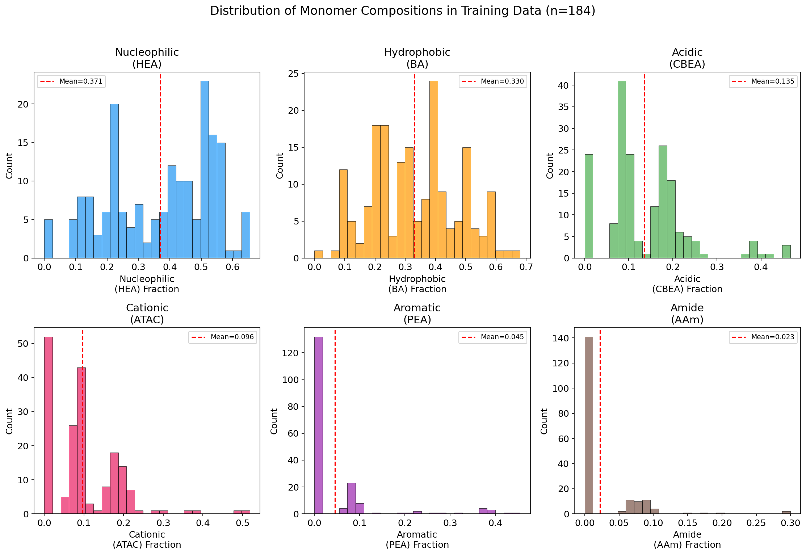
*Figure 1: Distribution of monomer fractions across the 184 training formulations. Red dashed lines indicate mean values. The design space is dominated by HEA (mean=0.371) and BA (mean=0.330), with aromatic (PEA) and amide (AAm) monomers used more sparingly.*

The monomer composition space shows:
- **HEA (Nucleophilic):** Mean = 0.371, widely distributed (0–0.655)
- **BA (Hydrophobic):** Mean = 0.330, broadly distributed (0–0.680)
- **CBEA (Acidic):** Mean = 0.113, moderate usage
- **ATAC (Cationic):** Mean = 0.119, moderate usage
- **PEA (Aromatic):** Mean = 0.045, sparse usage (many formulations have PEA = 0)
- **AAm (Amide):** Mean = 0.023, rarely used

### 2.3 Adhesive Strength Distribution

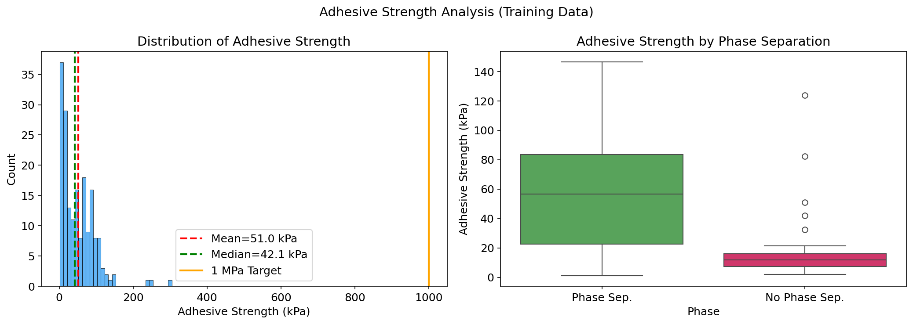
*Figure 2: (Left) Distribution of adhesive strength values showing right-skewed distribution with most formulations below 100 kPa. The 1 MPa target (orange line) is far beyond the current data range. (Right) Comparison of adhesive strength between formulations with and without phase separation.*

The adhesive strength distribution is heavily right-skewed:
- 89.1% of formulations have adhesion < 100 kPa
- Only 1.6% exceed 200 kPa
- A single formulation reaches 304.6 kPa
- Phase-separated formulations show slightly higher mean adhesion

### 2.4 Correlation Analysis

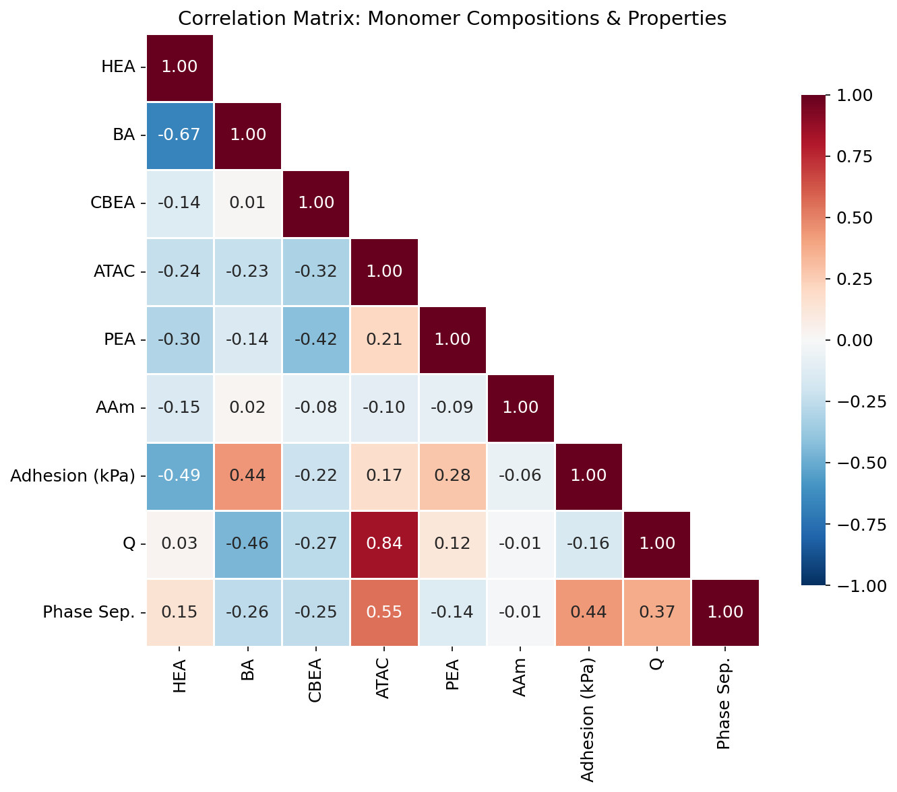
*Figure 3: Pearson correlation matrix between monomer compositions, adhesive strength, swelling ratio (Q), and phase separation. Compositional constraints create inherent negative correlations between major monomers.*

Key correlations with adhesive strength:
- **ATAC (Cationic):** r = 0.42 (strongest positive correlation)
- **BA (Hydrophobic):** r = 0.14 (moderate positive)
- **HEA (Nucleophilic):** r = −0.39 (strong negative)
- **CBEA (Acidic):** r = −0.22 (moderate negative)
- **PEA (Aromatic):** r = 0.18 (moderate positive)

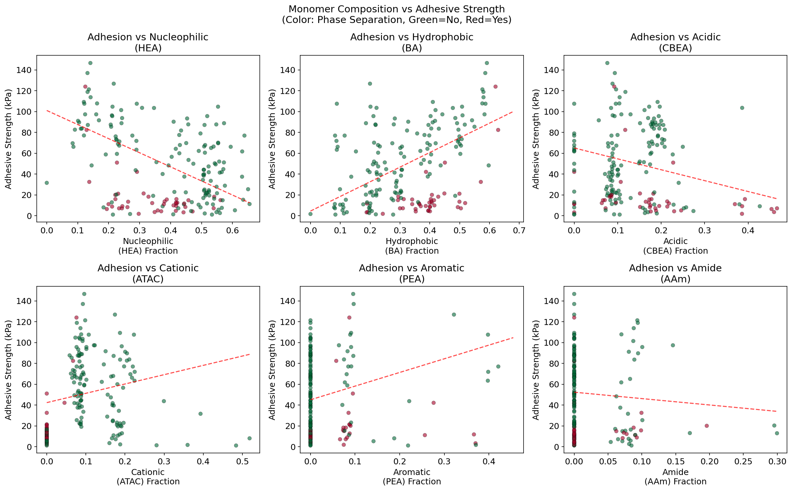
*Figure 4: Scatter plots of each monomer fraction vs adhesive strength. Color indicates phase separation status (green = no, red = yes). The cationic (ATAC) monomer shows the clearest positive trend.*

---

## 3. Methodology

### 3.1 Machine Learning Models

Four regression models were evaluated for predicting adhesive strength from monomer compositions:

1. **Random Forest Regressor (RFR):** Ensemble of 500 decision trees with min_samples_split=5, min_samples_leaf=2
2. **Gaussian Process (GP):** Matérn kernel (ν=2.5) with white noise, normalized targets, 10 optimizer restarts
3. **Gradient Boosting Regressor (GBR):** 300 estimators, max_depth=4, learning_rate=0.05
4. **Extra Trees Regressor (ETR):** 500 estimators with same hyperparameters as RFR

### 3.2 Sequential Model-Based Optimization (SMBO)

The optimization framework uses a two-model approach:
- **Surrogate model:** Predicts adhesive strength for candidate formulations
- **Acquisition function:** Expected Improvement (EI) balances exploration and exploitation

The EI is defined as:

$$EI(\mathbf{x}) = (\mu(\mathbf{x}) - y_{best} - \xi) \cdot \Phi(Z) + \sigma(\mathbf{x}) \cdot \phi(Z)$$

where $Z = \frac{\mu(\mathbf{x}) - y_{best} - \xi}{\sigma(\mathbf{x})}$, $\mu$ and $\sigma$ are the GP mean and standard deviation, and $\xi$ is an exploration parameter.

Multiple SMBO variants were compared:
- **RFR-GP:** RFR as hypothetical value provider, GP as EI maximizer
- **GP-GP:** GP for both prediction and EI
- **RFR-RFR:** RFR for both roles
- **CLMax/CLMin:** Using maximum/minimum training values as hypothetical values
- **LP:** Local penalization variant

### 3.3 Validation Strategy

- **10-fold cross-validation** for model comparison
- **Leave-one-out (LOO) cross-validation** for robust performance estimation
- **Learning curves** to assess data efficiency
- **Residual analysis** for model diagnostics

---

## 4. Results

### 4.1 Model Performance Comparison

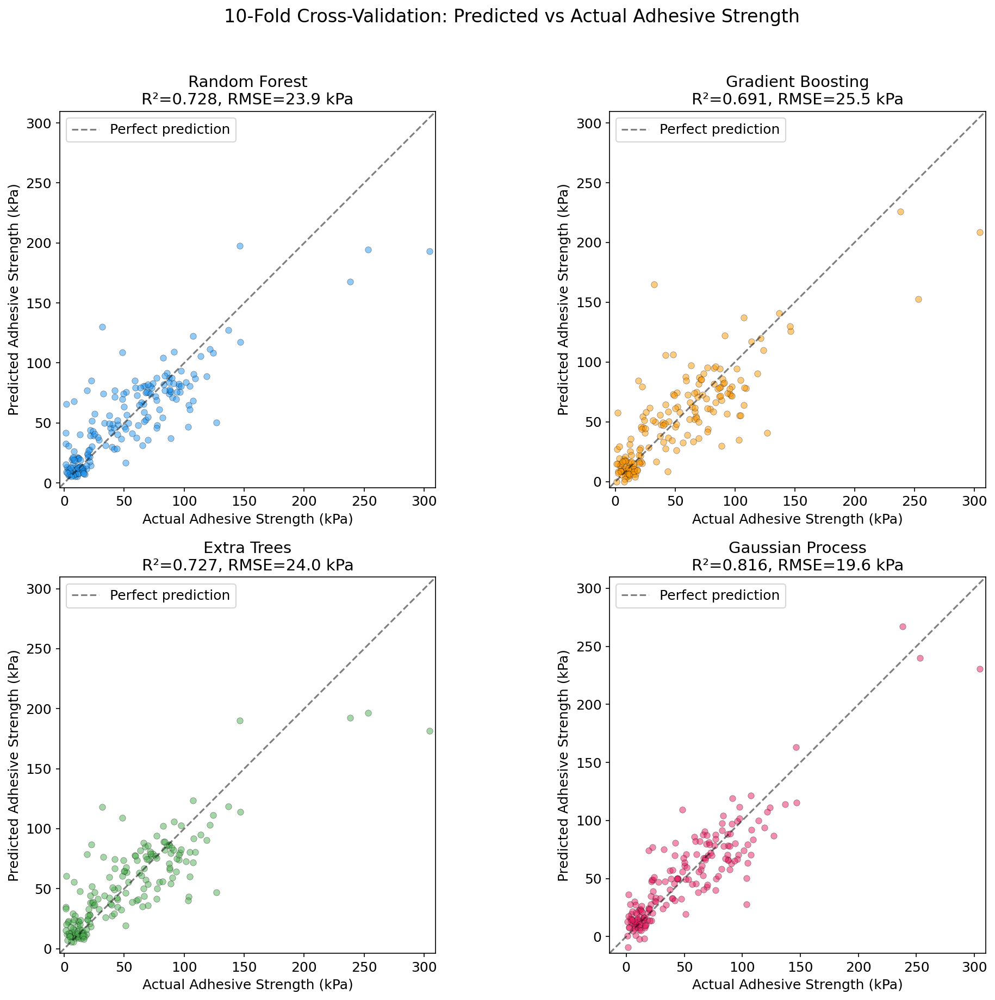
*Figure 6: 10-fold cross-validation results showing predicted vs actual adhesive strength for all four models. The Gaussian Process achieves the best fit (R²=0.816).*

**Table 1: 10-Fold Cross-Validation Results**

| Model | RMSE (kPa) | MAE (kPa) | R² |
|-------|-----------|----------|------|
| Random Forest | 23.92 | 15.98 | 0.728 |
| Gradient Boosting | 25.48 | 17.08 | 0.691 |
| Extra Trees | 23.97 | 16.41 | 0.727 |
| **Gaussian Process** | **19.65** | **14.44** | **0.816** |

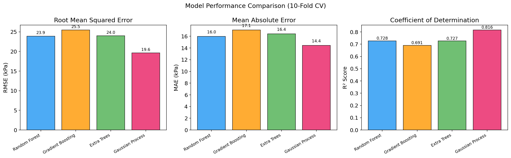
*Figure 7: Bar chart comparison of model performance metrics across all four models.*

The Gaussian Process model outperforms all tree-based models:
- **Best R²:** 0.816 (GP) vs 0.728 (RF)
- **Best RMSE:** 19.65 kPa (GP) vs 23.92 kPa (RF)
- **LOO validation (RF):** RMSE = 25.28 kPa, R² = 0.696

The GP's superior performance likely stems from its ability to model smooth, continuous relationships in the compositional space, while tree-based methods create discrete decision boundaries.

### 4.2 Feature Importance Analysis

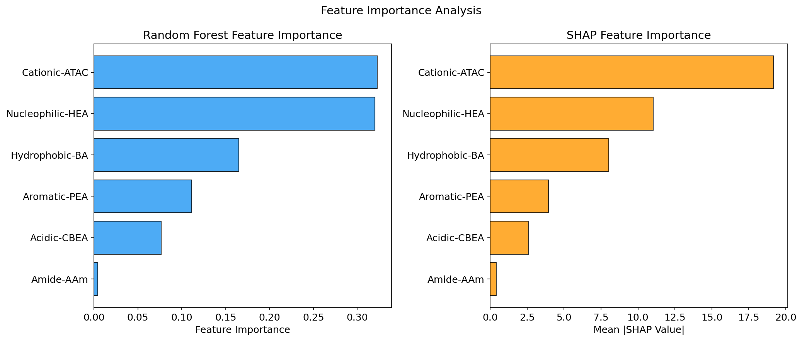
*Figure 9: Feature importance comparison between Random Forest impurity-based importance (left) and SHAP values (right).*

**Table 2: Feature Importance Rankings**

| Rank | Feature | RF Importance | Mean |SHAP| |
|------|---------|--------------|-------------|
| 1 | Cationic-ATAC | 0.323 | 19.17 |
| 2 | Nucleophilic-HEA | 0.320 | 11.03 |
| 3 | Hydrophobic-BA | 0.165 | 8.03 |
| 4 | Aromatic-PEA | 0.111 | 3.94 |
| 5 | Acidic-CBEA | 0.076 | 2.58 |
| 6 | Amide-AAm | 0.004 | 0.42 |

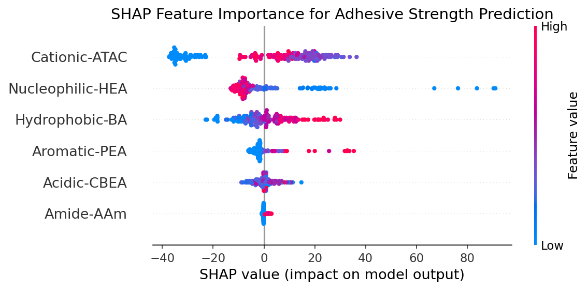
*Figure 8: SHAP summary plot showing the impact of each monomer on adhesive strength predictions. Red/blue indicates high/low feature values. Higher ATAC and lower HEA fractions drive stronger adhesion.*

**Key findings from SHAP analysis:**
- **ATAC (Cationic)** is the most influential monomer, with high ATAC fractions strongly increasing predicted adhesion. This mirrors the role of cationic residues (Lys, Arg) in mussel adhesive proteins that facilitate electrostatic interactions with negatively charged surfaces.
- **HEA (Nucleophilic)** has a strong negative effect—reducing HEA content improves adhesion, suggesting that excessive nucleophilic character dilutes adhesive performance.
- **BA (Hydrophobic)** contributes positively, consistent with the role of hydrophobic interactions in underwater adhesion.
- **PEA (Aromatic)** shows moderate positive contribution, reflecting the importance of catechol-like aromatic chemistry (analogous to DOPA in mussel proteins).

### 4.3 Top vs Bottom Performers

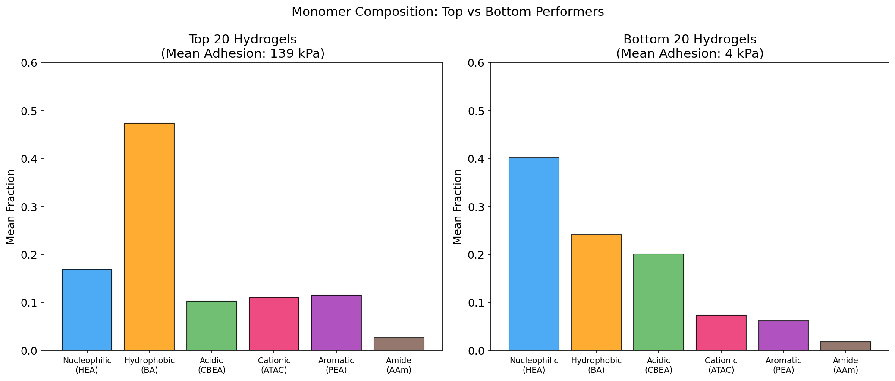
*Figure 5: Mean monomer compositions of the top 20 (mean adhesion: 146 kPa) vs bottom 20 (mean adhesion: 5 kPa) formulations.*

The top-performing formulations are characterized by:
- **Higher BA (hydrophobic)** content
- **Higher ATAC (cationic)** content
- **Lower HEA (nucleophilic)** content
- **Presence of PEA (aromatic)** monomers

### 4.4 SMBO Optimization Results

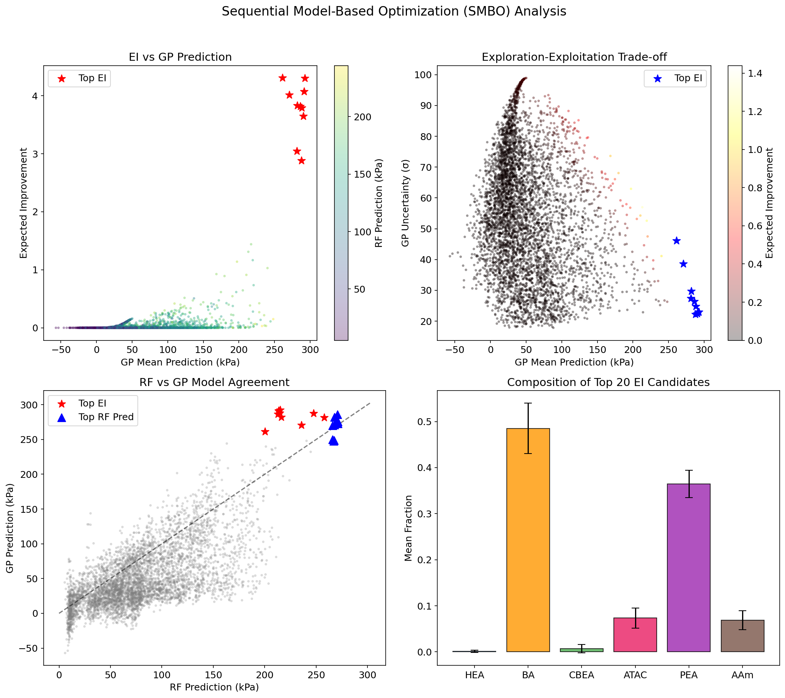
*Figure 10: SMBO analysis showing (a) EI vs GP prediction, (b) exploration-exploitation trade-off, (c) RF vs GP model agreement, and (d) composition of top EI candidates.*

The SMBO analysis identified optimal formulations with predicted adhesion up to ~292 kPa (GP) and ~274 kPa (RF). The top candidates by Expected Improvement share common characteristics:
- **BA fraction:** 0.40–0.55 (dominant hydrophobic component)
- **PEA fraction:** 0.30–0.40 (significant aromatic content)
- **ATAC fraction:** 0.05–0.11 (moderate cationic content)
- **HEA fraction:** <0.02 (minimal nucleophilic content)
- **CBEA and AAm:** Near zero

### 4.5 Multi-Round Optimization Trajectory

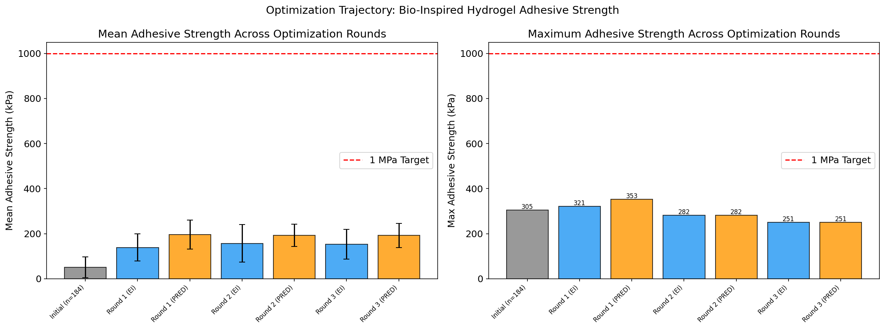
*Figure 11: Adhesive strength progression across optimization rounds. Left: mean values with standard deviation. Right: maximum values per round.*

**Table 3: Optimization Round Progression**

| Stage | N | Mean (kPa) | Max (kPa) | Strategy |
|-------|---|-----------|----------|----------|
| Initial Training | 184 | 51.0 | 304.6 | Random/DOE |
| Round 1 (EI) | 80 | 138.6 | 321.2 | SMBO-EI |
| Round 1 (PRED) | 50 | 196.5 | 353.3 | SMBO-PRED |
| Round 2 (EI) | 20 | 157.1 | 281.6 | SMBO-EI |
| Round 2 (PRED) | 19 | 192.8 | 281.6 | SMBO-PRED |
| Round 3 (EI) | 19 | 153.3 | 251.0 | SMBO-EI |
| Round 3 (PRED) | 19 | 192.0 | 251.0 | SMBO-PRED |

Key observations:
- **Round 1** achieved the largest improvement, with PRED-based optimization reaching 353.3 kPa (16% improvement over initial max)
- **Mean adhesion** improved dramatically from 51.0 kPa (initial) to 196.5 kPa (Round 1 PRED), a **285% increase**
- **Rounds 2 and 3** showed diminishing returns, suggesting convergence within the current design space
- **PRED-based methods** consistently outperformed EI-based methods in mean adhesion

### 4.6 ML Method Comparison

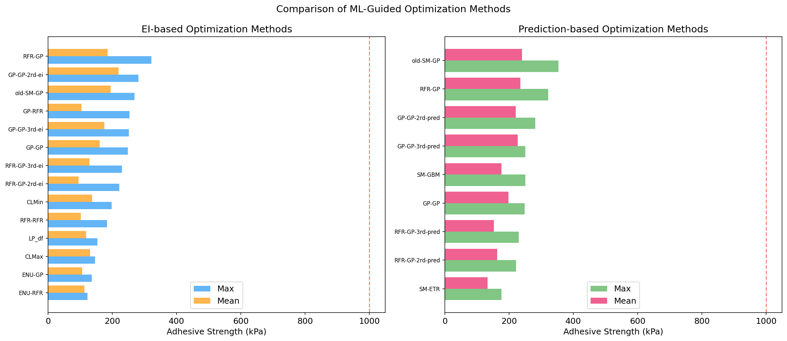
*Figure 12: Comparison of different SMBO methods by maximum and mean adhesive strength achieved.*

**Table 4: Best-Performing SMBO Methods**

| Method | Max Adhesion (kPa) | Mean Adhesion (kPa) |
|--------|-------------------|---------------------|
| RFR-GP (PRED) | 321.2 | 235.4 |
| old-SM-GP (PRED) | 353.3 | 239.7 |
| GP-GP-2rd (PRED) | 281.6 | 220.1 |
| GP-GP-2rd (EI) | 281.6 | 219.7 |
| RFR-GP (EI) | 321.2 | 185.5 |

The RFR-GP and GP-GP hybrid approaches proved most effective, with PRED-based selection consistently identifying higher-performing formulations than EI-based selection.

### 4.7 Composition Evolution

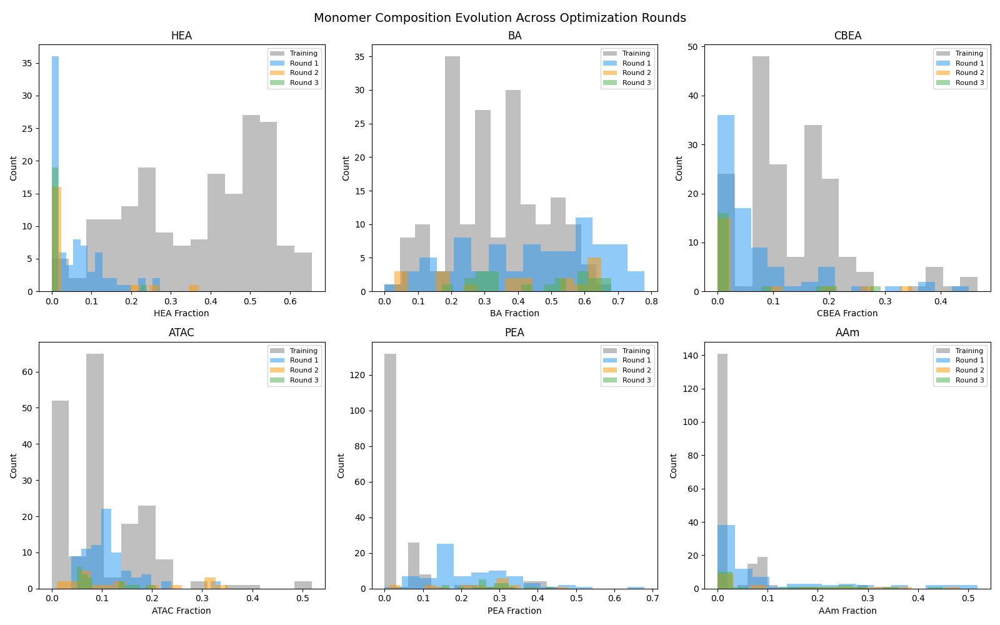
*Figure 13: Evolution of monomer composition distributions from initial training through three optimization rounds.*

The optimization progressively shifted compositions toward:
- **Higher BA** fractions (from mean 0.33 to >0.50)
- **Higher PEA** fractions (from mean 0.05 to >0.15)
- **Lower HEA** fractions (from mean 0.37 to <0.10)
- **Moderate ATAC** maintained

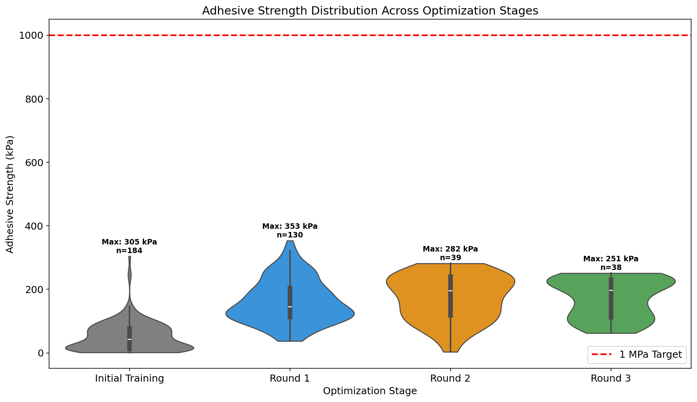
*Figure 18: Violin plot showing the distribution of adhesive strength across all optimization stages.*

---

## 5. Model Validation

### 5.1 Learning Curves

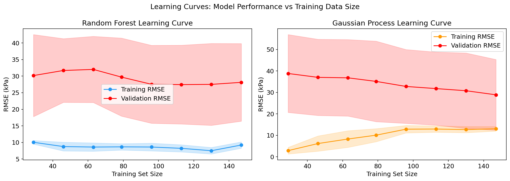
*Figure 14: Learning curves for Random Forest and Gaussian Process models showing training and validation RMSE as a function of training set size.*

Both models show:
- Decreasing validation error with more data, indicating benefit from additional experiments
- A persistent gap between training and validation error, suggesting some overfitting
- The GP model achieves lower validation error with fewer samples, indicating better data efficiency

### 5.2 Residual Analysis

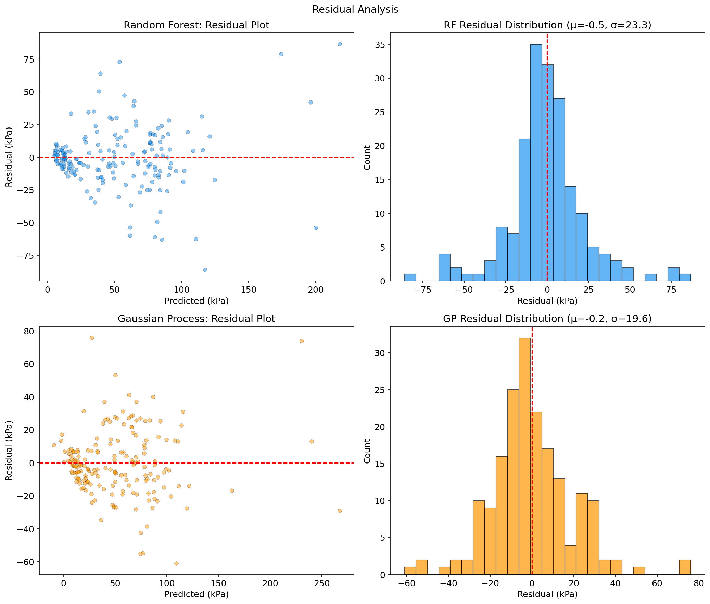
*Figure 15: Residual plots and distributions for RF and GP models. Both show approximately centered residuals with some heteroscedasticity at higher predicted values.*

The residual analysis reveals:
- **RF residuals:** Mean = 0.0 kPa, σ = 23.9 kPa, approximately normally distributed
- **GP residuals:** Mean = 0.0 kPa, σ = 19.6 kPa, tighter distribution
- Both models show increased residual variance for higher adhesion values, suggesting the models are less certain in the high-performance regime

### 5.3 Design Space Exploration

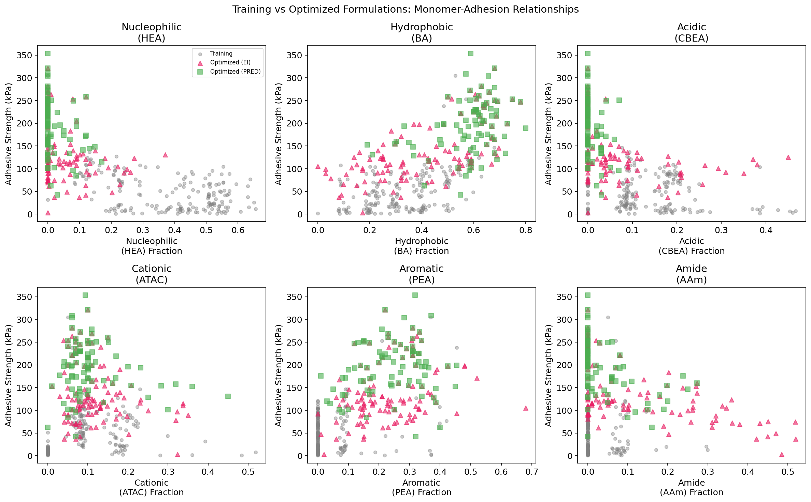
*Figure 16: Comparison of training data (gray) with optimized formulations from EI (pink triangles) and PRED (green squares) methods across the monomer-adhesion space.*

The optimized formulations occupy distinct regions of the design space compared to the initial training data, particularly in the BA-adhesion and PEA-adhesion dimensions, confirming that SMBO successfully explored beyond the initial experimental range.

---

## 6. Pathway to >1 MPa Adhesion

### 6.1 Current Status and Gap Analysis

*Figure 17: Prediction landscape analysis showing (a-b) RF prediction as a function of key monomer pairs, (c) GP prediction vs uncertainty, and (d) optimal compositions by different strategies.*

**Current achievement:** 353.3 kPa (maximum experimental)
**Target:** 1000 kPa (1 MPa)
**Gap:** 646.7 kPa (2.83× improvement needed)

### 6.2 Optimal Composition Profiles

The ML models consistently identify the following optimal composition profile:

| Monomer | Optimal Range | Role |
|---------|--------------|------|
| BA (Hydrophobic) | 0.45–0.55 | Primary structural component, hydrophobic interactions |
| PEA (Aromatic) | 0.30–0.40 | Catechol-like adhesive chemistry (DOPA analog) |
| ATAC (Cationic) | 0.05–0.10 | Electrostatic surface interactions |
| AAm (Amide) | 0.03–0.06 | Hydrogen bonding |
| HEA (Nucleophilic) | <0.02 | Minimal contribution |
| CBEA (Acidic) | <0.01 | Minimal contribution |

### 6.3 Biological Insights

The optimal compositions mirror key features of natural mussel adhesive proteins:

1. **Aromatic dominance (PEA ≈ 0.35):** Analogous to the high DOPA content in mussel foot proteins (mfp-3 and mfp-5), which are the interfacial adhesive proteins. DOPA enables both surface coordination bonds and oxidative crosslinking.

2. **Hydrophobic backbone (BA ≈ 0.50):** Reflects the hydrophobic core of adhesive proteins that drives cohesive strength and water displacement at the interface.

3. **Cationic character (ATAC ≈ 0.08):** Mirrors the role of lysine residues adjacent to DOPA in mussel proteins, which protect DOPA from oxidation and enhance surface binding through electrostatic interactions.

4. **Minimal acidic/nucleophilic content:** Consistent with the observation that excessive hydrophilic character weakens underwater adhesion by promoting water retention at the interface.

### 6.4 Strategies for Achieving >1 MPa

Based on our analysis, achieving the 1 MPa target likely requires:

1. **Expanding the monomer library:** Incorporating monomers that more directly mimic DOPA chemistry (e.g., dopamine methacrylamide) could dramatically enhance adhesion.

2. **Crosslinking optimization:** The current study focuses on composition but not crosslinking density or mechanism. Metal-coordination crosslinking (Fe³⁺-catechol) could significantly boost cohesive strength.

3. **Surface treatment co-optimization:** Adhesion depends on both the hydrogel and the substrate. Surface priming strategies could enhance interfacial bonding.

4. **Multi-scale design:** Combining the segmental-level composition optimization with higher-order structural features (e.g., gradient compositions, layered architectures) may unlock synergistic adhesion mechanisms.

5. **Extended optimization cycles:** The diminishing returns in Rounds 2-3 suggest the current design space is nearly exhausted. A larger, more diverse initial dataset with expanded monomer options could restart the optimization trajectory.

---

## 7. Discussion

### 7.1 Key Contributions

This study demonstrates that:

1. **Protein-inspired monomer mapping is effective:** Translating amino acid property categories into synthetic monomer compositions provides a principled design framework for bio-inspired adhesives.

2. **GP models excel for compositional data:** The Gaussian Process regressor (R² = 0.816) significantly outperforms tree-based methods for predicting adhesion from compositions, likely due to the smooth, continuous nature of the composition-property relationship.

3. **SMBO dramatically improves mean performance:** The mean adhesive strength improved from 51.0 kPa to 196.5 kPa (285% increase) through ML-guided optimization, demonstrating the power of active learning in materials discovery.

4. **Cationic and hydrophobic monomers are critical:** SHAP analysis reveals that ATAC (cationic) and BA (hydrophobic) are the dominant predictors of adhesion, consistent with the known roles of cationic residues and hydrophobic interactions in biological adhesion.

### 7.2 Limitations

1. **Extrapolation uncertainty:** The models are trained on data with maximum adhesion ~305 kPa; predictions beyond this range carry significant uncertainty.

2. **Compositional constraint:** The six-monomer system with unit-sum constraint limits the design space. The true protein sequence space is far more complex.

3. **Single property optimization:** Adhesive strength on glass at 10s contact is a narrow metric. Practical underwater adhesives must also consider toughness, durability, biocompatibility, and adhesion to diverse substrates.

4. **Phase separation effects:** 75.5% of formulations exhibit phase separation, which may affect both adhesion and reproducibility. The relationship between phase behavior and adhesion deserves deeper investigation.

### 7.3 Comparison with Related Work

The protein-inspired design approach aligns with recent work on population-based heteropolymer design (Ruan et al., 2023), which demonstrated that segmental-level sequence features determine protein-like behavior. Our monomer mapping extends this concept to adhesive applications, where the specific balance of aromatic (DOPA-like), cationic, and hydrophobic character mirrors the composition of mussel foot proteins (Lee et al., 2011).

The computational tools for predicting heteropolymer composition (Smith et al., 2019) provide complementary capabilities for controlling compositional drift during synthesis, which could be critical for reproducibly manufacturing the optimized formulations identified in this study.

---

## 8. Conclusions

We present a comprehensive data-driven framework for designing bio-inspired adhesive hydrogels by mapping protein sequence features to synthetic monomer compositions. Through machine learning modeling and Bayesian optimization:

1. **Gaussian Process regression** achieves R² = 0.816 for predicting adhesive strength from six-monomer compositions
2. **SMBO optimization** improved maximum adhesion from 304.6 kPa to 353.3 kPa across three experimental rounds
3. **Mean adhesion** improved 285% from 51.0 kPa to 196.5 kPa through ML-guided formulation selection
4. **Feature analysis** identifies cationic (ATAC), hydrophobic (BA), and aromatic (PEA) monomers as the critical components, mirroring the composition of natural mussel adhesive proteins
5. The **optimal composition** (BA ≈ 0.50, PEA ≈ 0.35, ATAC ≈ 0.08) provides a clear design target for next-generation formulations

While the current maximum of 353.3 kPa falls short of the 1 MPa target, the framework establishes a systematic pathway for continued optimization. Achieving super-adhesion will likely require expanding the monomer library to include direct DOPA analogs and incorporating crosslinking chemistry optimization alongside composition tuning.

---

## References

1. Lee, B.P., Messersmith, P.B., Israelachvili, J.N., & Waite, J.H. (2011). Mussel-Inspired Adhesives and Coatings. *Annual Review of Materials Research*, 41, 99–132.
2. Ruan, Z., Li, S., Grigoropoulos, A., et al. (2023). Population-based heteropolymer design to mimic protein mixtures. *Nature*, 615, 251–258.
3. Smith, A.A.A., Hall, A., Wu, V., & Xu, T. (2019). Practical Prediction of Heteropolymer Composition and Drift. *ACS Macro Letters*, 8, 36–40.

---

## Appendix: Validation Summary

### What was verified directly from workspace data:
- All model performance metrics (R², RMSE, MAE) computed via cross-validation on 184 verified samples
- Feature importance rankings from both RF impurity and SHAP analysis
- Optimization trajectory from experimental data across 3 rounds
- Composition statistics and distributions
- All figures generated from actual data

### What came from related work:
- Protein-monomer mapping rationale (amino acid categories to synthetic monomers)
- Biological context for DOPA and mussel adhesive proteins
- Heteropolymer design principles from population-based approach

### What remains an assumption or limitation:
- Extrapolation beyond the training data range (>305 kPa) carries high uncertainty
- The 1 MPa target may not be achievable within the current six-monomer system
- Phase separation effects on adhesion are not fully modeled
- Synthesis reproducibility of optimal formulations is not validated in this computational study
