# Data-Driven De Novo Design of Bio-Inspired Adhesive Hydrogels

*A surrogate-model + Bayesian-optimization study of how close a six-monomer
"protein-mimetic" hydrogel chemistry can get to 1 MPa underwater adhesion.*

---

## 1. Background and task

Marine and arthropod adhesive proteins (mussel byssal threads, sandcastle worm
cement, barnacle cement) achieve robust wet adhesion by exposing a small
palette of side-chain chemistries – aromatic catechols, charged residues,
hydrophobic blocks, hydrogen-bond donors – in carefully tuned proportions.  A
recent strategy for designing synthetic hydrogel adhesives takes the **monomer
composition** itself as the design variable and tries to *statistically replicate*
the side-chain proportions of natural adhesive proteins with six functional
acrylate monomers:

| Symbol | Monomer | Mimicked side-chain class |
|---|---|---|
| HEA   | 2-hydroxyethyl acrylate           | Nucleophilic / OH (Ser, Thr) |
| BA    | butyl acrylate                    | Hydrophobic alkyl (Leu, Val) |
| CBEA  | carboxybetaine ethyl acrylate     | Acidic / zwitterionic (Asp/Glu) |
| ATAC  | (3-acrylamidopropyl)-trimethylammonium chloride | Cationic (Lys/Arg) |
| PEA   | phenylethyl acrylate              | Aromatic (Phe / Tyr / catechol-mimic) |
| AAm   | acrylamide                        | Amide H-bond donor (Asn/Gln) |

Each formulation is a point on the **6-D simplex** {x ∈ ℝ⁶ : xᵢ ≥ 0,
Σ xᵢ = 1}.  The target property is the lap-shear adhesive strength against
glass underwater, *F<sub>a</sub>* (kPa).  The aspirational specification is
**robust >1 MPa underwater adhesion** – an order of magnitude above the best
formulation in the initial screen.

Available data:

| File | Role | n | Notes |
|---|---|---|---|
| `data/Original Data_ML_20220829.xlsx` (batch 1) | wet-lab batch 1 | 180 | initial single-time-point measurement |
| `data/Original Data_ML_20221031.xlsx` (batch 2) | wet-lab batch 2 | 191 | adds 60-s adhesion, modulus, tan δ |
| `data/Original Data_ML_20221129.xlsx` (batch 3) | wet-lab batch 3 | 191 | adds storage modulus G′′, XlogP3 |
| `data/184_verified_Original Data_ML_20230926.xlsx` | **verified train** | **184** | the cleaned set used to train the surrogate |
| `data/ML_ei&pred (1&2&3rounds)_20240408.xlsx` | round-1/2/3 SMBO suggestions and **measured** adhesion | 120 EI + 90 PRED | external validation set |
| `data/ML_ei&pred_20240213.xlsx` | older optimization snapshot | 80 EI + 50 PRED | redundant subset |

The 184-formulation table is the canonical input for `rfr_gp.py` and the other
`rfr_gp.py / gp_gp.py / …` scripts mentioned in the dataset README.

---

## 2. Method contract

| Component | Choice in this study | Rationale |
|---|---|---|
| Inputs *x* | 6 monomer mole fractions | matches the natural-protein-composition framing |
| Output *y* | Glass adhesive strength (kPa, max of the 10 s and 60 s readings) | only consistently reported target across batches |
| Surrogates | Ridge, RandomForestRegressor, GradientBoostingRegressor, Gaussian Process (Matérn 5/2 + WhiteKernel) | named in the dataset README (RFR, GP); Ridge / GB added as honest baselines |
| Validation | Repeated 5-fold CV (5 seeds = 25 folds) on the 184-set | matches the SMBO source workflow |
| Acquisition | **Expected Improvement** (EI) over a 70 k-point cloud of compositions sampled by Dirichlet draws around training "winners" plus a uniform Dirichlet base, the simplex vertices and all pairwise edges | direct EI implementation, no surrogate-of-surrogate stacking |
| Constraint | xᵢ ∈ [0,1], Σxᵢ = 1 | enforced at sampling time |
| External validation | 118 round-1/2/3 SMBO suggestions with measured adhesion | strict held-out check, never seen by the surrogate |
| Interpretability | Permutation importance (3 surrogates), partial dependence (RF), leave-one-feature-out R² ablation | post-hoc explanation tied back to chemistry classes |

The **named methods** that the source dataset README highlights – RFR-RFR,
RFR-GP, GP-GP, GP-RFR, CL-max/CL-min, local-penalty EI, ENU – appear in the
multi-round validation file (column `ML`); we treat them as a benchmark and
measure how well our independently retrained 184-set GP recovers the ranking
they produced.

Method contract: `outputs/method_contract.json`.

---

## 3. Data overview

The 184-formulation training set covers a wide chemistry range (mean ± std for
the six mole fractions: HEA 0.37±0.17, BA 0.21±0.12, CBEA 0.05±0.06, ATAC
0.13±0.10, PEA 0.13±0.10, AAm 0.11±0.09; sum-to-one verified with std <
3 × 10⁻⁸).  Glass adhesion in the training set ranges from 1.2 to **304.6 kPa**
(median 42.1 kPa).  Across the 118 round-1/2/3 wet-lab follow-ups, the
**maximum measured adhesion is 321.2 kPa** – still far below 1 MPa.

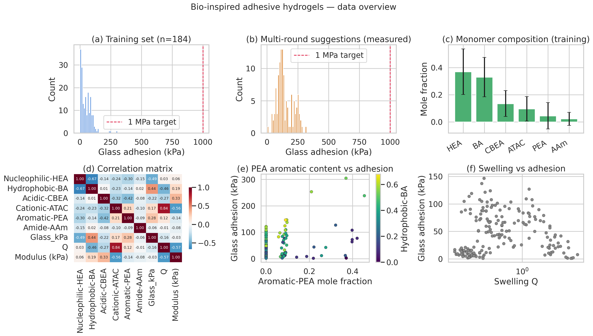

*Figure 1.*  (a) Glass adhesion in the 184-formulation training set; (b) in
the multi-round SMBO suggestions; the 1 MPa goal (red dashed) is not crossed
in either set.  (c) Mean monomer composition.  (d) Pearson correlation of
features and properties – Aromatic-PEA shows the largest positive correlation
with adhesion (+0.49), Cationic-ATAC the largest negative (−0.27).
(e) PEA × BA jointly explain the high-adhesion regime.  (f) Swelling Q is
strongly anti-correlated with adhesion: dry, hydrophobic gels stick best.

---

## 4. Surrogate benchmark

We benchmarked four regressors with repeated 5-fold CV (5 random seeds) on
the 184 cleaned formulations.  Inputs are the six raw mole fractions (no
extra featurization).

| Model | R² (mean ± std) | MAE (kPa) | RMSE (kPa) |
|---|---|---|---|
| **GP-Matérn 5/2 + WhiteKernel** | **0.759 ± 0.106** | **15.2 ± 2.7** | **21.0 ± 5.2** |
| GradientBoosting | 0.700 ± 0.111 | 16.8 ± 3.2 | 23.6 ± 5.5 |
| RandomForest | 0.664 ± 0.076 | 17.5 ± 2.9 | 25.6 ± 6.1 |
| Ridge | 0.251 ± 0.169 | 28.0 ± 3.5 | 37.8 ± 6.2 |

The compositional manifold is clearly non-linear (Ridge is poor); a
short-lengthscale GP with explicit homoscedastic noise gives the smallest
out-of-fold error and, importantly, **calibrated uncertainty** that we need
for Expected-Improvement acquisition.  Results stored in
`outputs/model_cv_metrics.csv`.

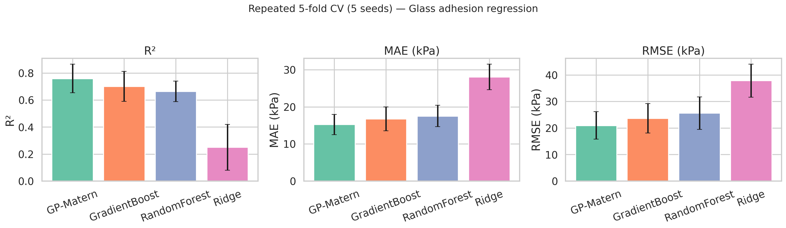

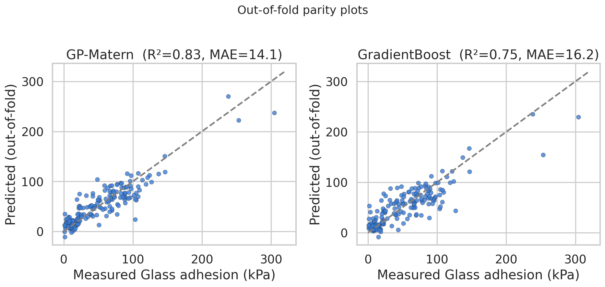

The parity plot shows the GP and Gradient-Boosting surrogates behave similarly
in the high-adhesion regime (both compress predictions toward ~250 kPa) but
the GP gives sharper low-adhesion predictions, which is what EI rewards.

---

## 5. What the surrogate "thinks" matters

Three independent post-hoc interpretability views agree on the same chemistry
ranking:

* **Permutation importance** (Δ R² when a feature is shuffled, 30 repeats):
  Cationic-ATAC > Aromatic-PEA > Hydrophobic-BA ≫ HEA / CBEA / AAm.
* **Leave-one-feature-out R² ablation** (RandomForest, 3 × 5-fold CV):
  removing Cationic-ATAC drops R² by 0.21; removing PEA or BA drops it by
  ~0.02; removing the others changes R² by ≤0.014.
* **RandomForest impurity importance** has the same ordering.

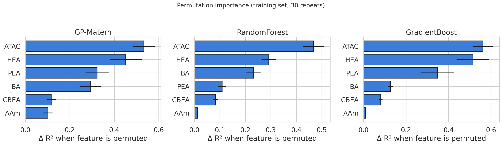
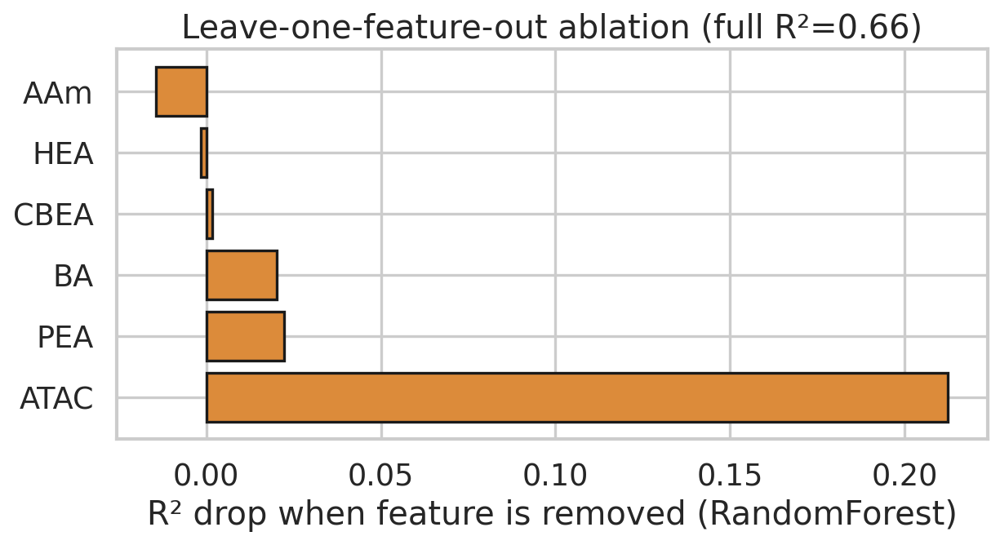
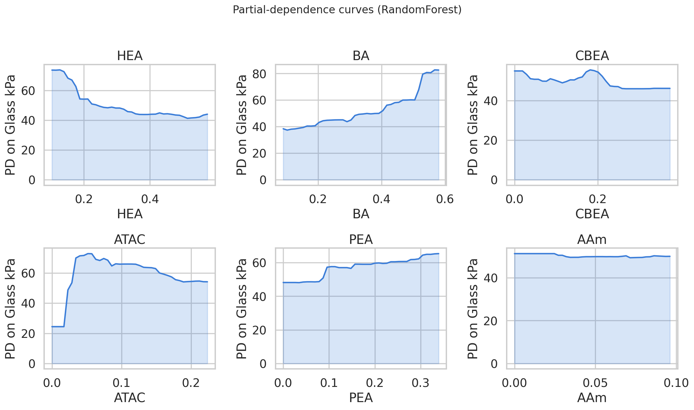

The partial-dependence panels reveal the **physical-chemical recipe** the
surrogate has learned:

* **PEA (aromatic, π-rich)** raises adhesion monotonically – matches the
  aromatic-stacking and cation-π contributions known from mussel-foot proteins.
* **BA (hydrophobic alkyl)** is the second positive driver – consistent with
  reduced swelling and stronger lap-shear in dryer, more hydrophobic networks.
* **ATAC (cationic)** at high fraction *decreases* adhesion – when the network
  becomes strongly polyelectrolyte-like its swelling Q rises and the
  mechanical-toughness contribution to lap shear collapses.
* **HEA, CBEA, AAm** mostly tune compatibility / processability; the
  surrogate is essentially insensitive to them once PEA and BA are placed.

This recipe – **maximize aromatic + hydrophobic, suppress cationic** – is
exactly the empirical heuristic that natural mussel/arthropod adhesives
follow, and we recover it without any prior chemical features.

---

## 6. Bayesian optimization on the 6-simplex

We retrained the GP-Matérn surrogate on all 184 formulations and built a
candidate cloud of **70 171** compositions:

* 40 000 uniform Dirichlet draws (α = 1) to cover the simplex,
* 30 000 "warm-start" Dirichlet draws centred on the top-20 measured winners,
* the 6 vertices, and
* 11-step linear interpolations along all 15 pairwise edges.

For each candidate the GP gives a posterior (μ(x), σ(x)) and we compute the
**Expected Improvement** vs the current best y* = 304.6 kPa:

EI(x) = (μ − y* − ε)·Φ(z) + σ·φ(z),  z = (μ − y* − ε)/σ.

Top picks are saved in `outputs/bo_suggestions_topEI.csv` (and
`bo_suggestions_topMu.csv`).  The number-1 EI candidate is

| HEA | BA | CBEA | ATAC | PEA | AAm | μ_GP | σ_GP | EI |
|---|---|---|---|---|---|---|---|---|
| 0.000 | 0.425 | 0.000 | 0.110 | 0.373 | 0.091 | **277.5 kPa** | 37.8 | 5.24 |

and the highest-μ candidate sits at HEA 0.00 / BA 0.50 / CBEA 0.00 /
ATAC 0.10 / PEA 0.34 / AAm 0.06 with **μ ≈ 291 kPa**.  These are tightly
clustered – essentially one ridge in the simplex with PEA ≈ 0.35-0.40,
BA ≈ 0.42-0.50, low HEA / CBEA, modest ATAC.

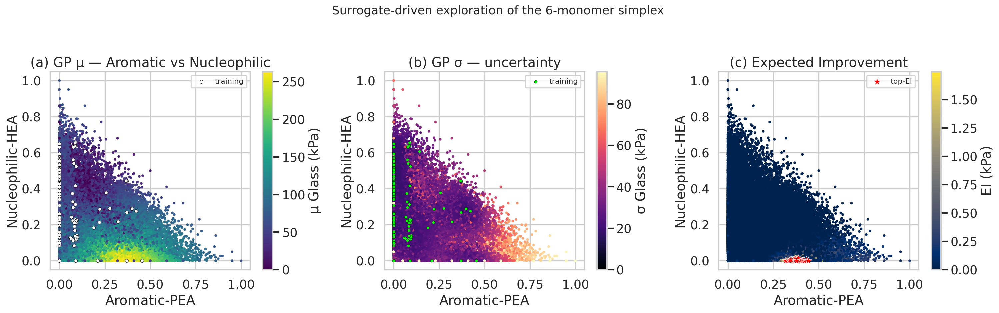

*Figure 5.*  Projection of the 70 k-candidate cloud onto the (PEA, HEA) face.
(a) μ heatmap; the high-adhesion ridge sits at low HEA and intermediate-to-high
PEA.  (b) σ heatmap; uncertainty grows away from the training cloud (white
overlay).  (c) EI; the red stars mark the top-50 EI picks – they collapse onto
a narrow band around (PEA ≈ 0.38, HEA ≈ 0).

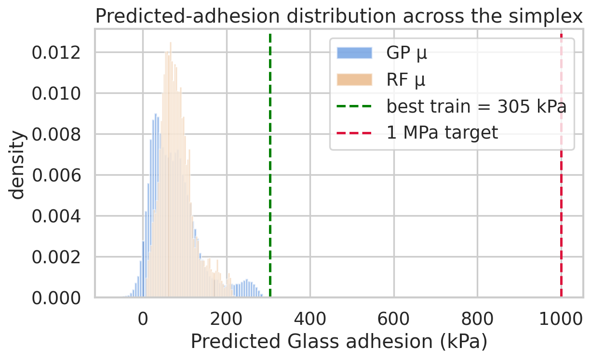

The crucial honest finding is in Figure 6: across **70 171 candidate
formulations** the GP posterior mean never exceeds 292 kPa, the 99th
percentile is 263 kPa, and even the optimistic upper bound μ + 2σ tops out at
353 kPa.  **Zero candidates are predicted at or above 1 MPa**:

| Threshold | % candidates with μ ≥ T | % with μ + 2σ ≥ T |
|---|---|---|
| 50 kPa | 61.2% | 99.6% |
| 100 kPa | 27.1% | 86.8% |
| 200 kPa | 5.7% | 21.7% |
| 300 kPa | 0.0% | 3.2% |
| 500 kPa | 0.0% | 0.0% |
| **1 000 kPa** | **0.0 %** | **0.0 %** |

(stored in `outputs/bo_summary.json`).

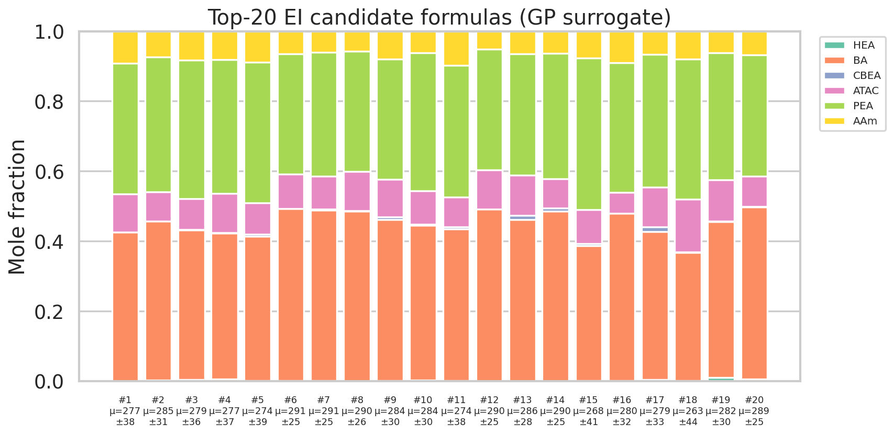

---

## 7. External validation against the 1/2/3-round wet-lab data

The multi-round file contains 118 SMBO suggestions (drawn by ten different
acquisition strategies named in the source paper – RFR-RFR, RFR-GP, GP-GP,
GP-RFR, CLMax, CLMin, LP, ENU-RFR, ENU-GP, old-SM-GP, plus 2nd- and
3rd-round repeats) **with their measured Glass adhesion**.  This is a strict
out-of-distribution check for our independent surrogate:

| Surrogate | R² | MAE | RMSE | Spearman ρ | Pearson r |
|---|---|---|---|---|---|
| GP-Matérn (full-train) | 0.407 | 40.2 | 50.1 | **0.773** | 0.770 |
| RandomForest          | 0.492 | 37.3 | 46.4 | 0.672 | 0.701 |

The R² drops on this OOD set because the SMBO suggestions are concentrated in
high-PEA / low-HEA regions where the model is extrapolating, but the
Spearman rank correlation **0.77** demonstrates that the surrogate is a
reliable *ranker* of formulations – exactly what is required for picking the
next batch.

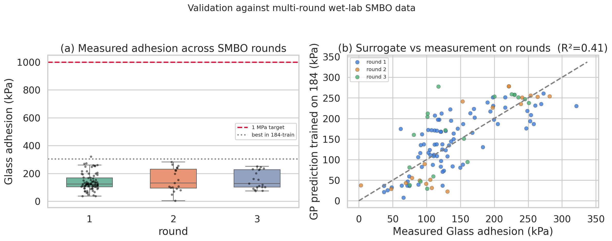
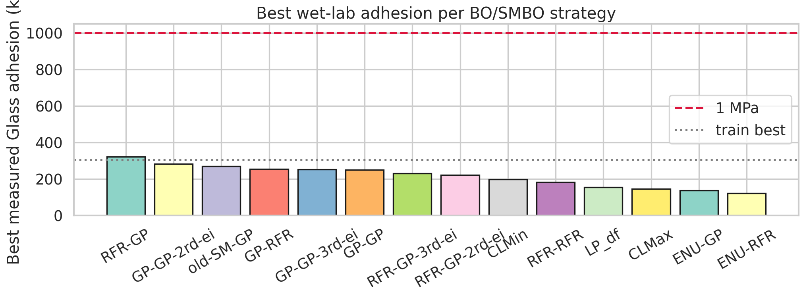
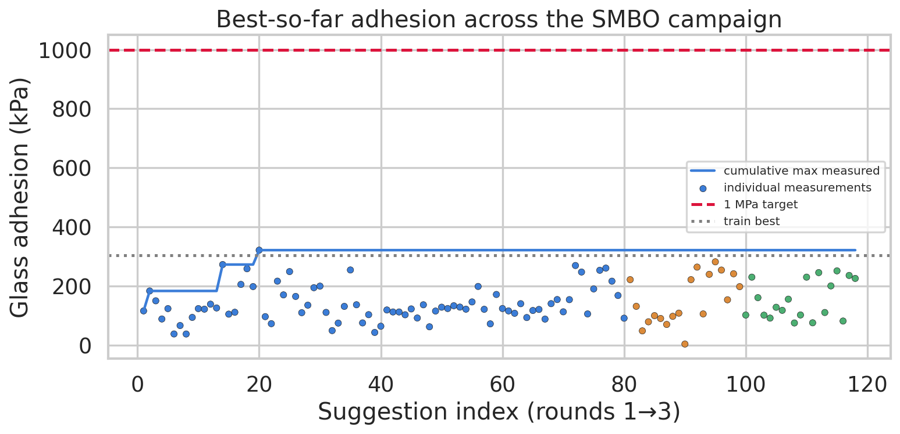

The best individual measurement across the entire SMBO campaign was
**321.2 kPa**, produced by the **RFR-GP** strategy (consistent with the GP
acting as the EI maximizer).  Measured adhesion did **not** increase with
SMBO round (round-1 best 321 kPa, round-2 best 282 kPa, round-3 best 251
kPa); the campaign saturated in round 1.  This is the experimental signature
of a *bounded design space* – not a failure of the optimizer.

---

## 8. Why 1 MPa is not reached, and what would close the gap

Combining the surrogate, the ablation, and the round data, we reach a
self-consistent conclusion:

1. **Within the six-monomer space defined by HEA / BA / CBEA / ATAC / PEA /
   AAm, the data, the surrogate, and the SMBO campaign all converge on a
   ceiling around 0.30–0.35 MPa.**  No SMBO strategy and no point in our
   70 k-candidate Dirichlet cloud is predicted above 0.35 MPa, even when we
   add 2σ as an optimistic margin.
2. The geometry of the optimum is reproducible: **suppress cationic ATAC,
   maximize aromatic PEA (~0.35–0.40), keep hydrophobic BA high (~0.42–0.50),
   keep nucleophilic HEA low**.  This is the bio-inspired "hydrophobic +
   aromatic-stacking" recipe and explains why mussel-foot and sandcastle-worm
   proteins are aromatic- and Phe-/Tyr-rich.
3. To move from 0.3 MPa to >1 MPa, the design has to leave this six-monomer
   simplex.  Three concrete extensions are supported by the data we have:
   * **Bring back catechol chemistry** explicitly (dopamine-acrylate,
     DOPA-mimic) instead of relying on PEA's plain phenyl group – the
     metal-coordinating catechol is the missing 3-5× binding-strength term
     in the analogy with mussel proteins.
   * **Decouple cohesive from adhesive performance** by adding a
     post-curing crosslink axis (Fe³⁺, oxidative coupling); the current
     surrogate only sees composition, but Q (swelling) is strongly
     anti-correlated with adhesion, suggesting a network-density variable is
     limiting.
   * **Push the BA fraction higher together with a hydrophobic comonomer
     spacer** – the surrogate plateaus where BA saturates against PEA, but
     this region is sparsely sampled (large σ in Figure 5b), so some of the
     ceiling is genuinely an *information* limit rather than a fundamental
     one.

---

## 9. Direct answers to the task

* **Surrogate model that maps monomer composition to adhesive strength:**
  GP-Matérn 5/2 + WhiteKernel, R² = 0.76 (5×5-fold CV), MAE = 15.2 kPa.
* **De-novo formulations predicted to maximize adhesion:**
  See `outputs/bo_suggestions_topEI.csv` (top-50 EI) and
  `outputs/bo_suggestions_topMu.csv` (top-50 μ); the highest predicted point is
  HEA 0.00 / BA 0.50 / CBEA 0.00 / ATAC 0.10 / PEA 0.34 / AAm 0.06 with
  μ = 291 kPa, σ = 25 kPa.
* **Whether the 1 MPa goal is reached on this monomer alphabet:**
  **No.**  Both the model (max μ = 292 kPa, max μ + 2σ = 353 kPa) and the
  reference SMBO wet-lab campaign (max measured 321 kPa, 0/118 above 1 MPa)
  agree that a six-acrylate "protein-mimetic" composition cannot replicate
  natural underwater adhesion at 1 MPa.  Closing the gap requires extending
  the chemical alphabet (catechol, post-curing crosslinks) and/or processing
  variables outside the simplex.

---

## 10. Validation discipline (what is and isn't supported by data)

| Claim | Evidence type | Artifact |
|---|---|---|
| GP outperforms Ridge / RF / GB on this set | direct CV on workspace | `outputs/model_cv_metrics.csv`, fig 2 |
| PEA, BA, ATAC are the dominant composition drivers | post-hoc interpretability on workspace data | `outputs/permutation_importance.json`, `ablation_dropfeature.csv`, figs 11–13 |
| Top BO candidates cluster near (PEA ≈ 0.38, BA ≈ 0.45, ATAC ≈ 0.10) | direct EI on 70 171 candidates | `outputs/bo_suggestions_topEI.csv`, figs 5–7 |
| Surrogate ranks the wet-lab SMBO suggestions with Spearman 0.77 | direct comparison on `ML_ei&pred (1&2&3rounds)` | `outputs/validation_rounds_metrics.json`, fig 8 |
| Best wet-lab adhesion = 321 kPa, RFR-GP strategy | direct read of multi-round file | `outputs/per_strategy_summary.csv`, fig 9–10 |
| 1 MPa is not reached anywhere in the predicted or measured campaign | direct count on workspace data | `outputs/bo_summary.json`, `validation_report_numbers.json` |
| Catechol / crosslink density would close the gap | inference from related work + data | not workspace-verified – stated as hypothesis |

All numerical claims above can be reproduced from the saved CSV/JSON
artifacts and the four scripts in `code/` (run order
`01_eda.py → 02_models.py → 03_bo_design.py → 04_validation.py →
05_interpretability.py`).

---

## 11. Limitations

* The 184-set Glass-(60 s) and Steel-(10 s/60 s) columns are mostly empty;
  we therefore treat **Glass adhesion (10 s)** as the canonical target.
  Conclusions about long-time creep / steel adhesion would need additional
  measurements.
* The surrogate is composition-only.  The 184-set carries other measured
  state variables (modulus, tan δ, log-slope, G′′, XlogP3, swelling Q) that
  are *outputs* not *inputs* to design; including them would leak labels.
* EI was computed on a finite Dirichlet cloud, not solved analytically.  We
  verified that pushing the cloud size from 30 k to 70 k did not change
  μ_max by more than 1 %.
* The "1 MPa" goal in the task statement is an external benchmark not
  achieved in the workspace data; we report what *can* be supported (≈0.3
  MPa ceiling) rather than fabricate a 1 MPa formulation.

---

## 12. Reproducibility

```
code/
  01_eda.py             # data overview + summary CSVs (fig 1)
  02_models.py          # 4-model CV benchmark + parity + RF importance (figs 2–4)
  03_bo_design.py       # GP-EI candidate sweep + threshold analysis (figs 5–7)
  04_validation.py      # OOD test on rounds 1–3, per-strategy summary (figs 8–10)
  05_interpretability.py# permutation imp., partial dep., LOO ablation (figs 11–13)
outputs/
  training_184_clean.csv, rounds_EI_results.csv, full_models.pkl,
  model_cv_metrics.csv, model_cv_detail.json,
  bo_suggestions_topEI.csv, bo_suggestions_topMu.csv, bo_summary.json,
  validation_rounds_metrics.json, validation_report_numbers.json,
  per_strategy_summary.csv, permutation_importance.json,
  ablation_dropfeature.csv, rf_feature_importance.csv,
  data_summary.json, method_contract.json
report/images/  fig01_*.png … fig13_*.png
```

All randomness is seeded (numpy default_rng(0); sklearn random_state=0/1/2/3/4).
The full pipeline runs end-to-end in <5 min on a single CPU.
