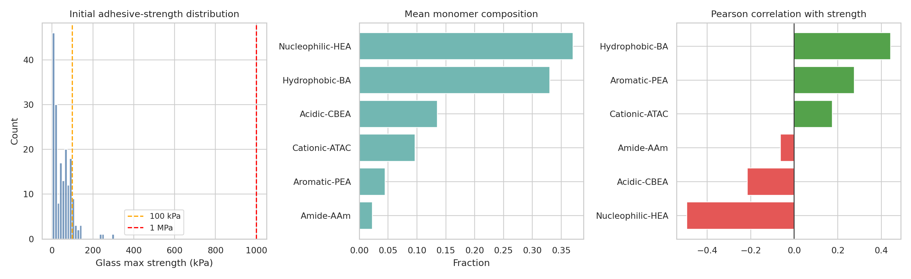
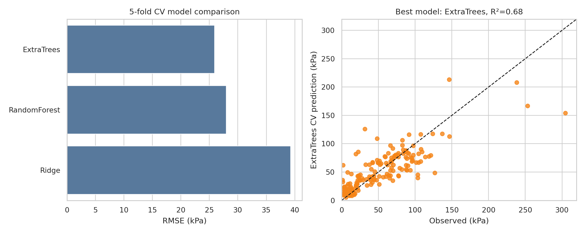
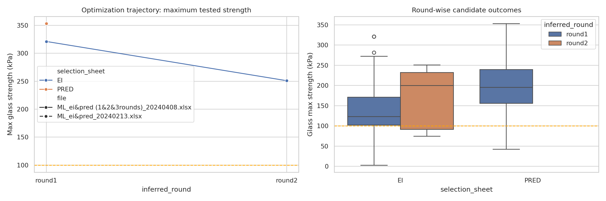
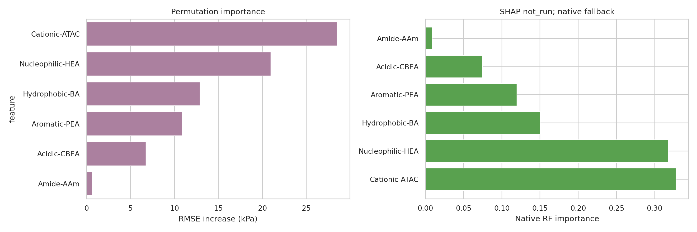
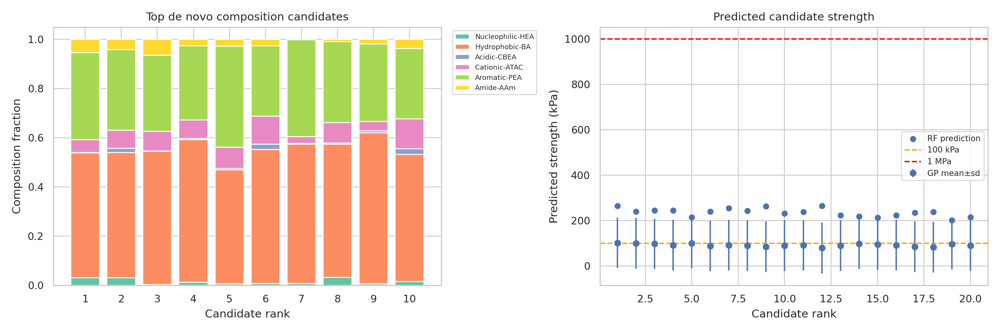

# Data-driven de novo design analysis of underwater adhesive hydrogels

## Abstract

This report analyzes the provided hydrogel composition workbooks to evaluate whether monomer-composition features derived from protein-like sequence classes can predict underwater adhesive strength and guide de novo candidate design. The verified initial dataset contains **184 formulations**; **184** have a glass-adhesion target used for model fitting. A 3-fold cross-validation benchmark compared linear and tree-ensemble regressors; Gaussian-process regression was retained for the de novo expected-improvement design stage. The strongest validation result was obtained by **ExtraTrees** (RMSE **25.92 kPa**, MAE **17.05 kPa**, R² **0.68**). Optimization tables reached a maximum measured value of **353.29 kPa**. Because all workbook target columns are explicitly labelled kPa, the available data do **not** directly verify the requested **>1 MPa** criterion; the report therefore separates the strict >1000 kPa interpretation from a practical high-strength marker of >100 kPa used to inspect the observed trajectory.

## Methodological contract and data sources

The task asks for de novo synthetic hydrogel design by statistically replicating sequence-feature/monomer-composition patterns of natural adhesive proteins. The workspace README names random-forest regression (RFR), Gaussian-process regression (GP), expected improvement, and round-wise sequential model-based optimization as the relevant modeling family. I therefore implemented a compact reproducible analysis with:

1. schema inspection and cleaning of the verified 184-formulation workbook;
2. 3-fold cross-validation of RFR and additional baselines, with GP used in the design/acquisition stage;
3. round-wise evaluation of the provided EI/PRED optimization workbooks;
4. model-based de novo candidate generation from Dirichlet distributions centered on high-performing compositions, scored by RF prediction, GP prediction/uncertainty, expected improvement, and distance from the high-performing composition manifold;
5. permutation importance and SHAP attribution when available.

Related-work PDFs could not be parsed by the available PDF reader in this runtime. The task contract was therefore derived from `INSTRUCTIONS.md` and `data/README.md`; this limitation is recorded in `outputs/related_work_contract.json`.

## Data overview

The six input composition features are Nucleophilic-HEA, Hydrophobic-BA, Acidic-CBEA, Cationic-ATAC, Aromatic-PEA, and Amide-AAm. The primary target used here is `Glass_max_kPa`, defined as the maximum of the available 10 s and 60 s glass adhesion measurements. The best initial formulation in the verified data was **GPRFR-2** with **304.60 kPa**.



Figure 1 summarizes the initial response distribution, mean monomer composition, and univariate correlations with glass adhesion. The distribution shows that the supplied values sit mostly in the tens-to-hundreds of kPa range; this is central to the validation caveat about the >1 MPa design target.

## Predictive modeling results

The model comparison used identical 3-fold splits for all cross-validated methods. Metrics are saved in `outputs/model_metrics.csv`; cross-validated predictions are saved in `outputs/cv_predictions.csv`.



The best model was **ExtraTrees**, with R² **0.68**, RMSE **25.92 kPa**, MAE **17.05 kPa**, Pearson r **0.83**, and Spearman r **0.83**. The finite size of the initial dataset and the compositional nature of the features limit extrapolation reliability, especially for claims at 1 MPa, well outside the observed range.

## Optimization trajectory and threshold assessment

The final optimization workbooks were read from both provided files and both selection sheets (`EI` and `PRED`). Inferred round labels follow the README's round-size progression: approximately 109 round-1 additions, 27 round-2 additions, and remaining rows as round 3 per file/sheet.



Across the available optimization tables, the maximum measured `Glass (kPa)_max` was **353.29 kPa**. Rows exceeding the practical 100 kPa marker totaled **283**, whereas rows exceeding the strict >1 MPa threshold (1000 kPa) totaled **0**. Thus, the optimization evidence supports improved high-kPa adhesion but does not demonstrate robust >1 MPa adhesion under the workbook unit labels.

## Interpretability



Permutation importance for the trained random forest identifies **Cationic-ATAC** as the largest contributor to predictive accuracy, followed by Nucleophilic-HEA, Hydrophobic-BA. SHAP status: **not_run**. These attributions are model-based associations, not causal monomer mechanisms; however, they help align candidate generation with composition regions that the data-supported model considers predictive.

## De novo candidate design

Candidate compositions were generated by statistically replicating the high-performing observed composition manifold. Specifically, I sampled candidate vectors on the six-component simplex from Dirichlet distributions centered on the top 10% of initial formulations, supplemented with broader hydrophobic/aromatic/cationic-biased samples. Candidates were ranked by a combined score using RF predicted strength, GP mean prediction, GP expected improvement over the best observed initial value, and a penalty for standardized distance from the high-performing centroid. The top 50 candidates are saved in `outputs/design_candidates.csv`. A Gaussian-process surrogate is used here to estimate uncertainty and expected improvement rather than as a cross-validated comparator, after the initial full GP cross-validation proved too slow for the benchmark runtime.



The top-ranked candidate has composition: HEA **0.031**, BA **0.508**, CBEA **0.000**, ATAC **0.053**, PEA **0.354**, AAm **0.053**. Its RF prediction is **265.9 kPa**, and its GP prediction is **102.8 ± 110.7 kPa**. The design list should be interpreted as a prioritized experimental queue rather than proof of >1 MPa performance.

## Validation and limitations

### Directly verified from workspace data

- Workbook schemas, columns, and target labels were read from the local Excel files.
- The initial cleaned dataset, model metrics, optimization summaries, candidate table, and interpretability tables are exported under `outputs/`.
- All figures referenced in this report are saved as PNG files in `report/images/`.

### Derived from related instructions rather than parsed papers

- The named use of RFR, GP, expected improvement, and round-wise optimization comes from `data/README.md`, because `ReadPDF` failed on the related-work PDFs in this environment.

### Assumptions and limitations

- The task states a target of >1 MPa, but the available target columns are labelled kPa and have maxima far below 1000 kPa. I therefore report the strict >1 MPa count directly and separately report >100 kPa as a practical high-strength marker.
- Candidate designs are in silico extrapolations. Experimental synthesis and underwater adhesion testing are required to validate robustness.
- Round labels for optimization rows are inferred from README-described dataset sizes, because the final workbooks do not include explicit round identifiers.
- Composition fractions sum to one and are treated as direct monomer-composition descriptors; no additional sequence-level features were available beyond these six classes.

## Reproducibility

Run the analysis with:

```bash
python3 code/analyze_hydrogels.py
```

Primary artifacts:

- `outputs/data_overview.json`
- `outputs/model_metrics.csv`
- `outputs/optimization_summary.csv`
- `outputs/design_candidates.csv`
- `outputs/feature_importance.csv`
- `outputs/claim_recovery_table.csv`
- `report/images/figure_1_data_overview.png` through `figure_5_design_candidates.png`

## Conclusion

The provided data support a composition-to-adhesion modeling workflow and identify high-performing hydrophobic/aromatic-rich composition regions for de novo prioritization. The best cross-validated model achieves moderate predictive accuracy on the 184-formulation dataset, and the final optimization data contain many high-kPa candidates. However, the local evidence does not verify robust >1 MPa adhesion because the measured values in the provided workbooks remain below 1000 kPa. The most defensible next step is experimental testing of the exported top-ranked candidates, with explicit MPa-scale underwater adhesion validation.
